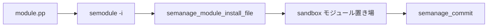

# 第16章 モジュールストアと semodule

> 本章で読むソース
>
> - [`libsemanage/src/modules.c`](https://github.com/SELinuxProject/selinux/blob/3.10/libsemanage/src/modules.c)
> - [`libsemanage/src/direct_api.c`](https://github.com/SELinuxProject/selinux/blob/3.10/libsemanage/src/direct_api.c)

## この章の狙い

モジュールパッケージの install、extract、list が `semanage_module_*` API と `direct_funcs` 経由でどうストアへ書き込まれるかを読む。

## 前提

第15章のハンドルとトランザクションを理解していること。

## semanage_module_install

接続とトランザクションを確認し、`modules_modified` を立てて `install` 関数ポインタを呼ぶ。

[`libsemanage/src/modules.c` L46-L62](https://github.com/SELinuxProject/selinux/blob/3.10/libsemanage/src/modules.c#L46-L62)

```c
int semanage_module_install(semanage_handle_t * sh,
			    char *module_data, size_t data_len, const char *name, const char *ext_lang)
{
	if (sh->funcs->install == NULL) {
		ERR(sh,
		    "No install function defined for this connection type.");
		return -1;
	} else if (!sh->is_connected) {
		ERR(sh, "Not connected.");
		return -1;
	} else if (!sh->is_in_transaction) {
		if (semanage_begin_transaction(sh) < 0) {
			return -1;
		}
	}
	sh->modules_modified = 1;
	return sh->funcs->install(sh, module_data, data_len, name, ext_lang);
}
```

ファイルパス指定版は `semanage_module_install_file` で同様に `install_file` へ委譲する。

[`libsemanage/src/modules.c` L65-L81](https://github.com/SELinuxProject/selinux/blob/3.10/libsemanage/src/modules.c#L65-L81)

```c
int semanage_module_install_file(semanage_handle_t * sh,
				 const char *module_name) {

	if (sh->funcs->install_file == NULL) {
		ERR(sh,
		    "No install function defined for this connection type.");
		return -1;
	} else if (!sh->is_connected) {
		ERR(sh, "Not connected.");
		return -1;
	} else if (!sh->is_in_transaction) {
		if (semanage_begin_transaction(sh) < 0) {
			return -1;
		}
	}
	sh->modules_modified = 1;
	return sh->funcs->install_file(sh, module_name);
}
```

## extract とメタデータ

`semanage_module_extract` はストアからモジュールバイナリを取り出し、CIL 抽出オプションをサポートする。

[`libsemanage/src/modules.c` L84-L93](https://github.com/SELinuxProject/selinux/blob/3.10/libsemanage/src/modules.c#L84-L93)

```c
int semanage_module_extract(semanage_handle_t * sh,
				 semanage_module_key_t *modkey,
				 int extract_cil,
				 void **mapped_data,
				 size_t *data_len,
				 semanage_module_info_t **modinfo) {
	if (sh->funcs->extract == NULL) {
		ERR(sh,
		    "No get function defined for this connection type.");
		return -1;
```

## direct install 実装

`semanage_direct_install_file` は圧縮 pp を読み込み、拡張子から言語を判定して `parse_module_headers` でモジュール名を取り出す。

[`libsemanage/src/direct_api.c` L1752-L1823](https://github.com/SELinuxProject/selinux/blob/3.10/libsemanage/src/direct_api.c#L1752-L1823)

```c
static int semanage_direct_install_file(semanage_handle_t * sh,
					const char *install_filename)
{

	int retval = -1;
	// ... (中略) ...
	if (strcmp(lang_ext, "pp") == 0) {
		retval = parse_module_headers(sh, contents.data, contents.len,
					      &module_name, &version);
		free(version);
		if (retval != 0)
			goto cleanup;
	}
	// ... (中略) ...
	retval = semanage_direct_install(sh, contents.data, contents.len,
					 module_name, lang_ext);
```

`parse_module_headers` は `sepol_module_package_info` で pp ヘッダから名前とバージョンを抽出する。

[`libsemanage/src/direct_api.c` L431-L450](https://github.com/SELinuxProject/selinux/blob/3.10/libsemanage/src/direct_api.c#L431-L450)

```c
static int parse_module_headers(semanage_handle_t * sh, char *module_data,
                               size_t data_len, char **module_name,
                               char **version)
{
       struct sepol_policy_file *pf;
       int file_type;
       *module_name = *version = NULL;
       // ... (中略) ...
       if (module_data != NULL && data_len > 0)
           sepol_module_package_info(pf, &file_type, module_name,
                                     version);
       sepol_policy_file_free(pf);

       return 0;
}
```

`semanage_direct_install_info` は HLL モジュールの CIL キャッシュを削除し、再コンパイルを強制する。

[`libsemanage/src/direct_api.c` L2884-L2902](https://github.com/SELinuxProject/selinux/blob/3.10/libsemanage/src/direct_api.c#L2884-L2902)

```c
	/* if this is an HLL, delete the CIL cache if it exists so it will get recompiled */
	if (type == SEMANAGE_MODULE_PATH_HLL) {
		ret = semanage_module_get_path(
				sh,
				modinfo,
				SEMANAGE_MODULE_PATH_CIL,
				path,
				sizeof(path));
		// ... (中略) ...
		ret = unlink(path);
		if (ret != 0 && errno != ENOENT) {
			ERR(sh, "Error while removing cached CIL file %s.", path);
			status = -3;
			goto cleanup;
		}
	}
```



## semanage_module_remove

remove も install と同様にトランザクション内で `modules_modified` を立てる。
`-r` オプションは `semanage_module_remove` へ到達する。

[`libsemanage/src/modules.c` L110-L122](https://github.com/SELinuxProject/selinux/blob/3.10/libsemanage/src/modules.c#L110-L122)

```c
int semanage_module_remove(semanage_handle_t * sh, char *module_name)
{
	if (sh->funcs->remove == NULL) {
		ERR(sh, "No remove function defined for this connection type.");
		return -1;
	} else if (!sh->is_connected) {
		ERR(sh, "Not connected.");
		return -1;
	} else if (!sh->is_in_transaction) {
		if (semanage_begin_transaction(sh) < 0) {
			return -1;
		}
	}
```

## サンドボックス配置

`semanage_direct_install_file` が pp ヘッダからモジュール名を取り出し、`semanage_direct_install` が `semanage_module_info_t` を組み立てる。
`semanage_direct_install_info` が sandbox へソースファイルを書き込む（上記 direct install 実装の引用）。
commit 時にアクティブモジュール一覧へ取り込まれる（第17章）。

## 高速化・最適化の工夫

トランザクション内の複数 install をまとめ、commit 1回で link と expand を実行する。
`modules_modified` フラグにより変更が無い commit での再ビルドを省略できる。

## まとめ

モジュール操作は semanage_module_* の薄いラッパと direct 実装がストア I/O を担う。

## 関連する章

- [第15章 ハンドル](15-semanage-handle.md)
- [第20章 semodule コマンド](../part06-utils/20-semodule-command.md)
