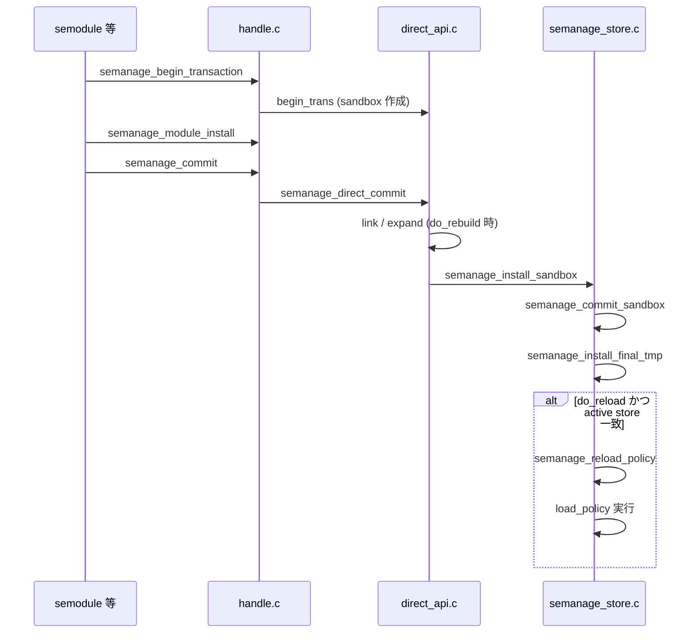

# 第17章 ポリシー commit と reload

> 本章で読むソース
>
> - [`libsemanage/src/handle.c`](https://github.com/SELinuxProject/selinux/blob/3.10/libsemanage/src/handle.c)
> - [`libsemanage/src/direct_api.c`](https://github.com/SELinuxProject/selinux/blob/3.10/libsemanage/src/direct_api.c)
> - [`libsemanage/src/policy_components.c`](https://github.com/SELinuxProject/selinux/blob/3.10/libsemanage/src/policy_components.c)
> - [`libsemanage/src/semanage_store.c`](https://github.com/SELinuxProject/selinux/blob/3.10/libsemanage/src/semanage_store.c)

## この章の狙い

libsemanage 3.10 の direct 接続におけるトランザクション開始からカーネル反映までの経路を追う。
`semanage_commit` が呼ぶ実装、`semanage_commit_components` の役割、`semanage_install_sandbox` が担う最終インストールを区別して理解する。

## 前提

- 第15章のハンドル生成と第16章のモジュール install を読んでいること
- v3.10 では `direct_funcs` のみが実装されており、リモートポリシーサーバー接続は本タグの範囲外であること

## 関数テーブルと commit 入口

`semanage_connect` 成功後、ハンドルは `direct_funcs` を指す。
`commit` スロットは `semanage_direct_commit` に結び付く。

[`libsemanage/src/direct_api.c` L108-L125](https://github.com/SELinuxProject/selinux/blob/3.10/libsemanage/src/direct_api.c#L108-L125)

```c
static const struct semanage_policy_table direct_funcs = {
	.get_serial = semanage_direct_get_serial,
	.destroy = semanage_direct_destroy,
	.disconnect = semanage_direct_disconnect,
	.begin_trans = semanage_direct_begintrans,
	.commit = semanage_direct_commit,
	.install = semanage_direct_install,
	.extract = semanage_direct_extract,
	.install_file = semanage_direct_install_file,
	.remove = semanage_direct_remove,
	.list = semanage_direct_list,
	.get_enabled = semanage_direct_get_enabled,
	.set_enabled = semanage_direct_set_enabled,
	.get_module_info = semanage_direct_get_module_info,
	.list_all = semanage_direct_list_all,
	.install_info = semanage_direct_install_info,
	.remove_key = semanage_direct_remove_key,
};
```

公開 API `semanage_commit` はトランザクションロックを確認してから `sh->funcs->commit` を呼ぶ。

[`libsemanage/src/handle.c` L407-L419](https://github.com/SELinuxProject/selinux/blob/3.10/libsemanage/src/handle.c#L407-L419)

```c
int semanage_commit(semanage_handle_t * sh)
{
	int retval;
	assert(sh != NULL && sh->funcs != NULL && sh->funcs->commit != NULL);
	if (!sh->is_in_transaction) {
		ERR(sh,
		    "Will not commit because caller does not have a transaction lock yet.");
		return -1;
	}
	retval = sh->funcs->commit(sh);
	sh->is_in_transaction = 0;
	sh->modules_modified = 0;
	return retval;
}
```

## トランザクション開始

`semanage_begin_transaction` は接続済みであることを確認し、`begin_trans` でサンドボックスディレクトリを用意する。

[`libsemanage/src/handle.c` L387-L403](https://github.com/SELinuxProject/selinux/blob/3.10/libsemanage/src/handle.c#L387-L403)

```c
int semanage_begin_transaction(semanage_handle_t * sh)
{
	assert(sh != NULL && sh->funcs != NULL
	       && sh->funcs->begin_trans != NULL);
	if (!sh->is_connected) {
		ERR(sh, "Not connected.");
		return -1;
	}
	if (sh->is_in_transaction) {
		return 0;
	}

	if (sh->funcs->begin_trans(sh) < 0) {
		return -1;
	}
	sh->is_in_transaction = 1;
	return 0;
}
```

direct 実装の `semanage_direct_begintrans` はトランザクションロック取得のあと `semanage_make_sandbox` と `semanage_make_final` を実行する。

[`libsemanage/src/direct_api.c` L408-L419](https://github.com/SELinuxProject/selinux/blob/3.10/libsemanage/src/direct_api.c#L408-L419)

```c
static int semanage_direct_begintrans(semanage_handle_t * sh)
{
	if (semanage_get_trans_lock(sh) < 0) {
		return -1;
	}
	if ((semanage_make_sandbox(sh)) < 0) {
		return -1;
	}
	if ((semanage_make_final(sh)) < 0) {
		return -1;
	}
	return 0;
}
```

## semanage_direct_commit の分岐

`semanage_direct_commit` はローカル各 dbase（port、bool、fcontext など）の変更フラグを見て、再ビルド要否 `do_rebuild` を決める。
`sh->do_rebuild` と `sh->modules_modified` の論理和が真ならモジュールの CIL コンパイルと link が走る。

[`libsemanage/src/direct_api.c` L1235-L1236](https://github.com/SELinuxProject/selinux/blob/3.10/libsemanage/src/direct_api.c#L1235-L1236)

```c
	/* Rebuild if explicitly requested or any module changes occurred. */
	do_rebuild = sh->do_rebuild | sh->modules_modified;
```

モジュール一覧が空なら再ビルドはスキップされる。

[`libsemanage/src/direct_api.c` L1323-L1332](https://github.com/SELinuxProject/selinux/blob/3.10/libsemanage/src/direct_api.c#L1323-L1332)

```c
	if (do_rebuild || sh->check_ext_changes) {
		retval = semanage_get_active_modules(sh, &modinfos, &num_modinfos);
		if (retval < 0) {
			goto cleanup;
		}

		/* No modules - nothing to rebuild. */
		if (num_modinfos == 0) {
			goto cleanup;
		}
```

再ビルドパイプラインの後半で `do_install` が真のとき `semanage_install_sandbox` が呼ばれる。

[`libsemanage/src/direct_api.c` L1646-L1652](https://github.com/SELinuxProject/selinux/blob/3.10/libsemanage/src/direct_api.c#L1646-L1652)

```c
	/* free out, if we don't free it before calling semanage_install_sandbox
	 * then fork() may fail on low memory machines */
	sepol_policydb_free(out);
	out = NULL;

	if (do_install)
		retval = semanage_install_sandbox(sh);
```

## semanage_commit_components の位置づけ

`semanage_commit_components` は policydb 本体の link ではなく、iface、bool、port、fcontext などローカル dbase をディスクへ flush する。
配列 `components[]` を順に `dtable->flush` するだけの処理である。

[`libsemanage/src/policy_components.c` L207-L234](https://github.com/SELinuxProject/selinux/blob/3.10/libsemanage/src/policy_components.c#L207-L234)

```c
int semanage_commit_components(semanage_handle_t * handle)
{

	int i;
	const dbase_config_t *components[] = {
		semanage_iface_dbase_local(handle),
		semanage_bool_dbase_local(handle),
		semanage_user_base_dbase_local(handle),
		semanage_user_extra_dbase_local(handle),
		semanage_user_extra_dbase_policy(handle),
		semanage_port_dbase_local(handle),
		semanage_fcontext_dbase_local(handle),
		semanage_fcontext_dbase_policy(handle),
		semanage_seuser_dbase_local(handle),
		semanage_seuser_dbase_policy(handle),
		semanage_bool_dbase_active(handle),
		semanage_node_dbase_local(handle),
		semanage_ibpkey_dbase_local(handle),
		semanage_ibendport_dbase_local(handle),
	};
	const int CCOUNT = sizeof(components) / sizeof(components[0]);

	for (i = 0; i < CCOUNT; i++) {
		/* Flush to disk */
		if (components[i]->dtable->flush(handle, components[i]->dbase) <
		    0)
			goto err;
	}
```

## サンドボックスのインストール

`semanage_install_sandbox` は `load_policy` 等の外部コマンド設定を確認し、fcontext を検証したうえで `semanage_commit_sandbox` を呼ぶ。
ここではまだ `load_policy` は実行されない。

[`libsemanage/src/semanage_store.c` L1887-L1914](https://github.com/SELinuxProject/selinux/blob/3.10/libsemanage/src/semanage_store.c#L1887-L1914)

```c
int semanage_install_sandbox(semanage_handle_t * sh)
{
	int retval = -1, commit_num = -1;

	if (sh->conf->load_policy == NULL) {
		ERR(sh,
		    "No load_policy program specified in configuration file.");
		goto cleanup;
	}
	// ... (中略) ...
	if (semanage_validate_and_compile_fcontexts(sh) < 0)
		goto cleanup;

	if ((commit_num = semanage_commit_sandbox(sh)) < 0) {
		retval = commit_num;
		goto cleanup;
	}

	retval = commit_num;
```

## commit_sandbox と final_tmp

`semanage_commit_sandbox` は sandbox を active へ rename したあと `semanage_install_final_tmp` で final ファイルをコピーする。
reload は `semanage_install_final_tmp` 内で条件付き実行される。

[`libsemanage/src/semanage_store.c` L1843-L1843](https://github.com/SELinuxProject/selinux/blob/3.10/libsemanage/src/semanage_store.c#L1843-L1843)

```c
	if (semanage_install_final_tmp(sh) != 0) {
```

## 条件付き reload

`sh->do_reload` が偽なら reload ブロック全体をスキップする。
真でも、libselinux が報告する active store とインストール先の inode が一致しない場合は reload しない。

[`libsemanage/src/semanage_store.c` L1706-L1737](https://github.com/SELinuxProject/selinux/blob/3.10/libsemanage/src/semanage_store.c#L1706-L1737)

```c
	if (!sh->do_reload)
		goto skip_reload;

	/* This stats what libselinux says the active store is (according to config)
	 * and what we are installing to, to decide if they are the same store. If
	 * they are not then we do not reload policy.
	 */
	const char *really_active_store = selinux_policy_root();
	// ... (中略) ...
	if (semanage_reload_policy(sh)) {
		goto cleanup;
	}
```

`semanage_reload_policy` が `load_policy` コマンドを `semanage_exec_prog` 経由で実行する。

[`libsemanage/src/semanage_store.c` L1517-L1527](https://github.com/SELinuxProject/selinux/blob/3.10/libsemanage/src/semanage_store.c#L1517-L1527)

```c
int semanage_reload_policy(semanage_handle_t * sh)
{
	int r = 0;

	if (!sh)
		return -1;

	if ((r = semanage_exec_prog(sh, sh->conf->load_policy, "", "")) != 0) {
		ERR(sh, "load_policy returned error code %d.", r);
	}
	return r;
}
```



## 高速化・最適化の工夫

`modules_checksum` と `semanage_compare_checksum` により、モジュール内容が変わっていなければ link を省略できる。
`do_rebuild` フラグで明示再ビルドと変更検知を分離し、不要な CIL コンパイルを避ける。

## まとめ

commit は単一関数ではなく、`direct_commit` 内の再ビルド判定、コンポーネント flush、サンドボックスインストールの段階に分かれる。
カーネルへの policy ロードは `semanage_install_final_tmp` が `do_reload` と active store 一致を満たしたときだけ `semanage_reload_policy` 経由で `load_policy` を実行する。

## 関連する章

- [第16章 モジュールストア](16-module-store.md)
- [第20章 semodule](../part06-utils/20-semodule-command.md)
