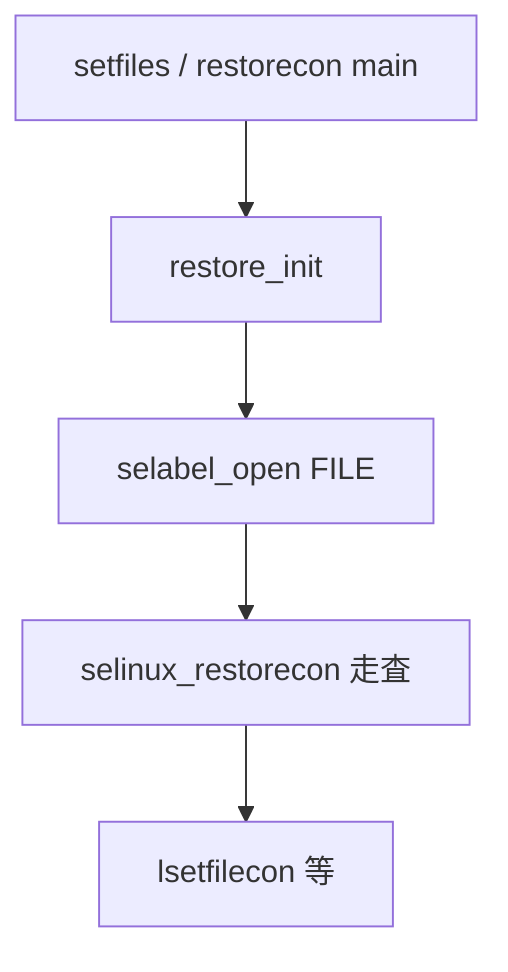

# 第18章 restorecon と setfiles

> 本章で読むソース
>
> - [`policycoreutils/setfiles/setfiles.c`](https://github.com/SELinuxProject/selinux/blob/3.10/policycoreutils/setfiles/setfiles.c)
> - [`policycoreutils/setfiles/restore.c`](https://github.com/SELinuxProject/selinux/blob/3.10/policycoreutils/setfiles/restore.c)

## この章の狙い

同一バイナリが `setfiles` と `restorecon` の2名称で動作する仕組みと、`selinux_restorecon` ラッパによるラベル修復フローを読む。

## 前提

第14章の matchpathcon と selabel バックエンドを理解していること。

## バイナリ名による分岐

`basename` が `setfiles` か `restorecon` かでオプション文字列と挙動フラグが変わる。

[`policycoreutils/setfiles/setfiles.c` L26-L32](https://github.com/SELinuxProject/selinux/blob/3.10/policycoreutils/setfiles/setfiles.c#L26-L32)

```c
#define SETFILES "setfiles"
#define RESTORECON "restorecon"
static int iamrestorecon;

/* Behavior flags determined based on setfiles vs. restorecon */
static int ctx_validate; /* Validate contexts */
static const char *altpath; /* Alternate path to file_contexts */
```

`setfiles` は再帰走査と inode 追跡、restorecon はインストール済みポリシーの file_contexts を参照する。

[`policycoreutils/setfiles/setfiles.c` L177-L184](https://github.com/SELinuxProject/selinux/blob/3.10/policycoreutils/setfiles/setfiles.c#L177-L184)

```c
	if (!strcmp(base, SETFILES)) {
		/*
		 * setfiles:
		 * Recursive descent,
		 * Does not expand paths via realpath,
		 * Try to track inode associations for conflict detection,
		 * Does not follow mounts (sets SELINUX_RESTORECON_XDEV),
		 * Validates all file contexts at init time.
```

## restore_init

`restore.c` は `selabel_open` で file_contexts ハンドルを開き、`selinux_restorecon_set_sehandle` で共有する。
restorecond も同じ関数をリンクする（第23章）。

[`policycoreutils/setfiles/restore.c` L20-L49](https://github.com/SELinuxProject/selinux/blob/3.10/policycoreutils/setfiles/restore.c#L20-L49)

```c
void restore_init(struct restore_opts *opts)
{
	int rc;

	struct selinux_opt selinux_opts[] = {
		{ SELABEL_OPT_VALIDATE, opts->selabel_opt_validate },
		{ SELABEL_OPT_PATH, opts->selabel_opt_path },
		{ SELABEL_OPT_DIGEST, opts->selabel_opt_digest }
	};

	opts->hnd = selabel_open(SELABEL_CTX_FILE, selinux_opts, 3);
	if (!opts->hnd) {
		perror(opts->selabel_opt_path ? opts->selabel_opt_path : selinux_file_context_path());
		exit(1);
	}

	opts->restorecon_flags = 0;
	opts->restorecon_flags = opts->nochange | opts->verbose |
			   opts->progress | opts->set_specctx  |
			   opts->set_user_role |
			   opts->add_assoc | opts->ignore_digest |
			   opts->recurse | opts->userealpath |
			   opts->xdev | opts->abort_on_error |
			   opts->syslog_changes | opts->log_matches |
			   opts->ignore_noent | opts->ignore_mounts |
			   opts->mass_relabel | opts->conflict_error |
			   opts->count_errors | opts->count_relabeled;

	/* Use setfiles, restorecon and restorecond own handles */
	selinux_restorecon_set_sehandle(opts->hnd);
```

## main とスレッド

`main` は `nthreads` で並列ラベル付けスレッド数を受け取り、大規模ツリー走査を高速化する。

[`policycoreutils/setfiles/setfiles.c` L139-L146](https://github.com/SELinuxProject/selinux/blob/3.10/policycoreutils/setfiles/setfiles.c#L139-L146)

```c
int main(int argc, char **argv)
{
	struct stat sb;
	int opt, i = 0;
	const char *input_filename = NULL;
	int use_input_file = 0;
	char *buf = NULL, *endptr;
	size_t buf_len, nthreads = 1;
```

完了時は `selinux_restorecon_get_relabeled_files` で再ラベル件数を取得できる（同一ファイル後半）。



## restorecon との差分

`restorecon` 側は realpath 展開とマウント追従を有効にし、インストール済みポリシーの file_contexts を参照する。

[`policycoreutils/setfiles/setfiles.c` L196-L203](https://github.com/SELinuxProject/selinux/blob/3.10/policycoreutils/setfiles/setfiles.c#L196-L203)

```c
		/*
		 * restorecon:
		 * No recursive descent unless -r/-R,
		 * Expands paths via realpath,
		 * Do not try to track inode associations for conflict detection,
		 * Follows mounts,
		 * Does lazy validation of contexts upon use.
		 */
```

## 並列走査

`-n` でワーカースレッド数を指定し、ディレクトリツリーを分割走査する。
`nthreads` は `main` 冒頭で `size_t` として保持される（上記引用）。

## 高速化・最適化の工夫

file_contexts ハンドルをプロセス内で1つに共有し、ツリー走査中の再パースを避ける。
`-n` スレッドオプションでディレクトリ走査を並列化し、大規模ファイルシステムの修復時間を短縮する。
restorecon の lazy validation は起動時の file_contexts 全検証を避け、初回アクセス時までコストを遅延する。
setfiles の inode 追跡は同一デバイス上のハードリンク衝突を検出し、誤ラベル付けを防ぐ。

`process_glob` は glob 展開後に `selinux_restorecon_parallel` で並列ラベル修復を呼ぶ。

[`policycoreutils/setfiles/restore.c` L77-L98](https://github.com/SELinuxProject/selinux/blob/3.10/policycoreutils/setfiles/restore.c#L77-L98)

```c
int process_glob(char *name, struct restore_opts *opts, size_t nthreads,
		 long unsigned *skipped_errors, long unsigned *relabeled_files)
{
	glob_t globbuf;
	size_t i, len;
	int rc, errors;

	memset(&globbuf, 0, sizeof(globbuf));

	errors = glob(name, GLOB_TILDE | GLOB_PERIOD |
			  GLOB_NOCHECK | GLOB_BRACE, NULL, &globbuf);
	if (errors)
		return errors;

	for (i = 0; i < globbuf.gl_pathc; i++) {
		// ... (中略) ...
		rc = selinux_restorecon_parallel(globbuf.gl_pathv[i],
```

## まとめ

restorecon と setfiles は共通の restore 実装を共有し、第14章の selabel 照合をバルク適用する。

## 関連する章

- [第14章 ラベリング](../part04-libselinux/14-context-labeling.md)
- [第23章 restorecond](../part07-tools/23-restorecond.md)
