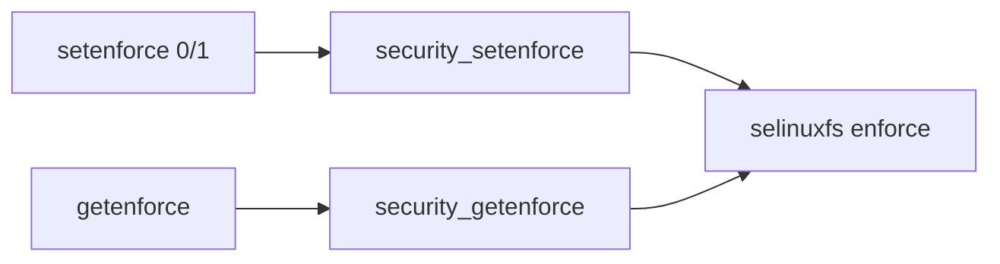

# 第19章 setenforce と getenforce

> 本章で読むソース
>
> - [`libselinux/src/setenforce.c`](https://github.com/SELinuxProject/selinux/blob/3.10/libselinux/src/setenforce.c)
> - [`libselinux/src/getenforce.c`](https://github.com/SELinuxProject/selinux/blob/3.10/libselinux/src/getenforce.c)
> - [`libselinux/src/enabled.c`](https://github.com/SELinuxProject/selinux/blob/3.10/libselinux/src/enabled.c)

## この章の狙い

enforcing モードの読み書き API と、SELinux 全体の有効/無効を問い合わせる `is_selinux_enabled` の実装を読む。

## 前提

第12章の `selinux_mnt` を理解していること。

## security_setenforce

`enforce` ファイルへ ASCII 数字を write する薄いラッパである。

[`libselinux/src/setenforce.c` L12-L30](https://github.com/SELinuxProject/selinux/blob/3.10/libselinux/src/setenforce.c#L12-L30)

```c
int security_setenforce(int value)
{
	int fd, ret;
	char path[PATH_MAX];
	char buf[20];

	if (!selinux_mnt) {
		errno = ENOENT;
		return -1;
	}

	snprintf(path, sizeof path, "%s/enforce", selinux_mnt);
	fd = open(path, O_RDWR | O_CLOEXEC);
	if (fd < 0)
		return -1;

	snprintf(buf, sizeof buf, "%d", value);
	ret = write(fd, buf, strlen(buf));
```

## security_getenforce

読み取り結果を 0/1 に正規化して返す。

[`libselinux/src/getenforce.c` L12-L37](https://github.com/SELinuxProject/selinux/blob/3.10/libselinux/src/getenforce.c#L12-L37)

```c
int security_getenforce(void)
{
	int fd, ret, enforce = 0;
	char path[PATH_MAX];
	char buf[20];

	if (!selinux_mnt) {
		errno = ENOENT;
		return -1;
	}

	snprintf(path, sizeof path, "%s/enforce", selinux_mnt);
	fd = open(path, O_RDONLY | O_CLOEXEC);
	if (fd < 0)
		return -1;

	memset(buf, 0, sizeof buf);
	ret = read(fd, buf, sizeof buf - 1);
	close(fd);
	if (ret < 0)
		return -1;

	if (sscanf(buf, "%d", &enforce) != 1)
		return -1;

	return !!enforce;
}
```

## is_selinux_enabled

カーネル設定とマウント状態から SELinux が有効かを判定する。
restorecond は無効時に即終了する（第23章）。

[`libselinux/src/enabled.c` L11-L20](https://github.com/SELinuxProject/selinux/blob/3.10/libselinux/src/enabled.c#L11-L20)

```c
int is_selinux_enabled(void)
{
	/* init_selinuxmnt() gets called before this function. We
 	 * will assume that if a selinux file system is mounted, then
 	 * selinux is enabled. */
#ifdef ANDROID
	return (selinux_mnt ? 1 : 0);
#else
	return (selinux_mnt && has_selinux_config);
#endif
}
```

## policycoreutils との関係

`setenforce` コマンドはこの API のラッパである。
Permissive へ切り替えてもポリシーはロードされたまま、拒否はログに残る。



## is_selinux_mls_enabled

MLS 有効化は `selinuxfs` の `mls` ノードを読み取り、文字列 `"1"` かどうかで判定する。

[`libselinux/src/enabled.c` L29-L54](https://github.com/SELinuxProject/selinux/blob/3.10/libselinux/src/enabled.c#L29-L54)

```c
int is_selinux_mls_enabled(void)
{
	char buf[20], path[PATH_MAX];
	int fd, ret, enabled = 0;

	if (!selinux_mnt)
		return enabled;

	snprintf(path, sizeof path, "%s/mls", selinux_mnt);
	fd = open(path, O_RDONLY | O_CLOEXEC);
	if (fd < 0)
		return enabled;

	memset(buf, 0, sizeof buf);

	do {
		ret = read(fd, buf, sizeof buf - 1);
	} while (ret < 0 && errno == EINTR);
	close(fd);
	if (ret < 0)
		return enabled;

	if (!strcmp(buf, "1"))
		enabled = 1;

	return enabled;
}
```

## 高速化・最適化の工夫

API は極小実装でポリシー全体の再読み込みを伴わない。
モード切替はカーネル内フラグの更新だけで完結し、レイテンシは open/write 1回に収まる。

`security_setenforce` は write 失敗時に fd を閉じてエラーを返す。

[`libselinux/src/setenforce.c` L28-L34](https://github.com/SELinuxProject/selinux/blob/3.10/libselinux/src/setenforce.c#L28-L34)

```c
	snprintf(buf, sizeof buf, "%d", value);
	ret = write(fd, buf, strlen(buf));
	close(fd);
	if (ret < 0)
		return -1;

	return 0;
```

[`libselinux/src/getenforce.c` L34-L37](https://github.com/SELinuxProject/selinux/blob/3.10/libselinux/src/getenforce.c#L34-L37)

```c
	if (sscanf(buf, "%d", &enforce) != 1)
		return -1;

	return !!enforce;
```

## まとめ

enforcing 制御は selinuxfs の単一ノードへの読み書きに集約される。

## 関連する章

- [第12章 初期化](../part04-libselinux/12-libselinux-init.md)
- [第20章 semodule](20-semodule-command.md)
