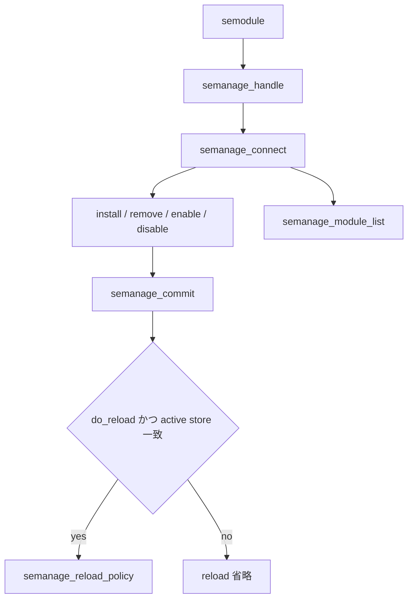

# 第20章 semodule コマンド

> 本章で読むソース
>
> - [`policycoreutils/semodule/semodule.c`](https://github.com/SELinuxProject/selinux/blob/3.10/policycoreutils/semodule/semodule.c)

## この章の狙い

モジュールの install、list、build、reload を行う `semodule` CLI が libsemanage をどう呼ぶかを読む。
`genhomedircon` エイリアスなど同一バイナリの複数入口も含める。

## 前提

第15章から第17章を読んでいること。

## main の初期化

`semanage_handle_create` でハンドルを作り、`semanage_select_store` でストアを指定できる。

[`policycoreutils/semodule/semodule.c` L416-L449](https://github.com/SELinuxProject/selinux/blob/3.10/policycoreutils/semodule/semodule.c#L416-L449)

```c
int main(int argc, char *argv[])
{
	int i, commit = 0;
	int result;
	int status = EXIT_FAILURE;
	const char *genhomedirconargv[] = { "genhomedircon", "-B", "-n" };
	create_signal_handlers();
	if (strcmp(basename(argv[0]), "genhomedircon") == 0) {
		argc = 3;
		argv = (char **)genhomedirconargv;
	}
	parse_command_line(argc, argv);

	cil_set_log_level(CIL_ERR + verbose);

	if (build || check_ext_changes)
		commit = 1;

	if (!sh) {
		sh = semanage_handle_create();
		if (!sh) {
			fprintf(stderr, "%s:  Could not create semanage handle\n",
				argv[0]);
			goto cleanup_nohandle;
		}
	}

	if (store) {
		semanage_select_store(sh, store, SEMANAGE_CON_DIRECT);
	}
```

## 接続とコミット

`semanage_connect` 成功後、install や remove がトランザクション内で実行され、最後に `semanage_commit` が呼ばれる（同一ファイル後半の処理フロー）。
`build` フラグが立つと commit 必須となる。

[`policycoreutils/semodule/semodule.c` L431-L432](https://github.com/SELinuxProject/selinux/blob/3.10/policycoreutils/semodule/semodule.c#L431-L432)

```c
	if (build || check_ext_changes)
		commit = 1;
```

## CIL ログレベル

`cil_set_log_level` で semanage 内部の CIL コンパイルログを制御する。
verbose フラグと連動する。

[`policycoreutils/semodule/semodule.c` L429](https://github.com/SELinuxProject/selinux/blob/3.10/policycoreutils/semodule/semodule.c#L429)

```c
	cil_set_log_level(CIL_ERR + verbose);
```

## 典型サブコマンド

| フラグ | libsemanage API |
|---|---|
| `-i` | `semanage_module_install_file` |
| `-r` | `semanage_module_remove` |
| `-l` | `semanage_module_list` |
| `-B` | 再ビルド付き commit |



`do_commit` 配列は LIST_M の位置が 0 で、list は commit 対象外である。

[`policycoreutils/semodule/semodule.c` L32-L36](https://github.com/SELinuxProject/selinux/blob/3.10/policycoreutils/semodule/semodule.c#L32-L36)

```c
/* list of modes in which one ought to commit afterwards */
static const int do_commit[] = {
	0, 1, 1, 0, 0, 0,
	0, 0, 0, 1, 1,
};
```

## genhomedircon エイリアス

`argv[0]` が `genhomedircon` のとき引数を差し替え、同一イメージで別エントリポイントを提供する。
パッケージ分割を減らす配布上の工夫である。

## commit ブロック

`commit` フラグが立つと `semanage_set_rebuild` や `semanage_set_disable_dontaudit` を設定してから `semanage_commit` を呼ぶ。
`no_reload` でカーネル反映を抑止できる。

[`policycoreutils/semodule/semodule.c` L835-L854](https://github.com/SELinuxProject/selinux/blob/3.10/policycoreutils/semodule/semodule.c#L835-L854)

```c
	if (commit) {
		if (verbose)
			printf("Committing changes:\n");
		if (no_reload)
			semanage_set_reload(sh, 0);
		if (build)
			semanage_set_rebuild(sh, 1);
		if (check_ext_changes)
			semanage_set_check_ext_changes(sh, 1);
		if (disable_dontaudit)
			semanage_set_disable_dontaudit(sh, 1);
		else if (build)
			semanage_set_disable_dontaudit(sh, 0);
		if (preserve_tunables)
			semanage_set_preserve_tunables(sh, 1);
		if (ignore_module_cache)
			semanage_set_ignore_module_cache(sh, 1);

		result = semanage_commit(sh);
	}
```

## semanage_connect とストア作成

接続前に `semanage_set_create_store` でストア自動作成を有効にする。
初回ブートストラップで `/var/lib/selinux` 配下が無い場合に備える。

[`policycoreutils/semodule/semodule.c` L455-L462](https://github.com/SELinuxProject/selinux/blob/3.10/policycoreutils/semodule/semodule.c#L455-L462)

```c
	/* create store if necessary, for bootstrapping */
	semanage_set_create_store(sh, 1);

	if ((result = semanage_connect(sh)) < 0) {
		fprintf(stderr, "%s:  Could not connect to policy handler\n",
			argv[0]);
		goto cleanup;
	}
```

## INSTALL_M の実体

コマンドキューは `semanage_module_install_file` を直接呼ぶ。
複数 `-i` はループ内で順に積み、commit 1回でまとめて反映する。

[`policycoreutils/semodule/semodule.c` L493-L501](https://github.com/SELinuxProject/selinux/blob/3.10/policycoreutils/semodule/semodule.c#L493-L501)

```c
		case INSTALL_M:{
				if (verbose) {
					printf
					    ("Attempting to install module '%s':\n",
					     mode_arg);
				}
				result =
				    semanage_module_install_file(sh, mode_arg);
				break;
			}
```

## 高速化・最適化の工夫

複数 `-i` を1トランザクションにまとめ、commit 1回で link と expand を実行する。
`check_ext_changes` と checksum 比較で不要な再ビルドを省略できる（第17章）。

## まとめ

semodule は libsemanage の運用向け CLI ファサードである。

## 関連する章

- [第16章 モジュールストア](../part05-libsemanage/16-module-store.md)
- [第17章 commit](../part05-libsemanage/17-policy-reload.md)
