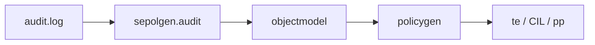

# 第21章 audit2allow と sepolicy

> 本章で読むソース
>
> - [`python/audit2allow/audit2allow`](https://github.com/SELinuxProject/selinux/blob/3.10/python/audit2allow/audit2allow)
> - [`python/sepolgen`](https://github.com/SELinuxProject/selinux/blob/3.10/python/sepolgen)

## この章の狙い

AVC 拒否ログから TE ルール案を生成する `audit2allow` のオプション解析と sepolgen パイプラインを読む。
開発者がポリシー修正に使うデータフローを把握する。

## 前提

第13章の AVC 拒否ログ形式を知っていること。

## sepolgen 依存

スクリプト先頭は sepolgen 各モジュールと `selinux.audit2why` を import する。

[`python/audit2allow/audit2allow` L22-L33](https://github.com/SELinuxProject/selinux/blob/3.10/python/audit2allow/audit2allow#L22-L33)

```python
import sys
import os

import sepolgen.audit as audit
import sepolgen.policygen as policygen
import sepolgen.interfaces as interfaces
import sepolgen.output as output
import sepolgen.objectmodel as objectmodel
import sepolgen.defaults as defaults
import sepolgen.module as module
from sepolgen.sepolgeni18n import _
import selinux.audit2why as audit2why
```

## AuditToPolicy クラス

`AuditToPolicy` がオプション解析とログ入力源の選択を担う。

[`python/audit2allow/audit2allow` L41-L48](https://github.com/SELinuxProject/selinux/blob/3.10/python/audit2allow/audit2allow#L41-L48)

```python
class AuditToPolicy:
    VERSION = "%prog .1"
    SYSLOG = "/var/log/messages"

    def __init__(self):
        self.__options = None
        self.__parser = None
        self.__avs = None
```

## 入力源オプション

監査ログ、起動以降、ファイル入力、dmesg などが相互排他で検証される。

[`python/audit2allow/audit2allow` L54-L62](https://github.com/SELinuxProject/selinux/blob/3.10/python/audit2allow/audit2allow#L54-L62)

```python
        parser.add_option("-b", "--boot", action="store_true", dest="boot", default=False,
                          help="audit messages since last boot conflicts with -i")
        parser.add_option("-a", "--all", action="store_true", dest="audit", default=False,
                          help="read input from audit log - conflicts with -i")
        parser.add_option("-p", "--policy", dest="policy", default=None, help="Policy file to use for analysis")
        parser.add_option("-d", "--dmesg", action="store_true", dest="dmesg", default=False,
                          help="read input from dmesg - conflicts with --all and --input")
        parser.add_option("-i", "--input", dest="input",
                          help="read input from <input> - conflicts with -a")
```

## 出力形式

refpolicy スタイル、CIL、モジュールパッケージ生成をオプションで切り替える。

[`python/audit2allow/audit2allow` L69-L78](https://github.com/SELinuxProject/selinux/blob/3.10/python/audit2allow/audit2allow#L69-L78)

```python
        parser.add_option("-M", "--module-package", dest="module_package",
                          help="generate a module package - conflicts with -o and -m")
        parser.add_option("-o", "--output", dest="output",
                          help="append output to <filename>, conflicts with -M")
        parser.add_option("-D", "--dontaudit", action="store_true",
                          dest="dontaudit", default=False,
                          help="generate policy with dontaudit rules")
        parser.add_option("-R", "--reference", action="store_true", dest="refpolicy",
                          default=True, help="generate refpolicy style output")
        parser.add_option("-C", "--cil", action="store_true", dest="cil", help="generate CIL output")
```

モジュール名検証は `module.is_valid_name` で行う。

[`python/audit2allow/audit2allow` L108-L116](https://github.com/SELinuxProject/selinux/blob/3.10/python/audit2allow/audit2allow#L108-L116)

```python
        if name:
            options.requires = True
            if not module.is_valid_name(name):
                sys.stderr.write('error: module names must begin with a letter, optionally followed by letters, numbers, "-", "_", "."\n')
                sys.exit(2)
```



## sepolicy ツール群

`python/sepolicy` にはバンドル分析やインタフェース生成スクリプトが含まれる。
いずれも libsepol の型とクラス概念を前提に動作する。

## sepolgen のオブジェクトモデル

`objectmodel` は拒否ログから型とクラスを抽出し、`policygen` が TE ルール文字列へ変換する。
`-R` refpolicy スタイルが既定で、`-C` で CIL へ切り替える。

## audit2why 連携

`selinux.audit2why` はカーネルが返す拒否理由の人間可読化を担う。
audit2allow は解析結果と組み合わせて開発者向けメッセージを出す。

[`python/audit2allow/audit2allow` L63-L64](https://github.com/SELinuxProject/selinux/blob/3.10/python/audit2allow/audit2allow#L63-L64)

```python
        parser.add_option("-l", "--lastreload", action="store_true", dest="lastreload", default=False,
                          help="read input only after the last reload")
```

[`python/audit2allow/audit2allow` L92-L93](https://github.com/SELinuxProject/selinux/blob/3.10/python/audit2allow/audit2allow#L92-L93)

```python
        parser.add_option("-w", "--why", dest="audit2why", action="store_true", default=(os.path.basename(sys.argv[0]) == "audit2why"),
                          help="Translates SELinux audit messages into a description of why the access was denied")
```

## 高速化・最適化の工夫

ログを objectmodel へ一度だけ変換し、複数出力フォーマットへ派生させる。
`-l` lastreload でポリシー再ロード以降のログだけを処理し、入力サイズを削る。

## まとめ

audit2allow は sepolgen 上のポリシー生成 CLI で、拒否ログからモジュール草案を自動化する。

## 関連する章

- [第10章 checkmodule](../part03-checkpolicy/10-checkmodule-pipeline.md)
- [第13章 AVC](../part04-libselinux/13-avc-compute-av.md)
