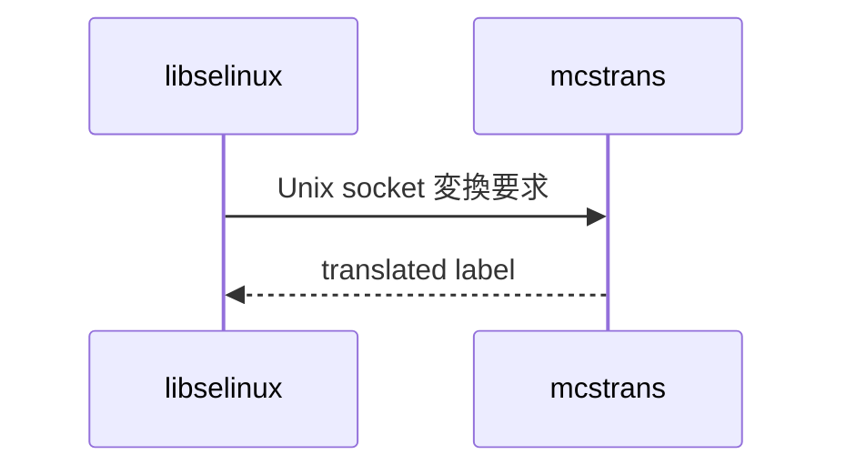

# 第22章 mcstrans と setrans

> 本章で読むソース
>
> - [`libselinux/src/setrans_client.c`](https://github.com/SELinuxProject/selinux/blob/3.10/libselinux/src/setrans_client.c)
> - [`mcstrans/src/mcstrans.c`](https://github.com/SELinuxProject/selinux/blob/3.10/mcstrans/src/mcstrans.c)

## この章の狙い

MLS ラベルの人間可読変換を担う mcstrans デーモンと、libselinux の setrans クライアントのソケット通信を読む。
`DISABLE_SETRANS` ビルド時のスタブ動作も含める。

## 前提

MLS コンテキストの sensitivity と category を知っていること。

## スレッドローカルキャッシュ

setrans クライアントは直前の変換結果を `__thread` 変数に保持する。

[`libselinux/src/setrans_client.c` L25-L34](https://github.com/SELinuxProject/selinux/blob/3.10/libselinux/src/setrans_client.c#L25-L34)

```c
#ifndef DISABLE_SETRANS
static unsigned char has_setrans;

// Simple cache
static __thread char * prev_t2r_trans = NULL;
static __thread char * prev_t2r_raw = NULL;
static __thread char * prev_r2t_trans = NULL;
static __thread char * prev_r2t_raw = NULL;
static __thread char *prev_r2c_trans = NULL;
static __thread char * prev_r2c_raw = NULL;
```

## setransd への接続

Unix ドメインソケット `SETRANS_UNIX_SOCKET` へ接続する。

[`libselinux/src/setrans_client.c` L48-L74](https://github.com/SELinuxProject/selinux/blob/3.10/libselinux/src/setrans_client.c#L48-L74)

```c
static int setransd_open(void)
{
	struct sockaddr_un addr;
	int fd;
#ifdef SOCK_CLOEXEC
	fd = socket(PF_UNIX, SOCK_STREAM|SOCK_CLOEXEC, 0);
	if (fd < 0 && errno == EINVAL)
#endif
	{
		fd = socket(PF_UNIX, SOCK_STREAM, 0);
		if (fd >= 0)
			if (fcntl(fd, F_SETFD, FD_CLOEXEC)) {
				close(fd);
				return -1;
			}
	}
	if (fd < 0)
		return -1;

	memset(&addr, 0, sizeof(addr));
	addr.sun_family = AF_UNIX;

	if (strlcpy(addr.sun_path, SETRANS_UNIX_SOCKET, sizeof(addr.sun_path)) >= sizeof(addr.sun_path)) {
		close(fd);
		errno = EOVERFLOW;
		return -1;
	}
```

## mcstrans デーモン

`mcstrans` は翻訳テーブルを読み込み、クライアント要求に応じて raw と translated を往復する。
設定は `/etc/selinux/targeted/translations` 等に置かれる。

## 組み込み向けスタブ

ファイル先頭コメントは `DISABLE_SETRANS` でスタブに切り替えサイズを削る旨を述べる。

[`libselinux/src/setrans_client.c` L1-L7](https://github.com/SELinuxProject/selinux/blob/3.10/libselinux/src/setrans_client.c#L1-L7)

```c
/* Author: Trusted Computer Solutions, Inc. 
 * 
 * Modified:
 * Yuichi Nakamura <ynakam@hitachisoft.jp> 
 - Stubs are used when DISABLE_SETRANS is defined, 
   it is to reduce size for such as embedded devices.
*/
```



## send_request プロトコル

クライアントは function コードと2つのヌル終端文字列を `writev` 相当の `msghdr` で送る。
デーモンは同形式で応答し、変換結果を返す。

[`libselinux/src/setrans_client.c` L85-L117](https://github.com/SELinuxProject/selinux/blob/3.10/libselinux/src/setrans_client.c#L85-L117)

```c
static int
send_request(int fd, uint32_t function, const char *data1, const char *data2)
{
	struct msghdr msgh;
	struct iovec iov[5];
	uint32_t data1_size;
	uint32_t data2_size;
	ssize_t count, expected;
	unsigned int i;

	if (fd < 0) {
		errno = EINVAL;
		return -1;
	}

	if (!data1)
		data1 = "";
	if (!data2)
		data2 = "";

	data1_size = strlen(data1) + 1;
	data2_size = strlen(data2) + 1;

	iov[0].iov_base = &function;
	iov[0].iov_len = sizeof(function);
	iov[1].iov_base = &data1_size;
	iov[1].iov_len = sizeof(data1_size);
	iov[2].iov_base = &data2_size;
	iov[2].iov_len = sizeof(data2_size);
	iov[3].iov_base = (char *)data1;
	iov[3].iov_len = data1_size;
	iov[4].iov_base = (char *)data2;
	iov[4].iov_len = data2_size;
```

## mcstransd デーモン

実体は `mcstransd.c` の `main` で、`initialize` 後に `process_connections` がソケット待ち受けを行う。
`-f` でフォアグラウンド実行に切り替えられる。

[`mcstrans/src/mcstransd.c` L531-L574](https://github.com/SELinuxProject/selinux/blob/3.10/mcstrans/src/mcstransd.c#L531-L574)

```c
main(int argc, char *argv[])
{
	int opt;
	int do_fork = 1;
	while ((opt = getopt(argc, argv, "hf")) > 0) {
		switch (opt) {
		case 'f':
			do_fork = 0;
			break;
		case 'h':
			usage(argv[0]);
			exit(0);
			break;
		case '?':
			usage(argv[0]);
			exit(-1);
		}
	}

#ifndef DEBUG
	/* Make sure we are root */
	if (getuid() != 0) {
		syslog(LOG_ERR, "You must be root to run this program.\n");
		return 4;
	}
#endif

	openlog(SETRANSD_PROGNAME, 0, LOG_DAEMON);
	syslog(LOG_NOTICE, "%s starting", argv[0]);

	initialize();

#ifndef DEBUG
	dropprivs();

	/* run in the background as a daemon */
	if (do_fork && daemon(0, 0)) {
		syslog(LOG_ERR, "daemon() failed: %m");
		cleanup_exit(1);
	}
#endif

	syslog(LOG_NOTICE, "%s initialized", argv[0]);
	process_connections();
```

## 翻訳テーブル

`mcstrans.c` は `context_map` ハッシュと PCRE2 によるパターン照合で raw と translated を往復する。
`N_BUCKETS 1453` の固定サイズハッシュでルックアップを安定化する。

[`mcstrans/src/mcstrans.c` L38-L60](https://github.com/SELinuxProject/selinux/blob/3.10/mcstrans/src/mcstrans.c#L38-L60)

```c
#define N_BUCKETS 1453

#define log_error(fmt, ...) fprintf(stderr, fmt, __VA_ARGS__)

#ifdef DEBUG
#define log_debug(fmt, ...) fprintf(stderr, fmt, __VA_ARGS__)
#else
#define log_debug(fmt, ...) do {} while (0)
#endif

static unsigned int maxbit=0;

/* Define data structures */
typedef struct context_map {
	char *raw;
	char *trans;
} context_map_t;

typedef struct context_map_node {
	char *key;
	context_map_t *map;
	struct context_map_node *next;
} context_map_node_t;
```

## 高速化・最適化の工夫

スレッドローカルキャッシュが同一スレッド内の連続変換でソケット往復を省略する。
`SOCK_CLOEXEC` 対応で fd リークを防ぎつつ接続コストを最小化する。

## まとめ

表示用ラベル変換は mcstrans と setrans クライアントのプロセス間通信で実現する。

## 関連する章

- [第14章 ラベリング](../part04-libselinux/14-context-labeling.md)
- [第1章 全体像](../part00-overview/01-selinux-userspace-overview.md)
