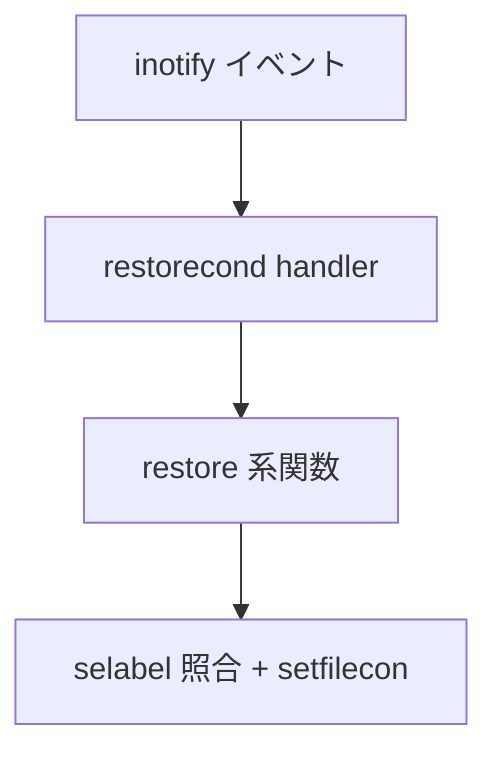

# 第23章 restorecond

> 本章で読むソース
>
> - [`restorecond/restorecond.c`](https://github.com/SELinuxProject/selinux/blob/3.10/restorecond/restorecond.c)
> - [`policycoreutils/setfiles/restore.c`](https://github.com/SELinuxProject/selinux/blob/3.10/policycoreutils/setfiles/restore.c)

## この章の狙い

inotify でファイル作成を監視し、既定コンテキストへラベルを合わせる `restorecond` デーモンの起動とイベントループを読う。

## 前提

第18章の `restore_init` と inotify の基礎を理解していること。

## デーモンの目的

コメントは設定ファイルに列挙されたパスの作成を監視し、システム既定コンテキストへ合わせると述べる。

[`restorecond/restorecond.c` L27-L42](https://github.com/SELinuxProject/selinux/blob/3.10/restorecond/restorecond.c#L27-L42)

```c
/* 
 * PURPOSE:
 * This daemon program watches for the creation of files listed in a config file
 * and makes sure that there security context matches the systems defaults
 *
 * USAGE:
 * restorecond [-d] [-u] [-v] [-f restorecond_file ]
 * 
 * -d   Run in debug mode
 * -f   Use alternative restorecond_file
 * -u   Run in user mode
 * -v   Run in verbose mode (Report missing files)
 *
 * EXAMPLE USAGE:
 * restorecond
 *
 */
```

## main の初期化

SELinux 無効時は即終了し、`restore_init` で selabel ハンドルを共有する。

[`restorecond/restorecond.c` L142-L159](https://github.com/SELinuxProject/selinux/blob/3.10/restorecond/restorecond.c#L142-L159)

```c
int main(int argc, char **argv)
{
	int opt;
	struct sigaction sa;

	/* If we are not running SELinux then just exit */
	if (is_selinux_enabled() != 1)
		return 0;

	watch_file = server_watch_file;

	memset(&r_opts, 0, sizeof(r_opts));
	r_opts.ignore_noent = SELINUX_RESTORECON_IGNORE_NOENTRY;
	r_opts.ignore_digest = SELINUX_RESTORECON_IGNORE_DIGEST;

	restore_init(&r_opts);
```

## inotify とユーザー分岐

`inotify_init` でマスタ fd を得て、root と一般ユーザーで監視ファイルセットを切り替える。

[`restorecond/restorecond.c` L192-L207](https://github.com/SELinuxProject/selinux/blob/3.10/restorecond/restorecond.c#L192-L207)

```c
	master_fd = inotify_init();
	if (master_fd < 0)
		exitApp("inotify_init");

	uid_t uid = getuid();
	struct passwd *pwd = getpwuid(uid);
	if (!pwd)
		exitApp("getpwuid");

	homedir = pwd->pw_dir;
	if (uid != 0) {
		if (run_as_user)
			return server(master_fd, user_watch_file);
		if (start() != 0)
			return server(master_fd, user_watch_file);
		return 0;
	}
```

## restore.c との共有

`restore_init` は setfiles と restorecond の両方から呼ばれる（第18章）。
ラベル修復ロジックの重複を避ける設計である。

[`policycoreutils/setfiles/restore.c` L1-L4](https://github.com/SELinuxProject/selinux/blob/3.10/policycoreutils/setfiles/restore.c#L1-L4)

```c
/*
 * Note that the restorecond(8) service build links with these functions.
 * Therefore any changes here should also be tested against that utility.
 */
```



## シグナル処理

`SIGTERM` は `term_handler` で捕捉し、`atexit` で `done` を登録する。
デーモン終了時に inotify fd を閉じる。

[`restorecond/restorecond.c` L161-L168](https://github.com/SELinuxProject/selinux/blob/3.10/restorecond/restorecond.c#L161-L168)

```c
	/* Register sighandlers */
	sa.sa_flags = 0;
	sa.sa_handler = term_handler;
	sigemptyset(&sa.sa_mask);
	sigaction(SIGTERM, &sa, NULL);

	atexit( done );
	while ((opt = getopt(argc, argv, "hdf:uv")) > 0) {
```

## ユーザー分岐と server

一般ユーザーは `run_as_user` 時に `user_watch_file` を監視する。
root は `server_watch_file` でシステム全体のパスセットを扱う。

[`restorecond/restorecond.c` L202-L207](https://github.com/SELinuxProject/selinux/blob/3.10/restorecond/restorecond.c#L202-L207)

```c
	if (uid != 0) {
		if (run_as_user)
			return server(master_fd, user_watch_file);
		if (start() != 0)
			return server(master_fd, user_watch_file);
		return 0;
	}
```

## 高速化・最適化の工夫

フルツリー restorecon の代わりに作成イベントだけを処理し、I/O 量を限定する。
`-u` ユーザーモードでホームディレクトリ監視を分離し、特権デーモンの負荷を下げる。

## まとめ

restorecond は restorecon 相当の処理をイベント駆動で常駐させる。

## 関連する章

- [第18章 restorecon](../part06-utils/18-restorecon-setfiles.md)
- [第14章 ラベリング](../part04-libselinux/14-context-labeling.md)
