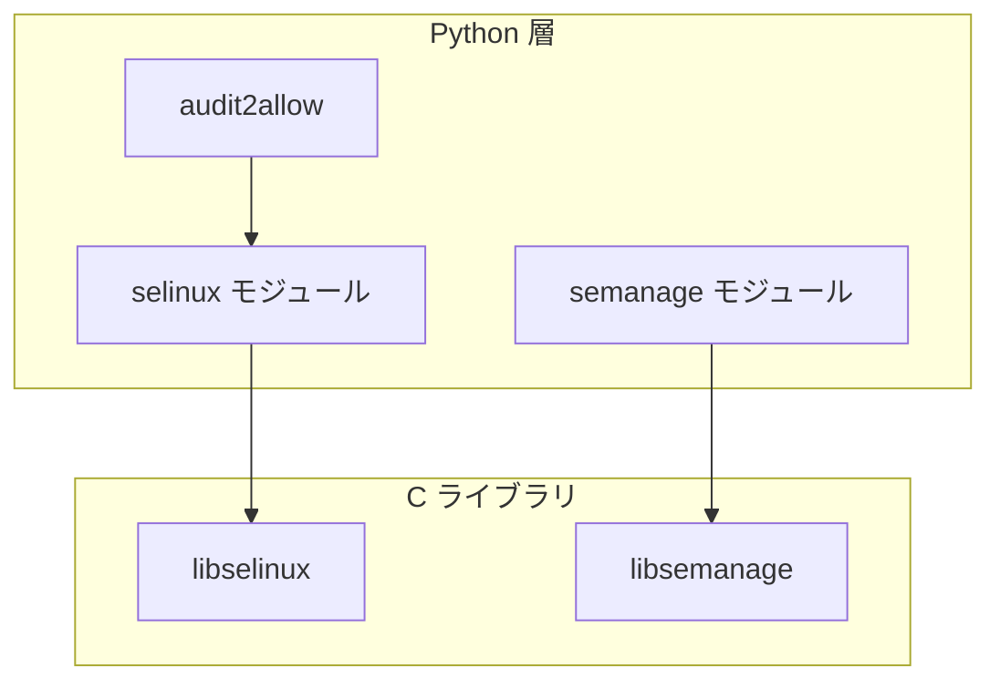

# 第24章 python バインディングと sandbox

> 本章で読むソース
>
> - [`libselinux/src/setup.py`](https://github.com/SELinuxProject/selinux/blob/3.10/libselinux/src/setup.py)
> - [`libsemanage/src/pywrap`](https://github.com/SELinuxProject/selinux/blob/3.10/libsemanage/src)
> - [`sandbox/seunshare.c`](https://github.com/SELinuxProject/selinux/blob/3.10/sandbox/seunshare.c)

## この章の狙い

libselinux と libsemanage の Python 拡張のビルド方法と、SELinux コンテキスト付きサンドボックス `seunshare` の入口を読む。

## 前提

Python C 拡張と Linux 名前空間の基礎を知っていること。

## PYSUBDIRS

ルート Makefile は Python ラッパを libselinux と libsemanage だけに限定する。

[`Makefile` L3-L4](https://github.com/SELinuxProject/selinux/blob/3.10/Makefile#L3-L4)

```makefile
SUBDIRS=libsepol libselinux libsemanage checkpolicy secilc policycoreutils $(OPT_SUBDIRS)
PYSUBDIRS=libselinux libsemanage
```

`pywrap` ターゲットで両ライブラリの SWIG 拡張をビルドする。

## libselinux setup.py

`selinuxswig_python.i` をソースに distutils 拡張を構築する。

[`libselinux/src/setup.py` L1-L13](https://github.com/SELinuxProject/selinux/blob/3.10/libselinux/src/setup.py#L1-L13)

```python
#!/usr/bin/python3

from setuptools import Extension, setup

setup(
    name="selinux",
    version="3.10",
    description="SELinux python 3 bindings",
    author="SELinux Project",
    author_email="selinux@vger.kernel.org",
    ext_modules=[
```

audit2allow は `import selinux` と sepolgen を組み合わせる（第21章）。

## libsemanage Python

`libsemanage/src/pywrap` と `python/semanage` が semanage API のスクリプト向けラッパを提供する。
semodule 相当の操作を Python から行うテストが `pywrap-test.py` に含まれる。

## seunshare main

`sandbox/seunshare.c` は専用名前空間と SELinux 実行コンテキストでコマンドを起動する。

[`sandbox/seunshare.c` L726-L733](https://github.com/SELinuxProject/selinux/blob/3.10/sandbox/seunshare.c#L726-L733)

```c
int main(int argc, char **argv) {
	int status = -1;
	const char *execcon = NULL;
	const char *pipewire_socket = NULL;
	const char *wayland_display = NULL;

	int clflag;
	int kill_all = 0;
```

homedir と tmpdir をオプションで構築し、非信頼コードを隔離実行する（同一ファイル後半）。



## seunshare の実行コンテキスト

`-Z` で指定した `execcon` は SELinux 有効時のみ受け付ける。
tmpdir または homedir の指定が無いと起動しない。

[`sandbox/seunshare.c` L816-L837](https://github.com/SELinuxProject/selinux/blob/3.10/sandbox/seunshare.c#L816-L837)

```c
		case 'Z':
			execcon = optarg;
			break;
		default:
			fprintf(stderr, "%s\n", USAGE_STRING);
			return -1;
		}
	}

	if (! homedir_s && ! tmpdir_s) {
		fprintf(stderr, _("Error: tmpdir and/or homedir required\n %s\n"), USAGE_STRING);
		return -1;
	}

	if (argc - optind < 1) {
		fprintf(stderr, _("Error: executable required\n %s\n"), USAGE_STRING);
		return -1;
	}

	if (execcon && is_selinux_enabled() != 1) {
		fprintf(stderr, _("Error: execution context specified, but SELinux is not enabled\n"));
		return -1;
	}
```

## install-pywrap ターゲット

ルート Makefile の `install-pywrap` が libselinux と libsemanage の SWIG 拡張を順にビルドする。

[`Makefile` L44-L47](https://github.com/SELinuxProject/selinux/blob/3.10/Makefile#L44-L47)

```makefile
install-pywrap install-rubywrap swigify:
	@for subdir in $(PYSUBDIRS); do \
		(cd $$subdir && $(MAKE) $@) || exit 1; \
	done
```

## libsemanage の pywrap

`libsemanage/src/pywrap` は semanage API の Python モジュールを生成する。
`pywrap-test.py` がモジュール install のスモークテストを担う。

## 高速化・最適化の工夫

SWIG バインディングは C API の薄いラッパで、スクリプトからのポリシー操作のプロセス起動コストを削る。
seunshare は1回の unshare と exec で隔離環境を構築し、永続デーモンを不要にする。

`libselinux/src/setup.py` は `selinux._selinux` 拡張を `../include` を参照してビルドする（上記 setup.py 引用の続き）。

[`libselinux/src/setup.py` L12-L16](https://github.com/SELinuxProject/selinux/blob/3.10/libselinux/src/setup.py#L12-L16)

```python
        Extension('selinux._selinux',
                  sources=['selinuxswig_python.i'],
                  include_dirs=['../include'],
                  library_dirs=['.'],
                  libraries=['selinux']),
```

## まとめ

Python 層は運用自動化、sandbox は非信頼コードの隔離実行を担う。

## 関連する章

- [第15章 libsemanage](../part05-libsemanage/15-semanage-handle.md)
- [第21章 audit2allow](../part07-tools/21-audit2allow-sepolicy.md)
