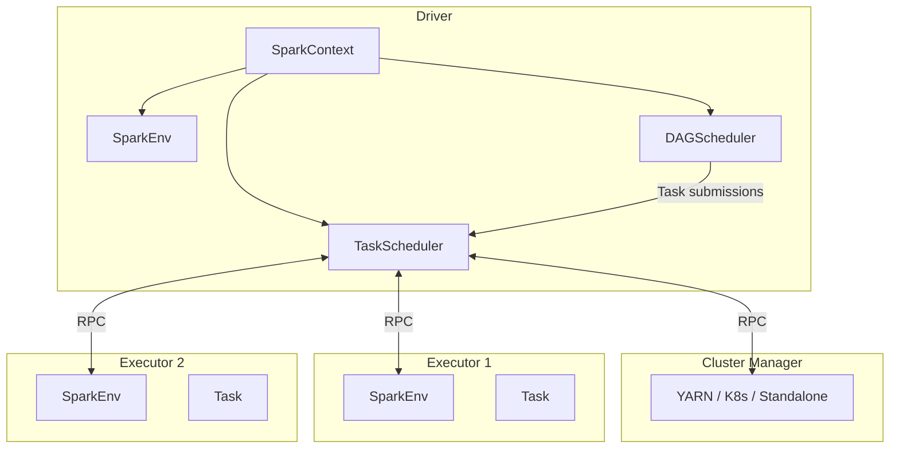
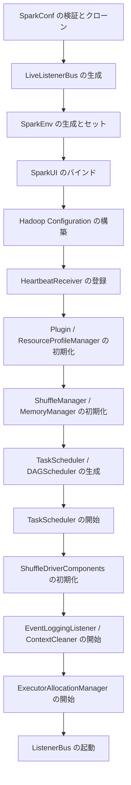
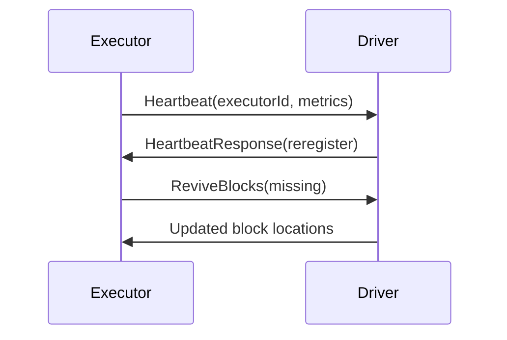

# 第1章 Apache Spark の全体像とアーキテクチャ

> 本章で読むソース
>
> - [SparkContext.scala L86-L96](https://github.com/apache/spark/blob/v4.1.2/core/src/main/scala/org/apache/spark/SparkContext.scala#L86-L96)
> - [SparkContext.scala L409-L603](https://github.com/apache/spark/blob/v4.1.2/core/src/main/scala/org/apache/spark/SparkContext.scala#L409-L603)
> - [SparkConf.scala L284-L299](https://github.com/apache/spark/blob/v4.1.2/core/src/main/scala/org/apache/spark/SparkConf.scala#L284-L299)
> - [SparkEnv.scala L60-L72](https://github.com/apache/spark/blob/v4.1.2/core/src/main/scala/org/apache/spark/SparkEnv.scala#L60-L72)
> - [SparkEnv.scala L318-L500](https://github.com/apache/spark/blob/v4.1.2/core/src/main/scala/org/apache/spark/SparkEnv.scala#L318-L500)

## この章の狙い

本章では Apache Spark の起動シーケンスを `SparkConf`、`SparkContext`、`SparkEnv` の3クラスを中心に追う。
これら3つは Spark アプリケーションの骨格であり、どのようなクラスタモードを使う場合でも必ず通る初期化経路である。
読み終えたとき、ドライバプロセス内部にどのようなコンポーネントがどのような順序で立ち上がるかを説明できるようになることを目指す。

## 前提

読者は Spark を `spark-submit` または `SparkSession.builder` 経由で起動した経験があるものとする。
Scala の基本的なクラス継承と `try/catch` 構文が読めれば十分である。
本章で取り扱うバージョンは v4.1.2 である。

## Spark の構成要素

Spark のランタイムは大きく分けて次の要素からなる。

- **ドライバ（Driver）**: アプリケーションのメインプロセス。`SparkContext` を保持し、DAG の分割やタスクのスケジューリングを担う。
- **エグゼキュータ（Executor）**: ワーカーノード上で起動する JVM プロセス。タスクの実行とデータのキャッシュを担う。
- **クラスタマネージャ**: リソースの割り当てを管理する外部コンポーネント。Standalone、YARN、Kubernetes などがある。

ドライバとエグゼキュータは RPC で通信し、タスクのディスパッチや結果の収集を行う。
次の図が全体像である。



## SparkConf: 設定のエントリポイント

`SparkConf` は Spark アプリケーションの設定値を格納するクラスである。
キーと値のペアを内部の `ConcurrentHashMap` に保持し、型付きアクセサを通じて各種パラメータを取り出せる。

[SparkConf.scala L284-L295](https://github.com/apache/spark/blob/v4.1.2/core/src/main/scala/org/apache/spark/SparkConf.scala#L284-L295)

```scala
class SparkConf(loadDefaults: Boolean)
    extends ReadOnlySparkConf
    with Cloneable
    with Logging
    with Serializable {

  import SparkConf._

  /** Create a SparkConf that loads defaults from system properties and the classpath */
  def this() = this(true)

  private val settings = new ConcurrentHashMap[String, String]()
```

`loadDefaults = true` で構築すると、JVM のシステムプロパティやクラスパス上の設定ファイルから値を読み込む。
明示的に `set` した値がシステムプロパティより優先される。
一度 `SparkContext` に渡された `SparkConf` はクローンされるため、実行中にユーザーが変更できない。
この非可変性により、設定の不整合に起因するレースコンディションを防いでいる。

## SparkContext: 初期化の全体像

`SparkContext` は Spark の全機能への入り口となるクラスである。
RDD の作成、Broadcast 変数の登録、アクキュミュレータの生成はいずれも `SparkContext` 経由で行われる。
JVM 内で同時にアクティブになれる `SparkContext` は1つだけである。

[SparkContext.scala L86-L96](https://github.com/apache/spark/blob/v4.1.2/core/src/main/scala/org/apache/spark/SparkContext.scala#L86-L96)

```scala
class SparkContext(config: SparkConf) extends Logging {

  // The call site where this SparkContext was constructed.
  private val creationSite: CallSite = Utils.getCallSite()

  private var stopSite: Option[CallSite] = None

  if (!config.get(EXECUTOR_ALLOW_SPARK_CONTEXT)) {
    // In order to prevent SparkContext from being created in executors.
    SparkContext.assertOnDriver()
  }

  // In order to prevent multiple SparkContexts from being active at the same time, mark this
  // context as having started construction.
  // NOTE: this must be placed at the beginning of the SparkContext constructor.
  SparkContext.markPartiallyConstructed(this)
```

コンストラクタの冒頭で `assertOnDriver()` を呼び、エグゼキュータ内での `SparkContext` 生成を防ぐ。
続いて `markPartiallyConstructed` でグローバルフラグを立て、2つ目の `SparkContext` が同時に作られることを阻止する。

### 初期化シーケンス

`SparkContext` のコンストラクタ本体（L409 以降の `try` ブロック）は次の順で進む。



以下、各ステップの詳細を追う。

### 設定の検証と LiveListenerBus の生成

まず `SparkConf` をクローンし、`spark.master` と `spark.app.name` の存在を検証する。
続いて `LiveListenerBus` を生成する。
これは Spark 内部の非同期イベントバスであり、初期化中に発生したイベントを後段のリスナへ配信する。

[SparkContext.scala L492](https://github.com/apache/spark/blob/v4.1.2/core/src/main/scala/org/apache/spark/SparkContext.scala#L492)

```scala
_listenerBus = new LiveListenerBus(_conf)
```

### SparkEnv の生成

`SparkEnv` は Spark の実行環境を保持するコンテナである。
シリアライザ、RpcEnv、BlockManager、MapOutputTracker、BroadcastManager など、実行に必要なほぼすべてのコンポーネントへの参照をまとめている。

[SparkContext.scala L500-L502](https://github.com/apache/spark/blob/v4.1.2/core/src/main/scala/org/apache/spark/SparkContext.scala#L500-L502)

```scala
// Create the Spark execution environment (cache, map output tracker, etc)
_env = createSparkEnv(_conf, isLocal, listenerBus)
SparkEnv.set(_env)
```

`SparkEnv.create` メソッド（L318 以降）では次のコンポーネントを順に構築する。

[SparkEnv.scala L60-L72](https://github.com/apache/spark/blob/v4.1.2/core/src/main/scala/org/apache/spark/SparkEnv.scala#L60-L72)

```scala
class SparkEnv (
    val executorId: String,
    private[spark] val rpcEnv: RpcEnv,
    val serializer: Serializer,
    val closureSerializer: Serializer,
    val serializerManager: SerializerManager,
    val mapOutputTracker: MapOutputTracker,
    val broadcastManager: BroadcastManager,
    val blockManager: BlockManager,
    val securityManager: SecurityManager,
    val metricsSystem: MetricsSystem,
    val outputCommitCoordinator: OutputCommitCoordinator,
    val conf: SparkConf) extends Logging {
```

`SparkEnv` はドライバとエグゼキュータの両方で生成される。
ドライバでは `createDriverEnv`、エグゼキュータでは `createExecutorEnv` が呼ばれる。
どちらの経路も内部で `SparkEnv.create` プライベートメソッドに集約される。
RpcEnv、BlockManager、MapOutputTracker といったコンポーネントは同じクラスを使いつつ、ドライバ用とワーカー用で実装を切り替えている。
たとえば MapOutputTracker はドライバ側で `MapOutputTrackerMaster`、エグゼキュータ側で `MapOutputTrackerWorker` を生成する。

[SparkEnv.scala L378-L382](https://github.com/apache/spark/blob/v4.1.2/core/src/main/scala/org/apache/spark/SparkEnv.scala#L378-L382)

```scala
val mapOutputTracker = if (isDriver) {
  new MapOutputTrackerMaster(conf, broadcastManager, isLocal)
} else {
  new MapOutputTrackerWorker(conf)
}
```

### スケジューラの生成

`SparkEnv` の構築が終わると、TaskScheduler と DAGScheduler を生成する。

[SparkContext.scala L599-L603](https://github.com/apache/spark/blob/v4.1.2/core/src/main/scala/org/apache/spark/SparkContext.scala#L599-L603)

```scala
// Create and start the scheduler
val (sched, ts) = SparkContext.createTaskScheduler(this, master)
_schedulerBackend = sched
_taskScheduler = ts
_dagScheduler = new DAGScheduler(this)
```

`createTaskScheduler` は `spark.master` の値に応じて実装を切り替える。
`local` であれば `LocalSchedulerBackend`、`spark://` であれば `StandaloneSchedulerBackend`、`yarn` であれば YARN 用のバックエンドを選ぶ。
DAGScheduler はジョブをステージに分割し、TaskScheduler が各ステージのタスクをエグゼキュータに割り当てる。
この2層構造により、DAG の論理構造とクラスタのリソース管理が分離されている。

## RPC 通信の基盤: NettyRpcEnv

`SparkEnv` の構成要素のうち、`RpcEnv` はドライバとエグゼキュータ間の通信基盤である。
Spark は Netty を使った独自の RPC フレームワークを持ち、すべてのコンポーネント間通信はこの上を通過する。

[SparkEnv.scala L60-L72](https://github.com/apache/spark/blob/v4.1.2/core/src/main/scala/org/apache/spark/SparkEnv.scala#L60-L72)

```scala
class SparkEnv (
    val executorId: String,
    private[spark] val rpcEnv: RpcEnv,
    val serializer: Serializer,
    val closureSerializer: Serializer,
    val serializerManager: SerializerManager,
    val mapOutputTracker: MapOutputTracker,
    val broadcastManager: BroadcastManager,
    val blockManager: BlockManager,
    val securityManager: SecurityManager,
    val metricsSystem: MetricsSystem,
    val outputCommitCoordinator: OutputCommitCoordinator,
    val conf: SparkConf) extends Logging {
```

`RpcEnv.create` は `NettyRpcEnvFactory` 経由で `NettyRpcEnv` を生成する。
ドライバでは `DriverSystemName`（"sparkDriver"）、エグゼキュータでは `ExecutorSystemName`（"sparkExecutor"）を使う。
RPC エンドポイントは `RpcEndpoint` トレイトを実装し、`receive` メソッドでメッセージを処理する。
代表的なエンドポイントに `HeartbeatReceiver`、`BlockManagerMaster`、`MapOutputTracker` がある。



ハートビートは `spark.executor.heartbeatInterval`（デフォルト10秒）ごとに送られる。
エグゼキュータが時間内にハートビートを送れない場合、ドライバはエグゼキュータを失ったと判断する。
このしきい値は `spark.network.timeout` で制御される。

## シャットダウンの順序

`SparkContext.stop()` は初期化と逆順でコンポーネントを解放する。

[SparkContext.scala L2308-L2330](https://github.com/apache/spark/blob/v4.1.2/core/src/main/scala/org/apache/spark/SparkContext.scala#L2308-L2330)

```scala
  def stop(): Unit = stop(0)

  /**
   * Shut down the SparkContext with exit code that will passed to scheduler backend.
   * ...
   */
  def stop(exitCode: Int): Unit = {
    stopSite = Some(getCallSite())
    logInfo(log"SparkContext is stopping with exitCode ${MDC(LogKeys.EXIT_CODE, exitCode)}" +
      log" from ${MDC(LogKeys.STOP_SITE_SHORT_FORM, stopSite.get.shortForm)}.")
    if (LiveListenerBus.withinListenerThread.value) {
      throw new SparkException(s"Cannot stop SparkContext within listener bus thread.")
    }
    // Use the stopping variable to ensure no contention for the stop scenario.
    // Still track the stopped variable for use elsewhere in the code.
    if (!stopped.compareAndSet(false, true)) {
      logInfo("SparkContext already stopped.")
      return
    }
```

シャットダウンは次の順で進む。

1. `SparkContext` の停止フラグを立てる（`markStopping`）
2. DAGScheduler を停止する
3. TaskScheduler を停止する
4. `SparkEnv` を解放する（RpcEnv、BlockManager、BroadcastManager）
5. `SparkUI` を停止する
6. `LiveListenerBus` を停止する
7. メトリクスシステムを停止する

初期化と同様に順序が重要である。DAGScheduler がタスクを送出している間に TaskScheduler を止めると、完了通知を受け取れなくなる。
`SparkEnv.stop()` の中で `rpcEnv.shutdown()` を呼び、すべての RPC チャネルを閉じる。
最後に `LiveListenerBus.stop()` でイベントキューをフラッシュしてからスレッドを終了する。

## 最適化の工夫: Hadoop Configuration の事前初期化

`SparkContext` の初期化には、一見すると冗長に見えるコードが含まれている。

[SparkContext.scala L531-L540](https://github.com/apache/spark/blob/v4.1.2/core/src/main/scala/org/apache/spark/SparkContext.scala#L531-L540)

```scala
_hadoopConfiguration = SparkHadoopUtil.get.newConfiguration(_conf)
// Performance optimization: this dummy call to .size() triggers eager evaluation of
// Configuration's internal  `properties` field, guaranteeing that it will be computed and
// cached before SessionState.newHadoopConf() uses `sc.hadoopConfiguration` to create
// a new per-session Configuration. If `properties` has not been computed by that time
// then each newly-created Configuration will perform its own expensive IO and XML
// parsing to load configuration defaults and populate its own properties. By ensuring
// that we've pre-computed the parent's properties, the child Configuration will simply
// clone the parent's properties.
_hadoopConfiguration.size()
```

Hadoop の `Configuration` クラスは内部の `properties` フィールドが遅延評価される。
最初にアクセスしたタイミングで XML ファイルの読み込みとパースが走る。
もしドライバの `Configuration` が未初期化のうちに Spark SQL がセッション別の `Configuration` を作ると、毎回 XML パースが繰り返される。
ここで `.size()` というダミー呼び出しを入れて `properties` を先に確定させておくことで、後続のセッション別 `Configuration` は親のクローンで済む。
結果として XML I/O が1回で済み、セッション起動のオーバーヘッドを削減できる。

## まとめ

本章では Spark の起動シーケンスを3つのコアクラスに沿って追った。

- `SparkConf` は設定の非可変なコンテナとして、アプリケーション全体のパラメータを保持する。
- `SparkContext` は初期化の司令塔であり、設定検証からスケジューラの起動までを例外安全な `try` ブロックで実行する。
- `SparkEnv` は RpcEnv、BlockManager、MapOutputTracker などの実行時コンポーネントを1つのオブジェクトにまとめ、ドライバとエグゼキュータの双方で同じ構造を再利用する。

初期化の順序は依存関係によって厳密に決まっている。
ListenerBus は SparkEnv より前に、HeartbeatReceiver は TaskScheduler より前に、それぞれ存在しなければならない。
この順序制約を理解しておくことで、Spark の内部で問題が起きた際の切り分けが容易になる。

## 関連する章

（なし: 本ドキュメントの最初の章である）
