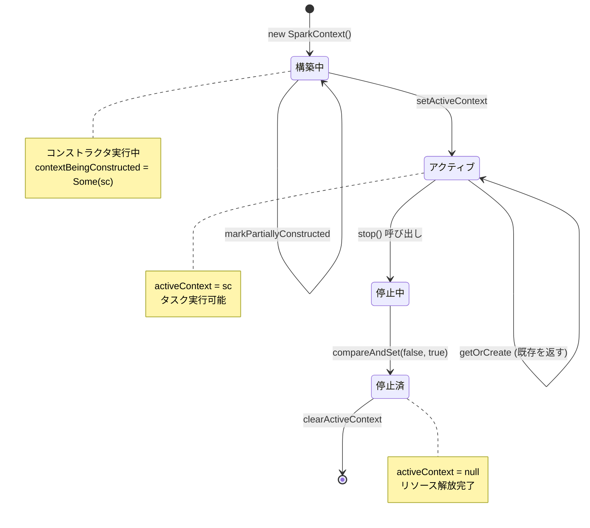

# 第2章 SparkContext とアプリケーションライフサイクル

> 本章で読むソース:
>
> - [SparkContext.scala L86-L747](https://github.com/apache/spark/blob/v4.1.2/core/src/main/scala/org/apache/spark/SparkContext.scala#L86-L747)（コンストラクタと初期化）
> - [SparkContext.scala L2308-L2421](https://github.com/apache/spark/blob/v4.1.2/core/src/main/scala/org/apache/spark/SparkContext.scala#L2308-L2421)（`stop()` メソッド）
> - [SparkContext.scala L2994-L3146](https://github.com/apache/spark/blob/v4.1.2/core/src/main/scala/org/apache/spark/SparkContext.scala#L2994-L3146)（コンパニオンオブジェクトとシングルトン管理）

## この章の狙い

本章では、Spark アプリケーションのエントリポイントである **SparkContext** の生成から破棄までのライフサイクルを追う。
SparkContext はクラスタへの接続を表現し、RDD の生成、アクセキュレータ、Broadcast 変数の操作を担う。
JVM 内で同時にアクティブになれる SparkContext は一つだけである。
この制約を守る仕組みと、初期化・終了処理の順序が持つ意味を理解することが本章の目的である。

## 前提

本章は第1章「Apache Spark の全体像とアーキテクチャ」で説明した Driver、Executor、クラスタマネージャの役割を理解していることを前提とする。
また、Scala のクラス初期化と `try-catch` 文の基本的なセマンティクスについても既知とする。

## SparkContext のコンストラクタ

SparkContext のコンストラクタは、アプリケーションの起動時に呼ばれる最も重要な初期化処理である。
コンストラクタの本体は `try-catch` で囲まれ、初期化のどの段階で例外が発生しても `stop()` が呼ばれてリソースを解放する設計になっている。

[SparkContext.scala L86-L101](https://github.com/apache/spark/blob/v4.1.2/core/src/main/scala/org/apache/spark/SparkContext.scala#L86-L101)

```scala
class SparkContext(config: SparkConf) extends Logging {

  // The call site where this SparkContext was constructed.
  private val creationSite: CallSite = Utils.getCallSite()

  private var stopSite: Option[CallSite] = None

  if (!config.get(EXECUTOR_ALLOW_SPARK_CONTEXT)) {
    // In order to prevent SparkContext from being created in executors.
    SparkContext.assertOnDriver()
  }

  // In order to prevent multiple SparkContexts from being active at the same time, mark this
  // context as having started construction.
  // NOTE: this must be placed at the beginning of the SparkContext constructor.
  SparkContext.markPartiallyConstructed(this)
```

コンストラクタの先頭で `markPartiallyConstructed` を呼ぶ。
この呼び出しは、他のスレッドが同時に SparkContext を生成しようとしていないかを検査するために必須である。
`assertOnDriver` は、Executor 内で SparkContext が生成されることを防ぐガードである。

### 初期化の順序

初期化処理は厳密な順序で進行する。以下に主要なステップを示す。

[SparkContext.scala L409-L502](https://github.com/apache/spark/blob/v4.1.2/core/src/main/scala/org/apache/spark/SparkContext.scala#L409-L502)

```scala
  try {
    _conf = config.clone()
    _conf.get(SPARK_LOG_LEVEL).foreach { level =>
      // ... ログレベルの設定 ...
    }
    _conf.validateSettings()
    _conf.set("spark.app.startTime", startTime.toString)

    if (!_conf.contains("spark.master")) {
      throw new SparkException("A master URL must be set in your configuration")
    }
    if (!_conf.contains("spark.app.name")) {
      throw new SparkException("An application name must be set in your configuration")
    }
    // ... 中略 ...
    _listenerBus = new LiveListenerBus(_conf)

    // Initialize the app status store and listener before SparkEnv is created so that it gets
    // all events.
    val appStatusSource = AppStatusSource.createSource(conf)
    _statusStore = AppStatusStore.createLiveStore(conf, appStatusSource)
    listenerBus.addToStatusQueue(_statusStore.listener.get)

    // Create the Spark execution environment (cache, map output tracker, etc)
    _env = createSparkEnv(_conf, isLocal, listenerBus)
    SparkEnv.set(_env)
```

設定の検証（`spark.master` と `spark.app.name` の必須チェック）が最も早い段階で行われる。
次に `LiveListenerBus` を生成し、その直後に `AppStatusStore` を作成してイベントキューに登録する。
この順序が重要である。`SparkEnv` が生成する内部コンポーネントもイベントを発行するため、リスナバスとステアストアが先に存在していなければならない。

### スケジューラの初期化

`SparkEnv` の生成後、スケジューラ関連のコンポーネントを初期化する。

[SparkContext.scala L588-L629](https://github.com/apache/spark/blob/v4.1.2/core/src/main/scala/org/apache/spark/SparkContext.scala#L588-L629)

```scala
    // We need to register "HeartbeatReceiver" before "createTaskScheduler" because Executor will
    // retrieve "HeartbeatReceiver" in the constructor. (SPARK-6640)
    _heartbeatReceiver = env.rpcEnv.setupEndpoint(
      HeartbeatReceiver.ENDPOINT_NAME, new HeartbeatReceiver(this))

    // Initialize any plugins before initializing the task scheduler and resource profile manager.
    _plugins = PluginContainer(this, _resources.asJava)
    _resourceProfileManager = new ResourceProfileManager(_conf, _listenerBus)
    _env.initializeShuffleManager()
    _env.initializeMemoryManager(SparkContext.numDriverCores(master, conf))

    // Create and start the scheduler
    val (sched, ts) = SparkContext.createTaskScheduler(this, master)
    _schedulerBackend = sched
    _taskScheduler = ts
    _dagScheduler = new DAGScheduler(this)
    _heartbeatReceiver.ask[Boolean](TaskSchedulerIsSet)

    // ... 中略 ...

    // start TaskScheduler after taskScheduler sets DAGScheduler reference in DAGScheduler's
    // constructor
    _taskScheduler.start()
```

`HeartbeatReceiver` を `TaskScheduler` より先に登録する理由は、Executor がコンストラクタ内で `HeartbeatReceiver` を参照するためである（SPARK-6640）。
`DAGScheduler` のコンストラクタは `TaskScheduler` への参照を設定するため、`DAGScheduler` を先に生成してから `TaskScheduler.start()` を呼ぶ。

### シャットダウンフックの登録

初期化の終盤で、JVM 終了時に SparkContext を自動的に停止するためのシャットダウンフックを登録する。

[SparkContext.scala L704-L717](https://github.com/apache/spark/blob/v4.1.2/core/src/main/scala/org/apache/spark/SparkContext.scala#L704-L717)

```scala
    // Make sure the context is stopped if the user forgets about it. This avoids leaving
    // unfinished event logs around after the JVM exits cleanly. It doesn't help if the JVM
    // is killed, though.
    logDebug("Adding shutdown hook") // force eager creation of logger
    _shutdownHookRef = ShutdownHookManager.addShutdownHook(
      ShutdownHookManager.SPARK_CONTEXT_SHUTDOWN_PRIORITY) { () =>
      logInfo("Invoking stop() from shutdown hook")
      try {
        stop()
      } catch {
        case e: Throwable =>
          logWarning("Ignoring Exception while stopping SparkContext from shutdown hook", e)
      }
    }
```

ユーザーが明示的に `stop()` を呼ばなくても、JVM が正常終了する際に SparkContext が停止される。
これにより、イベントログが未完了のまま残ることを防ぐ。
ただし、JVM が強制 kill された場合はこのフックも実行されない。

## シングルトンの保証

JVM 内でアクティブな SparkContext は一つだけである。
この制約はコンパニオンオブジェクトが管理する。

[SparkContext.scala L3001-L3023](https://github.com/apache/spark/blob/v4.1.2/core/src/main/scala/org/apache/spark/SparkContext.scala#L3001-L3023)

```scala
  /**
   * Lock that guards access to global variables that track SparkContext construction.
   */
  private val SPARK_CONTEXT_CONSTRUCTOR_LOCK = new Object()

  /**
   * The active, fully-constructed SparkContext. If no SparkContext is active, then this is `null`.
   *
   * Access to this field is guarded by `SPARK_CONTEXT_CONSTRUCTOR_LOCK`.
   */
  private val activeContext: AtomicReference[SparkContext] =
    new AtomicReference[SparkContext](null)

  /**
   * Points to a partially-constructed SparkContext if another thread is in the SparkContext
   * constructor, or `None` if no SparkContext is being constructed.
   *
   * Access to this field is guarded by `SPARK_CONTEXT_CONSTRUCTOR_LOCK`.
   */
  private var contextBeingConstructed: Option[SparkContext] = None
```

`SPARK_CONTEXT_CONSTRUCTOR_LOCK` というロックオブジェクトが、`activeContext` と `contextBeingConstructed` へのアクセスを直列化する。
`getOrCreate` メソッドはこのロックを取得した状態で、既存の SparkContext がなければ新規に生成する。

[SparkContext.scala L3071-L3084](https://github.com/apache/spark/blob/v4.1.2/core/src/main/scala/org/apache/spark/SparkContext.scala#L3071-L3084)

```scala
  def getOrCreate(config: SparkConf): SparkContext = {
    // Synchronize to ensure that multiple create requests don't trigger an exception
    // from assertNoOtherContextIsRunning within setActiveContext
    SPARK_CONTEXT_CONSTRUCTOR_LOCK.synchronized {
      if (activeContext.get() == null) {
        setActiveContext(new SparkContext(config))
      } else {
        if (config.getAll.nonEmpty) {
          logWarning("Using an existing SparkContext; some configuration may not take effect.")
        }
      }
      activeContext.get()
    }
  }
```

すでにアクティブな SparkContext が存在する場合、新しい設定は無視され、既存のインスタンスを返す。
このとき警告ログを出すことで、設定が反映されない可能性を利用者に通知する。

## stop() メソッドとリソース解放

`stop()` メソッドは、初期化の逆順でコンポーネントを停止する。
各コンポーネントの停止は `Utils.tryLogNonFatalError` で囲まれ、一つの停止処理が失敗しても他のコンポーネントの停止を妨げない設計である。

[SparkContext.scala L2321-L2348](https://github.com/apache/spark/blob/v4.1.2/core/src/main/scala/org/apache/spark/SparkContext.scala#L2321-L2348)

```scala
  def stop(exitCode: Int): Unit = {
    stopSite = Some(getCallSite())
    logInfo(log"SparkContext is stopping with exitCode ${MDC(LogKeys.EXIT_CODE, exitCode)}" +
      log" from ${MDC(LogKeys.STOP_SITE_SHORT_FORM, stopSite.get.shortForm)}.")
    if (LiveListenerBus.withinListenerThread.value) {
      throw new SparkException(s"Cannot stop SparkContext within listener bus thread.")
    }
    // Use the stopping variable to ensure no contention for the stop scenario.
    // Still track the stopped variable for use elsewhere in the code.
    if (!stopped.compareAndSet(false, true)) {
      logInfo("SparkContext already stopped.")
      return
    }
    if (_shutdownHookRef != null) {
      ShutdownHookManager.removeShutdownHook(_shutdownHookRef)
    }

    if (listenerBus != null) {
      Utils.tryLogNonFatalError {
        postApplicationEnd(exitCode)
      }
    }
    Utils.tryLogNonFatalError {
      _driverLogger.foreach(_.stop())
    }
    Utils.tryLogNonFatalError {
      _ui.foreach(_.stop())
    }
```

`stopped` フィールドは `AtomicBoolean` であり、`compareAndSet` でアトミックに更新する。
これにより、複数のスレッドから同時に `stop()` が呼ばれても、実際に停止処理を実行するのは一度だけである。
リスナバススレッド内からの `stop()` 呼び出しは禁止されている。デッドロックを防ぐためである。

### 停止の順序

停止処理は以下の順序で進行する。

1. `postApplicationEnd` でアプリケーション終了イベントを発行
2. `DriverLogger`、`SparkUI`、`ContextCleaner` を停止
3. `ExecutorAllocationManager` を停止
4. `DAGScheduler` を停止
5. プラグインをシャットダウン
6. `LiveListenerBus` を停止
7. `EventLoggingListener` を停止
8. `Heartbeater`、`HeartbeatReceiver` を停止
9. `SparkEnv` を停止（これにより `BlockManager`、`MapOutputTracker` なども停止）
10. `AppStatusStore` をクローズ
11. `clearActiveContext` でグローバル状態をクリア

`DAGScheduler` を `LiveListenerBus` より先に停止する点が重要である。
`DAGScheduler` の停止中にイベントを発行する可能性があるため、リスナバスはまだ動作している必要がある。

## アプリケーションライフサイクルの状態遷移

SparkContext のライフサイクルを状態遷移図で示す。



状態遷移の各段階で、コンパニオンオブジェクトが持つ `activeContext` と `contextBeingConstructed` の値が変化する。
「構築中」状態は、コンストラクタが `markPartiallyConstructed` を呼んだ瞬間から、`setActiveContext` が呼ばれるまで続く。
この間に他のスレッドが SparkContext を生成しようとすると、警告ログが出力される。

## Hadoop 設定の事前評価による最適化

初期化処理には、パフォーマンスを考慮した工夫が含まれている。
Hadoop の `Configuration` オブジェクトは、内部の `properties` フィールドへのアクセス時に遅延評価で XML をパースする。
このパース処理はコストが高いため、Spark は事前にダミーの呼び出しで評価をトリガーする。

[SparkContext.scala L531-L540](https://github.com/apache/spark/blob/v4.1.2/core/src/main/scala/org/apache/spark/SparkContext.scala#L531-L540)

```scala
    _hadoopConfiguration = SparkHadoopUtil.get.newConfiguration(_conf)
    // Performance optimization: this dummy call to .size() triggers eager evaluation of
    // Configuration's internal  `properties` field, guaranteeing that it will be computed and
    // cached before SessionState.newHadoopConf() uses `sc.hadoopConfiguration` to create
    // a new per-session Configuration. If `properties` has not been computed by that time
    // then each newly-created Configuration will perform its own expensive IO and XML
    // parsing to load configuration defaults and populate its own properties. By ensuring
    // that we've pre-computed the parent's properties, the child Configuration will simply
    // clone the parent's properties.
    _hadoopConfiguration.size()
```

`_hadoopConfiguration.size()` という一見無意味な呼び出しは、`properties` フィールドの遅延評価を強制的に実行させるためのトリッカーである。
Spark SQL の `SessionState` はセッションごとに新しい `Configuration` を生成する。
親の `properties` が未評価のままだと、子となる `Configuration` はそれぞれ独立に XML パースと IO を実行する。
事前に親を評価しておくことで、子は親の `properties` をクローンするだけで済み、セッション生成のオーバーヘッドを削減できる。

## まとめ

本章では SparkContext のライフサイクルを追った。
コンストラクタは設定の検証から始まり、`LiveListenerBus`、`SparkEnv`、スケジューラの順で初期化する。
各コンポーネントの初期化順序は依存関係によって厳密に決まっている。
`stop()` メソッドは初期化の逆順でリソースを解放し、`AtomicBoolean` による排他で多重停止を防ぐ。
コンパニオンオブジェクトは `SPARK_CONTEXT_CONSTRUCTOR_LOCK` によって JVM 内のシングルトンを保証する。
Hadoop 設定の事前評価は、遅延評価に伴う繰り返しコストを回避する最適化である。

SparkContext がアクティブになると、RDD の生成やジョブの投入が可能になる。
次の章では、RDD の設計と実装について詳しく見る。

## 関連する章

- 第1章 [Apache Spark の全体像とアーキテクチャ](01-overview-and-architecture.md)
- 第3章 [RDD の設計と実装](../part01-rdd/03-rdd-design-and-implementation.md)
- 第6章 [DAGScheduler: ステージ構築とジョブスケジューリング](../part02-scheduling/06-dagscheduler.md)
