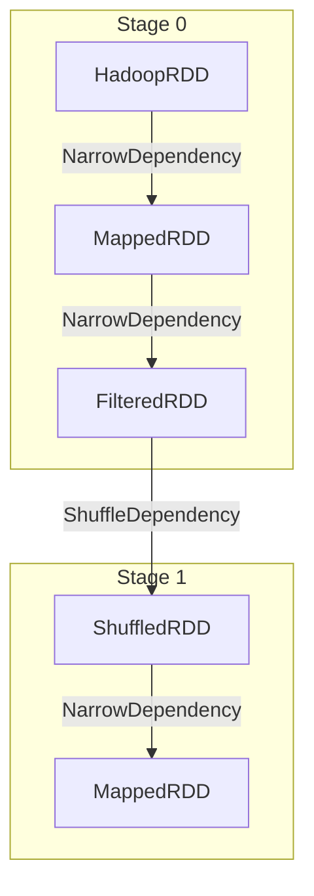
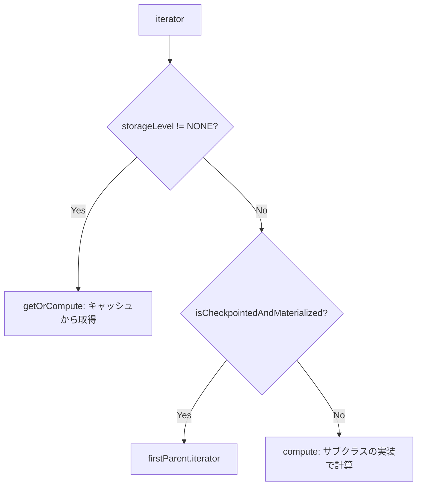
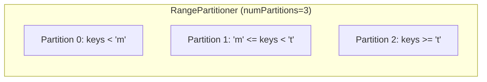
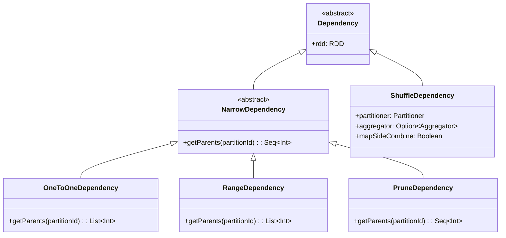

# 第3章 RDD の設計と実装

> 本章で読むソース
>
> - [RDD.scala L56-L139](https://github.com/apache/spark/blob/v4.1.2/core/src/main/scala/org/apache/spark/rdd/RDD.scala#L56-L139)
> - [RDD.scala L247-L340](https://github.com/apache/spark/blob/v4.1.2/core/src/main/scala/org/apache/spark/rdd/RDD.scala#L247-L340)
> - [Dependency.scala L41-L61](https://github.com/apache/spark/blob/v4.1.2/core/src/main/scala/org/apache/spark/Dependency.scala#L41-L61)
> - [Dependency.scala L84-L94](https://github.com/apache/spark/blob/v4.1.2/core/src/main/scala/org/apache/spark/Dependency.scala#L84-L94)
> - [Dependency.scala L262-L286](https://github.com/apache/spark/blob/v4.1.2/core/src/main/scala/org/apache/spark/Dependency.scala#L262-L286)
> - [Partition.scala L23-L33](https://github.com/apache/spark/blob/v4.1.2/core/src/main/scala/org/apache/spark/Partition.scala#L23-L33)

## この章の狙い

RDD は Spark の根幹をなすデータ抽象である。本章では RDD 抽象クラスがサブクラスに要求する5つの基本プロパティをソースコードから読み取り、Dependency の種類が DAG のステージ分割にどう関わるかを整理する。

## 前提

第2章で SparkContext がアプリケーションの入口であることを確認した。本章では SparkContext が生成する RDD の内部構造に踏み込む。

## RDD の5つの基本プロパティ

RDD 抽象クラスの Scaladoc は、各 RDD が5つのプロパティで特徴づけられると明記している。

[RDD.scala L69-L76](https://github.com/apache/spark/blob/v4.1.2/core/src/main/scala/org/apache/spark/rdd/RDD.scala#L69-L76)

```scala
 *  - A list of partitions
 *  - A function for computing each split
 *  - A list of dependencies on other RDDs
 *  - Optionally, a Partitioner for key-value RDDs (e.g. to say that the RDD is hash-partitioned)
 *  - Optionally, a list of preferred locations to compute each split on (e.g. block locations for
 *    an HDFS file)
```

対応する抽象メソッドを確認する。

[RDD.scala L115-L139](https://github.com/apache/spark/blob/v4.1.2/core/src/main/scala/org/apache/spark/rdd/RDD.scala#L115-L139)

```scala
  @DeveloperApi
  def compute(split: Partition, context: TaskContext): Iterator[T]

  protected def getPartitions: Array[Partition]

  protected def getDependencies: Seq[Dependency[_]] = deps

  protected def getPreferredLocations(split: Partition): Seq[String] = Nil

  @transient val partitioner: Option[Partitioner] = None
```

`compute` は与えられたパーティションの要素を返すイテレータを生成する。`getPartitions` は全パーティションの配列を返す。`getDependencies` は親 RDD への依存関係を返す。`getPreferredLocations` はデータローカリティのための推奨配置場所を返す。`partitioner` はキーバリュー RDD のパーティション分割方式を保持する。

これら5つはテンプレートメソッドパターンである。サブクラスは `compute` と `getPartitions` を必ず実装する。スケジューラは具象クラスを知らず、この5つのメソッドだけで任意の RDD を扱える。

## パーティションと依存関係の遅延初期化

`partitions` と `dependencies` は初回アクセス時にのみ計算され、キャッシュされる。

[RDD.scala L296-L311](https://github.com/apache/spark/blob/v4.1.2/core/src/main/scala/org/apache/spark/rdd/RDD.scala#L296-L311)

```scala
  final def partitions: Array[Partition] = {
    checkpointRDD.map(_.partitions).getOrElse {
      if (partitions_ == null) {
        stateLock.synchronized {
          if (partitions_ == null) {
            partitions_ = getPartitions
            partitions_.zipWithIndex.foreach { case (partition, index) =>
              require(partition.index == index,
                s"partitions($index).partition == ${partition.index}, but it should equal $index")
            }
          }
        }
      }
      partitions_
    }
  }
```

`partitions_` は `@volatile` で宣言され、ダブルチェックロックで初期化される。`getPartitions` は時間のかかる処理を含む可能性があり、遅延初期化によって不要な計算を避けている。`map` や `filter` をチェーンしても、アクションが呼ばれるまでパーティション構造を計算しない。変換操作の呼び出しコストを最小限に抑えられる。

## Dependency の種類

Dependency は RDD 間の依存関係を表現する。

[Dependency.scala L41-L43](https://github.com/apache/spark/blob/v4.1.2/core/src/main/scala/org/apache/spark/Dependency.scala#L41-L43)

```scala
abstract class Dependency[T] extends Serializable {
  def rdd: RDD[T]
}
```

Dependency は NarrowDependency と ShuffleDependency に分かれる。この区別が DAGScheduler によるステージ分割の基準になる。

### NarrowDependency

NarrowDependency は子 RDD の各パーティションが親 RDD の少数のパーティションにしか依存しない関係を表す。

[Dependency.scala L52-L61](https://github.com/apache/spark/blob/v4.1.2/core/src/main/scala/org/apache/spark/Dependency.scala#L52-L61)

```scala
abstract class NarrowDependency[T](_rdd: RDD[T]) extends Dependency[T] {
  def getParents(partitionId: Int): Seq[Int]

  override def rdd: RDD[T] = _rdd
}
```

`getParents` は子パーティションのインデックスを受け取り、依存する親パーティションの列を返す。具体クラスは2種類ある。

[Dependency.scala L262-L264](https://github.com/apache/spark/blob/v4.1.2/core/src/main/scala/org/apache/spark/Dependency.scala#L262-L264)

```scala
class OneToOneDependency[T](rdd: RDD[T]) extends NarrowDependency[T](rdd) {
  override def getParents(partitionId: Int): List[Int] = List(partitionId)
}
```

`OneToOneDependency` は `filter` や `map` など1対1対応の変換で使われる。

[Dependency.scala L276-L286](https://github.com/apache/spark/blob/v4.1.2/core/src/main/scala/org/apache/spark/Dependency.scala#L276-L286)

```scala
class RangeDependency[T](rdd: RDD[T], inStart: Int, outStart: Int, length: Int)
  extends NarrowDependency[T](rdd) {

  override def getParents(partitionId: Int): List[Int] = {
    if (partitionId >= outStart && partitionId < outStart + length) {
      List(partitionId - outStart + inStart)
    } else {
      Nil
    }
  }
}
```

`RangeDependency` は `union` や `coalesce` など範囲がずれる変換で使われる。

NarrowDependency の重要な性質はパイプライン実行を可能にすることである。親のパーティションを計算したらディスクに書かず直接子に渡せる。Narrow な依存だけで繋がる RDD 群は同一ステージ内で実行できる。

### ShuffleDependency

ShuffleDependency は子 RDD の各パーティションが親 RDD の全パーティションに依存する関係を表す。

[Dependency.scala L84-L94](https://github.com/apache/spark/blob/v4.1.2/core/src/main/scala/org/apache/spark/Dependency.scala#L84-L94)

```scala
class ShuffleDependency[K: ClassTag, V: ClassTag, C: ClassTag](
    @transient private val _rdd: RDD[_ <: Product2[K, V]],
    val partitioner: Partitioner,
    val serializer: Serializer = SparkEnv.get.serializer,
    val keyOrdering: Option[Ordering[K]] = None,
    val aggregator: Option[Aggregator[K, V, C]] = None,
    val mapSideCombine: Boolean = false,
    val shuffleWriterProcessor: ShuffleWriteProcessor = new ShuffleWriteProcessor,
    val rowBasedChecksums: Array[RowBasedChecksum] = ShuffleDependency.EMPTY_ROW_BASED_CHECKSUMS,
    val checksumMismatchFullRetryEnabled: Boolean = false)
  extends Dependency[Product2[K, V]] with Logging {
```

`groupByKey` や `reduceByKey` などキーの再配置を必要とする変換で生成される。ShuffleDependency が存在する場所で DAG はステージに分割される。

## 依存関係グラフの構造

RDD の依存関係は DAG を形成する。NarrowDependency はパイプライン実行可能なチェーンを作り、ShuffleDependency がステージ境界になる。



DAGScheduler はこのグラフを辿り、ShuffleDependency を境界としてステージに分割する。ステージ内の Narrow な依存チェーンはパイプライン化され、1つのタスクでまとめて実行される。

## RDD の計算フロー

RDD の `iterator` メソッドはパーティションの計算入口である。

[RDD.scala L334-L340](https://github.com/apache/spark/blob/v4.1.2/core/src/main/scala/org/apache/spark/rdd/RDD.scala#L334-L340)

```scala
  final def iterator(split: Partition, context: TaskContext): Iterator[T] = {
    if (storageLevel != StorageLevel.NONE) {
      getOrCompute(split, context)
    } else {
      computeOrReadCheckpoint(split, context)
    }
  }
```

キャッシュされていれば `getOrCompute` でブロックを取得し、されていなければ `computeOrReadCheckpoint` で計算またはチェックポイントからの読み出しを行う。



この分岐により、キャッシュ、チェックポイント、通常計算が透過的に切り替わる。

## Partition の概念

Partition は RDD の各分割を表す識別子である。

[Partition.scala L23-L33](https://github.com/apache/spark/blob/v4.1.2/core/src/main/scala/org/apache/spark/Partition.scala#L23-L33)

```scala
trait Partition extends Serializable {
  def index: Int

  override def hashCode(): Int = index

  override def equals(other: Any): Boolean = super.equals(other)
}
```

Partition は `index` だけを持つ軽量な識別子である。実際のデータは保持せず、`compute` メソッドが `index` を使ってデータを取得する。各サブクラスは `HadoopPartition`、`ParallelCollectionPartition` など固有の実装を持つ。

## Partitioner の種類

キーバリュー RDD は `Partitioner` を持ち、キーをどのパーティションに割り当てるかを決定する。

[Partitioner.scala L42-L45](https://github.com/apache/spark/blob/v4.1.2/core/src/main/scala/org/apache/spark/Partitioner.scala#L42-L45)

```scala
abstract class Partitioner extends Serializable {
  def numPartitions: Int
  def getPartition(key: Any): Int
}
```

具体クラスは2種類ある。

### HashPartitioner

`HashPartitioner` はキーのハッシュ値をパーティション数で割って割り当てる。

[Partitioner.scala L114-L122](https://github.com/apache/spark/blob/v4.1.2/core/src/main/scala/org/apache/spark/Partitioner.scala#L114-L122)

```scala
class HashPartitioner(partitions: Int) extends Partitioner {
  require(partitions >= 0, s"Number of partitions ($partitions) cannot be negative.")

  def numPartitions: Int = partitions

  def getPartition(key: Any): Int = key match {
    case null => 0
    case _ => Utils.nonNegativeMod(key.hashCode, numPartitions)
  }
```

`reduceByKey` や `groupByKey` のデフォルトのパーティショナである。ハッシュ値を使うため、キーの分布が均等であればパーティション間のデータ量も均等になる。

### RangePartitioner

`RangePartitioner` はキーの範囲に基づいてパーティションを分割する。

[Partitioner.scala L176-L181](https://github.com/apache/spark/blob/v4.1.2/core/src/main/scala/org/apache/spark/Partitioner.scala#L176-L181)

```scala
class RangePartitioner[K : Ordering : ClassTag, V](
    partitions: Int,
    rdd: RDD[_ <: Product2[K, V]],
    private var ascending: Boolean = true,
    val samplePointsPerPartitionHint: Int = 20)
  extends Partitioner {
```

`sortByKey` で使われる。データからサンプリングして境界値を決定し、各パーティションが連続したキー範囲を担当する。
これにより、ソート済みデータの効率的な処理が可能になる。



## Dependency の階層全体像

Dependency のクラス階層を整理する。



`PruneDependency` は `PartitionPruningRDD` で使われ、特定のパーティションだけを抽出する場合に使用される。

## 高速化の工夫: Lineage の遅延評価とフォールトトレランス

RDD の最も重要な設計上の工夫は、lineage の遅延評価によるフォールトトレランスである。

RDD はデータの実体を保持せず、変換操作を適用しても即座に計算しない。代わりに RDD オブジェクトのチェーンとして変換を記録するだけである。このチェーンが lineage であり、Dependency がその実体である。

パーティションのデータが失われたとき、Spark は lineage を辿って失われたパーティションだけを再計算する。`compute` メソッドは親 RDD の `iterator` を呼び出し、親も同様に `compute` を呼ぶ。この再帰的な構造により、任意の地点から計算を再開できる。

データを実体に保存しない設計の利点は2つある。1つ目はメモリ効率である。変換を記録するだけならデータのコピーが不要である。2つ目はフォールトトレランスである。ノード障害でデータが失われても lineage から再計算できる。

この仕組みが機能するためには `compute` が決定論的である必要がある。同じ入力に対して同じ出力を返す限り、何回再計算しても結果は同じになる。

## まとめ

RDD は5つの基本プロパティで特徴づけられる不変の分散コレクションである。`compute`、`getPartitions`、`getDependencies`、`getPreferredLocations`、`partitioner` が RDD の振る舞いを完全に規定する。Dependency は NarrowDependency と ShuffleDependency に大別され、ShuffleDependency の位置で DAG がステージに分割される。Partition は軽量な識別子であり、データは `compute` によって必要になったときに計算される。lineage の遅延評価により、Spark はデータの実体を保存せずにフォールトトレランスを実現している。

## 関連する章

- [第2章 SparkContext とアプリケーションライフサイクル](../part00-intro/02-sparkcontext-and-lifecycle.md)
- [第4章 RDD の変換とアクション](04-rdd-transformations-and-actions.md)
- [第6章 DAGScheduler: ステージ構築とジョブスケジューリング](../part02-scheduling/06-dagscheduler.md)
