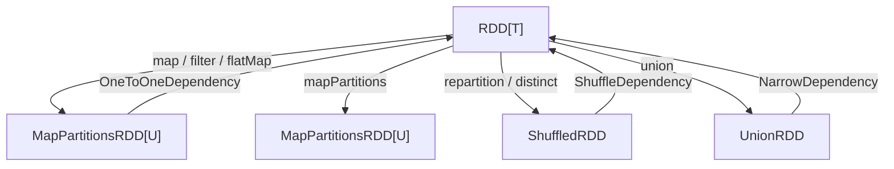
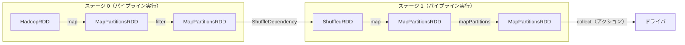

# 第4章 RDD の変換とアクション

> 本章で読むソース
>
> - [RDD.scala L424-L447](https://github.com/apache/spark/blob/v4.1.2/core/src/main/scala/org/apache/spark/rdd/RDD.scala#L424-L447)
> - [RDD.scala L667-L690](https://github.com/apache/spark/blob/v4.1.2/core/src/main/scala/org/apache/spark/rdd/RDD.scala#L667-L690)
> - [RDD.scala L860-L868](https://github.com/apache/spark/blob/v4.1.2/core/src/main/scala/org/apache/spark/rdd/RDD.scala#L860-L868)
> - [RDD.scala L1037-L1084](https://github.com/apache/spark/blob/v4.1.2/core/src/main/scala/org/apache/spark/rdd/RDD.scala#L1037-L1084)
> - [RDD.scala L1130-L1151](https://github.com/apache/spark/blob/v4.1.2/core/src/main/scala/org/apache/spark/rdd/RDD.scala#L1130-L1151)
> - [RDD.scala L1205-L1238](https://github.com/apache/spark/blob/v4.1.2/core/src/main/scala/org/apache/spark/rdd/RDD.scala#L1205-L1238)
> - [RDD.scala L1304-L1304](https://github.com/apache/spark/blob/v4.1.2/core/src/main/scala/org/apache/spark/rdd/RDD.scala#L1304-L1304)
> - [RDD.scala L1473-L1508](https://github.com/apache/spark/blob/v4.1.2/core/src/main/scala/org/apache/spark/rdd/RDD.scala#L1473-L1508)
> - [MapPartitionsRDD.scala L39-L69](https://github.com/apache/spark/blob/v4.1.2/core/src/main/scala/org/apache/spark/rdd/MapPartitionsRDD.scala#L39-L69)
> - [Dependency.scala L41-L61](https://github.com/apache/spark/blob/v4.1.2/core/src/main/scala/org/apache/spark/Dependency.scala#L41-L61)
> - [Dependency.scala L84-L94](https://github.com/apache/spark/blob/v4.1.2/core/src/main/scala/org/apache/spark/Dependency.scala#L84-L94)
> - [Dependency.scala L262-L264](https://github.com/apache/spark/blob/v4.1.2/core/src/main/scala/org/apache/spark/Dependency.scala#L262-L264)

## この章の狙い

RDD が提供する変換（transform）とアクション（action）の源码を読み、遅延評価とパイプライン実行の仕組みを理解する。変換が新しい RDD を返すだけであるのに対し、アクションがどのようにジョブの起動を引き起こすのかを実装レベルで確認する。

## 前提

第3章で RDD の5つの基本プロパティと `Dependency` の種類を確認した。`NarrowDependency` はパイプライン実行を可能にし、`ShuffleDependency` はステージ境界を形成する。本章ではこれらの依存関係が実際の変換オペレータでどう使い分けられるか、そしてアクションが `SparkContext.runJob` を経由してジョブを起動する流れを追う。

## 変換オペレータの分類

RDD の変換は大きく2種類に分かれる。**狭い変換（narrow transformation）** は親パーティションの一部だけを参照する。**広い変換（wide transformation）** は親の全パーティションを参照し、シャッフルを伴う。

### 狭い変換: map, filter, flatMap

`map`、`filter`、`flatMap` はいずれも `MapPartitionsRDD` を生成する。これは `OneToOneDependency` を介して親 RDD と1対1で結ばれるため、ステージ境界をまたがない。

[`RDD.scala` L424-L447](https://github.com/apache/spark/blob/v4.1.2/core/src/main/scala/org/apache/spark/rdd/RDD.scala#L424-L447)

```scala
  def map[U: ClassTag](f: T => U): RDD[U] = withScope {
    val cleanF = sc.clean(f)
    new MapPartitionsRDD[U, T](this, (_, _, iter) => iter.map(cleanF))
  }

  def flatMap[U: ClassTag](f: T => IterableOnce[U]): RDD[U] = withScope {
    val cleanF = sc.clean(f)
    new MapPartitionsRDD[U, T](this, (_, _, iter) => iter.flatMap(cleanF))
  }

  def filter(f: T => Boolean): RDD[T] = withScope {
    val cleanF = sc.clean(f)
    new MapPartitionsRDD[T, T](
      this,
      (_, _, iter) => iter.filter(cleanF),
      preservesPartitioning = true)
  }
```

3つのメソッドに共通するパターンがある。まず `sc.clean(f)` でクロージャをクリーンアップし、シリアライズ不能な参照を取り除く。次に `MapPartitionsRDD` を生成し、パーティション単位のイテレータ変換として処理を記述する。

`filter` の `preservesPartitioning = true` に注目する。これはパーティショナを維持することを意味する。キーバリュー RDD で `filter` を適用しても、同じキーが同じパーティションに残留するため、後続の `join` や `groupByKey` でシャッフルを省略できる可能性がある。

### MapPartitionsRDD の実装

`MapPartitionsRDD` は狭い変換の受け皿となるクラスである。

[`MapPartitionsRDD.scala` L39-L52](https://github.com/apache/spark/blob/v4.1.2/core/src/main/scala/org/apache/spark/rdd/MapPartitionsRDD.scala#L39-L52)

```scala
private[spark] class MapPartitionsRDD[U: ClassTag, T: ClassTag](
    var prev: RDD[T],
    f: (TaskContext, Int, Iterator[T]) => Iterator[U],
    preservesPartitioning: Boolean = false,
    isFromBarrier: Boolean = false,
    isOrderSensitive: Boolean = false)
  extends RDD[U](prev) {

  override val partitioner = if (preservesPartitioning) firstParent[T].partitioner else None

  override def getPartitions: Array[Partition] = firstParent[T].partitions

  override def compute(split: Partition, context: TaskContext): Iterator[U] =
    f(context, split.index, firstParent[T].iterator(split, context))
```

`getPartitions` は親 RDD のパーティション配列をそのまま返す。`compute` は親の `iterator` を取得し、そこにユーザ関数 `f` を適用する。この設計により、`map` の上に `filter` が重なった場合でも、両者の `compute` はイテレータのチェーンとして連結される。データはパーティション内でストリーム処理され、中間結果をマテリアライズしない。

### 広い変換: repartition, distinct, groupBy

シャッフルを伴う変換は `ShuffleDependency` を生成する。

[`RDD.scala` L485-L487](https://github.com/apache/spark/blob/v4.1.2/core/src/main/scala/org/apache/spark/rdd/RDD.scala#L485-L487)

```scala
  def repartition(numPartitions: Int)(implicit ord: Ordering[T] = null): RDD[T] = withScope {
    coalesce(numPartitions, shuffle = true)
  }
```

`repartition` は `coalesce` に `shuffle = true` を渡す。シャッフル付きの `coalesce` は `ShuffledRDD` を経由してデータを再分散する。

[`RDD.scala` L452-L467](https://github.com/apache/spark/blob/v4.1.2/core/src/main/scala/org/apache/spark/rdd/RDD.scala#L452-L467)

```scala
  def distinct(numPartitions: Int)(implicit ord: Ordering[T] = null): RDD[T] = withScope {
    def removeDuplicatesInPartition(partition: Iterator[T]): Iterator[T] = {
      val map = new ExternalAppendOnlyMap[T, Null, Null](
        createCombiner = _ => null,
        mergeValue = (a, b) => a,
        mergeCombiners = (a, b) => a)
      map.insertAll(partition.map(_ -> null))
      map.iterator.map(_._1)
    }
    partitioner match {
      case Some(_) if numPartitions == partitions.length =>
        mapPartitions(removeDuplicatesInPartition, preservesPartitioning = true)
      case _ => map(x => (x, null)).reduceByKey((x, _) => x, numPartitions).map(_._1)
    }
  }
```

`distinct` は2つの経路を持つ。既にパーティショナが存在し、パーティション数が一致する場合は、各パーティション内で `ExternalAppendOnlyMap` を使って重複を除去する。これならシャッフルは不要である。それ以外の場合は `reduceByKey` を経由してクロスパーティションの重複除去を行う。

### mapPartitions: パーティション単位の制御

`mapPartitions` はパーティション全体をイテレータとして受け取り、任意の処理を適用する。

[`RDD.scala` L860-L868](https://github.com/apache/spark/blob/v4.1.2/core/src/main/scala/org/apache/spark/rdd/RDD.scala#L860-L868)

```scala
  def mapPartitions[U: ClassTag](
      f: Iterator[T] => Iterator[U],
      preservesPartitioning: Boolean = false): RDD[U] = withScope {
    val cleanedF = sc.clean(f)
    new MapPartitionsRDD(
      this,
      (_: TaskContext, _: Int, iter: Iterator[T]) => cleanedF(iter),
      preservesPartitioning)
  }
```

`map` は要素単位だが、`mapPartitions` はパーティション単位で初期化コストを共有できる。データベース接続の確立や重いリソースの生成を、要素ごとではなくパーティションごとに1回だけ行う場合に有効である。

## 依存関係の構造

変換オペレータが生成する依存関係の構造を整理する。



`map`、`filter`、`flatMap`、`mapPartitions` は `OneToOneDependency` を形成する。これは `NarrowDependency` の一種であり、子の各パーティションが親の1つのパーティションにだけ依存することを意味する。

[`Dependency.scala` L262-L264](https://github.com/apache/spark/blob/v4.1.2/core/src/main/scala/org/apache/spark/Dependency.scala#L262-L264)

```scala
class OneToOneDependency[T](rdd: RDD[T]) extends NarrowDependency[T](rdd) {
  override def getParents(partitionId: Int): List[Int] = List(partitionId)
}
```

`ShuffleDependency` はステージ境界となる。`DAGScheduler` はこの依存関係を検出すると、その前でステージを分割する。

[`Dependency.scala` L84-L94](https://github.com/apache/spark/blob/v4.1.2/core/src/main/scala/org/apache/spark/Dependency.scala#L84-L94)

```scala
class ShuffleDependency[K: ClassTag, V: ClassTag, C: ClassTag](
    @transient private val _rdd: RDD[_ <: Product2[K, V]],
    val partitioner: Partitioner,
    val serializer: Serializer = SparkEnv.get.serializer,
    val keyOrdering: Option[Ordering[K]] = None,
    val aggregator: Option[Aggregator[K, V, C]] = None,
    val mapSideCombine: Boolean = false,
    val shuffleWriterProcessor: ShuffleWriteProcessor = new ShuffleWriteProcessor,
    val rowBasedChecksums: Array[RowBasedChecksum] = ShuffleDependency.EMPTY_ROW_BASED_CHECKSUMS,
    val checksumMismatchFullRetryEnabled: Boolean = false)
  extends Dependency[Product2[K, V]] with Logging {
```

## アクションの実行トリガー

アクションは `SparkContext.runJob` を呼び出し、DAG の実行を開始する。変換が RDD を返すだけなのに対し、アクションは結果をドライバに持ち帰る。

### collect と foreach

`collect` は全要素を配列としてドライバに返す。

[`RDD.scala` L1056-L1060](https://github.com/apache/spark/blob/v4.1.2/core/src/main/scala/org/apache/spark/rdd/RDD.scala#L1056-L1060)

```scala
  def collect(): Array[T] = withScope {
    val results = sc.runJob(this, (iter: Iterator[T]) => iter.toArray)
    import org.apache.spark.util.ArrayImplicits._
    Array.concat(results.toImmutableArraySeq: _*)
  }
```

`sc.runJob` は各パーティションに対して `iter.toArray` を実行し、その結果を配列として返す。ドライバ側で `Array.concat` により結合する。

`foreach` は戻り値を返さないアクションである。

[`RDD.scala` L1037-L1048](https://github.com/apache/spark/blob/v4.1.2/core/src/main/scala/org/apache/spark/rdd/RDD.scala#L1037-L1048)

```scala
  def foreach(f: T => Unit): Unit = withScope {
    val cleanF = sc.clean(f)
    sc.runJob(this, (iter: Iterator[T]) => iter.foreach(cleanF))
  }

  def foreachPartition(f: Iterator[T] => Unit): Unit = withScope {
    val cleanF = sc.clean(f)
    sc.runJob(this, (iter: Iterator[T]) => cleanF(iter))
  }
```

`foreach` は要素単位で関数を適用し、`foreachPartition` はパーティション単位で関数を適用する。どちらも `runJob` を呼び出す点で同じジョブ起動経路をたどる。

### reduce と fold

`reduce` は各パーティション内で `reduceLeft` を実行し、その結果をドライバでマージする。

[`RDD.scala` L1130-L1151](https://github.com/apache/spark/blob/v4.1.2/core/src/main/scala/org/apache/spark/rdd/RDD.scala#L1130-L1151)

```scala
  def reduce(f: (T, T) => T): T = withScope {
    val cleanF = sc.clean(f)
    val reducePartition: Iterator[T] => Option[T] = iter => {
      if (iter.hasNext) {
        Some(iter.reduceLeft(cleanF))
      } else {
        None
      }
    }
    var jobResult: Option[T] = None
    val mergeResult = (_: Int, taskResult: Option[T]) => {
      if (taskResult.isDefined) {
        jobResult = jobResult match {
          case Some(value) => Some(f(value, taskResult.get))
          case None => taskResult
        }
      }
    }
    sc.runJob(this, reducePartition, mergeResult)
    jobResult.getOrElse(throw SparkCoreErrors.emptyCollectionError())
  }
```

`reduce` の実行は2段階である。まず各エグゼキュータで `reducePartition` がパーティションごとの部分結果を計算する。次に `mergeResult` コールバックがドライバ上でタスク結果を受け取り、逐次マージする。空の RDD に対しては例外を投げる。

`fold` は `zeroValue` を取る点で `reduce` と異なる。

[`RDD.scala` L1205-L1213](https://github.com/apache/spark/blob/v4.1.2/core/src/main/scala/org/apache/spark/rdd/RDD.scala#L1205-L1213)

```scala
  def fold(zeroValue: T)(op: (T, T) => T): T = withScope {
    var jobResult = Utils.clone(zeroValue, sc.env.closureSerializer.newInstance())
    val cleanOp = sc.clean(op)
    val foldPartition = (iter: Iterator[T]) => iter.fold(zeroValue)(cleanOp)
    val mergeResult = (_: Int, taskResult: T) => jobResult = op(jobResult, taskResult)
    sc.runJob(this, foldPartition, mergeResult)
    jobResult
  }
```

`zeroValue` はシリアライザでクローンされる。タスクとして送信される `zeroValue` とドライバ側の `jobResult` が同一オブジェクトを共有しないようにするためである。

### aggregate: 型変換を伴う集約

`aggregate` はパーティション内の集約（`seqOp`）とパーティション間の結合（`combOp`）に異なる関数を使える。結果の型 `U` は入力 `T` と異なってよい。

[`RDD.scala` L1230-L1238](https://github.com/apache/spark/blob/v4.1.2/core/src/main/scala/org/apache/spark/rdd/RDD.scala#L1230-L1238)

```scala
  def aggregate[U: ClassTag](zeroValue: U)(seqOp: (U, T) => U, combOp: (U, U) => U): U = withScope {
    var jobResult = Utils.clone(zeroValue, sc.env.serializer.newInstance())
    val cleanSeqOp = sc.clean(seqOp)
    val aggregatePartition = (it: Iterator[T]) => it.foldLeft(zeroValue)(cleanSeqOp)
    val mergeResult = (_: Int, taskResult: U) => jobResult = combOp(jobResult, taskResult)
    sc.runJob(this, aggregatePartition, mergeResult)
    jobResult
  }
```

`reduce` が `(T, T) => T` しか受け取れないのに対し、`aggregate` は `(U, T) => U` と `(U, U) => U` を分離している。これにより、要素をストリームしながら別の型に畳み込める。

### count

`count` は各パーティションの要素数を数え、ドライバで合計する。

[`RDD.scala` L1304-L1304](https://github.com/apache/spark/blob/v4.1.2/core/src/main/scala/org/apache/spark/rdd/RDD.scala#L1304-L1304)

```scala
  def count(): Long = sc.runJob(this, Utils.getIteratorSize _).sum
```

`Utils.getIteratorSize` はイテレータを消費しながら要素数を数える関数である。各パーティションのカウント結果は `Long` の配列として返り、ドライバで `.sum` により合計する。

### take: 段階的スキャン

`take` は必要な数の要素を集めるために、パーティションを段階的にスキャンする。

[`RDD.scala` L1473-L1508](https://github.com/apache/spark/blob/v4.1.2/core/src/main/scala/org/apache/spark/rdd/RDD.scala#L1473-L1508)

```scala
  def take(num: Int): Array[T] = withScope {
    val scaleUpFactor = Math.max(conf.get(RDD_LIMIT_SCALE_UP_FACTOR), 2)
    if (num == 0) {
      new Array[T](0)
    } else {
      val buf = new ArrayBuffer[T]
      val totalParts = this.partitions.length
      var partsScanned = 0
      while (buf.size < num && partsScanned < totalParts) {
        var numPartsToTry = conf.get(RDD_LIMIT_INITIAL_NUM_PARTITIONS)
        val left = num - buf.size
        if (partsScanned > 0) {
          if (buf.isEmpty) {
            numPartsToTry = partsScanned * scaleUpFactor
          } else {
            numPartsToTry = Math.ceil(1.5 * left * partsScanned / buf.size).toInt
            numPartsToTry = Math.min(numPartsToTry, partsScanned * scaleUpFactor)
          }
        }

        val p = partsScanned.until(math.min(partsScanned + numPartsToTry, totalParts))
        val res = sc.runJob(this, (it: Iterator[T]) => it.take(left).toArray, p)

        res.foreach(buf ++= _.take(num - buf.size))
        partsScanned += p.size
      }

      buf.toArray
    }
  }
```

`take` は全パーティションを一度にスキャンしない。最初のイテレーションでは設定値 `RDD_LIMIT_INITIAL_NUM_PARTITIONS` 個のパーティションだけを処理する。結果が不十分なら、前のイテレーションの密度から必要パーティション数を見積もり、1.5倍に過大評価して次のバッチを決める。空のパーティションが続く場合は `scaleUpFactor` で指数関数的に探索範囲を広げる。

この設計により、先頭パーティションに要素が集中している場合に不要なパーティションのスキャンを省略できる。

## union と sortBy

`union` は2つの RDD を論理的に結合する。シャッフルは発生しない。

[`RDD.scala` L667-L669](https://github.com/apache/spark/blob/v4.1.2/core/src/main/scala/org/apache/spark/rdd/RDD.scala#L667-L669)

```scala
  def union(other: RDD[T]): RDD[T] = withScope {
    sc.union(this, other)
  }
```

`sc.union` は内部で `UnionRDD` を生成し、両 RDD のパーティションを連結する。各パーティションは元の RDD に由来するため、依存関係は `NarrowDependency` である。

`sortBy` はキー抽出関数を受け取り、`sortByKey` 経由でシャッフル付きの整列を行う。

[`RDD.scala` L682-L690](https://github.com/apache/spark/blob/v4.1.2/core/src/main/scala/org/apache/spark/rdd/RDD.scala#L682-L690)

```scala
  def sortBy[K](
      f: (T) => K,
      ascending: Boolean = true,
      numPartitions: Int = this.partitions.length)
      (implicit ord: Ordering[K], ctag: ClassTag[K]): RDD[T] = withScope {
    this.keyBy[K](f)
        .sortByKey(ascending, numPartitions)
        .values
  }
```

`keyBy` でキーを付け、`sortByKey` でレンジパーティションに基づいたシャッフルを行い、`values` でキーを捨てる。

## 遅延評価とパイプライン実行

RDD の変換はすべて遅延評価である。`map` を呼んでも即座に計算は始まらない。新しい RDD オブジェクトを作るだけで、DAG にノードを追加するにすぎない。

計算が実際に始まるのはアクションが呼ばれたときである。`DAGScheduler` は DAG を辿ってステージを構築し、`NarrowDependency` で連結された変換のチェーンを1つのタスクにまとめる。



この図では `map` と `filter` が同じステージ内でパイプライン実行される。イテレータのチェーンとして連結されるため、中間データをディスクに書き出さない。要素はストリームとして流れ、メモリ上のオブジェクト生成を最小限に抑えられる。

パイプライン実行が高速な理由は、イテレータの遅延評価により中間コレクションをマテリアライズせず、各要素が変換関数を1つのパスで通過するためである。`map` の出力イテレータは `filter` の入力イテレータとして直接接続され、要素が要求されるたびに変換が適用される。

`NarrowDependency` のドキュメントはこの性質を明示している。

[`Dependency.scala` L46-L61](https://github.com/apache/spark/blob/v4.1.2/core/src/main/scala/org/apache/spark/Dependency.scala#L46-L61)

```scala
/**
 * :: DeveloperApi ::
 * Base class for dependencies where each partition of the child RDD depends on a small number
 * of partitions of the parent RDD. Narrow dependencies allow for pipelined execution.
 */
@DeveloperApi
abstract class NarrowDependency[T](_rdd: RDD[T]) extends Dependency[T] {
  def getParents(partitionId: Int): Seq[Int]

  override def rdd: RDD[T] = _rdd
}
```

"Narrow dependencies allow for pipelined execution" という記述が、ステージ分割の根拠である。

## treeReduce と treeAggregate: ドライバの負荷分散

`reduce` は全パーティションの結果をドライバの1点でマージする。パーティション数が数千に達すると、ドライバがボトルネックになる。

`treeReduce` はこの問題を多段ツリー構造で解決する。

[`RDD.scala` L1159-L1182](https://github.com/apache/spark/blob/v4.1.2/core/src/main/scala/org/apache/spark/rdd/RDD.scala#L1159-L1182)

```scala
  def treeReduce(f: (T, T) => T, depth: Int = 2): T = withScope {
    require(depth >= 1, s"Depth must be greater than or equal to 1 but got $depth.")
    val cleanF = context.clean(f)
    val reducePartition: Iterator[T] => Option[T] = iter => {
      if (iter.hasNext) {
        Some(iter.reduceLeft(cleanF))
      } else {
        None
      }
    }
    val partiallyReduced = mapPartitions(it => Iterator(reducePartition(it)))
    val op: (Option[T], Option[T]) => Option[T] = (c, x) => {
      if (c.isDefined && x.isDefined) {
        Some(cleanF(c.get, x.get))
      } else if (c.isDefined) {
        c
      } else if (x.isDefined) {
        x
      } else {
        None
      }
    }
    partiallyReduced.treeAggregate(Option.empty[T])(op, op, depth)
      .getOrElse(throw SparkCoreErrors.emptyCollectionError())
  }
```

まず各パーティション内で部分簡約を実行し、その結果を `treeAggregate` で多段に結合する。`depth` パラメータはツリーの段数を制御する。デフォルトの2なら、各レベルでパーティション数を2乗ずつ減らしていく。ドライバに集まるタスク結果の数が減るため、マージの待ち時間が短縮される。

## まとめ

RDD の変換とアクションは、遅延評価とパイプライン実行を軸に設計されている。`map`、`filter`、`flatMap` は `MapPartitionsRDD` を生成し、`OneToOneDependency` で結ばれる。これらは `ShuffleDependency` を挟まない限り同一ステージ内でイテレータのチェーンとして実行される。シャッフルを伴う変換は `ShuffledRDD` を生成し、ステージ境界となる。アクションは `sc.runJob` を呼び出し、DAG の実行を開始する。`take` は段階的スキャンで不要なパーティションの読み取りを回避し、`treeReduce` は多段ツリー構造でドライバの負荷を分散する。

## 関連する章

- [第3章 RDD の設計と実装](03-rdd-design-and-implementation.md)
- [第5章 共有変数: Broadcast と Accumulator](05-shared-variables.md)
- [第6章 DAGScheduler: ステージ構築とジョブスケジューリング](../part02-scheduling/06-dagscheduler.md)
- [第11章 シャッフルの書き込みと読み出し](../part03-execution/11-shuffle-write-and-read.md)
