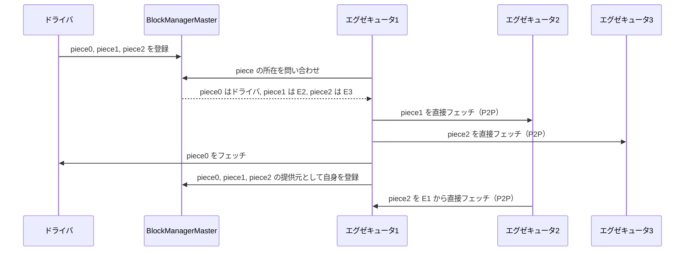
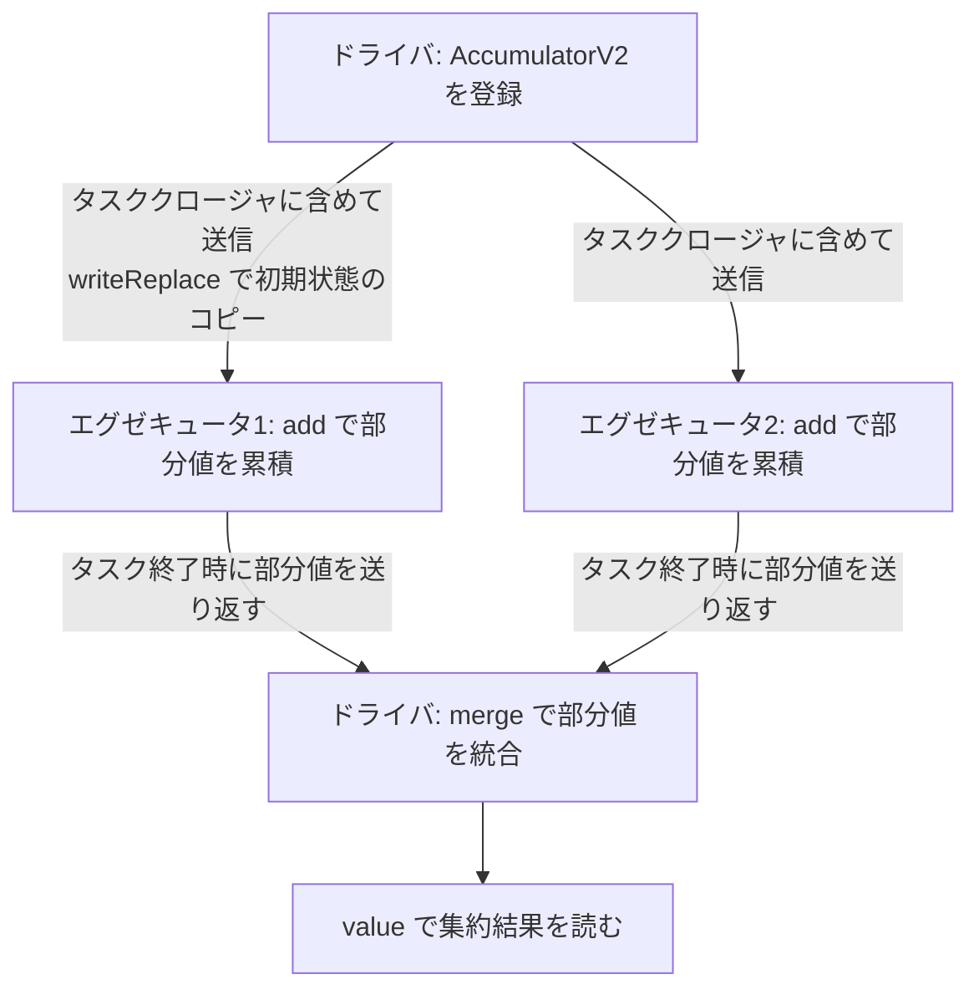

# 第5章 共有変数: Broadcast と Accumulator

> 本章で読むソース
>
> - [`core/src/main/scala/org/apache/spark/broadcast/Broadcast.scala` L57-L151](https://github.com/apache/spark/blob/v4.1.2/core/src/main/scala/org/apache/spark/broadcast/Broadcast.scala#L57-L151)
> - [`core/src/main/scala/org/apache/spark/broadcast/BroadcastManager.scala` L32-L84](https://github.com/apache/spark/blob/v4.1.2/core/src/main/scala/org/apache/spark/broadcast/BroadcastManager.scala#L32-L84)
> - [`core/src/main/scala/org/apache/spark/broadcast/TorrentBroadcast.scala` L60-L186](https://github.com/apache/spark/blob/v4.1.2/core/src/main/scala/org/apache/spark/broadcast/TorrentBroadcast.scala#L60-L186)
> - [`core/src/main/scala/org/apache/spark/broadcast/TorrentBroadcast.scala` L188-L313](https://github.com/apache/spark/blob/v4.1.2/core/src/main/scala/org/apache/spark/broadcast/TorrentBroadcast.scala#L188-L313)
> - [`core/src/main/scala/org/apache/spark/util/AccumulatorV2.scala` L44-L227](https://github.com/apache/spark/blob/v4.1.2/core/src/main/scala/org/apache/spark/util/AccumulatorV2.scala#L44-L227)
> - [`core/src/main/scala/org/apache/spark/util/AccumulatorV2.scala` L233-L318](https://github.com/apache/spark/blob/v4.1.2/core/src/main/scala/org/apache/spark/util/AccumulatorV2.scala#L233-L318)

## この章の狙い

Spark のタスクは原則として読み取り専用で動く。タスク間で変数を共有したい場面では、通常のクロージャ変数では各タスクごとにコピーが直列化されて送信される。共有変数（`Broadcast` と `AccumulatorV2`）は、この非効率を解消するための2つの仕組みである。本章ではブロードキャスト変数がビットトレント方式でクラスタに配布される仕組みと、アキュムレータがタスクの結果をドライバへ安全に集約する仕組みをソースコードから読み取る。

## 前提

第3章で RDD の基本プロパティと依存関係を確認した。第4章で RDD の変換とアクションがタスククロージャを生成することをみた。クロージャにキャプチャされた変数はタスクごとに直列化される。この直列化コストを避けるために `Broadcast` があり、タスク側からドライバへの逆方向の集約のために `AccumulatorV2` がある。

## Broadcast 変数の抽象

`Broadcast[T]` は読み取り専用の共有変数を表現する抽象クラスである。

[`core/src/main/scala/org/apache/spark/broadcast/Broadcast.scala` L57-L71](https://github.com/apache/spark/blob/v4.1.2/core/src/main/scala/org/apache/spark/broadcast/Broadcast.scala#L57-L71)

```scala
abstract class Broadcast[T: ClassTag](val id: Long) extends Serializable with Logging {

  @volatile private var _isValid = true

  private var _destroySite = ""

  /** Get the broadcasted value. */
  def value: T = {
    assertValid()
    getValue()
  }
```

コンストラクタで受け取る `id` は `BroadcastManager` が発行する一意な識別子である。`_isValid` フラグは `@volatile` で宣言され、`destroy()` 呼び出し後に他スレッドから即座に参照できるようにしている。`value` メソッドは `assertValid()` で有効性を検査してから `getValue()` を呼ぶ。`getValue()` は protected な抽象メソッドであり、具象クラスが実際の値の取得方法を定義する。

### ライフサイクル管理

`Broadcast` は `unpersist()` と `destroy()` でリソースを解放する。

[`core/src/main/scala/org/apache/spark/broadcast/Broadcast.scala` L77-L112](https://github.com/apache/spark/blob/v4.1.2/core/src/main/scala/org/apache/spark/broadcast/Broadcast.scala#L77-L112)

```scala
  def unpersist(): Unit = {
    unpersist(blocking = false)
  }

  def unpersist(blocking: Boolean): Unit = {
    assertValid()
    doUnpersist(blocking)
  }

  def destroy(): Unit = {
    destroy(blocking = false)
  }

  private[spark] def destroy(blocking: Boolean): Unit = {
    assertValid()
    _isValid = false
    _destroySite = Utils.getCallSite().shortForm
    logInfo(log"Destroying ${MDC(LogKeys.BROADCAST, toString)} " +
      log"(from ${MDC(LogKeys.CALL_SITE_SHORT_FORM, _destroySite)})")
    doDestroy(blocking)
  }
```

`unpersist()` はエグゼキュータ上のキャッシュを削除するが、ブロードキャスト変数自体は再利用可能である。`destroy()` は `_isValid` を `false` に設定し、以降の `value` 呼び出しをすべて拒否する。`_destroySite` に呼び出し元のコールサイト情報を保存するため、破棄後にアクセスしようとした際の例外メッセージから原因を特定できる。

## BroadcastManager の役割

`BroadcastManager` はドライバとエグゼキュータの両方で動作し、ブロードキャストファクトリの初期化と ID 発行を担う。

[`core/src/main/scala/org/apache/spark/broadcast/BroadcastManager.scala` L32-L49](https://github.com/apache/spark/blob/v4.1.2/core/src/main/scala/org/apache/spark/broadcast/BroadcastManager.scala#L32-L49)

```scala
private[spark] class BroadcastManager(
    val isDriver: Boolean, conf: SparkConf) extends Logging {

  private var initialized = false
  private var broadcastFactory: BroadcastFactory = null

  initialize()

  private def initialize(): Unit = {
    synchronized {
      if (!initialized) {
        broadcastFactory = new TorrentBroadcastFactory
        broadcastFactory.initialize(isDriver, conf)
        initialized = true
      }
    }
  }
```

Spark 4.1.2 では `TorrentBroadcastFactory` が唯一のファクトリである。過去には `HttpBroadcastFactory` も存在したが、現在は削除されている。`initialize()` は `synchronized` ブロックで二重初期化を防ぐ。

### ID 発行とキャッシュ

[`core/src/main/scala/org/apache/spark/broadcast/BroadcastManager.scala` L55-L79](https://github.com/apache/spark/blob/v4.1.2/core/src/main/scala/org/apache/spark/broadcast/BroadcastManager.scala#L55-L79)

```scala
  private val nextBroadcastId = new AtomicLong(0)

  private[broadcast] val cachedValues =
    Collections.synchronizedMap(
      new ReferenceMap(ReferenceStrength.HARD, ReferenceStrength.WEAK)
        .asInstanceOf[java.util.Map[Any, Any]]
    )

  def newBroadcast[T: ClassTag](
      value_ : T,
      isLocal: Boolean,
      serializedOnly: Boolean = false): Broadcast[T] = {
    val bid = nextBroadcastId.getAndIncrement()
    value_ match {
      case pb: PythonBroadcast =>
        pb.setBroadcastId(bid)
      case _ => // do nothing
    }
    broadcastFactory.newBroadcast[T](value_, isLocal, bid, serializedOnly)
  }
```

`nextBroadcastId` は `AtomicLong` によりスレッドセーフにインクリメントされる。`cachedValues` は `ReferenceMap` で構築され、キーはハード参照、値はウィーク参照で保持される。ウィーク参照により、ブロードキャスト変数がどこからも参照されなくなったときに GC で回収される。`PythonBroadcast` の場合は特別に ID をアタッチする。これは `PythonBroadcast` の内部データファイルを `BroadcastBlockId` に紐付けるためである。

## TorrentBroadcast: ビットトレント方式の配布

`TorrentBroadcast` はビットトレントプロトコルに着想を得たブロードキャスト実装である。ドライバがデータをブロックに分割し、エグゼキュータ同士がブロックをピア間でやり取りする。この仕組みにより、ドライバが全エグゼキュータに対して個別にデータを送る必要がなくなる。

[`core/src/main/scala/org/apache/spark/broadcast/TorrentBroadcast.scala` L60-L100](https://github.com/apache/spark/blob/v4.1.2/core/src/main/scala/org/apache/spark/broadcast/TorrentBroadcast.scala#L60-L100)

```scala
private[spark] class TorrentBroadcast[T: ClassTag](obj: T, id: Long, serializedOnly: Boolean)
  extends Broadcast[T](id) with Logging with Serializable {

  @transient private var _value: Reference[T] = _

  @transient private var compressionCodec: Option[CompressionCodec] = _
  @transient private var blockSize: Int = _
  @transient private var isLocalMaster: Boolean = _

  private var checksumEnabled: Boolean = false

  private def setConf(conf: SparkConf): Unit = {
    compressionCodec = if (conf.get(config.BROADCAST_COMPRESS)) {
      Some(CompressionCodec.createCodec(conf))
    } else {
      None
    }
    blockSize = conf.get(config.BROADCAST_BLOCKSIZE).toInt * 1024
    checksumEnabled = conf.get(config.BROADCAST_CHECKSUM)
    isLocalMaster = Utils.isLocalMaster(conf)
  }
  setConf(SparkEnv.get.conf)

  private val broadcastId = BroadcastBlockId(id)

  private val numBlocks: Int = writeBlocks(obj)
```

コンストラクタの初期化で `setConf` を呼び、圧縮コーデック、ブロックサイズ、チェックサムの有無を設定する。ブロックサイズのデフォルトは 4MB である。`broadcastId` は `BroadcastBlockId(id)` として `BlockManager` で識別されるキーになる。`numBlocks` は `writeBlocks(obj)` の戻り値であり、コンストラクタ内で即座にブロックの書き出しが行われる。

`_value` は `@transient` な `Reference[T]` である。シリアライズ時に値を含めず、取得時に再構築する。`serializedOnly` が `true` の場合は `WeakReference`、`false` の場合は `SoftReference` を使う。

### ドライバでのブロック書き出し

`writeBlocks` はオブジェクトをブロックに分割して `BlockManager` に登録する。

[`core/src/main/scala/org/apache/spark/broadcast/TorrentBroadcast.scala` L139-L186](https://github.com/apache/spark/blob/v4.1.2/core/src/main/scala/org/apache/spark/broadcast/TorrentBroadcast.scala#L139-L186)

```scala
  private def writeBlocks(value: T): Int = {
    import StorageLevel._
    val blockManager = SparkEnv.get.blockManager
    if (serializedOnly && !isLocalMaster) {
      _value = new WeakReference[T](value)
    } else {
      if (!blockManager.putSingle(broadcastId, value, MEMORY_AND_DISK, tellMaster = false)) {
        throw SparkException.internalError(
          s"Failed to store $broadcastId in BlockManager", category = "BROADCAST")
      }
    }
    try {
      val blocks =
        TorrentBroadcast.blockifyObject(value, blockSize, SparkEnv.get.serializer, compressionCodec)
      if (checksumEnabled) {
        checksums = new Array[Int](blocks.length)
      }
      blocks.zipWithIndex.foreach { case (block, i) =>
        if (checksumEnabled) {
          checksums(i) = calcChecksum(block)
        }
        val pieceId = BroadcastBlockId(id, "piece" + i)
        val bytes = new ChunkedByteBuffer(block.duplicate())
        if (!blockManager.putBytes(pieceId, bytes, MEMORY_AND_DISK_SER, tellMaster = true)) {
          throw SparkException.internalError(s"Failed to store $pieceId of $broadcastId " +
            s"in local BlockManager", category = "BROADCAST")
        }
      }
      blocks.length
    } catch {
      case t: Throwable =>
        logError(log"Store broadcast ${MDC(BROADCAST_ID, broadcastId)} fail, remove all pieces")
        blockManager.removeBroadcast(id, tellMaster = true)
        throw t
    }
  }
```

処理は2段階に分かれる。まず `putSingle` で統合された値そのものを `BlockManager` に保存する。`serializedOnly` が `true` かつローカルモードでない場合は、ドライバ上の `BlockManager` に値を保存せず `WeakReference` に留める。これはブロードキャストされたハッシュ結合テーブルなど、Spark 内部の用途でドライバのメモリ負荷を減らす最適化である（SPARK-39983）。

次に `blockifyObject` でオブジェクトをバイト列にシリアライズし、`blockSize` ごとに分割する。各ピースは `BroadcastBlockId(id, "pieceN")` という ID で `BlockManager` に `MEMORY_AND_DISK_SER` で保存される。`tellMaster = true` により、ブロックの存在がドライバの `BlockManagerMaster` に通知される。これがピア間のブロック探索に使えるようになる。

チェックサムが有効な場合は Adler32 で各ブロックのチェックサムを計算し、`checksums` 配列に格納する。この配列はシリアライズされてエグゼキュータに送られる。

### エグゼキュータでのブロック読み出し

エグゼキュータで `value` が呼ばれると、`readBroadcastBlock()` が実行される。

[`core/src/main/scala/org/apache/spark/broadcast/TorrentBroadcast.scala` L254-L313](https://github.com/apache/spark/blob/v4.1.2/core/src/main/scala/org/apache/spark/broadcast/TorrentBroadcast.scala#L254-L313)

```scala
  private def readBroadcastBlock(): T = Utils.tryOrIOException {
    TorrentBroadcast.torrentBroadcastLock.withLock(broadcastId) {
      val broadcastCache = SparkEnv.get.broadcastManager.cachedValues

      Option(broadcastCache.get(broadcastId)).map(_.asInstanceOf[T]).getOrElse {
        setConf(SparkEnv.get.conf)
        val blockManager = SparkEnv.get.blockManager
        blockManager.getLocalValues(broadcastId) match {
          case Some(blockResult) =>
            if (blockResult.data.hasNext) {
              val x = blockResult.data.next().asInstanceOf[T]
              releaseBlockManagerLock(broadcastId)
              if (x != null) {
                broadcastCache.put(broadcastId, x)
              }
              x
            } else {
              throw SparkException.internalError(
                s"Failed to get locally stored broadcast data: $broadcastId",
                category = "BROADCAST")
            }
          case None =>
            val estimatedTotalSize = Utils.bytesToString(numBlocks.toLong * blockSize)
            logInfo(log"Started reading broadcast variable ${MDC(BROADCAST_ID, id)} " +
              log"with ${MDC(NUM_BROADCAST_BLOCK, numBlocks)} pieces " +
              log"(estimated total size ${MDC(NUM_BYTES, estimatedTotalSize)})")
            val startTimeNs = System.nanoTime()
            val blocks = readBlocks()
            logInfo(log"Reading broadcast variable ${MDC(BROADCAST_ID, id)}" +
              log" took ${MDC(TOTAL_TIME, Utils.getUsedTimeNs(startTimeNs))}")

            try {
              val obj = TorrentBroadcast.unBlockifyObject[T](
                blocks.map(_.toInputStream()), SparkEnv.get.serializer, compressionCodec)

              if (!serializedOnly || isLocalMaster || Utils.isInRunningSparkTask) {
                val storageLevel = StorageLevel.MEMORY_AND_DISK
                if (!blockManager.putSingle(broadcastId, obj, storageLevel, tellMaster = false)) {
                  throw SparkException.internalError(
                    s"Failed to store $broadcastId in BlockManager", category = "BROADCAST")
                }
              }

              if (obj != null) {
                broadcastCache.put(broadcastId, obj)
              }
              obj
            } finally {
              blocks.foreach(_.dispose())
            }
        }
      }
    }
  }
```

`torrentBroadcastLock` は `BroadcastBlockId` をキーとする `KeyLock` であり、同一ブロードキャスト変数に対する並行取得を直列化する。まず `broadcastCache`（ウィーク参照マップ）を確認し、ヒットすれば再構築を省略する。次に `getLocalValues` でローカルの `BlockManager` を調べる。同一エグゼキュータ上の別タスクがすでに取得済みであれば、ローカルから読める。

ローカルにない場合は `readBlocks()` を呼んでリモートからブロックを収集する。取得後に `unBlockifyObject` でブロックを結合してデシリアライズし、`BlockManager` に統合値を保存する。これにより同一エグゼキュータ上の後続タスクはリモートフェッチなしで値を取得できる。

### P2P ブロック取得

`readBlocks()` はビットトレント方式の核心である。

[`core/src/main/scala/org/apache/spark/broadcast/TorrentBroadcast.scala` L189-L231](https://github.com/apache/spark/blob/v4.1.2/core/src/main/scala/org/apache/spark/broadcast/TorrentBroadcast.scala#L189-L231)

```scala
  private def readBlocks(): Array[BlockData] = {
    val blocks = new Array[BlockData](numBlocks)
    val bm = SparkEnv.get.blockManager

    for (pid <- Random.shuffle(Seq.range(0, numBlocks))) {
      val pieceId = BroadcastBlockId(id, "piece" + pid)
      logDebug(s"Reading piece $pieceId of $broadcastId")
      bm.getLocalBytes(pieceId) match {
        case Some(block) =>
          blocks(pid) = block
          releaseBlockManagerLock(pieceId)
        case None =>
          bm.getRemoteBytes(pieceId) match {
            case Some(b) =>
              if (checksumEnabled) {
                val sum = calcChecksum(b.chunks(0))
                if (sum != checksums(pid)) {
                  throw SparkException.internalError(
                    s"corrupt remote block $pieceId of $broadcastId: $sum != ${checksums(pid)}",
                    category = "BROADCAST")
                }
              }
              if (!bm.putBytes(pieceId, b, StorageLevel.MEMORY_AND_DISK_SER, tellMaster = true)) {
                throw SparkException.internalError(
                  s"Failed to store $pieceId of $broadcastId in local BlockManager",
                  category = "BROADCAST")
              }
              blocks(pid) = new ByteBufferBlockData(b, true)
            case None =>
              throw SparkException.internalError(
                s"Failed to get $pieceId of $broadcastId", category = "BROADCAST")
          }
      }
    }
    blocks
  }
```

各ピースの取得順序は `Random.shuffle` でランダム化される。これは多数のエグゼキュータが同時に同じブロードキャストを取得する際に、特定のエグゼキュータにリクエストが集中するホットスポットを避ける工夫である。

各ピースについて、まず `getLocalBytes` でローカル `BlockManager` を確認する。過去の再試行や同一エグゼキュータ上の別タスクがすでに取得したブロックがローカルにある可能性がある。ローカルにない場合は `getRemoteBytes` でドライバまたは他のエグゼキュータから取得する。`getRemoteBytes` は `BlockManagerMaster` にブロックの所在を問い合わせ、最も近いソースからフェッチする。

リモートから取得したブロックはチェックサムで整合性を検証する。検証後に `putBytes` でローカルの `BlockManager` に保存する。`tellMaster = true` により、このエグゼキュータがピースの提供元として `BlockManagerMaster` に登録される。以降の他のエグゼキュータはこのエグゼキュータから直接ピースを取得できる。



このように、一度ピースを取得したエグゼキュータが次のエグゼキュータの提供元になる。ドライバは最初のピースのソースに過ぎず、データ転送量を抑えられる。エグゼキュータ数が N 台のとき、ドライバが送るデータ量はブロック数分に抑えられる。素朴な方式では N 倍のデータを送る必要がある。

### blockifyObject と unBlockifyObject

オブジェクトのブロック分割と再構築は `TorrentBroadcast` コンパニオンオブジェクトの静的メソッドで行う。

[`core/src/main/scala/org/apache/spark/broadcast/TorrentBroadcast.scala` L359-L391](https://github.com/apache/spark/blob/v4.1.2/core/src/main/scala/org/apache/spark/broadcast/TorrentBroadcast.scala#L359-L391)

```scala
  def blockifyObject[T: ClassTag](
      obj: T,
      blockSize: Int,
      serializer: Serializer,
      compressionCodec: Option[CompressionCodec]): Array[ByteBuffer] = {
    val cbbos = new ChunkedByteBufferOutputStream(blockSize, ByteBuffer.allocate)
    val out = compressionCodec.map(c => c.compressedOutputStream(cbbos)).getOrElse(cbbos)
    val ser = serializer.newInstance()
    val serOut = ser.serializeStream(out)
    Utils.tryWithSafeFinally {
      serOut.writeObject[T](obj)
    } {
      serOut.close()
    }
    cbbos.toChunkedByteBuffer.getChunks()
  }

  def unBlockifyObject[T: ClassTag](
      blocks: Array[InputStream],
      serializer: Serializer,
      compressionCodec: Option[CompressionCodec]): T = {
    require(blocks.nonEmpty, "Cannot unblockify an empty array of blocks")
    val is = new SequenceInputStream(blocks.iterator.asJavaEnumeration)
    val in: InputStream = compressionCodec.map(c => c.compressedInputStream(is)).getOrElse(is)
    val ser = serializer.newInstance()
    val serIn = ser.deserializeStream(in)
    val obj = Utils.tryWithSafeFinally {
      serIn.readObject[T]()
    } {
      serIn.close()
    }
    obj
  }
```

`blockifyObject` は `ChunkedByteBufferOutputStream` にシリアライズしながら、`blockSize` ごとに区切った `ByteBuffer` 配列を生成する。圧縮コーデックが指定されていれば、シリアライズ出力を圧縮ストリームに通す。`unBlockifyObject` は `SequenceInputStream` でブロック配列を1つのストリームに連結し、デシリアライズする。圧縮コーデックがあればデシリアライズ前に解凍する。

## AccumulatorV2: タスク結果の集約

`AccumulatorV2[IN, OUT]` はエグゼキュータ上のタスクからドライバへ値を集約する仕組みである。タスクは `add` で部分値を追加し、ドライバは `value` で集約結果を読む。

[`core/src/main/scala/org/apache/spark/util/AccumulatorV2.scala` L44-L68](https://github.com/apache/spark/blob/v4.1.2/core/src/main/scala/org/apache/spark/util/AccumulatorV2.scala#L44-L68)

```scala
abstract class AccumulatorV2[IN, OUT] extends Serializable {
  private[spark] var metadata: AccumulatorMetadata = _
  private[this] var atDriverSide = true

  def excludeFromHeartbeat: Boolean = false

  private[spark] def register(
      sc: SparkContext,
      name: Option[String] = None,
      countFailedValues: Boolean = false): Unit = {
    if (this.metadata != null) {
      throw new IllegalStateException("Cannot register an accumulator twice.")
    }
    this.metadata = AccumulatorMetadata(AccumulatorContext.newId(), name, countFailedValues)
    AccumulatorContext.register(this)
    sc.cleaner.foreach(_.registerAccumulatorForCleanup(this))
  }

  final def isRegistered: Boolean =
    metadata != null && AccumulatorContext.get(metadata.id).isDefined
```

`atDriverSide` はデフォルトで `true` である。シリアライズされてエグゼキュータでデシリアライズされると `false` に切り替わる。このフラグが `writeReplace` の分岐に使われる。`register` は `AccumulatorContext` にグローバル ID を割り当て、`ConcurrentHashMap` にウィーク参照で登録する。

### 抽象メソッド群

[`core/src/main/scala/org/apache/spark/util/AccumulatorV2.scala` L131-L168](https://github.com/apache/spark/blob/v4.1.2/core/src/main/scala/org/apache/spark/util/AccumulatorV2.scala#L131-L168)

```scala
  def isZero: Boolean

  def copyAndReset(): AccumulatorV2[IN, OUT] = {
    val copyAcc = copy()
    copyAcc.reset()
    copyAcc
  }

  def copy(): AccumulatorV2[IN, OUT]

  def reset(): Unit

  def add(v: IN): Unit

  def merge(other: AccumulatorV2[IN, OUT]): Unit

  def value: OUT
```

`isZero` は初期状態かどうかを判定する。`copy` は同一型のコピーを生成する。`copyAndReset` はコピーを作ってから初期状態に戻す。`add` は入力値を累積する。`merge` は別のアキュムレータの部分値をマージする。`value` は現在の集約結果を返す。

### シリアライズの仕組み

アキュムレータのシリアライズには `writeReplace` と `readObject` が使われる。

[`core/src/main/scala/org/apache/spark/util/AccumulatorV2.scala` L175-L216](https://github.com/apache/spark/blob/v4.1.2/core/src/main/scala/org/apache/spark/util/AccumulatorV2.scala#L175-L216)

```scala
  final protected def writeReplace(): Any = {
    if (atDriverSide) {
      if (!isRegistered) {
        throw new UnsupportedOperationException(
          "Accumulator must be registered before send to executor")
      }
      val copyAcc = copyAndReset()
      assert(copyAcc.isZero, "copyAndReset must return a zero value copy")
      val isInternalAcc = name.isDefined && name.get.startsWith(InternalAccumulator.METRICS_PREFIX)
      if (isInternalAcc) {
        copyAcc.metadata = metadata.copy(name = None)
      } else {
        copyAcc.metadata = metadata
      }
      copyAcc
    } else {
      withBufferSerialized()
    }
  }

  private def readObject(in: ObjectInputStream): Unit = Utils.tryOrIOException {
    in.defaultReadObject()
    if (atDriverSide) {
      atDriverSide = false
      val taskContext = TaskContext.get()
      if (taskContext != null) {
        taskContext.registerAccumulator(this)
      }
    } else {
      atDriverSide = true
    }
  }
```

ドライバ側でシリアライズするとき、`writeReplace` は `copyAndReset()` で初期状態のコピーを作る。タスククロージャに含まれてエグゼキュータに送られるアキュムレータは、初期状態から部分値を累積し始める。未登録のアキュムレータは送信を拒否する。内部メトリクスのアキュムレータは名前を除去して送信サイズを削減する。

エグゼキュータ側でデシリアライズするとき、`readObject` は `atDriverSide` を `false` に切り替える。`TaskContext` が存在すれば、自身を自動的に登録する。この自動登録により、タスク終了時に部分値がドライバへ送り返される。

ドライバ側でデシリアライズするとき（タスク結果の受信時）、`atDriverSide` は `true` になる。`DAGScheduler` はこの戻り値の `merge` を呼び、ドライバ側のアキュムレータに部分値を統合する。

### AccumulatorContext: グローバル管理

[`core/src/main/scala/org/apache/spark/util/AccumulatorV2.scala` L233-L295](https://github.com/apache/spark/blob/v4.1.2/core/src/main/scala/org/apache/spark/util/AccumulatorV2.scala#L233-L295)

```scala
private[spark] object AccumulatorContext extends Logging {

  private val originals =
    new ConcurrentHashMap[Long, jl.ref.WeakReference[AccumulatorV2[_, _]]]

  private[this] val nextId = new AtomicLong(0L)

  def newId(): Long = nextId.getAndIncrement

  def register(a: AccumulatorV2[_, _]): Unit = {
    originals.putIfAbsent(a.id, new jl.ref.WeakReference[AccumulatorV2[_, _]](a))
  }

  def remove(id: Long): Unit = {
    originals.remove(id)
  }

  def get(id: Long): Option[AccumulatorV2[_, _]] = {
    val ref = originals.get(id)
    if (ref eq null) {
      None
    } else {
      val acc = ref.get
      if (acc eq null) {
        logWarning(log"Attempted to access garbage collected accumulator " +
          log"${MDC(ACCUMULATOR_ID, id)}")
      }
      Option(acc)
    }
  }
}
```

`originals` は `ConcurrentHashMap` で、キーが ID、値がウィーク参照のアキュムレータ本体である。ウィーク参照により、RDD やユーザーコードから参照されなくなったアキュムレータを GC で回収できる。`get` は参照が GC 済みの場合に警告ログを出す。`newId` は `AtomicLong` でグローバルに一意な ID を発行する。

### 具象クラス: LongAccumulator

[`core/src/main/scala/org/apache/spark/util/AccumulatorV2.scala` L326-L397](https://github.com/apache/spark/blob/v4.1.2/core/src/main/scala/org/apache/spark/util/AccumulatorV2.scala#L326-L397)

```scala
class LongAccumulator extends AccumulatorV2[jl.Long, jl.Long] {
  private var _sum = 0L
  private var _count = 0L

  override def isZero: Boolean = _sum == 0L && _count == 0

  override def copy(): LongAccumulator = {
    val newAcc = new LongAccumulator
    newAcc._count = this._count
    newAcc._sum = this._sum
    newAcc
  }

  override def add(v: jl.Long): Unit = {
    _sum += v
    _count += 1
  }

  def count: Long = _count
  def sum: Long = _sum
  def avg: Double = _sum.toDouble / _count

  override def merge(other: AccumulatorV2[jl.Long, jl.Long]): Unit = other match {
    case o: LongAccumulator =>
      _sum += o.sum
      _count += o.count
    case _ =>
      throw new UnsupportedOperationException(
        s"Cannot merge ${this.getClass.getName} with ${other.getClass.getName}")
  }

  override def value: jl.Long = _sum
}
```

`LongAccumulator` は整数の合計、件数、平均を集約する。`add` は `_sum` と `_count` を更新する。`merge` は別の `LongAccumulator` の `_sum` と `_count` を加算する。`value` は `_sum` を返す。`DoubleAccumulator` は同じ構造で浮動小数点を扱う。

### 具象クラス: CollectionAccumulator

[`core/src/main/scala/org/apache/spark/util/AccumulatorV2.scala` L483-L526](https://github.com/apache/spark/blob/v4.1.2/core/src/main/scala/org/apache/spark/util/AccumulatorV2.scala#L483-L526)

```scala
class CollectionAccumulator[T] extends AccumulatorV2[T, java.util.List[T]] {
  private var _list: java.util.List[T] = _

  private def getOrCreate = {
    _list = Option(_list).getOrElse(new java.util.ArrayList[T]())
    _list
  }

  override def isZero: Boolean = this.synchronized(getOrCreate.isEmpty)

  override def copy(): CollectionAccumulator[T] = {
    val newAcc = new CollectionAccumulator[T]
    this.synchronized {
      newAcc.getOrCreate.addAll(getOrCreate)
    }
    newAcc
  }

  override def add(v: T): Unit = this.synchronized(getOrCreate.add(v))

  override def merge(other: AccumulatorV2[T, java.util.List[T]]): Unit = other match {
    case o: CollectionAccumulator[T] => this.synchronized(getOrCreate.addAll(o.value))
    case _ => throw new UnsupportedOperationException(
      s"Cannot merge ${this.getClass.getName} with ${other.getClass.getName}")
  }

  override def value: java.util.List[T] = this.synchronized {
    java.util.List.copyOf(getOrCreate)
  }
}
```

`CollectionAccumulator` は要素のリストを集約する。`add`、`copy`、`merge`、`value` はすべて `synchronized` で保護される。`value` は `List.copyOf` で防御的コピーを返す。

## アキュムレータのデータフロー

アキュムレータの値の流れをまとめる。



タスクごとに独立したコピーが送られるため、エグゼキュータ側では同期不要で `add` できる。タスク終了時に部分値がドライバに返り、`DAGScheduler` が `merge` で統合する。失敗したタスクの値は `countFailedValues` フラグが `true` の場合のみ集約される。

## まとめ

`Broadcast` は読み取り専用の共有変数をビットトレント方式でクラスタに配布する。`TorrentBroadcast` はオブジェクトをブロックに分割し、エグゼキュータ同士がピア間でブロックをやり取りする。ドライバは最初のソースに過ぎず、データ転送量はエグゼキュータ数に比例しない。`AccumulatorV2` はタスクからドライバへの逆方向の集約を提供する。各タスクは独立したコピーに部分値を追加し、タスク終了時にドライバが `merge` で統合する。2つの共有変数は、タスククロージャの直列化コストと、双方向のデータ転送の課題をそれぞれ解決している。

## 関連する章

- [第3章 RDD の設計と実装](03-rdd-design-and-implementation.md)
- [第4章 RDD の変換とアクション](04-rdd-transformations-and-actions.md)
- [第9章 Executor: タスク実行エンジン](../part03-execution/09-executor.md)
- [第12章 BlockManager: ブロックの保存と取得](../part04-storage/12-blockmanager.md)
