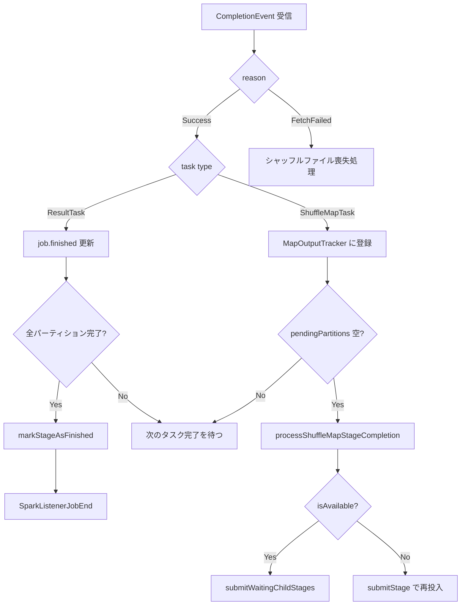

# 第6章 DAGScheduler: ステージ構築とジョブスケジューリング

> 本章で読むソース
>
> - [`core/src/main/scala/org/apache/spark/scheduler/DAGScheduler.scala` L58-L123](https://github.com/apache/spark/blob/v4.1.2/core/src/main/scala/org/apache/spark/scheduler/DAGScheduler.scala#L58-L123)
> - [`core/src/main/scala/org/apache/spark/scheduler/DAGScheduler.scala` L471-L546](https://github.com/apache/spark/blob/v4.1.2/core/src/main/scala/org/apache/spark/scheduler/DAGScheduler.scala#L471-L546)
> - [`core/src/main/scala/org/apache/spark/scheduler/DAGScheduler.scala` L647-L665](https://github.com/apache/spark/blob/v4.1.2/core/src/main/scala/org/apache/spark/scheduler/DAGScheduler.scala#L647-L665)
> - [`core/src/main/scala/org/apache/spark/scheduler/DAGScheduler.scala` L765-L811](https://github.com/apache/spark/blob/v4.1.2/core/src/main/scala/org/apache/spark/scheduler/DAGScheduler.scala#L765-L811)
> - [`core/src/main/scala/org/apache/spark/scheduler/DAGScheduler.scala` L938-L981](https://github.com/apache/spark/blob/v4.1.2/core/src/main/scala/org/apache/spark/scheduler/DAGScheduler.scala#L938-L981)
> - [`core/src/main/scala/org/apache/spark/scheduler/DAGScheduler.scala` L1328-L1409](https://github.com/apache/spark/blob/v4.1.2/core/src/main/scala/org/apache/spark/scheduler/DAGScheduler.scala#L1328-L1409)
> - [`core/src/main/scala/org/apache/spark/scheduler/DAGScheduler.scala` L1460-L1490](https://github.com/apache/spark/blob/v4.1.2/core/src/main/scala/org/apache/spark/scheduler/DAGScheduler.scala#L1460-L1490)
> - [`core/src/main/scala/org/apache/spark/scheduler/DAGScheduler.scala` L1555-L1771](https://github.com/apache/spark/blob/v4.1.2/core/src/main/scala/org/apache/spark/scheduler/DAGScheduler.scala#L1555-L1771)
> - [`core/src/main/scala/org/apache/spark/scheduler/DAGScheduler.scala` L2028-L2211](https://github.com/apache/spark/blob/v4.1.2/core/src/main/scala/org/apache/spark/scheduler/DAGScheduler.scala#L2028-L2211)
> - [`core/src/main/scala/org/apache/spark/scheduler/DAGScheduler.scala` L3060-L3089](https://github.com/apache/spark/blob/v4.1.2/core/src/main/scala/org/apache/spark/scheduler/DAGScheduler.scala#L3060-L3089)
> - [`core/src/main/scala/org/apache/spark/scheduler/DAGScheduler.scala` L3102-L3130](https://github.com/apache/spark/blob/v4.1.2/core/src/main/scala/org/apache/spark/scheduler/DAGScheduler.scala#L3102-L3130)
> - [`core/src/main/scala/org/apache/spark/scheduler/DAGScheduler.scala` L3238-L3286](https://github.com/apache/spark/blob/v4.1.2/core/src/main/scala/org/apache/spark/scheduler/DAGScheduler.scala#L3238-L3286)
> - [`core/src/main/scala/org/apache/spark/scheduler/DAGScheduler.scala` L3317-L3406](https://github.com/apache/spark/blob/v4.1.2/core/src/main/scala/org/apache/spark/scheduler/DAGScheduler.scala#L3317-L3406)
> - [`core/src/main/scala/org/apache/spark/scheduler/Stage.scala` L27-L172](https://github.com/apache/spark/blob/v4.1.2/core/src/main/scala/org/apache/spark/scheduler/Stage.scala#L27-L172)
> - [`core/src/main/scala/org/apache/spark/scheduler/ShuffleMapStage.scala` L26-L97](https://github.com/apache/spark/blob/v4.1.2/core/src/main/scala/org/apache/spark/scheduler/ShuffleMapStage.scala#L26-L97)
> - [`core/src/main/scala/org/apache/spark/scheduler/ResultStage.scala` L24-L68](https://github.com/apache/spark/blob/v4.1.2/core/src/main/scala/org/apache/spark/scheduler/ResultStage.scala#L24-L68)
> - [`core/src/main/scala/org/apache/spark/scheduler/DAGSchedulerEvent.scala` L28-L134](https://github.com/apache/spark/blob/v4.1.2/core/src/main/scala/org/apache/spark/scheduler/DAGSchedulerEvent.scala#L28-L134)

## この章の狙い

`DAGScheduler` は Spark のスケジューリング層のうち上位に位置し、ジョブをステージに分割し、ステージをタスクセットに展開して `TaskScheduler` に渡す役割を担う。
本章では、RDD グラフをシャッフル境界で切断してステージ DAG を構築する仕組み、生成したステージをトポロジカル順序で投入するイベントループ、タスク完了に伴うステージの終了処理を追う。
ステージ分割が再実行コストをどう最小化するかを機構レベルで説明する。

## 前提

`SparkContext` がアクションを受け取ると `DAGScheduler.submitJob` が呼ばれる（第5章）。
`DAGScheduler` はジョブをステージに分解し、各ステージを `TaskSet` として `TaskScheduler` に投げる。
ステージの型は `ShuffleMapStage`（中間出力の生成）と `ResultStage`（アクション結果の算出）の2種類がある。

## 6.1 ジョブの投入とイベントループ

ユーザーが `count()` や `collect()` などのアクションを呼ぶと、`SparkContext` は `DAGScheduler.submitJob` を呼び出す。

[`core/src/main/scala/org/apache/spark/scheduler/DAGScheduler.scala` L938-L981](https://github.com/apache/spark/blob/v4.1.2/core/src/main/scala/org/apache/spark/scheduler/DAGScheduler.scala#L938-L981)

```scala
def submitJob[T, U](
    rdd: RDD[T],
    func: (TaskContext, Iterator[T]) => U,
    partitions: Seq[Int],
    callSite: CallSite,
    resultHandler: (Int, U) => Unit,
    properties: Properties): JobWaiter[U] = {
  val maxPartitions = rdd.partitions.length
  partitions.find(p => p >= maxPartitions || p < 0).foreach { p =>
    throw new IllegalArgumentException(
      "Attempting to access a non-existent partition: " + p + ". " +
        "Total number of partitions: " + maxPartitions)
  }
  // ...
  val jobId = nextJobId.getAndIncrement()
  // ...
  val waiter = new JobWaiter[U](this, jobId, partitions.size, resultHandler)
  eventProcessLoop.post(JobSubmitted(
    jobId, rdd, func2, partitions.toArray, callSite, waiter,
    JobArtifactSet.getActiveOrDefault(sc),
    Utils.cloneProperties(properties)))
  waiter
}
```

`submitJob` はパーティション番号の正当性を検証したあと、`JobSubmitted` イベントを `eventProcessLoop` に投げる。
`eventProcessLoop` は `DAGSchedulerEventProcessLoop` であり、`EventLoop` を継承するシングルスレッドのイベントループである。

[`core/src/main/scala/org/apache/spark/scheduler/DAGScheduler.scala` L3317-L3406](https://github.com/apache/spark/blob/v4.1.2/core/src/main/scala/org/apache/spark/scheduler/DAGScheduler.scala#L3317-L3406)

```scala
private[scheduler] class DAGSchedulerEventProcessLoop(dagScheduler: DAGScheduler)
  extends EventLoop[DAGSchedulerEvent]("dag-scheduler-event-loop") with Logging {

  override def onReceive(event: DAGSchedulerEvent): Unit = {
    val timerContext = timer.time()
    try {
      doOnReceive(event)
    } catch {
      case ex: ShuffleStatusNotFoundException =>
        dagScheduler.handleShuffleStatusNotFoundException(ex)
    } finally {
      timerContext.stop()
    }
  }

  private def doOnReceive(event: DAGSchedulerEvent): Unit = event match {
    case JobSubmitted(jobId, rdd, func, partitions, callSite, listener, artifacts, properties) =>
      dagScheduler.handleJobSubmitted(jobId, rdd, func, partitions, callSite, listener, artifacts,
        properties)
    // ...
    case completion: CompletionEvent =>
      dagScheduler.handleTaskCompletion(completion)
    // ...
  }
}
```

すべてのイベントは単一スレッドで逐次処理される。
これにより、ステージの状態遷移（`waitingStages`、`runningStages`、`failedStages`）に対する排他制御が不要になる。
`DAGSchedulerEvent` は `sealed trait` で閉じられており、ジョブ投入、ジョブキャンセル、タスク完了、エグゼキュータ喪失など約20種類のイベントが存在する。

[`core/src/main/scala/org/apache/spark/scheduler/DAGSchedulerEvent.scala` L34-L134](https://github.com/apache/spark/blob/v4.1.2/core/src/main/scala/org/apache/spark/scheduler/DAGSchedulerEvent.scala#L34-L134)

```scala
private[scheduler] sealed trait DAGSchedulerEvent

private[scheduler] case class JobSubmitted(
    jobId: Int,
    finalRDD: RDD[_],
    func: (TaskContext, Iterator[_]) => _,
    partitions: Array[Int],
    callSite: CallSite,
    listener: JobListener,
    artifactSet: JobArtifactSet,
    properties: Properties = null)
  extends DAGSchedulerEvent

private[scheduler] case class CompletionEvent(
    task: Task[_],
    reason: TaskEndReason,
    result: Any,
    accumUpdates: Seq[AccumulatorV2[_, _]],
    metricPeaks: Array[Long],
    taskInfo: TaskInfo)
  extends DAGSchedulerEvent
```

## 6.2 ステージの型と継承構造

ステージは `Stage` 抽象クラスを基底とし、`ShuffleMapStage` と `ResultStage` の2つの具象クラスがある。

[`core/src/main/scala/org/apache/spark/scheduler/Stage.scala` L56-L64](https://github.com/apache/spark/blob/v4.1.2/core/src/main/scala/org/apache/spark/scheduler/Stage.scala#L56-L64)

```scala
private[scheduler] abstract class Stage(
    val id: Int,
    val rdd: RDD[_],
    val numTasks: Int,
    val parents: List[Stage],
    val firstJobId: Int,
    val callSite: CallSite,
    val resourceProfileId: Int)
  extends Logging {
```

`Stage` は `id`（ステージID）、`rdd`（このステージが計算するRDD）、`numTasks`（タスク数）、`parents`（親ステージのリスト）を持つ。
`parents` はシャッフル依存を介したステージ間の依存関係を表す。

`ShuffleMapStage` はシャッフルマップタスクを実行し、マップ出力ファイルをディスクに書き出す。

[`core/src/main/scala/org/apache/spark/scheduler/ShuffleMapStage.scala` L37-L47](https://github.com/apache/spark/blob/v4.1.2/core/src/main/scala/org/apache/spark/scheduler/ShuffleMapStage.scala#L37-L47)

```scala
private[spark] class ShuffleMapStage(
    id: Int,
    rdd: RDD[_],
    numTasks: Int,
    parents: List[Stage],
    firstJobId: Int,
    callSite: CallSite,
    val shuffleDep: ShuffleDependency[_, _, _],
    mapOutputTrackerMaster: MapOutputTrackerMaster,
    resourceProfileId: Int)
  extends Stage(id, rdd, numTasks, parents, firstJobId, callSite, resourceProfileId) {
```

`isAvailable` メソッドは、すべてのパーティションについてシャッフル出力が揃っているかを判定する。

[`core/src/main/scala/org/apache/spark/scheduler/ShuffleMapStage.scala` L83-L89](https://github.com/apache/spark/blob/v4.1.2/core/src/main/scala/org/apache/spark/scheduler/ShuffleMapStage.scala#L83-L89)

```scala
def numAvailableOutputs: Int = mapOutputTrackerMaster.getNumAvailableOutputs(shuffleDep.shuffleId)

def isAvailable: Boolean = numAvailableOutputs == numPartitions
```

`ResultStage` はアクションの最終結果を算出する。

[`core/src/main/scala/org/apache/spark/scheduler/ResultStage.scala` L30-L39](https://github.com/apache/spark/blob/v4.1.2/core/src/main/scala/org/apache/spark/scheduler/ResultStage.scala#L30-L39)

```scala
private[spark] class ResultStage(
    id: Int,
    rdd: RDD[_],
    val func: (TaskContext, Iterator[_]) => _,
    val partitions: Array[Int],
    parents: List[Stage],
    firstJobId: Int,
    callSite: CallSite,
    resourceProfileId: Int)
  extends Stage(id, rdd, partitions.length, parents, firstJobId, callSite, resourceProfileId) {
```

`func` は各パーティションに適用される関数、`partitions` は計算対象のパーティション番号配列である。
`first()` や `lookup()` のように、全パーティションを計算しないアクションでは `partitions` は部分集合になる。

## 6.3 ステージの生成

`handleJobSubmitted` は `JobSubmitted` イベントを受信したときの処理である。

[`core/src/main/scala/org/apache/spark/scheduler/DAGScheduler.scala` L1328-L1409](https://github.com/apache/spark/blob/v4.1.2/core/src/main/scala/org/apache/spark/scheduler/DAGScheduler.scala#L1328-L1409)

```scala
private[scheduler] def handleJobSubmitted(
    jobId: Int,
    finalRDD: RDD[_],
    func: (TaskContext, Iterator[_]) => _,
    partitions: Array[Int],
    callSite: CallSite,
    listener: JobListener,
    artifacts: JobArtifactSet,
    properties: Properties): Unit = {
  // ...
  var finalStage: ResultStage = null
  try {
    finalStage = createResultStage(finalRDD, func, partitions, jobId, callSite)
  } catch {
    // ...
  }
  val job = new ActiveJob(jobId, finalStage, callSite, listener, artifacts, properties)
  // ...
  submitStage(finalStage)
}
```

`createResultStage` が最終ステージ（`ResultStage`）を生成する。

[`core/src/main/scala/org/apache/spark/scheduler/DAGScheduler.scala` L647-L665](https://github.com/apache/spark/blob/v4.1.2/core/src/main/scala/org/apache/spark/scheduler/DAGScheduler.scala#L647-L665)

```scala
private def createResultStage(
    rdd: RDD[_],
    func: (TaskContext, Iterator[_]) => _,
    partitions: Array[Int],
    jobId: Int,
    callSite: CallSite): ResultStage = {
  val (shuffleDeps, resourceProfiles) = getShuffleDependenciesAndResourceProfiles(rdd)
  val resourceProfile = mergeResourceProfilesForStage(resourceProfiles)
  // ...
  val parents = getOrCreateParentStages(shuffleDeps, jobId)
  val id = nextStageId.getAndIncrement()
  val stage = new ResultStage(id, rdd, func, partitions, parents, jobId,
    callSite, resourceProfile.id)
  stageIdToStage(id) = stage
  updateJobIdStageIdMaps(jobId, stage)
  stage
}
```

`getShuffleDependenciesAndResourceProfiles` は RDD グラフを遡り、このステージの直接の親となる `ShuffleDependency` の集合を集める。
ナロー依存は同じステージ内にパイプライン化され、ワイド依存（`ShuffleDependency`）がステージ境界になる。

[`core/src/main/scala/org/apache/spark/scheduler/DAGScheduler.scala` L716-L737](https://github.com/apache/spark/blob/v4.1.2/core/src/main/scala/org/apache/spark/scheduler/DAGScheduler.scala#L716-L737)

```scala
private[scheduler] def getShuffleDependenciesAndResourceProfiles(
    rdd: RDD[_]): (HashSet[ShuffleDependency[_, _, _]], HashSet[ResourceProfile]) = {
  val parents = new HashSet[ShuffleDependency[_, _, _]]
  val resourceProfiles = new HashSet[ResourceProfile]
  val visited = new HashSet[RDD[_]]
  val waitingForVisit = new ListBuffer[RDD[_]]
  waitingForVisit += rdd
  while (waitingForVisit.nonEmpty) {
    val toVisit = waitingForVisit.remove(0)
    if (!visited(toVisit)) {
      visited += toVisit
      Option(toVisit.getResourceProfile()).foreach(resourceProfiles += _)
      toVisit.dependencies.foreach {
        case shuffleDep: ShuffleDependency[_, _, _] =>
          parents += shuffleDep
        case dependency =>
          waitingForVisit.prepend(dependency.rdd)
      }
    }
  }
  (parents, resourceProfiles)
}
```

ナロー依存の親RDDは `waitingForVisit` に追加して探索を続けるが、`ShuffleDependency` に到達すると探索を止め、それを親ステージの印として集める。
これにより、シャッフル境界で区切られたRDDの連鎖が1つのステージにまとまる。

`getOrCreateParentStages` は各 `ShuffleDependency` に対して `ShuffleMapStage` を生成する。

[`core/src/main/scala/org/apache/spark/scheduler/DAGScheduler.scala` L671-L676](https://github.com/apache/spark/blob/v4.1.2/core/src/main/scala/org/apache/spark/scheduler/DAGScheduler.scala#L671-L676)

```scala
private def getOrCreateParentStages(shuffleDeps: HashSet[ShuffleDependency[_, _, _]],
    firstJobId: Int): List[Stage] = {
  shuffleDeps.map { shuffleDep =>
    getOrCreateShuffleMapStage(shuffleDep, firstJobId)
  }.toList
}
```

`getOrCreateShuffleMapStage` は `shuffleIdToMapStage` を参照し、すでに存在すれば再利用し、なければ `createShuffleMapStage` で新規生成する。

[`core/src/main/scala/org/apache/spark/scheduler/DAGScheduler.scala` L471-L493](https://github.com/apache/spark/blob/v4.1.2/core/src/main/scala/org/apache/spark/scheduler/DAGScheduler.scala#L471-L493)

```scala
private def getOrCreateShuffleMapStage(
    shuffleDep: ShuffleDependency[_, _, _],
    firstJobId: Int): ShuffleMapStage = {
  shuffleIdToMapStage.get(shuffleDep.shuffleId) match {
    case Some(stage) =>
      stage
    case None =>
      getMissingAncestorShuffleDependencies(shuffleDep.rdd).foreach { dep =>
        if (!shuffleIdToMapStage.contains(dep.shuffleId)) {
          createShuffleMapStage(dep, firstJobId)
        }
      }
      createShuffleMapStage(shuffleDep, firstJobId)
  }
}
```

祖先のシャッフル依存で未登録のものがあれば、先にそちらのステージを生成する。
これにより、深い RDD グラフでも末端から順にステージが構築される。

## 6.4 ステージの投入と再帰的スケジューリング

`handleJobSubmitted` の最後で `submitStage(finalStage)` が呼ばれる。

[`core/src/main/scala/org/apache/spark/scheduler/DAGScheduler.scala` L1460-L1490](https://github.com/apache/spark/blob/v4.1.2/core/src/main/scala/org/apache/spark/scheduler/DAGScheduler.scala#L1460-L1490)

```scala
private def submitStage(stage: Stage): Unit = {
  val jobId = activeJobForStage(stage)
  if (jobId.isDefined) {
    if (!waitingStages(stage) && !runningStages(stage) && !failedStages(stage)) {
      if (stage.getNextAttemptId >= maxStageAttempts) {
        abortStage(stage, reason, None)
      } else {
        val missing = getMissingParentStages(stage).sortBy(_.id)
        if (missing.isEmpty) {
          submitMissingTasks(stage, jobId.get)
        } else {
          for (parent <- missing) {
            submitStage(parent)
          }
          waitingStages += stage
        }
      }
    }
  }
}
```

`submitStage` は再帰的に親ステージを投入する。
`getMissingParentStages` で未完了の親ステージを取得し、あればそれらを先に `submitStage` して自身を `waitingStages` に置く。
親がすべて完了していれば `submitMissingTasks` でタスクを生成して投入する。

`getMissingParentStages` はステージ内の RDD グラフを探索し、キャッシュされていないパーティションを持つ RDD のシャッフル依存をたどって未完了の親ステージを集める。

[`core/src/main/scala/org/apache/spark/scheduler/DAGScheduler.scala` L765-L811](https://github.com/apache/spark/blob/v4.1.2/core/src/main/scala/org/apache/spark/scheduler/DAGScheduler.scala#L765-L811)

```scala
private def getMissingParentStages(stage: Stage): List[Stage] = {
  val missing = new HashSet[Stage]
  val visited = new HashSet[RDD[_]]
  val waitingForVisit = new ListBuffer[RDD[_]]
  waitingForVisit += stage.rdd
  def visit(rdd: RDD[_]): Unit = {
    if (!visited(rdd)) {
      visited += rdd
      val rddHasUncachedPartitions = try {
        getCacheLocs(rdd).contains(Nil)
      } catch {
        // ...
      }
      if (rddHasUncachedPartitions) {
        for (dep <- rdd.dependencies) {
          dep match {
            case shufDep: ShuffleDependency[_, _, _] =>
              val mapStage = getOrCreateShuffleMapStage(shufDep, stage.firstJobId)
              if (!mapStage.isAvailable || !mapStage.shuffleDep.shuffleMergeFinalized) {
                missing += mapStage
              } else {
                mapStage.increaseAttemptIdOnFirstSkip()
              }
            case narrowDep: NarrowDependency[_] =>
              waitingForVisit.prepend(narrowDep.rdd)
          }
        }
      }
    }
  }
  while (waitingForVisit.nonEmpty) {
    visit(waitingForVisit.remove(0))
  }
  missing.toList
}
```

各 RDD について `getCacheLocs` でキャッシュの所在を確認する。
全パーティションがキャッシュ済みであればその RDD は再計算不要なので探索を打ち切る。
未キャッシュのパーティションがあれば、`ShuffleDependency` を介する親ステージを `missing` に追加し、`NarrowDependency` を介する親RDDはさらに探索を続ける。
スタックオーバーフローを防ぐため、再帰ではなく手動のスタック（`waitingForVisit`）で反復している。

## 6.5 タスクの生成と投入

`submitMissingTasks` はステージの親がすべて完了した状態で呼ばれ、タスクを生成して `TaskScheduler` に投げる。

[`core/src/main/scala/org/apache/spark/scheduler/DAGScheduler.scala` L1555-L1771](https://github.com/apache/spark/blob/v4.1.2/core/src/main/scala/org/apache/spark/scheduler/DAGScheduler.scala#L1555-L1771)

```scala
private def submitMissingTasks(stage: Stage, jobId: Int): Unit = {
  // ...
  val partitionsToCompute: Seq[Int] = stage.findMissingPartitions()
  // ...
  runningStages += stage
  // ...
  val taskIdToLocations: Map[Int, Seq[TaskLocation]] = try {
    stage match {
      case s: ShuffleMapStage =>
        partitionsToCompute.map { id => (id, getPreferredLocs(stage.rdd, id))}.toMap
      case s: ResultStage =>
        partitionsToCompute.map { id =>
          val p = s.partitions(id)
          (id, getPreferredLocs(stage.rdd, p))
        }.toMap
    }
  } catch {
    // ...
  }
  stage.makeNewStageAttempt(partitionsToCompute.size, taskIdToLocations.values.toSeq)
  // ...
  val tasks: Seq[Task[_]] = try {
    val serializedTaskMetrics = closureSerializer.serialize(stage.latestInfo.taskMetrics).array()
    stage match {
      case stage: ShuffleMapStage =>
        stage.pendingPartitions.clear()
        partitionsToCompute.map { id =>
          val locs = taskIdToLocations(id)
          val part = partitions(id)
          stage.pendingPartitions += id
          new ShuffleMapTask(stage.id, stage.latestInfo.attemptNumber(), taskBinary,
            part, stage.numPartitions, locs, artifacts, properties, serializedTaskMetrics,
            Option(jobId), Option(sc.applicationId), sc.applicationAttemptId,
            stage.rdd.isBarrier())
        }
      case stage: ResultStage =>
        partitionsToCompute.map { id =>
          val p: Int = stage.partitions(id)
          val part = partitions(p)
          val locs = taskIdToLocations(id)
          new ResultTask(stage.id, stage.latestInfo.attemptNumber(),
            taskBinary, part, stage.numPartitions, locs, id, artifacts, properties,
            serializedTaskMetrics, Option(jobId), Option(sc.applicationId),
            sc.applicationAttemptId, stage.rdd.isBarrier())
        }
    }
  } catch {
    // ...
  }
  if (tasks.nonEmpty) {
    taskScheduler.submitTasks(new TaskSet(
      tasks.toArray, stage.id, stage.latestInfo.attemptNumber(), jobId, properties,
      stage.resourceProfileId, shuffleId))
  }
}
```

処理の流れは以下の通りである。

1. `findMissingPartitions` で未計算のパーティションを特定する
2. `getPreferredLocs` で各タスクの推奨ロケーションを計算する
3. `makeNewStageAttempt` でステージの新しい試行を開始する
4. `ShuffleMapTask` または `ResultTask` をパーティションごとに生成する
5. `TaskSet` にまとめて `taskScheduler.submitTasks` で投入する

タスクのバイナリ（RDD とシャッフル依存、または RDD と関数）はシリアライズされて `Broadcast` 変数としてエグゼキュータに配布される。
各タスクは独立したRDDのコピーを受け取るため、Hadoop の `JobConf` のようなスレッドセーフでないオブジェクトも含めて安全に並列実行できる。

## 6.6 タスク完了の処理

`handleTaskCompletion` はタスクの完了イベントを処理する。

[`core/src/main/scala/org/apache/spark/scheduler/DAGScheduler.scala` L2028-L2211](https://github.com/apache/spark/blob/v4.1.2/core/src/main/scala/org/apache/spark/scheduler/DAGScheduler.scala#L2028-L2211)

```scala
private[scheduler] def handleTaskCompletion(event: CompletionEvent): Unit = {
  val task = event.task
  val stageId = task.stageId
  // ...
  event.reason match {
    case Success =>
      task match {
        case rt: ResultTask[_, _] =>
          val resultStage = stage.asInstanceOf[ResultStage]
          resultStage.activeJob match {
            case Some(job) =>
              if (!job.finished(rt.outputId)) {
                job.finished(rt.outputId) = true
                job.numFinished += 1
                if (job.numFinished == job.numPartitions) {
                  markStageAsFinished(resultStage)
                  cancelRunningIndependentStages(job, s"Job ${job.jobId} is finished.")
                  cleanupStateForJobAndIndependentStages(job)
                  // ...
                  listenerBus.post(
                    SparkListenerJobEnd(job.jobId, clock.getTimeMillis(), JobSucceeded))
                }
                // ...
              }
            case None =>
          }

        case smt: ShuffleMapTask =>
          val shuffleStage = stage.asInstanceOf[ShuffleMapStage]
          shuffleStage.pendingPartitions -= task.partitionId
          val status = event.result.asInstanceOf[MapStatus]
          mapOutputTracker.registerMapOutput(
            shuffleStage.shuffleDep.shuffleId, smt.partitionId, status)
          // ...
          if (runningStages.contains(shuffleStage) && shuffleStage.pendingPartitions.isEmpty) {
            processShuffleMapStageCompletion(shuffleStage)
          }
      }

    case FetchFailed(bmAddress, shuffleId, _, mapIndex, reduceId, failureMessage) =>
      // ...
  }
}
```

`ResultTask` が成功すると、`job.finished` 配列を更新し、全パーティションが完了すれば `markStageAsFinished` でステージを終了させる。
`ShuffleMapTask` が成功すると、`MapOutputTracker` にマップ出力を登録し、`pendingPartitions` が空になれば `processShuffleMapStageCompletion` を呼ぶ。



`processShuffleMapStageCompletion` はステージを完了させ、待機中の子ステージを投入する。

[`core/src/main/scala/org/apache/spark/scheduler/DAGScheduler.scala` L2759-L2789](https://github.com/apache/spark/blob/v4.1.2/core/src/main/scala/org/apache/spark/scheduler/DAGScheduler.scala#L2759-L2789)

```scala
private def processShuffleMapStageCompletion(shuffleStage: ShuffleMapStage): Unit = {
  markStageAsFinished(shuffleStage)
  // ...
  mapOutputTracker.incrementEpoch()
  clearCacheLocs()

  if (!shuffleStage.isAvailable) {
    submitStage(shuffleStage)
  } else {
    markMapStageJobsAsFinished(shuffleStage)
    submitWaitingChildStages(shuffleStage)
  }
}
```

`submitWaitingChildStages` は `waitingStages` から親が完了した子ステージを見つけ、`submitStage` で投入する。

[`core/src/main/scala/org/apache/spark/scheduler/DAGScheduler.scala` L1203-L1213](https://github.com/apache/spark/blob/v4.1.2/core/src/main/scala/org/apache/spark/scheduler/DAGScheduler.scala#L1203-L1213)

```scala
private def submitWaitingChildStages(parent: Stage): Unit = {
  val childStages = waitingStages.filter(_.parents.contains(parent)).toArray
  waitingStages --= childStages
  for (stage <- childStages.sortBy(_.firstJobId)) {
    submitStage(stage)
  }
}
```

`firstJobId` でソートすることで、FIFO スケジューリング時に古いジョブのステージが優先的に実行される。

## 6.7 推奨ロケーションの計算

`getPreferredLocs` はタスクをどのノードで実行するのが最適かを再帰的に計算する。

[`core/src/main/scala/org/apache/spark/scheduler/DAGScheduler.scala` L3238-L3286](https://github.com/apache/spark/blob/v4.1.2/core/src/main/scala/org/apache/spark/scheduler/DAGScheduler.scala#L3238-L3286)

```scala
def getPreferredLocs(rdd: RDD[_], partition: Int): Seq[TaskLocation] = {
  getPreferredLocsInternal(rdd, partition, new HashSet)
}

private def getPreferredLocsInternal(
    rdd: RDD[_],
    partition: Int,
    visited: HashSet[(RDD[_], Int)]): Seq[TaskLocation] = {
  if (!visited.add((rdd, partition))) {
    return Nil
  }
  val cached = getCacheLocs(rdd)(partition)
  if (cached.nonEmpty) {
    return cached
  }
  val rddPrefs = rdd.preferredLocations(rdd.partitions(partition)).toList
  if (rddPrefs.nonEmpty) {
    return rddPrefs.filter(_ != null).map(TaskLocation(_))
  }
  rdd.dependencies.foreach {
    case n: NarrowDependency[_] =>
      for (inPart <- n.getParents(partition)) {
        val locs = getPreferredLocsInternal(n.rdd, inPart, visited)
        if (locs != Nil) {
          return locs
        }
      }
    case _ =>
  }
  Nil
}
```

優先順位は以下の通りである。

1. キャッシュされたパーティションの所在（`getCacheLocs`）
2. RDD が持つ推奨ロケーション（`preferredLocations`、HDFS のブロック配置など）
3. ナロー依存の親RDDを遡った推奨ロケーション

`visited` セットにより、同じ (RDD, パーティション) の組を重複して探索しない。
これにより指数関数的なパス探索を防ぐ。

## 6.8 最適化: ステージ分割による再実行コストの最小化

`DAGScheduler` のステージ分割は、障害発生時の再実行コストを最小化する機構である。

シャッフル境界で RDD グラフを切断する理由は、シャッフル出力がディスクに永続化される点にある。
ステージ内でタスクが失敗した場合、`TaskScheduler` が同じステージ内でタスクを再試行する。
ステージ全体が失敗した場合（エグゼキュータの喪失など）、`DAGScheduler` はそのステージを再投入する。
Fetch failure の場合は、失われた map output を持つ shuffle map stage も再投入対象になる。
この場合、失われた map output は `MapOutputTracker` から登録解除され、対応する shuffle map stage が再実行される。

もしステージ分割がなければ、1つのタスクの失敗でジョブ全体の RDD グラフを最初から再計算しなければならない。
ステージ分割により、再実行の範囲は失敗したステージと、Fetch failure の場合は失われた map output を持つ親ステージに限定される。

`ShuffleMapStage.isAvailable` と `MapOutputTracker` の組み合わせが、完了済みステージの出力を再利用する仕組みを支えている。
`getMissingParentStages` は `mapStage.isAvailable` を確認し、出力が揃っていれば親ステージをスキップする。
これにより、複数ジョブが同じ RDD を共有する場合でも、2回目以降のジョブはシャッフルのマップ側を再実行せずに済む。

## まとめ

`DAGScheduler` はジョブをステージに分割し、トポロジカル順序で投入するスケジューリング層である。
RDD グラフのシャッフル境界がステージ境界になり、ナロー依存はステージ内にパイプライン化される。
イベントループは単一スレッドで動作し、`waitingStages`、`runningStages`、`failedStages` の状態遷移を管理する。
ステージ完了後は待機中の子ステージを投入し、タスクの推奨ロケーションをキャッシュ配置と HDFS ブロック配置から計算する。
ステージ分割の核心は、シャッフル出力をディスクに永続化することで、障害時の再実行範囲を失敗したステージに限定する点にある。

## 関連する章

- 第5章 `SparkContext` とジョブ投入
- 第7章 `TaskScheduler`: タスクの配置とリソース割当
- 第8章 `TaskSetManager`: タスクのスケジューリングとフェイルオーバー
