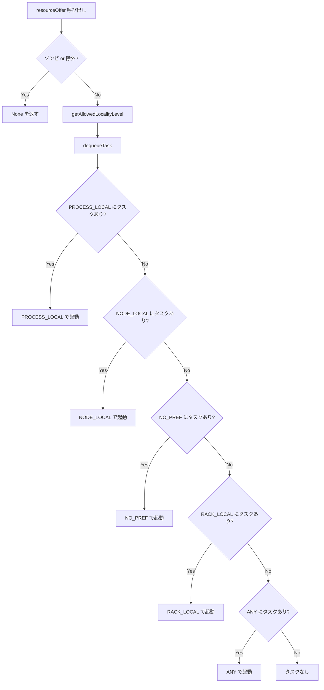
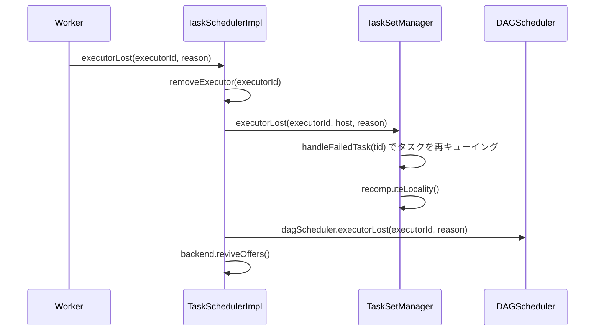

# 第7章 TaskScheduler: タスク分散とリソース割り当て

> 本章で読むソース
>
> - [`core/src/main/scala/org/apache/spark/scheduler/TaskSchedulerImpl.scala` L83-L88](https://github.com/apache/spark/blob/v4.1.2/core/src/main/scala/org/apache/spark/scheduler/TaskSchedulerImpl.scala#L83-L88)
> - [`core/src/main/scala/org/apache/spark/scheduler/TaskSchedulerImpl.scala` L210-L224](https://github.com/apache/spark/blob/v4.1.2/core/src/main/scala/org/apache/spark/scheduler/TaskSchedulerImpl.scala#L210-L224)
> - [`core/src/main/scala/org/apache/spark/scheduler/TaskSchedulerImpl.scala` L243-L285](https://github.com/apache/spark/blob/v4.1.2/core/src/main/scala/org/apache/spark/scheduler/TaskSchedulerImpl.scala#L243-L285)
> - [`core/src/main/scala/org/apache/spark/scheduler/TaskSchedulerImpl.scala` L378-L439](https://github.com/apache/spark/blob/v4.1.2/core/src/main/scala/org/apache/spark/scheduler/TaskSchedulerImpl.scala#L378-L439)
> - [`core/src/main/scala/org/apache/spark/scheduler/TaskSchedulerImpl.scala` L488-L736](https://github.com/apache/spark/blob/v4.1.2/core/src/main/scala/org/apache/spark/scheduler/TaskSchedulerImpl.scala#L488-L736)
> - [`core/src/main/scala/org/apache/spark/scheduler/TaskSchedulerImpl.scala` L774-L802](https://github.com/apache/spark/blob/v4.1.2/core/src/main/scala/org/apache/spark/scheduler/TaskSchedulerImpl.scala#L774-L802)
> - [`core/src/main/scala/org/apache/spark/scheduler/TaskSchedulerImpl.scala` L982-L1015](https://github.com/apache/spark/blob/v4.1.2/core/src/main/scala/org/apache/spark/scheduler/TaskSchedulerImpl.scala#L982-L1015)
> - [`core/src/main/scala/org/apache/spark/scheduler/TaskSetManager.scala` L56-L61](https://github.com/apache/spark/blob/v4.1.2/core/src/main/scala/org/apache/spark/scheduler/TaskSetManager.scala#L56-L61)
> - [`core/src/main/scala/org/apache/spark/scheduler/TaskSetManager.scala` L190-L198](https://github.com/apache/spark/blob/v4.1.2/core/src/main/scala/org/apache/spark/scheduler/TaskSetManager.scala#L190-L198)
> - [`core/src/main/scala/org/apache/spark/scheduler/TaskSetManager.scala` L274-L314](https://github.com/apache/spark/blob/v4.1.2/core/src/main/scala/org/apache/spark/scheduler/TaskSetManager.scala#L274-L314)
> - [`core/src/main/scala/org/apache/spark/scheduler/TaskSetManager.scala` L367-L426](https://github.com/apache/spark/blob/v4.1.2/core/src/main/scala/org/apache/spark/scheduler/TaskSetManager.scala#L367-L426)
> - [`core/src/main/scala/org/apache/spark/scheduler/TaskSetManager.scala` L454-L519](https://github.com/apache/spark/blob/v4.1.2/core/src/main/scala/org/apache/spark/scheduler/TaskSetManager.scala#L454-L519)
> - [`core/src/main/scala/org/apache/spark/scheduler/TaskSetManager.scala` L614-L675](https://github.com/apache/spark/blob/v4.1.2/core/src/main/scala/org/apache/spark/scheduler/TaskSetManager.scala#L614-L675)
> - [`core/src/main/scala/org/apache/spark/scheduler/TaskSetManager.scala` L944-L1089](https://github.com/apache/spark/blob/v4.1.2/core/src/main/scala/org/apache/spark/scheduler/TaskSetManager.scala#L944-L1089)
> - [`core/src/main/scala/org/apache/spark/scheduler/TaskSetManager.scala` L1284-L1321](https://github.com/apache/spark/blob/v4.1.2/core/src/main/scala/org/apache/spark/scheduler/TaskSetManager.scala#L1284-L1321)
> - [`core/src/main/scala/org/apache/spark/scheduler/TaskLocality.scala` L23-L32](https://github.com/apache/spark/blob/v4.1.2/core/src/main/scala/org/apache/spark/scheduler/TaskLocality.scala#L23-L32)

## この章の狙い

`TaskScheduler` は `DAGScheduler` から受け取ったタスクセットをクラスタのエグゼキュータに割り当てる役割を担う。
本章では、`TaskSchedulerImpl` がリソースオファーをどう処理してタスクを分散配置するか、`TaskSetManager` がデータローカリティと遅延スケジューリングをどう両立するかを追う。
タスクの失敗再試行と投機実行が、ジョブ全体のスループットをどう支えるかを機構レベルで説明する。

## 前提

`DAGScheduler` はステージを `TaskSet` に展開し、`TaskScheduler.submitTasks` に渡す（第6章）。
`TaskScheduler` はクラスタマネージャから受け取ったリソースオファーに対し、どのタスクをどのエグゼキュータで実行するかを決定する。
スケジューリングモードは FIFO と FAIR の2種類があり、`rootPool` でタスクセット間の優先順位を制御する。

## 7.1 TaskSchedulerImpl の初期化

`TaskSchedulerImpl` は `TaskScheduler` トレイトの実装クラスであり、クラスタ種別（スタンドアロン、YARN、Kubernetes）に依存しない共通ロジックを持つ。

[`core/src/main/scala/org/apache/spark/scheduler/TaskSchedulerImpl.scala` L83-L88](https://github.com/apache/spark/blob/v4.1.2/core/src/main/scala/org/apache/spark/scheduler/TaskSchedulerImpl.scala#L83-L88)

```scala
private[spark] class TaskSchedulerImpl(
    val sc: SparkContext,
    val maxTaskFailures: Int,
    isLocal: Boolean = false,
    clock: Clock = new SystemClock)
  extends TaskScheduler with Logging {
```

`maxTaskFailures` は同一タスクが連続して失敗できる上限回数を示す。
この値を超えるとタスクセット全体がアボートされ、ジョブが失敗する。

`initialize` メソッドで `SchedulerBackend` とスケジューリングモードを結びつける。

[`core/src/main/scala/org/apache/spark/scheduler/TaskSchedulerImpl.scala` L210-L224](https://github.com/apache/spark/blob/v4.1.2/core/src/main/scala/org/apache/spark/scheduler/TaskSchedulerImpl.scala#L210-L224)

```scala
def initialize(backend: SchedulerBackend): Unit = {
  this.backend = backend
  schedulableBuilder = {
    schedulingMode match {
      case SchedulingMode.FIFO =>
        new FIFOSchedulableBuilder(rootPool)
      case SchedulingMode.FAIR =>
        new FairSchedulableBuilder(rootPool, sc)
      case _ =>
        throw new IllegalArgumentException(s"Unsupported $SCHEDULER_MODE_PROPERTY: " +
        s"$schedulingMode")
    }
  }
  schedulableBuilder.buildPools()
}
```

FIFO モードではタスクセットの投入順に処理し、FAIR モードではプール間でリソースを公平に配分する。
`rootPool` は `Schedulable` のツリー構造であり、`TaskSetManager` がリーフとして追加される。

## 7.2 タスクセットの投入

`submitTasks` は `DAGScheduler` から `TaskSet` を受け取り、`TaskSetManager` を生成する。

[`core/src/main/scala/org/apache/spark/scheduler/TaskSchedulerImpl.scala` L243-L285](https://github.com/apache/spark/blob/v4.1.2/core/src/main/scala/org/apache/spark/scheduler/TaskSchedulerImpl.scala#L243-L285)

```scala
override def submitTasks(taskSet: TaskSet): Unit = {
  val tasks = taskSet.tasks
  // ...
  this.synchronized {
    val manager = createTaskSetManager(taskSet, maxTaskFailures)
    val stage = taskSet.stageId
    val stageTaskSets =
      taskSetsByStageIdAndAttempt.getOrElseUpdate(stage, new HashMap[Int, TaskSetManager])

    stageTaskSets.foreach { case (_, ts) =>
      ts.isZombie = true
    }
    stageTaskSets(taskSet.stageAttemptId) = manager
    schedulableBuilder.addTaskSetManager(manager, manager.taskSet.properties)
    // ...
  }
  backend.reviveOffers()
}
```

重要な点は、同一ステージの既存 `TaskSetManager` をすべてゾンビ状態にすることである。
ステージの再試行時に新しい `TaskSetManager` が追加されるが、古い `TaskSetManager` が実行中のタスクを持つ場合がある。
ゾンビの `TaskSetManager` は新しいタスクを起動しないが、実行中のタスクの追跡は続ける。

`submitTasks` の最後で `backend.reviveOffers()` を呼ぶ。
これにより、クラスタマネージャに対してリソースオファーの再送が要求され、新しいタスクセットが即座にスケジューリング対象になる。

## 7.3 リソースオファーの処理

`resourceOffers` は `TaskSchedulerImpl` の中核であり、クラスタから届いたリソースオファーに対してタスクを割り当てる。

[`core/src/main/scala/org/apache/spark/scheduler/TaskSchedulerImpl.scala` L488-L531](https://github.com/apache/spark/blob/v4.1.2/core/src/main/scala/org/apache/spark/scheduler/TaskSchedulerImpl.scala#L488-L531)

```scala
def resourceOffers(
    offers: IndexedSeq[WorkerOffer],
    isAllFreeResources: Boolean = true): Seq[Seq[TaskDescription]] = synchronized {
  var newExecAvail = false
  for (o <- offers) {
    // ...エグゼキュータのホスト情報を記録...
  }
  // ...
  val filteredOffers = healthTrackerOpt.map { healthTracker =>
    offers.filter { offer =>
      !healthTracker.isNodeExcluded(offer.host) &&
        !healthTracker.isExecutorExcluded(offer.executorId)
    }
  }.getOrElse(offers)

  val shuffledOffers = shuffleOffers(filteredOffers)
  val tasks = shuffledOffers.map(o => new ArrayBuffer[TaskDescription](o.cores / CPUS_PER_TASK))
  val availableCpus = shuffledOffers.map(o => o.cores).toArray
  val sortedTaskSets = rootPool.getSortedTaskSetQueue
  // ...
```

処理の流れは以下の通りである。

1. オファーを受け取ったエグゼキュータをホスト単位で記録する
2. `HealthTracker` によって除外されたノードやエグゼキュータをフィルタする
3. `shuffleOffers` でオファーをランダムシャッフルする
4. `rootPool.getSortedTaskSetQueue` でスケジューリング順にタスクセットを取り出す
5. 各タスクセットに対してローカリティレベルごとにタスクを割り当てる

オファーのシャッフルは、特定のエグゼキュータにタスクが偏るのを防ぐための仕組みである。

[`core/src/main/scala/org/apache/spark/scheduler/TaskSchedulerImpl.scala` L770-L772](https://github.com/apache/spark/blob/v4.1.2/core/src/main/scala/org/apache/spark/scheduler/TaskSchedulerImpl.scala#L770-L772)

```scala
protected def shuffleOffers(offers: IndexedSeq[WorkerOffer]): IndexedSeq[WorkerOffer] = {
  Random.shuffle(offers)
}
```

## 7.4 TaskSetManager の構造

`TaskSetManager` は1つの `TaskSet` に属するタスクのスケジューリングを管理する。

[`core/src/main/scala/org/apache/spark/scheduler/TaskSetManager.scala` L56-L61](https://github.com/apache/spark/blob/v4.1.2/core/src/main/scala/org/apache/spark/scheduler/TaskSetManager.scala#L56-L61)

```scala
private[spark] class TaskSetManager(
    sched: TaskSchedulerImpl,
    val taskSet: TaskSet,
    val maxTaskFailures: Int,
    healthTracker: Option[HealthTracker] = None,
    clock: Clock = new SystemClock()) extends Schedulable with Logging {
```

`TaskSetManager` の主なデータ構造を以下に示す。

[`core/src/main/scala/org/apache/spark/scheduler/TaskSetManager.scala` L190-L201](https://github.com/apache/spark/blob/v4.1.2/core/src/main/scala/org/apache/spark/scheduler/TaskSetManager.scala#L190-L201)

```scala
// Store tasks waiting to be scheduled by locality preferences
private[scheduler] val pendingTasks = new PendingTasksByLocality()

// Tasks that can be speculated.
private[scheduler] val speculatableTasks = new HashSet[Int]

// Store speculatable tasks by locality preferences
private[scheduler] val pendingSpeculatableTasks = new PendingTasksByLocality()

// Task index, start and finish time for each task attempt (indexed by task ID)
private[scheduler] val taskInfos = new HashMap[Long, TaskInfo]
```

`PendingTasksByLocality` はローカリティレベルごとに待機タスクのインデックスを保持する。

```scala
private[scheduler] class PendingTasksByLocality {
  val forExecutor = new HashMap[String, ArrayBuffer[Int]]
  val forHost = new HashMap[String, ArrayBuffer[Int]]
  val noPrefs = new ArrayBuffer[Int]
  val forRack = new HashMap[String, ArrayBuffer[Int]]
  val all = new ArrayBuffer[Int]
}
```

各 `ArrayBuffer` はスタックとして機能し、末尾からの追加・削除で効率的にタスクを出し入れする。
失敗したタスクは末尾に再追加されるため、次に dequeue されるときに優先的に再試行される。

## 7.5 タスクの配置戦略

`TaskSetManager.resourceOffer` は、特定のエグゼキュータに対するオファーに対し、実行すべきタスクを1つ返す。

[`core/src/main/scala/org/apache/spark/scheduler/TaskSetManager.scala` L454-L519](https://github.com/apache/spark/blob/v4.1.2/core/src/main/scala/org/apache/spark/scheduler/TaskSetManager.scala#L454-L519)

```scala
def resourceOffer(
    execId: String,
    host: String,
    maxLocality: TaskLocality.TaskLocality,
    taskCpus: Int = sched.CPUS_PER_TASK,
    taskResourceAssignments: Map[String, Map[String, Long]] = Map.empty)
  : (Option[TaskDescription], Boolean, Int) =
{
  val offerExcluded = taskSetExcludelistHelperOpt.exists { excludeList =>
    excludeList.isNodeExcludedForTaskSet(host) ||
      excludeList.isExecutorExcludedForTaskSet(execId)
  }
  if (!isZombie && !offerExcluded) {
    val curTime = clock.getTimeMillis()
    var allowedLocality = maxLocality
    if (maxLocality != TaskLocality.NO_PREF) {
      allowedLocality = getAllowedLocalityLevel(curTime)
      if (allowedLocality > maxLocality) {
        allowedLocality = maxLocality
      }
    }
    val dequeuedTaskIndex: Option[Int] = None
    val taskDescription =
      dequeueTask(execId, host, allowedLocality)
        .map { case (index, taskLocality, speculative) =>
          // ...タスクの起動準備...
        }
    // ...
  }
}
```

`getAllowedLocalityLevel` は遅延スケジューリングに基づく現在の許容ローカリティレベルを返す。
これにより、即座に `ANY` まで緩和せず、一定時間待ってから段階的にローカリティを緩和する。

`dequeueTask` はローカリティの強い順にタスクを検索する。

[`core/src/main/scala/org/apache/spark/scheduler/TaskSetManager.scala` L367-L426](https://github.com/apache/spark/blob/v4.1.2/core/src/main/scala/org/apache/spark/scheduler/TaskSetManager.scala#L367-L426)

```scala
private def dequeueTask(
    execId: String,
    host: String,
    maxLocality: TaskLocality.Value): Option[(Int, TaskLocality.Value, Boolean)] = {
  dequeueTaskHelper(execId, host, maxLocality, false).orElse(
    dequeueTaskHelper(execId, host, maxLocality, true))
}
```

`dequeueTaskHelper` の内部では、以下の順序でタスクを検索する。

1. `PROCESS_LOCAL`: このエグゼキュータにキャッシュがあるタスク
2. `NODE_LOCAL`: このホストにデータがあるタスク
3. `NO_PREF`: ロケーション制約のないタスク
4. `RACK_LOCAL`: 同一ラックのタスク
5. `ANY`: 制約なし



## 7.6 データローカリティのレベル

`TaskLocality` はタスクのデータ配置の近さを5段階で定義する。

[`core/src/main/scala/org/apache/spark/scheduler/TaskLocality.scala` L23-L32](https://github.com/apache/spark/blob/v4.1.2/core/src/main/scala/org/apache/spark/scheduler/TaskLocality.scala#L23-L32)

```scala
object TaskLocality extends Enumeration {
  val PROCESS_LOCAL, NODE_LOCAL, NO_PREF, RACK_LOCAL, ANY = Value

  type TaskLocality = Value

  def isAllowed(constraint: TaskLocality, condition: TaskLocality): Boolean = {
    condition <= constraint
  }
}
```

各レベルの意味は以下の通りである。

- `PROCESS_LOCAL`: タスクが、必要なデータを保持するエグゼキュータの JVM 内で実行できる状態
- `NODE_LOCAL`: データが同一ホスト上にあるが、別エグゼキュータやローカルディスクにある状態
- `NO_PREF`: タスクにロケーション制約がない状態
- `RACK_LOCAL`: データが同一ラック内の別ホストにある状態
- `ANY`: どのエグゼキュータでも実行可能な状態

`PROCESS_LOCAL` が最も通信コストが低く、`ANY` が最も高い。
列挙の順序がそのまま優先度の高い順になる。

## 7.7 遅延スケジューリング

遅延スケジューリングは、ジョブの公平性とデータローカリティのトレードオフを制御する仕組みである。
即座に遠くのノードでタスクを実行するのではなく、ローカルデータが利用可能になるまで待機する。

`getAllowedLocalityLevel` は現在の時刻に基づいて許容されるローカリティレベルを計算する。

[`core/src/main/scala/org/apache/spark/scheduler/TaskSetManager.scala` L614-L675](https://github.com/apache/spark/blob/v4.1.2/core/src/main/scala/org/apache/spark/scheduler/TaskSetManager.scala#L614-L675)

```scala
private def getAllowedLocalityLevel(curTime: Long): TaskLocality.TaskLocality = {
  def tasksNeedToBeScheduledFrom(pendingTaskIds: ArrayBuffer[Int]): Boolean = {
    var indexOffset = pendingTaskIds.size
    while (indexOffset > 0) {
      indexOffset -= 1
      val index = pendingTaskIds(indexOffset)
      if (copiesRunning(index) == 0 && !successful(index)) {
        return true
      } else {
        pendingTaskIds.remove(indexOffset)
      }
    }
    false
  }
  // ...
  while (currentLocalityIndex < myLocalityLevels.length - 1) {
    val moreTasks = myLocalityLevels(currentLocalityIndex) match {
      case TaskLocality.PROCESS_LOCAL => moreTasksToRunIn(pendingTasks.forExecutor)
      case TaskLocality.NODE_LOCAL => moreTasksToRunIn(pendingTasks.forHost)
      case TaskLocality.NO_PREF => pendingTasks.noPrefs.nonEmpty
      case TaskLocality.RACK_LOCAL => moreTasksToRunIn(pendingTasks.forRack)
    }
    if (!moreTasks) {
      lastLocalityWaitResetTime = curTime
      currentLocalityIndex += 1
    } else if (curTime - lastLocalityWaitResetTime >= localityWaits(currentLocalityIndex)) {
      lastLocalityWaitResetTime += localityWaits(currentLocalityIndex)
      currentLocalityIndex += 1
    } else {
      return myLocalityLevels(currentLocalityIndex)
    }
  }
  myLocalityLevels(currentLocalityIndex)
}
```

処理の流れは以下の通りである。

1. 現在のローカリティレベルに待機タスクがなければ、即座に次のレベルに緩和する
2. 待機タスクがあっても、`localityWaits` で指定された待機時間を超えれば次のレベルに緩和する
3. 待機時間以内であれば、現在のレベルにとどまる

待機時間は設定 `spark.locality.wait` で制御される。
デフォルトは3秒であり、`PROCESS_LOCAL`、`NODE_LOCAL`、`RACK_LOCAL` ごとに個別に設定可能である。

この機構がなぜ効果的かを説明する。
HDFS やブロックキャッシュからデータを読むタスクを `PROCESS_LOCAL` や `NODE_LOCAL` で実行すれば、ネットワーク転送が不要になる。
待機時間が切れるまでは遠くのノードで実行しないため、データローカリティの高い配置が実現する。
待機時間が過ぎれば `ANY` まで緩和してタスクを前進させるため、リソースが遊休化するのを防ぐ。

## 7.8 タスクの完了と失敗処理

`TaskSchedulerImpl.statusUpdate` はエグゼキュータからのタスク状態更新を受け取る。

[`core/src/main/scala/org/apache/spark/scheduler/TaskSchedulerImpl.scala` L774-L802](https://github.com/apache/spark/blob/v4.1.2/core/src/main/scala/org/apache/spark/scheduler/TaskSchedulerImpl.scala#L774-L802)

```scala
def statusUpdate(tid: Long, state: TaskState, serializedData: ByteBuffer): Unit = {
  synchronized {
    try {
      Option(taskIdToTaskSetManager.get(tid)) match {
        case Some(taskSet) =>
          if (TaskState.isFinished(state)) {
            cleanupTaskState(tid)
            taskSet.removeRunningTask(tid)
            if (state == TaskState.FINISHED) {
              taskResultGetter.enqueueSuccessfulTask(taskSet, tid, serializedData)
            } else if (Set(TaskState.FAILED, TaskState.KILLED).contains(state)) {
              taskResultGetter.enqueueFailedTask(taskSet, tid, state, serializedData)
            }
          }
          if (state == TaskState.RUNNING) {
            taskSet.taskInfos(tid).launchSucceeded()
          }
        case None =>
          // ...
      }
    } catch {
      case e: Exception => logError("Exception in statusUpdate", e)
    }
  }
}
```

完了したタスクは `cleanupTaskState` で `TaskSchedulerImpl` の状態から削除される。
成功したタスクは `TaskResultGetter` 経由で結果を取得し、失敗したタスクは再試行のためにキューイングされる。

`TaskSetManager.handleFailedTask` はタスクの失敗を処理し、再試行の可否を判定する。

[`core/src/main/scala/org/apache/spark/scheduler/TaskSetManager.scala` L1065-L1089](https://github.com/apache/spark/blob/v4.1.2/core/src/main/scala/org/apache/spark/scheduler/TaskSetManager.scala#L1065-L1089)

```scala
if (!isZombie && reason.countTowardsTaskFailures) {
  assert (null != failureReason)
  taskSetExcludelistHelperOpt.foreach(_.updateExcludedForFailedTask(
    info.host, info.executorId, index, failureReasonString))
  numFailures(index) += 1
  if (numFailures(index) >= maxTaskFailures) {
    logError(log"Task ${MDC(TASK_INDEX, index)} in stage " + taskSet.logId +
      log" failed ${MDC(MAX_ATTEMPTS, maxTaskFailures)} times; aborting job")
    abort("Task %d in stage %s failed %d times, most recent failure: %s\nDriver stacktrace:"
      .format(index, taskSet.id, maxTaskFailures, failureReasonString), failureException)
    return
  }
}
// ...
if (successful(index)) {
  // ...
} else {
  addPendingTask(index)
}
```

タスクが失敗すると `numFailures` をインクリメントする。
`maxTaskFailures` に達するとタスクセット全体をアボートする。
それ未満であれば `addPendingTask` でタスクを再キューイングし、別のエグゼキュータで再試行する。

## 7.9 エグゼキュータ喪失の処理

エグゼキュータが喪失すると、`TaskSchedulerImpl.executorLost` が呼ばれる。

[`core/src/main/scala/org/apache/spark/scheduler/TaskSchedulerImpl.scala` L982-L1015](https://github.com/apache/spark/blob/v4.1.2/core/src/main/scala/org/apache/spark/scheduler/TaskSchedulerImpl.scala#L982-L1015)

```scala
override def executorLost(executorId: String, reason: ExecutorLossReason): Unit = {
  var failedExecutor: Option[String] = None
  synchronized {
    if (executorIdToRunningTaskIds.contains(executorId)) {
      val hostPort = executorIdToHost(executorId)
      logExecutorLoss(executorId, hostPort, reason)
      removeExecutor(executorId, reason)
      failedExecutor = Some(executorId)
    }
    // ...
  }
  if (failedExecutor.isDefined) {
    dagScheduler.executorLost(failedExecutor.get, reason)
    backend.reviveOffers()
  }
}
```

`removeExecutor` はエグゼキュータのホストマッピングやラックマッピングを更新する。
その後 `rootPool.executorLost` を呼び、`TaskSetManager` が喪失したエグゼキュータ上で動いていたタスクを再キューイングする。
最後に `backend.reviveOffers()` で新しいオファーを要求し、再試行が即座にスケジューリングされる。



`TaskSetManager.executorLost` では、シャッフルマップタスクの出力喪失も処理する。
外部シャッフルサービスが無効な場合、喪失したエグゼキュータのシャッフル出力は失われる。
この場合、該当するタスクを再実行してシャッフル出力を再生成する必要がある。

## 7.10 投機実行

投機実行は、遅いタスクの複製を別のエグゼキュータで起動し、先に完了した方を採用する仕組みである。

`TaskSchedulerImpl` は `start()` で投機実行の定期チェックを開始する。

[`core/src/main/scala/org/apache/spark/scheduler/TaskSchedulerImpl.scala` L228-L237](https://github.com/apache/spark/blob/v4.1.2/core/src/main/scala/org/apache/spark/scheduler/TaskSchedulerImpl.scala#L228-L237)

```scala
override def start(): Unit = {
  backend.start()
  if (!isLocal && conf.get(SPECULATION_ENABLED)) {
    logInfo("Starting speculative execution thread")
    speculationScheduler.scheduleWithFixedDelay(
      () => Utils.tryOrStopSparkContext(sc) { checkSpeculatableTasks() },
      SPECULATION_INTERVAL_MS, SPECULATION_INTERVAL_MS, TimeUnit.MILLISECONDS)
  }
}
```

`TaskSetManager.checkSpeculatableTasks` は、完了したタスクの中央値に基づいて閾値を計算する。

[`core/src/main/scala/org/apache/spark/scheduler/TaskSetManager.scala` L1284-L1321](https://github.com/apache/spark/blob/v4.1.2/core/src/main/scala/org/apache/spark/scheduler/TaskSetManager.scala#L1284-L1321)

```scala
override def checkSpeculatableTasks(minTimeToSpeculation: Long): Boolean = {
  if (isZombie || isBarrier || (numTasks == 1 && !isSpeculationThresholdSpecified)) {
    return false
  }
  // ...
  val numSuccessfulTasks = successfulTaskDurations.size()
  val timeMs = clock.getTimeMillis()
  if (numSuccessfulTasks >= minFinishedForSpeculation) {
    val medianDuration = successfulTaskDurations.percentile()
    val threshold = max(speculationMultiplier * medianDuration, minTimeToSpeculation.toDouble)
    foundTasks = checkAndSubmitSpeculatableTasks(timeMs, threshold)
  }
  // ...
}
```

`PercentileHeap` に格納された完了タスクの実行時間から中央値を求め、`speculationMultiplier`（デフォルト1.5）を掛けた値を閾値とする。
この閾値を超えて実行中のタスクを投機対象としてマークし、別のエグゼキュータで複製を起動する。

投機実行がジョブのスループットを向上させる理由は、ストaggler（遅いタスク）の影響を軽減する点にある。
ディスク I/O の一時的な競合やガベージコレクションの遅延など、タスクの実行時間は均一ではない。
投機実行により、ストaggler が完了するのを待たずにジョブを終了できる。

## 7.11 ゾンビ状態の TaskSetManager

ステージの再試行時に、複数の `TaskSetManager` が同一ステージに対して存在する可能性がある。
古い `TaskSetManager` は `isZombie = true` に設定され、新しいタスクを起動しなくなる。

ただし、ゾンビの `TaskSetManager` も実行中のタスクの追跡を続ける。
ゾンビのタスクが完了した場合、`handlePartitionCompleted` でアクティブな `TaskSetManager` に通知し、同じパーティションのタスクをスキップさせる。

[`core/src/main/scala/org/apache/spark/scheduler/TaskSchedulerImpl.scala` L898-L902](https://github.com/apache/spark/blob/v4.1.2/core/src/main/scala/org/apache/spark/scheduler/TaskSchedulerImpl.scala#L898-L902)

```scala
private[scheduler] def handlePartitionCompleted(stageId: Int, partitionId: Int) = synchronized {
  taskSetsByStageIdAndAttempt.get(stageId).foreach(_.values.filter(!_.isZombie).foreach { tsm =>
    tsm.markPartitionCompleted(partitionId)
  })
}
```

これにより、ゾンビのタスクが完了してもリソースを無駄にせず、アクティブな `TaskSetManager` がそのパーティションを再実行するのを防ぐ。

## 7.12 最適化: 遅延スケジューリングによるデータローカリティの最大化

遅延スケジューリングは、ジョブの公平性とデータローカリティのトレードオフを制御する最適化機構である。
`spark.locality.wait` で指定された時間だけローカルなタスクを待ち、待機時間を超えればより広い範囲でタスクをスケジュールする。

この最適化がなぜ効果的かを説明する。
クラスタのすべてのタスクが即座に `ANY` でスケジュールされると、データがあるノードとは別のノードでタスクが実行される。
ネットワーク経由のデータ転送が発生し、クラスタ全体のスループットが低下する。
遅延スケジューリングは、短い待機時間（デフォルト3秒）でデータローカリティの高い配置を実現する。
待機時間はタスクの実行時間と比較して十分短いため、ジョブの公平性への影響は限定的である。

`TaskSchedulerImpl.resourceOffers` の中で、各タスクセットに対してローカリティレベルごとに繰り返しオファーを試す。

[`core/src/main/scala/org/apache/spark/scheduler/TaskSchedulerImpl.scala` L566-L577](https://github.com/apache/spark/blob/v4.1.2/core/src/main/scala/org/apache/spark/scheduler/TaskSchedulerImpl.scala#L566-L577)

```scala
for (currentMaxLocality <- taskSet.myLocalityLevels) {
  var launchedTaskAtCurrentMaxLocality = false
  do {
    val (noDelayScheduleReject, minLocality) = resourceOfferSingleTaskSet(
      taskSet, currentMaxLocality, shuffledOffers, availableCpus,
      availableResources, tasks)
    launchedTaskAtCurrentMaxLocality = minLocality.isDefined
    launchedAnyTask |= launchedTaskAtCurrentMaxLocality
    noDelaySchedulingRejects &= noDelayScheduleReject
    globalMinLocality = minTaskLocality(globalMinLocality, minLocality)
  } while (launchedTaskAtCurrentMaxLocality)
}
```

`myLocalityLevels` は `PROCESS_LOCAL` から `ANY` まで段階的に緩和される。
各レベルでタスクが起動されなくなるまで繰り返し、次のレベルに進む。
`resourceOfferSingleTaskSet` の中で `TaskSetManager.resourceOffer` が呼ばれ、遅延スケジューリングの判定が行われる。

## まとめ

`TaskSchedulerImpl` はクラスタのリソースオファーに対してタスクを割り当てるスケジューリングの中核である。
`DAGScheduler` から受け取った `TaskSet` ごとに `TaskSetManager` を生成し、`rootPool` のスケジューリング順に従ってリソースを配分する。
`TaskSetManager` は `PendingTasksByLocality` で待機タスクをローカリティレベルごとに管理し、`getAllowedLocalityLevel` で遅延スケジューリングを制御する。
タスクの失敗は `maxTaskFailures` 回まで再試行され、エグゼキュータの喪失時にはタスクを再キューイングして `reviveOffers` で再スケジュールを要求する。
投機実行は完了タスクの中央値に基づいてストaggler を検出し、別のエグゼキュータで複製を起動することでジョブのスループットを向上させる。

## 関連する章

- 第6章 `DAGScheduler`: ステージ構築とジョブスケジューリング
- 第8章 スケジューラバックエンドとクラスタマネージャインタフェース
- 第9章 `Executor`: タスク実行エンジン
