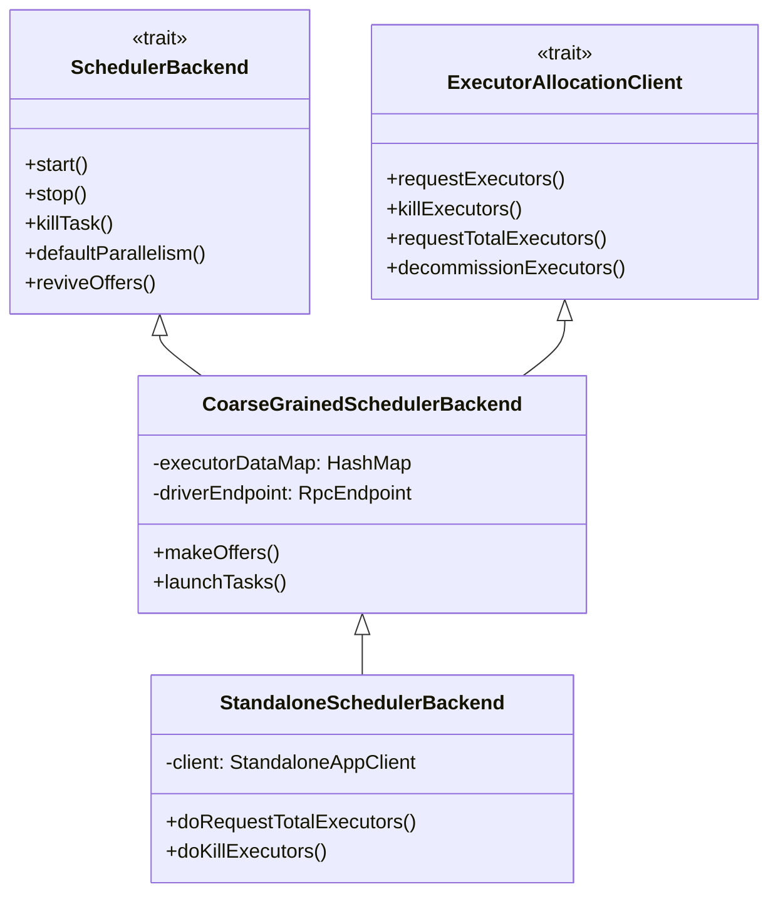
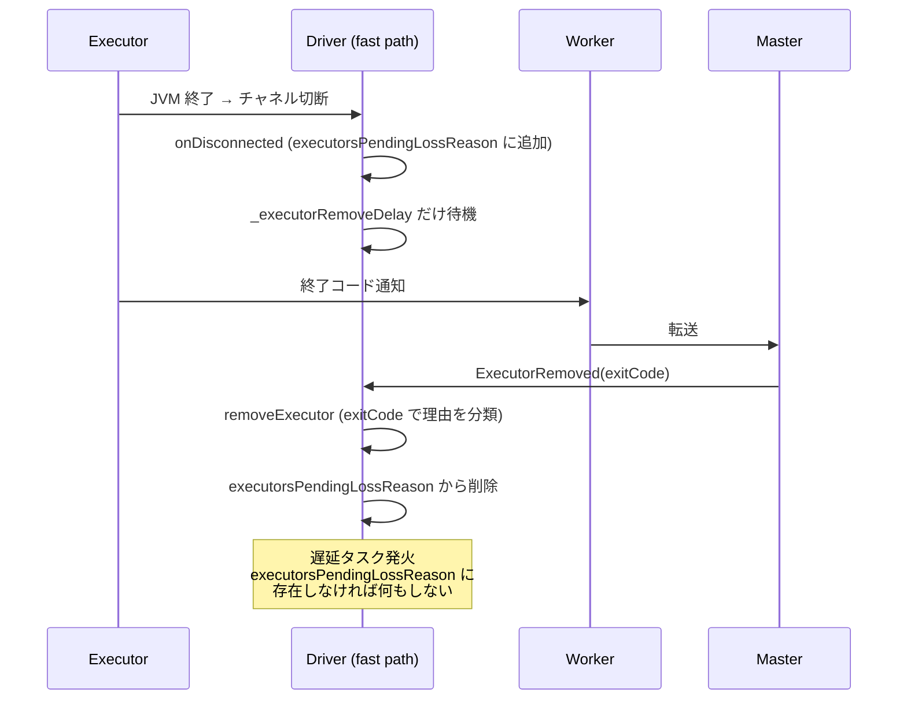

# 第8章 スケジューラバックエンドとクラスタマネージャインタフェース

> 本章で読むソース
>
> - [`core/src/main/scala/org/apache/spark/scheduler/cluster/CoarseGrainedSchedulerBackend.scala` L57-L59](https://github.com/apache/spark/blob/v4.1.2/core/src/main/scala/org/apache/spark/scheduler/cluster/CoarseGrainedSchedulerBackend.scala#L57-L59)
> - [`core/src/main/scala/org/apache/spark/scheduler/cluster/CoarseGrainedSchedulerBackend.scala` L147-L169](https://github.com/apache/spark/blob/v4.1.2/core/src/main/scala/org/apache/spark/scheduler/cluster/CoarseGrainedSchedulerBackend.scala#L147-L169)
> - [`core/src/main/scala/org/apache/spark/scheduler/cluster/CoarseGrainedSchedulerBackend.scala` L251-L322](https://github.com/apache/spark/blob/v4.1.2/core/src/main/scala/org/apache/spark/scheduler/cluster/CoarseGrainedSchedulerBackend.scala#L251-L322)
> - [`core/src/main/scala/org/apache/spark/scheduler/cluster/CoarseGrainedSchedulerBackend.scala` L376-L460](https://github.com/apache/spark/blob/v4.1.2/core/src/main/scala/org/apache/spark/scheduler/cluster/CoarseGrainedSchedulerBackend.scala#L376-L460)
> - [`core/src/main/scala/org/apache/spark/scheduler/cluster/CoarseGrainedSchedulerBackend.scala` L845-L872](https://github.com/apache/spark/blob/v4.1.2/core/src/main/scala/org/apache/spark/scheduler/cluster/CoarseGrainedSchedulerBackend.scala#L845-L872)
> - [`core/src/main/scala/org/apache/spark/scheduler/cluster/CoarseGrainedSchedulerBackend.scala` L1080-L1085](https://github.com/apache/spark/blob/v4.1.2/core/src/main/scala/org/apache/spark/scheduler/cluster/CoarseGrainedSchedulerBackend.scala#L1080-L1085)
> - [`core/src/main/scala/org/apache/spark/scheduler/ExternalClusterManager.scala` L25-L62](https://github.com/apache/spark/blob/v4.1.2/core/src/main/scala/org/apache/spark/scheduler/ExternalClusterManager.scala#L25-L62)
> - [`core/src/main/scala/org/apache/spark/scheduler/cluster/StandaloneSchedulerBackend.scala` L44-L50](https://github.com/apache/spark/blob/v4.1.2/core/src/main/scala/org/apache/spark/scheduler/cluster/StandaloneSchedulerBackend.scala#L44-L50)
> - [`core/src/main/scala/org/apache/spark/scheduler/cluster/StandaloneSchedulerBackend.scala` L72-L140](https://github.com/apache/spark/blob/v4.1.2/core/src/main/scala/org/apache/spark/scheduler/cluster/StandaloneSchedulerBackend.scala#L72-L140)
> - [`core/src/main/scala/org/apache/spark/scheduler/cluster/StandaloneSchedulerBackend.scala` L239-L262](https://github.com/apache/spark/blob/v4.1.2/core/src/main/scala/org/apache/spark/scheduler/cluster/StandaloneSchedulerBackend.scala#L239-L262)
> - [`core/src/main/scala/org/apache/spark/scheduler/cluster/StandaloneSchedulerBackend.scala` L298-L365](https://github.com/apache/spark/blob/v4.1.2/core/src/main/scala/org/apache/spark/scheduler/cluster/StandaloneSchedulerBackend.scala#L298-L365)

## この章の狙い

`SchedulerBackend` は `TaskScheduler` とクラスタマネージャのあいだに立ち、エグゼキュータの確保とタスクの配送を担う。
本章では `CoarseGrainedSchedulerBackend` を共通基盤として読み、`ExternalClusterManager` による SPI、`StandaloneSchedulerBackend` の具体実装を追う。
ダイナミックリソース割り当てがエグゼキュータの要求数をワークロードに応じてどう制御するかを機構レベルで説明する。

## 前提

`TaskSchedulerImpl` はタスクの配置を決定するが、エグゼキュータの起動やクラスタリソースの要求は `SchedulerBackend` に委ねる（第7章）。
`SchedulerBackend` の実装はクラスタマネージャごとに分かれる。
Spark 組み込みの Standalone、YARN、Kubernetes はいずれも `CoarseGrainedSchedulerBackend` を継承し、エグゼキュータを長寿命プロセスとして保持する「コースグレーン」方式を共有する。
外部のクラスタマネージャをプラグインするには `ExternalClusterManager` トレイトを実装する。

## 8.1 SchedulerBackend のクラス階層

`CoarseGrainedSchedulerBackend` は `ExecutorAllocationClient` と `SchedulerBackend` を同時に実装する。

[`core/src/main/scala/org/apache/spark/scheduler/cluster/CoarseGrainedSchedulerBackend.scala` L57-L59](https://github.com/apache/spark/blob/v4.1.2/core/src/main/scala/org/apache/spark/scheduler/cluster/CoarseGrainedSchedulerBackend.scala#L57-L59)

```scala
private[spark]
class CoarseGrainedSchedulerBackend(scheduler: TaskSchedulerImpl, val rpcEnv: RpcEnv)
  extends ExecutorAllocationClient with SchedulerBackend with Logging {
```

`ExecutorAllocationClient` はエグゼキュータの動的な要求と停止を提供するインタフェースである。
`SchedulerBackend` はエグゼキュータへのタスク送信、並列度の算出、起動と停止のライフサイクルを定義する。
この2つのインタフェースを1クラスで満たすことで、スタティックなリソース割り当てもダイナミックな割り当ても同一の経路で扱える。



YARN の `YarnCoarseGrainedSchedulerBackend`、Kubernetes の `KubernetesClusterSchedulerBackend` も同じく `CoarseGrainedSchedulerBackend` を継承する。
各クラスタマネージャ固有の処理は `doRequestTotalExecutors` と `doKillExecutors` をオーバーライドして実装する。

## 8.2 DriverEndpoint: RPC によるイベントループ

`CoarseGrainedSchedulerBackend` の中核は `DriverEndpoint` である。
`DriverEndpoint` は `IsolatedThreadSafeRpcEndpoint` を継承し、エグゼキュータからの RPC メッセージを直列に処理する。

[`core/src/main/scala/org/apache/spark/scheduler/cluster/CoarseGrainedSchedulerBackend.scala` L147-L169](https://github.com/apache/spark/blob/v4.1.2/core/src/main/scala/org/apache/spark/scheduler/cluster/CoarseGrainedSchedulerBackend.scala#L147-L169)

```scala
class DriverEndpoint extends IsolatedThreadSafeRpcEndpoint with Logging {

  override val rpcEnv: RpcEnv = CoarseGrainedSchedulerBackend.this.rpcEnv

  protected val addressToExecutorId = new HashMap[RpcAddress, String]

  private lazy val sparkProperties = scheduler.sc.conf.getAll
    .filter { case (k, _) => k.startsWith("spark.") }
    .toImmutableArraySeq

  // ...

  override def onStart(): Unit = {
    val reviveIntervalMs = conf.get(SCHEDULER_REVIVE_INTERVAL).getOrElse(1000L)

    reviveThread.scheduleAtFixedRate(() => Utils.tryLogNonFatalError {
      Option(self).foreach(_.send(ReviveOffers))
    }, 0, reviveIntervalMs, TimeUnit.MILLISECONDS)
  }
```

`DriverEndpoint` は RPC スレッド上でメッセージを1つずつ取り出す。
`onStart` で `reviveThread` が定期起動し、`ReviveOffers` メッセージを自身に送信する。
この周期性メッセージによって、遅延スケジューリングで保留していたタスクの再配置が時間経過で解消される。

## 8.3 エグゼキュータの登録

エグゼキュータがドライバに接続すると `RegisterExecutor` メッセージを送る。
`DriverEndpoint` はこのメッセージを受けてエグゼキュータのメタデータを `executorDataMap` に記録する。

[`core/src/main/scala/org/apache/spark/scheduler/cluster/CoarseGrainedSchedulerBackend.scala` L253-L322](https://github.com/apache/spark/blob/v4.1.2/core/src/main/scala/org/apache/spark/scheduler/cluster/CoarseGrainedSchedulerBackend.scala#L253-L322)

```scala
case RegisterExecutor(executorId, executorRef, hostname, cores, logUrls,
    attributes, resources, resourceProfileId) =>
  if (executorDataMap.contains(executorId)) {
    context.sendFailure(new IllegalStateException(s"Duplicate executor ID: $executorId"))
  } else if (scheduler.excludedNodes().contains(hostname) ||
      isExecutorExcluded(executorId, hostname)) {
    logInfo(log"Rejecting ${MDC(LogKeys.EXECUTOR_ID, executorId)} " +
      log"as it has been excluded.")
    context.sendFailure(
      new IllegalStateException(s"Executor is excluded due to failures: $executorId"))
  } else {
    // ...
    totalCoreCount.addAndGet(cores)
    totalRegisteredExecutors.addAndGet(1)
    // ...
    val data = new ExecutorData(executorRef, executorAddress, hostname,
      0, cores, logUrlHandler.applyPattern(logUrls, attributes), attributes,
      resourcesInfo, resourceProfileId, registrationTs = System.currentTimeMillis(),
      requestTs = reqTs)
    CoarseGrainedSchedulerBackend.this.synchronized {
      executorDataMap.put(executorId, data)
      // ...
    }
    listenerBus.post(
      SparkListenerExecutorAdded(System.currentTimeMillis(), executorId, data))
    // ...
    context.reply(true)
  }
```

登録時に3つの検査がある。
1つ目は重複 ID の拒否である。
2つ目は除外ノードの拒否である。
クラスタマネージャが除外リストを無視してエグゼキュータを配置した場合でも、ドライバ側で即座に拒否できる。
3つ目は正常登録で、`totalCoreCount` と `totalRegisteredExecutors` をアトミックに更新し、`SparkListenerExecutorAdded` イベントを `listenerBus` 経由で通知する。

## 8.4 リソースオファーとタスクの起動

エグゼキュータが登録されるか `ReviveOffers` を受信すると、`makeOffers` が実行される。

[`core/src/main/scala/org/apache/spark/scheduler/cluster/CoarseGrainedSchedulerBackend.scala` L376-L389](https://github.com/apache/spark/blob/v4.1.2/core/src/main/scala/org/apache/spark/scheduler/cluster/CoarseGrainedSchedulerBackend.scala#L376-L389)

```scala
private def makeOffers(): Unit = {
  val taskDescs = withLock {
    val activeExecutors = executorDataMap.filter { case (id, _) => isExecutorActive(id) }
    val workOffers = activeExecutors.map {
      case (id, executorData) => buildWorkerOffer(id, executorData)
    }.toIndexedSeq
    scheduler.resourceOffers(workOffers, true)
  }
  if (taskDescs.nonEmpty) {
    launchTasks(taskDescs)
  }
}
```

`makeOffers` はアクティブなエグゼキュータごとに `WorkerOffer` を組み立て、`TaskSchedulerImpl.resourceOffers` に渡す。
`isExecutorActive` は `executorsPendingToRemove`、`executorsPendingLossReason`、`executorsPendingDecommission` のいずれにも含まれないエグゼキュータだけを返す。
`resourceOffers` が返した `TaskDescription` の列を `launchTasks` で各エグゼキュータに送信する。

[`core/src/main/scala/org/apache/spark/scheduler/cluster/CoarseGrainedSchedulerBackend.scala` L430-L460](https://github.com/apache/spark/blob/v4.1.2/core/src/main/scala/org/apache/spark/scheduler/cluster/CoarseGrainedSchedulerBackend.scala#L430-L460)

```scala
private def launchTasks(tasks: Seq[Seq[TaskDescription]]): Unit = {
  for (task <- tasks.flatten) {
    val serializedTask = TaskDescription.encode(task)
    if (serializedTask.limit() >= maxRpcMessageSize) {
      // ... タスクが RPC メッセージ上限を超えた場合はエラー
    }
    else {
      val executorData = executorDataMap(task.executorId)
      executorData.freeCores -= task.cpus
      task.resources.foreach { case (rName, addressAmounts) =>
        executorData.resourcesInfo(rName).acquire(addressAmounts)
      }
      executorData.executorEndpoint.send(
        LaunchTask(new SerializableBuffer(serializedTask)))
    }
  }
}
```

`launchTasks` はタスクをシリアライズし、RPC のメッセージ上限を超えないか検査する。
超える場合はブロードキャスト変数の利用を促すエラーメッセージを出力する。
上限を超えなければ `freeCores` を減算し、リソースを確保し、`LaunchTask` メッセージとしてエグゼキュータへ送る。
タスクのシリアライズと送信を同一のイベントループ内で行うことで、ロック不要な直列性を保っている。

## 8.5 ExternalClusterManager: プラグインのための SPI

外部のクラスタマネージャを接続するには `ExternalClusterManager` トレイトを実装する。

[`core/src/main/scala/org/apache/spark/scheduler/ExternalClusterManager.scala` L25-L62](https://github.com/apache/spark/blob/v4.1.2/core/src/main/scala/org/apache/spark/scheduler/ExternalClusterManager.scala#L25-L62)

```scala
private[spark] trait ExternalClusterManager {

  /**
   * Check if this cluster manager instance can create scheduler components
   * for a certain master URL.
   * @param masterURL the master URL
   * @return True if the cluster manager can create scheduler backend/
   */
  def canCreate(masterURL: String): Boolean

  /**
   * Create a task scheduler instance for the given SparkContext
   * @param sc SparkContext
   * @param masterURL the master URL
   * @return TaskScheduler that will be responsible for task handling
   */
  def createTaskScheduler(sc: SparkContext, masterURL: String): TaskScheduler

  /**
   * Create a scheduler backend for the given SparkContext and scheduler. This is
   * called after task scheduler is created using `ExternalClusterManager.createTaskScheduler()`.
   * @param sc SparkContext
   * @param masterURL the master URL
   * @param scheduler TaskScheduler that will be used with the scheduler backend.
   * @return SchedulerBackend that works with a TaskScheduler
   */
  def createSchedulerBackend(sc: SparkContext,
      masterURL: String,
      scheduler: TaskScheduler): SchedulerBackend

  /**
   * Initialize task scheduler and backend scheduler. This is called after the
   * scheduler components are created
   * @param scheduler TaskScheduler that will be responsible for task handling
   * @param backend SchedulerBackend that works with a TaskScheduler
   */
  def initialize(scheduler: TaskScheduler, backend: SchedulerBackend): Unit
}
```

`ExternalClusterManager` は4つのメソッドを要求する。
`canCreate` は指定されたマスター URL に対してこのクラスタマネージャが対応できるかを判定する。
`createTaskScheduler` は `TaskScheduler` を生成する。
`createSchedulerBackend` は `SchedulerBackend` を生成する。
`initialize` は生成した2つのコンポーネントを紐付ける。
`SparkContext` は起動時に `ServiceLoader` 経由で `ExternalClusterManager` の実装を探索し、`canCreate` が真を返した実装に初期化を委譲する。
この SPI により、Spark 本体のコードを変更せずに新しいクラスタマネージャを統合できる。

## 8.6 StandaloneSchedulerBackend の実装

`StandaloneSchedulerBackend` は Spark 組み込みの Standalone クラスタマネージャ向けの実装である。

[`core/src/main/scala/org/apache/spark/scheduler/cluster/StandaloneSchedulerBackend.scala` L44-L50](https://github.com/apache/spark/blob/v4.1.2/core/src/main/scala/org/apache/spark/scheduler/cluster/StandaloneSchedulerBackend.scala#L44-L50)

```scala
private[spark] class StandaloneSchedulerBackend(
    scheduler: TaskSchedulerImpl,
    sc: SparkContext,
    masters: Array[String])
  extends CoarseGrainedSchedulerBackend(scheduler, sc.env.rpcEnv)
  with StandaloneAppClientListener
  with Logging {
```

`CoarseGrainedSchedulerBackend` を継承しつつ、`StandaloneAppClientListener` を mixin している。
`StandaloneAppClientListener` は Master との接続イベント、エグゼキュータの付与と喪失を通知するコールバックインタフェースである。

### 8.6.1 start: アプリケーションの登録

`start` メソッドは `StandaloneAppClient` を生成して Master に接続し、アプリケーションを登録する。

[`core/src/main/scala/org/apache/spark/scheduler/cluster/StandaloneSchedulerBackend.scala` L72-L140](https://github.com/apache/spark/blob/v4.1.2/core/src/main/scala/org/apache/spark/scheduler/cluster/StandaloneSchedulerBackend.scala#L72-L140)

```scala
override def start(): Unit = {
  super.start()

  if (sc.deployMode == "client") {
    launcherBackend.connect()
  }

  val driverUrl = RpcEndpointAddress(
    sc.conf.get(config.DRIVER_HOST_ADDRESS),
    sc.conf.get(config.DRIVER_PORT),
    CoarseGrainedSchedulerBackend.ENDPOINT_NAME).toString
  val args = Seq(
    "--driver-url", driverUrl,
    "--executor-id", "{{EXECUTOR_ID}}",
    "--hostname", "{{HOSTNAME}}",
    "--cores", "{{CORES}}",
    "--app-id", "{{APP_ID}}",
    "--worker-url", "{{WORKER_URL}}",
    "--resourceProfileId", "{{RESOURCE_PROFILE_ID}}")
  // ...
  val command = Command(
    "org.apache.spark.executor.CoarseGrainedExecutorBackend",
    args, sc.executorEnvs, classPathEntries ++ testingClassPath,
    libraryPathEntries, javaOpts)
  // ...
  val appDesc = ApplicationDescription(sc.appName, maxCores, command,
    webUrl, defaultProfile = defaultProf, sc.eventLogDir, sc.eventLogCodec,
    initialExecutorLimit)
  client = new StandaloneAppClient(sc.env.rpcEnv, masters, appDesc, this, conf)
  client.start()
  launcherBackend.setState(SparkAppHandle.State.SUBMITTED)
  waitForRegistration()
  launcherBackend.setState(SparkAppHandle.State.RUNNING)
}
```

`start` はまず `super.start()` で親クラスの初期化（デリゲーショントークンの取得など）を行う。
次にエグゼキュータ起動コマンドを構築する。
`{{EXECUTOR_ID}}` や `{{HOSTNAME}}` といったプレースホルダは Master がワーカーにエグゼキュータを割り当てる際に実値に置換される。
`ApplicationDescription` にはアプリケーション名、最大コア数、起動コマンド、`initialExecutorLimit` を含める。
`StandaloneAppClient` はこの記述子を Master に送信し、アプリケーションとして登録する。
`waitForRegistration` は `Semaphore` でブロックし、Master から `connected` コールバックが呼ばれるまで待機する。

### 8.6.2 doRequestTotalExecutors と doKillExecutors

`StandaloneSchedulerBackend` は `doRequestTotalExecutors` と `doKillExecutors` をオーバーライドし、`StandaloneAppClient` 経由で Master に要求を転送する。

[`core/src/main/scala/org/apache/spark/scheduler/cluster/StandaloneSchedulerBackend.scala` L239-L262](https://github.com/apache/spark/blob/v4.1.2/core/src/main/scala/org/apache/spark/scheduler/cluster/StandaloneSchedulerBackend.scala#L239-L262)

```scala
protected override def doRequestTotalExecutors(
    resourceProfileToTotalExecs: Map[ResourceProfile, Int]): Future[Boolean] = {
  Option(client) match {
    case Some(c) =>
      c.requestTotalExecutors(resourceProfileToTotalExecs)
    case None =>
      logWarning("Attempted to request executors before driver fully initialized.")
      Future.successful(false)
  }
}

protected override def doKillExecutors(executorIds: Seq[String]): Future[Boolean] = {
  Option(client) match {
    case Some(c) => c.killExecutors(executorIds)
    case None =>
      logWarning("Attempted to kill executors before driver fully initialized.")
      Future.successful(false)
  }
}
```

`CoarseGrainedSchedulerBackend` の `requestTotalExecutors` や `killExecutors` は共通ロジック（ターゲット数の管理、ペンディング状態の更新）を担当し、実際のクラスタマネージャとの通信は `doRequestTotalExecutors` と `doKillExecutors` に委ねる。
このテンプレートメソッドパターンにより、Standalone 以外の実装もクラスタマネージャ固有の通信に集中できる。

## 8.7 エグゼキュータ喪失の2経路

Standalone モードにはエグゼキュータの喪失を検出する2つの経路がある。

[`core/src/main/scala/org/apache/spark/scheduler/cluster/StandaloneSchedulerBackend.scala` L298-L365](https://github.com/apache/spark/blob/v4.1.2/core/src/main/scala/org/apache/spark/scheduler/cluster/StandaloneSchedulerBackend.scala#L298-L365)

```scala
private class StandaloneDriverEndpoint extends DriverEndpoint {
  // [SC-104659]: There are two paths to detect executor loss.
  // (1) (fast path) `onDisconnected`: Executor -> Driver
  //     When Executor closes its JVM, the socket (Netty's channel) will be closed.
  //     The function onDisconnected will be triggered when driver knows the
  //     channel is closed.
  //
  // (2) (slow path) ExecutorRunner -> Worker -> Master -> Driver
  //     When executor exits with ExecutorExitCode, the exit code will be passed
  //     from ExecutorRunner to Driver.
  // ...
  override def onDisconnected(remoteAddress: RpcAddress): Unit = {
    addressToExecutorId.get(remoteAddress).foreach { executorId =>
      executorsPendingLossReason += executorId
      val lossReason = ExecutorProcessLost(
        "Remote RPC client disassociated. ...")
      val removeExecutorTask = new Runnable() {
        override def run(): Unit = Utils.tryLogNonFatalError {
          if (executorsPendingLossReason.contains(executorId)) {
            driverEndpoint.send(RemoveExecutor(executorId, lossReason))
          }
        }
      }
      try {
        executorDelayRemoveThread.schedule(removeExecutorTask,
          _executorRemoveDelay, TimeUnit.MILLISECONDS)
      } catch {
        case _: RejectedExecutionException if stopping.get() =>
          // ...
      }
    }
  }
}
```

高速経路（fast path）は Netty チャネルの切断を検知して即座に発火する。
しかし `ExecutorExitCode` を含まないため、喪失理由の詳細な分類ができない。
低速経路（slow path）は `ExecutorRunner` から `Worker`、`Master` 経由で終了コードが届くため、ハートビート失敗なのかディスクストアの生成失敗なのかを区別できる。
低速経路が到達する前に高速経路が `executorDataMap` からエグゼキュータを削除してしまうと、終了コードが失われる。
このため `StandaloneDriverEndpoint` は `_executorRemoveDelay` ミリ秒だけ `RemoveExecutor` の送信を遅延させ、低速経路からの終了コード受信を待機する。
遅延中に低速経路が到達すれば `removeExecutor` が `executorsPendingLossReason` から ID を削除するため、遅延タスクは何もしない。



この2重経路の設計は、検出の速さと理由の正確さを両立させる工夫である。

## 8.8 ダイナミックリソース割り当て

`CoarseGrainedSchedulerBackend` は `ExecutorAllocationClient` を実装し、`ExecutorAllocationManager` と連携してエグゼキュータ数を動的に制御する。

[`core/src/main/scala/org/apache/spark/scheduler/cluster/CoarseGrainedSchedulerBackend.scala` L845-L872](https://github.com/apache/spark/blob/v4.1.2/core/src/main/scala/org/apache/spark/scheduler/cluster/CoarseGrainedSchedulerBackend.scala#L845-L872)

```scala
final override def requestTotalExecutors(
    resourceProfileIdToNumExecutors: Map[Int, Int],
    numLocalityAwareTasksPerResourceProfileId: Map[Int, Int],
    hostToLocalTaskCount: Map[Int, Map[String, Int]]
): Boolean = {
  val totalExecs = resourceProfileIdToNumExecutors.values.sum
  if (totalExecs < 0) {
    throw new IllegalArgumentException(
      "Attempted to request a negative number of executor(s) " +
        s"$totalExecs from the cluster manager. Please specify a positive number!")
  }
  val resourceProfileToNumExecutors = resourceProfileIdToNumExecutors.map { case (rpid, num) =>
    (scheduler.sc.resourceProfileManager.resourceProfileFromId(rpid), num)
  }
  val response = synchronized {
    // ...
    this.requestedTotalExecutorsPerResourceProfile.clear()
    this.requestedTotalExecutorsPerResourceProfile ++= resourceProfileToNumExecutors
    this.numLocalityAwareTasksPerResourceProfileId = numLocalityAwareTasksPerResourceProfileId
    this.rpHostToLocalTaskCount = hostToLocalTaskCount
    updateExecRequestTimes(oldResourceProfileToNumExecutors,
      resourceProfileIdToNumExecutors)
    doRequestTotalExecutors(requestedTotalExecutorsPerResourceProfile.toMap)
  }
  defaultAskTimeout.awaitResult(response)
}
```

`requestTotalExecutors` は3つの情報をクラスタマネージャに伝える。
1つ目は `ResourceProfile` ごとの希望エグゼキュータ総数、2つ目はロカリティ制約付きタスク数、3つ目はホストごとのローカルタスク数である。
ロカリティ情報はクラスタマネージャが新規エグゼキュータを配置するホストを決定する手がかりになる。

`StandaloneSchedulerBackend` の `start` ではダイナミック割り当てが有効な場合、初期エグゼキュータ数を0に設定する。

[`core/src/main/scala/org/apache/spark/scheduler/cluster/StandaloneSchedulerBackend.scala` L119-L132](https://github.com/apache/spark/blob/v4.1.2/core/src/main/scala/org/apache/spark/scheduler/cluster/StandaloneSchedulerBackend.scala#L119-L132)

```scala
// If we're using dynamic allocation, set our initial executor limit to 0 for now.
// ExecutorAllocationManager will send the real initial limit to the Master later.
val initialExecutorLimit =
  if (Utils.isDynamicAllocationEnabled(conf)) {
    if (coresPerExecutor.isEmpty) {
      logWarning("Dynamic allocation enabled without spark.executor.cores explicitly " +
        "set, you may get more executors allocated than expected. It's recommended to " +
        "set spark.executor.cores explicitly. Please check SPARK-30299 for more details.")
    }

    Some(0)
  } else {
    None
  }
```

ダイナミック割り当てを有効にすると、起動時はエグゼキュータを1つも要求しない。
`ExecutorAllocationManager` がワークロードの到着を監視し、キューイングされたタスクに応じて段階的にエグゼキュータを増やす。
アイドル状態が続くとタイムアウトに基づいて不要なエグゼキュータを削除する。
この機構により、バースト的なワークロードではリソースを素早くスケールアップさせ、アイドル時にはクラスタリソースを他アプリケーションに解放できる。
エグゼキュータの確保に要する起動オーバーヘッドを、初期0台からの段階的スケールアウトで吸収しつつ、不要時のリソース浪費を防ぐことが、この設計の狙いである。

## 8.9 ロック順序の保証

`CoarseGrainedSchedulerBackend` は `TaskSchedulerImpl` とのロック順序を固定している。

[`core/src/main/scala/org/apache/spark/scheduler/cluster/CoarseGrainedSchedulerBackend.scala` L1080-L1085](https://github.com/apache/spark/blob/v4.1.2/core/src/main/scala/org/apache/spark/scheduler/cluster/CoarseGrainedSchedulerBackend.scala#L1080-L1085)

```scala
// SPARK-27112: We need to ensure that there is ordering of lock acquisition
// between TaskSchedulerImpl and CoarseGrainedSchedulerBackend objects in order
// to fix the deadlock issue exposed in SPARK-27112
private def withLock[T](fn: => T): T = scheduler.synchronized {
  CoarseGrainedSchedulerBackend.this.synchronized { fn }
}
```

`withLock` は常に `TaskSchedulerImpl` のロックを先に取得し、次に `CoarseGrainedSchedulerBackend` のロックを取得する。
この順序を全経路で統一することで、デッドロックを防止している。
`makeOffers`、`killExecutors`、`decommissionExecutors` など、両者の状態をまたいで操作するすべてのメソッドがこの `withLock` を経由する。

## まとめ

`CoarseGrainedSchedulerBackend` はエグゼキュータの登録、リソースオファーの生成、タスクの送信を1つの RPC エンドポイントに集約し、イベントループ方式で直列性を確保する。
`ExternalClusterManager` は SPI として外部クラスタマネージャのプラグインを可能にする。
`StandaloneSchedulerBackend` は `StandaloneAppClient` を通じて Master と通信し、エグゼキュータの要求と停止を委譲する。
エグゼキュータ喪失の検出は高速経路と低速経路の2段階で扱い、速度と正確さを両立させる。
ダイナミックリソース割り当ては初期エグゼキュータ数を0に設定し、ワークロードに応じて段階的にスケールさせることで、リソース効率と応答性を両立する。

## 関連する章

- [第6章 DAGScheduler: ステージ構築とジョブスケジューリング](06-dagscheduler.md)
- [第7章 TaskScheduler: タスク分散とリソース割り当て](07-taskscheduler.md)
- [第9章 Executor: タスク実行エンジン](../part03-execution/09-executor.md)
- [第25章 Kubernetes: Spark on K8s アーキテクチャ](../part09-kubernetes/25-spark-on-k8s-architecture.md)
- [第28章 YARN 連携の概要](../part10-yarn/28-yarn-overview.md)
