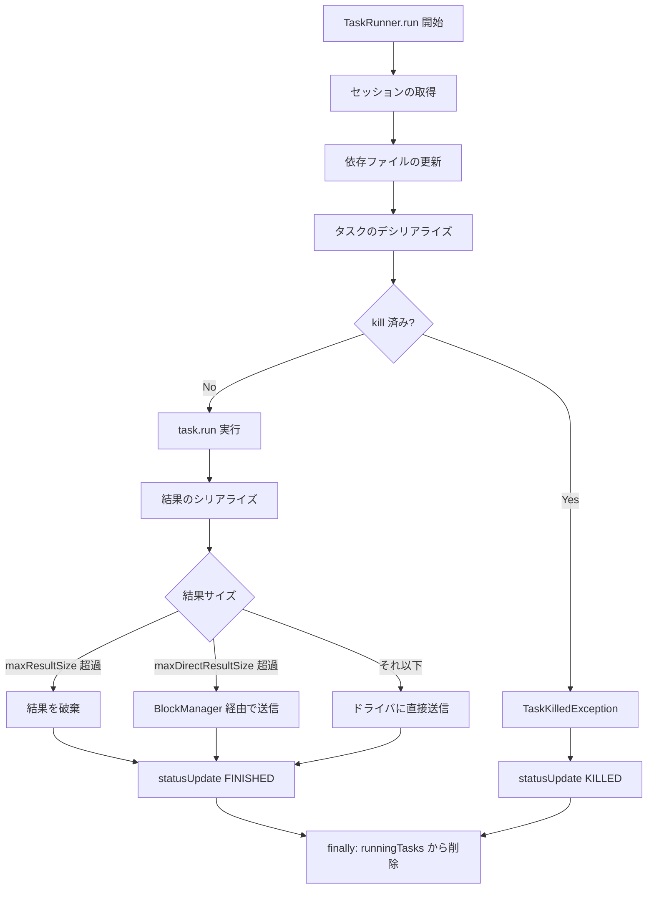

# 第9章 Executor: タスク実行エンジン

> 本章で読むソース
>
> - [`core/src/main/scala/org/apache/spark/executor/Executor.scala` L249-L313](https://github.com/apache/spark/blob/v4.1.2/core/src/main/scala/org/apache/spark/executor/Executor.scala#L249-L313)
> - [`core/src/main/scala/org/apache/spark/executor/Executor.scala` L547-L580](https://github.com/apache/spark/blob/v4.1.2/core/src/main/scala/org/apache/spark/executor/Executor.scala#L547-L580)
> - [`core/src/main/scala/org/apache/spark/executor/Executor.scala` L666-L727](https://github.com/apache/spark/blob/v4.1.2/core/src/main/scala/org/apache/spark/executor/Executor.scala#L666-L727)
> - [`core/src/main/scala/org/apache/spark/executor/Executor.scala` L785-L901](https://github.com/apache/spark/blob/v4.1.2/core/src/main/scala/org/apache/spark/executor/Executor.scala#L785-L901)
> - [`core/src/main/scala/org/apache/spark/executor/Executor.scala` L902-L1008](https://github.com/apache/spark/blob/v4.1.2/core/src/main/scala/org/apache/spark/executor/Executor.scala#L902-L1008)
> - [`core/src/main/scala/org/apache/spark/executor/Executor.scala` L1009-L1115](https://github.com/apache/spark/blob/v4.1.2/core/src/main/scala/org/apache/spark/executor/Executor.scala#L1009-L1115)
> - [`core/src/main/scala/org/apache/spark/executor/Executor.scala` L1211-L1303](https://github.com/apache/spark/blob/v4.1.2/core/src/main/scala/org/apache/spark/executor/Executor.scala#L1211-L1303)
> - [`core/src/main/scala/org/apache/spark/executor/Executor.scala` L1496-L1543](https://github.com/apache/spark/blob/v4.1.2/core/src/main/scala/org/apache/spark/executor/Executor.scala#L1496-L1543)
> - [`core/src/main/scala/org/apache/spark/executor/ExecutorBackend.scala` L27-L29](https://github.com/apache/spark/blob/v4.1.2/core/src/main/scala/org/apache/spark/executor/ExecutorBackend.scala#L27-L29)
> - [`core/src/main/scala/org/apache/spark/executor/CoarseGrainedExecutorBackend.scala` L48-L114](https://github.com/apache/spark/blob/v4.1.2/core/src/main/scala/org/apache/spark/executor/CoarseGrainedExecutorBackend.scala#L48-L114)
> - [`core/src/main/scala/org/apache/spark/executor/CoarseGrainedExecutorBackend.scala` L167-L228](https://github.com/apache/spark/blob/v4.1.2/core/src/main/scala/org/apache/spark/executor/CoarseGrainedExecutorBackend.scala#L167-L228)
> - [`core/src/main/scala/org/apache/spark/executor/CoarseGrainedExecutorBackend.scala` L267-L280](https://github.com/apache/spark/blob/v4.1.2/core/src/main/scala/org/apache/spark/executor/CoarseGrainedExecutorBackend.scala#L267-L280)

## この章の狙い

`Executor` はワーカーノード上で動作し、ドライバから送られてきたタスクをスレッドプールで並列実行するプロセスである。
本章では、`Executor` の起動からタスクの実行、結果の送信までの流れを追う。
`ExecutorBackend` がドライバとの通信をどう担うか、タスクの並列実行を支えるスレッドプールの設計、タスクの kill 機構も合わせて解説する。

## 前提

`TaskScheduler` はタスクをエグゼキュータに割り当てる（第7章、第8章）。
ドライバは `CoarseGrainedExecutorBackend` に対して RPC 経由で `LaunchTask` メッセージを送る。
エグゼキュータ側では `Executor` がタスクを実行し、結果を `ExecutorBackend` 経由でドライバに返す。

## 9.1 Executor の起動と初期化

`Executor` クラスはワーカーノード上で起動するJVMプロセスの本体である。
コンストラクタはエグゼキュータID、ホスト名、`SparkEnv`、ユーザーのクラスパス、リソース情報を受け取る。

[`core/src/main/scala/org/apache/spark/executor/Executor.scala` L249-L313](https://github.com/apache/spark/blob/v4.1.2/core/src/main/scala/org/apache/spark/executor/Executor.scala#L249-L313)

```scala
private[spark] class Executor(
    executorId: String,
    executorHostname: String,
    env: SparkEnv,
    userClassPath: Seq[URL] = Nil,
    isLocal: Boolean = false,
    uncaughtExceptionHandler: UncaughtExceptionHandler = new SparkUncaughtExceptionHandler,
    resources: immutable.Map[String, ResourceInformation])
  extends Logging {

  // ...

  // Start worker thread pool
  private[executor] val threadPool = {
    val threadFactory = new ThreadFactoryBuilder()
      .setDaemon(true)
      .setNameFormat(s"$TASK_THREAD_NAME_PREFIX-%d")
      .setThreadFactory((r: Runnable) => new UninterruptibleThread(r, "unused"))
      .build()
    Executors.newCachedThreadPool(threadFactory).asInstanceOf[ThreadPoolExecutor]
  }
  // ...
  private[executor] val runningTasks = new ConcurrentHashMap[Long, TaskRunner]
}
```

初期化では以下の処理が行われる。

1. `threadPool`（`CachedThreadPool`）の生成。タスクスレッドには `UninterruptibleThread` を使う。
2. `runningTasks`（`ConcurrentHashMap`）の生成。実行中タスクを `taskId` で管理する。
3. `BlockManager`、メトリクスソースの登録。
4. ハートビート送信スレッド（`heartbeater`）の開始。
5. 依存ファイルのダウンロード（`updateDependencies`）。
6. プラグインと `ShuffleManager` の初期化。

`UninterruptibleThread` を使う理由は、Kafka や Hadoop の一部APIが `Thread.interrupt()` で永久にハングする問題（KAFKA-1894, HADOOP-10622）を避けるためである。

## 9.2 ExecutorBackend: ドライバとの通信層

`ExecutorBackend` はエグゼキュータがドライバへ状態更新を送るためのプラグ可能なインターフェースである。

[`core/src/main/scala/org/apache/spark/executor/ExecutorBackend.scala` L27-L29](https://github.com/apache/spark/blob/v4.1.2/core/src/main/scala/org/apache/spark/executor/ExecutorBackend.scala#L27-L29)

```scala
private[spark] trait ExecutorBackend {
  def statusUpdate(taskId: Long, state: TaskState, data: ByteBuffer): Unit
}
```

メソッドは1つだけである。
タスクID、状態（`RUNNING`、`FINISHED`、`FAILED`、`KILLED`）、結果データを受け取り、ドライバへ送信する。

### 9.2.1 CoarseGrainedExecutorBackend

`CoarseGrainedExecutorBackend` は `ExecutorBackend` の主要な実装であり、RPC エンドポイントとして動作する。
Standalone、YARN、Kubernetes のクラスタモードで使われる。

[`core/src/main/scala/org/apache/spark/executor/CoarseGrainedExecutorBackend.scala` L48-L114](https://github.com/apache/spark/blob/v4.1.2/core/src/main/scala/org/apache/spark/executor/CoarseGrainedExecutorBackend.scala#L48-L114)

```scala
private[spark] class CoarseGrainedExecutorBackend(
    override val rpcEnv: RpcEnv,
    driverUrl: String,
    executorId: String,
    bindAddress: String,
    hostname: String,
    cores: Int,
    env: SparkEnv,
    resourcesFileOpt: Option[String],
    resourceProfile: ResourceProfile)
  extends IsolatedThreadSafeRpcEndpoint with ExecutorBackend with Logging {

  // ...

  override def onStart(): Unit = {
    // ...
    rpcEnv.asyncSetupEndpointRefByURI(driverUrl).flatMap { ref =>
      driver = Some(ref)
      env.executorBackend = Option(this)
      ref.ask[Boolean](RegisterExecutor(executorId, self, hostname, cores, extractLogUrls,
        extractAttributes, _resources, resourceProfile.id))
    }(ThreadUtils.sameThread).onComplete {
      case Success(_) =>
        self.send(RegisteredExecutor)
      case Failure(e) =>
        exitExecutor(1, s"Cannot register with driver: $driverUrl", e, notifyDriver = false)
    }(ThreadUtils.sameThread)
  }
}
```

起動フローは次の通りである。

1. `onStart()` でドライバのRPC参照を取得し、`RegisterExecutor` メッセージを送る。
2. 登録成功なら `RegisteredExecutor` を自身に送信し、`Executor` インスタンスを生成する。
3. 以降、ドライバからのメッセージを `receive` で処理する。

### 9.2.2 メッセージ処理

`receive` メソッドはドライバからのメッセージをパターンマッチで処理する。

[`core/src/main/scala/org/apache/spark/executor/CoarseGrainedExecutorBackend.scala` L167-L228](https://github.com/apache/spark/blob/v4.1.2/core/src/main/scala/org/apache/spark/executor/CoarseGrainedExecutorBackend.scala#L167-L228)

```scala
override def receive: PartialFunction[Any, Unit] = {
  case RegisteredExecutor =>
    logInfo("Successfully registered with driver")
    try {
      executor = new Executor(executorId, hostname, env, getUserClassPath, isLocal = false,
        resources = _resources)
      driver.get.send(LaunchedExecutor(executorId))
    } catch {
      case NonFatal(e) =>
        exitExecutor(1, "Unable to create executor due to " + e.getMessage, e)
    }

  case LaunchTask(data) =>
    if (executor == null) {
      exitExecutor(1, "Received LaunchTask command but executor was null")
    } else {
      val taskDesc = TaskDescription.decode(data.value)
      logInfo(log"Got assigned task ${MDC(LogKeys.TASK_ID, taskDesc.taskId)}")
      executor.launchTask(this, taskDesc)
    }

  case KillTask(taskId, _, interruptThread, reason) =>
    if (executor == null) {
      exitExecutor(1, "Received KillTask command but executor was null")
    } else {
      executor.killTask(taskId, interruptThread, reason)
    }

  case StopExecutor =>
    stopping.set(true)
    logInfo("Driver commanded a shutdown")
    self.send(Shutdown)
  // ...
}
```

`LaunchTask` を受け取ると、`TaskDescription` をデシリアライズして `executor.launchTask` を呼ぶ。
`KillTask` は `executor.killTask` に委譲する。

### 9.2.3 状態更新の送信

`statusUpdate` はタスクの状態変化をドライバに送る。

[`core/src/main/scala/org/apache/spark/executor/CoarseGrainedExecutorBackend.scala` L267-L280](https://github.com/apache/spark/blob/v4.1.2/core/src/main/scala/org/apache/spark/executor/CoarseGrainedExecutorBackend.scala#L267-L280)

```scala
override def statusUpdate(taskId: Long, state: TaskState, data: ByteBuffer): Unit = {
  val taskDescription = executor.runningTasks.get(taskId).taskDescription
  val resources = taskDescription.resources
  val cpus = taskDescription.cpus
  val msg = StatusUpdate(executorId, taskId, state, data, cpus, resources)
  if (TaskState.isFinished(state)) {
    lastTaskFinishTime.set(System.nanoTime())
  }
  driver match {
    case Some(driverRef) => driverRef.send(msg)
    case None =>
      logWarning(log"Drop ${MDC(LogKeys.MESSAGE, msg)} because has not yet connected to driver")
  }
}
```

完了状態の受信時には `lastTaskFinishTime` を更新する。
このタイムスタンプは decommission 時のシャットダウン判定に使う。

## 9.3 タスクのlaunchと実行

### 9.3.1 launchTask

`Executor.launchTask` はタスクをスレッドプールに投入する。

[`core/src/main/scala/org/apache/spark/executor/Executor.scala` L550-L580](https://github.com/apache/spark/blob/v4.1.2/core/src/main/scala/org/apache/spark/executor/Executor.scala#L550-L580)

```scala
def launchTask(context: ExecutorBackend, taskDescription: TaskDescription): Unit = {
  val taskId = taskDescription.taskId
  val tr = createTaskRunner(context, taskDescription)
  runningTasks.put(taskId, tr)
  val killMark = killMarks.get(taskId)
  if (killMark != null) {
    tr.kill(killMark._1, killMark._2)
    killMarks.remove(taskId)
  }
  try {
    threadPool.execute(tr)
  } catch {
    case t: Throwable =>
      try {
        logError(log"Executor launch task ${MDC(TASK_NAME, taskDescription.name)} failed," +
          log" reason: ${MDC(REASON, t.getMessage)}")
        context.statusUpdate(
          taskDescription.taskId,
          TaskState.FAILED,
          env.closureSerializer.newInstance().serialize(new ExceptionFailure(t, Seq.empty)))
      } catch {
        case t: Throwable =>
          logError(log"Executor update launching task ${MDC(TASK_NAME, taskDescription.name)} " +
            log"failed status failed, reason: ${MDC(REASON, t.getMessage)}")
          System.exit(-1)
      }
  }
}
```

処理の流れは以下の通りである。

1. `TaskRunner` を生成し、`runningTasks` に登録する。
2. `killMarks` に事前の kill 要求があれば、即座に kill を設定する。
3. `threadPool.execute(tr)` でタスクスレッドを起動する。
4. スレッドプールの投入に失敗した場合、`FAILED` 状態をドライバに報告する。

`killMarks` は `killTask` が `launchTask` より先に呼ばれた場合に、kill 要求を保持しておく仕組みである。

### 9.3.2 TaskRunner の生成

`TaskRunner` は `Runnable` を実装し、1つのタスクの実行を担う。

[`core/src/main/scala/org/apache/spark/executor/Executor.scala` L666-L727](https://github.com/apache/spark/blob/v4.1.2/core/src/main/scala/org/apache/spark/executor/Executor.scala#L666-L727)

```scala
class TaskRunner(
    execBackend: ExecutorBackend,
    val taskDescription: TaskDescription,
    private val plugins: Option[PluginContainer])
  extends Runnable {

  val taskId = taskDescription.taskId
  val taskName = taskDescription.name
  val threadName = s"$TASK_THREAD_NAME_PREFIX for $taskName"

  @volatile private var reasonIfKilled: Option[String] = None
  @volatile private var threadId: Long = -1
  @GuardedBy("TaskRunner.this")
  private var finished = false
  @volatile var task: Task[Any] = _

  def kill(interruptThread: Boolean, reason: String): Unit = {
    logInfo(log"Executor is trying to kill ${MDC(TASK_NAME, taskName)}, " +
      log"interruptThread: ${MDC(INTERRUPT_THREAD, interruptThread)}, " +
      log"reason: ${MDC(REASON, reason)}")
    reasonIfKilled = Some(reason)
    if (task != null) {
      synchronized {
        if (!finished) {
          task.kill(interruptThread, reason)
        }
      }
    }
  }
}
```

`TaskRunner` は以下の状態を持つ。

- `reasonIfKilled`: kill されていれば理由を保持。
- `finished`: タスクが完了したかどうか。
- `task`: デシリアライズ済みの `Task` オブジェクト。

`kill` メソッドは `reasonIfKilled` を設定し、`task` が存在すれば `task.kill` を呼ぶ。

## 9.4 タスク実行の詳細

`TaskRunner.run` はタスクの実際の执行処理を行う。
以下に処理の流れを示す。



### 9.4.1 セッションの取得と依存更新

[`core/src/main/scala/org/apache/spark/executor/Executor.scala` L785-L831](https://github.com/apache/spark/blob/v4.1.2/core/src/main/scala/org/apache/spark/executor/Executor.scala#L785-L831)

```scala
override def run(): Unit = {
  val isolatedSession = taskDescription.artifacts.state match {
    case Some(jobArtifactState) =>
      obtainSession(jobArtifactState)
    case _ =>
      defaultSessionState
  }

  // ...
  Thread.currentThread.setContextClassLoader(isolatedSession.replClassLoader)
  val ser = env.closureSerializer.newInstance()
  logInfo(log"Running ${MDC(TASK_NAME, taskName)}")
  execBackend.statusUpdate(taskId, TaskState.RUNNING, EMPTY_BYTE_BUFFER)
  // ...
  updateDependencies(
    taskDescription.artifacts.files,
    taskDescription.artifacts.jars,
    taskDescription.artifacts.archives,
    isolatedSession)
  task = ser.deserialize[Task[Any]](
    taskDescription.serializedTask, Thread.currentThread.getContextClassLoader)
  task.localProperties = taskDescription.properties
  task.setTaskMemoryManager(taskMemoryManager)
```

まずセッションを取得する。
Spark Connect の分離セッションなら `obtainSession` で LRU キャッシュから取得、デフォルトなら `defaultSessionState` を使う。
次に `RUNNING` 状態をドライバに通知し、依存ファイルを更新してからタスクをデシリアライズする。

### 9.4.2 タスクの実行と結果処理

[`core/src/main/scala/org/apache/spark/executor/Executor.scala` L856-L901](https://github.com/apache/spark/blob/v4.1.2/core/src/main/scala/org/apache/spark/executor/Executor.scala#L856-L901)

```scala
// Run the actual task and measure its runtime.
taskStartTimeNs = System.nanoTime()
taskStartCpu = if (threadMXBean.isCurrentThreadCpuTimeSupported) {
  threadMXBean.getCurrentThreadCpuTime
} else 0L
var threwException = true
val resources = taskDescription.resources.map { case (rName, addressesAmounts) =>
  rName -> new ResourceInformation(rName, addressesAmounts.keys.toSeq.sorted.toArray)
}
var value: Any = Utils.tryWithSafeFinally {
  val res = task.run(
    taskAttemptId = taskId,
    attemptNumber = taskDescription.attemptNumber,
    metricsSystem = env.metricsSystem,
    cpus = taskDescription.cpus,
    resources = resources,
    plugins = plugins)
  threwException = false
  res
} {
  val releasedLocks = env.blockManager.releaseAllLocksForTask(taskId)
  val freedMemory = taskMemoryManager.cleanUpAllMemory()
  // ...
}
```

`task.run` で実際のRDD演算を実行する。
`tryWithSafeFinally` でタスク完了後に `BlockManager` のロック解放と `TaskMemoryManager` のメモリ解放を確実に行う。

### 9.4.3 結果の送信

タスク結果はサイズに応じて3通りの方法で送信される。

[`core/src/main/scala/org/apache/spark/executor/Executor.scala` L980-L1008](https://github.com/apache/spark/blob/v4.1.2/core/src/main/scala/org/apache/spark/executor/Executor.scala#L980-L1008)

```scala
val serializedResult: ByteBuffer = {
  if (maxResultSize > 0 && resultSize > maxResultSize) {
    logWarning(log"Finished ${MDC(TASK_NAME, taskName)}. " +
      log"Result is larger than maxResultSize " +
      log"(${MDC(RESULT_SIZE_BYTES, Utils.bytesToString(resultSize))} > " +
      log"${MDC(RESULT_SIZE_BYTES_MAX, Utils.bytesToString(maxResultSize))}), " +
      log"dropping it.")
    ser.serialize(new IndirectTaskResult[Any](TaskResultBlockId(taskId), resultSize))
  } else if (resultSize > maxDirectResultSize) {
    val blockId = TaskResultBlockId(taskId)
    env.blockManager.putBytes(
      blockId,
      serializedDirectResult,
      StorageLevel.MEMORY_AND_DISK_SER)
    logInfo(log"Finished ${MDC(TASK_NAME, taskName)}." +
      log" ${MDC(NUM_BYTES, resultSize)} bytes result sent via BlockManager)")
    ser.serialize(new IndirectTaskResult[Any](blockId, resultSize))
  } else {
    logInfo(log"Finished ${MDC(TASK_NAME, taskName)}." +
      log" ${MDC(NUM_BYTES, resultSize)} bytes result sent to driver")
    serializedDirectResult.toByteBuffer
  }
}

executorSource.SUCCEEDED_TASKS.inc(1L)
setTaskFinishedAndClearInterruptStatus()
plugins.foreach(_.onTaskSucceeded())
execBackend.statusUpdate(taskId, TaskState.FINISHED, serializedResult)
```

- `maxResultSize` 超過: 結果を破棄し、`IndirectTaskResult` のみ送る。
- `maxDirectResultSize` 超過: `BlockManager` に保存し、`IndirectTaskResult` を送る。
- それ以下: 結果を直接ドライバに送る。

最後に `statusUpdate` で `FINISHED` 状態を通知する。

## 9.5 エラーハンドリングとタスク kill

### 9.5.1 例外処理

`TaskRunner.run` の catch 節は例外の種類に応じて処理を分ける。

[`core/src/main/scala/org/apache/spark/executor/Executor.scala` L1009-L1115](https://github.com/apache/spark/blob/v4.1.2/core/src/main/scala/org/apache/spark/executor/Executor.scala#L1009-L1115)

```scala
} catch {
  case t: TaskKilledException =>
    logInfo(log"Executor killed ${MDC(TASK_NAME, taskName)}, " +
      log"reason: ${MDC(REASON, t.reason)}")
    val (accums, accUpdates) = collectAccumulatorsAndResetStatusOnFailure(taskStartTimeNs)
    val metricPeaks = metricsPoller.getTaskMetricPeaks(taskId).toImmutableArraySeq
    val reason = TaskKilled(t.reason, accUpdates, accums, metricPeaks)
    plugins.foreach(_.onTaskFailed(reason))
    execBackend.statusUpdate(taskId, TaskState.KILLED, ser.serialize(reason))

  case t: Throwable if hasFetchFailure && !Executor.isFatalError(t, killOnFatalErrorDepth) =>
    val reason = task.context.fetchFailed.get.toTaskFailedReason
    // ...
    setTaskFinishedAndClearInterruptStatus()
    plugins.foreach(_.onTaskFailed(reason))
    execBackend.statusUpdate(taskId, TaskState.FAILED, ser.serialize(reason))

  case t: Throwable =>
    logError(log"Exception in ${MDC(TASK_NAME, taskName)}", t)
    if (!ShutdownHookManager.inShutdown()) {
      // ...
      execBackend.statusUpdate(taskId, TaskState.FAILED, serializedTaskFailureReason)
    }
    if (Executor.isFatalError(t, killOnFatalErrorDepth)) {
      uncaughtExceptionHandler.uncaughtException(Thread.currentThread(), t)
    }
}
```

- `TaskKilledException`: kill された場合。`KILLED` 状態を送信。
- `FetchFailedException` 含む: シャッフルフェッチ失敗。`FAILED` 状態を送信し、ドライバがステージを再実行する。
- 致命的エラー（`OutOfMemoryError` 等）: `uncaughtExceptionHandler` を呼んでエグゼキュータJVMを終了させる。

### 9.5.2 killTask と TaskReaper

`Executor.killTask` は実行中タスクを kill する。

```scala
def killTask(taskId: Long, interruptThread: Boolean, reason: String): Unit = {
  killMarks.put(taskId, (interruptThread, reason, System.currentTimeMillis()))
  val taskRunner = runningTasks.get(taskId)
  if (taskRunner != null) {
    if (taskReaperEnabled) {
      val maybeNewTaskReaper: Option[TaskReaper] = taskReaperForTask.synchronized {
        val shouldCreateReaper = taskReaperForTask.get(taskId) match {
          case None => true
          case Some(existingReaper) => interruptThread && !existingReaper.interruptThread
        }
        if (shouldCreateReaper) {
          val taskReaper = new TaskReaper(
            taskRunner, interruptThread = interruptThread, reason = reason)
          taskReaperForTask(taskId) = taskReaper
          Some(taskReaper)
        } else {
          None
        }
      }
      maybeNewTaskReaper.foreach(taskReaperPool.execute)
    } else {
      taskRunner.kill(interruptThread = interruptThread, reason = reason)
    }
    killMarks.remove(taskId)
  }
}
```

`taskReaperEnabled` が有効な場合、`TaskReaper` を生成して監視スレッドプールで実行する。
`TaskReaper` はタスクが完了するまで定期的に監視し、タイムアウト超過ならJVMを終了させる。

### 9.5.3 TaskReaper の監視ループ

[`core/src/main/scala/org/apache/spark/executor/Executor.scala` L1211-L1303](https://github.com/apache/spark/blob/v4.1.2/core/src/main/scala/org/apache/spark/executor/Executor.scala#L1211-L1303)

```scala
private class TaskReaper(
    taskRunner: TaskRunner,
    val interruptThread: Boolean,
    val reason: String)
  extends Runnable {

  private[this] val killPollingIntervalMs: Long = conf.get(TASK_REAPER_POLLING_INTERVAL)
  private[this] val killTimeoutNs: Long = {
    TimeUnit.MILLISECONDS.toNanos(conf.get(TASK_REAPER_KILL_TIMEOUT))
  }

  override def run(): Unit = {
    // ...
    try {
      taskRunner.kill(interruptThread = interruptThread, reason = reason)
      var finished: Boolean = false
      while (!finished && !timeoutExceeded()) {
        taskRunner.synchronized {
          if (taskRunner.isFinished) {
            finished = true
          } else {
            taskRunner.wait(killPollingIntervalMs)
          }
        }
        // ...
      }
      if (!taskRunner.isFinished && timeoutExceeded()) {
        if (isLocal) {
          logError(log"Killed task ${MDC(TASK_ID, taskId)} could not be stopped within " +
            log"${MDC(TIMEOUT, killTimeoutMs)} ms; " +
            log"not killing JVM because we are running in local mode.")
        } else {
          throw new KilledByTaskReaperException(s"Killing executor JVM because killed task " +
            s"$taskId could not be stopped within $killTimeoutMs ms.")
        }
      }
    } finally {
      // ...
    }
  }
}
```

`TaskReaper` は以下の動作をする。

1. `taskRunner.kill` を1度だけ呼ぶ。
2. `killPollingIntervalMs` ごとにタスクの完了をチェックする。
3. `killTimeoutNs` を超えても完了しなければ、JVM を強制終了する。

この仕組みにより、応答しないタスクがリソースを占有し続ける問題を防止する。

## 9.6 ハートビートとメトリクス

エグゼキュータは定期的にドライバへハートビートを送信し、生存性とタスクの進捗を通知する。

[`core/src/main/scala/org/apache/spark/executor/Executor.scala` L1496-L1543](https://github.com/apache/spark/blob/v4.1.2/core/src/main/scala/org/apache/spark/executor/Executor.scala#L1496-L1543)

```scala
private def reportHeartBeat(): Unit = {
  val accumUpdates = new ArrayBuffer[(Long, Seq[AccumulatorV2[_, _]])]()
  val curGCTime = computeTotalGcTime()

  if (pollOnHeartbeat) {
    metricsPoller.poll()
  }

  val executorUpdates = metricsPoller.getExecutorUpdates()

  for (taskRunner <- runningTasks.values().asScala) {
    if (taskRunner.task != null) {
      taskRunner.task.metrics.mergeShuffleReadMetrics()
      taskRunner.task.metrics.setJvmGCTime(curGCTime - taskRunner.startGCTime)
      val accumulatorsToReport = {
        if (HEARTBEAT_DROP_ZEROES) {
          taskRunner.task.metrics.accumulators().filterNot(_.isZero)
        } else {
          taskRunner.task.metrics.accumulators()
        }
      }.filterNot(_.excludeFromHeartbeat)
      accumUpdates += ((taskRunner.taskId, accumulatorsToReport))
    }
  }

  val message = Heartbeat(executorId, accumUpdates.toArray, env.blockManager.blockManagerId,
    executorUpdates)
  try {
    val response = heartbeatReceiverRef.askSync[HeartbeatResponse](
      message, new RpcTimeout(HEARTBEAT_INTERVAL_MS.millis, EXECUTOR_HEARTBEAT_INTERVAL.key))
    if (!executorShutdown.get && response.reregisterBlockManager) {
      logInfo("Told to re-register on heartbeat")
      env.blockManager.reregister()
    }
    heartbeatFailures = 0
  } catch {
    case NonFatal(e) =>
      logWarning("Issue communicating with driver in heartbeater", e)
      heartbeatFailures += 1
      if (heartbeatFailures >= HEARTBEAT_MAX_FAILURES) {
        logError(log"Exit as unable to send heartbeats to driver " +
          log"more than ${MDC(MAX_ATTEMPTS, HEARTBEAT_MAX_FAILURES)} times")
        System.exit(ExecutorExitCode.HEARTBEAT_FAILURE)
      }
  }
}
```

ハートビートでは以下を送信する。

- 実行中タスクのアクセキューレータ更新。
- `BlockManager` のID。
- エグゼキュータのメトリクス更新。

`HEARTBEAT_MAX_FAILURES` 回連続で失敗すると、エグゼキュータは自身を終了させる。
これはネットワーク障害でドライバと通信できない状態が継続する場合のフェイルセーフである。

## 9.7 高速化の工夫: スレッドプールによるタスク並列実行

`Executor` の高速化の核心は `CachedThreadPool` によるタスクの並列実行である。

[`core/src/main/scala/org/apache/spark/executor/Executor.scala` L306-L313](https://github.com/apache/spark/blob/v4.1.2/core/src/main/scala/org/apache/spark/executor/Executor.scala#L306-L313)

```scala
private[executor] val threadPool = {
  val threadFactory = new ThreadFactoryBuilder()
    .setDaemon(true)
    .setNameFormat(s"$TASK_THREAD_NAME_PREFIX-%d")
    .setThreadFactory((r: Runnable) => new UninterruptibleThread(r, "unused"))
    .build()
  Executors.newCachedThreadPool(threadFactory).asInstanceOf[ThreadPoolExecutor]
}
```

`CachedThreadPool` は必要に応じてスレッドを動的に生成し、アイドル状態のスレッドを再利用する。
これにより、タスクのlaunchオーバーヘッドを最小化しつつ、CPU コア数に応じた並列度を実現する。

なぜ速いのか: `CachedThreadPool` はタスク到着時に既存スレッドを即座に再利用し、なければ新規生成するため、キューイング遅延が発生しない。

加えて、`UninterruptibleThread` を使うことで、外部ライブラリが `Thread.interrupt()` に反応してハングする問題を回避し、タスクの安定した実行を保証する。

## まとめ

本章では `Executor` の全体像を追った。

- `Executor` は `CachedThreadPool` でタスクを並列実行する。
- `ExecutorBackend` 経由でドライバと通信し、タスク状態を更新する。
- `CoarseGrainedExecutorBackend` は RPC エンドポイントとして `LaunchTask`、`KillTask` を処理する。
- タスク結果はサイズに応じて直接送信、`BlockManager` 経由、破棄の3通りがある。
- `TaskReaper` は kill されたタスクを監視し、タイムアウトでJVMを終了させる。
- ハートビートは生存性とメトリクスをドライバに通知する。

## 関連する章

- 第7章: TaskScheduler（タスクのスケジューリング）
- 第8章: TaskSetManager（タスクセットの管理）
- 第10章: Shuffle（シャッフルの仕組み）
