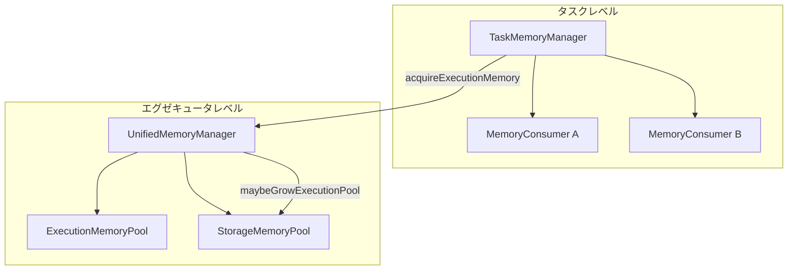

# 第10章 タスクのメモリ管理と GC

> 本章で読むソース
>
> - [`core/src/main/java/org/apache/spark/memory/TaskMemoryManager.java` L56-L151](https://github.com/apache/spark/blob/v4.1.2/core/src/main/java/org/apache/spark/memory/TaskMemoryManager.java#L56-L151)
> - [`core/src/main/java/org/apache/spark/memory/TaskMemoryManager.java` L159-L237](https://github.com/apache/spark/blob/v4.1.2/core/src/main/java/org/apache/spark/memory/TaskMemoryManager.java#L159-L237)
> - [`core/src/main/java/org/apache/spark/memory/TaskMemoryManager.java` L367-L437](https://github.com/apache/spark/blob/v4.1.2/core/src/main/java/org/apache/spark/memory/TaskMemoryManager.java#L367-L437)
> - [`core/src/main/java/org/apache/spark/memory/TaskMemoryManager.java` L449-L508](https://github.com/apache/spark/blob/v4.1.2/core/src/main/java/org/apache/spark/memory/TaskMemoryManager.java#L449-L508)
> - [`core/src/main/java/org/apache/spark/memory/TaskMemoryManager.java` L514-L572](https://github.com/apache/spark/blob/v4.1.2/core/src/main/java/org/apache/spark/memory/TaskMemoryManager.java#L514-L572)
> - [`core/src/main/java/org/apache/spark/memory/MemoryConsumer.java` L31-L83](https://github.com/apache/spark/blob/v4.1.2/core/src/main/java/org/apache/spark/memory/MemoryConsumer.java#L31-L83)
> - [`core/src/main/java/org/apache/spark/memory/MemoryConsumer.java` L94-L159](https://github.com/apache/spark/blob/v4.1.2/core/src/main/java/org/apache/spark/memory/MemoryConsumer.java#L94-L159)
> - [`core/src/main/scala/org/apache/spark/memory/MemoryManager.scala` L39-L67](https://github.com/apache/spark/blob/v4.1.2/core/src/main/scala/org/apache/spark/memory/MemoryManager.scala#L39-L67)
> - [`core/src/main/scala/org/apache/spark/memory/MemoryManager.scala` L222-L282](https://github.com/apache/spark/blob/v4.1.2/core/src/main/scala/org/apache/spark/memory/MemoryManager.scala#L222-L282)
> - [`core/src/main/scala/org/apache/spark/memory/UnifiedMemoryManager.scala` L58-L113](https://github.com/apache/spark/blob/v4.1.2/core/src/main/scala/org/apache/spark/memory/UnifiedMemoryManager.scala#L58-L113)
> - [`core/src/main/scala/org/apache/spark/memory/UnifiedMemoryManager.scala` L134-L204](https://github.com/apache/spark/blob/v4.1.2/core/src/main/scala/org/apache/spark/memory/UnifiedMemoryManager.scala#L134-L204)
> - [`core/src/main/scala/org/apache/spark/memory/ExecutionMemoryPool.scala` L43-L149](https://github.com/apache/spark/blob/v4.1.2/core/src/main/scala/org/apache/spark/memory/ExecutionMemoryPool.scala#L43-L149)

## この章の狙い

タスクが実行中に使うメモリは、JVMのヒープを直接操作するのではなく、`TaskMemoryManager` を通じて割り当てられる。
本章では、`TaskMemoryManager` がタスクのメモリ要求をどうさばくか、メモリ不足時に`MemoryConsumer` のスピルをどう制御するかを追う。
さらに`MemoryManager`、`UnifiedMemoryManager`、`ExecutionMemoryPool` の3層構造を解説し、タスク間のメモリ公平分配の仕組みを明らかにする。

## 前提

`Executor` はタスクをlaunchする際に `TaskMemoryManager` を生成し、`Task` に設定する（第9章）。
`TaskMemoryManager` は `MemoryManager` を介してエグゼキュータ全体のメモリプールから割り当てを受ける。
`MemoryManager` の既定実装は `UnifiedMemoryManager` であり、実行用とストレージ用のメモリを動的に共有する。

## 10.1 TaskMemoryManager の役割とページテーブル

`TaskMemoryManager` は1つのタスクが使うメモリを管理する。
オフヒープモードでは64ビットのアドレスをそのまま使えるが、オンヒープモードではオブジェクト参照とオフセットの組み合わせが必要になる。
GCでオブジェクトが移動すると参照が変わるため、ポインタを直接保存できない。
`TaskMemoryManager` はこの問題を、ページ番号とオフセットを64ビットのlongにエンコードする方式で解決する。

[`core/src/main/java/org/apache/spark/memory/TaskMemoryManager.java` L56-L96](https://github.com/apache/spark/blob/v4.1.2/core/src/main/java/org/apache/spark/memory/TaskMemoryManager.java#L56-L96)

```java
public class TaskMemoryManager {

  private static final SparkLogger logger = SparkLoggerFactory.getLogger(TaskMemoryManager.class);

  /** The number of bits used to address the page table. */
  private static final int PAGE_NUMBER_BITS = 13;

  /** The number of bits used to encode offsets in data pages. */
  @VisibleForTesting
  static final int OFFSET_BITS = 64 - PAGE_NUMBER_BITS;  // 51

  /** The number of entries in the page table. */
  private static final int PAGE_TABLE_SIZE = 1 << PAGE_NUMBER_BITS;

  /**
   * Maximum supported data page size (in bytes). In principle, the maximum addressable page size is
   * (1L &lt;&lt; OFFSET_BITS) bytes, which is 2+ petabytes. However, the on-heap allocator's
   * maximum page size is limited by the maximum amount of data that can be stored in a long[]
   * array, which is (2^31 - 1) * 8 bytes (or about 17 gigabytes). Therefore, we cap this at 17
   * gigabytes.
   */
  public static final long MAXIMUM_PAGE_SIZE_BYTES = ((1L << 31) - 1) * 8L;

  /** Bit mask for the lower 51 bits of a long. */
  private static final long MASK_LONG_LOWER_51_BITS = 0x7FFFFFFFFFFFFL;

  /**
   * Similar to an operating system's page table, this array maps page numbers into base object
   * pointers, allowing us to translate between the hashtable's internal 64-bit address
   * representation and the baseObject+offset representation which we use to support both on- and
   * off-heap addresses. When using an off-heap allocator, every entry in this map will be `null`.
   * When using an on-heap allocator, the entries in this map will point to pages' base objects.
   * Entries are added to this map as new data pages are allocated.
   */
  private final MemoryBlock[] pageTable = new MemoryBlock[PAGE_TABLE_SIZE];

  /**
   * Bitmap for tracking free pages.
   */
  private final BitSet allocatedPages = new BitSet(PAGE_TABLE_SIZE);

  private final MemoryManager memoryManager;

  private final long taskAttemptId;

  final MemoryMode tungstenMemoryMode;

  @GuardedBy("this")
  private final HashSet<MemoryConsumer> consumers;
  // ...
}
```

上位13ビットがページ番号、下位51ビットがページ内オフセットである。
ページテーブルは8192エントリ（`1 << 13`）の配列であり、各エントリが `MemoryBlock` を指す。
オンヒープモードでは `MemoryBlock` の `baseObject`（`long[]` 配列）をページテーブルから取得し、オフセットと組み合わせてアクセスする。

なぜ速いのか: ポインタを64ビットのlong値に圧縮することで、ハッシュマップやソートバッファ内のポインタ追跡を1ワードで完結させ、GCの移動影響をページテーブルの参照1回に集約している。

## 10.2 メモリの割り当てとスピル

### 10.2.1 acquireExecutionMemory

`TaskMemoryManager.acquireExecutionMemory` は、`MemoryConsumer` からのメモリ要求を受け取る入口である。

[`core/src/main/java/org/apache/spark/memory/TaskMemoryManager.java` L159-L237](https://github.com/apache/spark/blob/v4.1.2/core/src/main/java/org/apache/spark/memory/TaskMemoryManager.java#L159-L237)

```java
public long acquireExecutionMemory(long required, MemoryConsumer requestingConsumer) {
  assert(required >= 0);
  assert(requestingConsumer != null);
  MemoryMode mode = requestingConsumer.getMode();
  synchronized (this) {
    long got = memoryManager.acquireExecutionMemory(required, taskAttemptId, mode);

    if (got < required) {
      // ...
      TreeMap<Long, List<MemoryConsumer>> sortedConsumers = new TreeMap<>();
      for (MemoryConsumer c: consumers) {
        if (c.getUsed() > 0 && c.getMode() == mode) {
          long key = c == requestingConsumer ? 0 : c.getUsed();
          List<MemoryConsumer> list =
              sortedConsumers.computeIfAbsent(key, k -> new ArrayList<>(1));
          list.add(c);
        }
      }
      while (got < required && !sortedConsumers.isEmpty()) {
        Map.Entry<Long, List<MemoryConsumer>> currentEntry =
          sortedConsumers.ceilingEntry(required - got);
        if (currentEntry == null) {
          currentEntry = sortedConsumers.lastEntry();
        }
        List<MemoryConsumer> cList = currentEntry.getValue();
        got += trySpillAndAcquire(requestingConsumer, required - got, cList, cList.size() - 1);
        if (cList.isEmpty()) {
          sortedConsumers.remove(currentEntry.getKey());
        }
      }
    }
    // ...
    return got;
  }
}
```

処理の流れは以下の通りである。

1. まず `memoryManager.acquireExecutionMemory` でプールから直接取得を試みる。
2. 不足分があれば、他の `MemoryConsumer` を使用量の小さい順に並べた `TreeMap` を作る。
3. 要求者自身はキーを0にして最優先順位を下げる（自分からスピルしない）。
4. `ceilingEntry` で不足分以上のメモリを持つ最小のコンシューマを選び、`trySpillAndAcquire` を呼ぶ。
5. 該当コンシューマがいなければ最大使用量のコンシューマからスピルさせる。

このヒューリスティックは、スピル回数を減らしつつ必要以上のデータをディスクに書き出さないバランスを取る。

### 10.2.2 trySpillAndAcquire

`trySpillAndAcquire` は選択されたコンシューマにスピルを要求し、解放されたメモリを再取得する。

[`core/src/main/java/org/apache/spark/memory/TaskMemoryManager.java` L249-L296](https://github.com/apache/spark/blob/v4.1.2/core/src/main/java/org/apache/spark/memory/TaskMemoryManager.java#L249-L296)

```java
private long trySpillAndAcquire(
    MemoryConsumer requestingConsumer,
    long requested,
    List<MemoryConsumer> cList,
    int idx) {
  MemoryMode mode = requestingConsumer.getMode();
  MemoryConsumer consumerToSpill = cList.get(idx);
  // ...
  try {
    long released = consumerToSpill.spill(requested, requestingConsumer);
    if (released > 0) {
      return memoryManager.acquireExecutionMemory(requested, taskAttemptId, mode);
    } else {
      cList.remove(idx);
      return 0;
    }
  } catch (ClosedByInterruptException | InterruptedIOException e) {
    throw new RuntimeException(e.getMessage());
  } catch (IOException e) {
    throw new SparkOutOfMemoryError("SPILL_OUT_OF_MEMORY", ...);
  }
}
```

スピルが0バイトを返した場合、そのコンシューマはこれ以上解放できないと判断してリストから除去する。
`IOException` はディスク書き込みの失敗を意味し、`SparkOutOfMemoryError` に変換してタスクを失敗させる。

## 10.3 ページの割り当てとアドレスエンコーディング

### 10.3.1 allocatePage と freePage

`allocatePage` は `MemoryConsumer` に大きなメモリブロック（ページ）を割り当てる。

[`core/src/main/java/org/apache/spark/memory/TaskMemoryManager.java` L367-L410](https://github.com/apache/spark/blob/v4.1.2/core/src/main/java/org/apache/spark/memory/TaskMemoryManager.java#L367-L410)

```java
public MemoryBlock allocatePage(long size, MemoryConsumer consumer) {
  assert(consumer != null);
  assert(consumer.getMode() == tungstenMemoryMode);
  if (size > MAXIMUM_PAGE_SIZE_BYTES) {
    throw new TooLargePageException(size);
  }

  long acquired = acquireExecutionMemory(size, consumer);
  if (acquired <= 0) {
    return null;
  }

  final int pageNumber;
  synchronized (this) {
    pageNumber = allocatedPages.nextClearBit(0);
    if (pageNumber >= PAGE_TABLE_SIZE) {
      releaseExecutionMemory(acquired, consumer);
      throw new IllegalStateException(
        "Have already allocated a maximum of " + PAGE_TABLE_SIZE + " pages");
    }
    allocatedPages.set(pageNumber);
  }
  MemoryBlock page = null;
  try {
    page = memoryManager.tungstenMemoryAllocator().allocate(acquired);
  } catch (OutOfMemoryError e) {
    synchronized (this) {
      acquiredButNotUsed += acquired;
      allocatedPages.clear(pageNumber);
    }
    return allocatePage(size, consumer);
  }
  page.pageNumber = pageNumber;
  pageTable[pageNumber] = page;
  return page;
}
```

`BitSet` で空きページ番号を管理し、`nextClearBit` で最初の空きスロットを探す。
アロケータが `OutOfMemoryError` を投げた場合、取得済みメモリを `acquiredButNotUsed` に保持してページ番号を戻し、再帰的に `allocatePage` を呼ぶ。
再帰呼び出しで他のコンシューマのスピルが走り、実際に使えるメモリが確保できる可能性がある。

`freePage` はページを解放し、ページテーブルと `BitSet` を更新する。

[`core/src/main/java/org/apache/spark/memory/TaskMemoryManager.java` L415-L437](https://github.com/apache/spark/blob/v4.1.2/core/src/main/java/org/apache/spark/memory/TaskMemoryManager.java#L415-L437)

```java
public void freePage(MemoryBlock page, MemoryConsumer consumer) {
  // ...
  pageTable[page.pageNumber] = null;
  synchronized (this) {
    allocatedPages.clear(page.pageNumber);
  }
  long pageSize = page.size();
  page.pageNumber = MemoryBlock.FREED_IN_TMM_PAGE_NUMBER;
  memoryManager.tungstenMemoryAllocator().free(page);
  releaseExecutionMemory(pageSize, consumer);
}
```

ページ番号を `FREED_IN_TMM_PAGE_NUMBER` に書き換えることで、`TaskMemoryManager` を経由せずに直接 `free` が呼ばれた場合に検出できる。

### 10.3.2 ページアドレスのエンコードとデコード

オンヒープモードでは、ページの `baseObject` への参照はGCで移動する可能性がある。
`encodePageNumberAndOffset` はページ番号とオフセットを1つのlong値にパックする。

[`core/src/main/java/org/apache/spark/memory/TaskMemoryManager.java` L449-L508](https://github.com/apache/spark/blob/v4.1.2/core/src/main/java/org/apache/spark/memory/TaskMemoryManager.java#L449-L508)

```java
public long encodePageNumberAndOffset(MemoryBlock page, long offsetInPage) {
  if (tungstenMemoryMode == MemoryMode.OFF_HEAP) {
    offsetInPage -= page.getBaseOffset();
  }
  return encodePageNumberAndOffset(page.pageNumber, offsetInPage);
}

@VisibleForTesting
public static long encodePageNumberAndOffset(int pageNumber, long offsetInPage) {
  assert (pageNumber >= 0) : "encodePageNumberAndOffset called with invalid page";
  return (((long) pageNumber) << OFFSET_BITS) | (offsetInPage & MASK_LONG_LOWER_51_BITS);
}

public Object getPage(long pagePlusOffsetAddress) {
  if (tungstenMemoryMode == MemoryMode.ON_HEAP) {
    final int pageNumber = decodePageNumber(pagePlusOffsetAddress);
    final MemoryBlock page = pageTable[pageNumber];
    return page.getBaseObject();
  } else {
    return null;
  }
}

public long getOffsetInPage(long pagePlusOffsetAddress) {
  final long offsetInPage = decodeOffset(pagePlusOffsetAddress);
  if (tungstenMemoryMode == MemoryMode.ON_HEAP) {
    return offsetInPage;
  } else {
    final int pageNumber = decodePageNumber(pagePlusOffsetAddress);
    final MemoryBlock page = pageTable[pageNumber];
    return page.getBaseOffset() + offsetInPage;
  }
}
```

`getPage` でベースオブジェクトを取り出し、`getOffsetInPage` で実アドレスを得る。
オフヒープモードではベースオブジェクトが不要なため `getPage` は `null` を返し、`getOffsetInPage` は `baseOffset` を加算して絶対アドレスを返す。

## 10.4 MemoryConsumer: メモリを使う側

`MemoryConsumer` は `TaskMemoryManager` からメモリを得る抽象クラスである。
`ExternalSorter`、`UnsafeFixedWidthAggregationMap`、`UnsafeKVExternalSorter` などが実装する。

[`core/src/main/java/org/apache/spark/memory/MemoryConsumer.java` L31-L83](https://github.com/apache/spark/blob/v4.1.2/core/src/main/java/org/apache/spark/memory/MemoryConsumer.java#L31-L83)

```java
public abstract class MemoryConsumer {

  protected final TaskMemoryManager taskMemoryManager;
  private final long pageSize;
  private final MemoryMode mode;
  protected long used;

  protected MemoryConsumer(TaskMemoryManager taskMemoryManager, long pageSize, MemoryMode mode) {
    this.taskMemoryManager = taskMemoryManager;
    this.pageSize = pageSize;
    this.mode = mode;
  }

  public long getUsed() {
    return used;
  }

  public abstract long spill(long size, MemoryConsumer trigger) throws IOException;

  // ...
}
```

`used` フィールドが現在使用量を追跡する。
`spill` メソッドは抽象メソッドであり、サブクラスがディスクへの書き出しを実装する。
`TaskMemoryManager` はメモリ不足時にこの `spill` を呼び出す。

### 10.4.1 メモリの割り当てと解放

[`core/src/main/java/org/apache/spark/memory/MemoryConsumer.java` L94-L159](https://github.com/apache/spark/blob/v4.1.2/core/src/main/java/org/apache/spark/memory/MemoryConsumer.java#L94-L159)

```java
public LongArray allocateArray(long size) {
  long required = size * 8L;
  MemoryBlock page = taskMemoryManager.allocatePage(required, this);
  if (page == null || page.size() < required) {
    throwOom(page, required);
  }
  used += required;
  return new LongArray(page);
}

protected MemoryBlock allocatePage(long required) {
  MemoryBlock page = taskMemoryManager.allocatePage(Math.max(pageSize, required), this);
  if (page == null || page.size() < required) {
    throwOom(page, required);
  }
  used += page.size();
  return page;
}

protected void freePage(MemoryBlock page) {
  used -= page.size();
  taskMemoryManager.freePage(page, this);
}

public long acquireMemory(long size) {
  long granted = taskMemoryManager.acquireExecutionMemory(size, this);
  used += granted;
  return granted;
}

public void freeMemory(long size) {
  taskMemoryManager.releaseExecutionMemory(size, this);
  used -= size;
}
```

`allocateArray` は `LongArray`（long値の配列）を割り当てる。
`allocatePage` は `pageSize` と要求サイズの大きいほうを要求し、アロケータに渡す。
`throwOom` は使用状況のダンプを出してから `SparkOutOfMemoryError` を投げる。

## 10.5 MemoryManager の3層構造

メモリの管理は3層で構成される。



- **タスクレベル**: `TaskMemoryManager` がページテーブルを管理し、`MemoryConsumer` ごとにメモリを配分する。
- **エグゼキュータレベル**: `MemoryManager`（`UnifiedMemoryManager`）が実行用とストレージ用のプールを管理する。
- **プールレベル**: `ExecutionMemoryPool` がタスク間の公平分配を `wait`/`notifyAll` で制御する。

### 10.5.1 MemoryManager の基本構造

[`core/src/main/scala/org/apache/spark/memory/MemoryManager.scala` L39-L67](https://github.com/apache/spark/blob/v4.1.2/core/src/main/scala/org/apache/spark/memory/MemoryManager.scala#L39-L67)

```scala
private[spark] abstract class MemoryManager(
    conf: SparkConf,
    numCores: Int,
    onHeapStorageMemory: Long,
    onHeapExecutionMemory: Long) extends Logging {

  @GuardedBy("this")
  protected val onHeapStorageMemoryPool = new StorageMemoryPool(this, MemoryMode.ON_HEAP)
  @GuardedBy("this")
  protected val offHeapStorageMemoryPool = new StorageMemoryPool(this, MemoryMode.OFF_HEAP)
  @GuardedBy("this")
  protected val onHeapExecutionMemoryPool = new ExecutionMemoryPool(this, MemoryMode.ON_HEAP)
  @GuardedBy("this")
  protected val offHeapExecutionMemoryPool = new ExecutionMemoryPool(this, MemoryMode.OFF_HEAP)

  onHeapStorageMemoryPool.incrementPoolSize(onHeapStorageMemory)
  onHeapExecutionMemoryPool.incrementPoolSize(onHeapExecutionMemory)
  // ...
}
```

オンヒープ用とオフヒープ用に、それぞれストレージプールと実行用プールを持つ。
初期サイズはコンストラクタで渡されるが、`UnifiedMemoryManager` では動的にサイズが変化する。

### 10.5.2 Tungsten のメモリモードとアロケータ

[`core/src/main/scala/org/apache/spark/memory/MemoryManager.scala` L228-L282](https://github.com/apache/spark/blob/v4.1.2/core/src/main/scala/org/apache/spark/memory/MemoryManager.scala#L228-L282)

```scala
final val tungstenMemoryMode: MemoryMode = {
  if (conf.get(MEMORY_OFFHEAP_ENABLED)) {
    require(conf.get(MEMORY_OFFHEAP_SIZE) > 0,
      "spark.memory.offHeap.size must be > 0 when spark.memory.offHeap.enabled == true")
    require(Platform.unaligned(),
      "No support for unaligned Unsafe. Set spark.memory.offHeap.enabled to false.")
    MemoryMode.OFF_HEAP
  } else {
    MemoryMode.ON_HEAP
  }
}

private[memory] final val tungstenMemoryAllocator: MemoryAllocator = {
  tungstenMemoryMode match {
    case MemoryMode.ON_HEAP => MemoryAllocator.HEAP
    case MemoryMode.OFF_HEAP => MemoryAllocator.UNSAFE
  }
}
```

オフヒープが有効なら `sun.misc.Unsafe` で直接メモリを割り当てる。
無効ならJVMヒープ上の `long[]` 配列を使う。
ページサイズの既定値は利用可能なメモリとコア数から自動計算される。
G1GC、ZGC、ShenandoahGC ではヒープ領域サイズに合わせてページサイズを調整する。

## 10.6 UnifiedMemoryManager: 実行とストレージの動的共有

`UnifiedMemoryManager` は実行用メモリとストレージ用メモリの境界を柔らかく管理する。

[`core/src/main/scala/org/apache/spark/memory/UnifiedMemoryManager.scala` L58-L67](https://github.com/apache/spark/blob/v4.1.2/core/src/main/scala/org/apache/spark/memory/UnifiedMemoryManager.scala#L58-L67)

```scala
private[spark] class UnifiedMemoryManager(
    conf: SparkConf,
    val maxHeapMemory: Long,
    onHeapStorageRegionSize: Long,
    numCores: Int)
  extends MemoryManager(
    conf,
    numCores,
    onHeapStorageRegionSize,
    maxHeapMemory - onHeapStorageRegionSize) with Logging {
  // ...
}
```

`maxHeapMemory` は `(systemMemory - reservedMemory) * memoryFraction` で計算される。
`reservedMemory` は300MB、`memoryFraction` の既定値は0.6である。
`onHeapStorageRegionSize` は `maxHeapMemory * storageFraction`（既定0.5）で、ストレージ側の初期サイズになる。
実行用の初期サイズは `maxHeapMemory - onHeapStorageRegionSize` であり、残り全体を実行が使う。

### 10.6.1 実行メモリの取得とプールの拡張

[`core/src/main/scala/org/apache/spark/memory/UnifiedMemoryManager.scala` L134-L204](https://github.com/apache/spark/blob/v4.1.2/core/src/main/scala/org/apache/spark/memory/UnifiedMemoryManager.scala#L134-L204)

```scala
override private[memory] def acquireExecutionMemory(
    numBytes: Long,
    taskAttemptId: Long,
    memoryMode: MemoryMode): Long = synchronized {
  // ...
  val (executionPool, storagePool, storageRegionSize, maxMemory) = memoryMode match {
    case MemoryMode.ON_HEAP => (
      onHeapExecutionMemoryPool, onHeapStorageMemoryPool,
      onHeapStorageRegionSize, maxHeapMemory)
    case MemoryMode.OFF_HEAP => (
      offHeapExecutionMemoryPool, offHeapStorageMemoryPool,
      offHeapStorageMemory, maxOffHeapMemory)
  }

  def maybeGrowExecutionPool(extraMemoryNeeded: Long): Unit = {
    if (extraMemoryNeeded > 0) {
      val memoryReclaimableFromStorage = math.max(
        storagePool.memoryFree,
        storagePool.poolSize - storageRegionSize)
      if (memoryReclaimableFromStorage > 0) {
        val spaceToReclaim = storagePool.freeSpaceToShrinkPool(
          math.min(extraMemoryNeeded, memoryReclaimableFromStorage))
        storagePool.decrementPoolSize(spaceToReclaim)
        executionPool.incrementPoolSize(spaceToReclaim)
      }
    }
  }

  def computeMaxExecutionPoolSize(): Long = {
    val unmanagedMemory = getUnmanagedMemoryUsed(memoryMode)
    val availableMemory = maxMemory - math.min(storagePool.memoryUsed, storageRegionSize)
    math.max(0L, availableMemory - unmanagedMemory)
  }

  executionPool.acquireMemory(
    numBytes, taskAttemptId, maybeGrowExecutionPool, () => computeMaxExecutionPoolSize())
}
```

`maybeGrowExecutionPool` はストレージプールからメモリを回収する。
ストレージが借りている分（`storageRegionSize` を超える分）と空き領域のどちらか大きいほうを回収対象とする。
回収した分だけストレージプールを縮め、実行用プールを拡大する。

`computeMaxExecutionPoolSize` はアンマネージドメモリ（RocksDB などSparkの管理外で使われるメモリ）を差し引いて、過剰割り当てを防ぐ。

### 10.6.2 ストレージメモリの取得

ストレージ側も実行側から借りられる。

```scala
override def acquireStorageMemory(
    blockId: BlockId,
    numBytes: Long,
    memoryMode: MemoryMode): Boolean = synchronized {
  // ...
  if (numBytes > storagePool.memoryFree) {
    val memoryBorrowedFromExecution = Math.min(executionPool.memoryFree,
      numBytes - storagePool.memoryFree)
    executionPool.decrementPoolSize(memoryBorrowedFromExecution)
    storagePool.incrementPoolSize(memoryBorrowedFromExecution)
  }
  storagePool.acquireMemory(blockId, numBytes)
}
```

実行プールの空きをストレージが借用する。
ただし実行側が借用を要求したときは、キャッシュブロックを退避させて必ず回収できる。
逆方向（ストレージから実行への強制回収）は存在しない。

## 10.7 ExecutionMemoryPool: タスク間の公平分配

`ExecutionMemoryPool` は複数タスクが実行メモリを公平に分け合う仕組みを持つ。

[`core/src/main/scala/org/apache/spark/memory/ExecutionMemoryPool.scala` L92-L149](https://github.com/apache/spark/blob/v4.1.2/core/src/main/scala/org/apache/spark/memory/ExecutionMemoryPool.scala#L92-L149)

```scala
private[memory] def acquireMemory(
    numBytes: Long,
    taskAttemptId: Long,
    maybeGrowPool: Long => Unit = (additionalSpaceNeeded: Long) => (),
    computeMaxPoolSize: () => Long = () => poolSize): Long = lock.synchronized {
  // ...
  if (!memoryForTask.contains(taskAttemptId)) {
    memoryForTask(taskAttemptId) = 0L
    lock.notifyAll()
  }

  while (true) {
    val numActiveTasks = memoryForTask.keys.size
    val curMem = memoryForTask(taskAttemptId)

    maybeGrowPool(numBytes - memoryFree)

    val maxPoolSize = computeMaxPoolSize()
    val maxMemoryPerTask = maxPoolSize / numActiveTasks
    val minMemoryPerTask = poolSize / (2 * numActiveTasks)

    val maxToGrant = math.min(numBytes, math.max(0, maxMemoryPerTask - curMem))
    val toGrant = math.min(maxToGrant, memoryFree)

    if (toGrant < numBytes && curMem + toGrant < minMemoryPerTask) {
      logInfo(log"TID ${MDC(TASK_ATTEMPT_ID, taskAttemptId)} waiting for at least 1/2N of" +
        log" ${MDC(POOL_NAME, poolName)} pool to be free")
      lock.wait()
    } else {
      memoryForTask(taskAttemptId) += toGrant
      return toGrant
    }
  }
  0L
}
```

各タスクには `maxMemoryPerTask`（プール全体の 1/N）までの割り当てが許される。
`minMemoryPerTask` は `poolSize / (2*N)` であり、各タスクが最低限確保できる下限である。
現在量がこの下限に達していない場合、`lock.wait()` でブロックして他のタスクの解放を待つ。

なぜ速いのか: 各タスクが最低でもプール全体の `1/(2N)` を確保できるため、1つのタスクがメモリを独占して他のタスクが繰り返しスピルする問題を回避し、全体のスループットを維持する。

## 10.8 タスク終了時のメモリ解放

`TaskMemoryManager.cleanUpAllAllocatedMemory` はタスク終了時にすべてのメモリを解放する。

[`core/src/main/java/org/apache/spark/memory/TaskMemoryManager.java` L514-L542](https://github.com/apache/spark/blob/v4.1.2/core/src/main/java/org/apache/spark/memory/TaskMemoryManager.java#L514-L542)

```java
public long cleanUpAllAllocatedMemory() {
  synchronized (this) {
    for (MemoryConsumer c: consumers) {
      if (c != null && c.getUsed() > 0) {
        if (logger.isDebugEnabled()) {
          logger.debug("unreleased {} memory from {}", Utils.bytesToString(c.getUsed()), c);
        }
      }
    }
    consumers.clear();

    for (MemoryBlock page : pageTable) {
      if (page != null) {
        if (logger.isDebugEnabled()) {
          logger.debug("unreleased page: {} in task {}", page, taskAttemptId);
        }
        page.pageNumber = MemoryBlock.FREED_IN_TMM_PAGE_NUMBER;
        memoryManager.tungstenMemoryAllocator().free(page);
      }
    }
    Arrays.fill(pageTable, null);
  }

  memoryManager.releaseExecutionMemory(acquiredButNotUsed, taskAttemptId, tungstenMemoryMode);

  return memoryManager.releaseAllExecutionMemoryForTask(taskAttemptId);
}
```

未解放のページをすべて列挙してアロケータに返し、ページテーブルをクリアする。
`acquiredButNotUsed`（アロケータの `OutOfMemoryError` で確保できなかったページ用のメモリ）も解放する。
最後に `releaseAllExecutionMemoryForTask` で `ExecutionMemoryPool` のタスクエントリを削除する。

このメソッドは第9章で見た `Executor` の `tryWithSafeFinally` ブロックから呼ばれる。
タスクが例外で失敗しても、確実にメモリが回収される。

## まとめ

本章ではタスクのメモリ管理機構を追った。

- `TaskMemoryManager` はページテーブルを使い、64ビットlongにページ番号とオフセットをエンコードする。
- メモリ不足時は `MemoryConsumer` の `spill` を呼び、ディスク書き出しでメモリを解放する。
- スピル対象の選定は `TreeMap` によるヒューリスティックで、最小の解放で済ませる。
- `UnifiedMemoryManager` は実行用とストレージ用のメモリを動的に共有し、ストレージから実行への回収は常に可能。
- `ExecutionMemoryPool` は `1/(2N)` の最低保証でタスク間の公平性を保つ。
- タスク終了時は `cleanUpAllAllocatedMemory` で全ページとメモリを確実に解放する。

## 関連する章

- [第9章: Executor: タスク実行エンジン](09-executor.md)
- [第12章: BlockManager: ブロックの保存と取得](../part04-storage/12-blockmanager.md)
- [第13章: Unified Memory Manager](../part04-storage/13-unified-memory-manager.md)
