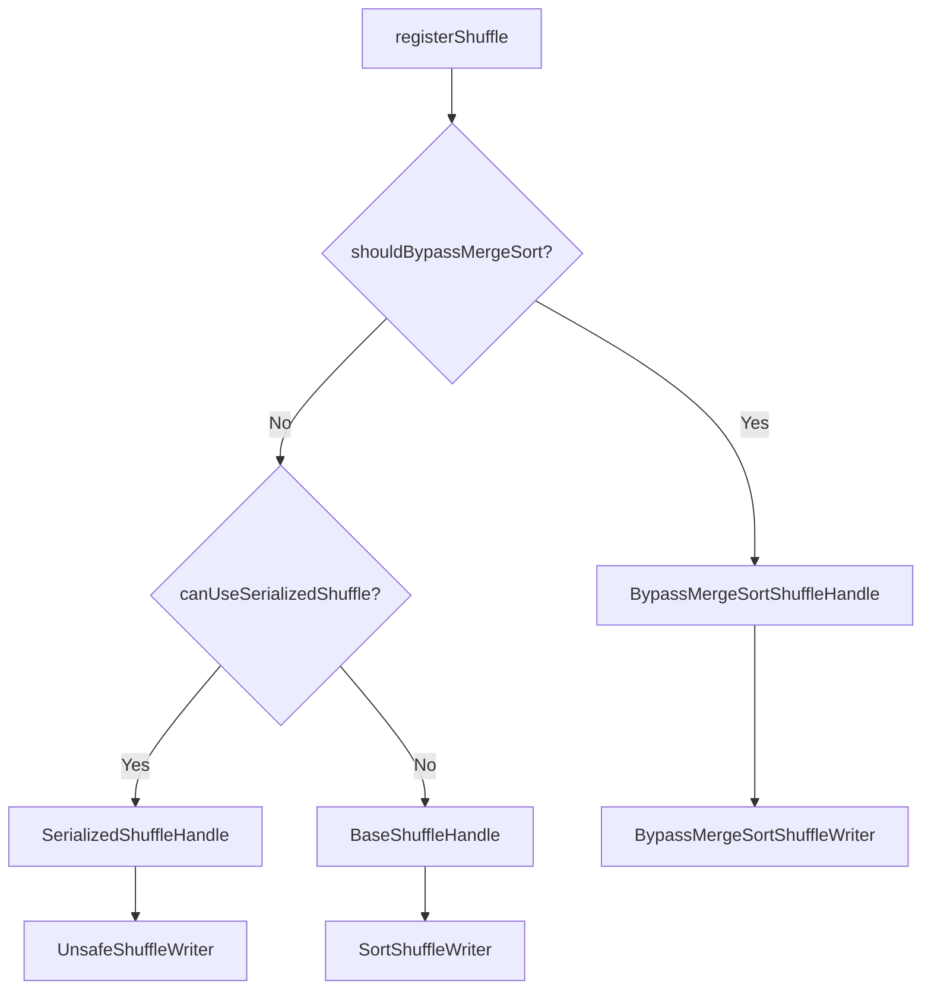
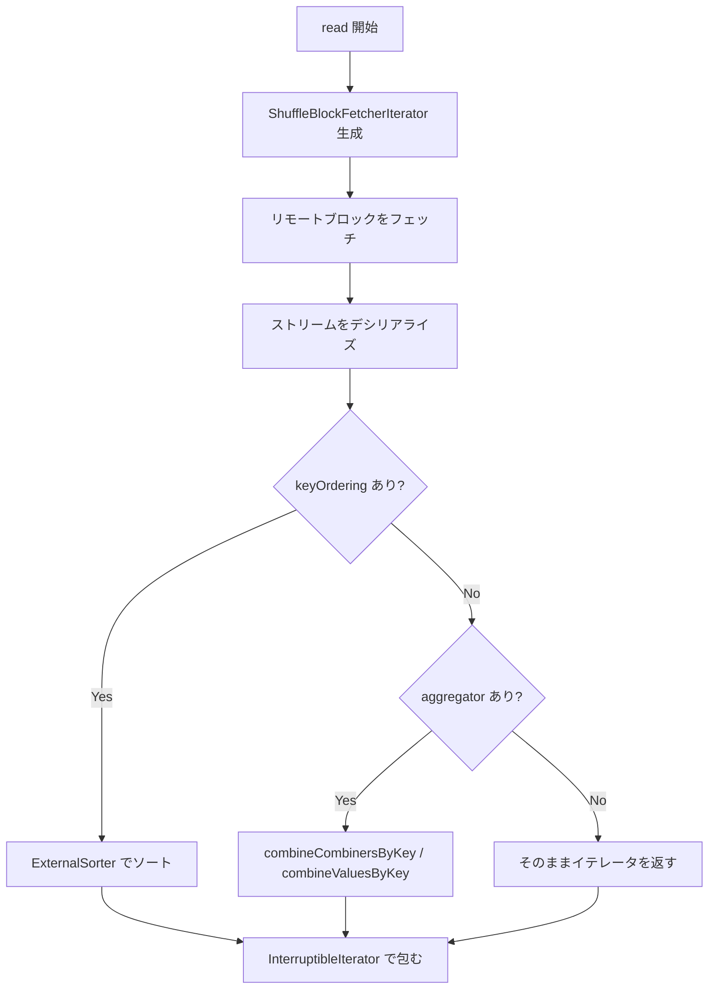

# 第11章 シャッフルの書き込みと読み出し

> 本章で読むソース
>
> - [`core/src/main/scala/org/apache/spark/shuffle/ShuffleManager.scala` L38-L100](https://github.com/apache/spark/blob/v4.1.2/core/src/main/scala/org/apache/spark/shuffle/ShuffleManager.scala#L38-L100)
> - [`core/src/main/scala/org/apache/spark/shuffle/ShuffleWriter.scala` L27-L37](https://github.com/apache/spark/blob/v4.1.2/core/src/main/scala/org/apache/spark/shuffle/ShuffleWriter.scala#L27-L37)
> - [`core/src/main/scala/org/apache/spark/shuffle/ShuffleReader.scala` L23-L33](https://github.com/apache/spark/blob/v4.1.2/core/src/main/scala/org/apache/spark/shuffle/ShuffleReader.scala#L23-L33)
> - [`core/src/main/scala/org/apache/spark/shuffle/ShuffleHandle.scala` L27-L28](https://github.com/apache/spark/blob/v4.1.2/core/src/main/scala/org/apache/spark/shuffle/ShuffleHandle.scala#L27-L28)
> - [`core/src/main/scala/org/apache/spark/shuffle/ShuffleBlockResolver.scala` L31-L67](https://github.com/apache/spark/blob/v4.1.2/core/src/main/scala/org/apache/spark/shuffle/ShuffleBlockResolver.scala#L31-L67)
> - [`core/src/main/scala/org/apache/spark/shuffle/BaseShuffleHandle.scala` L25-L28](https://github.com/apache/spark/blob/v4.1.2/core/src/main/scala/org/apache/spark/shuffle/BaseShuffleHandle.scala#L25-L28)
> - [`core/src/main/scala/org/apache/spark/shuffle/sort/SortShuffleManager.scala` L73-L194](https://github.com/apache/spark/blob/v4.1.2/core/src/main/scala/org/apache/spark/shuffle/sort/SortShuffleManager.scala#L73-L194)
> - [`core/src/main/scala/org/apache/spark/shuffle/sort/SortShuffleManager.scala` L197-L278](https://github.com/apache/spark/blob/v4.1.2/core/src/main/scala/org/apache/spark/shuffle/sort/SortShuffleManager.scala#L197-L278)
> - [`core/src/main/scala/org/apache/spark/shuffle/sort/SortShuffleWriter.scala` L29-L127](https://github.com/apache/spark/blob/v4.1.2/core/src/main/scala/org/apache/spark/shuffle/sort/SortShuffleWriter.scala#L29-L127)
> - [`core/src/main/java/org/apache/spark/shuffle/sort/BypassMergeSortShuffleWriter.java` L84-L209](https://github.com/apache/spark/blob/v4.1.2/core/src/main/java/org/apache/spark/shuffle/sort/BypassMergeSortShuffleWriter.java#L84-L209)
> - [`core/src/main/scala/org/apache/spark/shuffle/IndexShuffleBlockResolver.scala` L57-L66](https://github.com/apache/spark/blob/v4.1.2/core/src/main/scala/org/apache/spark/shuffle/IndexShuffleBlockResolver.scala#L57-L66)
> - [`core/src/main/scala/org/apache/spark/shuffle/IndexShuffleBlockResolver.scala` L391-L486](https://github.com/apache/spark/blob/v4.1.2/core/src/main/scala/org/apache/spark/shuffle/IndexShuffleBlockResolver.scala#L391-L486)
> - [`core/src/main/scala/org/apache/spark/shuffle/IndexShuffleBlockResolver.scala` L616-L660](https://github.com/apache/spark/blob/v4.1.2/core/src/main/scala/org/apache/spark/shuffle/IndexShuffleBlockResolver.scala#L616-L660)
> - [`core/src/main/scala/org/apache/spark/shuffle/BlockStoreShuffleReader.scala` L33-L160](https://github.com/apache/spark/blob/v4.1.2/core/src/main/scala/org/apache/spark/shuffle/BlockStoreShuffleReader.scala#L33-L160)

## この章の狙い

シャッフルはマップタスクの出力をリデュースタスクに再配置する処理であり、Sparkのパフォーマンスを左右する。
本章では、`SortShuffleManager` がシャッフルの書き込み経路をどう選び、`SortShuffleWriter` と `BypassMergeSortShuffleWriter` がどうデータをディスクに書き出すかを追う。
読み出し側では `BlockStoreShuffleReader` がリモートエグゼキュータからブロックをフェッチし、ソートと集約を行う流れを解説する。

## 前提

`DAGScheduler` はステージ境界でシャッフルを挿入する（第6章）。
シャッフルの登録は `ShuffleManager.registerShuffle` で行われ、`ShuffleHandle` がタスクに渡される。
マップタスクは `ShuffleWriter` で出力を書き、リデュースタスクは `ShuffleReader` で読み出す。
`BlockManager` はブロックの保存と取得を担う（第12章）。

## 11.1 ShuffleManager とインターフェース設計

`ShuffleManager` はシャッフル機構のプラグ可能なインターフェースである。

[`core/src/main/scala/org/apache/spark/shuffle/ShuffleManager.scala` L38-L100](https://github.com/apache/spark/blob/v4.1.2/core/src/main/scala/org/apache/spark/shuffle/ShuffleManager.scala#L38-L100)

```scala
private[spark] trait ShuffleManager {

  def registerShuffle[K, V, C](
      shuffleId: Int,
      dependency: ShuffleDependency[K, V, C]): ShuffleHandle

  def getWriter[K, V](
      handle: ShuffleHandle,
      mapId: Long,
      context: TaskContext,
      metrics: ShuffleWriteMetricsReporter): ShuffleWriter[K, V]

  def getReader[K, C](
      handle: ShuffleHandle,
      startMapIndex: Int,
      endMapIndex: Int,
      startPartition: Int,
      endPartition: Int,
      context: TaskContext,
      metrics: ShuffleReadMetricsReporter): ShuffleReader[K, C]

  def unregisterShuffle(shuffleId: Int): Boolean

  def shuffleBlockResolver: ShuffleBlockResolver

  def stop(): Unit
}
```

`registerShuffle` はドライバ上で呼ばれ、`ShuffleHandle` を返す。
`getWriter` はマップタスク側で、`getReader` はリデュースタスク側で呼ばれる。
`shuffleBlockResolver` はシャッフルブロックの物理ファイルへのマッピングを管理する。

既定の実装は `SortShuffleManager` であり、設定 `spark.shuffle.manager` で指定される。

### 11.1.1 ShuffleWriter と ShuffleReader

[`core/src/main/scala/org/apache/spark/shuffle/ShuffleWriter.scala` L27-L37](https://github.com/apache/spark/blob/v4.1.2/core/src/main/scala/org/apache/spark/shuffle/ShuffleWriter.scala#L27-L37)

```scala
private[spark] abstract class ShuffleWriter[K, V] {
  @throws[IOException]
  def write(records: Iterator[Product2[K, V]]): Unit

  def stop(success: Boolean): Option[MapStatus]

  def getPartitionLengths(): Array[Long]
}
```

[`core/src/main/scala/org/apache/spark/shuffle/ShuffleReader.scala` L23-L33](https://github.com/apache/spark/blob/v4.1.2/core/src/main/scala/org/apache/spark/shuffle/ShuffleReader.scala#L23-L33)

```scala
private[spark] trait ShuffleReader[K, C] {
  def read(): Iterator[Product2[K, C]]
}
```

`ShuffleWriter` はレコードのイテレータを受け取り、`MapStatus` を返す。
`ShuffleReader` はキーと値のペアのイテレータを返すだけである。
実際のフェッチやソートは内部で行われる。

### 11.1.2 ShuffleHandle と ShuffleBlockResolver

[`core/src/main/scala/org/apache/spark/shuffle/ShuffleHandle.scala` L27-L28](https://github.com/apache/spark/blob/v4.1.2/core/src/main/scala/org/apache/spark/shuffle/ShuffleHandle.scala#L27-L28)

```scala
@DeveloperApi
abstract class ShuffleHandle(val shuffleId: Int) extends Serializable {}
```

[`core/src/main/scala/org/apache/spark/shuffle/BaseShuffleHandle.scala` L25-L28](https://github.com/apache/spark/blob/v4.1.2/core/src/main/scala/org/apache/spark/shuffle/BaseShuffleHandle.scala#L25-L28)

```scala
private[spark] class BaseShuffleHandle[K, V, C](
    shuffleId: Int,
    val dependency: ShuffleDependency[K, V, C])
  extends ShuffleHandle(shuffleId)
```

`ShuffleHandle` はシャッフルの不透明なハンドルである。
`BaseShuffleHandle` は `ShuffleDependency` を保持し、タスクに渡される。
`SortShuffleManager` は条件に応じて `SerializedShuffleHandle` や `BypassMergeSortShuffleHandle` を返す。

[`core/src/main/scala/org/apache/spark/shuffle/ShuffleBlockResolver.scala` L31-L67](https://github.com/apache/spark/blob/v4.1.2/core/src/main/scala/org/apache/spark/shuffle/ShuffleBlockResolver.scala#L31-L67)

```scala
trait ShuffleBlockResolver {
  type ShuffleId = Int

  def getBlockData(blockId: BlockId, dirs: Option[Array[String]] = None): ManagedBuffer

  def getBlocksForShuffle(shuffleId: Int, mapId: Long): Seq[BlockId] = {
    Seq.empty
  }

  def getMergedBlockData(
      blockId: ShuffleMergedBlockId,
      dirs: Option[Array[String]]): Seq[ManagedBuffer]

  def getMergedBlockMeta(
      blockId: ShuffleMergedBlockId,
      dirs: Option[Array[String]]): MergedBlockMeta

  def stop(): Unit
}
```

`ShuffleBlockResolver` は論理ブロックIDから物理ファイルの場所へのマッピングを管理する。
`getBlockData` は指定されたブロックのデータを `ManagedBuffer` として返す。

## 11.2 SortShuffleManager: 書き込み経路の選択

`SortShuffleManager` は `registerShuffle` でシャッフルの種類を判定し、適切な `ShuffleHandle` を返す。

[`core/src/main/scala/org/apache/spark/shuffle/sort/SortShuffleManager.scala` L90-L109](https://github.com/apache/spark/blob/v4.1.2/core/src/main/scala/org/apache/spark/shuffle/sort/SortShuffleManager.scala#L90-L109)

```scala
override def registerShuffle[K, V, C](
    shuffleId: Int,
    dependency: ShuffleDependency[K, V, C]): ShuffleHandle = {
  if (SortShuffleWriter.shouldBypassMergeSort(conf, dependency)) {
    new BypassMergeSortShuffleHandle[K, V](
      shuffleId, dependency.asInstanceOf[ShuffleDependency[K, V, V]])
  } else if (SortShuffleManager.canUseSerializedShuffle(dependency)) {
    new SerializedShuffleHandle[K, V](
      shuffleId, dependency.asInstanceOf[ShuffleDependency[K, V, V]])
  } else {
    new BaseShuffleHandle(shuffleId, dependency)
  }
}
```

書き込み経路は3つに分岐する。



### 11.2.1 経路選択の条件

`shouldBypassMergeSort` はパーティション数が閾値以下でマップ側結合がなければ `true` を返す。

[`core/src/main/scala/org/apache/spark/shuffle/sort/SortShuffleWriter.scala` L118-L127](https://github.com/apache/spark/blob/v4.1.2/core/src/main/scala/org/apache/spark/shuffle/sort/SortShuffleWriter.scala#L118-L127)

```scala
object SortShuffleWriter {
  def shouldBypassMergeSort(conf: SparkConf, dep: ShuffleDependency[_, _, _]): Boolean = {
    if (dep.mapSideCombine) {
      false
    } else {
      val bypassMergeThreshold: Int = conf.get(config.SHUFFLE_SORT_BYPASS_MERGE_THRESHOLD)
      dep.partitioner.numPartitions <= bypassMergeThreshold
    }
  }
}
```

`canUseSerializedShuffle` はシリアライザが再配置可能で、マップ側結合がなく、パーティション数が16777216以下であれば `true` を返す。

[`core/src/main/scala/org/apache/spark/shuffle/sort/SortShuffleManager.scala` L227-L246](https://github.com/apache/spark/blob/v4.1.2/core/src/main/scala/org/apache/spark/shuffle/sort/SortShuffleManager.scala#L227-L246)

```scala
def canUseSerializedShuffle(dependency: ShuffleDependency[_, _, _]): Boolean = {
  val shufId = dependency.shuffleId
  val numPartitions = dependency.partitioner.numPartitions
  if (!dependency.serializer.supportsRelocationOfSerializedObjects) {
    false
  } else if (dependency.mapSideCombine) {
    false
  } else if (numPartitions > MAX_SHUFFLE_OUTPUT_PARTITIONS_FOR_SERIALIZED_MODE) {
    false
  } else {
    true
  }
}
```

### 11.2.2 getWriter: ハンドルに応じた Writer の生成

[`core/src/main/scala/org/apache/spark/shuffle/sort/SortShuffleManager.scala` L145-L176](https://github.com/apache/spark/blob/v4.1.2/core/src/main/scala/org/apache/spark/shuffle/sort/SortShuffleManager.scala#L145-L176)

```scala
override def getWriter[K, V](
    handle: ShuffleHandle,
    mapId: Long,
    context: TaskContext,
    metrics: ShuffleWriteMetricsReporter): ShuffleWriter[K, V] = {
  val mapTaskIds = taskIdMapsForShuffle.computeIfAbsent(
    handle.shuffleId, _ => new OpenHashSet[Long](16))
  mapTaskIds.synchronized { mapTaskIds.add(mapId) }
  val env = SparkEnv.get
  handle match {
    case unsafeShuffleHandle: SerializedShuffleHandle[K @unchecked, V @unchecked] =>
      new UnsafeShuffleWriter(
        env.blockManager, context.taskMemoryManager(),
        unsafeShuffleHandle, mapId, context, env.conf, metrics,
        shuffleExecutorComponents)
    case bypassMergeSortHandle: BypassMergeSortShuffleHandle[K @unchecked, V @unchecked] =>
      new BypassMergeSortShuffleWriter(
        env.blockManager, bypassMergeSortHandle,
        mapId, env.conf, metrics, shuffleExecutorComponents)
    case other: BaseShuffleHandle[K @unchecked, V @unchecked, _] =>
      new SortShuffleWriter(other, mapId, context, metrics, shuffleExecutorComponents)
  }
}
```

`SerializedShuffleHandle` なら `UnsafeShuffleWriter`、`BypassMergeSortShuffleHandle` なら `BypassMergeSortShuffleWriter`、それ以外なら `SortShuffleWriter` を生成する。

## 11.3 SortShuffleWriter: 通常のソート書き込み

`SortShuffleWriter` は `ExternalSorter` を使ってレコードをソートし、パーティションごとに出力する。

[`core/src/main/scala/org/apache/spark/shuffle/sort/SortShuffleWriter.scala` L29-L89](https://github.com/apache/spark/blob/v4.1.2/core/src/main/scala/org/apache/spark/shuffle/sort/SortShuffleWriter.scala#L29-L89)

```scala
private[spark] class SortShuffleWriter[K, V, C](
    handle: BaseShuffleHandle[K, V, C],
    mapId: Long,
    context: TaskContext,
    writeMetrics: ShuffleWriteMetricsReporter,
    shuffleExecutorComponents: ShuffleExecutorComponents)
  extends ShuffleWriter[K, V] with Logging {

  private val dep = handle.dependency
  private val blockManager = SparkEnv.get.blockManager
  private var sorter: ExternalSorter[K, V, _] = null
  // ...

  override def write(records: Iterator[Product2[K, V]]): Unit = {
    sorter = if (dep.mapSideCombine) {
      new ExternalSorter[K, V, C](
        context, dep.aggregator, Some(dep.partitioner), dep.keyOrdering,
        dep.serializer, dep.rowBasedChecksums)
    } else {
      new ExternalSorter[K, V, V](
        context, aggregator = None, Some(dep.partitioner), ordering = None,
        dep.serializer, dep.rowBasedChecksums)
    }
    sorter.insertAll(records)

    val mapOutputWriter = shuffleExecutorComponents.createMapOutputWriter(
      dep.shuffleId, mapId, dep.partitioner.numPartitions)
    sorter.writePartitionedMapOutput(dep.shuffleId, mapId, mapOutputWriter, writeMetrics)
    partitionLengths = mapOutputWriter.commitAllPartitions(sorter.getChecksums).getPartitionLengths
    mapStatus =
      MapStatus(blockManager.shuffleServerId, partitionLengths, mapId, getAggregatedChecksumValue)
  }
}
```

`ExternalSorter` はメモリ内でレコードをソートし、溢れた場合はディスクにスピルする。
`mapSideCombine` が有効なら集約をマップ側で実行する。
`writePartitionedMapOutput` でパーティション単位の出力を書き、`commitAllPartitions` で各パーティションのバイト長を得る。

なぜ速いのか: `ExternalSorter` はメモリを使い切るとディスクにスピルし、最終的にマージソートで結合するため、メモリ容量を超えるシャッフルも扱える。メモリ内ではソート済みバッファを保持するため、ディスク書き込み回数を最小化できる。

## 11.4 BypassMergeSortShuffleWriter: パーティション直接書き込み

`BypassMergeSortShuffleWriter` はパーティションごとに別ファイルを書き、最後に連結する。

[`core/src/main/java/org/apache/spark/shuffle/sort/BypassMergeSortShuffleWriter.java` L84-L145](https://github.com/apache/spark/blob/v4.1.2/core/src/main/java/org/apache/spark/shuffle/sort/BypassMergeSortShuffleWriter.java#L84-L145)

```java
final class BypassMergeSortShuffleWriter<K, V>
  extends ShuffleWriter<K, V>
  implements ShuffleChecksumSupport {

  private final int fileBufferSize;
  private final boolean transferToEnabled;
  private final int numPartitions;
  private final BlockManager blockManager;
  private final Partitioner partitioner;
  // ...

  private DiskBlockObjectWriter[] partitionWriters;
  private FileSegment[] partitionWriterSegments;
  @Nullable private MapStatus mapStatus;
  private long[] partitionLengths;
  // ...
}
```

パーティション数だけ `DiskBlockObjectWriter` の配列を生成する。

### 11.4.1 write メソッドの処理

[`core/src/main/java/org/apache/spark/shuffle/sort/BypassMergeSortShuffleWriter.java` L148-L209](https://github.com/apache/spark/blob/v4.1.2/core/src/main/java/org/apache/spark/shuffle/sort/BypassMergeSortShuffleWriter.java#L148-L209)

```java
@Override
public void write(Iterator<Product2<K, V>> records) throws IOException {
  assert (partitionWriters == null);
  ShuffleMapOutputWriter mapOutputWriter = shuffleExecutorComponents
      .createMapOutputWriter(shuffleId, mapId, numPartitions);
  try {
    if (!records.hasNext()) {
      partitionLengths = mapOutputWriter.commitAllPartitions(
        ShuffleChecksumHelper.EMPTY_CHECKSUM_VALUE).getPartitionLengths();
      mapStatus = MapStatus$.MODULE$.apply(
        blockManager.shuffleServerId(), partitionLengths, mapId, getAggregatedChecksumValue());
      return;
    }
    final SerializerInstance serInstance = serializer.newInstance();
    final long openStartTime = System.nanoTime();
    partitionWriters = new DiskBlockObjectWriter[numPartitions];
    partitionWriterSegments = new FileSegment[numPartitions];
    for (int i = 0; i < numPartitions; i++) {
      final Tuple2<TempShuffleBlockId, File> tempShuffleBlockIdPlusFile =
          blockManager.diskBlockManager().createTempShuffleBlock();
      final File file = tempShuffleBlockIdPlusFile._2();
      final BlockId blockId = tempShuffleBlockIdPlusFile._1();
      DiskBlockObjectWriter writer =
        blockManager.getDiskWriter(blockId, file, serInstance, fileBufferSize, writeMetrics);
      // ...
      partitionWriters[i] = writer;
    }
    writeMetrics.incWriteTime(System.nanoTime() - openStartTime);

    while (records.hasNext()) {
      final Product2<K, V> record = records.next();
      final K key = record._1();
      final int partitionId = partitioner.getPartition(key);
      partitionWriters[partitionId].write(key, record._2());
    }

    for (int i = 0; i < numPartitions; i++) {
      try (DiskBlockObjectWriter writer = partitionWriters[i]) {
        partitionWriterSegments[i] = writer.commitAndGet();
      }
    }

    partitionLengths = writePartitionedData(mapOutputWriter);
    mapStatus = MapStatus$.MODULE$.apply(
      blockManager.shuffleServerId(), partitionLengths, mapId, getAggregatedChecksumValue());
  } catch (Exception e) {
    // ...
  }
}
```

1. 全パーティション分の一時ファイルとライタを生成する。
2. レコードを1つずつ読み、パーティショナで宛先を決定して対応するライタに書く。
3. 全ライタをコミットしてファイルセグメントを得る。
4. `writePartitionedData` で各パーティションのファイルを連結して最終出力にする。

この方式はソートを介さないため、メモリ使用量を抑えられる。
ただしパーティション数だけファイルを同時に開くため、パーティション数が多い場合は非効率である。

### 11.4.2 writePartitionedData: ファイルの連結

[`core/src/main/java/org/apache/spark/shuffle/sort/BypassMergeSortShuffleWriter.java` L232-L266](https://github.com/apache/spark/blob/v4.1.2/core/src/main/java/org/apache/spark/shuffle/sort/BypassMergeSortShuffleWriter.java#L232-L266)

```java
private long[] writePartitionedData(ShuffleMapOutputWriter mapOutputWriter) throws IOException {
  if (partitionWriters != null) {
    final long writeStartTime = System.nanoTime();
    try {
      for (int i = 0; i < numPartitions; i++) {
        final File file = partitionWriterSegments[i].file();
        ShufflePartitionWriter writer = mapOutputWriter.getPartitionWriter(i);
        if (file.exists()) {
          if (transferToEnabled) {
            Optional<WritableByteChannelWrapper> maybeOutputChannel = writer.openChannelWrapper();
            if (maybeOutputChannel.isPresent()) {
              writePartitionedDataWithChannel(file, maybeOutputChannel.get());
            } else {
              writePartitionedDataWithStream(file, writer);
            }
          } else {
            writePartitionedDataWithStream(file, writer);
          }
          if (!file.delete()) {
            logger.error("Unable to delete file for partition {}",
              MDC.of(LogKeys.PARTITION_ID, i));
          }
        }
      }
    } finally {
      writeMetrics.incWriteTime(System.nanoTime() - writeStartTime);
    }
    partitionWriters = null;
  }
  return mapOutputWriter.commitAllPartitions(getChecksumValues(partitionChecksums))
    .getPartitionLengths();
}
```

`transferToEnabled` が有効なら NIO の `transferTo` を使い、OS レベルでファイルをコピーする。
これはユーザー空間へのコピーを避け、ゼロコピー転送を実現する。

なぜ速いのか: `FileChannel.transferTo` はカーネル内で直接データを転送するため、ユーザー空間へのコピーやコンテキストスイッチを省略でき、大量のファイル連結で効果を発揮する。

## 11.5 IndexShuffleBlockResolver: インデックスとデータの管理

`IndexShuffleBlockResolver` は同一マップタスクの全パーティション出力を1つのデータファイルにまとめ、オフセットをインデックスファイルに記録する。

[`core/src/main/scala/org/apache/spark/shuffle/IndexShuffleBlockResolver.scala` L57-L66](https://github.com/apache/spark/blob/v4.1.2/core/src/main/scala/org/apache/spark/shuffle/IndexShuffleBlockResolver.scala#L57-L66)

```scala
private[spark] class IndexShuffleBlockResolver(
    conf: SparkConf,
    var _blockManager: BlockManager,
    val taskIdMapsForShuffle: ConcurrentMap[Int, OpenHashSet[Long]])
  extends ShuffleBlockResolver
  with Logging with MigratableResolver {
  // ...
}
```

データファイル（`.data`）とインデックスファイル（`.index`）のペアで管理される。
インデックスファイルには各パーティションの開始オフセットがlong値（8バイト）で格納される。

### 11.5.1 writeMetadataFileAndCommit

[`core/src/main/scala/org/apache/spark/shuffle/IndexShuffleBlockResolver.scala` L391-L486](https://github.com/apache/spark/blob/v4.1.2/core/src/main/scala/org/apache/spark/shuffle/IndexShuffleBlockResolver.scala#L391-L486)

```scala
def writeMetadataFileAndCommit(
    shuffleId: Int,
    mapId: Long,
    lengths: Array[Long],
    checksums: Array[Long],
    dataTmp: File): Unit = {
  val indexFile = getIndexFile(shuffleId, mapId)
  val indexTmp = createTempFile(indexFile)
  // ...
  try {
    val dataFile = getDataFile(shuffleId, mapId)
    this.synchronized {
      val existingLengths = checkIndexAndDataFile(indexFile, dataFile, lengths.length)
      if (existingLengths != null) {
        System.arraycopy(existingLengths, 0, lengths, 0, lengths.length)
        // ...
        if (dataTmp != null && dataTmp.exists()) {
          dataTmp.delete()
        }
      } else {
        val offsets = lengths.scanLeft(0L)(_ + _)
        writeMetadataFile(offsets, indexTmp, indexFile, true)

        if (dataFile.exists()) {
          dataFile.delete()
        }
        if (dataTmp != null && dataTmp.exists() && !dataTmp.renameTo(dataFile)) {
          throw SparkCoreErrors.failedRenameTempFileError(dataTmp, dataFile)
        }
        // ...
      }
    }
  } finally {
    // ...
  }
}
```

`lengths` 配列から `scanLeft` で累積オフセットを計算し、インデックスファイルに書き出す。
データファイルとインデックスファイルは一時ファイル経由でアトミックにコミットされる。
`checkIndexAndDataFile` は既存のファイルが有効かチェックし、同じタスクの再試行が既に成功していればそれを再利用する。

このアトミックコミット機構により、タスクの失敗時に中途半端なファイルが残っても、次の試行で安全に上書きできる。

### 11.5.2 getBlockData: ブロックデータの読み出し

[`core/src/main/scala/org/apache/spark/shuffle/IndexShuffleBlockResolver.scala` L616-L660](https://github.com/apache/spark/blob/v4.1.2/core/src/main/scala/org/apache/spark/shuffle/IndexShuffleBlockResolver.scala#L616-L660)

```scala
override def getBlockData(
    blockId: BlockId,
    dirs: Option[Array[String]]): ManagedBuffer = {
  val (shuffleId, mapId, startReduceId, endReduceId) = blockId match {
    case id: ShuffleBlockId =>
      (id.shuffleId, id.mapId, id.reduceId, id.reduceId + 1)
    case batchId: ShuffleBlockBatchId =>
      (batchId.shuffleId, batchId.mapId, batchId.startReduceId, batchId.endReduceId)
    case _ =>
      throw SparkException.internalError(
        s"unexpected shuffle block id format: $blockId", category = "SHUFFLE")
  }
  val indexFile = getIndexFile(shuffleId, mapId, dirs)

  val channel = Files.newByteChannel(indexFile.toPath)
  channel.position(startReduceId * 8L)
  val in = new DataInputStream(Channels.newInputStream(channel))
  try {
    val startOffset = in.readLong()
    channel.position(endReduceId * 8L)
    val endOffset = in.readLong()
    // ...
    new FileSegmentManagedBuffer(
      transportConf,
      getDataFile(shuffleId, mapId, dirs),
      startOffset,
      endOffset - startOffset)
  } finally {
    in.close()
  }
}
```

インデックスファイルから目的のパーティションのオフセット範囲を読み、`FileSegmentManagedBuffer` を返す。
`FileSegmentManagedBuffer` はファイルの一部を指すゼロコピー対応バッファであり、ネットワーク転送時に効率的である。

## 11.6 BlockStoreShuffleReader: リモートからのフェッチと集約

`BlockStoreShuffleReader` はリデュースタスクがマップ出力を読み出すための実装である。

[`core/src/main/scala/org/apache/spark/shuffle/BlockStoreShuffleReader.scala` L33-L91](https://github.com/apache/spark/blob/v4.1.2/core/src/main/scala/org/apache/spark/shuffle/BlockStoreShuffleReader.scala#L33-L91)

```scala
private[spark] class BlockStoreShuffleReader[K, C](
    handle: BaseShuffleHandle[K, _, C],
    blocksByAddress: Iterator[(BlockManagerId, collection.Seq[(BlockId, Long, Int)])],
    context: TaskContext,
    readMetrics: ShuffleReadMetricsReporter,
    serializerManager: SerializerManager = SparkEnv.get.serializerManager,
    blockManager: BlockManager = SparkEnv.get.blockManager,
    mapOutputTracker: MapOutputTracker = SparkEnv.get.mapOutputTracker,
    shouldBatchFetch: Boolean = false)
  extends ShuffleReader[K, C] with Logging {

  private val dep = handle.dependency

  private def fetchContinuousBlocksInBatch: Boolean = {
    val conf = SparkEnv.get.conf
    val serializerRelocatable = dep.serializer.supportsRelocationOfSerializedObjects
    val compressed = conf.get(config.SHUFFLE_COMPRESS)
    val codecConcatenation = if (compressed) {
      CompressionCodec.supportsConcatenationOfSerializedStreams(CompressionCodec.createCodec(conf))
    } else {
      true
    }
    val useOldFetchProtocol = conf.get(config.SHUFFLE_USE_OLD_FETCH_PROTOCOL)
    val ioEncryption = conf.get(config.IO_ENCRYPTION_ENABLED)

    val doBatchFetch = shouldBatchFetch && serializerRelocatable &&
      (!compressed || codecConcatenation) && !useOldFetchProtocol && !ioEncryption
    // ...
    doBatchFetch
  }
  // ...
}
```

`fetchContinuousBlocksInBatch` は連続するブロックをバッチでフェッチできるか判定する。
シリアライザが再配置可能で、圧縮コーデックが結合をサポートし、IO暗号化が無効ならバッチフェッチが有効になる。

### 11.6.1 read メソッドの処理

[`core/src/main/scala/org/apache/spark/shuffle/BlockStoreShuffleReader.scala` L72-L160](https://github.com/apache/spark/blob/v4.1.2/core/src/main/scala/org/apache/spark/shuffle/BlockStoreShuffleReader.scala#L72-L160)

```scala
override def read(): Iterator[Product2[K, C]] = {
  val wrappedStreams = new ShuffleBlockFetcherIterator(
    context,
    blockManager.blockStoreClient,
    blockManager,
    mapOutputTracker,
    blocksByAddress,
    serializerManager.wrapStream,
    SparkEnv.get.conf.get(config.REDUCER_MAX_SIZE_IN_FLIGHT) * 1024 * 1024,
    SparkEnv.get.conf.get(config.REDUCER_MAX_REQS_IN_FLIGHT),
    SparkEnv.get.conf.get(config.REDUCER_MAX_BLOCKS_IN_FLIGHT_PER_ADDRESS),
    SparkEnv.get.conf.get(config.MAX_REMOTE_BLOCK_SIZE_FETCH_TO_MEM),
    SparkEnv.get.conf.get(config.SHUFFLE_MAX_ATTEMPTS_ON_NETTY_OOM),
    SparkEnv.get.conf.get(config.SHUFFLE_DETECT_CORRUPT),
    SparkEnv.get.conf.get(config.SHUFFLE_DETECT_CORRUPT_MEMORY),
    SparkEnv.get.conf.get(config.SHUFFLE_CHECKSUM_ENABLED),
    SparkEnv.get.conf.get(config.SHUFFLE_CHECKSUM_ALGORITHM),
    readMetrics,
    fetchContinuousBlocksInBatch).toCompletionIterator

  val serializerInstance = dep.serializer.newInstance()

  val recordIter = wrappedStreams.flatMap { case (blockId, wrappedStream) =>
    serializerInstance.deserializeStream(wrappedStream).asKeyValueIterator
  }

  val metricIter = CompletionIterator[(Any, Any), Iterator[(Any, Any)]](
    recordIter.map { record =>
      readMetrics.incRecordsRead(1)
      record
    },
    context.taskMetrics().mergeShuffleReadMetrics())

  val interruptibleIter = new InterruptibleIterator[(Any, Any)](context, metricIter)

  val resultIter: Iterator[Product2[K, C]] = {
    if (dep.keyOrdering.isDefined) {
      val sorter: ExternalSorter[K, _, C] = if (dep.aggregator.isDefined) {
        if (dep.mapSideCombine) {
          new ExternalSorter[K, C, C](context,
            Option(new Aggregator[K, C, C](identity,
              dep.aggregator.get.mergeCombiners,
              dep.aggregator.get.mergeCombiners)),
            ordering = Some(dep.keyOrdering.get), serializer = dep.serializer)
        } else {
          new ExternalSorter[K, Nothing, C](context,
            dep.aggregator.asInstanceOf[Option[Aggregator[K, Nothing, C]]],
            ordering = Some(dep.keyOrdering.get), serializer = dep.serializer)
        }
      } else {
        new ExternalSorter[K, C, C](context, ordering = Some(dep.keyOrdering.get),
          serializer = dep.serializer)
      }
      sorter.insertAllAndUpdateMetrics(interruptibleIter.asInstanceOf[Iterator[(K, Nothing)]])
    } else if (dep.aggregator.isDefined) {
      if (dep.mapSideCombine) {
        val combinedKeyValuesIterator = interruptibleIter.asInstanceOf[Iterator[(K, C)]]
        dep.aggregator.get.combineCombinersByKey(combinedKeyValuesIterator, context)
      } else {
        val keyValuesIterator = interruptibleIter.asInstanceOf[Iterator[(K, Nothing)]]
        dep.aggregator.get.combineValuesByKey(keyValuesIterator, context)
      }
    } else {
      interruptibleIter.asInstanceOf[Iterator[(K, C)]]
    }
  }

  resultIter match {
    case _: InterruptibleIterator[Product2[K, C]] => resultIter
    case _ =>
      new InterruptibleIterator[Product2[K, C]](context, resultIter)
  }
}
```

処理の流れは以下の通りである。

1. `ShuffleBlockFetcherIterator` でリモートエグゼキュータからブロックを非同期にフェッチする。
2. フェッチしたストリームをデシリアライズし、キーと値のペアのイテレータを作る。
3. メトリクス更新とタスク中断対応のラッパーで包む。
4. `keyOrdering` があれば `ExternalSorter` でソートする。
5. `aggregator` があればマップ側結合値をさらに集約する。
6. どちらもなければそのまま返す。



なぜ速いのか: `ShuffleBlockFetcherIterator` は複数エグゼキュータからのフェッチを並列化し、`REDUCER_MAX_REQS_IN_FLIGHT` で同時リクエスト数を制御する。連続ブロックのバッチフェッチにより、ネットワークラウンドトリップ回数を削減する。

## 11.7 getReader: リーダーの生成

`SortShuffleManager.getReader` は `BlockStoreShuffleReader` を生成する。

[`core/src/main/scala/org/apache/spark/shuffle/sort/SortShuffleManager.scala` L119-L142](https://github.com/apache/spark/blob/v4.1.2/core/src/main/scala/org/apache/spark/shuffle/sort/SortShuffleManager.scala#L119-L142)

```scala
override def getReader[K, C](
    handle: ShuffleHandle,
    startMapIndex: Int,
    endMapIndex: Int,
    startPartition: Int,
    endPartition: Int,
    context: TaskContext,
    metrics: ShuffleReadMetricsReporter): ShuffleReader[K, C] = {
  val baseShuffleHandle = handle.asInstanceOf[BaseShuffleHandle[K, _, C]]
  val (blocksByAddress, canEnableBatchFetch) =
    if (baseShuffleHandle.dependency.isShuffleMergeFinalizedMarked) {
      val res = SparkEnv.get.mapOutputTracker.getPushBasedShuffleMapSizesByExecutorId(
        handle.shuffleId, startMapIndex, endMapIndex, startPartition, endPartition)
      (res.iter, res.enableBatchFetch)
    } else {
      val address = SparkEnv.get.mapOutputTracker.getMapSizesByExecutorId(
        handle.shuffleId, startMapIndex, endMapIndex, startPartition, endPartition)
      (address, true)
    }
  new BlockStoreShuffleReader(
    handle.asInstanceOf[BaseShuffleHandle[K, _, C]], blocksByAddress, context, metrics,
    shouldBatchFetch =
      canEnableBatchFetch && canUseBatchFetch(startPartition, endPartition, context))
}
```

プッシュベースシャッフルが有効なら `getPushBasedShuffleMapSizesByExecutorId` を使う。
そうでなければ `getMapSizesByExecutorId` でエグゼキュータごとのブロック一覧を得る。
バッチフェッチの可否は `canUseBatchFetch` で判定される。

## 11.8 unregisterShuffle: シャッフルのクリーンアップ

[`core/src/main/scala/org/apache/spark/shuffle/sort/SortShuffleManager.scala` L179-L188](https://github.com/apache/spark/blob/v4.1.2/core/src/main/scala/org/apache/spark/shuffle/sort/SortShuffleManager.scala#L179-L188)

```scala
override def unregisterShuffle(shuffleId: Int): Boolean = {
  Option(taskIdMapsForShuffle.remove(shuffleId)).foreach { mapTaskIds =>
    mapTaskIds.synchronized {
      mapTaskIds.iterator.foreach { mapTaskId =>
        shuffleBlockResolver.removeDataByMap(shuffleId, mapTaskId)
      }
    }
  }
  true
}
```

シャッフルが不要になったとき、タスクIDマップからエントリを削除し、各マップタスクのデータファイルとインデックスファイルを削除する。
`removeDataByMap` はデータファイル、インデックスファイル、チェックサムファイルを削除する。

## まとめ

本章ではシャッフルの書き込みと読み出しの全体像を追った。

- `SortShuffleManager` は条件に応じて3つの書き込み経路を選ぶ。
- `SortShuffleWriter` は `ExternalSorter` でソートしてからパーティション出力を生成する。
- `BypassMergeSortShuffleWriter` はパーティションごとに直接ファイルを書き、最後に連結する。
- `IndexShuffleBlockResolver` は1つのデータファイルとインデックスファイルで全パーティションを管理し、アトミックにコミットする。
- `BlockStoreShuffleReader` は `ShuffleBlockFetcherIterator` でリモートから並列フェッチし、ソートと集約を行う。
- バッチフェッチは連続ブロックをまとめて取得し、ネットワークラウンドトリップを削減する。

## 関連する章

- [第6章: DAGScheduler: ステージ構築とジョブスケジューリング](../part02-scheduling/06-dagscheduler.md)
- [第9章: Executor: タスク実行エンジン](09-executor.md)
- [第10章: タスクのメモリ管理と GC](10-task-memory-and-gc.md)
- [第12章: BlockManager: ブロックの保存と取得](../part04-storage/12-blockmanager.md)
