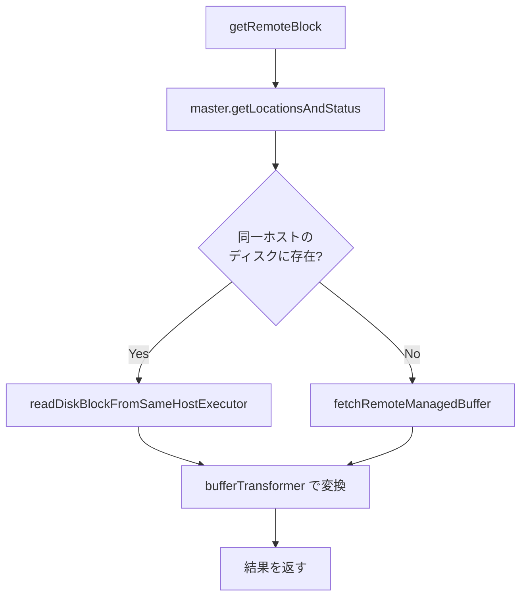
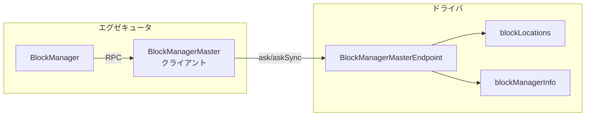

# 第12章 BlockManager: ブロックの保存と取得

> 本章で読むソース
>
> - [`core/src/main/scala/org/apache/spark/storage/BlockManager.scala` L182-L296](https://github.com/apache/spark/blob/v4.1.2/core/src/main/scala/org/apache/spark/storage/BlockManager.scala#L182-L296)
> - [`core/src/main/scala/org/apache/spark/storage/BlockManager.scala` L534-L594](https://github.com/apache/spark/blob/v4.1.2/core/src/main/scala/org/apache/spark/storage/BlockManager.scala#L534-L594)
> - [`core/src/main/scala/org/apache/spark/storage/BlockManager.scala` L964-L1025](https://github.com/apache/spark/blob/v4.1.2/core/src/main/scala/org/apache/spark/storage/BlockManager.scala#L964-L1025)
> - [`core/src/main/scala/org/apache/spark/storage/BlockManager.scala` L1314-L1326](https://github.com/apache/spark/blob/v4.1.2/core/src/main/scala/org/apache/spark/storage/BlockManager.scala#L1314-L1326)
> - [`core/src/main/scala/org/apache/spark/storage/BlockManager.scala` L1560-L1629](https://github.com/apache/spark/blob/v4.1.2/core/src/main/scala/org/apache/spark/storage/BlockManager.scala#L1560-L1629)
> - [`core/src/main/scala/org/apache/spark/storage/BlockManager.scala` L1877-L1970](https://github.com/apache/spark/blob/v4.1.2/core/src/main/scala/org/apache/spark/storage/BlockManager.scala#L1877-L1970)
> - [`core/src/main/scala/org/apache/spark/storage/BlockManagerId.scala` L38-L105](https://github.com/apache/spark/blob/v4.1.2/core/src/main/scala/org/apache/spark/storage/BlockManagerId.scala#L38-L105)
> - [`core/src/main/scala/org/apache/spark/storage/BlockManagerMaster.scala` L33-L40](https://github.com/apache/spark/blob/v4.1.2/core/src/main/scala/org/apache/spark/storage/BlockManagerMaster.scala#L33-L40)
> - [`core/src/main/scala/org/apache/spark/storage/BlockManagerMaster.scala` L73-L98](https://github.com/apache/spark/blob/v4.1.2/core/src/main/scala/org/apache/spark/storage/BlockManagerMaster.scala#L73-L98)
> - [`core/src/main/scala/org/apache/spark/storage/BlockManagerMasterEndpoint.scala` L51-L61](https://github.com/apache/spark/blob/v4.1.2/core/src/main/scala/org/apache/spark/storage/BlockManagerMasterEndpoint.scala#L51-L61)
> - [`core/src/main/scala/org/apache/spark/storage/BlockManagerMasterEndpoint.scala` L137-L250](https://github.com/apache/spark/blob/v4.1.2/core/src/main/scala/org/apache/spark/storage/BlockManagerMasterEndpoint.scala#L137-L250)
> - [`core/src/main/scala/org/apache/spark/storage/BlockManagerMasterEndpoint.scala` L686-L766](https://github.com/apache/spark/blob/v4.1.2/core/src/main/scala/org/apache/spark/storage/BlockManagerMasterEndpoint.scala#L686-L766)
> - [`core/src/main/scala/org/apache/spark/storage/BlockManagerMessages.scala` L25-L165](https://github.com/apache/spark/blob/v4.1.2/core/src/main/scala/org/apache/spark/storage/BlockManagerMessages.scala#L25-L165)
> - [`core/src/main/scala/org/apache/spark/network/netty/NettyBlockTransferService.scala` L51-L94](https://github.com/apache/spark/blob/v4.1.2/core/src/main/scala/org/apache/spark/network/netty/NettyBlockTransferService.scala#L51-L94)
> - [`core/src/main/scala/org/apache/spark/network/netty/NettyBlockTransferService.scala` L119-L166](https://github.com/apache/spark/blob/v4.1.2/core/src/main/scala/org/apache/spark/network/netty/NettyBlockTransferService.scala#L119-L166)
> - [`core/src/main/scala/org/apache/spark/storage/BlockManagerDecommissioner.scala` L39-L99](https://github.com/apache/spark/blob/v4.1.2/core/src/main/scala/org/apache/spark/storage/BlockManagerDecommissioner.scala#L39-L99)
> - [`core/src/main/scala/org/apache/spark/storage/BlockManagerDecommissioner.scala` L309-L343](https://github.com/apache/spark/blob/v4.1.2/core/src/main/scala/org/apache/spark/storage/BlockManagerDecommissioner.scala#L309-L343)

## この章の狙い

`BlockManager` は各ノード（ドライバとエグゼキュータ）で動作し、ブロックの保存と取得を統括する。
本章では `BlockManager` の全体像、`BlockManagerMaster` を介したドライバとの通信、`NettyBlockTransferService` によるノード間転送、そして decommission 時のブロックマイグレーションを追う。

## 前提

`Executor` はタスク実行中に `BlockManager` 経由でブロックを読み書きする（第9章）。
タスク結果が大きい場合は `BlockManager` に保存してからドライバに通知する。
`StorageLevel` によってメモリ、ディスク、レプリケーションの戦略が決まる。

## 12.1 BlockManager の全体像

`BlockManager` クラスは各ノード上でブロックの保存、取得、レプリケーションを管理する。

[`core/src/main/scala/org/apache/spark/storage/BlockManager.scala` L182-L248](https://github.com/apache/spark/blob/v4.1.2/core/src/main/scala/org/apache/spark/storage/BlockManager.scala#L182-L248)

```scala
private[spark] class BlockManager(
    val executorId: String,
    rpcEnv: RpcEnv,
    val master: BlockManagerMaster,
    val serializerManager: SerializerManager,
    val conf: SparkConf,
    private val _memoryManager: MemoryManager,
    mapOutputTracker: MapOutputTracker,
    private val _shuffleManager: ShuffleManager,
    val blockTransferService: BlockTransferService,
    securityManager: SecurityManager,
    externalBlockStoreClient: Option[ExternalBlockStoreClient])
  extends BlockDataManager with BlockEvictionHandler with Logging {

  // ...

  val diskBlockManager = {
    val deleteFilesOnStop =
      !externalShuffleServiceEnabled || isDriver
    new DiskBlockManager(conf, deleteFilesOnStop = deleteFilesOnStop, isDriver = isDriver)
  }

  private[storage] val blockInfoManager = new BlockInfoManager(trackingCacheVisibility)

  private[spark] lazy val memoryStore = {
    val store = new MemoryStore(conf, blockInfoManager, serializerManager, memoryManager, this)
    memoryManager.setMemoryStore(store)
    store
  }
  private[spark] val diskStore = new DiskStore(conf, diskBlockManager, securityManager)

  var blockManagerId: BlockManagerId = _
  private[spark] var shuffleServerId: BlockManagerId = _
  private[spark] val blockStoreClient = externalBlockStoreClient.getOrElse(blockTransferService)
  // ...
}
```

`BlockManager` は以下の構成要素を持つ。

- `memoryStore`: メモリ上のブロック保存（第14章）。
- `diskStore`: ディスク上のブロック保存（第14章）。
- `blockInfoManager`: ブロックのロックとメタデータ管理。
- `blockTransferService`: ノード間ブロック転送（`NettyBlockTransferService`）。
- `master`: ドライバ上の `BlockManagerMaster` への参照。

### 12.1.1 初期化

`initialize` メソッドはアプリケーションIDを受け取り、`BlockTransferService` の初期化とドライバへの登録を行う。

[`core/src/main/scala/org/apache/spark/storage/BlockManager.scala` L534-L594](https://github.com/apache/spark/blob/v4.1.2/core/src/main/scala/org/apache/spark/storage/BlockManager.scala#L534-L594)

```scala
def initialize(appId: String): Unit = {
  blockTransferService.init(this)
  externalBlockStoreClient.foreach { blockStoreClient =>
    blockStoreClient.init(appId)
  }
  blockReplicationPolicy = {
    val priorityClass = conf.get(config.STORAGE_REPLICATION_POLICY)
    val clazz = Utils.classForName(priorityClass)
    val ret = clazz.getConstructor().newInstance().asInstanceOf[BlockReplicationPolicy]
    logInfo(log"Using ${MDC(CLASS_NAME, priorityClass)} for block replication policy")
    ret
  }

  // ...

  val id =
    BlockManagerId(executorId, blockTransferService.hostName, blockTransferService.port, None)

  val idFromMaster = master.registerBlockManager(
    id,
    diskBlockManager.localDirsString,
    maxOnHeapMemory,
    maxOffHeapMemory,
    storageEndpoint)

  blockManagerId = if (idFromMaster != null) idFromMaster else id

  if (!externalShuffleServiceEnabled) {
    shuffleServerId = blockManagerId
  }
  // ...
}
```

初期化では以下を行う。

1. `blockTransferService.init(this)` で Netty サーバを起動する。
2. `BlockReplicationPolicy` を設定から読み込む。
3. External Shuffle Service が有効ならローカルのシャッフルサービスに登録する。
4. `BlockManagerId` を生成し、ドライバの `BlockManagerMaster` に登録する。
5. マスタからトポロジ情報付きのIDを受け取り、`blockManagerId` を更新する。

## 12.2 BlockManagerId: ノードの識別

`BlockManagerId` は各 `BlockManager` を一意に識別する。

[`core/src/main/scala/org/apache/spark/storage/BlockManagerId.scala` L38-L105](https://github.com/apache/spark/blob/v4.1.2/core/src/main/scala/org/apache/spark/storage/BlockManagerId.scala#L38-L105)

```scala
class BlockManagerId private (
    private var executorId_ : String,
    private var host_ : String,
    private var port_ : Int,
    private var topologyInfo_ : Option[String])
  extends Externalizable {

  def executorId: String = executorId_
  def host: String = host_
  def port: Int = port_
  def topologyInfo: Option[String] = topologyInfo_

  def hostPort: String = {
    Utils.checkHost(host)
    assert (port > 0)
    host + ":" + port
  }
  // ...
}
```

`BlockManagerId` は executorId、ホスト名、ポート、トポロジ情報を持つ。
`Externalizable` を実装し、Java シリアライゼーションで効率的に転送される。
コンパニオンオブジェクトの `getCachedBlockManagerId` は Guava Cache で最大10000エントリを保持し、同一IDのオブジェクト生成を避ける。

なぜ速いのか: `BlockManagerId` のキャッシュにより、ハートビートやブロックレポートのたびに新しいオブジェクトを生成するオーバーヘッドを排除している。

## 12.3 ブロックの取得

### 12.3.1 get: ローカル優先の取得

`get` メソッドはローカルを先に探し、なければリモートから取得する。

[`core/src/main/scala/org/apache/spark/storage/BlockManager.scala` L1314-L1326](https://github.com/apache/spark/blob/v4.1.2/core/src/main/scala/org/apache/spark/storage/BlockManager.scala#L1314-L1326)

```scala
def get[T: ClassTag](blockId: BlockId): Option[BlockResult] = {
  val local = getLocalValues(blockId)
  if (local.isDefined) {
    logInfo(log"Found block ${MDC(BLOCK_ID, blockId)} locally")
    return local
  }
  val remote = getRemoteValues[T](blockId)
  if (remote.isDefined) {
    logInfo(log"Found block ${MDC(BLOCK_ID, blockId)} remotely")
    return remote
  }
  None
}
```

### 12.3.2 getLocalValues: メモリとディスクからの読み出し

`getLocalValues` は `blockInfoManager` で読み取りロックを取得し、メモリまたはディスクからブロックを読む。

[`core/src/main/scala/org/apache/spark/storage/BlockManager.scala` L964-L1025](https://github.com/apache/spark/blob/v4.1.2/core/src/main/scala/org/apache/spark/storage/BlockManager.scala#L964-L1025)

```scala
def getLocalValues(blockId: BlockId): Option[BlockResult] = {
  logDebug(s"Getting local block $blockId")
  blockInfoManager.lockForReading(blockId) match {
    case None =>
      logDebug(s"Block $blockId was not found")
      None
    case Some(info) =>
      val level = info.level
      val taskContext = Option(TaskContext.get())
      if (level.useMemory && memoryStore.contains(blockId)) {
        val iter: Iterator[Any] = if (level.deserialized) {
          memoryStore.getValues(blockId).get
        } else {
          serializerManager.dataDeserializeStream(
            blockId, memoryStore.getBytes(blockId).get.toInputStream())(info.classTag)
        }
        val ci = CompletionIterator[Any, Iterator[Any]](iter, {
          releaseLock(blockId, taskContext)
        })
        Some(new BlockResult(ci, DataReadMethod.Memory, info.size))
      } else if (level.useDisk && diskStore.contains(blockId)) {
        // ... ディスクからの読み出し ...
      } else {
        handleLocalReadFailure(blockId)
      }
  }
}
```

メモリにあれば `DataReadMethod.Memory` を返し、ディスクにあれば `DataReadMethod.Disk` を返す。
ディスク読み出し時に `maybeCacheDiskValuesInMemory` を呼び、メモリへの再キャッシュを試みる。
`CompletionIterator` はイテレータの消費完了時にロックを自動解放する。

### 12.3.3 getRemoteBlock: リモートからの取得

リモートブロックの取得は `getRemoteBlock` が担う。



同一ホストの別エグゼキュータがディスクにブロックを持つ場合、ネットワーク経由ではなくローカルファイルを直接読む。
これによりネットワークI/Oを回避できる。

`fetchRemoteManagedBuffer` はブロックの位置をトポロジ情報に基づいてソートし、同一ラックを優先して取得を試みる。
フェッチに失敗すると `maxFailuresBeforeLocationRefresh` 回ごとにドライバから位置情報を再取得する。

## 12.4 ブロックの保存

### 12.4.1 doPut: 保存の共通処理

`doPut` はブロック保存の共通ロジックである。

[`core/src/main/scala/org/apache/spark/storage/BlockManager.scala` L1560-L1629](https://github.com/apache/spark/blob/v4.1.2/core/src/main/scala/org/apache/spark/storage/BlockManager.scala#L1560-L1629)

```scala
private def doPut[T](
    blockId: BlockId,
    level: StorageLevel,
    classTag: ClassTag[_],
    tellMaster: Boolean,
    keepReadLock: Boolean)(putBody: BlockInfo => Option[T]): Option[T] = {

  require(blockId != null, "BlockId is null")
  require(level != null && level.isValid, "StorageLevel is null or invalid")
  checkShouldStore(blockId, level)

  val putBlockInfo = {
    val newInfo = new BlockInfo(level, classTag, tellMaster)
    if (blockInfoManager.lockNewBlockForWriting(blockId, newInfo, keepReadLock)) {
      newInfo
    } else {
      logWarning(log"Block ${MDC(BLOCK_ID, blockId)} " +
        log"already exists on this machine; not re-adding it")
      return None
    }
  }

  val startTimeNs = System.nanoTime()
  var exceptionWasThrown: Boolean = true
  val result: Option[T] = try {
    val res = putBody(putBlockInfo)
    exceptionWasThrown = false
    if (res.isEmpty) {
      if (keepReadLock) {
        blockInfoManager.downgradeLock(blockId)
      } else {
        blockInfoManager.unlock(blockId)
      }
    } else {
      logWarning(log"Putting block ${MDC(BLOCK_ID, blockId)} failed")
      removeBlockInternal(blockId, tellMaster = false)
    }
    res
  } catch {
    case NonFatal(e) =>
      // ...
      throw e
  } finally {
    if (exceptionWasThrown) {
      removeBlockInternal(blockId, tellMaster = tellMaster)
      addUpdatedBlockStatusToTaskMetrics(blockId, BlockStatus.empty)
    }
  }
  // ...
  result
}
```

処理の流れは以下の通りである。

1. `blockInfoManager.lockNewBlockForWriting` で書き込みロックを取得する。すでにブロックが存在すれば `None` を返す。
2. `putBody` で実際の保存処理（メモリまたはディスクへの書き込み）を実行する。
3. 成功すればロックを解放またはダウングレードする。
4. 失敗すれば `removeBlockInternal` でブロックを削除する。
5. 例外発生時も `finally` で同様のクリーンアップを行う。

### 12.4.2 doPutIterator: イテレータからの保存

`doPutIterator` はイテレータからブロックを保存する。

[`core/src/main/scala/org/apache/spark/storage/BlockManager.scala` L1643-L1726](https://github.com/apache/spark/blob/v4.1.2/core/src/main/scala/org/apache/spark/storage/BlockManager.scala#L1643-L1726)

```scala
private def doPutIterator[T](
    blockId: BlockId,
    iterator: () => Iterator[T],
    level: StorageLevel,
    classTag: ClassTag[T],
    tellMaster: Boolean = true,
    keepReadLock: Boolean = false): Option[PartiallyUnrolledIterator[T]] = {
  doPut(blockId, level, classTag, tellMaster = tellMaster, keepReadLock = keepReadLock) { info =>
    var iteratorFromFailedMemoryStorePut: Option[PartiallyUnrolledIterator[T]] = None
    var size = 0L
    if (level.useMemory) {
      // Put it in memory first, even if it also has useDisk set to true
      if (level.deserialized) {
        memoryStore.putIteratorAsValues(blockId, iterator(), level.memoryMode, classTag) match {
          case Right(s) =>
            size = s
          case Left(iter) =>
            if (level.useDisk) {
              logWarning(log"Persisting block ${MDC(BLOCK_ID, blockId)} to disk instead.")
              diskStore.put(blockId) { channel =>
                val out = Channels.newOutputStream(channel)
                serializerManager.dataSerializeStream(blockId, out, iter)(classTag)
              }
              size = diskStore.getSize(blockId)
            } else {
              iteratorFromFailedMemoryStorePut = Some(iter)
            }
        }
      } else {
        // ... serialized path ...
      }
    } else if (level.useDisk) {
      diskStore.put(blockId) { channel =>
        val out = Channels.newOutputStream(channel)
        serializerManager.dataSerializeStream(blockId, out, iterator())(classTag)
      }
      size = diskStore.getSize(blockId)
    }
    // ... replication, report to master ...
    iteratorFromFailedMemoryStorePut
  }
}
```

メモリへの保存を先に試み、失敗すればディスクにフォールバックする。
`MEMORY_AND_DISK` レベルでは、メモリに入り切らないブロックが自動的にディスクに溢れる。

## 12.5 ブロックのレプリケーション

`replicate` メソッドはブロックをピアの `BlockManager` に複製する。

[`core/src/main/scala/org/apache/spark/storage/BlockManager.scala` L1877-L1970](https://github.com/apache/spark/blob/v4.1.2/core/src/main/scala/org/apache/spark/storage/BlockManager.scala#L1877-L1970)

```scala
private def replicate(
    blockId: BlockId,
    data: BlockData,
    level: StorageLevel,
    classTag: ClassTag[_],
    existingReplicas: Set[BlockManagerId] = Set.empty,
    maxReplicationFailures: Option[Int] = None): Boolean = {

  val maxReplicationFailureCount = maxReplicationFailures.getOrElse(
    conf.get(config.STORAGE_MAX_REPLICATION_FAILURE))
  // ...
  val initialPeers = getPeers(false).filterNot(existingReplicas.contains)

  var peersForReplication = blockReplicationPolicy.prioritize(
    blockManagerId,
    initialPeers,
    peersReplicatedTo,
    blockId,
    numPeersToReplicateTo)

  while (numFailures <= maxReplicationFailureCount &&
    peersForReplication.nonEmpty &&
    peersReplicatedTo.size < numPeersToReplicateTo) {
    val peer = peersForReplication.head
    try {
      blockTransferService.uploadBlockSync(
        peer.host, peer.port, peer.executorId,
        blockId, buffer, tLevel, classTag)
      peersForReplication = peersForReplication.tail
      peersReplicatedTo += peer
    } catch {
      case NonFatal(e) =>
        // ... retry with refreshed peers ...
        numFailures += 1
        peersForReplication = blockReplicationPolicy.prioritize(
          blockManagerId, filteredPeers, peersReplicatedTo,
          blockId, numPeersToReplicateTo - peersReplicatedTo.size)
    }
  }
  // ...
}
```

`BlockReplicationPolicy` がトポロジ情報を考慮して転送先を優先化する。
失敗時にはピアリストを再取得し、異なるノードへのリトライを試みる。

## 12.6 BlockManagerMaster との通信

### 12.6.1 3層構造

ブロックの位置管理は3層構造で実現される。



- `BlockManager`: 各エグゼキュータ上でブロックの実体を管理する。
- `BlockManagerMaster`: エグゼキュータ側のRPCクライアント。ドライバのエンドポイントへメッセージを送る。
- `BlockManagerMasterEndpoint`: ドライバ上で全 `BlockManager` の状態を集約する。

### 12.6.2 BlockManagerMaster

`BlockManagerMaster` はエグゼキュータ側のRPCクライアントである。

[`core/src/main/scala/org/apache/spark/storage/BlockManagerMaster.scala` L33-L40](https://github.com/apache/spark/blob/v4.1.2/core/src/main/scala/org/apache/spark/storage/BlockManagerMaster.scala#L33-L40)

```scala
private[spark]
class BlockManagerMaster(
    var driverEndpoint: RpcEndpointRef,
    var driverHeartbeatEndPoint: RpcEndpointRef,
    conf: SparkConf,
    isDriver: Boolean)
  extends Logging {

  val timeout = RpcUtils.askRpcTimeout(conf)
  // ...
}
```

`BlockManagerMaster` はドライバの `BlockManagerMasterEndpoint` へのRPC参照を持つ。
`registerBlockManager` は `RegisterBlockManager` メッセージをドライバに送り、トポロジ情報付きの `BlockManagerId` を受け取る。

[`core/src/main/scala/org/apache/spark/storage/BlockManagerMaster.scala` L73-L98](https://github.com/apache/spark/blob/v4.1.2/core/src/main/scala/org/apache/spark/storage/BlockManagerMaster.scala#L73-L98)

```scala
def registerBlockManager(
    id: BlockManagerId,
    localDirs: Array[String],
    maxOnHeapMemSize: Long,
    maxOffHeapMemSize: Long,
    storageEndpoint: RpcEndpointRef,
    isReRegister: Boolean = false): BlockManagerId = {
  logInfo(log"Registering BlockManager ${MDC(BLOCK_MANAGER_ID, id)}")
  val updatedId = driverEndpoint.askSync[BlockManagerId](
    RegisterBlockManager(
      id,
      localDirs,
      maxOnHeapMemSize,
      maxOffHeapMemSize,
      storageEndpoint,
      isReRegister
    )
  )
  if (updatedId.executorId == BlockManagerId.INVALID_EXECUTOR_ID) {
    assert(isReRegister, "Got invalid executor id from non re-register case")
    logInfo(log"Re-register BlockManager ${MDC(BLOCK_MANAGER_ID, id)} failed")
  } else {
    logInfo(log"Registered BlockManager ${MDC(BLOCK_MANAGER_ID, updatedId)}")
  }
  updatedId
}
```

`updateBlockInfo` はブロックの保存場所とサイズを `UpdateBlockInfo` メッセージで通知する。

### 12.6.3 BlockManagerMasterEndpoint

`BlockManagerMasterEndpoint` はドライバ上で動作するRPCエンドポイントである。

[`core/src/main/scala/org/apache/spark/storage/BlockManagerMasterEndpoint.scala` L51-L61](https://github.com/apache/spark/blob/v4.1.2/core/src/main/scala/org/apache/spark/storage/BlockManagerMasterEndpoint.scala#L51-L61)

```scala
class BlockManagerMasterEndpoint(
    override val rpcEnv: RpcEnv,
    val isLocal: Boolean,
    conf: SparkConf,
    listenerBus: LiveListenerBus,
    externalBlockStoreClient: Option[ExternalBlockStoreClient],
    blockManagerInfo: mutable.Map[BlockManagerId, BlockManagerInfo],
    mapOutputTracker: MapOutputTrackerMaster,
    private val _shuffleManager: ShuffleManager,
    isDriver: Boolean)
  extends IsolatedThreadSafeRpcEndpoint with Logging {

  private val blockLocations = new JHashMap[BlockId, mutable.HashSet[BlockManagerId]]
  private val blockManagerIdByExecutor = new mutable.HashMap[String, BlockManagerId]
  private val decommissioningBlockManagerSet = new mutable.HashSet[BlockManagerId]
  // ...
}
```

`IsolatedThreadSafeRpcEndpoint` を継承し、スレッドセーフにメッセージを処理する。
`blockLocations` はブロックIDからそれを保持する `BlockManagerId` の集合へのマッピングである。

### 12.6.4 メッセージ処理

`receiveAndReply` はパターンマッチでメッセージをディスパッチする。

[`core/src/main/scala/org/apache/spark/storage/BlockManagerMasterEndpoint.scala` L137-L250](https://github.com/apache/spark/blob/v4.1.2/core/src/main/scala/org/apache/spark/storage/BlockManagerMasterEndpoint.scala#L137-L250)

```scala
override def receiveAndReply(context: RpcCallContext): PartialFunction[Any, Unit] = {
  case RegisterBlockManager(
    id, localDirs, maxOnHeapMemSize, maxOffHeapMemSize, endpoint, isReRegister) =>
    context.reply(
      register(id, localDirs, maxOnHeapMemSize, maxOffHeapMemSize, endpoint, isReRegister))

  case _updateBlockInfo @
      UpdateBlockInfo(blockManagerId, blockId, storageLevel, deserializedSize, size) =>
    // ...
    if (blockId.isShuffle) {
      updateShuffleBlockInfo(blockId, blockManagerId).foreach(handleResult)
    } else {
      handleResult(updateBlockInfo(blockManagerId, blockId, storageLevel, deserializedSize, size))
    }

  case GetLocations(blockId) =>
    context.reply(getLocations(blockId))

  case RemoveExecutor(execId) =>
    removeExecutor(execId)
    context.reply(true)

  case DecommissionBlockManagers(executorIds) =>
    val bms = executorIds.flatMap(blockManagerIdByExecutor.get)
    decommissioningBlockManagerSet ++= bms
    context.reply(true)
  // ...
}
```

主要なメッセージは以下の通りである。

- `RegisterBlockManager`: エグゼキュータの `BlockManager` を登録し、トポロジ情報付きのIDを返す。
- `UpdateBlockInfo`: ブロックの保存場所とサイズを更新する。
- `GetLocations`: 指定ブロックの保持ノードを返す。
- `RemoveExecutor`: エグゼキュータの削除時に全ブロックの位置情報を更新する。
- `DecommissionBlockManagers`: decommission 対象の `BlockManager` をセットに追加する。

### 12.6.5 register: 登録処理

[`core/src/main/scala/org/apache/spark/storage/BlockManagerMasterEndpoint.scala` L686-L766](https://github.com/apache/spark/blob/v4.1.2/core/src/main/scala/org/apache/spark/storage/BlockManagerMasterEndpoint.scala#L686-L766)

```scala
private def register(
    idWithoutTopologyInfo: BlockManagerId,
    localDirs: Array[String],
    maxOnHeapMemSize: Long,
    maxOffHeapMemSize: Long,
    storageEndpoint: RpcEndpointRef,
    isReRegister: Boolean): BlockManagerId = {
  val id = BlockManagerId(
    idWithoutTopologyInfo.executorId,
    idWithoutTopologyInfo.host,
    idWithoutTopologyInfo.port,
    topologyMapper.getTopologyForHost(idWithoutTopologyInfo.host))

  val time = System.currentTimeMillis()
  executorIdToLocalDirs.put(id.executorId, localDirs)
  // ...
  if (!blockManagerInfo.contains(id) && (!isReRegister || isExecutorAlive)) {
    // ...
    blockManagerIdByExecutor(id.executorId) = id
    blockManagerInfo(id) = new BlockManagerInfo(id, System.currentTimeMillis(),
      maxOnHeapMemSize, maxOffHeapMemSize, storageEndpoint, externalShuffleServiceBlockStatus)
    // ...
    listenerBus.post(SparkListenerBlockManagerAdded(time, id,
      maxOnHeapMemSize + maxOffHeapMemSize, Some(maxOnHeapMemSize), Some(maxOffHeapMemSize)))
  }
  // ...
}
```

`TopologyMapper` がホスト名からトポロジ情報を取得し、レプリケーション時のラック意識的な配置に使う。
`SparkListenerBlockManagerAdded` を `listenerBus` に投稿し、Web UI で新しい `BlockManager` を可視化する。

### 12.6.6 BlockManagerMessages

メッセージは `BlockManagerMessages` オブジェクトで定義される。

[`core/src/main/scala/org/apache/spark/storage/BlockManagerMessages.scala` L25-L165](https://github.com/apache/spark/blob/v4.1.2/core/src/main/scala/org/apache/spark/storage/BlockManagerMessages.scala#L25-L165)

```scala
private[spark] object BlockManagerMessages {
  sealed trait ToBlockManagerMasterStorageEndpoint
  case class RemoveBlock(blockId: BlockId) extends ToBlockManagerMasterStorageEndpoint
  case class ReplicateBlock(blockId: BlockId, replicas: Seq[BlockManagerId], maxReplicas: Int)
    extends ToBlockManagerMasterStorageEndpoint
  case object DecommissionBlockManager extends ToBlockManagerMasterStorageEndpoint
  // ...

  sealed trait ToBlockManagerMaster
  case class RegisterBlockManager(
      blockManagerId: BlockManagerId,
      localDirs: Array[String],
      maxOnHeapMemSize: Long,
      maxOffHeapMemSize: Long,
      sender: RpcEndpointRef,
      isReRegister: Boolean)
    extends ToBlockManagerMaster
  case class UpdateBlockInfo(
      var blockManagerId: BlockManagerId,
      var blockId: BlockId,
      var storageLevel: StorageLevel,
      var memSize: Long,
      var diskSize: Long)
    extends ToBlockManagerMaster with Externalizable
  // ...
}
```

`ToBlockManagerMasterStorageEndpoint` はドライバからエグゼキュータ方向のメッセージ、`ToBlockManagerMaster` はエグゼキュータからドライバ方向のメッセージである。
`UpdateBlockInfo` は `Externalizable` を実装し、効率的なシリアライゼーションを実現する。

## 12.7 NettyBlockTransferService: ノード間転送

`NettyBlockTransferService` は Netty を使ったブロック転送サービスである。

[`core/src/main/scala/org/apache/spark/network/netty/NettyBlockTransferService.scala` L51-L94](https://github.com/apache/spark/blob/v4.1.2/core/src/main/scala/org/apache/spark/network/netty/NettyBlockTransferService.scala#L51-L94)

```scala
private[spark] class NettyBlockTransferService(
    conf: SparkConf,
    securityManager: SecurityManager,
    serializerManager: SerializerManager,
    bindAddress: String,
    override val hostName: String,
    _port: Int,
    numCores: Int,
    driverEndPointRef: RpcEndpointRef = null)
  extends BlockTransferService with Logging {

  override def init(blockDataManager: BlockDataManager): Unit = {
    val rpcHandler = new NettyBlockRpcServer(conf.getAppId, serializer, blockDataManager)
    // ...
    this.transportConf = SparkTransportConf.fromSparkConf(
      conf, "shuffle", numCores,
      sslOptions = Some(securityManager.getRpcSSLOptions()))
    // ...
    transportContext = new TransportContext(transportConf, rpcHandler)
    clientFactory = transportContext.createClientFactory(clientBootstrap.toSeq.asJava)
    server = createServer(serverBootstrap.toList)
  }
  // ...
}
```

### 12.7.1 fetchBlocks

[`core/src/main/scala/org/apache/spark/network/netty/NettyBlockTransferService.scala` L119-L166](https://github.com/apache/spark/blob/v4.1.2/core/src/main/scala/org/apache/spark/network/netty/NettyBlockTransferService.scala#L119-L166)

```scala
override def fetchBlocks(
    host: String,
    port: Int,
    execId: String,
    blockIds: Array[String],
    listener: BlockFetchingListener,
    tempFileManager: DownloadFileManager): Unit = {
  // ...
  try {
    val maxRetries = transportConf.maxIORetries()
    val blockFetchStarter = new RetryingBlockTransferor.BlockTransferStarter {
      override def createAndStart(blockIds: Array[String],
          listener: BlockTransferListener): Unit = {
        try {
          val client = clientFactory.createClient(host, port, maxRetries > 0)
          new OneForOneBlockFetcher(client, appId, execId, blockIds,
            listener.asInstanceOf[BlockFetchingListener], transportConf, tempFileManager).start()
        } catch {
          case e: IOException =>
            Try {
              driverEndPointRef.askSync[Boolean](IsExecutorAlive(execId))
            } match {
              case Success(v) if v == false =>
                throw ExecutorDeadException(s"The relative remote executor(Id: $execId)," +
                  " which maintains the block data to fetch is dead.")
              case _ => throw e
            }
        }
      }
    }

    if (maxRetries > 0) {
      new RetryingBlockTransferor(transportConf, blockFetchStarter, blockIds, listener).start()
    } else {
      blockFetchStarter.createAndStart(blockIds, listener)
    }
  } catch {
    case e: Exception =>
      logger.error("Exception while beginning fetchBlocks", e)
      blockIds.foreach(listener.onBlockFetchFailure(_, e))
  }
}
```

`fetchBlocks` は `OneForOneBlockFetcher` で各ブロックを非同期に取得する。
接続失敗時にはドライバにエグゼキュータの生存を確認し、死亡していれば `ExecutorDeadException` を投げて早期失敗する。
`maxRetries > 0` なら `RetryingBlockTransferor` がリトライを制御する。

なぜ速いのか: Netty の非同期I/Oにより、複数ブロックのフェッチをパイプライン処理できる。
`RetryingBlockTransferor` は設定された待機時間後に outstanding block を再転送するため、リトライ間の負荷を調整できる。

## 12.8 BlockManagerDecommissioner: ブロックのマイグレーション

`BlockManagerDecommissioner` はエグゼキュータの decommission 時にRDDキャッシュとシャッフルブロックを他ノードへマイグレーションする。

[`core/src/main/scala/org/apache/spark/storage/BlockManagerDecommissioner.scala` L39-L99](https://github.com/apache/spark/blob/v4.1.2/core/src/main/scala/org/apache/spark/storage/BlockManagerDecommissioner.scala#L39-L99)

```scala
private[storage] class BlockManagerDecommissioner(
    conf: SparkConf,
    bm: BlockManager) extends Logging {

  private val fallbackStorage = FallbackStorage.getFallbackStorage(conf)
  private val maxReplicationFailuresForDecommission =
    conf.get(config.STORAGE_DECOMMISSION_MAX_REPLICATION_FAILURE_PER_BLOCK)

  @volatile private[storage] var lastRDDMigrationTime: Long = 0
  @volatile private[storage] var lastShuffleMigrationTime: Long = 0
  @volatile private[storage] var rddBlocksLeft: Boolean = true
  @volatile private[storage] var shuffleBlocksLeft: Boolean = true
  // ...
}
```

### 12.8.1 シャッフルブロックのマイグレーション

シャッフルブロックはプロデューサ・コンシューマモデルで並列マイグレーションされる。

[`core/src/main/scala/org/apache/spark/storage/BlockManagerDecommissioner.scala` L309-L343](https://github.com/apache/spark/blob/v4.1.2/core/src/main/scala/org/apache/spark/storage/BlockManagerDecommissioner.scala#L309-L343)

```scala
private[storage] def refreshMigratableShuffleBlocks(): Boolean = {
  logInfo("Start refreshing migratable shuffle blocks")
  val localShuffles = bm.migratableResolver.getStoredShuffles().toSet
  val newShufflesToMigrate = (localShuffles.diff(migratingShuffles)).toSeq
    .sortBy(b => (b.shuffleId, b.mapId))
  shufflesToMigrate.addAll(newShufflesToMigrate.map(x => (x, 0)).asJava)
  migratingShuffles ++= newShufflesToMigrate
  // ...

  val livePeerSet = bm.getPeers(false).toSet
  val currentPeerSet = migrationPeers.keys.toSet
  val deadPeers = currentPeerSet.diff(livePeerSet)
  val newPeers = Utils.randomize(livePeerSet.diff(currentPeerSet))
  migrationPeers ++= newPeers.map { peer =>
    val runnable = new ShuffleMigrationRunnable(peer)
    shuffleMigrationPool.foreach(_.submit(runnable))
    (peer, runnable)
  }
  deadPeers.foreach(migrationPeers.get(_).foreach(_.keepRunning = false))
  // ...
}
```

`refreshMigratableShuffleBlocks` は定期的に呼ばれ、以下の処理を行う。

1. ローカルのシャッフルブロックとマイグレーション済みブロックの差分を計算する。
2. 新しいブロックを `shufflesToMigrate` キューに追加する。
3. 生存ピアを取得し、新しいピアごとに `ShuffleMigrationRunnable` をスレッドプールに投入する。
4. 死亡したピアのマイグレーションスレッドを停止する。

なぜ速いのか: ピアごとに独立したスレッドが並列でマイグレーションを行うため、単一ピアの障害が全体を停止させない。
`ConcurrentLinkedQueue` を使ったプロデューサ・コンシューマモデルにより、ブロックのキューイングと消費が非同期に動作する。

### 12.8.2 RDD ブロックのマイグレーション

RDD キャッシュブロックは `decommissionRddCacheBlocks` で `replicateBlock` を使いマイグレーションする。
シャッフルブロックと異なり、既存のレプリケーション優先度機構を使う。

## まとめ

本章では `BlockManager` の全体像を追った。

- `BlockManager` は各ノードでメモリ、ディスク、リモートからのブロック取得を統括する。
- `BlockManagerMaster` と `BlockManagerMasterEndpoint` のRPC通信でブロック位置を管理する。
- `BlockManagerId` はキャッシュによりオブジェクト生成コストを削減する。
- `get` はローカル優先で探索し、同一ホストの別エグゼキュータのディスクを直接読む最適化がある。
- `doPut` は書き込みロックの下でメモリ優先、ディスクフォールバックの保存を行う。
- `NettyBlockTransferService` は非同期Nettyでブロックを転送し、リトライとエグゼキュータ死亡検出を行う。
- `BlockManagerDecommissioner` はシャッフルとRDDブロックを並列マイグレーションする。

## 関連する章

- 第9章: Executor（タスク実行時に `BlockManager` を利用する）
- 第11章: シャッフル（シャッフルブロックの読み書き）
- 第13章: Unified Memory Manager（`BlockManager` のメモリ割り当てを管理する）
- 第14章: ディスクストアとメモリストア（`BlockManager` の下位ストレージ層）
