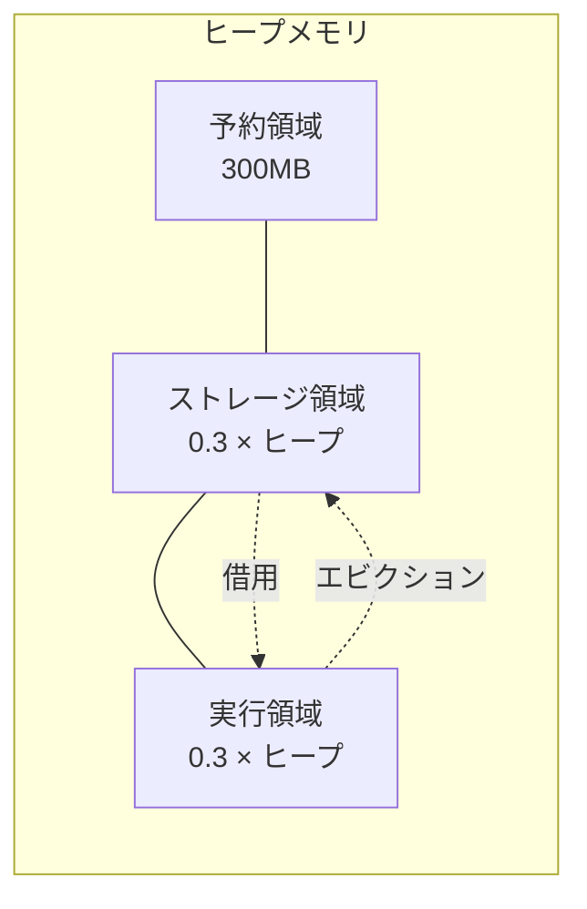

# 第13章 Unified Memory Manager

> 本章で読むソース
>
> - [`core/src/main/scala/org/apache/spark/memory/MemoryManager.scala` L39-L67](https://github.com/apache/spark/blob/v4.1.2/core/src/main/scala/org/apache/spark/memory/MemoryManager.scala#L39-L67)
> - [`core/src/main/scala/org/apache/spark/memory/MemoryManager.scala` L85-L155](https://github.com/apache/spark/blob/v4.1.2/core/src/main/scala/org/apache/spark/memory/MemoryManager.scala#L85-L155)
> - [`core/src/main/scala/org/apache/spark/memory/MemoryManager.scala` L222-L282](https://github.com/apache/spark/blob/v4.1.2/core/src/main/scala/org/apache/spark/memory/MemoryManager.scala#L222-L282)
> - [`core/src/main/scala/org/apache/spark/memory/UnifiedMemoryManager.scala` L58-L115](https://github.com/apache/spark/blob/v4.1.2/core/src/main/scala/org/apache/spark/memory/UnifiedMemoryManager.scala#L58-L115)
> - [`core/src/main/scala/org/apache/spark/memory/UnifiedMemoryManager.scala` L134-L204](https://github.com/apache/spark/blob/v4.1.2/core/src/main/scala/org/apache/spark/memory/UnifiedMemoryManager.scala#L134-L204)
> - [`core/src/main/scala/org/apache/spark/memory/UnifiedMemoryManager.scala` L206-L256](https://github.com/apache/spark/blob/v4.1.2/core/src/main/scala/org/apache/spark/memory/UnifiedMemoryManager.scala#L206-L256)
> - [`core/src/main/scala/org/apache/spark/memory/UnifiedMemoryManager.scala` L449-L491](https://github.com/apache/spark/blob/v4.1.2/core/src/main/scala/org/apache/spark/memory/UnifiedMemoryManager.scala#L449-L491)
> - [`core/src/main/java/org/apache/spark/memory/TaskMemoryManager.java` L56-L151](https://github.com/apache/spark/blob/v4.1.2/core/src/main/java/org/apache/spark/memory/TaskMemoryManager.java#L56-L151)
> - [`core/src/main/java/org/apache/spark/memory/TaskMemoryManager.java` L159-L199](https://github.com/apache/spark/blob/v4.1.2/core/src/main/java/org/apache/spark/memory/TaskMemoryManager.java#L159-L199)
> - [`core/src/main/java/org/apache/spark/memory/MemoryConsumer.java` L31-L67](https://github.com/apache/spark/blob/v4.1.2/core/src/main/java/org/apache/spark/memory/MemoryConsumer.java#L31-L67)

## この章の狙い

`UnifiedMemoryManager` は実行メモリとストレージメモリの間にソフト境界を設け、互いに借用を可能にする。
本章では `MemoryManager` の抽象クラス、`UnifiedMemoryManager` のの借用・エビクション機構、`TaskMemoryManager` と `MemoryConsumer` の関係を追う。

## 前提

`BlockManager` はブロック保存時に `MemoryManager` へストレージメモリを要求する（第12章）。
タスクは `TaskMemoryManager` 経由で実行メモリを取得する（第10章）。
両者は同一の `MemoryManager` インスタンスを共有する。

## 13.1 MemoryManager: 抽象クラス

`MemoryManager` は実行メモリとストレージメモリの割り当てを統括する抽象クラスである。

[`core/src/main/scala/org/apache/spark/memory/MemoryManager.scala` L39-L67](https://github.com/apache/spark/blob/v4.1.2/core/src/main/scala/org/apache/spark/memory/MemoryManager.scala#L39-L67)

```scala
private[spark] abstract class MemoryManager(
    conf: SparkConf,
    numCores: Int,
    onHeapStorageMemory: Long,
    onHeapExecutionMemory: Long) extends Logging {

  require(onHeapExecutionMemory > 0, "onHeapExecutionMemory must be > 0")

  @GuardedBy("this")
  protected val onHeapStorageMemoryPool = new StorageMemoryPool(this, MemoryMode.ON_HEAP)
  @GuardedBy("this")
  protected val offHeapStorageMemoryPool = new StorageMemoryPool(this, MemoryMode.OFF_HEAP)
  @GuardedBy("this")
  protected val onHeapExecutionMemoryPool = new ExecutionMemoryPool(this, MemoryMode.ON_HEAP)
  @GuardedBy("this")
  protected val offHeapExecutionMemoryPool = new ExecutionMemoryPool(this, MemoryMode.OFF_HEAP)

  onHeapStorageMemoryPool.incrementPoolSize(onHeapStorageMemory)
  onHeapExecutionMemoryPool.incrementPoolSize(onHeapExecutionMemory)

  protected[this] val maxOffHeapMemory = conf.get(MEMORY_OFFHEAP_SIZE)
  protected[this] val offHeapStorageMemory =
    (maxOffHeapMemory * conf.get(MEMORY_STORAGE_FRACTION)).toLong

  offHeapExecutionMemoryPool.incrementPoolSize(maxOffHeapMemory - offHeapStorageMemory)
  offHeapStorageMemoryPool.incrementPoolSize(offHeapStorageMemory)
  // ...
}
```

4つのプールを管理する。

- `onHeapExecutionMemoryPool`: オンヒープの実行メモリ。シャッフル、ジョイン、ソートに使う。
- `offHeapExecutionMemoryPool`: オフヒープの実行メモリ。
- `onHeapStorageMemoryPool`: オンヒープのストレージメモリ。キャッシュとブロードキャストに使う。
- `offHeapStorageMemoryPool`: オフヒープのストレージメモリ。

### 13.1.1 メモリ割り当てと解放のAPI

[`core/src/main/scala/org/apache/spark/memory/MemoryManager.scala` L85-L155](https://github.com/apache/spark/blob/v4.1.2/core/src/main/scala/org/apache/spark/memory/MemoryManager.scala#L85-L155)

```scala
final def setMemoryStore(store: MemoryStore): Unit = synchronized {
  onHeapStorageMemoryPool.setMemoryStore(store)
  offHeapStorageMemoryPool.setMemoryStore(store)
}

def acquireStorageMemory(blockId: BlockId, numBytes: Long, memoryMode: MemoryMode): Boolean

def acquireUnrollMemory(blockId: BlockId, numBytes: Long, memoryMode: MemoryMode): Boolean

private[memory]
def acquireExecutionMemory(
    numBytes: Long,
    taskAttemptId: Long,
    memoryMode: MemoryMode): Long

private[memory]
def releaseExecutionMemory(
    numBytes: Long,
    taskAttemptId: Long,
    memoryMode: MemoryMode): Unit = synchronized {
  memoryMode match {
    case MemoryMode.ON_HEAP => onHeapExecutionMemoryPool.releaseMemory(numBytes, taskAttemptId)
    case MemoryMode.OFF_HEAP => offHeapExecutionMemoryPool.releaseMemory(numBytes, taskAttemptId)
  }
}
// ...
```

`acquireExecutionMemory` はタスクが実行メモリを取得する際に呼ばれる。
`acquireStorageMemory` は `BlockManager` がブロックをメモリに保存する際に呼ばれる。
`releaseExecutionMemory` はタスク完了時にメモリを解放する。

### 13.1.2 Tungsten のメモリ設定

[`core/src/main/scala/org/apache/spark/memory/MemoryManager.scala` L228-L282](https://github.com/apache/spark/blob/v4.1.2/core/src/main/scala/org/apache/spark/memory/MemoryManager.scala#L228-L282)

```scala
final val tungstenMemoryMode: MemoryMode = {
  if (conf.get(MEMORY_OFFHEAP_ENABLED)) {
    require(conf.get(MEMORY_OFFHEAP_SIZE) > 0,
      "spark.memory.offHeap.size must be > 0 when spark.memory.offHeap.enabled == true")
    require(Platform.unaligned(),
      "No support for unaligned Unsafe. Set spark.memory.offHeap.enabled to false.")
    MemoryMode.OFF_HEAP
  } else {
    MemoryMode.ON_HEAP
  }
}

private lazy val defaultPageSizeBytes = {
  val minPageSize = 1L * 1024 * 1024   // 1MB
  val maxPageSize = 64L * minPageSize  // 64MB
  val cores = if (numCores > 0) numCores else Runtime.getRuntime.availableProcessors()
  val safetyFactor = 16
  val maxTungstenMemory: Long = tungstenMemoryMode match {
    case MemoryMode.ON_HEAP => onHeapExecutionMemoryPool.poolSize
    case MemoryMode.OFF_HEAP => offHeapExecutionMemoryPool.poolSize
  }
  val size = ByteArrayMethods.nextPowerOf2(maxTungstenMemory / cores / safetyFactor)
  val chosenPageSize = math.min(maxPageSize, math.max(minPageSize, size))
  // ...
}

val pageSizeBytes: Long = conf.get(BUFFER_PAGESIZE).getOrElse(defaultPageSizeBytes)

private[memory] final val tungstenMemoryAllocator: MemoryAllocator = {
  tungstenMemoryMode match {
    case MemoryMode.ON_HEAP => MemoryAllocator.HEAP
    case MemoryMode.OFF_HEAP => MemoryAllocator.UNSAFE
  }
}
```

`tungstenMemoryMode` はオフヒープが有効なら `OFF_HEAP`、そうでなければ `ON_HEAP` を返す。
`pageSizeBytes` は Tungsten がメモリページを割り当てるときのサイズである。
G1GC、ZGC、ShenandoahGC では `LONG_ARRAY_OFFSET` を引いてヒープリージョン境界に合わせる。

なぜ速いのか: ページサイズを2の累乗に揃えることで、メモリ割り当てのアラインメント保証とGCリージョン境界の整合を両立し、メモリの無駄を削減する。

## 13.2 UnifiedMemoryManager

`UnifiedMemoryManager` は実行とストレージの間にソフト境界を設ける実装である。

[`core/src/main/scala/org/apache/spark/memory/UnifiedMemoryManager.scala` L58-L115](https://github.com/apache/spark/blob/v4.1.2/core/src/main/scala/org/apache/spark/memory/UnifiedMemoryManager.scala#L58-L115)

```scala
private[spark] class UnifiedMemoryManager(
    conf: SparkConf,
    val maxHeapMemory: Long,
    onHeapStorageRegionSize: Long,
    numCores: Int)
  extends MemoryManager(
    conf,
    numCores,
    onHeapStorageRegionSize,
    maxHeapMemory - onHeapStorageRegionSize) with Logging  {

  private def assertInvariants(): Unit = {
    assert(onHeapExecutionMemoryPool.poolSize + onHeapStorageMemoryPool.poolSize == maxHeapMemory)
    assert(
      offHeapExecutionMemoryPool.poolSize + offHeapStorageMemoryPool.poolSize == maxOffHeapMemory)
  }

  assertInvariants()

  override def maxOnHeapStorageMemory: Long = synchronized {
    maxHeapMemory - onHeapExecutionMemoryPool.memoryUsed
  }

  override def maxOffHeapStorageMemory: Long = synchronized {
    maxOffHeapMemory - offHeapExecutionMemoryPool.memoryUsed
  }
  // ...
}
```

`assertInvariants` は実行プールとストレージプールの合計が常に `maxHeapMemory`（または `maxOffHeapMemory`）に等しいことを検証する。
この不変条件により、両プールは動的にサイズを調整できる。

### 13.2.1 メモリ領域の計算



`maxHeapMemory` は `(systemMemory - reservedMemory) × memoryFraction` で計算される。
デフォルトでは `memoryFraction = 0.6`、`reservedMemory = 300MB`、`storageFraction = 0.5` である。
1GBヒープの場合: `(1024 - 300) × 0.6 = 434MB` が共有領域、その半分（約217MB）がストレージの初期領域となる。

### 13.2.2 acquireExecutionMemory

[`core/src/main/scala/org/apache/spark/memory/UnifiedMemoryManager.scala` L134-L204](https://github.com/apache/spark/blob/v4.1.2/core/src/main/scala/org/apache/spark/memory/UnifiedMemoryManager.scala#L134-L204)

```scala
override private[memory] def acquireExecutionMemory(
    numBytes: Long,
    taskAttemptId: Long,
    memoryMode: MemoryMode): Long = synchronized {
  assertInvariants()
  assert(numBytes >= 0)
  val (executionPool, storagePool, storageRegionSize, maxMemory) = memoryMode match {
    case MemoryMode.ON_HEAP => (
      onHeapExecutionMemoryPool,
      onHeapStorageMemoryPool,
      onHeapStorageRegionSize,
      maxHeapMemory)
    case MemoryMode.OFF_HEAP => (
      offHeapExecutionMemoryPool,
      offHeapStorageMemoryPool,
      offHeapStorageMemory,
      maxOffHeapMemory)
  }

  def maybeGrowExecutionPool(extraMemoryNeeded: Long): Unit = {
    if (extraMemoryNeeded > 0) {
      val memoryReclaimableFromStorage = math.max(
        storagePool.memoryFree,
        storagePool.poolSize - storageRegionSize)
      if (memoryReclaimableFromStorage > 0) {
        val spaceToReclaim = storagePool.freeSpaceToShrinkPool(
          math.min(extraMemoryNeeded, memoryReclaimableFromStorage))
        storagePool.decrementPoolSize(spaceToReclaim)
        executionPool.incrementPoolSize(spaceToReclaim)
      }
    }
  }

  def computeMaxExecutionPoolSize(): Long = {
    val unmanagedMemory = getUnmanagedMemoryUsed(memoryMode)
    val availableMemory = maxMemory - math.min(storagePool.memoryUsed, storageRegionSize)
    math.max(0L, availableMemory - unmanagedMemory)
  }

  executionPool.acquireMemory(
    numBytes, taskAttemptId, maybeGrowExecutionPool, () => computeMaxExecutionPoolSize())
}
```

`maybeGrowExecutionPool` はストレージプールからメモリを回収して実行プールを拡大する。
回収可能な量は `storagePool.memoryFree`（空き）と `storagePool.poolSize - storageRegionSize`（借用分）の大きい方である。
ストレージプールの使用量が `storageRegionSize` を超えていれば、キャッシュブロックをエビクトして回収する。

`computeMaxExecutionPoolSize` はアンマネージドメモリ（RocksDB等）の使用量を差し引いた利用可能メモリを返す。
これにより、アンマネージドメモリが多くても過剰割り当てを防ぐ。

### 13.2.3 acquireStorageMemory

[`core/src/main/scala/org/apache/spark/memory/UnifiedMemoryManager.scala` L206-L248](https://github.com/apache/spark/blob/v4.1.2/core/src/main/scala/org/apache/spark/memory/UnifiedMemoryManager.scala#L206-L248)

```scala
override def acquireStorageMemory(
    blockId: BlockId,
    numBytes: Long,
    memoryMode: MemoryMode): Boolean = synchronized {
  assertInvariants()
  assert(numBytes >= 0)
  val (executionPool, storagePool, maxMemory) = memoryMode match {
    case MemoryMode.ON_HEAP => (
      onHeapExecutionMemoryPool,
      onHeapStorageMemoryPool,
      maxOnHeapStorageMemory)
    case MemoryMode.OFF_HEAP => (
      offHeapExecutionMemoryPool,
      offHeapStorageMemoryPool,
      maxOffHeapStorageMemory)
  }

  val unmanagedMemory = getUnmanagedMemoryUsed(memoryMode)
  val effectiveMaxMemory = math.max(0L, maxMemory - unmanagedMemory)

  if (numBytes > effectiveMaxMemory) {
    logInfo(log"Will not store ${MDC(BLOCK_ID, blockId)} as the required space" +
      log" (${MDC(NUM_BYTES, numBytes)} bytes) exceeds our" +
      log" memory limit (${MDC(NUM_BYTES_MAX, effectiveMaxMemory)} bytes)")
    return false
  }
  if (numBytes > storagePool.memoryFree) {
    val memoryBorrowedFromExecution = Math.min(executionPool.memoryFree,
      numBytes - storagePool.memoryFree)
    executionPool.decrementPoolSize(memoryBorrowedFromExecution)
    storagePool.incrementPoolSize(memoryBorrowedFromExecution)
  }
  storagePool.acquireMemory(blockId, numBytes)
}
```

ストレージメモリも実行メモリから借用できる。
実行プールの空きをストレージプールに移動させることで、実行がメモリを使っていなければストレージが最大限使える。
ただし実行メモリはストレージによってエビクトされない。
実行が先にメモリを確保した場合、ストレージはエビクションで対応する。

### 13.2.4 ファクトリメソッド

[`core/src/main/scala/org/apache/spark/memory/UnifiedMemoryManager.scala` L449-L491](https://github.com/apache/spark/blob/v4.1.2/core/src/main/scala/org/apache/spark/memory/UnifiedMemoryManager.scala#L449-L491)

```scala
def apply(conf: SparkConf, numCores: Int): UnifiedMemoryManager = {
  val maxMemory = getMaxMemory(conf)
  new UnifiedMemoryManager(
    conf,
    maxHeapMemory = maxMemory,
    onHeapStorageRegionSize =
      (maxMemory * conf.get(config.MEMORY_STORAGE_FRACTION)).toLong,
    numCores = numCores)
}

private def getMaxMemory(conf: SparkConf): Long = {
  val systemMemory = conf.get(TEST_MEMORY)
  val reservedMemory = conf.getLong(TEST_RESERVED_MEMORY.key,
    if (conf.contains(IS_TESTING)) 0 else RESERVED_SYSTEM_MEMORY_BYTES)
  val minSystemMemory = (reservedMemory * 1.5).ceil.toLong
  if (systemMemory < minSystemMemory) {
    throw new SparkIllegalArgumentException(
      errorClass = "INVALID_DRIVER_MEMORY",
      messageParameters = Map(
        "systemMemory" -> systemMemory.toString,
        "minSystemMemory" -> minSystemMemory.toString,
        "config" -> config.DRIVER_MEMORY.key))
  }
  // ...
  val usableMemory = systemMemory - reservedMemory
  val memoryFraction = conf.get(config.MEMORY_FRACTION)
  (usableMemory * memoryFraction).toLong
}
```

`RESERVED_SYSTEM_MEMORY_BYTES` は300MBである。
`getMaxMemory` はシステムメモリから予約領域を引き、`memoryFraction`（デフォルト0.6）を掛ける。
メモリが不足していれば早期に例外を投げて fail-fast する。

## 13.3 TaskMemoryManager: タスク単位のメモリ管理

`TaskMemoryManager` は各タスクのメモリ割り当てを管理する。

[`core/src/main/java/org/apache/spark/memory/TaskMemoryManager.java` L56-L151](https://github.com/apache/spark/blob/v4.1.2/core/src/main/java/org/apache/spark/memory/TaskMemoryManager.java#L56-L151)

```java
public class TaskMemoryManager {

  private static final int PAGE_NUMBER_BITS = 13;
  static final int OFFSET_BITS = 64 - PAGE_NUMBER_BITS;  // 51
  private static final int PAGE_TABLE_SIZE = 1 << PAGE_NUMBER_BITS;
  public static final long MAXIMUM_PAGE_SIZE_BYTES = ((1L << 31) - 1) * 8L;

  private final MemoryBlock[] pageTable = new MemoryBlock[PAGE_TABLE_SIZE];
  private final BitSet allocatedPages = new BitSet(PAGE_TABLE_SIZE);
  private final MemoryManager memoryManager;
  private final long taskAttemptId;
  final MemoryMode tungstenMemoryMode;

  @GuardedBy("this")
  private final HashSet<MemoryConsumer> consumers;

  public TaskMemoryManager(MemoryManager memoryManager, long taskAttemptId) {
    this.tungstenMemoryMode = memoryManager.tungstenMemoryMode();
    this.memoryManager = memoryManager;
    this.taskAttemptId = taskAttemptId;
    this.consumers = new HashSet<>();
  }
  // ...
}
```

`TaskMemoryManager` は64ビットロングでオフヒープアドレスを符号化し、オンヒープモードでは上位13ビットをページ番号、下位51ビットをオフセットとして使う。
これにより8192ページ、約140テラバイトのアドレス空間を実現する。

### 13.3.1 acquireExecutionMemory と spill

[`core/src/main/java/org/apache/spark/memory/TaskMemoryManager.java` L159-L199](https://github.com/apache/spark/blob/v4.1.2/core/src/main/java/org/apache/spark/memory/TaskMemoryManager.java#L159-L199)

```java
public long acquireExecutionMemory(long required, MemoryConsumer requestingConsumer) {
  assert(required >= 0);
  assert(requestingConsumer != null);
  MemoryMode mode = requestingConsumer.getMode();
  synchronized (this) {
    long got = memoryManager.acquireExecutionMemory(required, taskAttemptId, mode);

    if (got < required) {
      // ...
      TreeMap<Long, List<MemoryConsumer>> sortedConsumers = new TreeMap<>();
      for (MemoryConsumer c: consumers) {
        if (c.getUsed() > 0 && c.getMode() == mode) {
          long key = c == requestingConsumer ? 0 : c.getUsed();
          List<MemoryConsumer> list =
              sortedConsumers.computeIfAbsent(key, k -> new ArrayList<>(1));
          list.add(c);
        }
      }
      // ...
    }
    // ...
  }
}
```

メモリが不足すれば `MemoryConsumer` を使用量でソートし、最小のコンシューマから `spill()` を呼んでディスクに溢れさせる。
要求中のコンシューマ自身は優先度0（最低）に設定され、他のコンシューマを優先的に spill させる。

なぜ速いのか: 最小のコンシューマから spill することで、spill ファイルの数を最小化し、小さな spill ファイルの生成を抑える。

## 13.4 MemoryConsumer: メモリ消費の抽象

`MemoryConsumer` は `TaskMemoryManager` のメモリを消費する抽象クラスである。

[`core/src/main/java/org/apache/spark/memory/MemoryConsumer.java` L31-L67](https://github.com/apache/spark/blob/v4.1.2/core/src/main/java/org/apache/spark/memory/MemoryConsumer.java#L31-L67)

```java
public abstract class MemoryConsumer {

  protected final TaskMemoryManager taskMemoryManager;
  private final long pageSize;
  private final MemoryMode mode;
  protected long used;

  protected MemoryConsumer(TaskMemoryManager taskMemoryManager, long pageSize, MemoryMode mode) {
    this.taskMemoryManager = taskMemoryManager;
    this.pageSize = pageSize;
    this.mode = mode;
  }

  protected MemoryConsumer(TaskMemoryManager taskMemoryManager, MemoryMode mode) {
    this(taskMemoryManager, taskMemoryManager.pageSizeBytes(), mode);
  }

  public MemoryMode getMode() {
    return mode;
  }

  public long getUsed() {
    return used;
  }

  public void spill() throws IOException {
    spill(Long.MAX_VALUE, this);
  }

  public abstract long spill(long size, MemoryConsumer trigger) throws IOException;
}
```

`MemoryConsumer` の実装には `UnsafeHashedRelation`、`UnsafeFixedWidthAggregationMap`、`UnsafeExternalSorter` 等がある。
`spill` はサブクラスが実装し、ディスクへの書き出しでメモリを解放する。
`allocateArray` は `TaskMemoryManager` にページを割り当て、`LongArray` を返す。

## まとめ

本章では `UnifiedMemoryManager` の設計を追った。

- `MemoryManager` は4つのメモリプール（オンヒープ/オフヒープ × 実行/ストレージ）を管理する。
- `UnifiedMemoryManager` は実行とストレージの間にソフト境界を設け、双方向の借用を可能にする。
- 実行メモリはストレージのキャッシュブロックをエビクトして回収できる。
- ストレージメモリは実行プールの空きを借用できるが、実行メモリはエビクトされない。
- `TaskMemoryManager` は64ビットロングでページテーブルを構成し、約140テラバイトをアドレス可能にする。
- `MemoryConsumer` は spill によりメモリ不足を解消する抽象を提供する。
- アンマネージドメモリ（RocksDB等）の使用量をポーリングで追跡し、過剰割り当てを防ぐ。

## 関連する章

- 第10章: タスクのメモリ管理（`TaskMemoryManager` の詳細）
- 第12章: BlockManager（ストレージメモリの利用者）
- 第14章: ディスクストアとメモリストア（`MemoryStore` のエビクション機構）
- 第18章: Tungsten（オフヒープメモリとページアロケーション）
