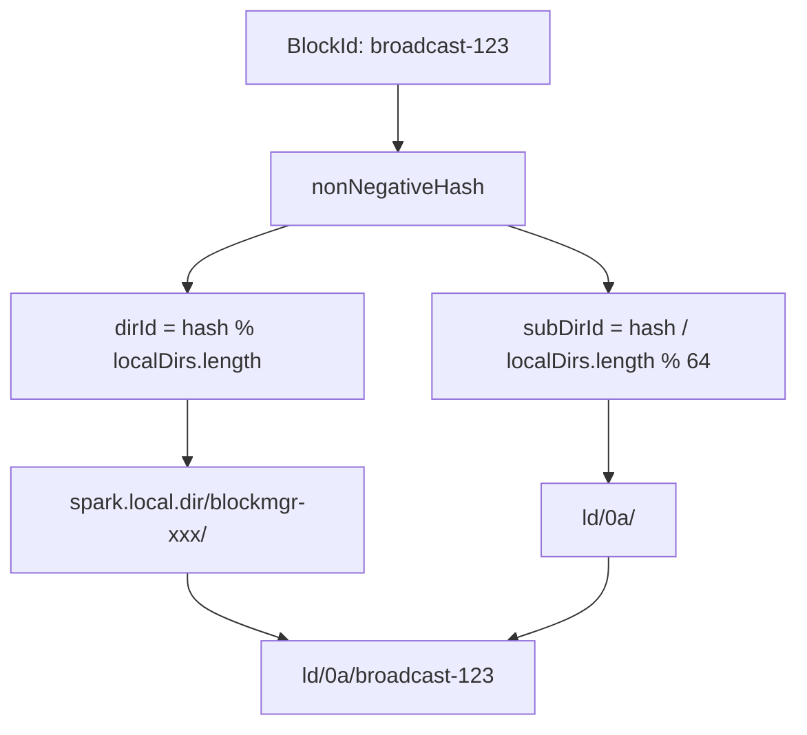

# 第14章 ディスクストアとメモリストア

> 本章で読むソース
>
> - [`core/src/main/scala/org/apache/spark/storage/memory/MemoryStore.scala` L82-L119](https://github.com/apache/spark/blob/v4.1.2/core/src/main/scala/org/apache/spark/storage/memory/MemoryStore.scala#L82-L119)
> - [`core/src/main/scala/org/apache/spark/storage/memory/MemoryStore.scala` L146-L167](https://github.com/apache/spark/blob/v4.1.2/core/src/main/scala/org/apache/spark/storage/memory/MemoryStore.scala#L146-L167)
> - [`core/src/main/scala/org/apache/spark/storage/memory/MemoryStore.scala` L190-L297](https://github.com/apache/spark/blob/v4.1.2/core/src/main/scala/org/apache/spark/storage/memory/MemoryStore.scala#L190-L297)
> - [`core/src/main/scala/org/apache/spark/storage/memory/MemoryStore.scala` L472-L499](https://github.com/apache/spark/blob/v4.1.2/core/src/main/scala/org/apache/spark/storage/memory/MemoryStore.scala#L472-L499)
> - [`core/src/main/scala/org/apache/spark/storage/DiskStore.scala` L45-L115](https://github.com/apache/spark/blob/v4.1.2/core/src/main/scala/org/apache/spark/storage/DiskStore.scala#L45-L115)
> - [`core/src/main/scala/org/apache/spark/storage/DiskStore.scala` L174-L235](https://github.com/apache/spark/blob/v4.1.2/core/src/main/scala/org/apache/spark/storage/DiskStore.scala#L174-L235)
> - [`core/src/main/scala/org/apache/spark/storage/DiskBlockManager.scala` L51-L126](https://github.com/apache/spark/blob/v4.1.2/core/src/main/scala/org/apache/spark/storage/DiskBlockManager.scala#L51-L126)
> - [`core/src/main/scala/org/apache/spark/storage/DiskBlockManager.scala` L246-L264](https://github.com/apache/spark/blob/v4.1.2/core/src/main/scala/org/apache/spark/storage/DiskBlockManager.scala#L246-L264)
> - [`core/src/main/scala/org/apache/spark/storage/DiskBlockObjectWriter.scala` L45-L99](https://github.com/apache/spark/blob/v4.1.2/core/src/main/scala/org/apache/spark/storage/DiskBlockObjectWriter.scala#L45-L99)
> - [`core/src/main/scala/org/apache/spark/storage/DiskBlockObjectWriter.scala` L236-L264](https://github.com/apache/spark/blob/v4.1.2/core/src/main/scala/org/apache/spark/storage/DiskBlockObjectWriter.scala#L236-L264)
> - [`core/src/main/scala/org/apache/spark/storage/DiskBlockObjectWriter.scala` L274-L307](https://github.com/apache/spark/blob/v4.1.2/core/src/main/scala/org/apache/spark/storage/DiskBlockObjectWriter.scala#L274-L307)

## この章の狙い

`MemoryStore` と `DiskStore` は `BlockManager` の下位ストレージ層として、ブロックのメモリ保存とディスク保存を担う。
本章では `MemoryStore` のアンロールとエビクション、`DiskStore` のファイルI/O、`DiskBlockManager` のディレクトリ構造、`DiskBlockObjectWriter` のアトミックコミット機構を追う。

## 前提

`BlockManager` は `doPut` で保存先を決定し、`MemoryStore` または `DiskStore` に委譲する（第12章）。
`UnifiedMemoryManager` がストレージメモリの割り当てを管理する（第13章）。
タスク終了時に `BlockManager.releaseAllLocksForTask` がロックを解放する（第9章）。

## 14.1 MemoryStore: メモリ上のブロック保存

`MemoryStore` はブロックをメモリ上に保存する。

[`core/src/main/scala/org/apache/spark/storage/memory/MemoryStore.scala` L82-L119](https://github.com/apache/spark/blob/v4.1.2/core/src/main/scala/org/apache/spark/storage/memory/MemoryStore.scala#L82-L119)

```scala
private[spark] class MemoryStore(
    conf: SparkConf,
    blockInfoManager: BlockInfoManager,
    serializerManager: SerializerManager,
    memoryManager: MemoryManager,
    blockEvictionHandler: BlockEvictionHandler)
  extends Logging {

  private val entries = new LinkedHashMap[BlockId, MemoryEntry[_]](32, 0.75f, true)

  private val onHeapUnrollMemoryMap = mutable.HashMap[Long, Long]()
  private val offHeapUnrollMemoryMap = mutable.HashMap[Long, Long]()

  private val unrollMemoryThreshold: Long =
    conf.get(STORAGE_UNROLL_MEMORY_THRESHOLD)

  private def maxMemory: Long = {
    memoryManager.maxOnHeapStorageMemory + memoryManager.maxOffHeapStorageMemory
  }
  // ...
}
```

`entries` は `LinkedHashMap` で、アクセス順序を保持する。
第3引数の `true` はアクセス順（LRU）を有効にする。
エントリには2種類がある。

- `DeserializedMemoryEntry`: JVM オブジェクトの配列として保持。`MEMORY_ONLY` で使う。
- `SerializedMemoryEntry`: `ChunkedByteBuffer` として保持。`MEMORY_ONLY_SER` で使う。

### 14.1.1 putBytes: シリアライズ済みバイトの保存

[`core/src/main/scala/org/apache/spark/storage/memory/MemoryStore.scala` L146-L167](https://github.com/apache/spark/blob/v4.1.2/core/src/main/scala/org/apache/spark/storage/memory/MemoryStore.scala#L146-L167)

```scala
def putBytes[T: ClassTag](
    blockId: BlockId,
    size: Long,
    memoryMode: MemoryMode,
    _bytes: () => ChunkedByteBuffer): Boolean = {
  require(!contains(blockId), s"Block $blockId is already present in the MemoryStore")
  if (memoryManager.acquireStorageMemory(blockId, size, memoryMode)) {
    val bytes = _bytes()
    assert(bytes.size == size)
    val entry = new SerializedMemoryEntry[T](bytes, memoryMode, implicitly[ClassTag[T]])
    entries.synchronized {
      entries.put(blockId, entry)
    }
    logInfo(log"Block ${MDC(BLOCK_ID, blockId)} stored as bytes in memory " +
      log"(estimated size ${MDC(SIZE, Utils.bytesToString(size))}, " +
      log"free ${MDC(MEMORY_SIZE, Utils.bytesToString(maxMemory - blocksMemoryUsed))})")
    true
  } else {
    false
  }
}
```

`_bytes` は遅延評価のラムダである。
`acquireStorageMemory` が成功するまで `ChunkedByteBuffer` を生成せず、メモリの無駄を避ける。
なぜ速いのか: メモリ取得前にバッファを割り当てないことで、メモリ不足時の不要なGC圧を回避する。

### 14.1.2 putIterator: アンロール処理

`putIterator` はイテレータを安全にメモリ上で展開する。

[`core/src/main/scala/org/apache/spark/storage/memory/MemoryStore.scala` L190-L297](https://github.com/apache/spark/blob/v4.1.2/core/src/main/scala/org/apache/spark/storage/memory/MemoryStore.scala#L190-L297)

```scala
private def putIterator[T](
    blockId: BlockId,
    values: Iterator[T],
    classTag: ClassTag[T],
    memoryMode: MemoryMode,
    valuesHolder: ValuesHolder[T]): Either[Long, Long] = {
  require(!contains(blockId), s"Block $blockId is already present in the MemoryStore")

  var elementsUnrolled = 0
  var keepUnrolling = true
  val initialMemoryThreshold = unrollMemoryThreshold
  val memoryCheckPeriod = conf.get(UNROLL_MEMORY_CHECK_PERIOD)
  var memoryThreshold = initialMemoryThreshold
  val memoryGrowthFactor = conf.get(UNROLL_MEMORY_GROWTH_FACTOR)
  var unrollMemoryUsedByThisBlock = 0L

  keepUnrolling =
    reserveUnrollMemoryForThisTask(blockId, initialMemoryThreshold, memoryMode)

  if (!keepUnrolling) {
    logWarning(log"Failed to reserve initial memory threshold of " +
      log"${MDC(NUM_BYTES, Utils.bytesToString(initialMemoryThreshold))} " +
      log"for computing block ${MDC(BLOCK_ID, blockId)} in memory.")
  } else {
    unrollMemoryUsedByThisBlock += initialMemoryThreshold
  }
  // ...
  while (values.hasNext && keepUnrolling &&
    (!shouldCheckThreadInterruption || !Thread.currentThread().isInterrupted)) {
    valuesHolder.storeValue(values.next())
    if (elementsUnrolled % memoryCheckPeriod == 0) {
      val currentSize = valuesHolder.estimatedSize()
      if (currentSize >= memoryThreshold) {
        val amountToRequest = (currentSize * memoryGrowthFactor - memoryThreshold).toLong
        keepUnrolling =
          reserveUnrollMemoryForThisTask(blockId, amountToRequest, memoryMode)
        if (keepUnrolling) {
          unrollMemoryUsedByThisBlock += amountToRequest
        }
        memoryThreshold += amountToRequest
      }
    }
    elementsUnrolled += 1
  }
  // ...
  if (keepUnrolling) {
    val entryBuilder = valuesHolder.getBuilder()
    val size = entryBuilder.preciseSize
    if (size > unrollMemoryUsedByThisBlock) {
      val amountToRequest = size - unrollMemoryUsedByThisBlock
      keepUnrolling = reserveUnrollMemoryForThisTask(blockId, amountToRequest, memoryMode)
      if (keepUnrolling) {
        unrollMemoryUsedByThisBlock += amountToRequest
      }
    }
    if (keepUnrolling) {
      val entry = entryBuilder.build()
      memoryManager.synchronized {
        releaseUnrollMemoryForThisTask(memoryMode, unrollMemoryUsedByThisBlock)
        val success = memoryManager.acquireStorageMemory(blockId, entry.size, memoryMode)
        assert(success, "transferring unroll memory to storage memory failed")
      }
      entries.synchronized {
        entries.put(blockId, entry)
      }
      // ...
      Right(entry.size)
    } else {
      Left(unrollMemoryUsedByThisBlock)
    }
  } else {
    Left(unrollMemoryUsedByThisBlock)
  }
}
```

アンロール処理は以下の段階で進む。

1. `unrollMemoryThreshold` の初期メモリを確保する。
2. イテレータの要素を1つずつ `valuesHolder` に格納する。
3. `memoryCheckPeriod` 要素ごとにサイズをチェックし、閾値を超えれば追加メモリを確保する。
4. 確保量が `memoryGrowthFactor` 倍ずつ増加する（指数関数的成長）。
5. 全要素を展開できれば、アンロールメモリをストレージメモリに移行する。
6. メモリ不足なら `Left(unrollMemoryUsedByThisBlock)` を返し、呼び出し元でディスクへのフォールバックや部分的なイテレータの返却を行う。

なぜ速いのか: 指数関数的なメモリ確保（`memoryGrowthFactor`）により、メモリ確保の呼び出し回数を O(log N) に抑える。
同時に、`memoryCheckPeriod` ごとにチェックすることで、実際サイズとの乖離を最小化する。

### 14.1.3 evictBlocksToFreeSpace: エビクション

[`core/src/main/scala/org/apache/spark/storage/memory/MemoryStore.scala` L472-L499](https://github.com/apache/spark/blob/v4.1.2/core/src/main/scala/org/apache/spark/storage/memory/MemoryStore.scala#L472-L499)

```scala
private[spark] def evictBlocksToFreeSpace(
    blockId: Option[BlockId],
    space: Long,
    memoryMode: MemoryMode): Long = {
  assert(space > 0)
  memoryManager.synchronized {
    var freedMemory = 0L
    val rddToAdd = blockId.flatMap(getRddId)
    val selectedBlocks = new ArrayBuffer[BlockId]
    def blockIsEvictable(blockId: BlockId, entry: MemoryEntry[_]): Boolean = {
      entry.memoryMode == memoryMode && (rddToAdd.isEmpty || rddToAdd != getRddId(blockId))
    }
    entries.synchronized {
      val iterator = entries.entrySet().iterator()
      while (freedMemory < space && iterator.hasNext) {
        val pair = iterator.next()
        val blockId = pair.getKey
        val entry = pair.getValue
        if (blockIsEvictable(blockId, entry)) {
          if (blockInfoManager.lockForWriting(blockId, blocking = false).isDefined) {
            selectedBlocks += blockId
            freedMemory += entry.size
          }
        }
      }
    }
    // ...
  }
}
```

`LinkedHashMap` のアクセス順イテレータにより、LRU で最も古いブロックからエビクト対象に選ぶ。
`rddToAdd` と同じRDDのブロックはエビクトしない。
これは同一RDDのブロックを循環的に置き換える無駄（SPARK-1092）を防ぐためである。
`lockForWriting(blocking = false)` はノンブロッキングで書き込みロックを試み、読み取り中のブロックはスキップする。

## 14.2 DiskStore: ディスク上のブロック保存

`DiskStore` はブロックをディスクファイルとして保存する。

[`core/src/main/scala/org/apache/spark/storage/DiskStore.scala` L45-L115](https://github.com/apache/spark/blob/v4.1.2/core/src/main/scala/org/apache/spark/storage/DiskStore.scala#L45-L115)

```scala
private[spark] class DiskStore(
    conf: SparkConf,
    diskManager: DiskBlockManager,
    securityManager: SecurityManager) extends Logging {

  private val minMemoryMapBytes = conf.get(config.STORAGE_MEMORY_MAP_THRESHOLD)
  private val maxMemoryMapBytes = conf.get(config.MEMORY_MAP_LIMIT_FOR_TESTS)
  private val blockSizes = new ConcurrentHashMap[BlockId, Long]()

  def getSize(blockId: BlockId): Long = blockSizes.get(blockId)

  def put(blockId: BlockId)(writeFunc: WritableByteChannel => Unit): Unit = {
    if (contains(blockId)) {
      logWarning(log"Block ${MDC(BLOCK_ID, blockId)} is already present in the disk store")
      try {
        diskManager.getFile(blockId).delete()
      } catch {
        case e: Exception =>
          throw SparkException.internalError(
            s"Block $blockId is already present in the disk store and could not delete it $e",
            category = "STORAGE")
      }
    }
    logDebug(s"Attempting to put block $blockId")
    val startTimeNs = System.nanoTime()
    val file = diskManager.getFile(blockId)

    if (shuffleServiceFetchRddEnabled) {
      diskManager.createWorldReadableFile(file)
    }
    val out = new CountingWritableChannel(openForWrite(file))
    var threwException: Boolean = true
    try {
      writeFunc(out)
      blockSizes.put(blockId, out.getCount)
      threwException = false
    } finally {
      try {
        out.close()
      } catch {
        case ioe: IOException =>
          if (!threwException) {
            threwException = true
            throw ioe
          }
      } finally {
         if (threwException) {
          remove(blockId)
        }
      }
    }
    // ...
  }
}
```

`put` は `WritableByteChannel` をコールバックに渡し、呼び出し元がデータを書き込む。
`CountingWritableChannel` が書き込みバイト数を追跡し、`blockSizes` に保存する。
例外発生時は `finally` でファイルを削除し、不完全なブロックを残さない。

### 14.2.1 DiskBlockData: 読み出し

[`core/src/main/scala/org/apache/spark/storage/DiskStore.scala` L174-L235](https://github.com/apache/spark/blob/v4.1.2/core/src/main/scala/org/apache/spark/storage/DiskStore.scala#L174-L235)

```scala
private class DiskBlockData(
    minMemoryMapBytes: Long,
    maxMemoryMapBytes: Long,
    file: File,
    blockSize: Long) extends BlockData {

  override def toInputStream(): InputStream = new FileInputStream(file)

  override def toNetty(): AnyRef = new DefaultFileRegion(file, 0, size)

  override def toByteBuffer(): ByteBuffer = {
    require(blockSize < maxMemoryMapBytes,
      s"can't create a byte buffer of size $blockSize" +
      s" since it exceeds ${Utils.bytesToString(maxMemoryMapBytes)}.")
    Utils.tryWithResource(open()) { channel =>
      if (blockSize < minMemoryMapBytes) {
        val buf = ByteBuffer.allocate(blockSize.toInt)
        JavaUtils.readFully(channel, buf)
        buf.flip()
        buf
      } else {
        channel.map(MapMode.READ_ONLY, 0, file.length)
      }
    }
  }

  override def size: Long = blockSize
  override def dispose(): Unit = {}
  // ...
}
```

`toNetty` は `DefaultFileRegion` を返し、OS の `sendfile` システムコールでゼロコピー転送を実現する。
`toByteBuffer` は小さなファイル（`minMemoryMapBytes` 未満）は直接読み込み、大きなファイルはメモリマップを使う。

なぜ速いのか: `DefaultFileRegion` はカーネル空間からネットワークソケットへ直接データを送る（`sendfile`）。
ユーザー空間へのコピーが発生しないため、CPU オーバーヘッドとメモリ帯域幅の消費を最小化できる。

## 14.3 DiskBlockManager: ディレクトリ構造

`DiskBlockManager` は論理ブロックIDと物理ファイルパスのマッピングを管理する。

[`core/src/main/scala/org/apache/spark/storage/DiskBlockManager.scala` L51-L126](https://github.com/apache/spark/blob/v4.1.2/core/src/main/scala/org/apache/spark/storage/DiskBlockManager.scala#L51-L126)

```scala
private[spark] class DiskBlockManager(
    conf: SparkConf,
    var deleteFilesOnStop: Boolean,
    isDriver: Boolean)
  extends Logging {

  private[spark] val subDirsPerLocalDir = conf.get(config.DISKSTORE_SUB_DIRECTORIES)

  private[spark] val localDirs: Array[File] = createLocalDirs(conf)
  if (localDirs.isEmpty) {
    logError("Failed to create any local dir.")
    System.exit(ExecutorExitCode.DISK_STORE_FAILED_TO_CREATE_DIR)
  }

  private[spark] val localDirsString: Array[String] = localDirs.map(_.toString)

  private val subDirs = Array.fill(localDirs.length)(new Array[File](subDirsPerLocalDir))

  def getFile(filename: String): File = {
    val hash = Utils.nonNegativeHash(filename)
    val dirId = hash % localDirs.length
    val subDirId = (hash / localDirs.length) % subDirsPerLocalDir

    val subDir = subDirs(dirId).synchronized {
      val old = subDirs(dirId)(subDirId)
      if (old != null) {
        old
      } else {
        val newDir = new File(localDirs(dirId), "%02x".format(subDirId))
        if (!newDir.exists()) {
          val path = newDir.toPath
          Files.createDirectory(path)
          // ...
        }
        subDirs(dirId)(subDirId) = newDir
        newDir
      }
    }

    new File(subDir, filename)
  }
}
```

ブロックファイルは `spark.local.dir` のディレクトリ群にハッシュ分散される。
各ローカルディレクトリ内には `subDirsPerLocalDir`（デフォルト64）のサブディレクトリがあり、ファイル名のハッシュで配置先が決まる。



この2段ハッシュにより、1つのディレクトリにファイルが集中するのを防ぎ、ファイルシステムのI/O性能を維持する。

### 14.3.1 ローカルディレクトリの作成

[`core/src/main/scala/org/apache/spark/storage/DiskBlockManager.scala` L251-L264](https://github.com/apache/spark/blob/v4.1.2/core/src/main/scala/org/apache/spark/storage/DiskBlockManager.scala#L251-L264)

```scala
private def createLocalDirs(conf: SparkConf): Array[File] = {
  Utils.getConfiguredLocalDirs(conf).flatMap { rootDir =>
    try {
      val localDir = Utils.createDirectory(rootDir, "blockmgr")
      logInfo(log"Created local directory at ${MDC(PATH, localDir)}")
      Some(localDir)
    } catch {
      case e: IOException =>
        logError(
          log"Failed to create local dir in ${MDC(PATH, rootDir)}. Ignoring this directory.", e)
        None
    }
  }
}
```

`blockmgr-<UUID>` ディレクトリを各ローカルパスの下に作成する。
複数の `spark.local.dir` を指定すれば、I/O を複数ディスクに分散できる。

## 14.4 DiskBlockObjectWriter: アトミックなディスク書き込み

`DiskBlockObjectWriter` はJVMオブジェクトをディスクファイルに直接書き込む。

[`core/src/main/scala/org/apache/spark/storage/DiskBlockObjectWriter.scala` L45-L99](https://github.com/apache/spark/blob/v4.1.2/core/src/main/scala/org/apache/spark/storage/DiskBlockObjectWriter.scala#L45-L99)

```scala
private[spark] class DiskBlockObjectWriter(
    val file: File,
    serializerManager: SerializerManager,
    serializerInstance: SerializerInstance,
    bufferSize: Int,
    syncWrites: Boolean,
    writeMetrics: ShuffleWriteMetricsReporter,
    val blockId: BlockId = null)
  extends OutputStream
  with Logging
  with PairsWriter {

  private var channel: FileChannel = null
  private var mcs: ManualCloseOutputStream = null
  private var bs: OutputStream = null
  private var fos: FileOutputStream = null
  private var ts: TimeTrackingOutputStream = null
  private var objOut: SerializationStream = null
  private var initialized = false
  private var streamOpen = false
  private var hasBeenClosed = false

  private var committedPosition = file.length()
  private var reportedPosition = committedPosition
  // ...
}
```

ストリームの階層構造は以下の通りである。

- `FileOutputStream`: ファイルへの出力。
- `TimeTrackingOutputStream`: 書き込み時間を計測。
- `BufferedOutputStream`: バッファリング。
- `SerializationStream`: オブジェクトのシリアライズ。

### 14.4.1 commitAndGet: アトミックコミット

[`core/src/main/scala/org/apache/spark/storage/DiskBlockObjectWriter.scala` L236-L264](https://github.com/apache/spark/blob/v4.1.2/core/src/main/scala/org/apache/spark/storage/DiskBlockObjectWriter.scala#L236-L264)

```scala
def commitAndGet(): FileSegment = {
  if (streamOpen) {
    objOut.flush()
    bs.flush()
    objOut.close()
    streamOpen = false

    if (syncWrites) {
      val start = System.nanoTime()
      fos.getFD.sync()
      writeMetrics.incWriteTime(System.nanoTime() - start)
    }

    val pos = channel.position()
    val fileSegment = new FileSegment(file, committedPosition, pos - committedPosition)
    committedPosition = pos
    writeMetrics.incBytesWritten(committedPosition - reportedPosition)
    reportedPosition = committedPosition
    numRecordsCommitted += numRecordsWritten
    numRecordsWritten = 0
    fileSegment
  } else {
    new FileSegment(file, committedPosition, 0)
  }
}
```

`commitAndGet` は以下の処理を行う。

1. シリアライザとバッファをフラッシュする。
2. `syncWrites` が有効なら `fos.getFD.sync()` でデータをディスクに強制書き込む。
3. `FileSegment`（ファイル、オフセット、長さ）を返す。
4. `committedPosition` を現在位置に更新する。

`FileSegment` はシャッフルのインデックスファイルで各レコードグループの位置を記録するために使われる。

### 14.4.2 revertPartialWritesAndClose: 部分的書き込みの取り消し

[`core/src/main/scala/org/apache/spark/storage/DiskBlockObjectWriter.scala` L274-L307](https://github.com/apache/spark/blob/v4.1.2/core/src/main/scala/org/apache/spark/storage/DiskBlockObjectWriter.scala#L274-L307)

```scala
def revertPartialWritesAndClose(): File = {
  Utils.tryWithSafeFinally {
    if (initialized) {
      writeMetrics.decBytesWritten(reportedPosition - committedPosition)
      writeMetrics.decRecordsWritten(numRecordsWritten)
      streamOpen = false
      closeResources()
    }
  } {
    var truncateStream: FileOutputStream = null
    try {
      truncateStream = new FileOutputStream(file, true)
      truncateStream.getChannel.truncate(committedPosition)
    } catch {
      case ce: ClosedByInterruptException =>
        logError(log"Exception occurred while reverting partial writes to file "
          + log"${MDC(PATH, file)}, ${MDC(ERROR, ce.getMessage)}")
      case e: Exception =>
        logError(
          log"Uncaught exception while reverting partial writes to file ${MDC(PATH, file)}", e)
    } finally {
      if (truncateStream != null) {
        truncateStream.close()
        truncateStream = null
      }
    }
  }
  file
}
```

例外発生時、`revertPartialWritesAndClose` はファイルを `committedPosition` まで切り詰める。
これにより、コミットされていない部分的な書き込みが破棄され、データの整合性が保たれる。
メトリクスからも未コミットのバイト数とレコード数が差し引かれる。

なぜ速いのか: ファイルチャネルを再利用し、コミットごとにファイルを閉じ開きしない。
`revertPartialWritesAndClose` は `truncate` で部分的な書き込みだけを原子的に取り消すため、ファイル全体を書き直す必要がない。

## まとめ

本章では `MemoryStore`、`DiskStore`、`DiskBlockManager`、`DiskBlockObjectWriter` を追った。

- `MemoryStore` は `LinkedHashMap`（LRU）でブロックを管理し、アンロール処理で安全にメモリを確保する。
- エビクションはLRU順で行い、同一RDDの循環置換を防ぐ。
- `DiskStore` は `CountingWritableChannel` で書き込みサイズを追跡し、例外時にファイルを削除する。
- `DiskBlockData` は `DefaultFileRegion` で `sendfile` によるゼロコピー転送を実現する。
- `DiskBlockManager` は2段ハッシュでブロックファイルを分散配置し、I/O のホットスポットを回避する。
- `DiskBlockObjectWriter` はファイルチャネルを再利用し、アトミックコミットと部分的書き込みの取り消しを提供する。

## 関連する章

- 第12章: BlockManager（`MemoryStore` と `DiskStore` の利用者）
- 第13章: Unified Memory Manager（`MemoryStore` のメモリ割り当てを管理する）
- 第11章: シャッフル（`DiskBlockObjectWriter` の主な利用場面）
