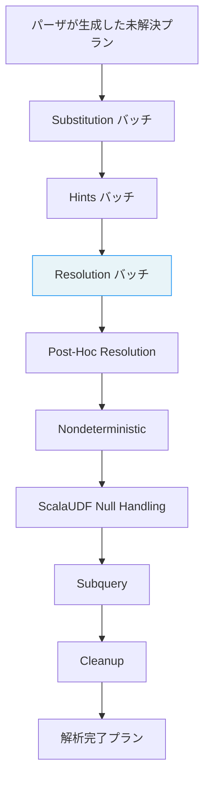

# 第15章 Catalyst: 論理プランと解析

> 本章で読むソース
>
> - [`sql/catalyst/src/main/scala/org/apache/spark/sql/catalyst/plans/logical/LogicalPlan.scala` L37-L127](https://github.com/apache/spark/blob/v4.1.2/sql/catalyst/src/main/scala/org/apache/spark/sql/catalyst/plans/logical/LogicalPlan.scala#L37-L127)
> - [`sql/catalyst/src/main/scala/org/apache/spark/sql/catalyst/plans/logical/basicLogicalOperators.scala` L73-L117](https://github.com/apache/spark/blob/v4.1.2/sql/catalyst/src/main/scala/org/apache/spark/sql/catalyst/plans/logical/basicLogicalOperators.scala#L73-L117)
> - [`sql/catalyst/src/main/scala/org/apache/spark/sql/catalyst/plans/logical/basicLogicalOperators.scala` L335-L359](https://github.com/apache/spark/blob/v4.1.2/sql/catalyst/src/main/scala/org/apache/spark/sql/catalyst/plans/logical/basicLogicalOperators.scala#L335-L359)
> - [`sql/catalyst/src/main/scala/org/apache/spark/sql/catalyst/plans/logical/basicLogicalOperators.scala` L659-L775](https://github.com/apache/spark/blob/v4.1.2/sql/catalyst/src/main/scala/org/apache/spark/sql/catalyst/plans/logical/basicLogicalOperators.scala#L659-L775)
> - [`sql/catalyst/src/main/scala/org/apache/spark/sql/catalyst/plans/logical/basicLogicalOperators.scala` L1156-L1228](https://github.com/apache/spark/blob/v4.1.2/sql/catalyst/src/main/scala/org/apache/spark/sql/catalyst/plans/logical/basicLogicalOperators.scala#L1156-L1228)
> - [`sql/catalyst/src/main/scala/org/apache/spark/sql/catalyst/trees/TreeNode.scala` L70-L171](https://github.com/apache/spark/blob/v4.1.2/sql/catalyst/src/main/scala/org/apache/spark/sql/catalyst/trees/TreeNode.scala#L70-L171)
> - [`sql/catalyst/src/main/scala/org/apache/spark/sql/catalyst/trees/TreeNode.scala` L434-L560](https://github.com/apache/spark/blob/v4.1.2/sql/catalyst/src/main/scala/org/apache/spark/sql/catalyst/trees/TreeNode.scala#L434-L560)
> - [`sql/catalyst/src/main/scala/org/apache/spark/sql/catalyst/rules/Rule.scala` L24-L36](https://github.com/apache/spark/blob/v4.1.2/sql/catalyst/src/main/scala/org/apache/spark/sql/catalyst/rules/Rule.scala#L24-L36)
> - [`sql/catalyst/src/main/scala/org/apache/spark/sql/catalyst/rules/RuleExecutor.scala` L125-L325](https://github.com/apache/spark/blob/v4.1.2/sql/catalyst/src/main/scala/org/apache/spark/sql/catalyst/rules/RuleExecutor.scala#L125-L325)
> - [`sql/catalyst/src/main/scala/org/apache/spark/sql/catalyst/plans/logical/AnalysisHelper.scala` L44-L157](https://github.com/apache/spark/blob/v4.1.2/sql/catalyst/src/main/scala/org/apache/spark/sql/catalyst/plans/logical/AnalysisHelper.scala#L44-L157)
> - [`sql/catalyst/src/main/scala/org/apache/spark/sql/catalyst/analysis/Analyzer.scala` L289-L535](https://github.com/apache/spark/blob/v4.1.2/sql/catalyst/src/main/scala/org/apache/spark/sql/catalyst/analysis/Analyzer.scala#L289-L535)
> - [`sql/catalyst/src/main/scala/org/apache/spark/sql/catalyst/catalog/SessionCatalog.scala` L68-L142](https://github.com/apache/spark/blob/v4.1.2/sql/catalyst/src/main/scala/org/apache/spark/sql/catalyst/catalog/SessionCatalog.scala#L68-L142)

## この章の狙い

`Catalyst` は Spark SQL のクエリ処理基盤である。
SQL や DataFrame API から書かれたクエリは、まず**論理プラン**（`LogicalPlan`）というツリー構造に変換される。
論理プランは「何を計算するか」を表現し、物理的な実行方法は含まない。
本章では、論理プランのデータ構造、`TreeNode` が提供する変換基盤、`RuleExecutor` によるルール適用の仕組み、そして `Analyzer` による名前解決の流れを追う。

## 前提

Spark SQL のクエリ実行は、解析（Analysis）、最適化（Optimization）、物理プラン生成（Physical Planning）の3段階で進む（第16章、第17章）。
`SessionCatalog` がテーブルや関数のメタデータを保持し、`Analyzer` がそこから名前を引く（本章）。
`QueryExecution` が各段階を管轄する（第17章）。

## 15.1 LogicalPlan の構造

`LogicalPlan` は Catalyst の論理オペレータが共通して継承する抽象クラスである。
`QueryPlan[LogicalPlan]` を継承し、式（`Expression`）の列と子プランの列を持つ。

[`sql/catalyst/src/main/scala/org/apache/spark/sql/catalyst/plans/logical/LogicalPlan.scala` L37-L43](https://github.com/apache/spark/blob/v4.1.2/sql/catalyst/src/main/scala/org/apache/spark/sql/catalyst/plans/logical/LogicalPlan.scala#L37-L43)

```scala
abstract class LogicalPlan
  extends QueryPlan[LogicalPlan]
  with AnalysisHelper
  with LogicalPlanStats
  with LogicalPlanDistinctKeys
  with QueryPlanConstraints
  with Logging {
```

`AnalysisHelper` は解析済みフラグ（`analyzed`）と、解析用 traverse メソッドを提供する。
`LogicalPlanStats` は統計情報のキャッシュ機構を持つ。
`QueryPlanConstraints` は等価制約（equality constraints）の管理を担う。

### 15.1.1 resolved と childrenResolved

`LogicalPlan` の最重要プロパティは `resolved` である。
これはすべての式と子ノードが解決済みかどうかを示す。

[`sql/catalyst/src/main/scala/org/apache/spark/sql/catalyst/plans/logical/LogicalPlan.scala` L107-L127](https://github.com/apache/spark/blob/v4.1.2/sql/catalyst/src/main/scala/org/apache/spark/sql/catalyst/plans/logical/LogicalPlan.scala#L107-L127)

```scala
lazy val resolved: Boolean = expressions.forall(_.resolved) && childrenResolved

// ...

def childrenResolved: Boolean = children.forall(_.resolved)
```

`resolved` が `false` のノードは `UnresolvedAttribute` や `UnresolvedRelation` を含み、`Analyzer` が実体を引き当てる必要がある。
`Analyzer` の各ルールは `resolved` が `true` になるまで繰り返し適用される。

### 15.1.2 属性の解決

`resolve` と `resolveChildren` は、名前.parts から `NamedExpression` を引く。

[`sql/catalyst/src/main/scala/org/apache/spark/sql/catalyst/plans/logical/LogicalPlan.scala` L161-L176](https://github.com/apache/spark/blob/v4.1.2/sql/catalyst/src/main/scala/org/apache/spark/sql/catalyst/plans/logical/LogicalPlan.scala#L161-L176)

```scala
def resolveChildren(
    nameParts: Seq[String],
    resolver: Resolver): Option[NamedExpression] =
  childAttributes.resolve(nameParts, resolver)
    .orElse(childMetadataAttributes.resolve(nameParts, resolver))

def resolve(
    nameParts: Seq[String],
    resolver: Resolver): Option[NamedExpression] =
  outputAttributes.resolve(nameParts, resolver)
    .orElse(outputMetadataAttributes.resolve(nameParts, resolver))
```

`childAttributes` は子ノードの `output` を、`outputAttributes` は自身の `output` を使う。
`Resolver` は大文字小文字の区別有無を切り替える関数であり、`SQLConf.resolver` から取得する。

## 15.2 基本的な論理オペレータ

`basicLogicalOperators.scala` に定義される主要なオペレータを紹介する。

### 15.2.1 Project

`Project` は式のリストを評価し、新しい出力行を生成する。

[`sql/catalyst/src/main/scala/org/apache/spark/sql/catalyst/plans/logical/basicLogicalOperators.scala` L73-L117](https://github.com/apache/spark/blob/v4.1.2/sql/catalyst/src/main/scala/org/apache/spark/sql/catalyst/plans/logical/basicLogicalOperators.scala#L73-L117)

```scala
case class Project(projectList: Seq[NamedExpression], child: LogicalPlan)
    extends OrderPreservingUnaryNode {
  override def output: Seq[Attribute] = projectList.map(_.toAttribute)
  override def maxRows: Option[Long] = child.maxRows

  override lazy val resolved: Boolean = {
    val hasSpecialExpressions = projectList.exists ( _.collect {
        case agg: AggregateExpression => agg
        case generator: Generator => generator
        case window: WindowExpression => window
      }.nonEmpty
    )
    expressions.forall(_.resolved) && childrenResolved && !hasSpecialExpressions
  }
  // ...
}
```

`Project` は `AggregateExpression`、`Generator`、`WindowExpression` を含むと未解決とみなす。
これらは別のルール（`GlobalAggregates`、`ExtractGenerator`、`ExtractWindowExpressions`）によって適切なオペレータに引き上げられるまで解決されない。

### 15.2.2 Filter

`Filter` は条件式を満たす行のみを通過させる。

[`sql/catalyst/src/main/scala/org/apache/spark/sql/catalyst/plans/logical/basicLogicalOperators.scala` L335-L359](https://github.com/apache/spark/blob/v4.1.2/sql/catalyst/src/main/scala/org/apache/spark/sql/catalyst/plans/logical/basicLogicalOperators.scala#L335-L359)

```scala
case class Filter(condition: Expression, child: LogicalPlan)
  extends OrderPreservingUnaryNode with PredicateHelper {
  override def output: Seq[Attribute] = child.output

  override def maxRows: Option[Long] = condition match {
    case Literal.FalseLiteral => Some(0L)
    case _ => child.maxRows
  }

  override protected lazy val validConstraints: ExpressionSet = {
    val predicates = splitConjunctivePredicates(condition)
      .filterNot(SubqueryExpression.hasCorrelatedSubquery)
    child.constraints.union(ExpressionSet(predicates))
  }
  // ...
}
```

`Filter` は条件から制約（constraints）を抽出する。
この制約情報はオプティマイザが条件の書き換えやプッシュダウンに利用する（第16章）。

### 15.2.3 Join

`Join` は2つの子プランを結合する。

[`sql/catalyst/src/main/scala/org/apache/spark/sql/catalyst/plans/logical/basicLogicalOperators.scala` L659-L775](https://github.com/apache/spark/blob/v4.1.2/sql/catalyst/src/main/scala/org/apache/spark/sql/catalyst/plans/logical/basicLogicalOperators.scala#L659-L775)

```scala
case class Join(
    left: LogicalPlan,
    right: LogicalPlan,
    joinType: JoinType,
    condition: Option[Expression],
    hint: JoinHint)
  extends BinaryNode with PredicateHelper {

  override def output: Seq[Attribute] =
    Join.computeOutput(joinType, left.output, right.output)

  override lazy val resolved: Boolean = joinType match {
    case NaturalJoin(_) => false
    case UsingJoin(_, _) => false
    case _ => resolvedExceptNatural
  }
  // ...
}
```

`NaturalJoin` と `UsingJoin` は常に未解決のまま残る。
`ResolveNaturalAndUsingJoin` ルールがこれらを通常の `Join` に書き換えてから解決される。

### 15.2.4 Aggregate

`Aggregate` はグループ化式と集約式を持つ。

[`sql/catalyst/src/main/scala/org/apache/spark/sql/catalyst/plans/logical/basicLogicalOperators.scala` L1156-L1201](https://github.com/apache/spark/blob/v4.1.2/sql/catalyst/src/main/scala/org/apache/spark/sql/catalyst/plans/logical/basicLogicalOperators.scala#L1156-L1201)

```scala
case class Aggregate(
    groupingExpressions: Seq[Expression],
    aggregateExpressions: Seq[NamedExpression],
    child: LogicalPlan,
    hint: Option[AggregateHint] = None)
  extends UnaryNode {

  override def output: Seq[Attribute] = aggregateExpressions.map(_.toAttribute)
  override def maxRows: Option[Long] = {
    if (groupingExpressions.isEmpty) {
      Some(1L)
    } else {
      child.maxRows
    }
  }
  // ...
}
```

`groupingExpressions` が空の場合、`maxRows` は1になる。
全行を集約するクエリ（`SELECT count(*) FROM t`）は常に1行を返すためである。

## 15.3 TreeNode: 変換の基盤

`TreeNode` は Catalyst のすべてのプランと式が継承する不変ツリーの基底クラスである。

[`sql/catalyst/src/main/scala/org/apache/spark/sql/catalyst/trees/TreeNode.scala` L70-L74](https://github.com/apache/spark/blob/v4.1.2/sql/catalyst/src/main/scala/org/apache/spark/sql/catalyst/trees/TreeNode.scala#L70-L74)

```scala
abstract class TreeNode[BaseType <: TreeNode[BaseType]]
  extends Product
  with TreePatternBits
  with WithOrigin {
  self: BaseType =>
```

### 15.3.1 transformDown と transformUp

`TreeNode` は部分関数をツリーに適用する `transform` メソッド群を提供する。

[`sql/catalyst/src/main/scala/org/apache/spark/sql/catalyst/trees/TreeNode.scala` L484-L560](https://github.com/apache/spark/blob/v4.1.2/sql/catalyst/src/main/scala/org/apache/spark/sql/catalyst/trees/TreeNode.scala#L484-L560)

```scala
def transformDownWithPruning(cond: TreePatternBits => Boolean,
  ruleId: RuleId = UnknownRuleId)(rule: PartialFunction[BaseType, BaseType])
: BaseType = {
  if (!cond.apply(this) || isRuleIneffective(ruleId)) {
    return this
  }
  val afterRule = CurrentOrigin.withOrigin(origin) {
    rule.applyOrElse(this, identity[BaseType])
  }
  if (this fastEquals afterRule) {
    val rewritten_plan = mapChildren(_.transformDownWithPruning(cond, ruleId)(rule))
    if (this eq rewritten_plan) {
      markRuleAsIneffective(ruleId)
      this
    } else {
      rewritten_plan
    }
  } else {
    afterRule.copyTagsFrom(this)
    afterRule.mapChildren(_.transformDownWithPruning(cond, ruleId)(rule))
  }
}

// ...

def transformUpWithPruning(cond: TreePatternBits => Boolean,
  ruleId: RuleId = UnknownRuleId)(rule: PartialFunction[BaseType, BaseType])
: BaseType = {
  if (!cond.apply(this) || isRuleIneffective(ruleId)) {
    return this
  }
  val afterRuleOnChildren = mapChildren(_.transformUpWithPruning(cond, ruleId)(rule))
  val newNode = if (this fastEquals afterRuleOnChildren) {
    CurrentOrigin.withOrigin(origin) {
      rule.applyOrElse(this, identity[BaseType])
    }
  } else {
    CurrentOrigin.withOrigin(origin) {
      rule.applyOrElse(afterRuleOnChildren, identity[BaseType])
    }
  }
  // ...
}
```

`transformDown` はトップダウン、`transformUp` はボトムアップで適用する。
`cond` でツリーのパターンを事前チェックし、該当しない部分木は走査を省略する。
`ruleId` で非効果的なルールを記録し、再適用をスキップする。

### 15.3.2 TreePatternBits による枝刈り

`TreeNode` は `TreePatternBits` を持ち、部分木にどのパターン（`PROJECT`、`FILTER`、`JOIN` 等）が含まれるかをビットセットで管理する。

[`sql/catalyst/src/main/scala/org/apache/spark/sql/catalyst/trees/TreeNode.scala` L96-L122](https://github.com/apache/spark/blob/v4.1.2/sql/catalyst/src/main/scala/org/apache/spark/sql/catalyst/trees/TreeNode.scala#L96-L122)

```scala
protected def getDefaultTreePatternBits: BitSet = {
  val bits: BitSet = new BitSet(TreePattern.maxId)
  validateNodePatterns()
  val nodePatternIterator = nodePatterns.iterator
  while (nodePatternIterator.hasNext) {
    bits.set(nodePatternIterator.next().id)
  }
  val childIterator = children.iterator
  while (childIterator.hasNext) {
    bits.union(childIterator.next().treePatternBits)
  }
  bits
}

private val _treePatternBits = new BestEffortLazyVal[BitSet](() => getDefaultTreePatternBits)
override def treePatternBits: BitSet = _treePatternBits()
```

なぜ速いのか: ルールが `FILTER` パターンを要求するとき、`FILTER` を含まない部分木はビットチェック1回で走査全体をスキップできる。
これにより、巨大なプランツリーでも該当箇所だけに処理を限定できる。

### 15.3.3 非効果ルールの記録

`TreeNode` は `ruleId` ごとに「この部分木に効果がなかった」ことを記録する。

[`sql/catalyst/src/main/scala/org/apache/spark/sql/catalyst/trees/TreeNode.scala` L130-L171](https://github.com/apache/spark/blob/v4.1.2/sql/catalyst/src/main/scala/org/apache/spark/sql/catalyst/trees/TreeNode.scala#L130-L171)

```scala
private[this] var _ineffectiveRules: BitSet = null

protected def markRuleAsIneffective(ruleId: RuleId): Unit = {
  if (ruleId eq UnknownRuleId) {
    return
  }
  ineffectiveRules.set(ruleId.id)
}

protected def isRuleIneffective(ruleId: RuleId): Boolean = {
  if (isIneffectiveRulesEmpty || (ruleId eq UnknownRuleId)) {
    return false
  }
  ineffectiveRules.get(ruleId.id)
}
```

プランは不変なので、あるルールが一度効果を持たなければ、同じプラン構造に対して再度適用しても結果は変わらない。
このビットセットにより、反復実行されるルールbatchの不要な走査を回避する。

## 15.4 Rule と RuleExecutor

### 15.4.1 Rule

`Rule` は `TreeNode` の変換ルールを表す抽象クラスである。

[`sql/catalyst/src/main/scala/org/apache/spark/sql/catalyst/rules/Rule.scala` L24-L36](https://github.com/apache/spark/blob/v4.1.2/sql/catalyst/src/main/scala/org/apache/spark/sql/catalyst/rules/Rule.scala#L24-L36)

```scala
abstract class Rule[TreeType <: TreeNode[_]] extends SQLConfHelper with Logging {
  protected lazy val ruleId = RuleIdCollection.getRuleId(this.ruleName)

  val ruleName: String = {
    val className = getClass.getName
    if (className endsWith "$") className.dropRight(1) else className
  }

  def apply(plan: TreeType): TreeType
}
```

`ruleId` はグローバルなルール識別子であり、`TreeNode` の非効果ルール記録に使われる。

### 15.4.2 RuleExecutor のバッチ実行

`RuleExecutor` はルールを `Batch` 単位で直列実行する。

[`sql/catalyst/src/main/scala/org/apache/spark/sql/catalyst/rules/RuleExecutor.scala` L125-L162](https://github.com/apache/spark/blob/v4.1.2/sql/catalyst/src/main/scala/org/apache/spark/sql/catalyst/rules/RuleExecutor.scala#L125-L162)

```scala
abstract class RuleExecutor[TreeType <: TreeNode[_]] extends Logging {
  abstract class Strategy {
    def maxIterations: Int
    def errorOnExceed: Boolean = false
    def maxIterationsSetting: String = null
  }

  case object Once extends Strategy { val maxIterations = 1 }

  case class FixedPoint(
    override val maxIterations: Int,
    override val errorOnExceed: Boolean = false,
    override val maxIterationsSetting: String = null) extends Strategy

  protected[catalyst] case class Batch(
    name: String, strategy: Strategy, rules: Rule[TreeType]*)
```

`Once` は1回だけ実行、`FixedPoint(n)` は不動点に達するか n 回に達するまで繰り返す。

### 15.4.3 execute のループ

[`sql/catalyst/src/main/scala/org/apache/spark/sql/catalyst/rules/RuleExecutor.scala` L215-L325](https://github.com/apache/spark/blob/v4.1.2/sql/catalyst/src/main/scala/org/apache/spark/sql/catalyst/rules/RuleExecutor.scala#L215-L325)

```scala
def execute(plan: TreeType): TreeType = {
  var curPlan = plan
  // ...
  batches.foreach { batch =>
    val batchStartPlan = curPlan
    var iteration = 1
    var lastPlan = curPlan
    var continue = true

    while (continue) {
      curPlan = batch.rules.foldLeft(curPlan) {
        case (plan, rule) =>
          val startTime = System.nanoTime()
          val result = rule(plan)
          val runTime = System.nanoTime() - startTime
          val effective = !result.fastEquals(plan)
          // ... metrics recording ...
          result
      }
      iteration += 1
      if (iteration > batch.strategy.maxIterations) {
        // ... error or warning ...
        continue = false
      }
      if (curPlan.fastEquals(lastPlan)) {
        continue = false
      }
      lastPlan = curPlan
    }
  }
  curPlan
}
```

各バッチ内でルールを順に適用し、プランが変化しなくなったら次のバッチに進む。
`fastEquals` は参照等価性を先にチェックするため、大規模プランでも高速に収束判定できる。

## 15.5 AnalysisHelper: 解析のための traverse

`AnalysisHelper` は `LogicalPlan` に、解析フェーズ専用の traverse メソッドを提供する。

[`sql/catalyst/src/main/scala/org/apache/spark/sql/catalyst/plans/logical/AnalysisHelper.scala` L44-L65](https://github.com/apache/spark/blob/v4.1.2/sql/catalyst/src/main/scala/org/apache/spark/sql/catalyst/plans/logical/AnalysisHelper.scala#L44-L65)

```scala
trait AnalysisHelper extends QueryPlan[LogicalPlan] { self: LogicalPlan =>
  private var _analyzed: Boolean = false

  private[sql] def setAnalyzed(): Unit = {
    if (!_analyzed) {
      _analyzed = true
      children.foreach(_.setAnalyzed())
    }
  }

  def analyzed: Boolean = _analyzed
```

`analyzed` フラグは、解析済み部分木を再走査しないための最適化である。
`resolveOperatorsUp` は `analyzed` が `true` のノードでは処理をスキップする。

### 15.5.1 resolveOperatorsUp

[`sql/catalyst/src/main/scala/org/apache/spark/sql/catalyst/plans/logical/AnalysisHelper.scala` L131-L157](https://github.com/apache/spark/blob/v4.1.2/sql/catalyst/src/main/scala/org/apache/spark/sql/catalyst/plans/logical/AnalysisHelper.scala#L131-L157)

```scala
def resolveOperatorsUpWithPruning(cond: TreePatternBits => Boolean,
  ruleId: RuleId = UnknownRuleId)(rule: PartialFunction[LogicalPlan, LogicalPlan])
: LogicalPlan = {
  if (!analyzed && cond.apply(self) && !isRuleIneffective(ruleId)) {
    AnalysisHelper.allowInvokingTransformsInAnalyzer {
      val afterRuleOnChildren = mapChildren(
        _.resolveOperatorsUpWithPruning(cond, ruleId)(rule))
      val afterRule = if (self fastEquals afterRuleOnChildren) {
        CurrentOrigin.withOrigin(origin) {
          rule.applyOrElse(self, identity[LogicalPlan])
        }
      } else {
        CurrentOrigin.withOrigin(origin) {
          rule.applyOrElse(afterRuleOnChildren, identity[LogicalPlan])
        }
      }
      if (self eq afterRule) {
        self.markRuleAsIneffective(ruleId)
        self
      } else {
        afterRule.copyTagsFrom(self)
        afterRule
      }
    }
  } else {
    self
  }
}
```

`analyzed` が `true` なら即座に `self` を返す。
これにより、解析済みサブツリーを再走査するオーバーヘッドを回避する。
テストモードでは、`transformUp` や `transformDown` を直接呼ぶと例外を投げて、解析ルールが `resolveOperators*` を使うよう強制する。

## 15.6 Analyzer の構造

`Analyzer` は `RuleExecutor[LogicalPlan]` を継承し、複数バッチのルールで論理プランを解決する。

[`sql/catalyst/src/main/scala/org/apache/spark/sql/catalyst/analysis/Analyzer.scala` L289-L293](https://github.com/apache/spark/blob/v4.1.2/sql/catalyst/src/main/scala/org/apache/spark/sql/catalyst/analysis/Analyzer.scala#L289-L293)

```scala
class Analyzer(
    override val catalogManager: CatalogManager,
    private[sql] val sharedRelationCache: RelationCache = RelationCache.empty)
  extends RuleExecutor[LogicalPlan]
  with CheckAnalysis with AliasHelper with SQLConfHelper with ColumnResolutionHelper {
```

### 15.6.1 バッチ構成

`Analyzer` の `batches` は以下の順で構成される。

[`sql/catalyst/src/main/scala/org/apache/spark/sql/catalyst/analysis/Analyzer.scala` L417-L535](https://github.com/apache/spark/blob/v4.1.2/sql/catalyst/src/main/scala/org/apache/spark/sql/catalyst/analysis/Analyzer.scala#L417-L535)

```scala
private def earlyBatches: Seq[Batch] = Seq(
  Batch("Substitution", fixedPoint,
    OptimizeUpdateFields,
    CTESubstitution,
    WindowsSubstitution,
    EliminateUnions,
    EliminateLazyExpression),
  Batch("Apply Limit All", Once, ApplyLimitAll),
  Batch("Disable Hints", Once, new ResolveHints.DisableHints),
  Batch("Hints", fixedPoint,
    Seq(ResolveHints.ResolveJoinStrategyHints,
      ResolveHints.ResolveCoalesceHints) ++
      hintResolutionRules: _*),
  Batch("Simple Sanity Check", Once, LookupFunctions),
  Batch("Keep Legacy Outputs", Once, KeepLegacyOutputs)
)

override def batches: Seq[Batch] = earlyBatches ++ Seq(
  Batch("Resolution", fixedPoint,
    new ResolveCatalogs(catalogManager) ::
    ResolveInsertInto ::
    ResolveRelations ::
    // ... (中略) ...
    ResolveReferences ::
    ResolveLateralColumnAliasReference ::
    // ... (中略) ...
    ResolveFunctions ::
    // ... (中略) ...
    ResolveSubquery ::
    ResolveNaturalAndUsingJoin ::
    // ... (中略) ...
    GlobalAggregates ::
    ResolveAggregateFunctions ::
    // ... (中略) ...
    typeCoercionRules() ++
    // ... (中略) ...
    extendedResolutionRules : _*),
  Batch("Post-Hoc Resolution", Once, ...),
  Batch("Nondeterministic", Once, PullOutNondeterministic),
  Batch("ScalaUDF Null Handling", fixedPoint, ...),
  Batch("Subquery", Once, UpdateOuterReferences),
  Batch("Cleanup", fixedPoint, CleanupAliases),
  // ...
)
```



`Resolution` バッチが中核である。
`ResolveRelations` がテーブル名を `SessionCatalog` から引いて `DataSource` に解決し、`ResolveReferences` が列名を実属性に結びつける。
`fixedPoint` 戦略により、プランが変化しなくなるまで繰り返される。

### 15.6.2 不動点の設定

[`sql/catalyst/src/main/scala/org/apache/spark/sql/catalyst/analysis/Analyzer.scala` L351-L355](https://github.com/apache/spark/blob/v4.1.2/sql/catalyst/src/main/scala/org/apache/spark/sql/catalyst/analysis/Analyzer.scala#L351-L355)

```scala
protected def fixedPoint =
  FixedPoint(
    conf.analyzerMaxIterations,
    errorOnExceed = true,
    maxIterationsSetting = SQLConf.ANALYZER_MAX_ITERATIONS.key)
```

`analyzerMaxIterations`（デフォルト100）を超えると例外を投げる。
複雑なビューのネストや循環参照で無限ループに入るのを防ぐためである。

### 15.6.3 executeAndCheck

[`sql/catalyst/src/main/scala/org/apache/spark/sql/catalyst/analysis/Analyzer.scala` L314-L335](https://github.com/apache/spark/blob/v4.1.2/sql/catalyst/src/main/scala/org/apache/spark/sql/catalyst/analysis/Analyzer.scala#L314-L335)

```scala
def executeAndCheck(plan: LogicalPlan, tracker: QueryPlanningTracker): LogicalPlan = {
  if (plan.analyzed) {
    plan
  } else {
    if (AnalysisContext.get.isDefault) {
      AnalysisContext.reset()
      try {
        AnalysisHelper.markInAnalyzer {
          HybridAnalyzer.fromLegacyAnalyzer(legacyAnalyzer = this).apply(plan, tracker)
        }
      } finally {
        AnalysisContext.reset()
      }
    } else {
      AnalysisContext.withNewAnalysisContext {
        AnalysisHelper.markInAnalyzer {
          HybridAnalyzer.fromLegacyAnalyzer(legacyAnalyzer = this).apply(plan, tracker)
        }
      }
    }
  }
}
```

`plan.analyzed` が `true` なら解析をスキップする。
`markInAnalyzer` はスレッドローカルフラグを立て、`AnalysisHelper` が `transformUp` 等の直接使用をテスト時に検出できるようにする。
`HybridAnalyzer` は従来の不動点ベース解析とシングルパス解析を組み合わせる仕組みである（v4.1.2 で導入）。

## 15.7 SessionCatalog: メタデータの引き当て先

`SessionCatalog` は Spark セッション内部のカタログであり、外部メタストア（Hive Metastore 等）へのプロキシとして機能する。

[`sql/catalyst/src/main/scala/org/apache/spark/sql/catalyst/catalog/SessionCatalog.scala` L68-L79](https://github.com/apache/spark/blob/v4.1.2/sql/catalyst/src/main/scala/org/apache/spark/sql/catalyst/catalog/SessionCatalog.scala#L68-L79)

```scala
class SessionCatalog(
    externalCatalogBuilder: () => ExternalCatalog,
    globalTempViewManagerBuilder: () => GlobalTempViewManager,
    functionRegistry: FunctionRegistry,
    tableFunctionRegistry: TableFunctionRegistry,
    hadoopConf: Configuration,
    val parser: ParserInterface,
    functionResourceLoader: FunctionResourceLoader,
    functionExpressionBuilder: FunctionExpressionBuilder,
    cacheSize: Int = SQLConf.get.tableRelationCacheSize,
    cacheTTL: Long = SQLConf.get.metadataCacheTTL,
    defaultDatabase: String = SQLConf.get.defaultDatabase)
  extends SQLConfHelper with Logging {
```

`SessionCatalog` は以下を管理する。

- 一時ビュー（`tempViews`）: セッション固有のビュー。
- 現在データベース（`currentDb`）: 未修飾テーブル名の検索先。
- 関数レジストリ（`FunctionRegistry`）: 組み込み関数、UDF の検索。
- 外部カタログ（`ExternalCatalog`）: Hive Metastore 等の永続メタストア。

`ResolveRelations` ルールは `SessionCatalog.lookupRelation` を呼び、テーブル名から `LogicalPlan`（`DataSource V2` の_relation_等）を取得する。

## 15.8 高速化の工夫: TreePatternBits と非効果ルールのビットセット

Catalyst の解析と最適化が巨大なプランツリーを高速に処理できる理由は、`TreePatternBits` と `_ineffectiveRules` の2つのビットセットによる枝刈りである。

`TreePatternBits` は各ノードが自身の `nodePatterns` と子のビットセットの合併を持つ。
ルールは `containsPattern(FILTER)` のように呼び、該当パターンが部分木に存在しなければ走査全体をスキップする。

`_ineffectiveRules` は各ノードが「どのルールが効果を持たなかったか」を記録する。
プランは不変なので、一度効果がなければ次も効果がない。
`RuleExecutor` の反復実行で、すでに効果がないと判定された部分木は `isRuleIneffective` が `true` を返し、即座にスキップされる。

なぜ速いのか: 2つのビットセットにより、ルールの適用対象をビット演算で絞り込む。
プランツリーの各ノードでパターンマッチや式の評価を行う前に、不要な走査を O(1) のビットチェックで切り落とせる。

## まとめ

本章では Catalyst の論理プランと解析の仕組みを追った。

- `LogicalPlan` は `QueryPlan` を継承し、式と子ノードからなる不変ツリーである。
- `resolved` フラグが `false` の間、`Analyzer` が名前解決を繰り返す。
- `TreeNode` は `transformDown`、`transformUp` で部分関数をツリーに適用する。
- `TreePatternBits` で走査を枝刈りし、`_ineffectiveRules` で不要な再適用をスキップする。
- `RuleExecutor` は `Batch` ごとにルールを直列適用し、不動点に達するまで繰り返す。
- `AnalysisHelper` は `analyzed` フラグで解析済み部分木の再走査を避ける。
- `Analyzer` は `Resolution` バッチで `ResolveRelations`、`ResolveReferences` 等を実行し、`SessionCatalog` からメタデータを引く。

## 関連する章

- 第16章: Catalyst: クエリ最適化（最適化ルールの詳細）
- 第17章: Catalyst: 物理プラン生成（物理プランへの変換）
- 第2章: SparkContext とアプリケーションライフサイクル（`SparkSession` の初期化）
