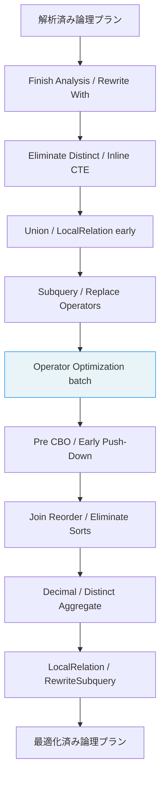
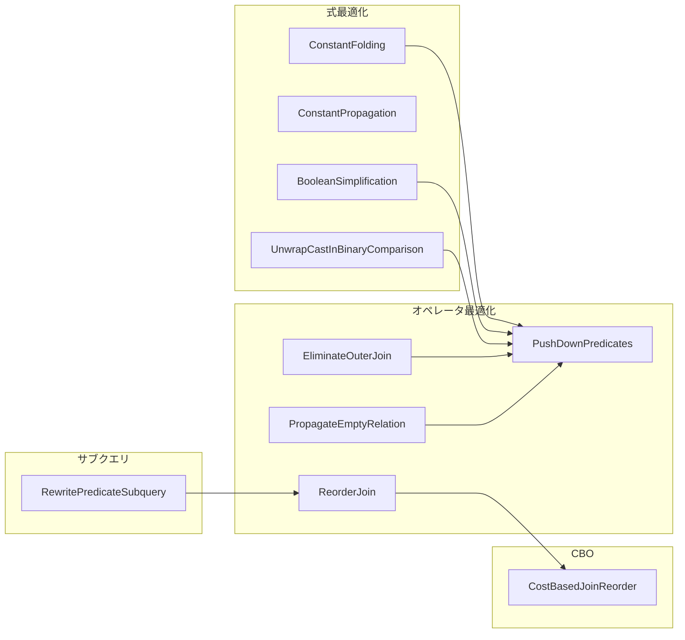

# 第16章 Catalyst: クエリ最適化

> 本章で読むソース
>
> - [`sql/catalyst/src/main/scala/org/apache/spark/sql/catalyst/optimizer/Optimizer.scala` L51-L279](https://github.com/apache/spark/blob/v4.1.2/sql/catalyst/src/main/scala/org/apache/spark/sql/catalyst/optimizer/Optimizer.scala#L51-L279)
> - [`sql/catalyst/src/main/scala/org/apache/spark/sql/catalyst/optimizer/expressions.scala` L50-L119](https://github.com/apache/spark/blob/v4.1.2/sql/catalyst/src/main/scala/org/apache/spark/sql/catalyst/optimizer/expressions.scala#L50-L119)
> - [`sql/catalyst/src/main/scala/org/apache/spark/sql/catalyst/optimizer/expressions.scala` L135-L244](https://github.com/apache/spark/blob/v4.1.2/sql/catalyst/src/main/scala/org/apache/spark/sql/catalyst/optimizer/expressions.scala#L135-L244)
> - [`sql/catalyst/src/main/scala/org/apache/spark/sql/catalyst/optimizer/expressions.scala` L369-L399](https://github.com/apache/spark/blob/v4.1.2/sql/catalyst/src/main/scala/org/apache/spark/sql/catalyst/optimizer/expressions.scala#L369-L399)
> - [`sql/catalyst/src/main/scala/org/apache/spark/sql/catalyst/optimizer/joins.scala` L45-L122](https://github.com/apache/spark/blob/v4.1.2/sql/catalyst/src/main/scala/org/apache/spark/sql/catalyst/optimizer/joins.scala#L45-L122)
> - [`sql/catalyst/src/main/scala/org/apache/spark/sql/catalyst/optimizer/joins.scala` L158-L198](https://github.com/apache/spark/blob/v4.1.2/sql/catalyst/src/main/scala/org/apache/spark/sql/catalyst/optimizer/joins.scala#L158-L198)
> - [`sql/catalyst/src/main/scala/org/apache/spark/sql/catalyst/optimizer/CostBasedJoinReorder.scala` L36-L102](https://github.com/apache/spark/blob/v4.1.2/sql/catalyst/src/main/scala/org/apache/spark/sql/catalyst/optimizer/CostBasedJoinReorder.scala#L36-L102)
> - [`sql/catalyst/src/main/scala/org/apache/spark/sql/catalyst/optimizer/CostBasedJoinReorder.scala` L143-L193](https://github.com/apache/spark/blob/v4.1.2/sql/catalyst/src/main/scala/org/apache/spark/sql/catalyst/optimizer/CostBasedJoinReorder.scala#L143-L193)
> - [`sql/catalyst/src/main/scala/org/apache/spark/sql/catalyst/optimizer/PushDownLeftSemiAntiJoin.scala` L35-L111](https://github.com/apache/spark/blob/v4.1.2/sql/catalyst/src/main/scala/org/apache/spark/sql/catalyst/optimizer/PushDownLeftSemiAntiJoin.scala#L35-L111)
> - [`sql/catalyst/src/main/scala/org/apache/spark/sql/catalyst/optimizer/PropagateEmptyRelation.scala` L47-L150](https://github.com/apache/spark/blob/v4.1.2/sql/catalyst/src/main/scala/org/apache/spark/sql/catalyst/optimizer/PropagateEmptyRelation.scala#L47-L150)
> - [`sql/catalyst/src/main/scala/org/apache/spark/sql/catalyst/optimizer/UnwrapCastInBinaryComparison.scala` L31-L100](https://github.com/apache/spark/blob/v4.1.2/sql/catalyst/src/main/scala/org/apache/spark/sql/catalyst/optimizer/UnwrapCastInBinaryComparison.scala#L31-L100)
> - [`sql/catalyst/src/main/scala/org/apache/spark/sql/catalyst/optimizer/subquery.scala` L56-L100](https://github.com/apache/spark/blob/v4.1.2/sql/catalyst/src/main/scala/org/apache/spark/sql/catalyst/optimizer/subquery.scala#L56-L100)

## この章の狙い

`Optimizer` は解析済みの論理プランを受け取り、意味を変えずに実行効率を上げる変換を適用する。
本章では、`Optimizer` のバッチ構成、式レベルの最適化（定数畳み込み、ブール式简化）、結合の再順序付け、空リレーションの伝播、サブクエリの書き換えを追う。

## 前提

`Analyzer` が名前解決を終えた論理プランを `Optimizer` が入力とする（第15章）。
`Optimizer` も `RuleExecutor[LogicalPlan]` を継承し、バッチ単位でルールを適用する。
最適化後のプランは `SparkPlanner` に渡され物理プランに変換される（第17章）。

## 16.1 Optimizer のバッチ構成

`Optimizer` は `defaultBatches` で定義される多数のバッチを直列実行する。

[`sql/catalyst/src/main/scala/org/apache/spark/sql/catalyst/optimizer/Optimizer.scala` L51-L76](https://github.com/apache/spark/blob/v4.1.2/sql/catalyst/src/main/scala/org/apache/spark/sql/catalyst/optimizer/Optimizer.scala#L51-L76)

```scala
abstract class Optimizer(catalogManager: CatalogManager)
  extends RuleExecutor[LogicalPlan] with SQLConfHelper {

  override protected def validatePlanChanges(
      previousPlan: LogicalPlan,
      currentPlan: LogicalPlan): Option[String] = {
    LogicalPlanIntegrity.validateOptimizedPlan(previousPlan, currentPlan, lightweight = false)
  }

  protected def fixedPoint =
    FixedPoint(
      conf.optimizerMaxIterations,
      maxIterationsSetting = SQLConf.OPTIMIZER_MAX_ITERATIONS.key)
```

`optimizerMaxIterations`（デフォルト100）が不動点の上限である。
`validatePlanChanges` は各ルールの適用後に、プランが解決済みであること、`ExprId` の一意性が保たれることを検証する。

### 16.1.1 バッチの一覧

[`sql/catalyst/src/main/scala/org/apache/spark/sql/catalyst/optimizer/Optimizer.scala` L100-L275](https://github.com/apache/spark/blob/v4.1.2/sql/catalyst/src/main/scala/org/apache/spark/sql/catalyst/optimizer/Optimizer.scala#L100-L275)

```scala
def defaultBatches: Seq[Batch] = {
  val operatorOptimizationRuleSet =
    Seq(
      // Operator push down
      PushProjectionThroughUnion,
      PushProjectionThroughLimitAndOffset,
      ReorderJoin,
      EliminateOuterJoin,
      PushDownPredicates,
      PushDownLeftSemiAntiJoin,
      PushLeftSemiLeftAntiThroughJoin,
      OptimizeJoinCondition,
      LimitPushDown,
      LimitPushDownThroughWindow,
      ColumnPruning,
      GenerateOptimization,
      // Operator combine
      CollapseRepartition,
      CollapseProject,
      OptimizeWindowFunctions,
      CollapseWindow,
      EliminateOffsets,
      EliminateLimits,
      CombineUnions,
      // Constant folding and strength reduction
      OptimizeRepartition,
      EliminateWindowPartitions,
      TransposeWindow,
      NullPropagation,
      // NullPropagation may introduce Exists subqueries, so RewriteNonCorrelatedExists must run
      // after.
      RewriteNonCorrelatedExists,
      NullDownPropagation,
      ConstantPropagation,
      FoldablePropagation,
      OptimizeIn,
      OptimizeRand,
      ConstantFolding,
      EliminateAggregateFilter,
      ReorderAssociativeOperator,
      LikeSimplification,
      BooleanSimplification,
      SimplifyConditionals,
      PushFoldableIntoBranches,
      SimplifyBinaryComparison,
      ReplaceNullWithFalseInPredicate,
      PruneFilters,
      SimplifyCasts,
      SimplifyCaseConversionExpressions,
      SimplifyDateTimeConversions,
      RewriteCorrelatedScalarSubquery,
      RewriteLateralSubquery,
      EliminateSerialization,
      RemoveRedundantAliases,
      RemoveRedundantAggregates,
      UnwrapCastInBinaryComparison,
      RemoveNoopOperators,
      OptimizeUpdateFields,
      SimplifyExtractValueOps,
      OptimizeCsvJsonExprs,
      CombineConcats,
      PushdownPredicatesAndPruneColumnsForCTEDef) ++
      extendedOperatorOptimizationRules

  val operatorOptimizationBatch: Seq[Batch] = Seq(
    Batch("Operator Optimization before Inferring Filters", fixedPoint,
      operatorOptimizationRuleSet: _*),
    Batch("Infer Filters", Once,
      InferFiltersFromGenerate,
      InferFiltersFromConstraints),
    Batch("Operator Optimization after Inferring Filters", fixedPoint,
      operatorOptimizationRuleSet: _*),
    Batch("Push extra predicate through join", fixedPoint,
      PushExtraPredicateThroughJoin,
      PushDownPredicates))

  val batches: Seq[Batch] = flattenBatches(Seq(
    Batch("Finish Analysis", FixedPoint(1), FinishAnalysis),
    // We must run this batch after `ReplaceExpressions`, as `RuntimeReplaceable` expression
    // may produce `With` expressions that need to be rewritten.
    Batch("Rewrite With expression", fixedPoint, RewriteWithExpression),
    //////////////////////////////////////////////////////////////////////////////////////////
    // Optimizer rules start here
    //////////////////////////////////////////////////////////////////////////////////////////
    Batch("Eliminate Distinct", Once, EliminateDistinct),
    // - Do the first call of CombineUnions before starting the major Optimizer rules,
    //   since it can reduce the number of iteration and the other rules could add/move
    //   extra operators between two adjacent Union operators.
    // - Call CombineUnions again in Batch("Operator Optimizations"),
    //   since the other rules might make two separate Unions operators adjacent.
    Batch("Inline CTE", Once,
      InlineCTE()),
    Batch("Union", fixedPoint,
      RemoveNoopOperators,
      CombineUnions,
      RemoveNoopUnion),
    // Run this once earlier. This might simplify the plan and reduce cost of optimizer.
    // For example, a query such as Filter(LocalRelation) would go through all the heavy
    // optimizer rules that are triggered when there is a filter
    // (e.g. InferFiltersFromConstraints). If we run this batch earlier, the query becomes just
    // LocalRelation and does not trigger many rules.
    Batch("LocalRelation early", fixedPoint,
      ConvertToLocalRelation,
      PropagateEmptyRelation,
      // PropagateEmptyRelation can change the nullability of an attribute from nullable to
      // non-nullable when an empty relation child of a Union is removed
      UpdateAttributeNullability),
    Batch("Pullup Correlated Expressions", Once,
      OptimizeOneRowRelationSubquery,
      PullOutNestedDataOuterRefExpressions,
      PullupCorrelatedPredicates),
    // Subquery batch applies the optimizer rules recursively. Therefore, it makes no sense
    // to enforce idempotence on it and we change this batch from Once to FixedPoint(1).
    Batch("Subquery", FixedPoint(1),
      OptimizeSubqueries,
      OptimizeOneRowRelationSubquery),
    Batch("Replace Operators", fixedPoint,
      RewriteExceptAll,
      RewriteIntersectAll,
      ReplaceIntersectWithSemiJoin,
      ReplaceExceptWithFilter,
      ReplaceExceptWithAntiJoin,
      ReplaceDistinctWithAggregate,
      ReplaceDeduplicateWithAggregate),
    Batch("Aggregate", fixedPoint,
      RemoveLiteralFromGroupExpressions,
      RemoveRepetitionFromGroupExpressions),
    operatorOptimizationBatch,
    Batch("Clean Up Temporary CTE Info", Once, CleanUpTempCTEInfo),
    // This batch rewrites plans after the operator optimization and
    // before any batches that depend on stats.
    Batch("Pre CBO Rules", Once, preCBORules: _*),
    // This batch pushes filters and projections into scan nodes. Before this batch, the logical
    // plan may contain nodes that do not report stats. Anything that uses stats must run after
    // this batch.
    Batch("Early Filter and Projection Push-Down", Once, earlyScanPushDownRules: _*),
    Batch("Update CTE Relation Stats", Once, UpdateCTERelationStats),
    // Since join costs in AQP can change between multiple runs, there is no reason that we have an
    // idempotence enforcement on this batch. We thus make it FixedPoint(1) instead of Once.
    Batch("Join Reorder", FixedPoint(1),
      CostBasedJoinReorder),
    Batch("Eliminate Sorts", Once,
      EliminateSorts,
      RemoveRedundantSorts),
    Batch("Decimal Optimizations", fixedPoint,
      DecimalAggregates),
    // This batch must run after "Decimal Optimizations", as that one may change the
    // aggregate distinct column
    Batch("Distinct Aggregate Rewrite", Once,
      RewriteDistinctAggregates),
    Batch("Object Expressions Optimization", fixedPoint,
      EliminateMapObjects,
      CombineTypedFilters,
      ObjectSerializerPruning,
      ReassignLambdaVariableID),
    Batch("LocalRelation", fixedPoint,
      ConvertToLocalRelation,
      PropagateEmptyRelation,
      // PropagateEmptyRelation can change the nullability of an attribute from nullable to
      // non-nullable when an empty relation child of a Union is removed
      UpdateAttributeNullability),
    Batch("Optimize One Row Plan", fixedPoint, OptimizeOneRowPlan),
    // The following batch should be executed after batch "Join Reorder" and "LocalRelation".
    Batch("Check Cartesian Products", Once,
      CheckCartesianProducts),
    Batch("RewriteSubquery", Once,
      RewritePredicateSubquery,
      PushPredicateThroughJoin,
      LimitPushDown,
      ColumnPruning,
      CollapseProject,
      RemoveRedundantAliases,
      RemoveNoopOperators),
    // This batch must be executed after the `RewriteSubquery` batch, which creates joins.
    Batch("NormalizeFloatingNumbers", Once, NormalizeFloatingNumbers),
    Batch("ReplaceUpdateFieldsExpression", Once, ReplaceUpdateFieldsExpression)))

    // remove any batches with no rules. this may happen when subclasses do not add optional rules.
    batches.filter(_.rules.nonEmpty)
  }
```



`Operator Optimization` バッチが中核であり、プッシュダウン、結合、定数畳み込みのルール群を不動点まで繰り返す。
`Join Reorder` バッチは CBO（Cost-Based Optimization）が有効な場合、統計情報に基づく結合順序の決定論的探索を行う。

## 16.2 式レベルの最適化

### 16.2.1 ConstantFolding

`ConstantFolding` は静的に評価可能な式を `Literal` に置き換える。

[`sql/catalyst/src/main/scala/org/apache/spark/sql/catalyst/optimizer/expressions.scala` L50-L119](https://github.com/apache/spark/blob/v4.1.2/sql/catalyst/src/main/scala/org/apache/spark/sql/catalyst/optimizer/expressions.scala#L50-L119)

```scala
object ConstantFolding extends Rule[LogicalPlan] {
  private[sql] val FAILED_TO_EVALUATE = TreeNodeTag[Unit]("FAILED_TO_EVALUATE")

  private[sql] def constantFolding(
      e: Expression,
      isConditionalBranch: Boolean = false): Expression = e match {
    case c: ConditionalExpression if !c.foldable =>
      c.mapChildren(constantFolding(_, isConditionalBranch = true))

    case l: Literal => l

    case Size(c: CreateArray, _) if c.children.forall(hasNoSideEffect) =>
      Literal(c.children.length)
    case Size(c: CreateMap, _) if c.children.forall(hasNoSideEffect) =>
      Literal(c.children.length / 2)

    case e if e.getTagValue(FAILED_TO_EVALUATE).isDefined => e

    case e if e.foldable => tryFold(e, isConditionalBranch)

    case s: ScalarSubquery if s.plan.maxRows.contains(0) =>
      Literal(null, s.dataType)

    case other =>
      val newOther = other.mapChildren(constantFolding(_, isConditionalBranch))
      if (newOther.foldable) {
        tryFold(newOther, isConditionalBranch)
      } else {
        newOther
      }
  }

  def apply(plan: LogicalPlan): LogicalPlan =
    plan.transformWithPruning(AlwaysProcess.fn, ruleId) {
      case q: LogicalPlan => q.mapExpressions(constantFolding(_))
    }
}
```

`foldable` な式は `eval(EmptyRow)` で実行時に評価し、`Literal` に置き換える。
条件分岐内（`CASE WHEN` の分岐等）では評価失敗時に `FAILED_TO_EVALUATE` タグを付け、後続の再試行をスキップする。
これは条件分岐の到達しないパスで例外が起きてもクエリが失敗しないようにするためである。

### 16.2.2 ConstantPropagation

`ConstantPropagation` は等価制約から属性を定数に置き換える。

[`sql/catalyst/src/main/scala/org/apache/spark/sql/catalyst/optimizer/expressions.scala` L135-L244](https://github.com/apache/spark/blob/v4.1.2/sql/catalyst/src/main/scala/org/apache/spark/sql/catalyst/optimizer/expressions.scala#L135-L244)

```scala
object ConstantPropagation extends Rule[LogicalPlan] {
  def apply(plan: LogicalPlan): LogicalPlan = plan.transformUpWithPruning(
    _.containsAllPatterns(LITERAL, FILTER, BINARY_COMPARISON), ruleId) {
    case f: Filter =>
      val (newCondition, _) = traverse(f.condition, replaceChildren = true, nullIsFalse = true)
      if (newCondition.isDefined) {
        f.copy(condition = newCondition.get)
      } else {
        f
      }
  }
  // ...
}
```

`WHERE i = 5 AND j = i + 3` という条件があれば、`i` を `5` に置き換えて `j = 8` を導出する。
`And` の子から等価関係を抽出し、同じ `And` 内のほかの述語に伝播させる。
`Or` や `Not` の中では伝播を止める。これは3値論理のNULL扱いが反転するためである。

### 16.2.3 BooleanSimplification

`BooleanSimplification` はブール式の冗長を除去する。

[`sql/catalyst/src/main/scala/org/apache/spark/sql/catalyst/optimizer/expressions.scala` L369-L399](https://github.com/apache/spark/blob/v4.1.2/sql/catalyst/src/main/scala/org/apache/spark/sql/catalyst/optimizer/expressions.scala#L369-L399)

```scala
object BooleanSimplification extends Rule[LogicalPlan] with PredicateHelper {
  def apply(plan: LogicalPlan): LogicalPlan = plan.transformWithPruning(
    _.containsAnyPattern(AND, OR, NOT), ruleId) {
    case q: LogicalPlan => q.transformExpressionsUpWithPruning(
      _.containsAnyPattern(AND, OR, NOT), ruleId) {
      case TrueLiteral And e => e
      case e And TrueLiteral => e
      case FalseLiteral Or e => e
      case e Or FalseLiteral => e

      case FalseLiteral And _ => FalseLiteral
      case _ And FalseLiteral => FalseLiteral
      case TrueLiteral Or _ => TrueLiteral
      case _ Or TrueLiteral => TrueLiteral

      case a And b if Not(a).semanticEquals(b) =>
        If(IsNull(a), Literal.create(null, a.dataType), FalseLiteral)
      case a Or b if Not(a).semanticEquals(b) =>
        If(IsNull(a), Literal.create(null, a.dataType), TrueLiteral)

      case a And b if a.semanticEquals(b) => a
      case a Or b if a.semanticEquals(b) => a
      // ...
```

`TRUE AND e` を `e` に、`FALSE OR e` を `e` に简化する。
`a AND NOT(a)` は `FALSE`（NULL でなければ）に简化される。
これらのルールは述語のサイズを減らし、後続の `PushDownPredicates` やデータソースへのフィルタプッシュダウンがより多く適用できるようにする。

## 16.3 結合の最適化

### 16.3.1 ReorderJoin

`ReorderJoin` は連続する内部結合を再順序付けする。

[`sql/catalyst/src/main/scala/org/apache/spark/sql/catalyst/optimizer/joins.scala` L45-L122](https://github.com/apache/spark/blob/v4.1.2/sql/catalyst/src/main/scala/org/apache/spark/sql/catalyst/optimizer/joins.scala#L45-L122)

```scala
object ReorderJoin extends Rule[LogicalPlan] with PredicateHelper {
  @tailrec
  final def createOrderedJoin(
      input: Seq[(LogicalPlan, InnerLike)],
      conditions: Seq[Expression]): LogicalPlan = {
    assert(input.size >= 2)
    if (input.size == 2) {
      val (joinConditions, others) = conditions.partition(canEvaluateWithinJoin)
      val ((left, leftJoinType), (right, rightJoinType)) = (input(0), input(1))
      val innerJoinType = (leftJoinType, rightJoinType) match {
        case (Inner, Inner) => Inner
        case (_, _) => Cross
      }
      val join = Join(left, right, innerJoinType,
        joinConditions.reduceLeftOption(And), JoinHint.NONE)
      if (others.nonEmpty) {
        Filter(others.reduceLeft(And), join)
      } else {
        join
      }
    } else {
      val (left, _) :: rest = input.toList
      val conditionalJoin = rest.find { planJoinPair =>
        val plan = planJoinPair._1
        val refs = left.outputSet ++ plan.outputSet
        conditions
          .filterNot(l => l.references.nonEmpty && canEvaluate(l, left))
          .filterNot(r => r.references.nonEmpty && canEvaluate(r, plan))
          .exists(_.references.subsetOf(refs))
      }
      val (right, innerJoinType) = conditionalJoin.getOrElse(rest.head)
      // ... (中略) ...
      createOrderedJoin(Seq((joined, Inner)) ++ rest.filterNot(_._1 eq right), others)
    }
  }

  def apply(plan: LogicalPlan): LogicalPlan = plan.transformWithPruning(
    _.containsPattern(INNER_LIKE_JOIN), ruleId) {
    case p @ ExtractFiltersAndInnerJoins(input, conditions)
        if input.size > 2 && conditions.nonEmpty =>
      // ... (中略) ...
      createOrderedJoin(input, conditions)
      // ...
  }
}
```

3つ以上の内部結合とフィルタを抽出し、結合条件を参照するテーブルから順に結合する。
条件を持たない結合は最後に回される。
スタースキーマ検出が有効な場合、ファクトテーブルとディメンションテーブルの結合を優先する。

### 16.3.2 EliminateOuterJoin

`EliminateOuterJoin` は外部結合を内部結合に降格させる。

[`sql/catalyst/src/main/scala/org/apache/spark/sql/catalyst/optimizer/joins.scala` L158-L198](https://github.com/apache/spark/blob/v4.1.2/sql/catalyst/src/main/scala/org/apache/spark/sql/catalyst/optimizer/joins.scala#L158-L198)

```scala
object EliminateOuterJoin extends Rule[LogicalPlan] with PredicateHelper {
  private def canFilterOutNull(e: Expression): Boolean = {
    if (!e.deterministic || SubqueryExpression.hasCorrelatedSubquery(e)) return false
    val attributes = e.references.toSeq
    val emptyRow = new GenericInternalRow(attributes.length)
    val boundE = BindReferences.bindReference(e, attributes)
    if (boundE.exists(_.isInstanceOf[Unevaluable])) return false
    try {
      val v = boundE.eval(emptyRow)
      v == null || v == false
    } catch {
      case NonFatal(e) => false
    }
  }

  private def buildNewJoinType(filter: Filter, join: Join): JoinType = {
    val conditions = splitConjunctivePredicates(filter.condition) ++ filter.constraints
    val leftConditions = conditions.filter(_.references.subsetOf(join.left.outputSet))
    val rightConditions = conditions.filter(_.references.subsetOf(join.right.outputSet))

    lazy val leftHasNonNullPredicate = leftConditions.exists(canFilterOutNull)
    lazy val rightHasNonNullPredicate = rightConditions.exists(canFilterOutNull)

    join.joinType match {
      case RightOuter if leftHasNonNullPredicate => Inner
      case LeftOuter if rightHasNonNullPredicate => Inner
      case FullOuter if leftHasNonNullPredicate && rightHasNonNullPredicate => Inner
      case FullOuter if leftHasNonNullPredicate => LeftOuter
      case FullOuter if rightHasNonNullPredicate => RightOuter
      case o => o
    }
  }
  // ...
}
```

`LEFT OUTER JOIN` の右側テーブルの列に対する `WHERE` 条件は、NULL を含む行をすべて除外する。
この場合、外部結合は内部結合と等価になる。
`canFilterOutNull` は空の行で式を評価し、NULL または false を返せば NULL 行を除外できると判断する。

なぜ速いのか: 外部結合を内部結合に降格させると、ソートマージ結合やハッシュ結合の選択肢が広がり、シャッフルの削減やブロードキャスト結合の採用が可能になる。

### 16.3.3 CostBasedJoinReorder

`CostBasedJoinReorder` は動的計画法で結合順序を最適化する。

[`sql/catalyst/src/main/scala/org/apache/spark/sql/catalyst/optimizer/CostBasedJoinReorder.scala` L36-L102](https://github.com/apache/spark/blob/v4.1.2/sql/catalyst/src/main/scala/org/apache/spark/sql/catalyst/optimizer/CostBasedJoinReorder.scala#L36-L102)

```scala
object CostBasedJoinReorder extends Rule[LogicalPlan] with PredicateHelper {
  def apply(plan: LogicalPlan): LogicalPlan = {
    if (!conf.cboEnabled || !conf.joinReorderEnabled) {
      plan
    } else {
      val result = plan.transformDownWithPruning(
        _.containsPattern(INNER_LIKE_JOIN), ruleId) {
        case j @ Join(_, _, _: InnerLike, Some(cond), JoinHint.NONE) =>
          reorder(j, j.output)
        case p @ Project(projectList,
            Join(_, _, _: InnerLike, Some(cond), JoinHint.NONE))
          if projectList.forall(_.isInstanceOf[Attribute]) =>
          reorder(p, p.output)
      }
      result transform {
        case OrderedJoin(left, right, jt, cond) =>
          Join(left, right, jt, cond, JoinHint.NONE)
      }
    }
  }

  private def reorder(plan: LogicalPlan, output: Seq[Attribute]): LogicalPlan = {
    val (items, conditions) = extractInnerJoins(plan)
    val result =
      if (items.size > 2 && items.size <= conf.joinReorderDPThreshold
          && conditions.nonEmpty &&
          items.forall(_.stats.rowCount.isDefined)) {
        JoinReorderDP.search(conf, items, conditions, output)
      } else {
        plan
      }
    replaceWithOrderedJoin(result)
  }
}
```

CBO が有効で `joinReorderDPThreshold`（デフォルト10）以内の結合数であれば、`JoinReorderDP` が動的計画法で最適順序を探索する。

### 16.3.4 JoinReorderDP の探索

[`sql/catalyst/src/main/scala/org/apache/spark/sql/catalyst/optimizer/CostBasedJoinReorder.scala` L143-L193](https://github.com/apache/spark/blob/v4.1.2/sql/catalyst/src/main/scala/org/apache/spark/sql/catalyst/optimizer/CostBasedJoinReorder.scala#L143-L193)

```scala
object JoinReorderDP extends PredicateHelper with Logging {
  def search(
      conf: SQLConf,
      items: Seq[LogicalPlan],
      conditions: ExpressionSet,
      output: Seq[Attribute]): LogicalPlan = {

    val startTime = System.nanoTime()
    val itemIndex = items.zipWithIndex
    val foundPlans = mutable.Buffer[JoinPlanMap]({
      val joinPlanMap = new JoinPlanMap
      itemIndex.foreach {
        case (item, id) =>
          joinPlanMap.put(Set(id),
            JoinPlan(Set(id), item, ExpressionSet(), Cost(0, 0)))
      }
      joinPlanMap
    })

    val filters = JoinReorderDPFilters.buildJoinGraphInfo(
      conf, items, conditions, itemIndex)

    while (foundPlans.size < items.length) {
      foundPlans += searchLevel(
        foundPlans.toSeq, conf, conditions, topOutputSet, filters)
    }
    // ... (中略) ...
  }
}
```

レベル0に各テーブルを配置し、レベル1で2つ組みの結合、レベル2で3つ組みの結合を構築する。
各レベルで同じアイテム集合に対して最良のプラン1つだけを残す。
カルテシアン積になる候補は枝刈りするため、探索空間は実用的なサイズに収まる。

## 16.4 プッシュダウンと空リレーション

### 16.4.1 PushDownLeftSemiAntiJoin

`PushDownLeftSemiAntiJoin` は Left Semi/Anti 結合を `Project`、`Aggregate`、`Union`、`Window` の下にプッシュダウンする。

[`sql/catalyst/src/main/scala/org/apache/spark/sql/catalyst/optimizer/PushDownLeftSemiAntiJoin.scala` L35-L111](https://github.com/apache/spark/blob/v4.1.2/sql/catalyst/src/main/scala/org/apache/spark/sql/catalyst/optimizer/PushDownLeftSemiAntiJoin.scala#L35-L111)

```scala
object PushDownLeftSemiAntiJoin extends Rule[LogicalPlan]
  with PredicateHelper with JoinSelectionHelper {
  def apply(plan: LogicalPlan): LogicalPlan = plan.transformWithPruning(
    _.containsPattern(LEFT_SEMI_OR_ANTI_JOIN), ruleId) {
    // LeftSemi/LeftAnti over Project
    case j @ Join(p @ Project(pList, gChild), rightOp,
        LeftSemiOrAnti(joinType), joinCond, hint)
        if pList.forall(_.deterministic) &&
        !pList.exists(ScalarSubquery.hasCorrelatedScalarSubquery) &&
        canPushThroughCondition(Seq(gChild), joinCond, rightOp) =>
      if (joinCond.isEmpty) {
        p.copy(child = Join(gChild, rightOp, joinType, joinCond, hint))
      } else {
        // ... alias 置換 ...
      }

    // LeftSemi/LeftAnti over Union
    case Join(union: Union, rightOp, LeftSemiOrAnti(joinType), joinCond, hint)
        if canPushThroughCondition(union.children, joinCond, rightOp) =>
      if (joinCond.isEmpty) {
        val newGrandChildren = union.children.map {
          Join(_, rightOp, joinType, joinCond, hint)
        }
        union.withNewChildren(newGrandChildren)
      } else {
        // ... 条件の書き換え ...
      }
    // ...
  }
}
```

Semi/Anti 結合は左側の行のみを出力するため、`Project` の下に押し込んでも出力が変わらない。
`Union` の場合は各子に結合を分配する。
これにより、データ量を先に削減してから射影や集約を行うことができ、実行コストが下がる。

### 16.4.2 PropagateEmptyRelation

`PropagateEmptyRelation` は空の `LocalRelation` を含むプランを简化する。

[`sql/catalyst/src/main/scala/org/apache/spark/sql/catalyst/optimizer/PropagateEmptyRelation.scala` L47-L150](https://github.com/apache/spark/blob/v4.1.2/sql/catalyst/src/main/scala/org/apache/spark/sql/catalyst/optimizer/PropagateEmptyRelation.scala#L47-L150)

```scala
abstract class PropagateEmptyRelationBase extends Rule[LogicalPlan] with CastSupport {
  protected def isEmpty(plan: LogicalPlan): Boolean = plan match {
    case p: LocalRelation => p.data.isEmpty
    case _ => false
  }

  protected def commonApplyFunc: PartialFunction[LogicalPlan, LogicalPlan] = {
    case p: Union if p.children.exists(isEmpty) =>
      val newChildren = p.children.filterNot(isEmpty)
      if (newChildren.isEmpty) {
        empty(p)
      } else {
        // ... (中略) ...
      }

    case p @ Join(_, _, joinType, conditionOpt, _)
        if !p.children.exists(_.isStreaming) =>
      val isLeftEmpty = isEmpty(p.left)
      val isRightEmpty = isEmpty(p.right)
      // ...
      if (isLeftEmpty || isRightEmpty || isFalseCondition) {
        joinType match {
          case _: InnerLike => empty(p)
          case LeftOuter | LeftSemi | LeftAnti if isLeftEmpty => empty(p)
          case LeftAnti if (isRightEmpty | isFalseCondition)
              && canExecuteWithoutJoin(p.left) => p.left
          // ... (中略) ...
        }
      }
    // ...

    case p: UnaryNode if p.children.nonEmpty && p.children.forall(isEmpty) => p match {
      case _: Project => empty(p)
      case _: Filter => empty(p)
      case _: Sort => empty(p)
      // ... (中略) ...
    }
  }
}
```

空リレーションとの内部結合は空になる。
空リレーションとの左外部結合は NULL 埋め射影に置き換わる。
`Union` から空の子を除去する。
これらの規則をボトムアップで適用し、プラン全体を空にできる場合は `LocalRelation` 1つにまで简化する。

## 16.5 Cast の展開

`UnwrapCastInBinaryComparison` は `Cast` をバイナリ比較の反対側に移す。

[`sql/catalyst/src/main/scala/org/apache/spark/sql/catalyst/optimizer/UnwrapCastInBinaryComparison.scala` L31-L100](https://github.com/apache/spark/blob/v4.1.2/sql/catalyst/src/main/scala/org/apache/spark/sql/catalyst/optimizer/UnwrapCastInBinaryComparison.scala#L31-L100)

```scala
/**
 * Unwrap casts in binary comparison or `In/InSet` operations with patterns like following:
 *
 * - `BinaryComparison(Cast(fromExp, toType), Literal(value, toType))`
 * - `BinaryComparison(Literal(value, toType), Cast(fromExp, toType))`
 * - `In(Cast(fromExp, toType), Seq(Literal(v1, toType), Literal(v2, toType), ...)`
 * - `InSet(Cast(fromExp, toType), Set(v1, v2, ...))`
 *
 * This rule optimizes expressions with the above pattern by either replacing the cast with simpler
 * constructs, or moving the cast from the expression side to the literal side, which enables them
 * to be optimized away later and pushed down to data sources.
 *
 * Currently this only handles cases where:
 *   1). `fromType` (of `fromExp`) and `toType` are of numeric types (i.e., short, int, float,
 *     decimal, etc), boolean type or datetime type
 *   2). `fromType` can be safely coerced to `toType` without precision loss (e.g., short to int,
 *     int to long, but not long to int, nor int to boolean)
 *
 * If the above conditions are satisfied, the rule checks to see if the literal `value` is within
 * range `(min, max)`, where `min` and `max` are the minimum and maximum value of `fromType`,
 * respectively. If this is true then it means we may safely cast `value` to `fromType` and thus
 * able to move the cast to the literal side. That is:
 *
 *   `cast(fromExp, toType) op value` ==> `fromExp op cast(value, fromType)`
 *
 * Note there are some exceptions to the above: if casting from `value` to `fromType` causes
 * rounding up or down, the above conversion will no longer be valid. Instead, the rule does the
 * following:
 *
 * if casting `value` to `fromType` causes rounding up:
 *  - `cast(fromExp, toType) > value` ==> `fromExp >= cast(value, fromType)`
 *  - `cast(fromExp, toType) >= value` ==> `fromExp >= cast(value, fromType)`
 *  - `cast(fromExp, toType) === value` ==> if(isnull(fromExp), null, false)
 *  - `cast(fromExp, toType) <=> value` ==> false (if `fromExp` is deterministic)
 *  - `cast(fromExp, toType) <= value` ==> `fromExp < cast(value, fromType)`
 *  - `cast(fromExp, toType) < value` ==> `fromExp < cast(value, fromType)`
 *
 * Similarly for the case when casting `value` to `fromType` causes rounding down.
 *
 * If the `value` is not within range `(min, max)`, the rule breaks the scenario into different
 * cases and try to replace each with simpler constructs.
 *
 * if `value > max`, the cases are of following:
 *  - `cast(fromExp, toType) > value` ==> if(isnull(fromExp), null, false)
 *  - `cast(fromExp, toType) >= value` ==> if(isnull(fromExp), null, false)
 *  - `cast(fromExp, toType) === value` ==> if(isnull(fromExp), null, false)
 *  - `cast(fromExp, toType) <=> value` ==> false (if `fromExp` is deterministic)
 *  - `cast(fromExp, toType) <= value` ==> if(isnull(fromExp), null, true)
 *  - `cast(fromExp, toType) < value` ==> if(isnull(fromExp), null, true)
 *
 * if `value == max`, the cases are of following:
 *  - `cast(fromExp, toType) > value` ==> if(isnull(fromExp), null, false)
 *  - `cast(fromExp, toType) >= value` ==> fromExp == max
 *  - `cast(fromExp, toType) === value` ==> fromExp == max
 *  - `cast(fromExp, toType) <=> value` ==> fromExp <=> max
 *  - `cast(fromExp, toType) <= value` ==> if(isnull(fromExp), null, true)
 *  - `cast(fromExp, toType) < value` ==> fromExp =!= max
 *
 * Similarly for the cases when `value == min` and `value < min`.
 *
 * Further, the above `if(isnull(fromExp), null, false)` is represented using conjunction
 * `and(isnull(fromExp), null)`, to enable further optimization and filter pushdown to data sources.
 * Similarly, `if(isnull(fromExp), null, true)` is represented with `or(isnotnull(fromExp), null)`.
 *
 * For `In/InSet` operation, first the rule transform the expression to Equals:
 * `Seq(
 *   EqualTo(Cast(fromExp, toType), Literal(v1, toType)),
 *   EqualTo(Cast(fromExp, toType), Literal(v2, toType)),
 *   ...
 * )`
 * and using the same rule with `BinaryComparison` show as before to optimize each `EqualTo`.
 */
```

`CAST(int_col AS BIGINT) > 100L` という式があれば、`int_col > 100` に書き換える。
式側の `Cast` を除去できるため、データソースのフィルタプッシュダウンが適用できるようになる。
Parquet や ORC のスターティスティクスを使ったパーティションプルーニングが、`Cast` なしの条件でしか機能しないためである。

なぜ速いのか: `Cast` をリテラル側に移すことで、データソースネイティブの型で比較できる。
ファイルフォーマットの min/max 統計がそのまま使え、不要なファイル読み込みをスキップできる。

## 16.6 サブクエリの書き換え

`RewritePredicateSubquery` は `EXISTS`、`IN` のサブクエリを Left Semi/Anti 結合に書き換える。

[`sql/catalyst/src/main/scala/org/apache/spark/sql/catalyst/optimizer/subquery.scala` L56-L100](https://github.com/apache/spark/blob/v4.1.2/sql/catalyst/src/main/scala/org/apache/spark/sql/catalyst/optimizer/subquery.scala#L56-L100)

```scala
object RewritePredicateSubquery extends Rule[LogicalPlan] with PredicateHelper {
  private def buildJoin(
      outerPlan: LogicalPlan,
      subplan: LogicalPlan,
      joinType: JoinType,
      condition: Option[Expression],
      subHint: Option[HintInfo]): Join = {
    val dedupSubplan = dedupSubqueryOnSelfJoin(outerPlan, subplan, None, condition)
    Join(outerPlan, dedupSubplan, joinType, condition, JoinHint(None, subHint))
  }
  // ...
}
```

`WHERE EXISTS (SELECT 1 FROM t2 WHERE t2.id = t1.id)` は `t1 LEFT SEMI JOIN t2 ON t1.id = t2.id` に変換される。
`WHERE col IN (SELECT id FROM t2)` は `t1 LEFT SEMI JOIN t2 ON t1.col = t2.id` に変換される。
サブクエリを結合に書き換えることで、オプティマイザは結合の再順序付けや物理戦略の選択を統一的に適用できる。

## 16.7 最適化の全体像



式レベルの最適化が先に述語を简化し、オペレータレベルの最適化が简化された述語をデータソースに近づける。
CBO は統計情報を使って結合順序を決定し、物理プラン生成に最適な入力を渡す。

## まとめ

本章では `Optimizer` の仕組みを追った。

- `Optimizer` は `RuleExecutor` として多数のバッチを直列に実行する。
- `ConstantFolding` は静的評価可能な式を `Literal` に置き換える。
- `ConstantPropagation` は等価制約を伝播させて述語を简化する。
- `BooleanSimplification` は `TRUE AND e` 等の冗長を除去する。
- `ReorderJoin` は結合条件を基準に内部結合を再順序付けする。
- `EliminateOuterJoin` は NULL 除外条件があれば外部結合を内部結合に降格させる。
- `CostBasedJoinReorder` は動的計画法で最適な結合順序を探索する。
- `PropagateEmptyRelation` は空リレーションを含むプランを简化する。
- `UnwrapCastInBinaryComparison` は `Cast` をリテラル側に移してデータソースプッシュダウンを可能にする。
- `RewritePredicateSubquery` は `EXISTS`、`IN` サブクエリを結合に書き換える。

## 関連する章

- 第15章: Catalyst: 論理プランと解析（解析フェーズ）
- 第17章: Catalyst: 物理プラン生成（物理プランへの変換）
- 第20章: Adaptive Query Execution（実行時の適応的最適化）
