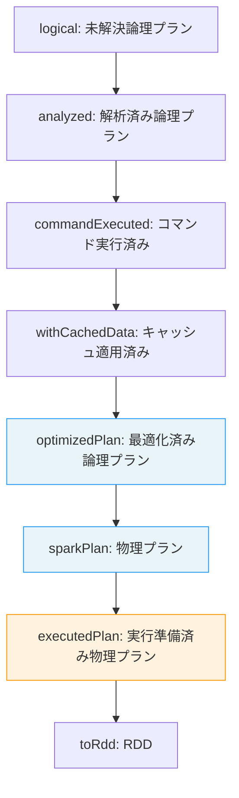
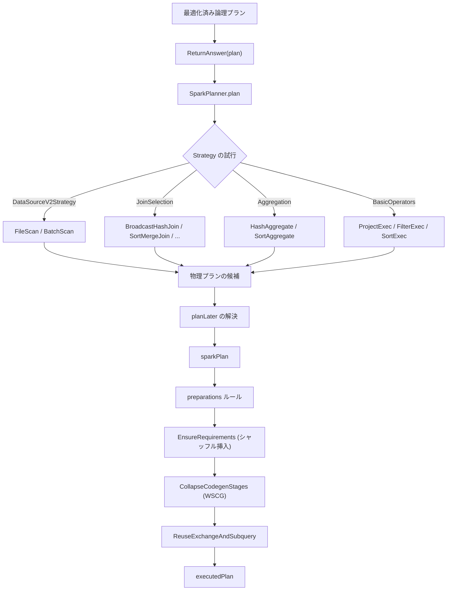

# 第17章 Catalyst: 物理プラン生成

> 本章で読むソース
>
> - [`sql/catalyst/src/main/scala/org/apache/spark/sql/catalyst/planning/QueryPlanner.scala` L29-L105](https://github.com/apache/spark/blob/v4.1.2/sql/catalyst/src/main/scala/org/apache/spark/sql/catalyst/planning/QueryPlanner.scala#L29-L105)
> - [`sql/core/src/main/scala/org/apache/spark/sql/execution/SparkPlanner.scala` L31-L119](https://github.com/apache/spark/blob/v4.1.2/sql/core/src/main/scala/org/apache/spark/sql/execution/SparkPlanner.scala#L31-L119)
> - [`sql/core/src/main/scala/org/apache/spark/sql/execution/SparkStrategies.scala` L61-L64](https://github.com/apache/spark/blob/v4.1.2/sql/core/src/main/scala/org/apache/spark/sql/execution/SparkStrategies.scala#L61-L64)
> - [`sql/core/src/main/scala/org/apache/spark/sql/execution/SparkStrategies.scala` L92-L145](https://github.com/apache/spark/blob/v4.1.2/sql/core/src/main/scala/org/apache/spark/sql/execution/SparkStrategies.scala#L92-L145)
> - [`sql/core/src/main/scala/org/apache/spark/sql/execution/SparkStrategies.scala` L181-L329](https://github.com/apache/spark/blob/v4.1.2/sql/core/src/main/scala/org/apache/spark/sql/execution/SparkStrategies.scala#L181-L329)
> - [`sql/core/src/main/scala/org/apache/spark/sql/execution/SparkPlan.scala` L65-L199](https://github.com/apache/spark/blob/v4.1.2/sql/core/src/main/scala/org/apache/spark/sql/execution/SparkPlan.scala#L65-L199)
> - [`sql/core/src/main/scala/org/apache/spark/sql/execution/QueryExecution.scala` L64-L70](https://github.com/apache/spark/blob/v4.1.2/sql/core/src/main/scala/org/apache/spark/sql/execution/QueryExecution.scala#L64-L70)
> - [`sql/core/src/main/scala/org/apache/spark/sql/execution/QueryExecution.scala` L263-L296](https://github.com/apache/spark/blob/v4.1.2/sql/core/src/main/scala/org/apache/spark/sql/execution/QueryExecution.scala#L263-L296)
> - [`sql/core/src/main/scala/org/apache/spark/sql/execution/QueryExecution.scala` L595-L657](https://github.com/apache/spark/blob/v4.1.2/sql/core/src/main/scala/org/apache/spark/sql/execution/QueryExecution.scala#L595-L657)
> - [`sql/core/src/main/scala/org/apache/spark/sql/execution/basicPhysicalOperators.scala` L42-L119](https://github.com/apache/spark/blob/v4.1.2/sql/core/src/main/scala/org/apache/spark/sql/execution/basicPhysicalOperators.scala#L42-L119)
> - [`sql/core/src/main/scala/org/apache/spark/sql/execution/joins/SortMergeJoinExec.scala` L39-L150](https://github.com/apache/spark/blob/v4.1.2/sql/core/src/main/scala/org/apache/spark/sql/execution/joins/SortMergeJoinExec.scala#L39-L150)
> - [`sql/core/src/main/scala/org/apache/spark/sql/execution/joins/BroadcastHashJoinExec.scala` L40-L150](https://github.com/apache/spark/blob/v4.1.2/sql/core/src/main/scala/org/apache/spark/sql/execution/joins/BroadcastHashJoinExec.scala#L40-L150)

## この章の狙い

最適化された論理プランは、`SparkPlanner` によって物理プラン（`SparkPlan`）に変換される。
本章では、`QueryPlanner` の仕組み、`Strategy` による物理オペレータの選択、`JoinSelection` での結合アルゴリズム選定、`QueryExecution` のパイプライン、そして代表的な物理オペレータの構造を追う。

## 前提

`Optimizer` が最適化した論理プランを入力とする（第16章）。
物理プランは `RDD[InternalRow]` を生成するオペレータツリーである（第9章、第10章）。
`QueryExecution` が解析から実行までの全体を管轄する。

## 17.1 QueryPlanner と Strategy

### 17.1.1 QueryPlanner の構造

`QueryPlanner` は論理プランを物理プランに変換する抽象クラスである。

[`sql/catalyst/src/main/scala/org/apache/spark/sql/catalyst/planning/QueryPlanner.scala` L29-L105](https://github.com/apache/spark/blob/v4.1.2/sql/catalyst/src/main/scala/org/apache/spark/sql/catalyst/planning/QueryPlanner.scala#L29-L105)

```scala
abstract class GenericStrategy[PhysicalPlan <: TreeNode[PhysicalPlan]] extends Logging {
  protected def planLater(plan: LogicalPlan): PhysicalPlan
  def apply(plan: LogicalPlan): Seq[PhysicalPlan]
}

abstract class QueryPlanner[PhysicalPlan <: TreeNode[PhysicalPlan]] {
  def strategies: Seq[GenericStrategy[PhysicalPlan]]

  def plan(plan: LogicalPlan): Iterator[PhysicalPlan] = {
    val candidates = strategies.iterator.flatMap(_(plan))
    val plans = candidates.flatMap { candidate =>
      val placeholders = collectPlaceholders(candidate)
      if (placeholders.isEmpty) {
        Iterator(candidate)
      } else {
        placeholders.iterator.foldLeft(Iterator(candidate)) {
          case (candidatesWithPlaceholders, (placeholder, logicalPlan)) =>
            val childPlans = this.plan(logicalPlan)
            candidatesWithPlaceholders.flatMap { candidateWithPlaceholders =>
              childPlans.map { childPlan =>
                candidateWithPlaceholders.transformUp {
                  case p if p.eq(placeholder) => childPlan
                }
              }
            }
        }
      }
    }
    val pruned = prunePlans(plans)
    assert(pruned.hasNext, s"No plan for $plan")
    pruned
  }

  protected def collectPlaceholders(
    plan: PhysicalPlan): Seq[(PhysicalPlan, LogicalPlan)]
  protected def prunePlans(plans: Iterator[PhysicalPlan]): Iterator[PhysicalPlan]
}
```

`QueryPlanner` は `strategies` のリストを順に試し、各ストラテジが物理プランの候補を返す。
`planLater` はプレースホルダ（`PlanLater`）を返し、後続のストラテジで再帰的に埋める。
`prunePlans` は現在すべての候補をそのまま返す（将来の拡張余地）。

### 17.1.2 SparkPlanner

`SparkPlanner` は `QueryPlanner[SparkPlan]` の具象クラスである。

[`sql/core/src/main/scala/org/apache/spark/sql/execution/SparkPlanner.scala` L31-L57](https://github.com/apache/spark/blob/v4.1.2/sql/core/src/main/scala/org/apache/spark/sql/execution/SparkPlanner.scala#L31-L57)

```scala
class SparkPlanner(val session: SparkSession, val experimentalMethods: ExperimentalMethods)
  extends SparkStrategies {

  def conf: SQLConf = session.sessionState.conf
  def numPartitions: Int = conf.numShufflePartitions

  override def strategies: Seq[Strategy] =
    experimentalMethods.extraStrategies ++
      extraPlanningStrategies ++ (
      LogicalQueryStageStrategy ::
      PythonEvals ::
      new DataSourceV2Strategy(session) ::
      V2CommandStrategy ::
      FileSourceStrategy ::
      DataSourceStrategy ::
      SpecialLimits ::
      Aggregation ::
      Window ::
      WindowGroupLimit ::
      JoinSelection ::
      InMemoryScans ::
      SparkScripts ::
      Pipelines ::
      BasicOperators ::
      EventTimeWatermarkStrategy :: Nil)
```

ストラテジのリストは優先順位付きである。
先頭のストラテジが先に試され、最初に成功した候補が採用される。
`JoinSelection` が結合アルゴリズムを選び、`BasicOperators` が残りの論理オペレータを物理オペレータに変換する。

### 17.1.3 SparkStrategy

[`sql/core/src/main/scala/org/apache/spark/sql/execution/SparkStrategies.scala` L61-L64](https://github.com/apache/spark/blob/v4.1.2/sql/core/src/main/scala/org/apache/spark/sql/execution/SparkStrategies.scala#L61-L64)

```scala
abstract class SparkStrategy extends GenericStrategy[SparkPlan] {
  override protected def planLater(plan: LogicalPlan): SparkPlan = PlanLater(plan)
}
```

`SparkStrategy` は `GenericStrategy[SparkPlan]` の型エイリアス的な基底クラスである。
`planLater` は `PlanLater` ノードを生成し、後続のストラテジで再帰的に計画する。

## 17.2 JoinSelection: 結合アルゴリズムの選択

`JoinSelection` は等価結合に対して5つの物理結合戦略から最適なものを選ぶ。

[`sql/core/src/main/scala/org/apache/spark/sql/execution/SparkStrategies.scala` L181-L329](https://github.com/apache/spark/blob/v4.1.2/sql/core/src/main/scala/org/apache/spark/sql/execution/SparkStrategies.scala#L181-L329)

```scala
object JoinSelection extends Strategy with JoinSelectionHelper {
  def apply(plan: LogicalPlan): Seq[SparkPlan] = plan match {
    case j @ ExtractEquiJoinKeys(joinType, leftKeys, rightKeys, nonEquiCond,
        _, left, right, hint) =>
      val hashJoinSupport = hashJoinSupported(leftKeys, rightKeys)

      def createBroadcastHashJoin(onlyLookingAtHint: Boolean) = {
        if (hashJoinSupport) {
          val buildSide = getBroadcastBuildSide(j, onlyLookingAtHint, conf)
          buildSide.map { buildSide =>
            Seq(joins.BroadcastHashJoinExec(
              leftKeys, rightKeys, joinType, buildSide,
              nonEquiCond, planLater(left), planLater(right)))
          }
        } else { None }
      }

      def createShuffleHashJoin(onlyLookingAtHint: Boolean) = {
        if (hashJoinSupport) {
          val buildSide = getShuffleHashJoinBuildSide(j, onlyLookingAtHint, conf)
          buildSide.map { buildSide =>
            Seq(joins.ShuffledHashJoinExec(
              leftKeys, rightKeys, joinType, buildSide,
              nonEquiCond, planLater(left), planLater(right)))
          }
        } else { None }
      }

      def createSortMergeJoin() = {
        if (canMerge(joinType) && RowOrdering.isOrderable(leftKeys)) {
          Some(Seq(joins.SortMergeJoinExec(
            leftKeys, rightKeys, joinType, nonEquiCond,
            planLater(left), planLater(right))))
        } else { None }
      }

      def createCartesianProduct() = {
        if (joinType.isInstanceOf[InnerLike] && !hintToNotBroadcastAndReplicate(hint)) {
          Some(Seq(joins.CartesianProductExec(
            planLater(left), planLater(right), j.condition)))
        } else { None }
      }

      def createJoinWithoutHint() = {
        createBroadcastHashJoin(false)
          .orElse(createShuffleHashJoin(false))
          .orElse(createSortMergeJoin())
          .orElse(createCartesianProduct())
          .getOrElse {
            val buildSide = getSmallerSide(left, right)
            Seq(joins.BroadcastNestedLoopJoinExec(
              planLater(left), planLater(right),
              buildSide, joinType, j.condition))
          }
      }

      if (hint.isEmpty) {
        createJoinWithoutHint()
      } else {
        createBroadcastHashJoin(true)
          .orElse { if (hintToSortMergeJoin(hint)) createSortMergeJoin() else None }
          .orElse(createShuffleHashJoin(true))
          .orElse { if (hintToShuffleReplicateNL(hint)) createCartesianProduct() else None }
          .getOrElse(createJoinWithoutHint())
      }
    // ...
  }
}
```

等価結合の選択優先度は以下の通りである。

1. **BroadcastHashJoin**: 片側が十分小さく、ブロードキャスト可能な場合。
2. **ShuffledHashJoin**: 片側がハッシュマップを構築できる程度に小さく、`preferSortMergeJoin` が `false` の場合。
3. **SortMergeJoin**: 結合キーがソート可能な場合。
4. **CartesianProduct**: 内部結合でシャッフル&レプリケートが可能な場合。
5. **BroadcastNestedLoopJoin**: 最終手段。非等価結合も処理できるが遅い。

ヒントがある場合、ヒントに従った戦略を先に試し、適用できなければフォールバックする。

## 17.3 SparkPlan: 物理オペレータの基底

`SparkPlan` は物理オペレータの基底クラスである。

[`sql/core/src/main/scala/org/apache/spark/sql/execution/SparkPlan.scala` L65-L199](https://github.com/apache/spark/blob/v4.1.2/sql/core/src/main/scala/org/apache/spark/sql/execution/SparkPlan.scala#L65-L199)

```scala
abstract class SparkPlan extends QueryPlan[SparkPlan] with Logging with Serializable {
  @transient final val session = SparkSession.getActiveSession.orNull
  val id: Int = SparkPlan.newPlanId()

  def supportsRowBased: Boolean = !supportsColumnar
  def supportsColumnar: Boolean = false

  def metrics: Map[String, SQLMetric] = Map.empty

  def outputPartitioning: Partitioning = UnknownPartitioning(0)

  def requiredChildDistribution: Seq[Distribution] =
    Seq.fill(children.size)(UnspecifiedDistribution)

  def requiredChildOrdering: Seq[Seq[SortOrder]] =
    Seq.fill(children.size)(Nil)

  final def execute(): RDD[InternalRow] = executeQuery {
    if (isCanonicalizedPlan) {
      throw SparkException.internalError("A canonicalized plan is not supposed to be executed.")
    }
    executeRDD.get
  }

  final def executeBroadcast[T](): broadcast.Broadcast[T] = executeQuery {
    executeBroadcastBcast.get.asInstanceOf[broadcast.Broadcast[T]]
  }
```

`SparkPlan` の重要な性質:

- `outputPartitioning`: 出力データのパーティション分割方法。
- `requiredChildDistribution`: 子ノードに要求するデータ分布。
- `requiredChildOrdering`: 子ノードに要求するソート順序。
- `execute()`: `RDD[InternalRow]` を生成する。
- `executeBroadcast()`: ブロードキャスト変数を生成する。

`EnsureRequirements` ルールが `requiredChildDistribution` と `requiredChildOrdering` を満たすために `ShuffleExchangeExec` や `SortExec` を挿入する。

## 17.4 QueryExecution: パイプラインの全体

`QueryExecution` はクエリの全段階を管理する。

[`sql/core/src/main/scala/org/apache/spark/sql/execution/QueryExecution.scala` L64-L70](https://github.com/apache/spark/blob/v4.1.2/sql/core/src/main/scala/org/apache/spark/sql/execution/QueryExecution.scala#L64-L70)

```scala
class QueryExecution(
    val sparkSession: SparkSession,
    val logical: LogicalPlan,
    val tracker: QueryPlanningTracker = new QueryPlanningTracker,
    val mode: CommandExecutionMode.Value = CommandExecutionMode.ALL,
    val shuffleCleanupMode: ShuffleCleanupMode = DoNotCleanup,
    val refreshPhaseEnabled: Boolean = true) extends Logging {
```

### 17.4.1 各段階の遅延評価

[`sql/core/src/main/scala/org/apache/spark/sql/execution/QueryExecution.scala` L263-L296](https://github.com/apache/spark/blob/v4.1.2/sql/core/src/main/scala/org/apache/spark/sql/execution/QueryExecution.scala#L263-L296)

```scala
private val lazySparkPlan = LazyTry {
  assertOptimized()
  executePhase(QueryPlanningTracker.PLANNING) {
    QueryExecution.createSparkPlan(planner, optimizedPlan.clone())
  }
}

def sparkPlan: SparkPlan = lazySparkPlan.get

private val lazyExecutedPlan = LazyTry {
  assertOptimized()
  val plan = executePhase(QueryPlanningTracker.PLANNING) {
    QueryExecution.prepareForExecution(preparations, sparkPlan.clone())
  }
  tracker.setReadyForExecution()
  plan
}

def executedPlan: SparkPlan = lazyExecutedPlan.get
```

各段階は `LazyTry` で遅延評価される。



### 17.4.2 createSparkPlan

[`sql/core/src/main/scala/org/apache/spark/sql/execution/QueryExecution.scala` L651-L657](https://github.com/apache/spark/blob/v4.1.2/sql/core/src/main/scala/org/apache/spark/sql/execution/QueryExecution.scala#L651-L657)

```scala
def createSparkPlan(
    planner: SparkPlanner,
    plan: LogicalPlan): SparkPlan = {
  planner.plan(ReturnAnswer(plan)).next()
}
```

`ReturnAnswer` をプランの先頭に挿入し、`SparkPlanner.plan` を呼ぶ。
`next()` で最初の候補を取得する。現在は複数の物理プラン候補からコストベースで選ぶ機構はない。

### 17.4.3 preparations: 実行準備ルール

[`sql/core/src/main/scala/org/apache/spark/sql/execution/QueryExecution.scala` L595-L627](https://github.com/apache/spark/blob/v4.1.2/sql/core/src/main/scala/org/apache/spark/sql/execution/QueryExecution.scala#L595-L627)

```scala
private[execution] def preparations(
    sparkSession: SparkSession,
    adaptiveExecutionRule: Option[InsertAdaptiveSparkPlan] = None,
    subquery: Boolean): Seq[Rule[SparkPlan]] = {
  adaptiveExecutionRule.toSeq ++
  Seq(
    CoalesceBucketsInJoin,
    PlanDynamicPruningFilters(sparkSession),
    PlanSubqueries(sparkSession),
    RemoveRedundantProjects,
    EnsureRequirements(),
    InsertSortForLimitAndOffset,
    ReplaceHashWithSortAgg,
    RemoveRedundantSorts,
    RemoveRedundantWindowGroupLimits,
    DisableUnnecessaryBucketedScan,
    ApplyColumnarRulesAndInsertTransitions(
      sparkSession.sessionState.columnarRules, outputsColumnar = false),
    CollapseCodegenStages()) ++
    (if (subquery) { Nil } else { Seq(ReuseExchangeAndSubquery) })
}
```

`EnsureRequirements` はデータ分布とソート順序の要件を満たすためにシャッフルを挿入する。
`CollapseCodegenStages` は Whole-Stage Code Generation の対象範囲を決定する。
`InsertAdaptiveSparkPlan` は AQE（Adaptive Query Execution）を有効化する。
`ReuseExchangeAndSubquery` は同一のシャッフルやサブクエリを再利用する。

## 17.5 物理オペレータ

### 17.5.1 ProjectExec

[`sql/core/src/main/scala/org/apache/spark/sql/execution/basicPhysicalOperators.scala` L42-L119](https://github.com/apache/spark/blob/v4.1.2/sql/core/src/main/scala/org/apache/spark/sql/execution/basicPhysicalOperators.scala#L42-L119)

```scala
case class ProjectExec(projectList: Seq[NamedExpression], child: SparkPlan)
  extends UnaryExecNode
    with CodegenSupport
    with PartitioningPreservingUnaryExecNode
    with OrderPreservingUnaryExecNode {

  override def output: Seq[Attribute] = projectList.map(_.toAttribute)

  protected override def doProduce(ctx: CodegenContext): String = {
    child.asInstanceOf[CodegenSupport].produce(ctx, this)
  }

  override def doConsume(ctx: CodegenContext, input: Seq[ExprCode], row: ExprCode): String = {
    val exprs = bindReferences[Expression](projectList, child.output)
    val (subExprsCode, resultVars, localValInputs) =
      if (conf.subexpressionEliminationEnabled) {
        val subExprs = ctx.subexpressionEliminationForWholeStageCodegen(exprs)
        val genVars = ctx.withSubExprEliminationExprs(subExprs.states) {
          exprs.map(_.genCode(ctx))
        }
        (ctx.evaluateSubExprEliminationState(subExprs.states.values), genVars,
          subExprs.exprCodesNeedEvaluate)
      } else {
        ("", exprs.map(_.genCode(ctx)), Seq.empty)
      }
    // ... (中略) ...
  }

  protected override def doExecute(): RDD[InternalRow] = {
    val evaluatorFactory = new ProjectEvaluatorFactory(projectList, child.output)
    if (conf.usePartitionEvaluator) {
      child.execute().mapPartitionsWithEvaluator(evaluatorFactory)
    } else {
      child.execute().mapPartitionsWithIndexInternal { (index, iter) =>
        val evaluator = evaluatorFactory.createEvaluator()
        evaluator.eval(index, iter)
      }
    }
  }
}
```

`ProjectExec` は `CodegenSupport` を実装し、Whole-Stage Code Generation で子オペレータと結合してコード生成される。
`doConsume` は子から受け取った各行に対して射影のコードを生成する。
`subexpressionEliminationEnabled` が有効なら、共通部分式を削除して同じ計算を繰り返さない。

### 17.5.2 SortMergeJoinExec

[`sql/core/src/main/scala/org/apache/spark/sql/execution/joins/SortMergeJoinExec.scala` L39-L150](https://github.com/apache/spark/blob/v4.1.2/sql/core/src/main/scala/org/apache/spark/sql/execution/joins/SortMergeJoinExec.scala#L39-L150)

```scala
case class SortMergeJoinExec(
    leftKeys: Seq[Expression],
    rightKeys: Seq[Expression],
    joinType: JoinType,
    condition: Option[Expression],
    left: SparkPlan,
    right: SparkPlan,
    isSkewJoin: Boolean = false) extends ShuffledJoin {

  override def requiredChildOrdering: Seq[Seq[SortOrder]] =
    requiredOrders(leftKeys) :: requiredOrders(rightKeys) :: Nil

  private def requiredOrders(keys: Seq[Expression]): Seq[SortOrder] = {
    keys.map(SortOrder(_, Ascending))
  }

  protected override def doExecute(): RDD[InternalRow] = {
    val numOutputRows = longMetric("numOutputRows")
    val spillSize = longMetric("spillSize")
    val spillThreshold = getSpillThreshold
    val sizeInBytesSpillThreshold = getSizeInBytesSpillThreshold
    val inMemoryThreshold = getInMemoryThreshold
    val evaluatorFactory = new SortMergeJoinEvaluatorFactory(
      leftKeys, rightKeys, joinType, condition,
      left, right, output,
      inMemoryThreshold, spillThreshold, sizeInBytesSpillThreshold,
      numOutputRows, spillSize, onlyBufferFirstMatchedRow)
    if (conf.usePartitionEvaluator) {
      left.execute().zipPartitionsWithEvaluator(right.execute(), evaluatorFactory)
    } else {
      left.execute().zipPartitions(right.execute()) { (leftIter, rightIter) =>
        val evaluator = evaluatorFactory.createEvaluator()
        evaluator.eval(0, leftIter, rightIter)
      }
    }
  }
}
```

`SortMergeJoinExec` は両側をソート済みにする必要があり、`requiredChildOrdering` で昇順を要求する。
`EnsureRequirements` が子に `SortExec` を挿入する。
`zipPartitions` で対応するパーティション同士をマージする。
`spillThreshold` を超えるとディスクにスピルバックする。

なぜ速いのか: ソートマージ結合はストリーミング処理で結合できるため、ハッシュテーブルのメモリ消費が発生しない。
大きなテーブル同士の結合でハッシュ結合が OOM になる場合でも安定して動作する。

### 17.5.3 BroadcastHashJoinExec

[`sql/core/src/main/scala/org/apache/spark/sql/execution/joins/BroadcastHashJoinExec.scala` L40-L150](https://github.com/apache/spark/blob/v4.1.2/sql/core/src/main/scala/org/apache/spark/sql/execution/joins/BroadcastHashJoinExec.scala#L40-L150)

```scala
case class BroadcastHashJoinExec private(
    leftKeys: Seq[Expression],
    rightKeys: Seq[Expression],
    joinType: JoinType,
    buildSide: BuildSide,
    condition: Option[Expression],
    left: SparkPlan,
    right: SparkPlan,
    isNullAwareAntiJoin: Boolean = false)
  extends HashJoin {

  override def requiredChildDistribution: Seq[Distribution] = {
    val mode = HashedRelationBroadcastMode(buildBoundKeys, isNullAwareAntiJoin)
    buildSide match {
      case BuildLeft =>
        BroadcastDistribution(mode) :: UnspecifiedDistribution :: Nil
      case BuildRight =>
        UnspecifiedDistribution :: BroadcastDistribution(mode) :: Nil
    }
  }

  protected override def doExecute(): RDD[InternalRow] = {
    val numOutputRows = longMetric("numOutputRows")
    val broadcastRelation = buildPlan.executeBroadcast[HashedRelation]()
    // ... (中略) ...
    streamedPlan.execute().mapPartitionsInternal { streamedIter =>
      val hashed = broadcastRelation.value.asReadOnlyCopy()
      TaskContext.get().taskMetrics().incPeakExecutionMemory(hashed.estimatedSize)
      // ... (中略) ...
    }
  }
}
```

`BroadcastHashJoinExec` は小さい側をブロードキャスト変数として全エグゼキュータに配布する。
ストリーミング側はシャッフル不要で、各パーティションがローカルでハッシュ検索する。
`requiredChildDistribution` は `BroadcastDistribution` でブロードキャスト側を指定し、`EnsureRequirements` が `BroadcastExchangeExec` を挿入する。

なぜ速いのか: ストリーミング側のシャッフルが不要であり、ネットワーク転送はブロードキャスト1回だけである。
小さいテーブルをブロードキャストできる場合、最も高速な結合アルゴリズムになる。

## 17.6 SpecialLimits: Limit の物理プラン

`SpecialLimits` は `LIMIT` + `ORDER BY` の組み合わせを `TakeOrderedAndProjectExec` に変換する。

[`sql/core/src/main/scala/org/apache/spark/sql/execution/SparkStrategies.scala` L92-L145](https://github.com/apache/spark/blob/v4.1.2/sql/core/src/main/scala/org/apache/spark/sql/execution/SparkStrategies.scala#L92-L145)

```scala
object SpecialLimits extends Strategy {
  override def apply(plan: LogicalPlan): Seq[SparkPlan] = plan match {
    case ReturnAnswer(rootPlan) => planTakeOrdered(rootPlan).getOrElse(rootPlan match {
      case Limit(IntegerLiteral(limit), child) =>
        CollectLimitExec(limit = limit, child = planLater(child))
      // ... (中略) ...
    }) :: Nil
    case other => planTakeOrdered(other).toSeq
  }

  private def planTakeOrdered(plan: LogicalPlan): Option[SparkPlan] = plan match {
    case Limit(IntegerLiteral(limit), Sort(order, true, child, _))
        if limit < conf.topKSortFallbackThreshold =>
      Some(TakeOrderedAndProjectExec(
        limit, order, child.output, planLater(child)))
    case Limit(IntegerLiteral(limit), Project(projectList, Sort(order, true, child, _)))
        if limit < conf.topKSortFallbackThreshold =>
      Some(TakeOrderedAndProjectExec(
        limit, order, projectList, planLater(child)))
    case _ => None
  }
}
```

`LIMIT 10 ORDER BY col` のようなクエリで、`limit` が `topKSortFallbackThreshold` 未満なら `TakeOrderedAndProjectExec` を使う。
これは各パーティションでトップKだけを保持し、ドライバで統合するため、全データをソートする必要がない。

## 17.7 物理プラン生成の全体像



## まとめ

本章では物理プラン生成の仕組みを追った。

- `QueryPlanner` は `Strategy` のリストを順に試し、`planLater` で再帰的に子プランを計画する。
- `SparkPlanner` は `JoinSelection`、`Aggregation`、`BasicOperators` 等のストラテジを優先順位付きで持つ。
- `JoinSelection` はブロードキャストハッシュ、シャッフルハッシュ、ソートマージ、カルテシアン、ブロードキャストNLの5つから選ぶ。
- `SparkPlan` は `RDD[InternalRow]` を生成し、`outputPartitioning` と `requiredChildDistribution` でデータ分布を管理する。
- `QueryExecution` は `analyzed` から `executedPlan` までの各段階を `LazyTry` で遅延評価する。
- `preparations` ルール群が `EnsureRequirements`（シャッフル挿入）、`CollapseCodegenStages`（WSCG）、`ReuseExchangeAndSubquery` を適用する。
- `SortMergeJoinExec` はストリーミングマージでメモリ消費を抑え、`BroadcastHashJoinExec` はシャッフル不要で最速の結合を実現する。

## 関連する章

- 第15章: Catalyst: 論理プランと解析（論理プランの構造）
- 第16章: Catalyst: クエリ最適化（最適化ルール）
- 第18章: Tungsten: オフヒープメモリと Whole-Stage Code Generation（WSCG の詳細）
- 第19章: SQL 実行エンジン（物理オペレータと内部データ型）
- 第20章: Adaptive Query Execution（実行時の適応的プラン変更）
