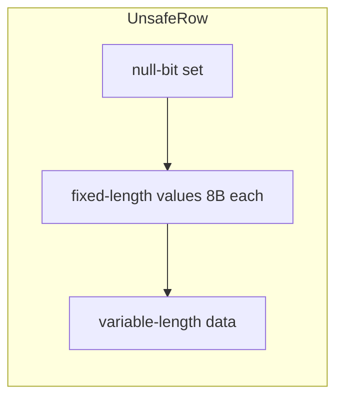
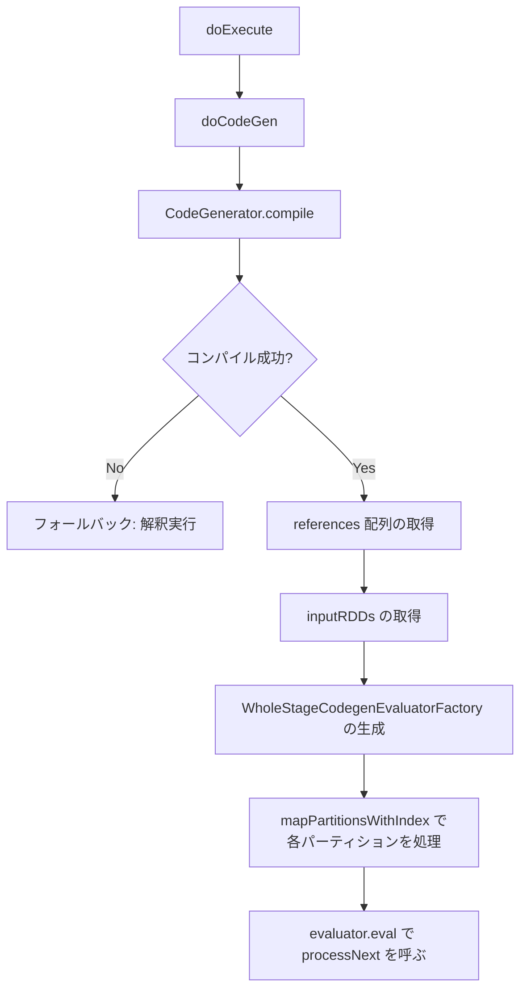

# 第18章 Tungsten: オフヒープメモリと Whole-Stage Code Generation

> 本章で読むソース
>
> - [`common/unsafe/src/main/java/org/apache/spark/unsafe/Platform.java` L28-L46](https://github.com/apache/spark/blob/v4.1.2/common/unsafe/src/main/java/org/apache/spark/unsafe/Platform.java#L28-L46)
> - [`common/unsafe/src/main/java/org/apache/spark/unsafe/Platform.java` L119-L196](https://github.com/apache/spark/blob/v4.1.2/common/unsafe/src/main/java/org/apache/spark/unsafe/Platform.java#L119-L196)
> - [`common/unsafe/src/main/java/org/apache/spark/unsafe/Platform.java` L280-L338](https://github.com/apache/spark/blob/v4.1.2/common/unsafe/src/main/java/org/apache/spark/unsafe/Platform.java#L280-L338)
> - [`common/unsafe/src/main/java/org/apache/spark/unsafe/memory/MemoryBlock.java` L27-L82](https://github.com/apache/spark/blob/v4.1.2/common/unsafe/src/main/java/org/apache/spark/unsafe/memory/MemoryBlock.java#L27-L82)
> - [`common/utils-java/src/main/java/org/apache/spark/memory/MemoryMode.java` L23-L26](https://github.com/apache/spark/blob/v4.1.2/common/utils-java/src/main/java/org/apache/spark/memory/MemoryMode.java#L23-L26)
> - [`sql/catalyst/src/main/java/org/apache/spark/sql/catalyst/expressions/UnsafeRow.java` L48-L176](https://github.com/apache/spark/blob/v4.1.2/sql/catalyst/src/main/java/org/apache/spark/sql/catalyst/expressions/UnsafeRow.java#L48-L176)
> - [`sql/catalyst/src/main/java/org/apache/spark/sql/catalyst/expressions/UnsafeRow.java` L330-L400](https://github.com/apache/spark/blob/v4.1.2/sql/catalyst/src/main/java/org/apache/spark/sql/catalyst/expressions/UnsafeRow.java#L330-L400)
> - [`sql/catalyst/src/main/java/org/apache/spark/sql/catalyst/expressions/UnsafeArrayData.java` L48-L139](https://github.com/apache/spark/blob/v4.1.2/sql/catalyst/src/main/java/org/apache/spark/sql/catalyst/expressions/UnsafeArrayData.java#L48-L139)
> - [`sql/catalyst/src/main/java/org/apache/spark/sql/catalyst/expressions/codegen/BufferHolder.java` L38-L116](https://github.com/apache/spark/blob/v4.1.2/sql/catalyst/src/main/java/org/apache/spark/sql/catalyst/expressions/codegen/BufferHolder.java#L38-L116)
> - [`sql/catalyst/src/main/scala/org/apache/spark/sql/catalyst/expressions/codegen/CodeGenerator.scala` L53-L78](https://github.com/apache/spark/blob/v4.1.2/sql/catalyst/src/main/scala/org/apache/spark/sql/catalyst/expressions/codegen/CodeGenerator.scala#L53-L78)
> - [`sql/catalyst/src/main/scala/org/apache/spark/sql/catalyst/expressions/codegen/CodeGenerator.scala` L136-L312](https://github.com/apache/spark/blob/v4.1.2/sql/catalyst/src/main/scala/org/apache/spark/sql/catalyst/expressions/codegen/CodeGenerator.scala#L136-L312)
> - [`sql/catalyst/src/main/scala/org/apache/spark/sql/catalyst/expressions/codegen/GenerateUnsafeProjection.scala` L34-L47](https://github.com/apache/spark/blob/v4.1.2/sql/catalyst/src/main/scala/org/apache/spark/sql/catalyst/expressions/codegen/GenerateUnsafeProjection.scala#L34-L47)
> - [`sql/catalyst/src/main/scala/org/apache/spark/sql/catalyst/expressions/codegen/GenerateUnsafeProjection.scala` L286-L381](https://github.com/apache/spark/blob/v4.1.2/sql/catalyst/src/main/scala/org/apache/spark/sql/catalyst/expressions/codegen/GenerateUnsafeProjection.scala#L286-L381)
> - [`sql/core/src/main/scala/org/apache/spark/sql/execution/WholeStageCodegenExec.scala` L47-L101](https://github.com/apache/spark/blob/v4.1.2/sql/core/src/main/scala/org/apache/spark/sql/execution/WholeStageCodegenExec.scala#L47-L101)
> - [`sql/core/src/main/scala/org/apache/spark/sql/execution/WholeStageCodegenExec.scala` L635-L793](https://github.com/apache/spark/blob/v4.1.2/sql/core/src/main/scala/org/apache/spark/sql/execution/WholeStageCodegenExec.scala#L635-L793)
> - [`sql/core/src/main/scala/org/apache/spark/sql/execution/WholeStageCodegenExec.scala` L906-L987](https://github.com/apache/spark/blob/v4.1.2/sql/core/src/main/scala/org/apache/spark/sql/execution/WholeStageCodegenExec.scala#L906-L987)

## この章の狙い

**Tungsten** は Spark のデータ処理レイヤーのうち、メモリレイアウトとコード生成に特化した基盤技術である。
従来の JVM オブジェクト中心のデータ表現を捨て、オフヒープメモリ上にバイナリ形式で行を配置し、JIT コンパイラが最適化しやすい Java コードを動的に生成する。
本章では `Platform` クラスが提供するメモリアクセスプリミティブ、`UnsafeRow` のバイナリレイアウト、`WholeStageCodegenExec` によるパイプライン単位のコード生成を追う。

## 前提

`Catalyst` は論理プランの最適化フレームワークである（第15章、第16章、第17章）。
物理プランの実行時には `InternalRow` を行の抽象表現として使う（第19章）。
`MemoryMode` はオンヒープかオフヒープかの選択を表す。

## 18.1 Platform: メモリアクセスのプリミティブ

`Platform` クラスは `sun.misc.Unsafe` をラップし、JVM のヒープ内外を統一的にアクセスするプリミティブを提供する。

[`common/unsafe/src/main/java/org/apache/spark/unsafe/Platform.java` L28-L46](https://github.com/apache/spark/blob/v4.1.2/common/unsafe/src/main/java/org/apache/spark/unsafe/Platform.java#L28-L46)

```java
public final class Platform {

  private static final Unsafe _UNSAFE;

  public static final int BOOLEAN_ARRAY_OFFSET;
  public static final int BYTE_ARRAY_OFFSET;
  public static final int SHORT_ARRAY_OFFSET;
  public static final int INT_ARRAY_OFFSET;
  public static final int LONG_ARRAY_OFFSET;
  public static final int FLOAT_ARRAY_OFFSET;
  public static final int DOUBLE_ARRAY_OFFSET;

  private static final boolean unaligned;
  // ...
}
```

静的初期化ブロックで `Unsafe.theUnsafe` フィールドをリフレクションで取得し、各プリミティブ配列のベースオフセットを計算する。

[`common/unsafe/src/main/java/org/apache/spark/unsafe/Platform.java` L280-L308](https://github.com/apache/spark/blob/v4.1.2/common/unsafe/src/main/java/org/apache/spark/unsafe/Platform.java#L280-L308)

```java
static {
  sun.misc.Unsafe unsafe;
  try {
    Field unsafeField = Unsafe.class.getDeclaredField("theUnsafe");
    unsafeField.setAccessible(true);
    unsafe = (sun.misc.Unsafe) unsafeField.get(null);
  } catch (Throwable cause) {
    unsafe = null;
  }
  _UNSAFE = unsafe;

  if (_UNSAFE != null) {
    BOOLEAN_ARRAY_OFFSET = _UNSAFE.arrayBaseOffset(boolean[].class);
    BYTE_ARRAY_OFFSET = _UNSAFE.arrayBaseOffset(byte[].class);
    // ...
    LONG_ARRAY_OFFSET = _UNSAFE.arrayBaseOffset(long[].class);
    // ...
  }
  // ...
}
```

### 18.1.1 型付きアクセスとメモリ操作

`Platform` は `getInt`、`putLong` といった型付きの get/put メソッドを提供する。

[`common/unsafe/src/main/java/org/apache/spark/unsafe/Platform.java` L119-L196](https://github.com/apache/spark/blob/v4.1.2/common/unsafe/src/main/java/org/apache/spark/unsafe/Platform.java#L119-L196)

```java
public static int getInt(Object object, long offset) {
  return _UNSAFE.getInt(object, offset);
}

public static void putLong(Object object, long offset, long value) {
  _UNSAFE.putLong(object, offset, value);
}

// ...

public static long allocateMemory(long size) {
  return _UNSAFE.allocateMemory(size);
}

public static void freeMemory(long address) {
  _UNSAFE.freeMemory(address);
}

public static void copyMemory(
  Object src, long srcOffset, Object dst, long dstOffset, long length) {
  // ...
}
```

`object` が `null` の場合はオフヒープの絶対アドレスとして解釈し、非 `null` の場合はそのオブジェクトのヒープ内オフセットとして扱う。
この仕組みでオンヒープの `byte[]` とオフヒープの `allocateMemory` で確保した領域を同一の API で操作できる。

`unaligned` フラグは、x86、x64、aarch64 などのアーキテクチャで `true` となり、ワード境界に揃わないメモリアクセスが安全かどうかを示す。

[`common/unsafe/src/main/java/org/apache/spark/unsafe/Platform.java` L311-L338](https://github.com/apache/spark/blob/v4.1.2/common/unsafe/src/main/java/org/apache/spark/unsafe/Platform.java#L311-L338)

```java
static {
  boolean _unaligned;
  String arch = System.getProperty("os.arch", "");
  if (arch.equals("ppc64le") || arch.equals("ppc64") || arch.equals("s390x")) {
    _unaligned = true;
  } else {
    try {
      Class<?> bitsClass =
        Class.forName("java.nio.Bits", false, ClassLoader.getSystemClassLoader());
      if (_UNSAFE != null) {
        Field unalignedField = bitsClass.getDeclaredField("UNALIGNED");
        _unaligned = _UNSAFE.getBoolean(
          _UNSAFE.staticFieldBase(unalignedField), _UNSAFE.staticFieldOffset(unalignedField));
      } else {
        // ...
      }
    } catch (Throwable t) {
      _unaligned = arch.matches("^(i[3-6]86|x86(_64)?|x64|amd64|aarch64)$");
    }
  }
  unaligned = _unaligned;
}
```

なぜ速いのか: `Unsafe` 経由のメモリアクセスは JVM のバウンズチェックを迂回するため、配列要素へのアクセスが JNI 呼び出しより桁違いに速い。

### 18.1.2 MemoryBlock と MemoryMode

`MemoryBlock` は連続したメモリ領域を表す。

[`common/unsafe/src/main/java/org/apache/spark/unsafe/memory/MemoryBlock.java` L27-L82](https://github.com/apache/spark/blob/v4.1.2/common/unsafe/src/main/java/org/apache/spark/unsafe/memory/MemoryBlock.java#L27-L82)

```java
public class MemoryBlock extends MemoryLocation {

  public static final int NO_PAGE_NUMBER = -1;
  public static final int FREED_IN_TMM_PAGE_NUMBER = -2;
  public static final int FREED_IN_ALLOCATOR_PAGE_NUMBER = -3;

  private final long length;
  public int pageNumber = NO_PAGE_NUMBER;

  public MemoryBlock(@Nullable Object obj, long offset, long length) {
    super(obj, offset);
    this.length = length;
  }

  public long size() {
    return length;
  }

  public static MemoryBlock fromLongArray(final long[] array) {
    return new MemoryBlock(array, Platform.LONG_ARRAY_OFFSET, array.length * 8L);
  }

  public void fill(byte value) {
    Platform.setMemory(obj, offset, length, value);
  }
}
```

`obj` が `null` ならオフヒープアドレス、非 `null` ならヒープ上のオブジェクトを指す。
`pageNumber` は `TaskMemoryManager` がページを追跡するために使う。

`MemoryMode` は列挙型で、メモリ確保の戦略を選択する。

[`common/utils-java/src/main/java/org/apache/spark/memory/MemoryMode.java` L23-L26](https://github.com/apache/spark/blob/v4.1.2/common/utils-java/src/main/java/org/apache/spark/memory/MemoryMode.java#L23-L26)

```java
@Private
public enum MemoryMode {
  ON_HEAP,
  OFF_HEAP
}
```

`OFF_HEAP` を選択すると、JVM ヒープ外にメモリを確保するため、ガベージコレクションのオーバーヘッドを回避できる。

## 18.2 UnsafeRow: バイナリ形式の行レイアウト

`UnsafeRow` は `InternalRow` の実装であり、生のメモリ上にタプルのデータを配置する。

[`sql/catalyst/src/main/java/org/apache/spark/sql/catalyst/expressions/UnsafeRow.java` L48-L73](https://github.com/apache/spark/blob/v4.1.2/sql/catalyst/src/main/java/org/apache/spark/sql/catalyst/expressions/UnsafeRow.java#L48-L73)

```java
/**
 * An Unsafe implementation of Row which is backed by raw memory instead of Java objects.
 *
 * Each tuple has three parts: [null-tracking bit set] [values] [variable length portion]
 *
 * The null-tracking bit set is aligned to 8-byte word boundaries. It stores one bit per field.
 *
 * In the `values` region, we store one 8-byte word per field. For fields that hold fixed-length
 * primitive types, such as long, double, or int, we store the value directly in the word. For
 * fields with non-primitive or variable-length values, we store a relative offset (w.r.t. the
 * base address of the row) that points to the beginning of the variable-length field, and length
 * (they are combined into a long).
 */
public final class UnsafeRow extends InternalRow implements Externalizable, KryoSerializable {

  public static final int WORD_SIZE = 8;

  public static int calculateBitSetWidthInBytes(int numFields) {
    return ((numFields + 63)/ 64) * 8;
  }
  // ...
}
```

行のメモリレイアウトは3つの領域からなる。



1. **null-bit set**: 各フィールドに1ビット。8バイト境界にアラインされる。
2. **values 領域**: 各フィールドに8バイト。固定長プリミティブは値を直接格納する。可変長フィールドはオフセットとサイズを上位32ビット、下位32ビットにパックした `long` を格納する。
3. **可変長領域**: 文字列、バイナリ、配列、マップなどの実データを格納する。

### 18.2.1 pointTo とフィールドアクセス

`UnsafeRow` はコンストラクタではメモリを確保しない。`pointTo` で既存のメモリを指す。

[`sql/catalyst/src/main/java/org/apache/spark/sql/catalyst/expressions/UnsafeRow.java` L106-L176](https://github.com/apache/spark/blob/v4.1.2/sql/catalyst/src/main/java/org/apache/spark/sql/catalyst/expressions/UnsafeRow.java#L106-L176)

```java
private Object baseObject;
private long baseOffset;
private int numFields;
private int sizeInBytes;
private int bitSetWidthInBytes;

private long getFieldOffset(int ordinal) {
  return baseOffset + bitSetWidthInBytes + ordinal * 8L;
}

public void pointTo(Object baseObject, long baseOffset, int sizeInBytes) {
  assert numFields >= 0 : "numFields (" + numFields + ") should >= 0";
  assert sizeInBytes % 8 == 0 : "sizeInBytes (" + sizeInBytes + ") should be a multiple of 8";
  // ...
  this.baseObject = baseObject;
  this.baseOffset = baseOffset;
  this.sizeInBytes = sizeInBytes;
}
```

`pointTo` を呼ぶことで、`UnsafeRow` は `byte[]` 上でもオフヒープページ上でも同じインターフェースでデータを参照できる。

フィールドの読み取りは `Platform` のプリミティブを使う。

[`sql/catalyst/src/main/java/org/apache/spark/sql/catalyst/expressions/UnsafeRow.java` L330-L400](https://github.com/apache/spark/blob/v4.1.2/sql/catalyst/src/main/java/org/apache/spark/sql/catalyst/expressions/UnsafeRow.java#L330-L400)

```java
@Override
public int getInt(int ordinal) {
  assertIndexIsValid(ordinal);
  return Platform.getInt(baseObject, getFieldOffset(ordinal));
}

@Override
public long getLong(int ordinal) {
  assertIndexIsValid(ordinal);
  return Platform.getLong(baseObject, getFieldOffset(ordinal));
}

@Override
public UTF8String getUTF8String(int ordinal) {
  if (isNullAt(ordinal)) return null;
  final long offsetAndSize = getLong(ordinal);
  final int offset = (int) (offsetAndSize >> 32);
  final int size = (int) offsetAndSize;
  return UTF8String.fromAddress(baseObject, baseOffset + offset, size);
}
```

可変長の文字列は、values 領域に格納された `offsetAndSize` からオフセットとサイズを取り出し、`UTF8String.fromAddress` で直接メモリを参照する。
このとき `UTF8String` の内部も `baseObject` と `baseOffset` を保持するポインタ型であり、文字列データのコピーが発生しない。

なぜ速いのか: `UnsafeRow` は Java オブジェクトのヘッダ（16バイト以上）やフィールド参照の間接参照を排除し、8バイトワード単位で連続したメモリにデータを配置する。
これにより CPU キャッシュのヒット率が向上し、JIT コンパイラがループをベクトル化しやすくなる。

## 18.3 UnsafeArrayData: 配列のバイナリレイアウト

`UnsafeArrayData` は配列データをバイナリ形式で表現する。

[`sql/catalyst/src/main/java/org/apache/spark/sql/catalyst/expressions/UnsafeArrayData.java` L48-L77](https://github.com/apache/spark/blob/v4.1.2/sql/catalyst/src/main/java/org/apache/spark/sql/catalyst/expressions/UnsafeArrayData.java#L48-L77)

```java
/**
 * An Unsafe implementation of Array which is backed by raw memory instead of Java objects.
 *
 * Each array has four parts:
 *   [numElements][null bits][values or offset&length][variable length portion]
 *
 * The `numElements` is 8 bytes storing the number of elements of this array.
 */
public final class UnsafeArrayData extends ArrayData implements Externalizable, KryoSerializable {

  public static long calculateHeaderPortionInBytes(long numFields) {
    return 8 + ((numFields + 63)/ 64) * 8;
  }
  // ...
}
```

配列のメモリレイアウトは4つの部分からなる。

1. **numElements**: 要素数を格納する8バイト。
2. **null bits**: 各要素の null フラグ。8バイト境界にアラインされる。
3. **values/offset&length**: 固定長型は値を直接、可変長型はオフセットとサイズをパックした `long` を格納。
4. **可変長部分**: 実データ。

`pointTo` で `numElements` を先頭8バイトから読み取る。

[`sql/catalyst/src/main/java/org/apache/spark/sql/catalyst/expressions/UnsafeArrayData.java` L127-L139](https://github.com/apache/spark/blob/v4.1.2/sql/catalyst/src/main/java/org/apache/spark/sql/catalyst/expressions/UnsafeArrayData.java#L127-L139)

```java
public void pointTo(Object baseObject, long baseOffset, int sizeInBytes) {
  final long numElements = Platform.getLong(baseObject, baseOffset);
  assert numElements >= 0 : "numElements (" + numElements + ") should >= 0";
  assert numElements <= Integer.MAX_VALUE :
    "numElements (" + numElements + ") should <= Integer.MAX_VALUE";

  this.numElements = (int)numElements;
  this.baseObject = baseObject;
  this.baseOffset = baseOffset;
  this.sizeInBytes = sizeInBytes;
  this.elementOffset = baseOffset + calculateHeaderPortionInBytes(this.numElements);
}
```

## 18.4 BufferHolder: 可変長データの書き込み

`BufferHolder` は `UnsafeRow` に可変長データを書き込む際のバッファを管理する。

[`sql/catalyst/src/main/java/org/apache/spark/sql/catalyst/expressions/codegen/BufferHolder.java` L38-L116](https://github.com/apache/spark/blob/v4.1.2/sql/catalyst/src/main/java/org/apache/spark/sql/catalyst/expressions/codegen/BufferHolder.java#L38-L116)

```java
final class BufferHolder {

  private byte[] buffer;
  private int cursor = Platform.BYTE_ARRAY_OFFSET;
  private final UnsafeRow row;
  private final int fixedSize;

  BufferHolder(UnsafeRow row, int initialSize) {
    int bitsetWidthInBytes = UnsafeRow.calculateBitSetWidthInBytes(row.numFields());
    this.fixedSize = bitsetWidthInBytes + 8 * row.numFields();
    int roundedSize = ByteArrayMethods.roundNumberOfBytesToNearestWord(fixedSize + initialSize);
    this.buffer = new byte[roundedSize];
    this.row = row;
    this.row.pointTo(buffer, buffer.length);
  }

  void grow(int neededSize) {
    // ...
    final int length = totalSize() + neededSize;
    if (buffer.length < length) {
      int newLength = length < ARRAY_MAX / 2 ? length * 2 : ARRAY_MAX;
      int roundedSize = ByteArrayMethods.roundNumberOfBytesToNearestWord(newLength);
      final byte[] tmp = new byte[roundedSize];
      Platform.copyMemory(
        buffer, Platform.BYTE_ARRAY_OFFSET,
        tmp, Platform.BYTE_ARRAY_OFFSET,
        totalSize());
      buffer = tmp;
      row.pointTo(buffer, buffer.length);
    }
  }

  void reset() {
    cursor = Platform.BYTE_ARRAY_OFFSET + fixedSize;
  }
}
```

`BufferHolder` は `byte[]` バッファを再利用し、`cursor` で書き込み位置を追跡する。
`reset` を呼ぶと `cursor` を固定長領域の直後に戻し、バッファの再確保を避ける。
`grow` は必要に応じてバッファを2倍に拡張する。

なぜ速いのか: バッファの再利用により、行ごとに `byte[]` を新規確保するオーバーヘッドを排除する。
`reset` でカーソルを戻すだけで次の行の書き込みを始められる。

## 18.5 CodegenContext: コード生成の基盤

`CodegenContext` はコード生成のための状態を管理する。

[`sql/catalyst/src/main/scala/org/apache/spark/sql/catalyst/expressions/codegen/CodeGenerator.scala` L53-L78](https://github.com/apache/spark/blob/v4.1.2/sql/catalyst/src/main/scala/org/apache/spark/sql/catalyst/expressions/codegen/CodeGenerator.scala#L53-L78)

```scala
case class ExprCode(var code: Block, var isNull: ExprValue, var value: ExprValue)

object ExprCode {
  def apply(isNull: ExprValue, value: ExprValue): ExprCode = {
    ExprCode(code = EmptyBlock, isNull, value)
  }

  def forNullValue(dataType: DataType): ExprCode = {
    ExprCode(code = EmptyBlock, isNull = TrueLiteral, JavaCode.defaultLiteral(dataType))
  }

  def forNonNullValue(value: ExprValue): ExprCode = {
    ExprCode(code = EmptyBlock, isNull = FalseLiteral, value)
  }
}
```

`ExprCode` は式のコード生成結果を表す3つ組である。

- `code`: 評価に必要なJava文。
- `isNull`: null かどうかを表す変数名。
- `value`: 評価結果の変数名。

### 18.5.1 CodegenContext の状態管理

[`sql/catalyst/src/main/scala/org/apache/spark/sql/catalyst/expressions/codegen/CodeGenerator.scala` L136-L201](https://github.com/apache/spark/blob/v4.1.2/sql/catalyst/src/main/scala/org/apache/spark/sql/catalyst/expressions/codegen/CodeGenerator.scala#L136-L201)

```scala
class CodegenContext extends Logging {

  import CodeGenerator._

  // ... (中略) ...
  val references: mutable.ArrayBuffer[Any] = new mutable.ArrayBuffer[Any]()

  // ... (中略) ...
  var INPUT_ROW = "i"

  // ... (中略) ...
  var currentVars: Seq[ExprCode] = null

  // ... (中略) ...
  private[catalyst] val inlinedMutableStates: mutable.ArrayBuffer[(String, String)] =
    mutable.ArrayBuffer.empty[(String, String)]

  // ... (中略) ...
  private[catalyst] val arrayCompactedMutableStates: mutable.Map[String, MutableStateArrays] =
    mutable.Map.empty[String, MutableStateArrays]
```

- `references`: 生成クラスから参照するオブジェクトの配列。実行時に `references[idx]` でアクセスする。
- `INPUT_ROW`: 現在の入力行の変数名。
- `currentVars`: Whole-Stage Codegen で上流オペレータから受け渡される変数列。
- `inlinedMutableStates`: 生成クラスにインライン展開される可変状態。

`addMutableState` はプリミティブ型をインライン展開し、それ以外を配列にコンパクト化する。

[`sql/catalyst/src/main/scala/org/apache/spark/sql/catalyst/expressions/codegen/CodeGenerator.scala` L287-L312](https://github.com/apache/spark/blob/v4.1.2/sql/catalyst/src/main/scala/org/apache/spark/sql/catalyst/expressions/codegen/CodeGenerator.scala#L287-L312)

```scala
def addMutableState(
    javaType: String,
    variableName: String,
    initFunc: String => String = _ => "",
    forceInline: Boolean = false,
    useFreshName: Boolean = true): String = {

  val canInlinePrimitive = isPrimitiveType(javaType) &&
    (inlinedMutableStates.length < OUTER_CLASS_VARIABLES_THRESHOLD)
  if (forceInline || canInlinePrimitive || javaType.contains("[][]")) {
    val varName = if (useFreshName) freshName(variableName) else variableName
    val initCode = initFunc(varName)
    inlinedMutableStates += ((javaType, varName))
    mutableStateInitCode += initCode
    mutableStateNames += varName
    varName
  } else {
    val arrays = arrayCompactedMutableStates.getOrElseUpdate(javaType, new MutableStateArrays)
    val element = arrays.getNextSlot()
    val initCode = initFunc(element)
    mutableStateInitCode += initCode
    element
  }
}
```

なぜ速いのか: プリミティブ型をクラスフィールドとしてインライン展開することで、配列のインデックス計算を省略し、JIT がレジスタ割り当てを行いやすくなる。

## 18.6 GenerateUnsafeProjection: プロジェクションのコード生成

`GenerateUnsafeProjection` は式の評価と `UnsafeRow` への書き込みを行う Java コードを生成する。

[`sql/catalyst/src/main/scala/org/apache/spark/sql/catalyst/expressions/codegen/GenerateUnsafeProjection.scala` L34-L47](https://github.com/apache/spark/blob/v4.1.2/sql/catalyst/src/main/scala/org/apache/spark/sql/catalyst/expressions/codegen/GenerateUnsafeProjection.scala#L34-L47)

```scala
object GenerateUnsafeProjection extends CodeGenerator[Seq[Expression], UnsafeProjection] {

  case class Schema(dataType: DataType, nullable: Boolean)

  def canSupport(dataType: DataType): Boolean = UserDefinedType.sqlType(dataType) match {
    case NullType => true
    case _: AtomicType => true
    case _: CalendarIntervalType => true
    case t: StructType => t.forall(field => canSupport(field.dataType))
    case t: ArrayType if canSupport(t.elementType) => true
    case MapType(kt, vt, _) if canSupport(kt) && canSupport(vt) => true
    case _ => false
  }
  // ...
}
```

`createCode` は式の評価コードを生成し、`UnsafeRowWriter` でバッファに書き込むコードを統合する。

[`sql/catalyst/src/main/scala/org/apache/spark/sql/catalyst/expressions/codegen/GenerateUnsafeProjection.scala` L286-L316](https://github.com/apache/spark/blob/v4.1.2/sql/catalyst/src/main/scala/org/apache/spark/sql/catalyst/expressions/codegen/GenerateUnsafeProjection.scala#L286-L316)

```scala
def createCode(
    ctx: CodegenContext,
    expressions: Seq[Expression],
    useSubexprElimination: Boolean = false): ExprCode = {
  val exprEvals = ctx.generateExpressions(expressions, useSubexprElimination)
  val exprSchemas = expressions.map(e => Schema(e.dataType, e.nullable))

  val numVarLenFields = exprSchemas.count {
    case Schema(dt, _) => !UnsafeRow.isFixedLength(dt)
  }

  val rowWriterClass = classOf[UnsafeRowWriter].getName
  val rowWriter = ctx.addMutableState(rowWriterClass, "rowWriter",
    v => s"$v = new $rowWriterClass(${expressions.length}, ${numVarLenFields * 32});")

  val evalSubexpr = ctx.subexprFunctionsCode

  val writeExpressions = writeExpressionsToBuffer(
    ctx, ctx.INPUT_ROW, exprEvals, exprSchemas, rowWriter, isTopLevel = true)

  val code =
    code"""
       |$rowWriter.reset();
       |$evalSubexpr
       |$writeExpressions
     """.stripMargin
  ExprCode(code, FalseLiteral, JavaCode.expression(s"$rowWriter.getRow()", classOf[UnsafeRow]))
}
```

生成されるコードは `rowWriter.reset()` でバッファを初期化し、サブ式を評価し、各フィールドをバッファに書き込む。
`UnsafeRowWriter` は `BufferHolder` を内部で使い、可変長データを末尾に追記する。

## 18.7 WholeStageCodegenExec: パイプライン全体のコード生成

`WholeStageCodegenExec` は複数の物理オペレータを1つの Java メソッドに融合させる。

[`sql/core/src/main/scala/org/apache/spark/sql/execution/WholeStageCodegenExec.scala` L47-L101](https://github.com/apache/spark/blob/v4.1.2/sql/core/src/main/scala/org/apache/spark/sql/execution/WholeStageCodegenExec.scala#L47-L101)

```scala
trait CodegenSupport extends SparkPlan {

  def supportCodegen: Boolean = true

  protected var parent: CodegenSupport = null

  def inputRDDs(): Seq[RDD[InternalRow]]

  final def produce(ctx: CodegenContext, parent: CodegenSupport): String = executeQuery {
    this.parent = parent
    ctx.freshNamePrefix = variablePrefix
    s"""
       |${ctx.registerComment(s"PRODUCE: ${this.simpleString(conf.maxToStringFields)}")}
       |${doProduce(ctx)}
     """.stripMargin
  }

  protected def doProduce(ctx: CodegenContext): String
}
```

`CodegenSupport` トレイトは `produce` と `consume` の2つのメソッドでコード生成の枠組みを定義する。

- `produce`: データを生成するループのコードを出す。スキャンオペレータは `while (input.hasNext())` を生成する。
- `consume`: 生成された行を処理するコードを親オペレータに依頼する。

### 18.7.1 doCodeGen とコードのコンパイル

[`sql/core/src/main/scala/org/apache/spark/sql/execution/WholeStageCodegenExec.scala` L665-L722](https://github.com/apache/spark/blob/v4.1.2/sql/core/src/main/scala/org/apache/spark/sql/execution/WholeStageCodegenExec.scala#L665-L722)

```scala
def doCodeGen(): (CodegenContext, CodeAndComment) = {
  val startTime = System.nanoTime()
  val ctx = new CodegenContext
  val code = child.asInstanceOf[CodegenSupport].produce(ctx, this)

  ctx.addNewFunction("processNext",
    s"""
      protected void processNext() throws java.io.IOException {
        ${code.trim}
      }
     """, inlineToOuterClass = true)

  val className = generatedClassName()

  val source = s"""
    public Object generate(Object[] references) {
      return new $className(references);
    }
    // ...
    final class $className extends ${classOf[BufferedRowIterator].getName} {
      private Object[] references;
      private scala.collection.Iterator[] inputs;
      ${ctx.declareMutableStates()}
      // ...
      public void init(int index, scala.collection.Iterator[] inputs) {
        partitionIndex = index;
        this.inputs = inputs;
        ${ctx.initMutableStates()}
        ${ctx.initPartition()}
      }
      ${ctx.declareAddedFunctions()}
    }
    """.trim
  // ...
}
```

生成された Java ソースは Janino コンパイラでコンパイルされ、`BufferedRowIterator` を継承するクラスが生成される。
`processNext` メソッドがパイプライン全体の処理を行う。

### 18.7.2 実行フロー



`doExecute` はコード生成、コンパイル、実行の3段階に分かれる。
コンパイルに失敗した場合は `codegenFallback` 設定が有効なら解釈実行にフォールバックする。

[`sql/core/src/main/scala/org/apache/spark/sql/execution/WholeStageCodegenExec.scala` L730-L792](https://github.com/apache/spark/blob/v4.1.2/sql/core/src/main/scala/org/apache/spark/sql/execution/WholeStageCodegenExec.scala#L730-L792)

```scala
override def doExecute(): RDD[InternalRow] = {
  val (ctx, cleanedSource) = doCodeGen()
  val (_, compiledCodeStats) = try {
    CodeGenerator.compile(cleanedSource)
  } catch {
    case NonFatal(_) if !Utils.isTesting && conf.codegenFallback =>
      logWarning(log"Whole-stage codegen disabled for plan ...")
      return child.execute()
  }

  if (compiledCodeStats.maxMethodCodeSize > conf.hugeMethodLimit) {
    logInfo(log"Found too long generated codes and JIT optimization might not work: ...")
    return child.execute()
  }

  val references = ctx.references.toArray
  val durationMs = longMetric("pipelineTime")
  val rdds = child.asInstanceOf[CodegenSupport].inputRDDs()
  val evaluatorFactory = new WholeStageCodegenEvaluatorFactory(
    cleanedSourceOpt, durationMs, references)
  // ...
}
```

### 18.7.3 CollapseCodegenStages: コード生成ステージの結合

`CollapseCodegenStages` は物理プランのルールとして、コード生成をサポートする連続したオペレータを `WholeStageCodegenExec` にまとめる。

[`sql/core/src/main/scala/org/apache/spark/sql/execution/WholeStageCodegenExec.scala` L906-L987](https://github.com/apache/spark/blob/v4.1.2/sql/core/src/main/scala/org/apache/spark/sql/execution/WholeStageCodegenExec.scala#L906-L987)

```scala
case class CollapseCodegenStages(
    codegenStageCounter: AtomicInteger = new AtomicInteger(0))
  extends Rule[SparkPlan] {

  private def supportCodegen(plan: SparkPlan): Boolean = plan match {
    case plan: CodegenSupport if plan.supportCodegen =>
      val willFallback = plan.expressions.exists(_.exists(e => !supportCodegen(e)))
      val hasTooManyOutputFields =
        WholeStageCodegenExec.isTooManyFields(conf, plan.schema)
      val hasTooManyInputFields =
        plan.children.exists(p => WholeStageCodegenExec.isTooManyFields(conf, p.schema))
      !willFallback && !hasTooManyOutputFields && !hasTooManyInputFields
    case _ => false
  }

  def apply(plan: SparkPlan): SparkPlan = {
    if (conf.wholeStageEnabled && conf.codegenFactoryMode != CodegenObjectFactoryMode.NO_CODEGEN) {
      insertWholeStageCodegen(plan)
    } else {
      plan
    }
  }
}
```

`insertWholeStageCodegen` は深さ優先でプランを走査し、`CodegenSupport` を実装するオペレータを `WholeStageCodegenExec` で包む。
シャッフルを挟む境界やコード生成非対応のオペレータでステージが分割される。

なぜ速いのか: 複数オペレータを1つのメソッドに融合することで、仮想関数呼び出しのオーバーヘッドを排除し、JIT がオペレータ間の変数をレジスタに割り当てられる。
中間行を `UnsafeRow` のバイナリ形式で直接受け渡すため、オブジェクト生成の GC オーバーヘッドも削減される。

## まとめ

本章では Tungsten の2つの柱を追った。

- `Platform` は `sun.misc.Unsafe` を通じてオンヒープとオフヒープを統一的にアクセスするプリミティブを提供する。
- `UnsafeRow` は null-bit set、固定長 values、可変長データの3領域からなるバイナリレイアウトで行を表現する。
- `UnsafeArrayData` は配列データを同様のバイナリ形式で表現する。
- `BufferHolder` はバッファを再利用して `UnsafeRow` に可変長データを書き込む。
- `CodegenContext` と `ExprCode` はコード生成の状態と結果を管理する。
- `GenerateUnsafeProjection` は式の評価と `UnsafeRow` への書き込みコードを生成する。
- `WholeStageCodegenExec` はパイプライン全体のオペレータを1つの Java メソッドに融合し、JIT による agresive な最適化を可能にする。
- `CollapseCodegenStages` はコード生成対応オペレータを自動的に検出し、ステージを結合する。

## 関連する章

- 第15章: Catalyst 概要（論理プランの最適化）
- 第17章: 物理プラン（物理オペレータの生成）
- 第19章: SQL 実行エンジン（オペレータと内部データ型）
- 第20章: Adaptive Query Execution（実行時適応最適化）
