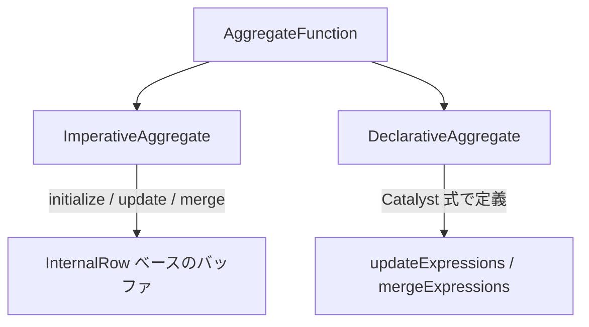

# 第19章 SQL 実行エンジン: オペレータと内部データ型

> 本章で読むソース
>
> - [`sql/catalyst/src/main/scala/org/apache/spark/sql/catalyst/InternalRow.scala` L31-L100](https://github.com/apache/spark/blob/v4.1.2/sql/catalyst/src/main/scala/org/apache/spark/sql/catalyst/InternalRow.scala#L31-L100)
> - [`sql/catalyst/src/main/scala/org/apache/spark/sql/catalyst/InternalRow.scala` L102-L194](https://github.com/apache/spark/blob/v4.1.2/sql/catalyst/src/main/scala/org/apache/spark/sql/catalyst/InternalRow.scala#L102-L194)
> - [`sql/catalyst/src/main/scala/org/apache/spark/sql/catalyst/expressions/Expression.scala` L91-L207](https://github.com/apache/spark/blob/v4.1.2/sql/catalyst/src/main/scala/org/apache/spark/sql/catalyst/expressions/Expression.scala#L91-L207)
> - [`sql/catalyst/src/main/scala/org/apache/spark/sql/catalyst/expressions/Expression.scala` L206-L281](https://github.com/apache/spark/blob/v4.1.2/sql/catalyst/src/main/scala/org/apache/spark/sql/catalyst/expressions/Expression.scala#L206-L281)
> - [`sql/catalyst/src/main/scala/org/apache/spark/sql/catalyst/expressions/arithmetic.scala` L46-L108](https://github.com/apache/spark/blob/v4.1.2/sql/catalyst/src/main/scala/org/apache/spark/sql/catalyst/expressions/arithmetic.scala#L46-L108)
> - [`sql/catalyst/src/main/scala/org/apache/spark/sql/catalyst/expressions/arithmetic.scala` L193-L348](https://github.com/apache/spark/blob/v4.1.2/sql/catalyst/src/main/scala/org/apache/spark/sql/catalyst/expressions/arithmetic.scala#L193-L348)
> - [`sql/catalyst/src/main/scala/org/apache/spark/sql/catalyst/expressions/predicates.scala` L44-L102](https://github.com/apache/spark/blob/v4.1.2/sql/catalyst/src/main/scala/org/apache/spark/sql/catalyst/expressions/predicates.scala#L44-L102)
> - [`sql/catalyst/src/main/scala/org/apache/spark/sql/catalyst/expressions/aggregate/interfaces.scala` L33-L73](https://github.com/apache/spark/blob/v4.1.2/sql/catalyst/src/main/scala/org/apache/spark/sql/catalyst/expressions/aggregate/interfaces.scala#L33-L73)
> - [`sql/catalyst/src/main/scala/org/apache/spark/sql/catalyst/expressions/aggregate/interfaces.scala` L207-L379](https://github.com/apache/spark/blob/v4.1.2/sql/catalyst/src/main/scala/org/apache/spark/sql/catalyst/expressions/aggregate/interfaces.scala#L207-L379)
> - [`sql/catalyst/src/main/scala/org/apache/spark/sql/catalyst/expressions/literals.scala` L62-L108](https://github.com/apache/spark/blob/v4.1.2/sql/catalyst/src/main/scala/org/apache/spark/sql/catalyst/expressions/literals.scala#L62-L108)
> - [`sql/catalyst/src/main/scala/org/apache/spark/sql/catalyst/expressions/namedExpressions.scala` L69-L125](https://github.com/apache/spark/blob/v4.1.2/sql/catalyst/src/main/scala/org/apache/spark/sql/catalyst/expressions/namedExpressions.scala#L69-L125)
> - [`sql/catalyst/src/main/scala/org/apache/spark/sql/catalyst/expressions/namedExpressions.scala` L149-L200](https://github.com/apache/spark/blob/v4.1.2/sql/catalyst/src/main/scala/org/apache/spark/sql/catalyst/expressions/namedExpressions.scala#L149-L200)
> - [`sql/core/src/main/scala/org/apache/spark/sql/execution/basicPhysicalOperators.scala` L42-L119](https://github.com/apache/spark/blob/v4.1.2/sql/core/src/main/scala/org/apache/spark/sql/execution/basicPhysicalOperators.scala#L42-L119)
> - [`sql/core/src/main/scala/org/apache/spark/sql/execution/basicPhysicalOperators.scala` L220-L301](https://github.com/apache/spark/blob/v4.1.2/sql/core/src/main/scala/org/apache/spark/sql/execution/basicPhysicalOperators.scala#L220-L301)

## この章の狙い

Spark SQL の実行エンジンは `Expression` と `SparkPlan` を組み合わせてクエリを処理する。
本章では行の内部表現である `InternalRow`、式の基底クラスである `Expression`、そして代表的な物理オペレータである `ProjectExec` と `FilterExec` を読む。
`Expression` が解釈実行とコード生成の二重の実行パスを持つ仕組み、集約関数の2つのインターフェース、物理オペレータが `CodegenSupport` を通じてコード生成に参加する方法を追う。

## 前提

`Catalyst` は論理プランを最適化し、物理プランに変換する（第15章、第16章、第17章）。
Tungsten の `UnsafeRow` とコード生成基盤は第18章で解説した。
本章ではそれらの上に構築される実行エンジンの構造を明らかにする。

## 19.1 InternalRow: 内部行の抽象

`InternalRow` は Spark SQL の内部で使う行の抽象クラスである。

[`sql/catalyst/src/main/scala/org/apache/spark/sql/catalyst/InternalRow.scala` L31-L69](https://github.com/apache/spark/blob/v4.1.2/sql/catalyst/src/main/scala/org/apache/spark/sql/catalyst/InternalRow.scala#L31-L69)

```scala
abstract class InternalRow extends SpecializedGetters with Serializable {

  def numFields: Int

  def getString(ordinal: Int): String = getUTF8String(ordinal).toString

  def setNullAt(i: Int): Unit

  def update(i: Int, value: Any): Unit

  def setBoolean(i: Int, value: Boolean): Unit = update(i, value)
  def setByte(i: Int, value: Byte): Unit = update(i, value)
  def setShort(i: Int, value: Short): Unit = update(i, value)
  def setInt(i: Int, value: Int): Unit = update(i, value)
  def setLong(i: Int, value: Long): Unit = update(i, value)
  def setFloat(i: Int, value: Float): Unit = update(i, value)
  def setDouble(i: Int, value: Double): Unit = update(i, value)

  def setDecimal(i: Int, value: Decimal, precision: Int): Unit = update(i, value)
  def setInterval(i: Int, value: CalendarInterval): Unit = update(i, value)

  def copy(): InternalRow
}
```

`SpecializedGetters` を継承し、`getBoolean`、`getInt`、`getLong` などの型特化したアクセスメソッドを提供する。
デフォルトの `set*` メソッドは `update` に委譲するが、`UnsafeRow` は `Platform` を使った高速な実装でオーバーライドする（第18章）。

### 19.1.1 InternalRow のファクトリとアクセサ

[`sql/catalyst/src/main/scala/org/apache/spark/sql/catalyst/InternalRow.scala` L102-L166](https://github.com/apache/spark/blob/v4.1.2/sql/catalyst/src/main/scala/org/apache/spark/sql/catalyst/InternalRow.scala#L102-L166)

```scala
object InternalRow {
  def apply(values: Any*): InternalRow = new GenericInternalRow(values.toArray)

  def fromSeq(values: Seq[Any]): InternalRow = new GenericInternalRow(values.toArray)

  val empty = apply()

  def getAccessor(dt: DataType, nullable: Boolean = true): (SpecializedGetters, Int) => Any = {
    val getValueNullSafe: (SpecializedGetters, Int) => Any = dt match {
      case u: UserDefinedType[_] => getAccessor(u.sqlType, nullable)
      case _ => PhysicalDataType(dt) match {
        case PhysicalBooleanType => (input, ordinal) => input.getBoolean(ordinal)
        case PhysicalIntegerType => (input, ordinal) => input.getInt(ordinal)
        case PhysicalLongType => (input, ordinal) => input.getLong(ordinal)
        // ...
        case _ => (input, ordinal) => input.get(ordinal, dt)
      }
    }

    if (nullable) {
      (getter, index) => {
        if (getter.isNullAt(index)) {
          null
        } else {
          getValueNullSafe(getter, index)
        }
      }
    } else {
      getValueNullSafe
    }
  }
}
```

`getAccessor` はデータ型に応じたアクセサ関数を返す。
`nullable` が `true` の場合は null チェックをラップし、`false` の場合は直接アクセサを返す。
この仕組みでジェネリックな行アクセスを型特化された高速パスに変換する。

## 19.2 Expression: 式の基底クラス

`Expression` は Catalyst の式ツリーの基底クラスである。

[`sql/catalyst/src/main/scala/org/apache/spark/sql/catalyst/expressions/Expression.scala` L91-L165](https://github.com/apache/spark/blob/v4.1.2/sql/catalyst/src/main/scala/org/apache/spark/sql/catalyst/expressions/Expression.scala#L91-L165)

```scala
abstract class Expression extends TreeNode[Expression] {

  def foldable: Boolean = false

  lazy val deterministic: Boolean = children.forall(_.deterministic)

  def nullable: Boolean

  def stateful: Boolean = false

  def nullIntolerant: Boolean = false

  lazy val throwable: Boolean = children.exists(_.throwable)
  // ...
}
```

`TreeNode` を継承し、式のツリー構造を操作する基盤を持つ。
主なプロパティは以下の通りである。

- `foldable`: 定数畳み込みの対象かどうか。
- `deterministic`: 同じ入力に対して常に同じ結果を返すか。
- `nullable`: null を返しうるか。
- `stateful`: 内部状態を持つか。
- `nullIntolerant`: 入力が null なら必ず null を返すか。

### 19.2.1 eval と genCode: 二重の実行パス

`Expression` は解釈実行とコード生成の2つの実行パスを持つ。

[`sql/catalyst/src/main/scala/org/apache/spark/sql/catalyst/expressions/Expression.scala` L206-L281](https://github.com/apache/spark/blob/v4.1.2/sql/catalyst/src/main/scala/org/apache/spark/sql/catalyst/expressions/Expression.scala#L206-L281)

```scala
def eval(input: InternalRow = null): Any

def genCode(ctx: CodegenContext): ExprCode = {
  ctx.subExprEliminationExprs.get(ExpressionEquals(this)).map { subExprState =>
    ExprCode(
      ctx.registerComment(this.toString),
      subExprState.eval.isNull,
      subExprState.eval.value)
  }.getOrElse {
    val isNull = ctx.freshName("isNull")
    val value = ctx.freshName("value")
    val eval = doGenCode(ctx, ExprCode(
      JavaCode.isNullVariable(isNull),
      JavaCode.variable(value, dataType)))
    reduceCodeSize(ctx, eval)
    // ...
  }
}

protected def doGenCode(ctx: CodegenContext, ev: ExprCode): ExprCode
```

- `eval`: 入力行を受け取り、式の値を直接計算する。
- `genCode`: `CodegenContext` を受け取り、Java ソースコードを生成する。
- `doGenCode`: 各サブクラスが実際のコード生成ロジックを実装する。

`genCode` はまず部分式除去のキャッシュを確認し、ヒットすれば既存の変数を再利用する。
miss すれば `doGenCode` を呼び、`reduceCodeSize` でコードが大きすぎる場合に別メソッドに分割する。

## 19.3 算術式とコード生成

`BinaryArithmetic` は二項算術演算の基底クラスである。

[`sql/catalyst/src/main/scala/org/apache/spark/sql/catalyst/expressions/arithmetic.scala` L193-L248](https://github.com/apache/spark/blob/v4.1.2/sql/catalyst/src/main/scala/org/apache/spark/sql/catalyst/expressions/arithmetic.scala#L193-L248)

```scala
abstract class BinaryArithmetic extends BinaryOperator with SupportQueryContext {
  override def nullIntolerant: Boolean = true

  val evalContext: NumericEvalContext

  def evalMode: EvalMode.Value = evalContext.evalMode

  private lazy val internalDataType: DataType = (left.dataType, right.dataType) match {
    case (DecimalType.Fixed(p1, s1), DecimalType.Fixed(p2, s2)) =>
      resultDecimalType(p1, s1, p2, s2)
    case _ => left.dataType
  }

  protected def failOnError: Boolean = evalMode match {
    case EvalMode.ANSI | EvalMode.TRY => true
    case _ => false
  }
  // ...
}
```

`doGenCode` はデータ型に応じて異なるコードを生成する。

[`sql/catalyst/src/main/scala/org/apache/spark/sql/catalyst/expressions/arithmetic.scala` L330-L348](https://github.com/apache/spark/blob/v4.1.2/sql/catalyst/src/main/scala/org/apache/spark/sql/catalyst/expressions/arithmetic.scala#L330-L348)

```scala
case IntegerType | LongType if failOnError && exactMathMethod.isDefined =>
  nullSafeCodeGen(ctx, ev, (eval1, eval2) => {
    val errorContext = getContextOrNullCode(ctx)
    val mathUtils = MathUtils.getClass.getCanonicalName.stripSuffix("$")
    s"""
       |${ev.value} = $mathUtils.${exactMathMethod.get}($eval1, $eval2, $errorContext);
     """.stripMargin
  })

case IntegerType | LongType | DoubleType | FloatType =>
  nullSafeCodeGen(ctx, ev, (eval1, eval2) => {
    s"""
       |${ev.value} = $eval1 $symbol $eval2;
     """.stripMargin
  })
```

ANSI モードでオーバーフローチェックが必要な場合は `MathUtils.addExact` などを呼び、通常モードでは Java の演算子を直接使う。
なぜ速いのか: 通常モードでは Java のプリミティブ演算子を直接使うコードを生成するため、インタプリタのディスパッチオーバーヘッドが消え、JIT が SIMD 命令に最適化できる。

### 19.3.1 UnaryMinus のコード生成

[`sql/catalyst/src/main/scala/org/apache/spark/sql/catalyst/expressions/arithmetic.scala` L46-L108](https://github.com/apache/spark/blob/v4.1.2/sql/catalyst/src/main/scala/org/apache/spark/sql/catalyst/expressions/arithmetic.scala#L46-L108)

```scala
case class UnaryMinus(
    child: Expression,
    failOnError: Boolean = SQLConf.get.ansiEnabled)
  extends UnaryExpression with ImplicitCastInputTypes {
  override def nullIntolerant: Boolean = true

  override def doGenCode(ctx: CodegenContext, ev: ExprCode): ExprCode = dataType match {
    case _: DecimalType => defineCodeGen(ctx, ev, c => s"$c.unary_$$minus()")
    case ByteType | ShortType | IntegerType | LongType if failOnError =>
      val mathUtils = MathUtils.getClass.getCanonicalName.stripSuffix("$")
      nullSafeCodeGen(ctx, ev, eval => {
        s"${ev.value} = $mathUtils.negateExact($eval);"
      })
    case dt: NumericType => nullSafeCodeGen(ctx, ev, eval => {
      val originValue = ctx.freshName("origin")
      s"""
        ${CodeGenerator.javaType(dt)} $originValue = (${CodeGenerator.javaType(dt)})($eval);
        ${ev.value} = (${CodeGenerator.javaType(dt)})(-($originValue));
      """})
    // ...
  }
}
```

## 19.4 述語式

`Predicate` トレイトはブール値を返す式を表す。

[`sql/catalyst/src/main/scala/org/apache/spark/sql/catalyst/expressions/predicates.scala` L44-L102](https://github.com/apache/spark/blob/v4.1.2/sql/catalyst/src/main/scala/org/apache/spark/sql/catalyst/expressions/predicates.scala#L44-L102)

```scala
abstract class BasePredicate extends ExpressionsEvaluator {
  def eval(r: InternalRow): Boolean
}

case class InterpretedPredicate(expression: Expression) extends BasePredicate {
  private[this] val subExprEliminationEnabled = SQLConf.get.subexpressionEliminationEnabled
  private[this] val expr = prepareExpressions(Seq(expression), subExprEliminationEnabled).head

  override def eval(r: InternalRow): Boolean = {
    if (subExprEliminationEnabled) {
      runtime.setInput(r)
    }
    expr.eval(r).asInstanceOf[Boolean]
  }
}

trait Predicate extends Expression {
  override def dataType: DataType = BooleanType
}

object Predicate extends CodeGeneratorWithInterpretedFallback[Expression, BasePredicate] {

  override protected def createCodeGeneratedObject(in: Expression): BasePredicate = {
    GeneratePredicate.generate(in, SQLConf.get.subexpressionEliminationEnabled)
  }

  override protected def createInterpretedObject(in: Expression): BasePredicate = {
    InterpretedPredicate(in)
  }

  def create(e: Expression, inputSchema: Seq[Attribute]): BasePredicate = {
    createObject(bindReference(e, inputSchema))
  }
}
```

`Predicate` オブジェクトは `CodeGeneratorWithInterpretedFallback` を使い、コード生成された述語を優先し、失敗すれば解釈実行にフォールバックする。

## 19.5 集約関数のインターフェース

`AggregateFunction` は集約関数の基底クラスである。

[`sql/catalyst/src/main/scala/org/apache/spark/sql/catalyst/expressions/aggregate/interfaces.scala` L33-L73](https://github.com/apache/spark/blob/v4.1.2/sql/catalyst/src/main/scala/org/apache/spark/sql/catalyst/expressions/aggregate/interfaces.scala#L33-L73)

```scala
sealed trait AggregateMode

case object Partial extends AggregateMode
case object PartialMerge extends AggregateMode
case object Final extends AggregateMode
case object Complete extends AggregateMode

case object NoOp extends LeafExpression with Unevaluable {
  override def nullable: Boolean = true
  override def dataType: DataType = NullType
}
```

`AggregateMode` は集約の実行モードを表す。

- `Partial`: 各パーティションで部分的な集約を行う。
- `PartialMerge`: 部分的な集約バッファをマージする。
- `Final`: マージ後に最終結果を生成する。
- `Complete`: 全入力から直接最終結果を計算する。

### 19.5.1 AggregateFunction と2つのインターフェース

[`sql/catalyst/src/main/scala/org/apache/spark/sql/catalyst/expressions/aggregate/interfaces.scala` L207-L265](https://github.com/apache/spark/blob/v4.1.2/sql/catalyst/src/main/scala/org/apache/spark/sql/catalyst/expressions/aggregate/interfaces.scala#L207-L265)

```scala
abstract class AggregateFunction extends Expression {

  final override def foldable: Boolean = false

  def aggBufferSchema: StructType

  def aggBufferAttributes: Seq[AttributeReference]

  def inputAggBufferAttributes: Seq[AttributeReference]

  def defaultResult: Option[Literal] = None

  def toAggregateExpression(): AggregateExpression = toAggregateExpression(isDistinct = false)

  def toAggregateExpression(
      isDistinct: Boolean,
      filter: Option[Expression] = None): AggregateExpression = {
    AggregateExpression(
      aggregateFunction = this,
      mode = Complete,
      isDistinct = isDistinct,
      filter = filter)
  }
}
```

集約関数には2つの実装インターフェースがある。



`ImperativeAggregate` は `initialize`、`update`、`merge` の3つのメソッドを `InternalRow` 上で操作する。

[`sql/catalyst/src/main/scala/org/apache/spark/sql/catalyst/expressions/aggregate/interfaces.scala` L285-L379](https://github.com/apache/spark/blob/v4.1.2/sql/catalyst/src/main/scala/org/apache/spark/sql/catalyst/expressions/aggregate/interfaces.scala#L285-L379)

```scala
abstract class ImperativeAggregate extends AggregateFunction with CodegenFallback {

  protected val mutableAggBufferOffset: Int
  protected val inputAggBufferOffset: Int

  def initialize(mutableAggBuffer: InternalRow): Unit

  def update(mutableAggBuffer: InternalRow, inputRow: InternalRow): Unit

  def merge(mutableAggBuffer: InternalRow, inputAggBuffer: InternalRow): Unit
}
```

`mutableAggBufferOffset` と `inputAggBufferOffset` は共有バッファ内での位置を指定する。
複数の集約関数が1つのバッファを共有するため、オフセットの算出が必要になる。

`DeclarativeAggregate` は Catalyst 式で `updateExpressions`、`mergeExpressions`、`evaluateExpressions` を定義する。
コード生成に対応し、より高速に実行される。

## 19.6 Literal と NamedExpression

`Literal` は定数値を表す式である。

[`sql/catalyst/src/main/scala/org/apache/spark/sql/catalyst/expressions/literals.scala` L62-L108](https://github.com/apache/spark/blob/v4.1.2/sql/catalyst/src/main/scala/org/apache/spark/sql/catalyst/expressions/literals.scala#L62-L108)

```scala
object Literal {
  val TrueLiteral: Literal = Literal(true, BooleanType)
  val FalseLiteral: Literal = Literal(false, BooleanType)

  def apply(v: Any): Literal = v match {
    case i: Int => Literal(i, IntegerType)
    case l: Long => Literal(l, LongType)
    case d: Double => Literal(d, DoubleType)
    case s: String => Literal(UTF8String.fromString(s), StringType)
    case b: Boolean => Literal(b, BooleanType)
    case d: Decimal => Literal(d, DecimalType(Math.max(d.precision, d.scale), d.scale))
    case null => Literal(null, NullType)
    // ...
  }
}
```

Scala の値から適切な `DataType` を推論して `Literal` を生成する。

`NamedExpression` は名前付きの式を表す。

[`sql/catalyst/src/main/scala/org/apache/spark/sql/catalyst/expressions/namedExpressions.scala` L69-L125](https://github.com/apache/spark/blob/v4.1.2/sql/catalyst/src/main/scala/org/apache/spark/sql/catalyst/expressions/namedExpressions.scala#L69-L125)

```scala
trait NamedExpression extends Expression {

  override def foldable: Boolean = false

  def name: String
  def exprId: ExprId

  def qualifiedName: String = (qualifier :+ name).map(quoteIfNeeded).mkString(".")

  def qualifier: Seq[String]

  def toAttribute: Attribute

  def metadata: Metadata = Metadata.empty

  def newInstance(): NamedExpression
}

abstract class Attribute extends LeafExpression with NamedExpression {
  override def nullIntolerant: Boolean = true

  @transient
  override lazy val references: AttributeSet = AttributeSet(this)

  def withNullability(newNullability: Boolean): Attribute
  def withQualifier(newQualifier: Seq[String]): Attribute
  def withName(newName: String): Attribute
  def withMetadata(newMetadata: Metadata): Attribute
  def withExprId(newExprId: ExprId): Attribute
  def withDataType(newType: DataType): Attribute

  override def toAttribute: Attribute = this
  def newInstance(): Attribute
}
```

`Attribute` はスキーマの列を表す。`ExprId` で一意に識別し、`withNullability` などで属性を変更したコピーを生成する。

`Alias` は式に名前を付ける。

[`sql/catalyst/src/main/scala/org/apache/spark/sql/catalyst/expressions/namedExpressions.scala` L149-L168](https://github.com/apache/spark/blob/v4.1.2/sql/catalyst/src/main/scala/org/apache/spark/sql/catalyst/expressions/namedExpressions.scala#L149-L168)

```scala
case class Alias(child: Expression, name: String)(
    val exprId: ExprId = NamedExpression.newExprId,
    val qualifier: Seq[String] = Seq.empty,
    val explicitMetadata: Option[Metadata] = None,
    val nonInheritableMetadataKeys: Seq[String] = Seq.empty)
  extends UnaryExpression with NamedExpression {

  override def eval(input: InternalRow): Any = child.eval(input)

  override def genCode(ctx: CodegenContext): ExprCode = child.genCode(ctx)
  // ...
}
```

`Alias` の `eval` と `genCode` は単に `child` に委譲する。
名前の付与はプランの解決と参照追跡のためだけに行われる。

## 19.7 物理オペレータ: ProjectExec と FilterExec

### 19.7.1 ProjectExec

`ProjectExec` は式のリストを評価し、新しい行を生成する。

[`sql/core/src/main/scala/org/apache/spark/sql/execution/basicPhysicalOperators.scala` L42-L119](https://github.com/apache/spark/blob/v4.1.2/sql/core/src/main/scala/org/apache/spark/sql/execution/basicPhysicalOperators.scala#L42-L119)

```scala
case class ProjectExec(projectList: Seq[NamedExpression], child: SparkPlan)
  extends UnaryExecNode
    with CodegenSupport
    with PartitioningPreservingUnaryExecNode
    with OrderPreservingUnaryExecNode {

  override def output: Seq[Attribute] = projectList.map(_.toAttribute)

  protected override def doProduce(ctx: CodegenContext): String = {
    child.asInstanceOf[CodegenSupport].produce(ctx, this)
  }

  override def usedInputs: AttributeSet = {
    val usedExprIds = projectList.flatMap(_.collect {
      case a: Attribute => a.exprId
    })
    val usedMoreThanOnce = usedExprIds.groupBy(id => id).filter(_._2.size > 1).keySet
    references.filter(a => usedMoreThanOnce.contains(a.exprId))
  }

  override def doConsume(ctx: CodegenContext, input: Seq[ExprCode], row: ExprCode): String = {
    val exprs = bindReferences[Expression](projectList, child.output)
    val (subExprsCode, resultVars, localValInputs) = if (conf.subexpressionEliminationEnabled) {
      val subExprs = ctx.subexpressionEliminationForWholeStageCodegen(exprs)
      val genVars = ctx.withSubExprEliminationExprs(subExprs.states) {
        exprs.map(_.genCode(ctx))
      }
      (ctx.evaluateSubExprEliminationState(subExprs.states.values), genVars,
        subExprs.exprCodesNeedEvaluate)
    } else {
      ("", exprs.map(_.genCode(ctx)), Seq.empty)
    }
    // ...
  }
}
```

`usedInputs` は2回以上参照される属性だけを事前に評価する。
1回しか参照されない属性は遅延評価され、不要な計算を省略する。

`doConsume` は部分式除去を適用し、共通部分式を1度だけ評価する。
なぜ速いのか: `usedInputs` で2回以上参照される列だけを事前に評価し、残りを遅延評価することで、フィルタで弾かれる行の不要な計算を省略する。

### 19.7.2 FilterExec

`FilterExec` は条件式を評価し、一致する行だけを通過させる。

[`sql/core/src/main/scala/org/apache/spark/sql/execution/basicPhysicalOperators.scala` L220-L301](https://github.com/apache/spark/blob/v4.1.2/sql/core/src/main/scala/org/apache/spark/sql/execution/basicPhysicalOperators.scala#L220-L301)

```scala
case class FilterExec(condition: Expression, child: SparkPlan)
  extends UnaryExecNode with CodegenSupport with GeneratePredicateHelper {

  private val (notNullPreds, otherPreds) = splitConjunctivePredicates(condition).partition {
    case IsNotNull(a) => isNullIntolerant(a) && a.references.subsetOf(child.outputSet)
    case _ => false
  }

  private val notNullAttributes = notNullPreds.flatMap(_.references).distinct.map(_.exprId)

  override def usedInputs: AttributeSet = AttributeSet.empty

  override def output: Seq[Attribute] = outputWithNullability(child.output, notNullAttributes)

  override def doConsume(ctx: CodegenContext, input: Seq[ExprCode], row: ExprCode): String = {
    val numOutput = metricTerm(ctx, "numOutputRows")

    val predicateCode = generatePredicateCode(
      ctx, child.output, input, output, notNullPreds, otherPreds, notNullAttributes)

    val resultVars = input.zipWithIndex.map { case (ev, i) =>
      if (notNullAttributes.contains(child.output(i).exprId)) {
        ev.isNull = FalseLiteral
      }
      ev
    }

    s"""
       |do {
       |  $predicateCode
       |  $numOutput.add(1);
       |  ${consume(ctx, resultVars)}
       |} while (false);
     """.stripMargin
  }
}
```

`FilterExec` の最適化ポイントは2つある。

1. `IsNotNull` 述語を分離し、先に評価する。null でないことがわかれば、後続の述語で null チェックを省略できる。
2. `usedInputs` を `AttributeSet.empty` にし、すべての属性評価を遅延する。これにより述語がショートサーキットで失敗した場合、属性の読み込み自体を省略できる。

`doConsume` は `do { } while (false)` で述語コードを囲み、`continue` で早期脱出できるようにする。
通過した行は `isNull` を `FalseLiteral` に書き換え、下流のオペレータが dead branch を削除できるようにする。

## まとめ

本章では Spark SQL の実行エンジンの構成要素を追った。

- `InternalRow` は内部行の抽象クラスであり、`SpecializedGetters` を通じて型特化したアクセスを提供する。
- `Expression` は `eval` による解釈実行と `genCode` によるコード生成の二重の実行パスを持つ。
- `BinaryArithmetic` はデータ型と ANSI モードに応じて異なる Java コードを生成する。
- `Predicate` はコード生成を優先し、失敗すれば解釈実行にフォールバックする。
- `AggregateFunction` は `ImperativeAggregate`（命令型）と `DeclarativeAggregate`（宣言型）の2つのインターフェースを持つ。
- `Literal` は定数値を、`Alias` は名前付き式を表す。
- `ProjectExec` は部分式除去と遅延評価で不要な計算を省略する。
- `FilterExec` は `IsNotNull` の分離とショートサーキット評価で高速化する。

## 関連する章

- 第15章: Catalyst 概要
- 第17章: 物理プラン
- 第18章: Tungsten（オフヒープメモリとコード生成基盤）
- 第20章: Adaptive Query Execution
