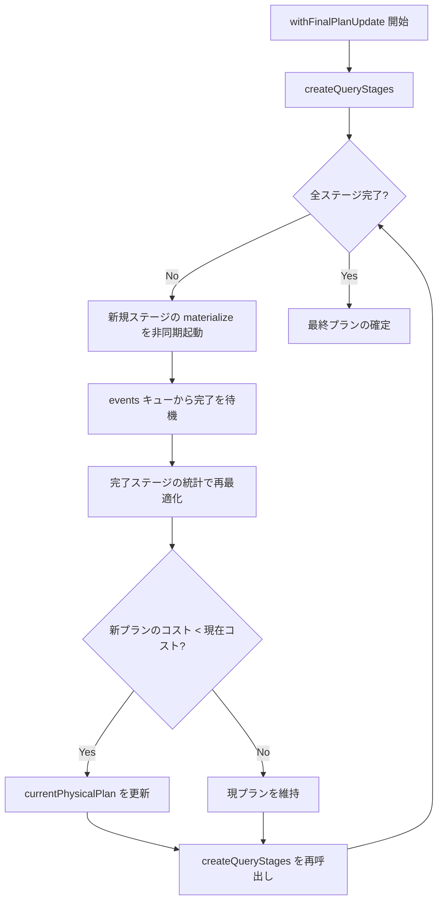
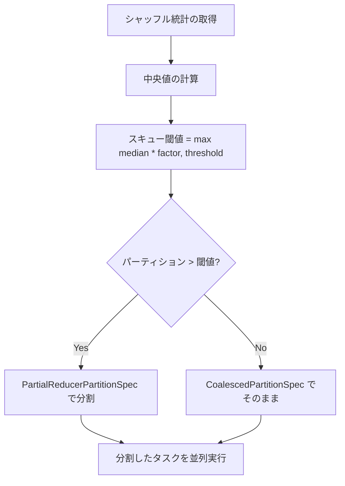

# 第20章 Adaptive Query Execution

> 本章で読むソース
>
> - [`sql/core/src/main/scala/org/apache/spark/sql/execution/adaptive/AdaptiveSparkPlanExec.scala` L53-L193](https://github.com/apache/spark/blob/v4.1.2/sql/core/src/main/scala/org/apache/spark/sql/execution/adaptive/AdaptiveSparkPlanExec.scala#L53-L193)
> - [`sql/core/src/main/scala/org/apache/spark/sql/execution/adaptive/AdaptiveSparkPlanExec.scala` L203-L384](https://github.com/apache/spark/blob/v4.1.2/sql/core/src/main/scala/org/apache/spark/sql/execution/adaptive/AdaptiveSparkPlanExec.scala#L203-L384)
> - [`sql/core/src/main/scala/org/apache/spark/sql/execution/adaptive/QueryStageExec.scala` L47-L160](https://github.com/apache/spark/blob/v4.1.2/sql/core/src/main/scala/org/apache/spark/sql/execution/adaptive/QueryStageExec.scala#L47-L160)
> - [`sql/core/src/main/scala/org/apache/spark/sql/execution/adaptive/QueryStageExec.scala` L169-L353](https://github.com/apache/spark/blob/v4.1.2/sql/core/src/main/scala/org/apache/spark/sql/execution/adaptive/QueryStageExec.scala#L169-L353)
> - [`sql/core/src/main/scala/org/apache/spark/sql/execution/adaptive/AQEShuffleReadExec.scala` L41-L152](https://github.com/apache/spark/blob/v4.1.2/sql/core/src/main/scala/org/apache/spark/sql/execution/adaptive/AQEShuffleReadExec.scala#L41-L152)
> - [`sql/core/src/main/scala/org/apache/spark/sql/execution/adaptive/AQEShuffleReadExec.scala` L261-L281](https://github.com/apache/spark/blob/v4.1.2/sql/core/src/main/scala/org/apache/spark/sql/execution/adaptive/AQEShuffleReadExec.scala#L261-L281)
> - [`sql/core/src/main/scala/org/apache/spark/sql/execution/adaptive/CoalesceShufflePartitions.scala` L34-L126](https://github.com/apache/spark/blob/v4.1.2/sql/core/src/main/scala/org/apache/spark/sql/execution/adaptive/CoalesceShufflePartitions.scala#L34-L126)
> - [`sql/core/src/main/scala/org/apache/spark/sql/execution/adaptive/OptimizeSkewedJoin.scala` L56-L198](https://github.com/apache/spark/blob/v4.1.2/sql/core/src/main/scala/org/apache/spark/sql/execution/adaptive/OptimizeSkewedJoin.scala#L56-L198)
> - [`sql/core/src/main/scala/org/apache/spark/sql/execution/adaptive/DynamicJoinSelection.scala` L38-L128](https://github.com/apache/spark/blob/v4.1.2/sql/core/src/main/scala/org/apache/spark/sql/execution/adaptive/DynamicJoinSelection.scala#L38-L128)
> - [`sql/core/src/main/scala/org/apache/spark/sql/execution/adaptive/ShufflePartitionsUtil.scala` L26-L77](https://github.com/apache/spark/blob/v4.1.2/sql/core/src/main/scala/org/apache/spark/sql/execution/adaptive/ShufflePartitionsUtil.scala#L26-L77)
> - [`sql/core/src/main/scala/org/apache/spark/sql/execution/adaptive/AQEOptimizer.scala` L31-L84](https://github.com/apache/spark/blob/v4.1.2/sql/core/src/main/scala/org/apache/spark/sql/execution/adaptive/AQEOptimizer.scala#L31-L84)

## この章の狙い

**Adaptive Query Execution**（**AQE**）はクエリ実行中に実際のデータ統計を取得し、プランを動的に再最適化するフレームワークである。
従来のオプティマイザは静的な見積もりに基づいてプランを決定するため、データ分布の推定が外れると性能が劣化する。
AQE はシャッフルステージの出力を実際に確認してから後続のプランを決定する。
本章では `AdaptiveSparkPlanExec` の実行ループ、`QueryStageExec` によるステージ管理、シャッフルパーティションの結合、スキュージョインの最適化、動的ジョイン選択を追う。

## 前提

物理プランは `SparkPlan` のツリーとして表現される（第17章）。
シャッフルはデータをパーティションに再配置する（第10章）。
`WholeStageCodegenExec` はパイプライン全体のコードを生成する（第18章）。

## 20.1 AdaptiveSparkPlanExec: 適応実行の本体

`AdaptiveSparkPlanExec` はクエリプランのルートに配置され、ステージ単位の非同期実行と再最適化を制御する。

[`sql/core/src/main/scala/org/apache/spark/sql/execution/adaptive/AdaptiveSparkPlanExec.scala` L53-L98](https://github.com/apache/spark/blob/v4.1.2/sql/core/src/main/scala/org/apache/spark/sql/execution/adaptive/AdaptiveSparkPlanExec.scala#L53-L98)

```scala
case class AdaptiveSparkPlanExec(
    inputPlan: SparkPlan,
    @transient context: AdaptiveExecutionContext,
    @transient preprocessingRules: Seq[Rule[SparkPlan]],
    @transient isSubquery: Boolean,
    @transient override val supportsColumnar: Boolean = false)
  extends LeafExecNode {

  @transient private val lock = new Object()

  @transient private val planChangeLogger = new PlanChangeLogger[SparkPlan]()

  @transient private val optimizer = new AQEOptimizer(conf,
    context.session.sessionState.adaptiveRulesHolder.runtimeOptimizerRules)

  @transient private val costEvaluator =
    conf.getConf(SQLConf.ADAPTIVE_CUSTOM_COST_EVALUATOR_CLASS) match {
      case Some(className) =>
        CostEvaluator.instantiate(className, context.session.sparkContext.getConf)
      case _ => SimpleCostEvaluator(conf.getConf(SQLConf.ADAPTIVE_FORCE_OPTIMIZE_SKEWED_JOIN))
    }
  // ...
}
```

`LeafExecNode` を継承するが、実際には `inputPlan` という子を持つ。
これは AQE がプランの再構築を繰り返すため、物理ツリーの構造が動的に変化することを表現するためである。

### 20.1.1 ルールパイプライン

AQE は3種類のルールを段階的に適用する。

[`sql/core/src/main/scala/org/apache/spark/sql/execution/adaptive/AdaptiveSparkPlanExec.scala` L107-L158](https://github.com/apache/spark/blob/v4.1.2/sql/core/src/main/scala/org/apache/spark/sql/execution/adaptive/AdaptiveSparkPlanExec.scala#L107-L158)

```scala
@transient private val queryStagePreparationRules: Seq[Rule[SparkPlan]] = {
  val ensureRequirements =
    EnsureRequirements(requiredDistribution.isDefined, requiredDistribution)
  Seq(
    CoalesceBucketsInJoin,
    RemoveRedundantProjects,
    ensureRequirements,
    InsertSortForLimitAndOffset,
    AdjustShuffleExchangePosition,
    ValidateSparkPlan,
    ReplaceHashWithSortAgg,
    RemoveRedundantSorts,
    RemoveRedundantWindowGroupLimits,
    DisableUnnecessaryBucketedScan,
    OptimizeSkewedJoin(ensureRequirements)
  ) ++ context.session.sessionState.adaptiveRulesHolder.queryStagePrepRules
}

@transient private val queryStageOptimizerRules: Seq[Rule[SparkPlan]] = Seq(
  PlanAdaptiveDynamicPruningFilters(this),
  ReuseAdaptiveSubquery(context.subqueryCache),
  OptimizeSkewInRebalancePartitions,
  CoalesceShufflePartitions(context.session),
  OptimizeShuffleWithLocalRead
) ++ context.session.sessionState.adaptiveRulesHolder.queryStageOptimizerRules

private def postStageCreationRules(outputsColumnar: Boolean) = Seq(
  ApplyColumnarRulesAndInsertTransitions(
    context.session.sessionState.columnarRules, outputsColumnar),
  collapseCodegenStagesRule
)
```

1. **queryStagePreparationRules**: ステージ作成の前に適用する。`EnsureRequirements` でシャッフルを配置し、`OptimizeSkewedJoin` でスキューを検出する。
2. **queryStageOptimizerRules**: 各ステージの実行前に適用する。`CoalesceShufflePartitions` でパーティションを結合し、`OptimizeShuffleWithLocalRead` でローカル読み込みを最適化する。
3. **postStageCreationRules**: ステージ作成直後に適用する。カラムnar への変換とコード生成ステージの結合を行う。

### 20.1.2 実行ループ

`withFinalPlanUpdate` は AQE のメインループである。

[`sql/core/src/main/scala/org/apache/spark/sql/execution/adaptive/AdaptiveSparkPlanExec.scala` L268-L384](https://github.com/apache/spark/blob/v4.1.2/sql/core/src/main/scala/org/apache/spark/sql/execution/adaptive/AdaptiveSparkPlanExec.scala#L268-L384)

```scala
def withFinalPlanUpdate[T](fun: SparkPlan => T): T = lock.synchronized {
  _isFinalPlan = false
  context.session.withActive {
    val executionId = getExecutionId
    var currentLogicalPlan = inputPlan.logicalLink.get
    var result = createQueryStages(fun, currentPhysicalPlan, firstRun = true)
    val events = new LinkedBlockingQueue[StageMaterializationEvent]()
    val errors = new mutable.ArrayBuffer[Throwable]()
    var stagesToReplace = Seq.empty[QueryStageExec]
    while (!result.allChildStagesMaterialized) {
      currentPhysicalPlan = result.newPlan
      if (result.newStages.nonEmpty) {
        stagesToReplace = result.newStages ++ stagesToReplace
        // ...
        val reorderedNewStages = result.newStages
          .sortWith {
            case (_: BroadcastQueryStageExec, _: BroadcastQueryStageExec) => false
            case (_: BroadcastQueryStageExec, _) => true
            case _ => false
          }

        reorderedNewStages.foreach { stage =>
          try {
            stage.materialize().onComplete { res =>
              if (res.isSuccess) {
                // ...
                events.offer(StageSuccess(stage, res.get))
              } else {
                events.offer(StageFailure(stage, res.failed.get))
              }
              stage.cleanupResources()
            }(AdaptiveSparkPlanExec.executionContext)
          } catch {
            case e: Throwable =>
              stage.error.set(Some(e))
              cleanUpAndThrowException(Seq(e), Some(stage.id))
          }
        }
      }

      val nextMsg = events.take()
      // ...

      if (!currentPhysicalPlan.isInstanceOf[ResultQueryStageExec]) {
        val logicalPlan = replaceWithQueryStagesInLogicalPlan(currentLogicalPlan, stagesToReplace)
        val afterReOptimize = reOptimize(logicalPlan)
        if (afterReOptimize.isDefined) {
          val (newPhysicalPlan, newLogicalPlan) = afterReOptimize.get
          val origCost = costEvaluator.evaluateCost(currentPhysicalPlan)
          val newCost = costEvaluator.evaluateCost(newPhysicalPlan)
          if (newCost < origCost ||
            (newCost == origCost && currentPhysicalPlan != newPhysicalPlan)) {
            currentPhysicalPlan = newPhysicalPlan
            currentLogicalPlan = newLogicalPlan
            stagesToReplace = Seq.empty[QueryStageExec]
          }
        }
      }
      result = createQueryStages(fun, currentPhysicalPlan, firstRun = false)
    }
  }
  _isFinalPlan = true
  finalPlanUpdate
  // ...
}
```



ループの核心は以下の流れである。

1. `createQueryStages` でプランを走査し、交換ノードでステージを分割する。
2. 新規ステージを非同期に `materialize` する。ブロードキャストステージを優先して起動する。
3. いずれかのステージが完了したら、`reOptimize` で論理プランを再最適化する。
4. 新プランのコストが現在プラン以下なら置き換える。
5. 全ステージが完了するまで繰り返す。

なぜ速いのか: コスト比較で新プランが有利な場合だけ置き換えるため、再最適化が性能を劣化させるリスクを排除する。
ブロードキャストステージを優先起動することで、ブロードキャストのタイムアウトを防ぐ。

## 20.2 QueryStageExec: ステージの管理

`QueryStageExec` は独立したクエリの部分グラフを表す。

[`sql/core/src/main/scala/org/apache/spark/sql/execution/adaptive/QueryStageExec.scala` L47-L99](https://github.com/apache/spark/blob/v4.1.2/sql/core/src/main/scala/org/apache/spark/sql/execution/adaptive/QueryStageExec.scala#L47-L99)

```scala
abstract class QueryStageExec extends LeafExecNode {

  val id: Int
  val plan: SparkPlan
  val name: String = s"${this.getClass.getSimpleName}-$id"

  final def materialize(): Future[Any] = {
    logDebug(s"Materialize query stage: $name")
    doMaterialize()
  }

  protected def doMaterialize(): Future[Any]

  def getRuntimeStatistics: Statistics

  def computeStats(): Option[Statistics] = if (isMaterialized) {
    val runtimeStats = getRuntimeStatistics
    val dataSize = runtimeStats.sizeInBytes.max(0)
    val numOutputRows = runtimeStats.rowCount.map(_.max(0))
    val attributeStats = runtimeStats.attributeStats
    Some(Statistics(dataSize, numOutputRows, attributeStats, isRuntime = true))
  } else {
    None
  }

  @transient
  @volatile
  protected var _resultOption = new AtomicReference[Option[Any]](None)

  final def isMaterialized: Boolean = resultOption.get().isDefined
  final def hasFailed: Boolean = _error.get().isDefined
}
```

`materialize` は `Future` を返し、呼び出し元は完了を非同期に待機できる。
`getRuntimeStatistics` はステージ完了後の実際のデータサイズと行数を返す。
この統計情報が再最適化の根拠になる。

### 20.2.1 ステージの種類

[`sql/core/src/main/scala/org/apache/spark/sql/execution/adaptive/QueryStageExec.scala` L169-L353](https://github.com/apache/spark/blob/v4.1.2/sql/core/src/main/scala/org/apache/spark/sql/execution/adaptive/QueryStageExec.scala#L169-L353)

```scala
abstract class ExchangeQueryStageExec extends QueryStageExec {
  final def cancel(reason: String): Unit = {
    logDebug(s"Cancel query stage: $name")
    doCancel(reason)
  }
  protected def doCancel(reason: String): Unit
  val _canonicalized: SparkPlan
  def newReuseInstance(newStageId: Int, newOutput: Seq[Attribute]): ExchangeQueryStageExec
}

case class ShuffleQueryStageExec(
    override val id: Int,
    override val plan: SparkPlan,
    override val _canonicalized: SparkPlan) extends ExchangeQueryStageExec {

  @transient val shuffle = plan match {
    case s: ShuffleExchangeLike => s
    case ReusedExchangeExec(_, s: ShuffleExchangeLike) => s
    case _ =>
      throw SparkException.internalError(s"wrong plan for shuffle stage:\n ${plan.treeString}")
  }

  override protected def doMaterialize(): Future[Any] = shuffle.submitShuffleJob()

  def mapStats: Option[MapOutputStatistics] = {
    assert(resultOption.get().isDefined, s"$name should already be ready")
    val stats = resultOption.get().get.asInstanceOf[MapOutputStatistics]
    Option(stats)
  }
}

case class BroadcastQueryStageExec(
    override val id: Int,
    override val plan: SparkPlan,
    override val _canonicalized: SparkPlan) extends ExchangeQueryStageExec {

  @transient val broadcast = plan match {
    case b: BroadcastExchangeLike => b
    case ReusedExchangeExec(_, b: BroadcastExchangeLike) => b
    case _ =>
      throw SparkException.internalError(s"wrong plan for broadcast stage:\n ${plan.treeString}")
  }

  override protected def doMaterialize(): Future[Any] = broadcast.submitBroadcastJob()
}

case class ResultQueryStageExec(
    override val id: Int,
    override val plan: SparkPlan,
    resultHandler: SparkPlan => Any) extends QueryStageExec {
  // ...
}
```

- `ShuffleQueryStageExec`: シャッフルのマップ出力をファイルに書き出す。`mapStats` でパーティションごとのバイト数を取得できる。
- `BroadcastQueryStageExec`: ドライバ上でデータを収集し、ブロードキャスト変数として配布する。
- `ResultQueryStageExec`: 最終結果を計算するステージ。

## 20.3 AQEShuffleReadExec: パーティション配置の制御

`AQEShuffleReadExec` はシャッフルステージのラッパーとして、パーティションの読み込み配置を制御する。

[`sql/core/src/main/scala/org/apache/spark/sql/execution/adaptive/AQEShuffleReadExec.scala` L41-L152](https://github.com/apache/spark/blob/v4.1.2/sql/core/src/main/scala/org/apache/spark/sql/execution/adaptive/AQEShuffleReadExec.scala#L41-L152)

```scala
case class AQEShuffleReadExec private(
    child: SparkPlan,
    partitionSpecs: Seq[ShufflePartitionSpec]) extends UnaryExecNode {
  assert(partitionSpecs.nonEmpty, s"${getClass.getSimpleName} requires at least one partition")

  override def output: Seq[Attribute] = child.output

  override lazy val outputPartitioning: Partitioning = {
    if (partitionSpecs.forall(_.isInstanceOf[PartialMapperPartitionSpec]) &&
        partitionSpecs.map(_.asInstanceOf[PartialMapperPartitionSpec].mapIndex).toSet.size ==
          partitionSpecs.length) {
      // ローカルシャッフル読み込みの場合
      child match {
        case ShuffleQueryStageExec(_, s: ShuffleExchangeLike, _) =>
          s.child.outputPartitioning
        // ...
      }
    } else if (isCoalescedRead) {
      // 結合されたパーティションの分布を保持
      // ...
    } else {
      UnknownPartitioning(partitionSpecs.length)
    }
  }

  def hasCoalescedPartition: Boolean = {
    partitionSpecs.exists(isCoalescedSpec)
  }

  def hasSkewedPartition: Boolean =
    partitionSpecs.exists(_.isInstanceOf[PartialReducerPartitionSpec])

  def isLocalRead: Boolean =
    partitionSpecs.exists(_.isInstanceOf[PartialMapperPartitionSpec]) ||
      partitionSpecs.exists(_.isInstanceOf[CoalescedMapperPartitionSpec])
}
```

`partitionSpecs` は各タスクがどのシャッフルパーティションを読むかを定義する。
`CoalescedPartitionSpec` は複数パーティションを1つに結合する。
`PartialReducerPartitionSpec` はスキューパーティションを分割する。
`PartialMapperPartitionSpec` はローカルシャッフル読み込みを表す。

実行時には `shuffleRDD` で `partitionSpecs` に基づく RDD を取得する。

[`sql/core/src/main/scala/org/apache/spark/sql/execution/adaptive/AQEShuffleReadExec.scala` L261-L281](https://github.com/apache/spark/blob/v4.1.2/sql/core/src/main/scala/org/apache/spark/sql/execution/adaptive/AQEShuffleReadExec.scala#L261-L281)

```scala
private lazy val shuffleRDD: RDD[_] = {
  shuffleStage match {
    case Some(stage) =>
      sendDriverMetrics()
      stage.shuffle.getShuffleRDD(partitionSpecs.toArray)
    case _ =>
      throw SparkException.internalError("operating on canonicalized plan")
  }
}

override protected def doExecute(): RDD[InternalRow] = {
  shuffleRDD.asInstanceOf[RDD[InternalRow]]
}
```

## 20.4 CoalesceShufflePartitions: パーティションの結合

`CoalesceShufflePartitions` はマップ出力統計に基づいてシャッフルパーティションを結合する。

[`sql/core/src/main/scala/org/apache/spark/sql/execution/adaptive/CoalesceShufflePartitions.scala` L34-L126](https://github.com/apache/spark/blob/v4.1.2/sql/core/src/main/scala/org/apache/spark/sql/execution/adaptive/CoalesceShufflePartitions.scala#L34-L126)

```scala
case class CoalesceShufflePartitions(session: SparkSession) extends AQEShuffleReadRule {

  override def apply(plan: SparkPlan): SparkPlan = {
    if (!conf.coalesceShufflePartitionsEnabled) {
      return plan
    }

    val minNumPartitions = conf.getConf(SQLConf.COALESCE_PARTITIONS_MIN_PARTITION_NUM).getOrElse {
      if (conf.getConf(SQLConf.COALESCE_PARTITIONS_PARALLELISM_FIRST)) {
        session.sparkContext.defaultParallelism
      } else {
        1
      }
    }

    val coalesceGroups = collectCoalesceGroups(plan)

    val minNumPartitionsByGroup = if (coalesceGroups.length == 1) {
      Seq(math.max(minNumPartitions, 1))
    } else {
      val sizes = coalesceGroups.map(
        _.shuffleStages.flatMap(_.shuffleStage.mapStats.map(_.bytesByPartitionId.sum)).sum)
      val totalSize = sizes.sum
      sizes.map { size =>
        val num = if (totalSize > 0) {
          math.round(minNumPartitions * 1.0 * size / totalSize)
        } else {
          minNumPartitions
        }
        math.max(num.toInt, 1)
      }
    }

    val specsMap = mutable.HashMap.empty[Int, Seq[ShufflePartitionSpec]]
    coalesceGroups.zip(minNumPartitionsByGroup).foreach { case (coalesceGroup, minNumPartitions) =>
      val advisoryTargetSize = advisoryPartitionSize(coalesceGroup)
      val minPartitionSize = conf.getConf(SQLConf.COALESCE_PARTITIONS_MIN_PARTITION_SIZE)

      val newPartitionSpecs = ShufflePartitionsUtil.coalescePartitions(
        coalesceGroup.shuffleStages.map(_.shuffleStage.mapStats),
        coalesceGroup.shuffleStages.map(_.partitionSpecs),
        advisoryTargetSize = advisoryTargetSize,
        minNumPartitions = minNumPartitions,
        minPartitionSize = minPartitionSize)
      // ...
    }
    // ...
  }
}
```

`ShufflePartitionsUtil.coalescePartitions` が実際の結合ロジックを持つ。

[`sql/core/src/main/scala/org/apache/spark/sql/execution/adaptive/ShufflePartitionsUtil.scala` L26-L77](https://github.com/apache/spark/blob/v4.1.2/sql/core/src/main/scala/org/apache/spark/sql/execution/adaptive/ShufflePartitionsUtil.scala#L26-L77)

```scala
object ShufflePartitionsUtil extends Logging {
  final val SMALL_PARTITION_FACTOR = 0.2
  final val MERGED_PARTITION_FACTOR = 1.2

  def coalescePartitions(
      mapOutputStatistics: Seq[Option[MapOutputStatistics]],
      inputPartitionSpecs: Seq[Option[Seq[ShufflePartitionSpec]]],
      advisoryTargetSize: Long,
      minNumPartitions: Int,
      minPartitionSize: Long): Seq[Seq[ShufflePartitionSpec]] = {
    // ...
    val totalPostShuffleInputSize = mapOutputStatistics.flatMap(_.map(_.bytesByPartitionId.sum)).sum
    val maxTargetSize = math.ceil(totalPostShuffleInputSize / minNumPartitions.toDouble).toLong
    val targetSize = maxTargetSize.min(advisoryTargetSize).max(minPartitionSize)

    if (inputPartitionSpecs.forall(_.isEmpty)) {
      coalescePartitionsWithoutSkew(
        mapOutputStatistics, targetSize, minPartitionSize)
    } else {
      coalescePartitionsWithSkew(
        mapOutputStatistics, inputPartitionSpecs, targetSize, minPartitionSize)
    }
  }
}
```

`targetSize` は `advisoryTargetSize`（デフォルト64MB）、`maxTargetSize`（総サイズ / 最小パーティション数）、`minPartitionSize`（デフォルト1MB）の3つの制約から計算する。
なぜ速いのか: 小さなパーティションを結合することでタスクの起動オーバーヘッドを削減し、各タスクが十分な量のデータを処理できるようにする。

## 20.5 OptimizeSkewedJoin: スキュージョインの最適化

`OptimizeSkewedJoin` はシャッフルパーティションのサイズが偏っている場合に、大きなパーティションを分割して並列度を上げる。

[`sql/core/src/main/scala/org/apache/spark/sql/execution/adaptive/OptimizeSkewedJoin.scala` L56-L97](https://github.com/apache/spark/blob/v4.1.2/sql/core/src/main/scala/org/apache/spark/sql/execution/adaptive/OptimizeSkewedJoin.scala#L56-L97)

```scala
case class OptimizeSkewedJoin(ensureRequirements: EnsureRequirements)
  extends Rule[SparkPlan] {

  def getSkewThreshold(medianSize: Long): Long = {
    conf.getConf(SQLConf.SKEW_JOIN_SKEWED_PARTITION_THRESHOLD).max(
      (medianSize * conf.getConf(SQLConf.SKEW_JOIN_SKEWED_PARTITION_FACTOR)).toLong)
  }

  private def targetSize(sizes: Array[Long], skewThreshold: Long): Long = {
    val advisorySize = conf.getConf(SQLConf.ADVISORY_PARTITION_SIZE_IN_BYTES)
    val nonSkewSizes = sizes.filter(_ <= skewThreshold)
    if (nonSkewSizes.isEmpty) {
      advisorySize
    } else {
      math.max(advisorySize, nonSkewSizes.sum / nonSkewSizes.length)
    }
  }
  // ...
}
```

スキューの判定は中央値と閾値の両方に基づく。
パーティションサイズが `median * SKEWED_PARTITION_FACTOR` かつ `SKEWED_PARTITION_THRESHOLD` の両方を超えるとスキューとみなす。



[`sql/core/src/main/scala/org/apache/spark/sql/execution/adaptive/OptimizeSkewedJoin.scala` L110-L198](https://github.com/apache/spark/blob/v4.1.2/sql/core/src/main/scala/org/apache/spark/sql/execution/adaptive/OptimizeSkewedJoin.scala#L110-L198)

```scala
private def tryOptimizeJoinChildren(
    left: ShuffleQueryStageExec,
    right: ShuffleQueryStageExec,
    joinType: JoinType): Option[(SparkPlan, SparkPlan)] = {
  val canSplitLeft = canSplitLeftSide(joinType)
  val canSplitRight = canSplitRightSide(joinType)
  if (!canSplitLeft && !canSplitRight) return None

  val leftSizes = left.mapStats.get.bytesByPartitionId
  val rightSizes = right.mapStats.get.bytesByPartitionId
  val numPartitions = leftSizes.length
  val leftMedSize = Utils.median(leftSizes, false)
  val rightMedSize = Utils.median(rightSizes, false)

  val leftSkewThreshold = getSkewThreshold(leftMedSize)
  val rightSkewThreshold = getSkewThreshold(rightMedSize)
  val leftTargetSize = targetSize(leftSizes, leftSkewThreshold)
  val rightTargetSize = targetSize(rightSizes, rightSkewThreshold)

  // ...
  for (partitionIndex <- 0 until numPartitions) {
    val leftSize = leftSizes(partitionIndex)
    val isLeftSkew = canSplitLeft && leftSize > leftSkewThreshold
    val rightSize = rightSizes(partitionIndex)
    val isRightSkew = canSplitRight && rightSize > rightSkewThreshold

    val leftParts = if (isLeftSkew) {
      val skewSpecs = ShufflePartitionsUtil.createSkewPartitionSpecs(
        left.mapStats.get.shuffleId, partitionIndex, leftTargetSize)
      skewSpecs.getOrElse(leftNoSkewPartitionSpec)
    } else {
      leftNoSkewPartitionSpec
    }
    // ...
  }
  // ...
}
```

スキューパーティションは `PartialReducerPartitionSpec` で分割され、反対側のパーティションは複製される。
例えば左パーティション2がスキューで2分割された場合、右パーティション2は2つのタスクでそれぞれ読み込まれる。

なぜ速いのか: ストラーグラータスク（極端に遅いタスク）を複数に分割することで、ジョイン全体の完了時間が最短のタスクに支配されなくなる。

## 20.6 DynamicJoinSelection: 動的ジョイン戦略の選択

`DynamicJoinSelection` は実行時の統計に基づいてジョイン戦略のヒントを動的に設定する。

[`sql/core/src/main/scala/org/apache/spark/sql/execution/adaptive/DynamicJoinSelection.scala` L38-L105](https://github.com/apache/spark/blob/v4.1.2/sql/core/src/main/scala/org/apache/spark/sql/execution/adaptive/DynamicJoinSelection.scala#L38-L105)

```scala
object DynamicJoinSelection extends Rule[LogicalPlan] with JoinSelectionHelper {

  private def hasManyEmptyPartitions(mapStats: MapOutputStatistics): Boolean = {
    val partitionCnt = mapStats.bytesByPartitionId.length
    val nonZeroCnt = mapStats.bytesByPartitionId.count(_ > 0)
    partitionCnt > 0 && nonZeroCnt > 0 &&
      (nonZeroCnt * 1.0 / partitionCnt) < conf.nonEmptyPartitionRatioForBroadcastJoin
  }

  private def preferShuffledHashJoin(mapStats: MapOutputStatistics): Boolean = {
    val maxShuffledHashJoinLocalMapThreshold =
      conf.getConf(SQLConf.ADAPTIVE_MAX_SHUFFLE_HASH_JOIN_LOCAL_MAP_THRESHOLD)
    val advisoryPartitionSize = conf.getConf(SQLConf.ADVISORY_PARTITION_SIZE_IN_BYTES)
    advisoryPartitionSize <= maxShuffledHashJoinLocalMapThreshold &&
      mapStats.bytesByPartitionId.forall(_ <= maxShuffledHashJoinLocalMapThreshold)
  }

  private def selectJoinStrategy(
      join: Join,
      isLeft: Boolean): Option[JoinStrategyHint] = {
    // ...
    val demoteBroadcastHash = if (manyEmptyInPlan && canBroadcastPlan) {
      join.joinType match {
        case LeftOuter | RightOuter | LeftAnti => false
        case _ => true
      }
    } // ...

    val preferShuffleHash = preferShuffledHashJoin(stage.mapStats.get)
    if (demoteBroadcastHash && preferShuffleHash) {
      Some(SHUFFLE_HASH)
    } else if (demoteBroadcastHash) {
      Some(NO_BROADCAST_HASH)
    } else if (preferShuffleHash) {
      Some(PREFER_SHUFFLE_HASH)
    } else {
      None
    }
  }
}
```

3つの判定を行う。

1. **空パーティションが多い**: 非空パーティションの割合が閾値を下回る場合、ブロードキャストジョインを避ける。空のパーティションが多いとシャッフルジョインの方がタスクの早期完了が見込める。
2. **シャッフルハッシュジョインを優先**: 全パーティションがローカルマップ閾値以下の場合、ソートマージジョインよりシャッフルハッシュジョインを推奨する。
3. **両方該当**: `SHUFFLE_HASH` ヒントを設定する。

なぜ速いのか: 静的なサイズ見積もりではブロードキャストと判断されたテーブルが実際には空のパーティションだらけだった場合、シャッフルジョインに切り替えることで無駄なブロードキャストを回避する。

## 20.7 AQEOptimizer: 論理プランの再最適化

`AQEOptimizer` はステージ完了後に論理プランを再最適化する。

[`sql/core/src/main/scala/org/apache/spark/sql/execution/adaptive/AQEOptimizer.scala` L31-L84](https://github.com/apache/spark/blob/v4.1.2/sql/core/src/main/scala/org/apache/spark/sql/execution/adaptive/AQEOptimizer.scala#L31-L84)

```scala
class AQEOptimizer(conf: SQLConf, extendedRuntimeOptimizerRules: Seq[Rule[LogicalPlan]])
  extends RuleExecutor[LogicalPlan] {

  private def fixedPoint =
    FixedPoint(
      conf.optimizerMaxIterations,
      maxIterationsSetting = SQLConf.OPTIMIZER_MAX_ITERATIONS.key)

  private val defaultBatches = Seq(
    Batch("Propagate Empty Relations", fixedPoint,
      AQEPropagateEmptyRelation,
      ConvertToLocalRelation,
      UpdateAttributeNullability),
    Batch("Dynamic Join Selection", Once, DynamicJoinSelection),
    Batch("Eliminate Limits", fixedPoint, EliminateLimits),
    Batch("Optimize One Row Plan", fixedPoint, OptimizeOneRowPlan)) :+
    Batch("User Provided Runtime Optimizers", fixedPoint, extendedRuntimeOptimizerRules: _*)

  final override protected def batches: Seq[Batch] = {
    val excludedRules = conf.getConf(SQLConf.ADAPTIVE_OPTIMIZER_EXCLUDED_RULES)
      .toSeq.flatMap(Utils.stringToSeq)
    defaultBatches.flatMap { batch =>
      val filteredRules = batch.rules.filter { rule =>
        !excludedRules.contains(rule.ruleName)
      }
      // ...
    }
  }
}
```

`AQEOptimizer` は `RuleExecutor` を継承し、バッチ単位でルールを適用する。
`DynamicJoinSelection` はここに含まれ、ステージ完了後に実行される。
`AQEPropagateEmptyRelation` は空のステージを検出すると、その上のジョインや集約を省略する。

## まとめ

本章では AQE フレームワークの全体像を追った。

- `AdaptiveSparkPlanExec` はステージ単位の非同期実行と再最適化のメインループを制御する。
- `QueryStageExec` はシャッフル、ブロードキャスト、結果の3種類のステージを表し、`materialize` で非同期に実行する。
- `AQEShuffleReadExec` は `partitionSpecs` でパーティションの結合、分割、ローカル読み込みを制御する。
- `CoalesceShufflePartitions` はマップ出力統計に基づいて小さなパーティションを結合する。
- `OptimizeSkewedJoin` はスキューパーティションを分割し、反対側を複製して並列度を上げる。
- `DynamicJoinSelection` は空パーティションの検出とデータサイズに基づいてジョイン戦略を動的に選択する。
- `AQEOptimizer` は論理プランの再最適化を行い、空関係の伝播や動的ジョイン選択を適用する。

## 関連する章

- 第10章: Shuffle（シャッフルの仕組み）
- 第17章: 物理プラン（物理オペレータの生成）
- 第18章: Tungsten（オフヒープメモリとコード生成基盤）
- 第19章: SQL 実行エンジン（オペレータと内部データ型）
