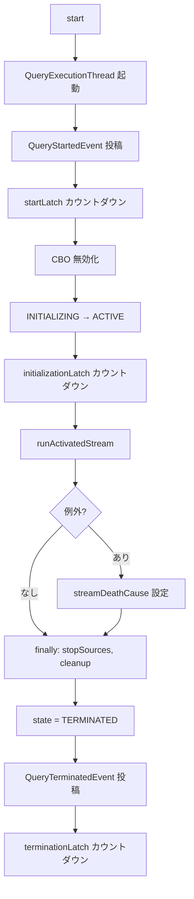

# 第21章 Structured Streaming: マイクロバッチ実行モデル

> 本章で読むソース
>
> - [`sql/core/src/main/scala/org/apache/spark/sql/execution/streaming/runtime/StreamExecution.scala` L57-L62](https://github.com/apache/spark/blob/v4.1.2/sql/core/src/main/scala/org/apache/spark/sql/execution/streaming/runtime/StreamExecution.scala#L57-L62)
> - [`sql/core/src/main/scala/org/apache/spark/sql/execution/streaming/runtime/StreamExecution.scala` L74-L84](https://github.com/apache/spark/blob/v4.1.2/sql/core/src/main/scala/org/apache/spark/sql/execution/streaming/runtime/StreamExecution.scala#L74-L84)
> - [`sql/core/src/main/scala/org/apache/spark/sql/execution/streaming/runtime/StreamExecution.scala` L219-L262](https://github.com/apache/spark/blob/v4.1.2/sql/core/src/main/scala/org/apache/spark/sql/execution/streaming/runtime/StreamExecution.scala#L219-L262)
> - [`sql/core/src/main/scala/org/apache/spark/sql/execution/streaming/runtime/StreamExecution.scala` L276-L452](https://github.com/apache/spark/blob/v4.1.2/sql/core/src/main/scala/org/apache/spark/sql/execution/streaming/runtime/StreamExecution.scala#L276-L452)
> - [`sql/core/src/main/scala/org/apache/spark/sql/execution/streaming/runtime/MicroBatchExecution.scala` L56-L64](https://github.com/apache/spark/blob/v4.1.2/sql/core/src/main/scala/org/apache/spark/sql/execution/streaming/runtime/MicroBatchExecution.scala#L56-L64)
> - [`sql/core/src/main/scala/org/apache/spark/sql/execution/streaming/runtime/MicroBatchExecution.scala` L452-L547](https://github.com/apache/spark/blob/v4.1.2/sql/core/src/main/scala/org/apache/spark/sql/execution/streaming/runtime/MicroBatchExecution.scala#L452-L547)
> - [`sql/core/src/main/scala/org/apache/spark/sql/execution/streaming/runtime/MicroBatchExecution.scala` L755-L847](https://github.com/apache/spark/blob/v4.1.2/sql/core/src/main/scala/org/apache/spark/sql/execution/streaming/runtime/MicroBatchExecution.scala#L755-L847)
> - [`sql/core/src/main/scala/org/apache/spark/sql/execution/streaming/runtime/MicroBatchExecution.scala` L864-L1097](https://github.com/apache/spark/blob/v4.1.2/sql/core/src/main/scala/org/apache/spark/sql/execution/streaming/runtime/MicroBatchExecution.scala#L864-L1097)
> - [`sql/core/src/main/scala/org/apache/spark/sql/execution/streaming/runtime/MicroBatchExecution.scala` L1104-L1315](https://github.com/apache/spark/blob/v4.1.2/sql/core/src/main/scala/org/apache/spark/sql/execution/streaming/runtime/MicroBatchExecution.scala#L1104-L1315)
> - [`sql/core/src/main/scala/org/apache/spark/sql/execution/streaming/runtime/IncrementalExecution.scala` L64-L104](https://github.com/apache/spark/blob/v4.1.2/sql/core/src/main/scala/org/apache/spark/sql/execution/streaming/runtime/IncrementalExecution.scala#L64-L104)
> - [`sql/core/src/main/scala/org/apache/spark/sql/classic/StreamingQueryManager.scala` L51-L55](https://github.com/apache/spark/blob/v4.1.2/sql/core/src/main/scala/org/apache/spark/sql/classic/StreamingQueryManager.scala#L51-L55)
> - [`sql/core/src/main/scala/org/apache/spark/sql/execution/streaming/runtime/ProgressReporter.scala` L55-L138](https://github.com/apache/spark/blob/v4.1.2/sql/core/src/main/scala/org/apache/spark/sql/execution/streaming/runtime/ProgressReporter.scala#L55-L138)
> - [`sql/core/src/main/scala/org/apache/spark/sql/execution/streaming/runtime/FileStreamSource.scala` L48-L59](https://github.com/apache/spark/blob/v4.1.2/sql/core/src/main/scala/org/apache/spark/sql/execution/streaming/runtime/FileStreamSource.scala#L48-L59)

## この章の狙い

**Structured Streaming** は、Spark の DataFrame API でストリーミング処理を記述するフレームワークである。
データ到着時に微小なバッチ（**マイクロバッチ**）を実行するモデルを採用し、各バッチをトランザクション的に処理する。
本章では、`StreamExecution` と `MicroBatchExecution` を中心に、マイクロバッチの起動から実行、コミットまでの一連の流れを追う。
`IncrementalExecution` がストリーミング固有の物理計画をどう構築するか、`FileStreamSource` を具体例としてソースがデータをどう供給するかを合わせて解説する。

## 前提

`SparkSession` は `StreamingQueryManager` を介してストリーミングクエリを管理する（第19章、第20章）。
ユーザーが `DataFrame.writeStream.start()` を呼ぶと、`StreamingQueryManager` が `MicroBatchExecution` を生成し、別スレッドで実行を開始する。
各バッチの実行では `IncrementalExecution`（`QueryExecution` の派生クラス）がストリーミング固有の物理計画を構築する。
チェックポイントディレクトリにオフセットログとコミットログを書き込み、フォールトトレランスを実現する。

## 21.1 StreamExecution: ストリーミング実行の基盤

`StreamExecution` はストリーミングクエリの実行を管理する抽象クラスである。
`StreamingQuery` インターフェースを実装し、ライフサイクル、オフセット管理、スレッド制御を提供する。

[`sql/core/src/main/scala/org/apache/spark/sql/execution/streaming/runtime/StreamExecution.scala` L57-L84](https://github.com/apache/spark/blob/v4.1.2/sql/core/src/main/scala/org/apache/spark/sql/execution/streaming/runtime/StreamExecution.scala#L57-L84)

```scala
trait State
case object INITIALIZING extends State
case object ACTIVE extends State
case object TERMINATED extends State
case object RECONFIGURING extends State

abstract class StreamExecution(
    override val sparkSession: SparkSession,
    override val name: String,
    val resolvedCheckpointRoot: String,
    val analyzedPlan: LogicalPlan,
    val sink: Table,
    val trigger: Trigger,
    val triggerClock: Clock,
    val outputMode: OutputMode,
    deleteCheckpointOnStop: Boolean)
  extends StreamingQuery with Logging {
  // ...
}
```

ライフサイクルは `INITIALIZING`、`ACTIVE`、`TERMINATED` の3状態を取る。
`state` は `AtomicReference[State]` で管理され、スレッド間で安全に状態遷移する。

### 21.1.1 スレッドモデルと起動

ストリーミングクエリは `QueryExecutionThread` という専用スレッドで実行される。
このスレッドは `UninterruptibleThread` を継承し、Kafka コンシューマが `Thread.interrupt()` でハングする問題（KAFKA-1894）を回避する。

[`sql/core/src/main/scala/org/apache/spark/sql/execution/streaming/runtime/StreamExecution.scala` L219-L262](https://github.com/apache/spark/blob/v4.1.2/sql/core/src/main/scala/org/apache/spark/sql/execution/streaming/runtime/StreamExecution.scala#L219-L262)

```scala
val queryExecutionThread: QueryExecutionThread =
  new QueryExecutionThread(s"stream execution thread for $prettyIdString") {
    override def run(): Unit = {
      sparkSession.sparkContext.setCallSite(callSite)
      runStream()
    }
  }

def start(): Unit = {
  logInfo(log"Starting ${MDC(PRETTY_ID_STRING, prettyIdString)}. " +
    log"Use ${MDC(CHECKPOINT_ROOT, resolvedCheckpointRoot)} to store the query checkpoint.")
  queryExecutionThread.setDaemon(true)
  queryExecutionThread.start()
  startLatch.await()
}
```

`start()` はスレッドを起動し、`startLatch` でスレッドの初期化完了を待機する。
`CountDownLatch` を使い、`QueryStartedEvent` の投稿後に制御を戻す。

### 21.1.2 runStream: 実行の全体像

`runStream()` はストリーミングクエリのメインループを管理する。

[`sql/core/src/main/scala/org/apache/spark/sql/execution/streaming/runtime/StreamExecution.scala` L276-L452](https://github.com/apache/spark/blob/v4.1.2/sql/core/src/main/scala/org/apache/spark/sql/execution/streaming/runtime/StreamExecution.scala#L276-L452)

```scala
private def runStream(): Unit = {
  var errorClassOpt: Option[String] = None
  try {
    sparkSession.sparkContext.setJobGroup(runId.toString, getBatchDescriptionString,
      interruptOnCancel = true)
    // ...
    val startTimestamp = triggerClock.getTimeMillis()
    postEvent(new QueryStartedEvent(id, runId, name,
      progressReporter.formatTimestamp(startTimestamp),
      sparkSession.sparkContext.getJobTags()))
    startLatch.countDown()

    sparkSessionForStream.withActive {
      sparkSessionForStream.conf.set(SQLConf.CBO_ENABLED.key, "false")
      // ...
      if (state.compareAndSet(INITIALIZING, ACTIVE)) {
        initializationLatch.countDown()
        runActivatedStream(sparkSessionForStream)
      }
    }
  } catch {
    case e if isInterruptedByStop(e, sparkSession.sparkContext) =>
      // ...
    case e: Throwable =>
      streamDeathCause = new StreamingQueryException(...)
  } finally queryExecutionThread.runUninterruptibly {
    // ...
    stopSources()
    cleanup()
    state.set(TERMINATED)
    postEvent(new QueryTerminatedEvent(id, runId, ...))
    terminationLatch.countDown()
  }
}
```

処理の流れは以下の通りである。

1. `QueryStartedEvent` を投稿し、`startLatch` を解放する。
2. CBO（Cost-Based Optimization）を無効化する。ステートフル演算の再配置を防ぐためである。
3. `runActivatedStream()` を呼び、サブクラスが実装するバッチループに制御を渡す。
4. 例外発生時は `streamDeathCause` に格納し、`finally` ブロックでソースの停止、クリーンアップ、`TERMINATED` 状態への遷移を行う。
5. `terminationLatch` を解放し、待機中のスレッドに終了を通知する。



## 21.2 MicroBatchExecution: マイクロバッチの構築と実行

`MicroBatchExecution` は `StreamExecution` の主要なサブクラスであり、マイクロバッチトリガーの実行を担当する。

[`sql/core/src/main/scala/org/apache/spark/sql/execution/streaming/runtime/MicroBatchExecution.scala` L56-L64](https://github.com/apache/spark/blob/v4.1.2/sql/core/src/main/scala/org/apache/spark/sql/execution/streaming/runtime/MicroBatchExecution.scala#L56-L64)

```scala
class MicroBatchExecution(
    sparkSession: SparkSession,
    trigger: Trigger,
    triggerClock: Clock,
    extraOptions: Map[String, String],
    plan: WriteToStream)
  extends StreamExecution(
    sparkSession, plan.name, plan.resolvedCheckpointLocation, plan.inputQuery, plan.sink, trigger,
    triggerClock, plan.outputMode, plan.deleteCheckpointOnStop) with AsyncLogPurge {
  // ...
}
```

### 21.2.1 runActivatedStream: バッチループ

`runActivatedStream()` はマイクロバッチの反復実行を開始する。

[`sql/core/src/main/scala/org/apache/spark/sql/execution/streaming/runtime/MicroBatchExecution.scala` L452-L462](https://github.com/apache/spark/blob/v4.1.2/sql/core/src/main/scala/org/apache/spark/sql/execution/streaming/runtime/MicroBatchExecution.scala#L452-L462)

```scala
protected def runActivatedStream(sparkSessionForStream: SparkSession): Unit = {
  val execCtx = initializeExecution(sparkSessionForStream)
  triggerExecutor.setNextBatch(execCtx)

  val noDataBatchesEnabled =
    sparkSessionForStream.sessionState.conf.streamingNoDataMicroBatchesEnabled

  triggerExecutor.execute(executeOneBatch(_, sparkSessionForStream, noDataBatchesEnabled))
}
```

まず `initializeExecution()` でオフセットログとコミットログから再開位置を特定する。
次に `TriggerExecutor` がバッチのタイミングを制御し、`executeOneBatch()` を繰り返し呼び出す。

`executeOneBatch()` の全体像を以下に示す。

[`sql/core/src/main/scala/org/apache/spark/sql/execution/streaming/runtime/MicroBatchExecution.scala` L464-L547](https://github.com/apache/spark/blob/v4.1.2/sql/core/src/main/scala/org/apache/spark/sql/execution/streaming/runtime/MicroBatchExecution.scala#L464-L547)

```scala
private def executeOneBatch(
    execCtx: MicroBatchExecutionContext,
    sparkSessionForStream: SparkSession,
    noDataBatchesEnabled: Boolean): Boolean = {
  // ...
  execCtx.startTrigger()
  execCtx.reportTimeTaken("triggerExecution") {
    sparkSession.sparkContext.setJobDescription(getBatchDescriptionString)
    if (!execCtx.isCurrentBatchConstructed) {
      execCtx.isCurrentBatchConstructed = constructNextBatch(execCtx, noDataBatchesEnabled)
    }
    execCtx.recordTriggerOffsets(from = execCtx.startOffsets, to = execCtx.endOffsets,
      latest = execCtx.latestOffsets)
    currentBatchHasNewData = isNewDataAvailable(execCtx)
    // ...
    if (execCtx.isCurrentBatchConstructed) {
      if (currentBatchHasNewData) execCtx.updateStatusMessage("Processing new data")
      else execCtx.updateStatusMessage("No new data but cleaning up state")
      runBatch(execCtx, sparkSessionForStream)
    } else {
      execCtx.updateStatusMessage("Waiting for data to arrive")
    }
  }
  // ...
  if (execCtx.isCurrentBatchConstructed) {
    triggerExecutor.setNextBatch(execCtx.getNextContext())
    execCtx.onExecutionComplete()
  } else if (triggerExecutor.isInstanceOf[MultiBatchExecutor]) {
    state.set(TERMINATED)
  } else Thread.sleep(pollingDelayMs)
  // ...
  isActive
}
```

1つの trigger サイクルは以下の3段階で構成される。

1. **`constructNextBatch`**: ソースから新しいオフセットを取得し、バッチを構築する。
2. **`runBatch`**: 論理計画を実データに置き換え、物理計画を生成し、実行する。
3. **後処理**: ウォーターマーク更新、オフセットコミット、次のバッチ準備。

### 21.2.2 constructNextBatch: バッチの構築

`constructNextBatch` は各ソースから最新オフセットを取得し、バッチの範囲を決定する。

[`sql/core/src/main/scala/org/apache/spark/sql/execution/streaming/runtime/MicroBatchExecution.scala` L755-L847](https://github.com/apache/spark/blob/v4.1.2/sql/core/src/main/scala/org/apache/spark/sql/execution/streaming/runtime/MicroBatchExecution.scala#L755-L847)

```scala
private def constructNextBatch(
    execCtx: MicroBatchExecutionContext,
    noDataBatchesEnabled: Boolean): Boolean = withProgressLocked {
  if (execCtx.isCurrentBatchConstructed) return true

  val (nextOffsets, recentOffsets) = uniqueSources.toSeq.map {
    case (s: SupportsAdmissionControl, limit) =>
      execCtx.updateStatusMessage(s"Getting offsets from $s")
      execCtx.reportTimeTaken("latestOffset") {
        val next = s.latestOffset(getStartOffset(execCtx, s), limit)
        val latest = s.reportLatestOffset()
        ((s, Option(next)), (s, Option(latest)))
      }
    // ... (他のソースタイプの処理)
  }.unzip

  execCtx.endOffsets ++= nextOffsets.filter { case (_, o) => o.nonEmpty }
    .map(p => p._1 -> p._2.get).toMap
  // ...
  val shouldConstructNextBatch = isNewDataAvailable(execCtx) || lastExecutionRequiresAnotherBatch

  if (shouldConstructNextBatch) {
    execCtx.updateStatusMessage("Writing offsets to log")
    execCtx.reportTimeTaken("walCommit") {
      markMicroBatchStart(execCtx)
      cleanUpLastExecutedMicroBatch(execCtx)
      // ...
    }
  }
  shouldConstructNextBatch
}
```

各ソースの `latestOffset()` を呼び、新しいデータがあるかを確認する。
新しいデータがあれば、オフセットログにバッチの範囲をアトミックに書き込む。
これがWAL（Write-Ahead Log）としての役割を果たし、クラッシュ後に同じバッチを再実行できる。

`markMicroBatchStart` はオフセットログへの書き込みを行う。

[`sql/core/src/main/scala/org/apache/spark/sql/execution/streaming/runtime/MicroBatchExecution.scala` L1104-L1122](https://github.com/apache/spark/blob/v4.1.2/sql/core/src/main/scala/org/apache/spark/sql/execution/streaming/runtime/MicroBatchExecution.scala#L1104-L1122)

```scala
protected def markMicroBatchStart(execCtx: MicroBatchExecutionContext): Unit = {
  if (!trigger.isInstanceOf[RealTimeTrigger]) {
    if (!offsetLog.add(
        execCtx.batchId,
        execCtx.endOffsets.toOffsetSeq(sources, execCtx.offsetSeqMetadata)
      )) {
      throw QueryExecutionErrors.concurrentStreamLogUpdate(execCtx.batchId)
    }
    logInfo(log"Committed offsets for batch ${MDC(LogKeys.BATCH_ID, execCtx.batchId)}. " +
      log"Metadata ${MDC(LogKeys.OFFSET_SEQUENCE_METADATA, execCtx.offsetSeqMetadata.toString)}")
  }
  // ...
}
```

`offsetLog.add()` はファイルシステムに対してアトミックな書き込みを保証する。
これにより、バッチ開始前にオフセットが永続化され、障害時に正確に再開できる。

### 21.2.3 runBatch: バッチの実行

`runBatch` は論理計画内のストリーミングソースを実際のデータに置き換え、物理計画を生成して実行する。

[`sql/core/src/main/scala/org/apache/spark/sql/execution/streaming/runtime/MicroBatchExecution.scala` L864-L1097](https://github.com/apache/spark/blob/v4.1.2/sql/core/src/main/scala/org/apache/spark/sql/execution/streaming/runtime/MicroBatchExecution.scala#L864-L1097)

```scala
private def runBatch(
    execCtx: MicroBatchExecutionContext,
    sparkSessionToRunBatch: SparkSession): Unit = {
  // ソースからバッチデータを取得
  val mutableNewData = mutable.Map.empty ++ execCtx.reportTimeTaken("getBatch") {
    execCtx.endOffsets.flatMap {
      case (source: Source, available: Offset)
        if execCtx.startOffsets.get(source).map(_ != available).getOrElse(true) =>
        val current = execCtx.startOffsets.get(source).map(_.asInstanceOf[Offset])
        val batch = source.getBatch(current, available)
        // ...
        Some(source -> batch.logicalPlan)
      // ... (V2 ソースの処理)
    }
  }

  // 論理計画のソースをデータで置換
  val newBatchesPlan = logicalPlan transform {
    case StreamingExecutionRelation(source, output, catalogTable) =>
      mutableNewData.get(source).map { dataPlan =>
        // ...
        Project(aliases, finalDataPlanWithStream)
      }.getOrElse {
        LocalRelation(output, isStreaming = true)
      }
    // ...
  }

  // IncrementalExecution で物理計画を生成
  execCtx.reportTimeTaken("queryPlanning") {
    execCtx.executionPlan = new IncrementalExecution(
      sparkSessionToRunBatch, triggerLogicalPlan, outputMode,
      checkpointFile("state"), id, runId, execCtx.batchId,
      offsetLog.offsetSeqMetadataForBatchId(execCtx.batchId - 1),
      execCtx.offsetSeqMetadata, watermarkPropagator,
      execCtx.previousContext.isEmpty,
      currentStateStoreCkptId, stateSchemaMetadatas,
      isTerminatingTrigger = trigger.isInstanceOf[AvailableNowTrigger.type])
    execCtx.executionPlan.executedPlan
  }

  // バッチ実行
  execCtx.reportTimeTaken("addBatch") {
    SQLExecution.withNewExecutionId(execCtx.executionPlan) {
      sink match {
        case s: Sink => s.addBatch(execCtx.batchId, nextBatch)
        case _: SupportsWrite => nextBatch.collect()
      }
    }
  }
}
```

`runBatch` の処理は4段階に分かれる。

1. **getBatch**: 各ソースに `getBatch(startOffset, endOffset)` を呼び、バッチデータを取得する。
2. **plan transform**: 論理計画内の `StreamingExecutionRelation` を実データの論理計画で置換する。
3. **queryPlanning**: `IncrementalExecution` を生成し、ストリーミング固有の物理計画を構築する。
4. **addBatch**: シンクにデータを書き込む。

### 21.2.4 markMicroBatchEnd: コミットと後処理

バッチ実行後、`markMicroBatchEnd` でウォーターマークの更新とコミットログへの書き込みを行う。

[`sql/core/src/main/scala/org/apache/spark/sql/execution/streaming/runtime/MicroBatchExecution.scala` L1220-L1315](https://github.com/apache/spark/blob/v4.1.2/sql/core/src/main/scala/org/apache/spark/sql/execution/streaming/runtime/MicroBatchExecution.scala#L1220-L1315)

```scala
protected def markMicroBatchEnd(execCtx: MicroBatchExecutionContext): Unit = {
  val latestExecPlan = execCtx.executionPlan.executedPlan
  watermarkTracker.updateWatermark(latestExecPlan)
  // ...
  execCtx.reportTimeTaken("commitOffsets") {
    val stateStoreCkptId = if (StatefulOperatorStateInfo.enableStateStoreCheckpointIds(
      sparkSessionForStream.sessionState.conf)) {
      Some(currentStateStoreCkptId.toMap)
    } else {
      None
    }
    if (!commitLog.add(execCtx.batchId,
      CommitMetadata(watermarkTracker.currentWatermark, stateStoreCkptId))) {
      throw QueryExecutionErrors.concurrentStreamLogUpdate(execCtx.batchId)
    }
  }
  committedOffsets ++= execCtx.endOffsets
  // ...
}
```

コミットログへの書き込みが成功して初めて、バッチが完了したとみなされる。
オフセットログに書き込まれてもコミットログになければ、再起動時に同じバッチが再実行される。
この2段階コミットプロトコルが exactly-once 処理の基盤である。

## 21.3 IncrementalExecution: ストリーミング固有の物理計画

`IncrementalExecution` は `QueryExecution` を拡張し、ストリーミング演算のための物理計画を構築する。

[`sql/core/src/main/scala/org/apache/spark/sql/execution/streaming/runtime/IncrementalExecution.scala` L64-L104](https://github.com/apache/spark/blob/v4.1.2/sql/core/src/main/scala/org/apache/spark/sql/execution/streaming/runtime/IncrementalExecution.scala#L64-L104)

```scala
class IncrementalExecution(
    sparkSession: SparkSession,
    logicalPlan: LogicalPlan,
    val outputMode: OutputMode,
    val checkpointLocation: String,
    val queryId: UUID,
    val runId: UUID,
    val currentBatchId: Long,
    val prevOffsetSeqMetadata: Option[OffsetSeqMetadata],
    val offsetSeqMetadata: OffsetSeqMetadata,
    val watermarkPropagator: WatermarkPropagator,
    val isFirstBatch: Boolean,
    val currentStateStoreCkptId:
      MutableMap[Long, Array[Array[String]]] = MutableMap[Long, Array[Array[String]]](),
    val stateSchemaMetadatas: MutableMap[Long, StateSchemaBroadcast] =
      MutableMap[Long, StateSchemaBroadcast](),
    mode: CommandExecutionMode.Value = CommandExecutionMode.ALL,
    val isTerminatingTrigger: Boolean = false)
  extends QueryExecution(sparkSession, logicalPlan, mode = mode,
    shuffleCleanupMode =
      QueryExecution.determineShuffleCleanupMode(sparkSession.sessionState.conf)) with Logging {

  override val planner: SparkPlanner = new SparkPlanner(
      sparkSession, sparkSession.sessionState.experimentalMethods) {
    override def strategies: Seq[Strategy] =
      extraPlanningStrategies ++
      sparkSession.sessionState.planner.strategies

    override def extraPlanningStrategies: Seq[Strategy] =
      StreamingJoinStrategy ::
      StatefulAggregationStrategy ::
      FlatMapGroupsWithStateStrategy ::
      // ...
      Nil
  }
}
```

`IncrementalExecution` の役割は3つある。

1. **ストリーミング固有の戦略**: `StatefulAggregationStrategy`、`StreamingJoinStrategy` 等を使い、ステートフル演算子を物理計画に配置する。
2. **タイムスタンプの置換**: `CurrentBatchTimestamp` をリテラル値に置換し、バッチごとのタイムスタンプを固定する。
3. **ステート情報の注入**: 各ステートフル演算子に `StatefulOperatorStateInfo` を渡し、チェックポイント位置、バージョン、パーティション数を設定する。

## 21.4 FileStreamSource: 具体例で見るソースの実装

`FileStreamSource` はファイルシステムから新規ファイルをストリーミングとして読み込むソースである。

[`sql/core/src/main/scala/org/apache/spark/sql/execution/streaming/runtime/FileStreamSource.scala` L48-L59](https://github.com/apache/spark/blob/v4.1.2/sql/core/src/main/scala/org/apache/spark/sql/execution/streaming/runtime/FileStreamSource.scala#L48-L59)

```scala
class FileStreamSource(
    sparkSession: SparkSession,
    path: String,
    fileFormatClassName: String,
    override val schema: StructType,
    partitionColumns: Seq[String],
    metadataPath: String,
    options: Map[String, String])
  extends SupportsAdmissionControl
  with SupportsTriggerAvailableNow
  with Source
  with Logging {
  // ...
}
```

`SupportsAdmissionControl` を実装し、`maxFilesPerTrigger`、`maxBytesPerTrigger` で各バッチで読み込むファイル数を制御する。
`SeenFilesMap` で処理済みのファイルを管理し、`fetchMaxOffset` で新規ファイルを検出する。

## 21.5 ProgressReporter: メトリクスと進捗報告

`ProgressReporter` はストリーミングクエリの進捗を収集し、`StreamingQueryProgress` を生成する。

[`sql/core/src/main/scala/org/apache/spark/sql/execution/streaming/runtime/ProgressReporter.scala` L55-L138](https://github.com/apache/spark/blob/v4.1.2/sql/core/src/main/scala/org/apache/spark/sql/execution/streaming/runtime/ProgressReporter.scala#L55-L138)

```scala
class ProgressReporter(
    private val sparkSession: SparkSession,
    private val triggerClock: Clock,
    val logicalPlan: () => LogicalPlan)
  extends Logging {

  private val progressBuffer = new mutable.Queue[StreamingQueryProgress]()

  def updateProgress(newProgress: StreamingQueryProgress): Unit = {
    lastNoExecutionProgressEventTime = triggerClock.getTimeMillis()
    addNewProgress(newProgress)
    postEvent(new QueryProgressEvent(newProgress))
    logInfo(log"Streaming query made progress: ${MDC(LogKeys.STREAMING_QUERY_PROGRESS, newProgress)}")
  }

  def updateIdleness(
      id: UUID, runId: UUID,
      currentTriggerStartTimestamp: Long,
      newProgress: StreamingQueryProgress): Unit = {
    val now = triggerClock.getTimeMillis()
    if (now - noDataProgressEventInterval >= lastNoExecutionProgressEventTime) {
      addNewProgress(newProgress)
      if (lastNoExecutionProgressEventTime > Long.MinValue) {
        postEvent(new QueryIdleEvent(id, runId, formatTimestamp(currentTriggerStartTimestamp)))
      }
      lastNoExecutionProgressEventTime = now
    }
  }
}
```

`ProgressReporter` は `progressBuffer` に進捗を保持し、`streamingProgressRetention` で指定された件数だけを保持する。
`QueryProgressEvent` を `StreamingQueryListenerBus` に投稿し、`StreamingQueryListener` が進捗を受信できる。
データがない状態が `noDataProgressEventInterval` 続くと `QueryIdleEvent` を投稿し、アイドル状態を通知する。

## 21.6 高速化の工夫: オフセットログの非同期パージ

マイクロバッチ実行のレイテンシに影響を与える要因の1つが、チェックポイントメタデータの削除である。
古いオフセットログやコミットログの削除は `minBatchesToRetain` 件数を超えた分に対して行われるが、この削除を同期的に行うとバッチ間の遅延が増加する。

`MicroBatchExecution` は `AsyncLogPurge` トレイトを mixin し、ログのパージを非同期で実行する。

```scala
class MicroBatchExecution(...)
  extends StreamExecution(...) with AsyncLogPurge {
```

`constructNextBatch` 内で以下の判定が行われる。

```scala
if (minLogEntriesToMaintain < execCtx.batchId) {
  if (useAsyncPurge) {
    purgeAsync(execCtx.batchId)
  } else {
    purge(execCtx.batchId - minLogEntriesToMaintain)
  }
}
```

なぜ速いのか: 非同期パージは別スレッドでファイル削除を実行するため、バッチの実行パスがファイルシステムのI/Oでブロックされない。
これにより、バッチ間のレイテンシを一定に保ちつつ、古いメタデータのクリーンアップを並行して実行できる。

## まとめ

本章では `Structured Streaming` のマイクロバッチ実行モデルを追った。

- `StreamExecution` はストリーミングクエリのライフサイクルを管理し、`QueryExecutionThread` でバッチループを実行する。
- `MicroBatchExecution` は `constructNextBatch`、`runBatch`、`markMicroBatchEnd` の3段階で1バッチを処理する。
- オフセットログとコミットログの2段階コミットにより、exactly-once 処理を実現する。
- `IncrementalExecution` はストリーミング固有の物理計画を構築し、ステートフル演算子を配置する。
- `ProgressReporter` はバッチの進捗とメトリクスを収集し、`StreamingQueryListener` に通知する。
- 非同期ログパージにより、バッチ間のレイテンシを抑える。

## 関連する章

- 第19章: Catalyst（論理計画と最適化）
- 第20章: Tungsten（物理実行とメモリ管理）
- 第22章: ステート管理とフォールトトレランス（`StateStore` の詳細）
