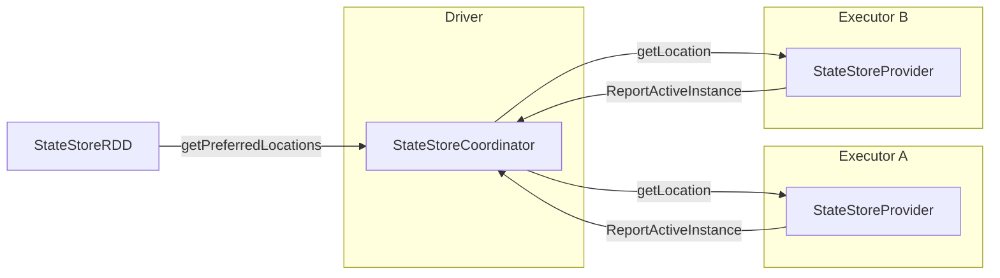

# 第22章 Structured Streaming: ステート管理とフォールトトレランス

> 本章で読むソース
>
> - [`sql/core/src/main/scala/org/apache/spark/sql/execution/streaming/state/StateStore.scala` L102-L170](https://github.com/apache/spark/blob/v4.1.2/sql/core/src/main/scala/org/apache/spark/sql/execution/streaming/state/StateStore.scala#L102-L170)
> - [`sql/core/src/main/scala/org/apache/spark/sql/execution/streaming/state/StateStore.scala` L182-L296](https://github.com/apache/spark/blob/v4.1.2/sql/core/src/main/scala/org/apache/spark/sql/execution/streaming/state/StateStore.scala#L182-L296)
> - [`sql/core/src/main/scala/org/apache/spark/sql/execution/streaming/state/StateStore.scala` L598-L700](https://github.com/apache/spark/blob/v4.1.2/sql/core/src/main/scala/org/apache/spark/sql/execution/streaming/state/StateStore.scala#L598-L700)
> - [`sql/core/src/main/scala/org/apache/spark/sql/execution/streaming/state/HDFSBackedStateStoreProvider.scala` L72-L107](https://github.com/apache/spark/blob/v4.1.2/sql/core/src/main/scala/org/apache/spark/sql/execution/streaming/state/HDFSBackedStateStoreProvider.scala#L72-L107)
> - [`sql/core/src/main/scala/org/apache/spark/sql/execution/streaming/state/HDFSBackedStateStoreProvider.scala` L110-L200](https://github.com/apache/spark/blob/v4.1.2/sql/core/src/main/scala/org/apache/spark/sql/execution/streaming/state/HDFSBackedStateStoreProvider.scala#L110-L200)
> - [`sql/core/src/main/scala/org/apache/spark/sql/execution/streaming/state/HDFSBackedStateStoreProvider.scala` L301-L402](https://github.com/apache/spark/blob/v4.1.2/sql/core/src/main/scala/org/apache/spark/sql/execution/streaming/state/HDFSBackedStateStoreProvider.scala#L301-L402)
> - [`sql/core/src/main/scala/org/apache/spark/sql/execution/streaming/state/RocksDBStateStoreProvider.scala` L41-L44](https://github.com/apache/spark/blob/v4.1.2/sql/core/src/main/scala/org/apache/spark/sql/execution/streaming/state/RocksDBStateStoreProvider.scala#L41-L44)
> - [`sql/core/src/main/scala/org/apache/spark/sql/execution/streaming/state/RocksDBStateStoreProvider.scala` L322-L453](https://github.com/apache/spark/blob/v4.1.2/sql/core/src/main/scala/org/apache/spark/sql/execution/streaming/state/RocksDBStateStoreProvider.scala#L322-L453)
> - [`sql/core/src/main/scala/org/apache/spark/sql/execution/streaming/state/StateStoreRDD.scala` L52-L181](https://github.com/apache/spark/blob/v4.1.2/sql/core/src/main/scala/org/apache/spark/sql/execution/streaming/state/StateStoreRDD.scala#L52-L181)
> - [`sql/core/src/main/scala/org/apache/spark/sql/execution/streaming/state/StateStoreConf.scala` L24-L157](https://github.com/apache/spark/blob/v4.1.2/sql/core/src/main/scala/org/apache/spark/sql/execution/streaming/state/StateStoreConf.scala#L24-L157)
> - [`sql/core/src/main/scala/org/apache/spark/sql/execution/streaming/state/StateStoreCoordinator.scala` L253-L452](https://github.com/apache/spark/blob/v4.1.2/sql/core/src/main/scala/org/apache/spark/sql/execution/streaming/state/StateStoreCoordinator.scala#L253-L452)
> - [`sql/core/src/main/scala/org/apache/spark/sql/execution/streaming/operators/stateful/statefulOperators.scala` L693-L756](https://github.com/apache/spark/blob/v4.1.2/sql/core/src/main/scala/org/apache/spark/sql/execution/streaming/operators/stateful/statefulOperators.scala#L693-L756)
> - [`sql/core/src/main/scala/org/apache/spark/sql/execution/streaming/operators/stateful/statefulOperators.scala` L761-L889](https://github.com/apache/spark/blob/v4.1.2/sql/core/src/main/scala/org/apache/spark/sql/execution/streaming/operators/stateful/statefulOperators.scala#L761-L889)

## この章の狙い

ストリーミング集約やストリーム結合では、過去のバッチから受け取ったキーと値のペアを保持する**ステート**が必要になる。
本章では `StateStore` を中心に、ステートの永続化、バージョン管理、フォールトトレランスの仕組みを追う。
`HDFSBackedStateStoreProvider` と `RocksDBStateStoreProvider` の2つの実装を比較し、`StateStoreCoordinator` がエグゼキュータ間のステート配置をどう協調させるかを解説する。

## 前提

マイクロバッチ実行モデルでは、各バッチが `IncrementalExecution` を通じて物理計画を構築する（第21章）。
ステートフル演算子（`StateStoreRestoreExec`、`StateStoreSaveExec`）は `StateStoreRDD` を介して `StateStore` にアクセスする。
`StateStoreProvider` の実装がステートの読み書きを担当し、チェックポイントディレクトリにデータを永続化する。

## 22.1 StateStore: バージョン付きキーバリューストア

`StateStore` はストリーミングのステートを管理するバージョン付きキーバリューストアである。
各バッチは新しいバージョンを生成し、障害時には任意のバージョンに巻き戻せる。

### 22.1.1 ReadStateStore と StateStore

[`sql/core/src/main/scala/org/apache/spark/sql/execution/streaming/state/StateStore.scala` L102-L170](https://github.com/apache/spark/blob/v4.1.2/sql/core/src/main/scala/org/apache/spark/sql/execution/streaming/state/StateStore.scala#L102-L170)

```scala
trait ReadStateStore {
  def id: StateStoreId
  def version: Long
  def get(key: UnsafeRow,
    colFamilyName: String = StateStore.DEFAULT_COL_FAMILY_NAME): UnsafeRow
  def valuesIterator(key: UnsafeRow,
    colFamilyName: String = StateStore.DEFAULT_COL_FAMILY_NAME): Iterator[UnsafeRow]
  def prefixScan(prefixKey: UnsafeRow,
    colFamilyName: String = StateStore.DEFAULT_COL_FAMILY_NAME): StateStoreIterator[UnsafeRowPair]
  def iterator(
    colFamilyName: String = StateStore.DEFAULT_COL_FAMILY_NAME): StateStoreIterator[UnsafeRowPair]
  def abort(): Unit
  def release(): Unit
}
```

`ReadStateStore` は読み取り専用のインターフェースである。
`get`、`iterator`、`prefixScan` でキーと値の取得ができる。
`release()` は読み取り完了後にリソースを解放する。

[`sql/core/src/main/scala/org/apache/spark/sql/execution/streaming/state/StateStore.scala` L182-L296](https://github.com/apache/spark/blob/v4.1.2/sql/core/src/main/scala/org/apache/spark/sql/execution/streaming/state/StateStore.scala#L182-L296)

```scala
trait StateStore extends ReadStateStore {
  def put(key: UnsafeRow, value: UnsafeRow,
    colFamilyName: String = StateStore.DEFAULT_COL_FAMILY_NAME): Unit
  def remove(key: UnsafeRow,
    colFamilyName: String = StateStore.DEFAULT_COL_FAMILY_NAME): Unit
  def merge(key: UnsafeRow, value: UnsafeRow,
    colFamilyName: String = StateStore.DEFAULT_COL_FAMILY_NAME): Unit
  def commit(): Long
  override def abort(): Unit
  def metrics: StateStoreMetrics
  def getStateStoreCheckpointInfo(): StateStoreCheckpointInfo
  def hasCommitted: Boolean
}
```

`StateStore` は `ReadStateStore` を拡張し、`put`、`remove`、`merge`、`commit` を追加する。
`commit()` は全更新を確定し、新しいバージョン番号を返す。
`hasCommitted` でコミット済みかどうかを判定できる。

### 22.1.2 StateStoreProvider

`StateStoreProvider` は `StateStore` インスタンスを生成するファクトリである。

[`sql/core/src/main/scala/org/apache/spark/sql/execution/streaming/state/StateStore.scala` L598-L700](https://github.com/apache/spark/blob/v4.1.2/sql/core/src/main/scala/org/apache/spark/sql/execution/streaming/state/StateStore.scala#L598-L700)

```scala
trait StateStoreProvider {
  def init(
      stateStoreId: StateStoreId,
      keySchema: StructType,
      valueSchema: StructType,
      keyStateEncoderSpec: KeyStateEncoderSpec,
      useColumnFamilies: Boolean,
      storeConfs: StateStoreConf,
      hadoopConf: Configuration,
      useMultipleValuesPerKey: Boolean = false,
      stateSchemaProvider: Option[StateSchemaProvider] = None): Unit

  def stateStoreId: StateStoreId
  def close(): Unit
  def getStore(version: Long,
    stateStoreCkptId: Option[String] = None): StateStore
  def getReadStore(version: Long,
    uniqueId: Option[String] = None): ReadStateStore =
    new WrappedReadStateStore(getStore(version, uniqueId))
  def upgradeReadStoreToWriteStore(
      readStore: ReadStateStore,
      version: Long,
      uniqueId: Option[String] = None): StateStore = getStore(version, uniqueId)
  def doMaintenance(): Unit = { }
  def supportedCustomMetrics: Seq[StateStoreCustomMetric] = Nil
  def supportedInstanceMetrics: Seq[StateStoreInstanceMetric] = Seq.empty
}
```

`getStore(version)` で指定バージョンの書き込み可能ストアを、`getReadStore(version)` で読み取り専用ストアを取得する。
`upgradeReadStoreToWriteStore` は読み取り専用ストアを書き込み用に昇格させる。
これは `StateStoreRDD` と `ReadStateStoreRDD` が同じタスク内で実行される場合の最適化である。

## 22.2 HDFSBackedStateStoreProvider: ファイルシステムバックエンド

`HDFSBackedStateStoreProvider` は HDFS 互換ファイルシステムにステートを保存する実装である。

[`sql/core/src/main/scala/org/apache/spark/sql/execution/streaming/state/HDFSBackedStateStoreProvider.scala` L72-L107](https://github.com/apache/spark/blob/v4.1.2/sql/core/src/main/scala/org/apache/spark/sql/execution/streaming/state/HDFSBackedStateStoreProvider.scala#L72-L107)

```scala
private[sql] class HDFSBackedStateStoreProvider extends StateStoreProvider with Logging
  with SupportsFineGrainedReplay {

  class HDFSBackedReadStateStore(val version: Long, map: HDFSBackedStateStoreMap)
    extends ReadStateStore {
    override def id: StateStoreId = HDFSBackedStateStoreProvider.this.stateStoreId
    override def get(key: UnsafeRow, colFamilyName: String): UnsafeRow = map.get(key)
    override def iterator(colFamilyName: String): StateStoreIterator[UnsafeRowPair] = {
      val iter = map.iterator()
      new StateStoreIterator(iter)
    }
    override def abort(): Unit = {}
    override def release(): Unit = {}
    // ...
  }
```

### 22.2.1 データモデル: デルタとスナップショット

`HDFSBackedStateStoreProvider` のデータは2種類のファイルで構成される。

- **デルタファイル**: 各バージョンの更新（`put`、`remove`）を記録する。
- **スナップショットファイル**: 複数デルタをマージした完全な状態のコピー。

[`sql/core/src/main/scala/org/apache/spark/sql/execution/streaming/state/HDFSBackedStateStoreProvider.scala` L110-L200](https://github.com/apache/spark/blob/v4.1.2/sql/core/src/main/scala/org/apache/spark/sql/execution/streaming/state/HDFSBackedStateStoreProvider.scala#L110-L200)

```scala
class HDFSBackedStateStore(val version: Long, mapToUpdate: HDFSBackedStateStoreMap)
  extends StateStore {

  trait STATE
  case object UPDATING extends STATE
  case object COMMITTED extends STATE
  case object ABORTED extends STATE
  case object RELEASED extends STATE

  private val newVersion = version + 1
  @volatile private var state: STATE = UPDATING
  private val finalDeltaFile: Path = deltaFile(newVersion)
  private lazy val deltaFileStream = fm.createAtomic(finalDeltaFile, overwriteIfPossible = true)
  private lazy val compressedStream = compressStream(deltaFileStream)

  override def put(key: UnsafeRow, value: UnsafeRow, colFamilyName: String): Unit = {
    assertUseOfDefaultColFamily(colFamilyName)
    require(value != null, "Cannot put a null value")
    verify(state == UPDATING, "Cannot put after already committed or aborted")
    val keyCopy = key.copy()
    val valueCopy = value.copy()
    mapToUpdate.put(keyCopy, valueCopy)
    writeUpdateToDeltaFile(compressedStream, keyCopy, valueCopy)
  }

  override def commit(): Long = {
    try {
      verify(state == UPDATING, "Cannot commit after already committed or aborted")
      commitUpdates(newVersion, mapToUpdate, compressedStream)
      state = COMMITTED
      // ...
      newVersion
    } catch {
      case e: Throwable =>
        throw QueryExecutionErrors.failedToCommitStateFileError(this.toString(), e)
    }
  }
}
```

`put` はメモリ上のマップを更新すると同時に、デルタファイルにも書き込む。
`commit` でデルタファイルを確定し、状態を `COMMITTED` に遷移させる。
`UnsafeRow` のコピーを取る理由は、入力行が再利用される可能性があるためである。

### 22.2.2 バージョンの読み込み

[`sql/core/src/main/scala/org/apache/spark/sql/execution/streaming/state/HDFSBackedStateStoreProvider.scala` L301-L402](https://github.com/apache/spark/blob/v4.1.2/sql/core/src/main/scala/org/apache/spark/sql/execution/streaming/state/HDFSBackedStateStoreProvider.scala#L301-L402)

```scala
override def getStore(version: Long, uniqueId: Option[String] = None): StateStore = {
  if (uniqueId.isDefined) {
    throw StateStoreErrors.stateStoreCheckpointIdsNotSupported(
      "HDFSBackedStateStoreProvider does not support checkpointFormatVersion > 1 ...")
  }
  val newMap = getLoadedMapForStore(version)
  // ...
  new HDFSBackedStateStore(version, newMap)
}

private def getLoadedMapForStore(version: Long): HDFSBackedStateStoreMap = synchronized {
  try {
    val newMap = HDFSBackedStateStoreMap.create(keySchema, numColsPrefixKey)
    if (version > 0) {
      newMap.putAll(loadMap(version))
    }
    newMap
  } catch {
    case e: OutOfMemoryError =>
      throw QueryExecutionErrors.notEnoughMemoryToLoadStore(...)
    case e: Throwable => throw StateStoreErrors.cannotLoadStore(e)
  }
}
```

`loadMap(version)` は最新のスナップショットファイルを読み込み、そこから目的のバージョンまでデルタファイルを適用する。
`minDeltasForSnapshot` 件数のデルタが蓄積すると、`doMaintenance()` でスナップショットを生成する。

### 22.2.3 メンテナンス: スナップショット生成とクリーンアップ

```scala
override def doMaintenance(): Unit = {
  try {
    doSnapshot("maintenance")
    cleanup()
  } catch {
    case NonFatal(e) =>
      logWarning(log"Error performing snapshot and cleaning up")
  }
}
```

`doSnapshot` はデルタチェーンが `minDeltasForSnapshot` を超えた場合にスナップショットを生成する。
`cleanup` は `minVersionsToRetain` 件数を超えた古いバージョンのファイルを削除する。

## 22.3 RocksDBStateStoreProvider: 組み込みDBバックエンド

`RocksDBStateStoreProvider` は RocksDB（LSMツリーの組み込みキーバリューストア）をバックエンドに使う。

[`sql/core/src/main/scala/org/apache/spark/sql/execution/streaming/state/RocksDBStateStoreProvider.scala` L41-L44](https://github.com/apache/spark/blob/v4.1.2/sql/core/src/main/scala/org/apache/spark/sql/execution/streaming/state/RocksDBStateStoreProvider.scala#L41-L44)

```scala
private[sql] class RocksDBStateStoreProvider
  extends StateStoreProvider with Logging with Closeable
  with SupportsFineGrainedReplay {
```

### 22.3.1 状態遷移モデル

`RocksDBStateStoreProvider` は厳密な状態遷移モデルを持つ。

```scala
private val allowedStateTransitions: Map[(STATE, OPERATION), STATE] = Map(
  (UPDATING, UPDATE) -> UPDATING,
  (UPDATING, ABORT) -> ABORTED,
  (UPDATING, RELEASE) -> RELEASED,
  (UPDATING, COMMIT) -> COMMITTED,
  (COMMITTED, METRICS) -> COMMITTED,
  (ABORTED, ABORT) -> ABORTED,
  (ABORTED, METRICS) -> ABORTED,
  (RELEASED, RELEASE) -> RELEASED,
  (RELEASED, METRICS) -> RELEASED
)
```

不正な状態遷移（例: コミット後の更新）は即座に例外を投げる。
これにより、ステートストアの操作順序の誤りを早期に検出できる。

### 22.3.2 put と commit

[`sql/core/src/main/scala/org/apache/spark/sql/execution/streaming/state/RocksDBStateStoreProvider.scala` L322-L453](https://github.com/apache/spark/blob/v4.1.2/sql/core/src/main/scala/org/apache/spark/sql/execution/streaming/state/RocksDBStateStoreProvider.scala#L322-L453)

```scala
override def put(key: UnsafeRow, value: UnsafeRow, colFamilyName: String): Unit = {
  validateAndTransitionState(UPDATE)
  verify(state == UPDATING, "Cannot put after already committed or aborted")
  verify(key != null, "Key cannot be null")
  require(value != null, "Cannot put a null value")
  verifyColFamilyOperations("put", colFamilyName)

  val kvEncoder = keyValueEncoderMap.get(colFamilyName)
  rocksDB.put(kvEncoder._1.encodeKey(key), kvEncoder._2.encodeValue(value), colFamilyName)
}

override def commit(): Long = synchronized {
  validateState(UPDATING)
  try {
    stateMachine.verifyStamp(stamp)
    val (newVersion, newCheckpointInfo) = rocksDB.commit()
    checkpointInfo = Some(newCheckpointInfo)
    storedMetrics = rocksDB.metricsOpt
    validateAndTransitionState(COMMIT)
    // ...
    newVersion
  } catch {
    case e: Throwable =>
      throw QueryExecutionErrors.failedToCommitStateFileError(this.toString(), e)
  }
}
```

RocksDB の `put` はキーと値をエンコードして直接 RocksDB に書き込む。
`commit` は RocksDB の内部バージョンを確定し、チェックポイント情報を取得する。
`stamp` の検証により、異なるタスクが同じストアインスタンスを誤って操作することを防ぐ。

### 22.3.3 カラムファミリー

`RocksDBStateStoreProvider` は RocksDB の**カラムファミリー**機能をサポートする。
カラムファミリーを使うと、1つの RocksDB インスタンス内で複数の論理的なキーバリューストアを独立して管理できる。
`TransformWithState` API はこの機能を活用し、状態変数のごとに異なるスキーマとライフサイクルを持つステートを保持する。

## 22.4 StateStoreRDD: ステートと計算の結合

`StateStoreRDD` は既存の RDD の各パーティションを `StateStore` と結びつけて処理する。

[`sql/core/src/main/scala/org/apache/spark/sql/execution/streaming/state/StateStoreRDD.scala` L52-L181](https://github.com/apache/spark/blob/v4.1.2/sql/core/src/main/scala/org/apache/spark/sql/execution/streaming/state/StateStoreRDD.scala#L52-L181)

```scala
abstract class BaseStateStoreRDD[T: ClassTag, U: ClassTag](
    dataRDD: RDD[T],
    checkpointLocation: String,
    queryRunId: UUID,
    operatorId: Long,
    sessionState: SessionState,
    @transient private val storeCoordinator: Option[StateStoreCoordinatorRef],
    extraOptions: Map[String, String] = Map.empty) extends RDD[U](dataRDD) {

  protected val storeConf = new StateStoreConf(sessionState.conf, extraOptions)
  protected val hadoopConfBroadcast =
    SerializableConfiguration.broadcast(dataRDD.context, sessionState.newHadoopConf())

  override def getPreferredLocations(partition: Partition): Seq[String] = {
    val stateStoreProviderId = getStateProviderId(partition)
    storeCoordinator.flatMap(_.getLocation(stateStoreProviderId)).toSeq
  }
}
```

`getPreferredLocations` は `StateStoreCoordinator` に問い合わせて、ステートストアが配置されているエグゼキュータを優先配置先として返す。
これにより、ステートストアの読み込み済みインスタンスを再利用でき、ディスクからの再読み込みを回避する。

```scala
class StateStoreRDD[T: ClassTag, U: ClassTag](...)
  extends BaseStateStoreRDD[T, U](...) {

  override def compute(partition: Partition, ctxt: TaskContext): Iterator[U] = {
    val storeProviderId = getStateProviderId(partition)
    val inputIter = dataRDD.iterator(partition, ctxt)
    val store = StateStoreThreadLocalTracker.getStore match {
      case Some(readStateStore: ReadStateStore) =>
        StateStore.getWriteStore(readStateStore, storeProviderId, ...)
      case None =>
        StateStore.get(storeProviderId, ...)
    }
    // ...
    storeUpdateFunction(store, inputIter)
  }
}
```

`StateStoreThreadLocalTracker` は同じタスク内で `ReadStateStoreRDD` が先に実行された場合、その読み取り専用ストアを書き込み用に昇格させる。
これにより、同じパーティションのストアを2回開くオーバーヘッドを回避する。

## 22.5 StateStoreCoordinator: クラスタ全体の配置管理

`StateStoreCoordinator` はドライバ上で動作する RPC エンドポイントであり、各エグゼキュータにロードされたステートストアの位置を管理する。

[`sql/core/src/main/scala/org/apache/spark/sql/execution/streaming/state/StateStoreCoordinator.scala` L253-L452](https://github.com/apache/spark/blob/v4.1.2/sql/core/src/main/scala/org/apache/spark/sql/execution/streaming/state/StateStoreCoordinator.scala#L253-L452)

```scala
private class StateStoreCoordinator(
    override val rpcEnv: RpcEnv,
    val sqlConf: SQLConf)
  extends ThreadSafeRpcEndpoint with Logging {
  private val instances = new mutable.HashMap[StateStoreProviderId, ExecutorCacheTaskLocation]

  override def receiveAndReply(context: RpcCallContext): PartialFunction[Any, Unit] = {
    case ReportActiveInstance(id, host, executorId, providerIdsToCheck) =>
      val taskLocation = ExecutorCacheTaskLocation(host, executorId)
      instances.put(id, taskLocation)
      val providerIdsToUnload = providerIdsToCheck.filter { providerId =>
        val providerLoc = instances.get(providerId)
        providerLoc.map(_ != taskLocation).getOrElse(false)
      }
      context.reply(providerIdsToUnload)

    case GetLocation(id) =>
      val executorId = instances.get(id).map(_.toString)
      context.reply(executorId)

    case DeactivateInstances(runId) =>
      val storeIdsToRemove = instances.keys.filter(_.queryRunId == runId).toSeq
      instances --= storeIdsToRemove
      context.reply(true)
    // ...
  }
}
```

`StateStoreCoordinator` の主な役割は3つである。

1. **配置情報の管理**: `ReportActiveInstance` でエグゼキュータから報告を受けたストアの位置を記録する。
2. **配置先の問い合わせ**: `GetLocation` で `StateStoreRDD` の `getPreferredLocations` に配置先を返す。
3. **重複ロードの検出**: `ReportActiveInstance` に含まれる `providerIdsToCheck` を確認し、異なるエグゼキュータにロードされている古いインスタンスを返却する。返却されたエグゼキュータは該当ストアをアンロードする。



## 22.6 ステートフル演算子との連携

### 22.6.1 StateStoreRestoreExec

`StateStoreRestoreExec` は入力行のキーを使って `StateStore` から以前の値を取得する。

[`sql/core/src/main/scala/org/apache/spark/sql/execution/streaming/operators/stateful/statefulOperators.scala` L693-L756](https://github.com/apache/spark/blob/v4.1.2/sql/core/src/main/scala/org/apache/spark/sql/execution/streaming/operators/stateful/statefulOperators.scala#L693-L756)

```scala
case class StateStoreRestoreExec(
    keyExpressions: Seq[Attribute],
    stateInfo: Option[StatefulOperatorStateInfo],
    stateFormatVersion: Int,
    child: SparkPlan)
  extends UnaryExecNode with StateStoreReader {

  override protected def doExecute(): RDD[InternalRow] = {
    val numOutputRows = longMetric("numOutputRows")

    child.execute().mapPartitionsWithReadStateStore(
      getStateInfo,
      keyExpressions.toStructType,
      stateManager.getStateValueSchema,
      NoPrefixKeyStateEncoderSpec(keyExpressions.toStructType),
      session.sessionState,
      Some(session.streams.stateStoreCoordinator)) { case (store, iter) =>
      // ...
      iter.flatMap { row =>
        val key = stateManager.getKey(row.asInstanceOf[UnsafeRow])
        val restoredRow = stateManager.get(store, key)
        val outputRows = Option(restoredRow).toSeq :+ row
        numOutputRows += outputRows.size
        outputRows
      }
    }
  }
}
```

各行についてキーを抽出し、`stateManager.get(store, key)` で以前のステート値を取得する。
取得した値と入力行の両方を出力し、後段の集約演算子がマージ処理を行えるようにする。

### 22.6.2 StateStoreSaveExec

`StateStoreSaveExec` は集約結果を `StateStore` に保存する。

[`sql/core/src/main/scala/org/apache/spark/sql/execution/streaming/operators/stateful/statefulOperators.scala` L761-L889](https://github.com/apache/spark/blob/v4.1.2/sql/core/src/main/scala/org/apache/spark/sql/execution/streaming/operators/stateful/statefulOperators.scala#L761-L889)

```scala
case class StateStoreSaveExec(
    keyExpressions: Seq[Attribute],
    stateInfo: Option[StatefulOperatorStateInfo] = None,
    outputMode: Option[OutputMode] = None,
    eventTimeWatermarkForLateEvents: Option[Long] = None,
    eventTimeWatermarkForEviction: Option[Long] = None,
    stateFormatVersion: Int,
    child: SparkPlan)
  extends UnaryExecNode with StateStoreWriter with WatermarkSupport {

  override protected def doExecute(): RDD[InternalRow] = {
    // ...
    child.execute().mapPartitionsWithStateStore(
      getStateInfo,
      keyExpressions.toStructType,
      stateManager.getStateValueSchema,
      NoPrefixKeyStateEncoderSpec(keyExpressions.toStructType),
      session.sessionState,
      Some(session.streams.stateStoreCoordinator)) { (store, iter) =>
      // ...
      outputMode match {
        case Some(Complete) =>
          allUpdatesTimeMs += timeTakenMs {
            while (iter.hasNext) {
              val row = iter.next().asInstanceOf[UnsafeRow]
              stateManager.put(store, row)
              numUpdatedStateRows += 1
            }
          }
          // ...
        case Some(Append) =>
          // ウォーターマークベースの期限切れエントリの削除
          // ...
        case Some(Update) =>
          // Update モードの処理
          // ...
      }
    }
  }
}
```

`Complete` モードでは全入力をストアに `put` し、全ストア内容を出力する。
`Append` モードではウォーターマークより古いエントリを削除し、削除された行だけを出力する。
`Update` モードでは更新された行のみを出力する。

## 22.7 StateStoreConf: 設定項目

`StateStoreConf` は `StateStore` の動作を制御する設定をまとめる。

[`sql/core/src/main/scala/org/apache/spark/sql/execution/streaming/state/StateStoreConf.scala` L24-L157](https://github.com/apache/spark/blob/v4.1.2/sql/core/src/main/scala/org/apache/spark/sql/execution/streaming/state/StateStoreConf.scala#L24-L157)

```scala
class StateStoreConf(
    @transient private val sqlConf: SQLConf,
    val extraOptions: Map[String, String] = Map.empty)
  extends Serializable {

  val minDeltasForSnapshot: Int = sqlConf.stateStoreMinDeltasForSnapshot
  val minVersionsToRetain: Int = sqlConf.minBatchesToRetain
  val maxVersionsToRetainInMemory: Int = sqlConf.maxBatchesToRetainInMemory
  val providerClass: String = sqlConf.stateStoreProviderClass
  val compressionCodec: String = sqlConf.stateStoreCompressionCodec
  val maintenanceInterval = sqlConf.streamingMaintenanceInterval
  val unloadOnCommit = sqlConf.stateStoreUnloadOnCommit
  val stateStoreCheckpointFormatVersion: Int = sqlConf.stateStoreCheckpointFormatVersion
  // ...
}
```

主要な設定項目を以下に示す。

- **`providerClass`**: 使用する `StateStoreProvider` のクラス名。デフォルトは `HDFSBackedStateStoreProvider`。
- **`minDeltasForSnapshot`**: スナップショットを生成する最小デルタ数。
- **`minVersionsToRetain`**: 保持する最小バージョン数。
- **`maxVersionsToRetainInMemory`**: メモリ内に保持する最大バージョン数。
- **`unloadOnCommit`**: コミット後にプロバイダーをアンロードするかどうか。

## 22.8 高速化の工夫: データ局所性によるステート読み込みの回避

`StateStoreRDD` の `getPreferredLocations` は `StateStoreCoordinator` に問い合わせて、ステートストアが既にロードされているエグゼキュータを返す。
なぜ速いのか: ステートストアのプロバイダーが既にメモリ内にバージョンを保持していれば、ディスクからの再読み込みが不要になる。
HDFS バックエンドではスナップショットファイルの読み込みが最もコストの高い操作であり、データ局所性を確保することでこのコストを回避する。

RocksDB バックエンドでは、RocksDB インスタンス自体がエグゼキュータのローカルディスクに存在するため、チェックポイントの DFS への書き出しと DFS からの読み込みを除けばネットワーク転送が発生しない。
`StateStoreCoordinator` の配置情報により、同じパーティションのタスクが同じエグゼキュータにスケジュールされ、RocksDB インスタンスをバッチ間で再利用できる。

## まとめ

本章では `StateStore` を中心にステート管理の仕組みを追った。

- `StateStore` はバージョン付きキーバリューストアであり、`put`、`get`、`commit` でステートを管理する。
- `HDFSBackedStateStoreProvider` はデルタファイルとスナップショットファイルでステートを永続化する。
- `RocksDBStateStoreProvider` は RocksDB を使い、高速なランダムアクセスとカラムファミリーをサポートする。
- `StateStoreRDD` は `StateStoreCoordinator` を介したデータ局所性により、ステート読み込みのコストを最小化する。
- `StateStoreCoordinator` はドライバ上で全エグゼキュータのステートストア配置を管理する。
- `StateStoreRestoreExec` と `StateStoreSaveExec` がステートフル演算子の読み書きを担当する。

## 関連する章

- 第21章: マイクロバッチ実行モデル（バッチの構築とコミットの流れ）
- 第10章: Shuffle（パーティション配置とデータ局所性）
