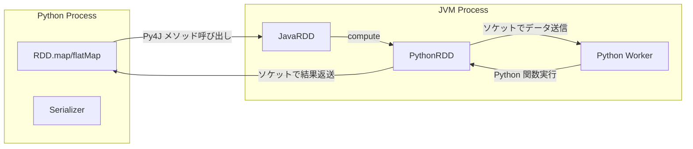

# 第23章 PySpark: Py4J ゲートウェイと Python API 設計

> 本章で読むソース
>
> - [`core/src/main/scala/org/apache/spark/api/python/PythonRDD.scala` L53-L77](https://github.com/apache/spark/blob/v4.1.2/core/src/main/scala/org/apache/spark/api/python/PythonRDD.scala#L53-L77)
> - [`core/src/main/scala/org/apache/spark/api/python/PythonRDD.scala` L83-L145](https://github.com/apache/spark/blob/v4.1.2/core/src/main/scala/org/apache/spark/api/python/PythonRDD.scala#L83-L145)
> - [`core/src/main/scala/org/apache/spark/api/python/PythonRDD.scala` L184-L206](https://github.com/apache/spark/blob/v4.1.2/core/src/main/scala/org/apache/spark/api/python/PythonRDD.scala#L184-L206)
> - [`python/pyspark/core/context.py` L97-L168](https://github.com/apache/spark/blob/v4.1.2/python/pyspark/core/context.py#L97-L168)
> - [`python/pyspark/core/context.py` L227-L354](https://github.com/apache/spark/blob/v4.1.2/python/pyspark/core/context.py#L227-L354)
> - [`python/pyspark/core/rdd.py` L198-L219](https://github.com/apache/spark/blob/v4.1.2/python/pyspark/core/rdd.py#L198-L219)
> - [`python/pyspark/serializers.py` L90-L200](https://github.com/apache/spark/blob/v4.1.2/python/pyspark/serializers.py#L90-L200)
> - [`sql/catalyst/src/main/scala/org/apache/spark/sql/catalyst/expressions/PythonUDF.scala` L78-L119](https://github.com/apache/spark/blob/v4.1.2/sql/catalyst/src/main/scala/org/apache/spark/sql/catalyst/expressions/PythonUDF.scala#L78-L119)
> - [`sql/core/src/main/scala/org/apache/spark/sql/execution/python/BatchEvalPythonExec.scala` L37-L65](https://github.com/apache/spark/blob/v4.1.2/sql/core/src/main/scala/org/apache/spark/sql/execution/python/BatchEvalPythonExec.scala#L37-L65)
> - [`sql/core/src/main/scala/org/apache/spark/sql/execution/python/BatchEvalPythonExec.scala` L123-L163](https://github.com/apache/spark/blob/v4.1.2/sql/core/src/main/scala/org/apache/spark/sql/execution/python/BatchEvalPythonExec.scala#L123-L163)

## この章の狙い

**PySpark** は Python から Spark を操作するための API である。
JVM 上で動作する Spark と Python プロセスの間を **Py4J** ゲートウェイが橋渡しする。
本章では `SparkContext` の Python ラッパーが Py4J 経由で JVM の `SparkContext` をどう呼び出すか、`PythonRDD` が Python 関数をどう実行するか、`Serializer` 階層がデータ転送をどう効率化するかを追う。
`PythonUDF` と `BatchEvalPythonExec` を通じて、SQL レベルでの Python 関数の実行機構も解説する。

## 前提

Spark の本体は Scala（JVM）で実装されている。
PySpark は Python プロセスと JVM プロセスを別々に起動し、Py4J 経由でメソッド呼び出しを転送する。
RDD の変換操作は Python 側でオブジェクトを生成し、内部の `JavaRDD`（`py4j.java_gateway.JavaObject`）への参照を保持する。
アクション操作では JVM 側で計算を実行し、結果をソケット経由で Python に送信する。

## 23.1 Py4J ゲートウェイの仕組み

**Py4J** は Python から Java オブジェクトを透過的に呼び出すためのライブラリである。
Python 側のメソッド呼び出しを TCP ソケット経由で JVM に送信し、戻り値を Python に返す。

### 23.1.1 SparkContext の初期化

`SparkContext` のコンストラクタは Py4J ゲートウェイを介して JVM の `JavaSparkContext` を生成する。

[`python/pyspark/core/context.py` L97-L225](https://github.com/apache/spark/blob/v4.1.2/python/pyspark/core/context.py#L97-L225)

```python
class SparkContext:

    """
    Main entry point for Spark functionality. A SparkContext represents the
    connection to a Spark cluster, and can be used to create :class:`RDD` and
    broadcast variables on that cluster.
    ...
    """

    _gateway: ClassVar[Optional[JavaGateway]] = None
    _jvm: ClassVar[Optional[JVMView]] = None
    _next_accum_id = 0
    _active_spark_context: ClassVar[Optional["SparkContext"]] = None
    _lock = RLock()
    # ... (中略) ...

    def __init__(
        self,
        master: Optional[str] = None,
        appName: Optional[str] = None,
        sparkHome: Optional[str] = None,
        pyFiles: Optional[List[str]] = None,
        environment: Optional[Dict[str, Any]] = None,
        batchSize: int = 0,
        serializer: "Serializer" = CPickleSerializer(),
        conf: Optional[SparkConf] = None,
        gateway: Optional[JavaGateway] = None,
        jsc: Optional[JavaObject] = None,
        profiler_cls: Type[BasicProfiler] = BasicProfiler,
        udf_profiler_cls: Type[UDFBasicProfiler] = UDFBasicProfiler,
        memory_profiler_cls: Type[MemoryProfiler] = MemoryProfiler,
    ):
        # ... (中略) ...
        SparkContext._ensure_initialized(self, gateway=gateway, conf=conf)
        try:
            self._do_init(
                master,
                appName,
                sparkHome,
                pyFiles,
                environment,
                batchSize,
                serializer,
                conf,
                jsc,
                profiler_cls,
                udf_profiler_cls,
                memory_profiler_cls,
            )
        except BaseException:
            # If an error occurs, clean up in order to allow future SparkContext creation:
            self.stop()
            raise
```

`_ensure_initialized` で Py4J ゲートウェイを起動（または既存のものを取得）し、`_do_init` で JVM 側の `JavaSparkContext` を生成する。

[`python/pyspark/core/context.py` L227-L354](https://github.com/apache/spark/blob/v4.1.2/python/pyspark/core/context.py#L227-L354)

```python
def _do_init(
    self,
    master: Optional[str],
    appName: Optional[str],
    sparkHome: Optional[str],
    pyFiles: Optional[List[str]],
    environment: Optional[Dict[str, Any]],
    batchSize: int,
    serializer: Serializer,
    conf: Optional[SparkConf],
    jsc: JavaObject,
    profiler_cls: Type[BasicProfiler] = BasicProfiler,
    udf_profiler_cls: Type[UDFBasicProfiler] = UDFBasicProfiler,
    memory_profiler_cls: Type[MemoryProfiler] = MemoryProfiler,
) -> None:
    # ... (中略) ...
    self._batchSize = batchSize  # -1 represents an unlimited batch size
    self._unbatched_serializer = serializer
    if batchSize == 0:
        self.serializer = AutoBatchedSerializer(self._unbatched_serializer)
    else:
        self.serializer = BatchedSerializer(self._unbatched_serializer, batchSize)

    # ... (中略) ...
    # Create the Java SparkContext through Py4J
    self._jsc = jsc or self._initialize_context(self._conf._jconf)
    # Reset the SparkConf to the one actually used by the SparkContext in JVM.
    self._conf = SparkConf(_jconf=self._jsc.sc().conf())

    # ... (中略) ...
    assert self._gateway is not None
    auth_token = self._gateway.gateway_parameters.auth_token
    # ... (中略) ...
    self._accumulatorServer = start_update_server(auth_token, is_unix_domain_sock, socket_path)
    assert self._jvm is not None
    if is_unix_domain_sock:
        self._javaAccumulator = self._jvm.PythonAccumulatorV2(
            self._accumulatorServer.server_address
        )
    else:
        (host, port) = self._accumulatorServer.server_address  # type: ignore[misc]
        self._javaAccumulator = self._jvm.PythonAccumulatorV2(host, port, auth_token)
    self._jsc.sc().register(self._javaAccumulator)
```

`_initialize_context` は Py4J 経由で `org.apache.spark.api.java.JavaSparkContext` のコンストラクタを呼び出す。
アキュムレータの更新は Python 側の TCP サーバーで受け取り、JVM 側の `PythonAccumulatorV2` がそのサーバーに接続して値を取得する。

### 23.1.2 データの流れ

PySpark におけるデータの流れは以下の通りである。



Python 側の変換操作（`map`、`filter` 等）は Python 関数を pickle でシリアライズし、JVM 側に `PythonFunction` として送る。
JVM 側の `PythonRDD` は各パーティションの計算時に Python ワーカープロセスを起動し、ソケット経由でデータを送受信する。

## 23.2 PythonRDD: Python 関数の実行

`PythonRDD` は親 RDD の各パーティションを Python ワーカーに送信し、Python 関数を実行させる。

[`core/src/main/scala/org/apache/spark/api/python/PythonRDD.scala` L53-L77](https://github.com/apache/spark/blob/v4.1.2/core/src/main/scala/org/apache/spark/api/python/PythonRDD.scala#L53-L77)

```scala
private[spark] class PythonRDD(
    parent: RDD[_],
    func: PythonFunction,
    preservePartitioning: Boolean,
    isFromBarrier: Boolean = false)
  extends RDD[Array[Byte]](parent) {

  override def getPartitions: Array[Partition] = firstParent.partitions

  override val partitioner: Option[Partitioner] = {
    if (preservePartitioning) firstParent.partitioner else None
  }

  override def compute(split: Partition, context: TaskContext): Iterator[Array[Byte]] = {
    val runner = PythonRunner(func, jobArtifactUUID)
    runner.compute(firstParent.iterator(split, context), split.index, context)
  }
}
```

`compute` は `PythonRunner` を生成し、親 RDD のイテレータから受け取ったデータを Python ワーカーにパイプする。
入出力はともに `Array[Byte]` であり、シリアライズされた Python オブジェクトのバイト列である。

### 23.2.1 PythonFunction: 関数のラッパー

[`core/src/main/scala/org/apache/spark/api/python/PythonRDD.scala` L83-L145](https://github.com/apache/spark/blob/v4.1.2/core/src/main/scala/org/apache/spark/api/python/PythonRDD.scala#L83-L145)

```scala
private[spark] trait PythonFunction {
  def command: Seq[Byte]
  def envVars: JMap[String, String]
  def pythonIncludes: JList[String]
  def pythonExec: String
  def pythonVer: String
  def broadcastVars: JList[Broadcast[PythonBroadcast]]
  def accumulator: PythonAccumulator
}

private[spark] case class SimplePythonFunction(
    command: Seq[Byte],
    envVars: JMap[String, String],
    pythonIncludes: JList[String],
    pythonExec: String,
    pythonVer: String,
    broadcastVars: JList[Broadcast[PythonBroadcast]],
    accumulator: PythonAccumulator) extends PythonFunction {
  // ...
}

private[spark] case class ChainedPythonFunctions(funcs: Seq[PythonFunction])
```

`PythonFunction` は Python 関数の実行に必要な全てのコンテキストを保持する。
`command` は pickle でシリアライズされた Python 関数本体のバイト列である。
`ChainedPythonFunctions` は複数段の Python 関数をチェーンし、ワーカーとの往復を1回にまとめる。

### 23.2.2 serveIterator: JVM から Python へのデータ転送

アクション操作（`collect` 等）では、JVM 側で計算した結果をソケット経由で Python に送信する。

[`core/src/main/scala/org/apache/spark/api/python/PythonRDD.scala` L184-L206](https://github.com/apache/spark/blob/v4.1.2/core/src/main/scala/org/apache/spark/api/python/PythonRDD.scala#L184-L206)

```scala
def runJob(
    sc: SparkContext,
    rdd: JavaRDD[Array[Byte]],
    partitions: JArrayList[Int]): Array[Any] = {
  type ByteArray = Array[Byte]
  type UnrolledPartition = Array[ByteArray]
  val allPartitions: Array[UnrolledPartition] =
    sc.runJob(rdd, (x: Iterator[ByteArray]) => x.toArray, partitions.asScala.toSeq)
  val flattenedPartition: UnrolledPartition = Array.concat(allPartitions.toImmutableArraySeq: _*)
  serveIterator(flattenedPartition.iterator,
    s"serve RDD ${rdd.id} with partitions ${partitions.asScala.mkString(",")}")
}

def collectAndServe[T](rdd: RDD[T]): Array[Any] = {
  serveIterator(rdd.collect().iterator, s"serve RDD ${rdd.id}")
}
```

`serveIterator` はローカルソケットサーバーを起動し、イテレータの要素を順次送信する。
Python 側はソケットに接続してデータを受信し、デシリアライズして返す。
これにより、全データを一度にメモリに確保せずにストリーミングで転送できる。

## 23.3 Serializer 階層

PySpark の `Serializer` は JVM と Python 間のデータ転送を担う。

[`python/pyspark/serializers.py` L90-L200](https://github.com/apache/spark/blob/v4.1.2/python/pyspark/serializers.py#L90-L200)

```python
class Serializer:
    def dump_stream(self, iterator, stream):
        raise NotImplementedError

    def load_stream(self, stream):
        raise NotImplementedError

    def dumps(self, obj):
        raise NotImplementedError


class FramedSerializer(Serializer):
    def dump_stream(self, iterator, stream):
        for obj in iterator:
            self._write_with_length(obj, stream)

    def load_stream(self, stream):
        while True:
            try:
                yield self._read_with_length(stream)
            except EOFError:
                return

    def _write_with_length(self, obj, stream):
        serialized = self.dumps(obj)
        if serialized is None:
            raise ValueError("serialized value should not be None")
        if len(serialized) > (1 << 31):
            raise ValueError("can not serialize object larger than 2G")
        write_int(len(serialized), stream)
        stream.write(serialized)
```

`Serializer` は `dump_stream`、`load_stream` でストリームとの間でデータを送受信する。
`FramedSerializer` は各オブジェクトを `(長さ, データ)` のフレーム形式で書き出す。

### 23.3.1 BatchedSerializer: バッチングによる効率化

```python
class BatchedSerializer(Serializer):
    UNLIMITED_BATCH_SIZE = -1
    UNKNOWN_BATCH_SIZE = 0

    def __init__(self, serializer, batchSize=UNLIMITED_BATCH_SIZE):
        self.serializer = serializer
        self.batchSize = batchSize
```

`BatchedSerializer` は複数のオブジェクトを1つのバッチにまとめてシリアライズする。
なぜ速いのか: 各オブジェクトごとにシリアライズ overhead（ヘッダ書き込み、pickle プロトコルの開始）が発生するが、バッチングによりこのオーバーヘッドを均摊できる。
`AutoBatchedSerializer` はバッチサイズを動的に調整し、小さなオブジェクトは大きなバッチに、大きなオブジェクトは小さなバッチにまとめる。

## 23.4 RDD: Python ラッパー

Python 側の `RDD` クラスは JVM の `JavaRDD` への参照を保持する薄いラッパーである。

[`python/pyspark/core/rdd.py` L198-L219](https://github.com/apache/spark/blob/v4.1.2/python/pyspark/core/rdd.py#L198-L219)

```python
class RDD(Generic[T_co]):
    """
    A Resilient Distributed Dataset (RDD), the basic abstraction in Spark.
    Represents an immutable, partitioned collection of elements that can be
    operated on in parallel.
    """

    def __init__(
        self,
        jrdd: "JavaObject",
        ctx: "SparkContext",
        jrdd_deserializer: Serializer = AutoBatchedSerializer(CPickleSerializer()),
    ):
        self._jrdd = jrdd
        self.is_cached = False
        self.is_checkpointed = False
        self.has_resource_profile = False
        self.ctx = ctx
        self._jrdd_deserializer = jrdd_deserializer
        self._id = jrdd.id()
        self.partitioner: Optional[Partitioner] = None
```

`RDD` の各メソッドは Py4J 経由で `_jrdd` の対応するメソッドを呼び出す。
例えば `persist` は `self._jrdd.persist(javaStorageLevel)` を呼ぶだけである。
変換操作（`map`、`filter` 等）は Python 関数をシリアライズして JVM に送り、`PythonRDD` を生成する。

## 23.5 PythonUDF: SQL での Python 関数実行

SQL レベルで Python 関数を使う場合、`PythonUDF` 式が関数を表現する。

[`sql/catalyst/src/main/scala/org/apache/spark/sql/catalyst/expressions/PythonUDF.scala` L78-L119](https://github.com/apache/spark/blob/v4.1.2/sql/catalyst/src/main/scala/org/apache/spark/sql/catalyst/expressions/PythonUDF.scala#L78-L119)

```scala
trait PythonFuncExpression extends NonSQLExpression with UserDefinedExpression {
  self: Expression =>
  def name: String
  def func: PythonFunction
  def evalType: Int
  def udfDeterministic: Boolean
  def resultId: ExprId

  override lazy val deterministic: Boolean =
    udfDeterministic && children.forall(_.deterministic)
}

case class PythonUDF(
    name: String,
    func: PythonFunction,
    dataType: DataType,
    children: Seq[Expression],
    evalType: Int,
    udfDeterministic: Boolean,
    resultId: ExprId = NamedExpression.newExprId)
  extends Expression with PythonFuncExpression with Unevaluable {
  // ...
}
```

`PythonUDF` は `Unevaluable` を実装する。
これは `PythonUDF` 自身が Catalyst の式評価で直接計算できないことを意味し、専用の物理演算子（`BatchEvalPythonExec`、`ArrowEvalPythonExec`）が必要であることを示す。
`evalType` で UDF の種類（バッチ UDF、Arrow バッチ UDF、Pandas UDF 等）を識別する。

## 23.6 BatchEvalPythonExec: Python UDF の物理実行

`BatchEvalPythonExec` は `PythonUDF` をバッチ単位で評価する物理演算子である。

[`sql/core/src/main/scala/org/apache/spark/sql/execution/python/BatchEvalPythonExec.scala` L37-L65](https://github.com/apache/spark/blob/v4.1.2/sql/core/src/main/scala/org/apache/spark/sql/execution/python/BatchEvalPythonExec.scala#L37-L65)

```scala
case class BatchEvalPythonExec(udfs: Seq[PythonUDF], resultAttrs: Seq[Attribute], child: SparkPlan)
  extends EvalPythonExec with PythonSQLMetrics {

  private[this] val jobArtifactUUID = JobArtifactSet.getCurrentJobArtifactState.map(_.uuid)
  private[this] val sessionUUID = {
    Option(session).collect {
      case session if session.sessionState.conf.pythonWorkerLoggingEnabled =>
        session.sessionUUID
    }
  }

  override protected def evaluatorFactory: EvalPythonEvaluatorFactory = {
    val batchSize = conf.getConf(SQLConf.PYTHON_UDF_MAX_RECORDS_PER_BATCH)
    val binaryAsBytes = conf.pysparkBinaryAsBytes
    new BatchEvalPythonEvaluatorFactory(
      child.output, udfs, output, batchSize, pythonMetrics,
      jobArtifactUUID, sessionUUID, conf.pythonUDFProfiler, binaryAsBytes)
  }
}
```

### 23.6.1 入力データのシリアライズ

[`sql/core/src/main/scala/org/apache/spark/sql/execution/python/BatchEvalPythonExec.scala` L123-L163](https://github.com/apache/spark/blob/v4.1.2/sql/core/src/main/scala/org/apache/spark/sql/execution/python/BatchEvalPythonExec.scala#L123-L163)

```scala
object BatchEvalPythonExec {
  def getInputIterator(
      iter: Iterator[InternalRow],
      schema: StructType,
      batchSize: Int,
      binaryAsBytes: Boolean): Iterator[Array[Byte]] = {
    val dataTypes = schema.map(_.dataType)
    val needConversion = dataTypes.exists(EvaluatePython.needConversionInPython)

    val pickle = new Pickler(/* useMemo = */ needConversion,
      /* valueCompare = */ false)
    iter.map { row =>
      if (needConversion) {
        EvaluatePython.toJava(row, schema, binaryAsBytes)
      } else {
        val fields = new Array[Any](row.numFields)
        var i = 0
        while (i < row.numFields) {
          val dt = dataTypes(i)
          fields(i) = EvaluatePython.toJava(row.get(i, dt), dt, binaryAsBytes)
          i += 1
        }
        fields
      }
    }.grouped(batchSize).map(x => pickle.dumps(x.toArray))
  }
}
```

`InternalRow` を Java オブジェクトに変換し、`batchSize` ごとにグループ化して pickle でシリアライズする。
`needConversion` が false の場合（数値型のみ等）、高速パスで直接 Java オブジェクト配列を構築する。
`Pickler` の `useMemo` はスキーマ付き行をシリアライズする場合にメモ化を有効にし、同じスキーマの繰り返し送信を効率化する。

## 23.7 高速化の工夫: チェーンされた Python 関数のパイプライン化

`ChainedPythonFunctions` は複数段の Python 変換を1つのワーカー呼び出しにまとめる。
なぜ速いのか: 各変換ごとに Python ワーカーを起動すると、プロセス起動とソケット通信のオーバーヘッドが変換の段数だけ発生する。
`ChainedPythonFunctions` は複数関数を1つのワーカーに送り、ワーカー内でパイプラインとして順次実行する。
これにより、データの入出力は1回だけで済み、シリアライズ、プロセス間通信のオーバーヘッドを大幅に削減できる。

例えば `rdd.map(f).filter(g)` は `ChainedPythonFunctions([f, g])` として表現され、1回のワーカー呼び出しで両方の関数を適用する。

## まとめ

本章では `PySpark` の API 設計と実行機構を追った。

- `Py4J` ゲートウェイが Python と JVM の間のメソッド呼び出しを橋渡しする。
- `SparkContext` は Py4J 経由で JVM の `JavaSparkContext` を生成し、アキュムレータサーバーを起動する。
- `PythonRDD` は Python ワーカープロセスとソケット通信し、Python 関数を実行する。
- `Serializer` 階層（`FramedSerializer`、`BatchedSerializer`、`AutoBatchedSerializer`）がデータ転送を効率化する。
- `PythonUDF` は SQL レベルでの Python 関数実行を表現し、`BatchEvalPythonExec` がバッチ単位で評価する。
- `ChainedPythonFunctions` は複数段の変換をパイプライン化し、ワーカー呼び出しのオーバーヘッドを削減する。

## 関連する章

- 第1章: Spark の全体像（RDD とドライバー、エグゼキュータの役割）
- 第9章: Executor（タスク実行エンジン）
- 第24章: Arrow 連携と Spark Connect
