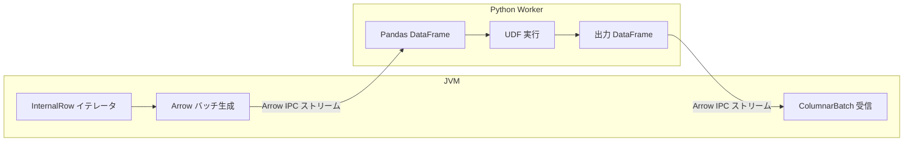
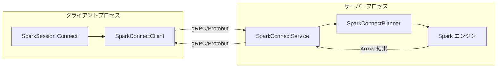

# 第24章 PySpark: Arrow 連携と Spark Connect

> 本章で読むソース
>
> - [`sql/core/src/main/scala/org/apache/spark/sql/execution/python/ArrowPythonRunner.scala` L31-L80](https://github.com/apache/spark/blob/v4.1.2/sql/core/src/main/scala/org/apache/spark/sql/execution/python/ArrowPythonRunner.scala#L31-L80)
> - [`sql/core/src/main/scala/org/apache/spark/sql/execution/python/ArrowPythonRunner.scala` L82-L120](https://github.com/apache/spark/blob/v4.1.2/sql/core/src/main/scala/org/apache/spark/sql/execution/python/ArrowPythonRunner.scala#L82-L120)
> - [`sql/core/src/main/scala/org/apache/spark/sql/execution/python/BatchEvalPythonExec.scala` L37-L65](https://github.com/apache/spark/blob/v4.1.2/sql/core/src/main/scala/org/apache/spark/sql/execution/python/BatchEvalPythonExec.scala#L37-L65)
> - [`sql/connect/server/src/main/scala/org/apache/spark/sql/connect/service/SparkConnectService.scala` L58-L82](https://github.com/apache/spark/blob/v4.1.2/sql/connect/server/src/main/scala/org/apache/spark/sql/connect/service/SparkConnectService.scala#L58-L82)
> - [`sql/connect/server/src/main/scala/org/apache/spark/sql/connect/service/SparkConnectService.scala` L96-L171](https://github.com/apache/spark/blob/v4.1.2/sql/connect/server/src/main/scala/org/apache/spark/sql/connect/service/SparkConnectService.scala#L96-L171)
> - [`sql/connect/common/src/main/scala/org/apache/spark/sql/connect/SparkSession.scala` L81-L116](https://github.com/apache/spark/blob/v4.1.2/sql/connect/common/src/main/scala/org/apache/spark/sql/connect/SparkSession.scala#L81-L116)
> - [`sql/connect/common/src/main/scala/org/apache/spark/sql/connect/client/SparkConnectClient.scala` L49-L75](https://github.com/apache/spark/blob/v4.1.2/sql/connect/common/src/main/scala/org/apache/spark/sql/connect/client/SparkConnectClient.scala#L49-L75)
> - [`sql/connect/common/src/main/scala/org/apache/spark/sql/connect/client/SparkConnectClient.scala` L182-L200](https://github.com/apache/spark/blob/v4.1.2/sql/connect/common/src/main/scala/org/apache/spark/sql/connect/client/SparkConnectClient.scala#L182-L200)
> - [`sql/connect/server/src/main/scala/org/apache/spark/sql/connect/execution/SparkConnectPlanExecution.scala` L51-L101](https://github.com/apache/spark/blob/v4.1.2/sql/connect/server/src/main/scala/org/apache/spark/sql/connect/execution/SparkConnectPlanExecution.scala#L51-L101)
> - [`sql/connect/server/src/main/scala/org/apache/spark/sql/connect/execution/SparkConnectPlanExecution.scala` L103-L200](https://github.com/apache/spark/blob/v4.1.2/sql/connect/server/src/main/scala/org/apache/spark/sql/connect/execution/SparkConnectPlanExecution.scala#L103-L200)
> - [`sql/connect/common/src/main/scala/org/apache/spark/sql/connect/client/arrow/ArrowSerializer.scala` L49-L138](https://github.com/apache/spark/blob/v4.1.2/sql/connect/common/src/main/scala/org/apache/spark/sql/connect/client/arrow/ArrowSerializer.scala#L49-L138)
> - [`sql/connect/common/src/main/scala/org/apache/spark/sql/connect/client/arrow/ArrowSerializer.scala` L147-L196](https://github.com/apache/spark/blob/v4.1.2/sql/connect/common/src/main/scala/org/apache/spark/sql/connect/client/arrow/ArrowSerializer.scala#L147-L196)

## この章の狙い

前章では `PySpark` の Py4J ベースの通信機構を追った。
本章では2つの発展的なトピックを扱う。
1つ目は **Arrow** を使った高速なデータ転送である。
2つ目は **Spark Connect** である。これは Py4J の制約を超え、gRPC と Protobuf を使ったクライアントサーバーアーキテクチャを実現する。
`ArrowPythonRunner` が Pandas UDF でどう Arrow ストリームを処理するか、`SparkConnectService` が gRPC リクエストをどうさばくか、`SparkConnectClient` と `SparkConnectPlanner` が Protobuf を Spark の論理計画にどう変換するかを追う。

## 前提

PySpark の従来のデータ転送は pickle ベースである（第23章）。
pickle は任意の Python オブジェクトをシリアライズできるが、カラム指向のデータ転送には不向きである。
**Arrow** はカラム指向のメモリフォーマットであり、JVM と Python 間でのゼロコピーに近いデータ転送を可能にする。
**Spark Connect** は Spark 4.0 で導入された、クライアントとサーバーを分離するアーキテクチャである。
クライアントは gRPC 経由で Protobuf でエンコードされた計画を送信し、サーバー側で Spark の実行エンジンが処理する。

## 24.1 Arrow を使った Python UDF 実行

### 24.1.1 ArrowPythonRunner

`ArrowPythonRunner` は Arrow ストリーム形式で Python ワーカーとデータを送受信する。

[`sql/core/src/main/scala/org/apache/spark/sql/execution/python/ArrowPythonRunner.scala` L31-L80](https://github.com/apache/spark/blob/v4.1.2/sql/core/src/main/scala/org/apache/spark/sql/execution/python/ArrowPythonRunner.scala#L31-L80)

```scala
abstract class BaseArrowPythonRunner[IN, OUT <: AnyRef](
    funcs: Seq[(ChainedPythonFunctions, Long)],
    evalType: Int,
    argOffsets: Array[Array[Int]],
    _schema: StructType,
    _timeZoneId: String,
    protected override val largeVarTypes: Boolean,
    protected override val workerConf: Map[String, String],
    override val pythonMetrics: Map[String, SQLMetric],
    jobArtifactUUID: Option[String],
    sessionUUID: Option[String])
  extends BasePythonRunner[IN, OUT](
    funcs.map(_._1), evalType, argOffsets, jobArtifactUUID, pythonMetrics)
  with PythonArrowInput[IN]
  with PythonArrowOutput[OUT] {

  override val envVars: util.Map[String, String] = {
    val envVars = new util.HashMap(funcs.head._1.funcs.head.envVars)
    sessionUUID.foreach { uuid =>
      envVars.put("PYSPARK_SPARK_SESSION_UUID", uuid)
    }
    envVars
  }
  override val pythonExec: String =
    SQLConf.get.pysparkWorkerPythonExecutable.getOrElse(
      funcs.head._1.funcs.head.pythonExec)

  override val bufferSize: Int = SQLConf.get.pandasUDFBufferSize
  require(
    bufferSize >= 4,
    "Pandas execution requires more than 4 bytes. Please set higher buffer. " +
      s"Please change '${SQLConf.PANDAS_UDF_BUFFER_SIZE.key}'.")
}
```

`BaseArrowPythonRunner` は `PythonArrowInput` と `PythonArrowOutput` を mixin し、Arrow 形式での入出力を提供する。
`bufferSize` は Arrow バッファのサイズを制御し、Pandas UDF のパフォーマンスに直接影響する。

```scala
class ArrowPythonRunner(
    funcs: Seq[(ChainedPythonFunctions, Long)],
    evalType: Int,
    argOffsets: Array[Array[Int]],
    _schema: StructType,
    _timeZoneId: String,
    largeVarTypes: Boolean,
    workerConf: Map[String, String],
    pythonMetrics: Map[String, SQLMetric],
    jobArtifactUUID: Option[String],
    sessionUUID: Option[String],
    profiler: Option[String])
  extends RowInputArrowPythonRunner(
    funcs, evalType, argOffsets, _schema, _timeZoneId, largeVarTypes, workerConf,
    pythonMetrics, jobArtifactUUID, sessionUUID) {

  override protected def writeUDF(dataOut: DataOutputStream): Unit =
    PythonUDFRunner.writeUDFs(dataOut, funcs, argOffsets, profiler)
}
```

`ArrowPythonRunner` は行ベースの入力を Arrow 形式に変換して Python ワーカーに送り、結果を Arrow 形式で受け取って `ColumnarBatch` に変換する。

### 24.1.2 Arrow データ交換の流れ

Arrow を使った Python UDF のデータ交換は以下の流れで行われる。



1. JVM が `InternalRow` のイテレータを Arrow の IPC ストリーム形式にシリアライズする。
2. Python ワーカーが Arrow ストリームを受信し、Pandas DataFrame に変換する。
3. Python UDF を Pandas DataFrame に対して実行する。
4. 結果の Pandas DataFrame を Arrow ストリームとして JVM に返す。
5. JVM が Arrow バッチを `ColumnarBatch`（カラム指向のバッチ）に変換する。

なぜ速いのか: pickle は行ごとにオブジェクトをシリアライズするが、Arrow はカラムごとに連続したメモリ領域にデータを配置する。
これにより、シリアライズ、デシリアライズのオーバーヘッドが大幅に削減される。
さらに、Arrow はゼロコピーの読み取りをサポートするため、Python 側で Pandas DataFrame を作成する際にデータのコピーが不要になる場合がある。

## 24.2 Spark Connect: 概要

**Spark Connect** は Spark のクライアントサーバーアーキテクチャである。
従来の PySpark は Py4J 経由で JVM プロセスと直接通信するため、ドライバープロセスと同じマシンで実行する必要があった。
`Spark Connect` は gRPC を使い、クライアントをサーバーから完全に分離する。

### 24.2.1 アーキテクチャ



クライアントの `SparkSession` は `SparkConnectClient` を介して gRPC リクエストを送信する。
サーバーの `SparkConnectService` はリクエストを受け取り、`SparkConnectPlanner` が Protobuf を Spark の論理計画に変換する。
実行結果は Arrow バッチとして gRPC ストリームで返される。

## 24.3 SparkConnectService: gRPC サービス

`SparkConnectService` は gRPC のサービス実装である。

[`sql/connect/server/src/main/scala/org/apache/spark/sql/connect/service/SparkConnectService.scala` L58-L82](https://github.com/apache/spark/blob/v4.1.2/sql/connect/server/src/main/scala/org/apache/spark/sql/connect/service/SparkConnectService.scala#L58-L82)

```scala
class SparkConnectService(debug: Boolean)
  extends AsyncService with BindableService with Logging {

  override def executePlan(
      request: proto.ExecutePlanRequest,
      responseObserver: StreamObserver[proto.ExecutePlanResponse]): Unit = {
    try {
      new SparkConnectExecutePlanHandler(responseObserver).handle(request)
    } catch {
      ErrorUtils.handleError(
        "execute",
        observer = responseObserver,
        userId = request.getUserContext.getUserId,
        sessionId = request.getSessionId)
    }
  }
```

`executePlan` は `SparkConnectExecutePlanHandler` に処理を委譲する。
エラーは `ErrorUtils.handleError` で捕捉され、gRPC の `StreamObserver` 経由でクライアントに返される。

### 24.3.1 主要な RPC メソッド

[`sql/connect/server/src/main/scala/org/apache/spark/sql/connect/service/SparkConnectService.scala` L96-L171](https://github.com/apache/spark/blob/v4.1.2/sql/connect/server/src/main/scala/org/apache/spark/sql/connect/service/SparkConnectService.scala#L96-L171)

```scala
override def analyzePlan(
    request: proto.AnalyzePlanRequest,
    responseObserver: StreamObserver[proto.AnalyzePlanResponse]): Unit = {
  try {
    new SparkConnectAnalyzeHandler(responseObserver).handle(request)
  } catch {
    ErrorUtils.handleError("analyze", observer = responseObserver,
      userId = request.getUserContext.getUserId, sessionId = request.getSessionId)
  }
}

override def config(
    request: proto.ConfigRequest,
    responseObserver: StreamObserver[proto.ConfigResponse]): Unit = {
  try {
    new SparkConnectConfigHandler(responseObserver).handle(request)
  } catch {
    ErrorUtils.handleError("config", observer = responseObserver,
      userId = request.getUserContext.getUserId, sessionId = request.getSessionId)
  }
}

override def addArtifacts(responseObserver: StreamObserver[AddArtifactsResponse])
    : StreamObserver[AddArtifactsRequest] = new SparkConnectAddArtifactsHandler(
  responseObserver)

override def interrupt(
    request: proto.InterruptRequest,
    responseObserver: StreamObserver[proto.InterruptResponse]): Unit = {
  try {
    new SparkConnectInterruptHandler(responseObserver).handle(request)
  } catch
    ErrorUtils.handleError("interrupt", observer = responseObserver,
      userId = request.getUserContext.getUserId, sessionId = request.getSessionId)
}

override def reattachExecute(
    request: proto.ReattachExecuteRequest,
    responseObserver: StreamObserver[proto.ExecutePlanResponse]): Unit = {
  try {
    new SparkConnectReattachExecuteHandler(responseObserver).handle(request)
  } catch
    ErrorUtils.handleError("reattachExecute", observer = responseObserver,
      userId = request.getUserContext.getUserId, sessionId = request.getSessionId)
}
```

主要な RPC メソッドを以下に示す。

- **`executePlan`**: 計画を実行し、結果をストリーミングで返す。
- **`analyzePlan`**: 計画の分析（スキーマ、explain 等）を行う。
- **`config`**: 設定の取得、設定を行う。
- **`addArtifacts`**: UDF のコード等のアーティファクトをアップロードする。
- **`interrupt`**: 実行中のクエリを中断する。
- **`reattachExecute`**: 切断された実行に再接続する。

## 24.4 SparkConnectClient: クライアント側の実装

`SparkConnectClient` は gRPC チャネルを管理し、サーバーと通信する。

[`sql/connect/common/src/main/scala/org/apache/spark/sql/connect/client/SparkConnectClient.scala` L49-L76](https://github.com/apache/spark/blob/v4.1.2/sql/connect/common/src/main/scala/org/apache/spark/sql/connect/client/SparkConnectClient.scala#L49-L76)

```scala
private[sql] class SparkConnectClient(
    private[sql] val configuration: SparkConnectClient.Configuration,
    private[sql] val channel: ManagedChannel)
    extends Logging {

  private val userContext: UserContext = configuration.userContext

  private[this] val stubState = new SparkConnectStubState(channel, configuration.retryPolicies)
  private[this] val bstub =
    new CustomSparkConnectBlockingStub(channel, stubState)
  private[this] val stub =
    new CustomSparkConnectStub(channel, stubState)

  private[client] def userAgent: String = configuration.userAgent

  // ... (中略) ...

  private[sql] val sessionId: String = configuration.sessionId.getOrElse(UUID.randomUUID.toString)

  private val conf: RuntimeConfig = new RuntimeConfig(this)
```

`SparkConnectClient` は gRPC の `ManagedChannel` を保持し、blocking stub と async stub を生成する。
`sessionId` はクライアントごとにユニークな UUID を割り当て、サーバー側のセッション管理に使う。

[`sql/connect/common/src/main/scala/org/apache/spark/sql/connect/client/SparkConnectClient.scala` L182-L200](https://github.com/apache/spark/blob/v4.1.2/sql/connect/common/src/main/scala/org/apache/spark/sql/connect/client/SparkConnectClient.scala#L182-L200)

```scala
def analyze(request: proto.AnalyzePlanRequest): proto.AnalyzePlanResponse = {
  artifactManager.uploadAllClassFileArtifacts()
  bstub.analyzePlan(request)
}
```

`analyze` は blocking stub を介して計画分析リクエストを送信する。
その前に `artifactManager.uploadAllClassFileArtifacts()` で UDF のクラスファイルアーティファクトをアップロードする。

## 24.5 Connect クライアント側 SparkSession

`Spark Connect` のクライアント側 `SparkSession` は JVM を含まない軽量な実装である。

[`sql/connect/common/src/main/scala/org/apache/spark/sql/connect/SparkSession.scala` L81-L116](https://github.com/apache/spark/blob/v4.1.2/sql/connect/common/src/main/scala/org/apache/spark/sql/connect/SparkSession.scala#L81-L116)

```scala
class SparkSession private[sql] (
    private[sql] val client: SparkConnectClient,
    private val planIdGenerator: AtomicLong)
    extends sql.SparkSession
    with Logging {

  private[this] val allocator = new RootAllocator()
  private[sql] lazy val cleaner = new SessionCleaner(this)

  private[sql] def sessionId: String = client.sessionId

  override def sparkContext: SparkContext =
    throw ConnectClientUnsupportedErrors.sparkContext()

  val conf: RuntimeConfig = new RuntimeConfig(client)
  // ...
}
```

`sparkContext` を呼び出すと例外が発生する。
`Spark Connect` クライアントには `SparkContext` が存在しないためである。
全ての操作は gRPC 経由でサーバーに転送される。

## 24.6 計画の実行と Arrow 結果返送

`SparkConnectPlanExecution` は Protobuf の計画を Spark の論理計画に変換し、実行結果を Arrow バッチで返す。

[`sql/connect/server/src/main/scala/org/apache/spark/sql/connect/execution/SparkConnectPlanExecution.scala` L51-L101](https://github.com/apache/spark/blob/v4.1.2/sql/connect/server/src/main/scala/org/apache/spark/sql/connect/execution/SparkConnectPlanExecution.scala#L51-L101)

```scala
private[execution] class SparkConnectPlanExecution(executeHolder: ExecuteHolder) {

  private val sessionHolder = executeHolder.sessionHolder
  private val session = executeHolder.session

  def handlePlan(responseObserver: ExecuteResponseObserver[proto.ExecutePlanResponse]): Unit = {
    val request = executeHolder.request
    val planner = new SparkConnectPlanner(executeHolder)
    val tracker = executeHolder.eventsManager.createQueryPlanningTracker()
    // ...
    request.getPlan.getOpTypeCase match {
      case proto.Plan.OpTypeCase.ROOT =>
        val dataframe = Dataset.ofRows(
          sessionHolder.session,
          planner.transformRelation(request.getPlan.getRoot, cachePlan = true),
          tracker, shuffleCleanupMode)
        responseObserver.onNext(createSchemaResponse(request.getSessionId, dataframe.schema))
        processAsArrowBatches(dataframe, responseObserver, executeHolder)
        responseObserver.onNext(MetricGenerator.createMetricsResponse(sessionHolder, dataframe))
      // ...
    }
  }
}
```

`handlePlan` の処理は以下の通りである。

1. `SparkConnectPlanner` で Protobuf を Spark の論理計画に変換する。
2. `Dataset.ofRows` で DataFrame を生成する。
3. スキーマ情報をレスポンスとして送信する。
4. `processAsArrowBatches` で結果を Arrow バッチとしてストリーミング送信する。
5. メトリクスをレスポンスとして送信する。

### 24.6.1 Arrow バッチへの変換

[`sql/connect/server/src/main/scala/org/apache/spark/sql/connect/execution/SparkConnectPlanExecution.scala` L103-L200](https://github.com/apache/spark/blob/v4.1.2/sql/connect/server/src/main/scala/org/apache/spark/sql/connect/execution/SparkConnectPlanExecution.scala#L103-L200)

```scala
def rowToArrowConverter(
    schema: StructType,
    maxRecordsPerBatch: Int,
    maxBatchSize: Long,
    timeZoneId: String,
    errorOnDuplicatedFieldNames: Boolean,
    largeVarTypes: Boolean): Iterator[InternalRow] => Iterator[Batch] = { rows =>
  val batches = ArrowConverters.toBatchWithSchemaIterator(
    rows, schema, maxRecordsPerBatch, maxBatchSize, timeZoneId,
    errorOnDuplicatedFieldNames, largeVarTypes)
  batches.map(b => b -> batches.rowCountInLastBatch)
}

def processAsArrowBatches(
    dataframe: DataFrame,
    responseObserver: StreamObserver[ExecutePlanResponse],
    executePlan: ExecuteHolder): Unit = {
  // ...
  val maxBatchSize = (SparkEnv.get.conf.get(CONNECT_GRPC_ARROW_MAX_BATCH_SIZE) * 0.7).toLong
  // ...
  val converter = rowToArrowConverter(
    schema, maxRecordsPerBatch, maxBatchSize, timeZoneId,
    errorOnDuplicatedFieldNames = false, largeVarTypes = largeVarTypes)
  // ...
}
```

`ArrowConverters.toBatchWithSchemaIterator` は `InternalRow` のイテレータを Arrow バッチのイテレータに変換する。
`maxBatchSize` の70%を上限としているのは、Arrow のサイズ見積もりが正確でないためである。
結果が大きい場合は `isResultChunkingEnabled` により複数のチャンクに分割して送信する。

## 24.7 ArrowSerializer: クライアント側の Arrow シリアライズ

クライアント側でも Arrow を使ってデータをサーバーに送信する。

[`sql/connect/common/src/main/scala/org/apache/spark/sql/connect/client/arrow/ArrowSerializer.scala` L49-L138](https://github.com/apache/spark/blob/v4.1.2/sql/connect/common/src/main/scala/org/apache/spark/sql/connect/client/arrow/ArrowSerializer.scala#L49-L138)

```scala
class ArrowSerializer[T](
    private[this] val enc: AgnosticEncoder[T],
    private[this] val allocator: BufferAllocator,
    private[this] val timeZoneId: String,
    private[this] val largeVarTypes: Boolean) {

  private val (root, serializer) =
    ArrowSerializer.serializerFor(enc, allocator, timeZoneId, largeVarTypes)
  private val vectors = root.getFieldVectors.asScala
  private val unloader = new VectorUnloader(root)
  private val schemaBytes = {
    val bytes = new ByteArrayOutputStream()
    MessageSerializer.serialize(newChannel(bytes), root.getSchema)
    bytes.toByteArray
  }
  private var rowCount: Int = 0

  def sizeInBytes: Long = {
    root.setRowCount(rowCount)
    schemaBytes.length + vectors.map(_.getBufferSize).sum
  }

  def append(record: T): Unit = {
    serializer.write(rowCount, record)
    rowCount += 1
  }

  def writeIpcStream(output: OutputStream): Unit = {
    val channel = newChannel(output)
    root.setRowCount(rowCount)
    val batch = unloader.getRecordBatch
    try {
      channel.write(schemaBytes)
      MessageSerializer.serialize(channel, batch)
      ArrowStreamWriter.writeEndOfStream(channel, IpcOption.DEFAULT)
    } finally {
      batch.close()
    }
  }

  def reset(): Unit = {
    rowCount = 0
    vectors.foreach(_.reset())
  }
}
```

`ArrowSerializer` は `AgnosticEncoder` に基づいてオブジェクトを Arrow のベクトルに書き込む。
`writeIpcStream` で Arrow IPC ストリーム形式にシリアライズし、`OutputStream` に書き出す。
スキーマは1回だけシリアライズされ、`schemaBytes` にキャッシュされる。

### 24.7.1 バッチング付きシリアライズ

[`sql/connect/common/src/main/scala/org/apache/spark/sql/connect/client/arrow/ArrowSerializer.scala` L147-L196](https://github.com/apache/spark/blob/v4.1.2/sql/connect/common/src/main/scala/org/apache/spark/sql/connect/client/arrow/ArrowSerializer.scala#L147-L196)

```scala
def serialize[T](
    input: Iterator[T],
    enc: AgnosticEncoder[T],
    allocator: BufferAllocator,
    maxRecordsPerBatch: Int,
    maxBatchSize: Long,
    timeZoneId: String,
    largeVarTypes: Boolean,
    batchSizeCheckInterval: Int = 128): CloseableIterator[Array[Byte]] = {
  // ...
  new CloseableIterator[Array[Byte]] {
    private val serializer = new ArrowSerializer[T](enc, allocator, timeZoneId, largeVarTypes)
    private val bytes = new ByteArrayOutputStream

    override def next(): Array[Byte] = {
      serializer.reset()
      bytes.reset()
      var i = 0
      while (i < maxRecordsPerBatch && input.hasNext && sizeOk(i)) {
        serializer.append(input.next())
        i += 1
      }
      serializer.writeIpcStream(bytes)
      bytes.toByteArray
    }
    // ...
  }
}
```

`serialize` は入力イテレータを Arrow IPC ストリームのイテレータに変換する。
`maxRecordsPerBatch` と `maxBatchSize` の両方の条件でバッチサイズを制御する。
`sizeOk` は `batchSizeCheckInterval` 件ごとにサイズチェックを行い、バッチが上限を超えないようにする。

## 24.8 高速化の工夫: Arrow によるゼロコピーデータ転送

`Spark Connect` ではクライアントとサーバー間のデータ転送に Arrow を使う。
なぜ速いのか: Arrow はカラム指向のメモリフォーマットであり、型付きのカラムデータを連続したバッファに配置する。
これにより、シリアライズ時にオブジェクトごとの型変換が不要であり、デシリアライズ時もバッファを直接参照できる。
従来の pickle ベースの転送では各行ごとに Python オブジェクトを構築する必要があるが、Arrow ではカラムバッファを直接 Pandas の `Series` や NumPy 配列にマッピングできる。

さらに、`Spark Connect` の結果返送では gRPC のストリーミングレスポンスを使い、全データが揃うのを待たずに逐次クライアントに送信する。
大きな結果セットでも最初のバッチがすぐに届くため、体感レイテンシが大幅に改善される。

## まとめ

本章では Arrow 連携と `Spark Connect` を追った。

- `ArrowPythonRunner` は Arrow ストリーム形式で Python ワーカーとデータを送受信し、Pandas UDF の実行を高速化する。
- `Spark Connect` は gRPC と Protobuf を使い、クライアントとサーバーを完全に分離する。
- `SparkConnectService` は gRPC サービスとして `executePlan`、`analyzePlan`、`config` 等の RPC を提供する。
- `SparkConnectClient` は gRPC チャネルを管理し、サーバーと通信する。
- `SparkConnectPlanExecution` は Protobuf を Spark の論理計画に変換し、結果を Arrow バッチで返す。
- `ArrowSerializer` はクライアント側でデータを Arrow 形式にシリアライズする。

## 関連する章

- 第23章: Py4J ゲートウェイと Python API 設計（従来の PySpark の通信機構）
- 第19章: Catalyst（論理計画と最適化）
- 第20章: Tungsten（メモリ管理とバイナリフォーマット）
