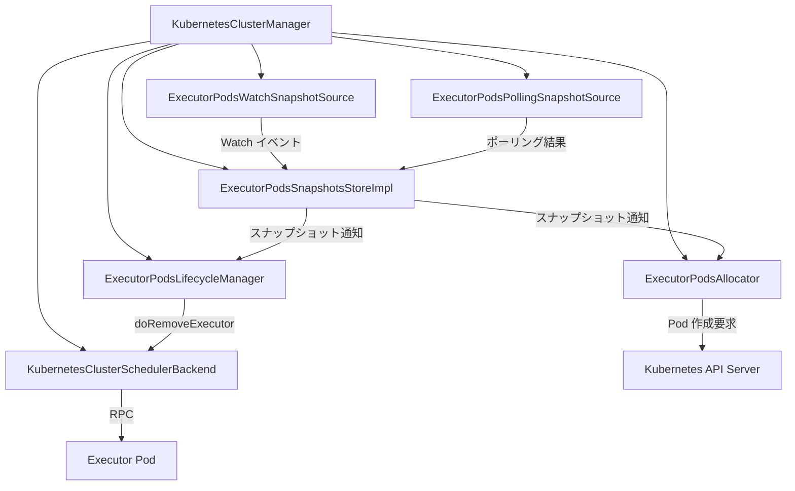

# 第25章 Kubernetes: Spark on K8s アーキテクチャ

> 本章で読むソース
>
> - [`resource-managers/kubernetes/core/src/main/scala/org/apache/spark/deploy/k8s/submit/KubernetesClientApplication.scala` L221-L261](https://github.com/apache/spark/blob/v4.1.2/resource-managers/kubernetes/core/src/main/scala/org/apache/spark/deploy/k8s/submit/KubernetesClientApplication.scala#L221-L261)
> - [`resource-managers/kubernetes/core/src/main/scala/org/apache/spark/deploy/k8s/submit/KubernetesClientApplication.scala` L98-L211](https://github.com/apache/spark/blob/v4.1.2/resource-managers/kubernetes/core/src/main/scala/org/apache/spark/deploy/k8s/submit/KubernetesClientApplication.scala#L98-L211)
> - [`resource-managers/kubernetes/core/src/main/scala/org/apache/spark/scheduler/cluster/k8s/KubernetesClusterManager.scala` L35-L189](https://github.com/apache/spark/blob/v4.1.2/resource-managers/kubernetes/core/src/main/scala/org/apache/spark/scheduler/cluster/k8s/KubernetesClusterManager.scala#L35-L189)
> - [`resource-managers/kubernetes/core/src/main/scala/org/apache/spark/scheduler/cluster/k8s/KubernetesClusterSchedulerBackend.scala` L46-L118](https://github.com/apache/spark/blob/v4.1.2/resource-managers/kubernetes/core/src/main/scala/org/apache/spark/scheduler/cluster/k8s/KubernetesClusterSchedulerBackend.scala#L46-L118)
> - [`resource-managers/kubernetes/core/src/main/scala/org/apache/spark/scheduler/cluster/k8s/KubernetesClusterSchedulerBackend.scala` L236-L284](https://github.com/apache/spark/blob/v4.1.2/resource-managers/kubernetes/core/src/main/scala/org/apache/spark/scheduler/cluster/k8s/KubernetesClusterSchedulerBackend.scala#L236-L284)
> - [`resource-managers/kubernetes/core/src/main/scala/org/apache/spark/scheduler/cluster/k8s/ExecutorPodsAllocator.scala` L41-L146](https://github.com/apache/spark/blob/v4.1.2/resource-managers/kubernetes/core/src/main/scala/org/apache/spark/scheduler/cluster/k8s/ExecutorPodsAllocator.scala#L41-L146)
> - [`resource-managers/kubernetes/core/src/main/scala/org/apache/spark/scheduler/cluster/k8s/ExecutorPodsAllocator.scala` L429-L490](https://github.com/apache/spark/blob/v4.1.2/resource-managers/kubernetes/core/src/main/scala/org/apache/spark/scheduler/cluster/k8s/ExecutorPodsAllocator.scala#L429-L490)
> - [`resource-managers/kubernetes/core/src/main/scala/org/apache/spark/scheduler/cluster/k8s/ExecutorPodsLifecycleManager.scala` L39-L92](https://github.com/apache/spark/blob/v4.1.2/resource-managers/kubernetes/core/src/main/scala/org/apache/spark/scheduler/cluster/k8s/ExecutorPodsLifecycleManager.scala#L39-L92)
> - [`resource-managers/kubernetes/core/src/main/scala/org/apache/spark/scheduler/cluster/k8s/KubernetesExecutorBackend.scala` L49-L139](https://github.com/apache/spark/blob/v4.1.2/resource-managers/kubernetes/core/src/main/scala/org/apache/spark/scheduler/cluster/k8s/KubernetesExecutorBackend.scala#L49-L139)
> - [`resource-managers/kubernetes/core/src/main/scala/org/apache/spark/deploy/k8s/Config.scala` L463-L516](https://github.com/apache/spark/blob/v4.1.2/resource-managers/kubernetes/core/src/main/scala/org/apache/spark/deploy/k8s/Config.scala#L463-L516)

## この章の狙い

Apache Spark は Kubernetes 上でドライバとエグゼキュータをポッドとして実行できる。
本章では、`spark-submit` が Kubernetes API サーバにドライバポッドを作成するところから、ドライバがエグゼキュータポッドを動的に割り当てる流れまでを追う。
コンポーネント間の役割分担、ポッドの生成と監視の仕組み、設定項目の全体像を把握することが目的である。

## 前提

Spark のスケジューラバックエンドは `ExternalClusterManager` インタフェース経由でクラスタマネージャごとに切り替わる（第8章）。
Kubernetes の場合、`KubernetesClusterManager` が `TaskScheduler` と `SchedulerBackend` を生成する。
ドライバは Kubernetes API サーバと直接通信し、エグゼキュータポッドを作成する。
エグゼキュータは `CoarseGrainedExecutorBackend` を継承する `KubernetesExecutorBackend` として起動する（第9章）。

## 25.1 アプリケーション送信: KubernetesClientApplication

`KubernetesClientApplication` は `spark-submit` が Kubernetes をマスタとして指定されたときのエントリーポイントである。

[`resource-managers/kubernetes/core/src/main/scala/org/apache/spark/deploy/k8s/submit/KubernetesClientApplication.scala` L221-L261](https://github.com/apache/spark/blob/v4.1.2/resource-managers/kubernetes/core/src/main/scala/org/apache/spark/deploy/k8s/submit/KubernetesClientApplication.scala#L221-L261)

```scala
private[spark] class KubernetesClientApplication extends SparkApplication {

  override def start(args: Array[String], conf: SparkConf): Unit = {
    val parsedArguments = ClientArguments.fromCommandLineArgs(args)
    run(parsedArguments, conf)
  }

  private def run(clientArguments: ClientArguments, sparkConf: SparkConf): Unit = {
    val kubernetesAppId = KubernetesConf.getKubernetesAppId()
    val kubernetesConf = KubernetesConf.createDriverConf(
      sparkConf,
      kubernetesAppId,
      clientArguments.mainAppResource,
      clientArguments.mainClass,
      clientArguments.driverArgs,
      clientArguments.proxyUser)
    val master = KubernetesUtils.parseMasterUrl(sparkConf.get("spark.master"))
    val watcher = new LoggingPodStatusWatcherImpl(kubernetesConf)

    Utils.tryWithResource(SparkKubernetesClientFactory.createKubernetesClient(
      master,
      Some(kubernetesConf.namespace),
      KUBERNETES_AUTH_SUBMISSION_CONF_PREFIX,
      SparkKubernetesClientFactory.ClientType.Submission,
      sparkConf,
      None)) { kubernetesClient =>
        val client = new Client(
          kubernetesConf,
          new KubernetesDriverBuilder(),
          kubernetesClient,
          watcher)
        client.run()
    }
  }
}
```

処理の流れは以下の通りである。

1. コマンドライン引数を `ClientArguments` にパースする。
2. `KubernetesConf.getKubernetesAppId()` でユニークなアプリケーションIDを生成する。
3. `KubernetesConf.createDriverConf` でドライバポッドの設定（`KubernetesDriverConf`）を構築する。
4. `KubernetesClient` を生成し、`Client.run()` でドライバポッドを作成する。

`KubernetesConf.getKubernetesAppId` は `spark-` プレフィックスに UUID を付与した文字列を返す。
このIDはポッドのラベル（`spark-app-selector`）として利用され、同一アプリケーションのリソースをグループ化する。

### 25.1.1 Client.run: ドライバポッドの作成

`Client` クラスはドライバポッドの生成と、完了までの監視を担う。

[`resource-managers/kubernetes/core/src/main/scala/org/apache/spark/deploy/k8s/submit/KubernetesClientApplication.scala` L104-L155](https://github.com/apache/spark/blob/v4.1.2/resource-managers/kubernetes/core/src/main/scala/org/apache/spark/deploy/k8s/submit/KubernetesClientApplication.scala#L104-L155)

```scala
def run(): Unit = {
  val resolvedDriverSpec = builder.buildFromFeatures(conf, kubernetesClient)
  val configMapName = KubernetesClientUtils.configMapNameDriver
  val confFilesMap = KubernetesClientUtils.buildSparkConfDirFilesMap(configMapName,
    conf.sparkConf, resolvedDriverSpec.systemProperties)
  val configMap = KubernetesClientUtils.buildConfigMap(configMapName, confFilesMap +
      (KUBERNETES_NAMESPACE.key -> conf.namespace))

  // ... (ConfigMap をマウントしたコンテナとポッドを構築)

  val preKubernetesResources = resolvedDriverSpec.driverPreKubernetesResources
  try {
    kubernetesClient.resourceList(preKubernetesResources: _*).forceConflicts().serverSideApply()
  } catch {
    case NonFatal(e) =>
      kubernetesClient.resourceList(preKubernetesResources: _*).delete()
      throw e
  }

  var createdDriverPod: Pod = null
  try {
    createdDriverPod =
      kubernetesClient.pods().inNamespace(conf.namespace).resource(resolvedDriverPod).create()
  } catch {
    case NonFatal(e) =>
      kubernetesClient.resourceList(preKubernetesResources: _*).delete()
      throw e
  }
  // ... (オーナーリファレンスの設定、post リソースの作成)
}
```

`builder.buildFromFeatures` はフィーチャーステップを順に適用してドライバポッドの仕様を構築する（第26章）。
ポッド作成の前に `preKubernetesResources`（Secret 等）を先に作成し、ポッド作成失敗時にはそれらを削除する。
ポッド作成後はオーナーリファレンスを設定し、ドライバポッド削除時に関連リソースもガベージコレクションされるようにする。

## 25.2 KubernetesClusterManager: コンポーネントの組み立て

`KubernetesClusterManager` は `ExternalClusterManager` を実装し、ドライバ上で動作するスケジューラバックエンドのコンポーネントを生成する。

[`resource-managers/kubernetes/core/src/main/scala/org/apache/spark/scheduler/cluster/k8s/KubernetesClusterManager.scala` L35-L50](https://github.com/apache/spark/blob/v4.1.2/resource-managers/kubernetes/core/src/main/scala/org/apache/spark/scheduler/cluster/k8s/KubernetesClusterManager.scala#L35-L50)

```scala
private[spark] class KubernetesClusterManager extends ExternalClusterManager with Logging {
  import SparkMasterRegex._

  override def canCreate(masterURL: String): Boolean = SparkMasterRegex.isK8s(masterURL)

  override def createTaskScheduler(sc: SparkContext, masterURL: String): TaskScheduler = {
    val maxTaskFailures = sc.conf.get(KUBERNETES_DRIVER_MASTER_URL) match {
      case "local" | LOCAL_N_REGEX(_) => 1
      case LOCAL_N_FAILURES_REGEX(_, maxFailures) => maxFailures.toInt
      case _ => sc.conf.get(TASK_MAX_FAILURES)
    }
    new TaskSchedulerImpl(sc, maxTaskFailures, isLocal(sc.conf))
  }
```

`canCreate` はマスタURLが `k8s://` で始まるかどうかを判定する。
`createTaskScheduler` は `TaskSchedulerImpl` を返す。

### 25.2.1 createSchedulerBackend

`createSchedulerBackend` は以下のコンポーネントを生成し、`KubernetesClusterSchedulerBackend` に渡す。

[`resource-managers/kubernetes/core/src/main/scala/org/apache/spark/scheduler/cluster/k8s/KubernetesClusterManager.scala` L119-L158](https://github.com/apache/spark/blob/v4.1.2/resource-managers/kubernetes/core/src/main/scala/org/apache/spark/scheduler/cluster/k8s/KubernetesClusterManager.scala#L119-L158)

```scala
val schedulerExecutorService = ThreadUtils.newDaemonSingleThreadScheduledExecutor(
  "kubernetes-executor-maintenance")

ExecutorPodsSnapshot.setShouldCheckAllContainers(
  sc.conf.get(KUBERNETES_EXECUTOR_CHECK_ALL_CONTAINERS))
val sparkContainerName = sc.conf.get(KUBERNETES_EXECUTOR_PODTEMPLATE_CONTAINER_NAME)
  .getOrElse(DEFAULT_EXECUTOR_CONTAINER_NAME)
ExecutorPodsSnapshot.setSparkContainerName(sparkContainerName)
val subscribersExecutor = ThreadUtils
  .newDaemonThreadPoolScheduledExecutor(
    "kubernetes-executor-snapshots-subscribers", 2)
val snapshotsStore = new ExecutorPodsSnapshotsStoreImpl(subscribersExecutor, conf = sc.conf)

val executorPodsLifecycleEventHandler = new ExecutorPodsLifecycleManager(
  sc.conf,
  kubernetesClient,
  snapshotsStore)

val executorPodsAllocator = makeExecutorPodsAllocator(sc, kubernetesClient, snapshotsStore)

val podsWatchEventSource = new ExecutorPodsWatchSnapshotSource(
  snapshotsStore,
  kubernetesClient,
  sc.conf)

val eventsPollingExecutor = ThreadUtils.newDaemonSingleThreadScheduledExecutor(
  "kubernetes-executor-pod-polling-sync")
val podsPollingEventSource = new ExecutorPodsPollingSnapshotSource(
  sc.conf, kubernetesClient, snapshotsStore, eventsPollingExecutor)

new KubernetesClusterSchedulerBackend(
  scheduler.asInstanceOf[TaskSchedulerImpl],
  sc,
  kubernetesClient,
  schedulerExecutorService,
  snapshotsStore,
  executorPodsAllocator,
  executorPodsLifecycleEventHandler,
  podsWatchEventSource,
  podsPollingEventSource)
```

生成されるコンポーネントは以下の通りである。

- `ExecutorPodsSnapshotsStoreImpl`: ポッド状態のスナップショットを管理する。
- `ExecutorPodsLifecycleManager`: スナップショットを購読し、ポッドの終了や失敗を処理する。
- `ExecutorPodsAllocator`: スナップショットを購読し、新しいエグゼキュータポッドを作成する。
- `ExecutorPodsWatchSnapshotSource`: Kubernetes API の Watch イベントをスナップショットストアに伝える。
- `ExecutorPodsPollingSnapshotSource`: 定期的に Kubernetes API をポーリングし、スナップショットを更新する。



このアーキテクチャの核心は、プロデューサ（Watch/Polling）とコンシューマ（Allocator/LifecycleManager）が `ExecutorPodsSnapshotsStore` を介して疎結合に接続されている点である。

## 25.3 KubernetesClusterSchedulerBackend

`KubernetesClusterSchedulerBackend` は `CoarseGrainedSchedulerBackend` を継承し、Kubernetes 固有のスケジューラバックエンドである。

[`resource-managers/kubernetes/core/src/main/scala/org/apache/spark/scheduler/cluster/k8s/KubernetesClusterSchedulerBackend.scala` L46-L118](https://github.com/apache/spark/blob/v4.1.2/resource-managers/kubernetes/core/src/main/scala/org/apache/spark/scheduler/cluster/k8s/KubernetesClusterSchedulerBackend.scala#L46-L118)

```scala
private[spark] class KubernetesClusterSchedulerBackend(
    scheduler: TaskSchedulerImpl,
    sc: SparkContext,
    kubernetesClient: KubernetesClient,
    executorService: ScheduledExecutorService,
    snapshotsStore: ExecutorPodsSnapshotsStore,
    podAllocator: AbstractPodsAllocator,
    lifecycleEventHandler: ExecutorPodsLifecycleManager,
    watchEvents: ExecutorPodsWatchSnapshotSource,
    pollEvents: ExecutorPodsPollingSnapshotSource)
    extends CoarseGrainedSchedulerBackend(scheduler, sc.env.rpcEnv) {
```

### 25.3.1 start メソッド

`start` は各コンポーネントの起動を順序立てて行う。

```scala
override def start(): Unit = {
  super.start()
  podAllocator.start(applicationId(), this)
  val initExecs = Map(defaultProfile -> initialExecutors)
  podAllocator.setTotalExpectedExecutors(initExecs)
  lifecycleEventHandler.start(this)
  watchEvents.start(applicationId())
  pollEvents.start(applicationId())
  if (!conf.get(KUBERNETES_EXECUTOR_DISABLE_CONFIGMAP)) {
    setUpExecutorConfigMap(podAllocator.driverPod)
  }
}
```

1. `super.start()` で RPC エンドポイント（`DriverEndpoint`）を起動する。
2. `podAllocator.start` でスナップショットストアの購読を開始する。
3. `setTotalExpectedExecutors` で初期エグゼキュータ数を設定する。
4. `lifecycleEventHandler.start` でポッド状態の監視を開始する。
5. `watchEvents.start` と `pollEvents.start` で Watch/Polling を開始する。
6. ConfigMap が有効な場合、エグゼキュータ用の設定 ConfigMap を作成する。

### 25.3.2 doKillExecutors: エグゼキュータの削除

`doKillExecutors` はエグゼキュータを段階的に削除する。

[`resource-managers/kubernetes/core/src/main/scala/org/apache/spark/scheduler/cluster/k8s/KubernetesClusterSchedulerBackend.scala` L236-L284](https://github.com/apache/spark/blob/v4.1.2/resource-managers/kubernetes/core/src/main/scala/org/apache/spark/scheduler/cluster/k8s/KubernetesClusterSchedulerBackend.scala#L236-L284)

```scala
override def doKillExecutors(executorIds: Seq[String]): Future[Boolean] = {
  labelDecommissioningExecs(executorIds)

  executorIds.foreach { id =>
    removeExecutor(id, ExecutorKilled)
  }

  val killTask = new Runnable() {
    override def run(): Unit = Utils.tryLogNonFatalError {
      val running = kubernetesClient
        .pods()
        .inNamespace(namespace)
        .withField("status.phase", "Running")
        .withLabel(SPARK_APP_ID_LABEL, applicationId())
        .withLabel(SPARK_ROLE_LABEL, SPARK_POD_EXECUTOR_ROLE)
        .withLabelIn(SPARK_EXECUTOR_ID_LABEL, executorIds: _*)

      if (!running.list().getItems.isEmpty) {
        running.delete()
      }
    }
  }
  executorService.schedule(killTask, conf.get(KUBERNETES_DYN_ALLOC_KILL_GRACE_PERIOD),
    TimeUnit.MILLISECONDS)

  Future.successful(true)
}
```

処理は3段階に分かれる。

1. Decommission ラベルをポッドに付与する。
2. `removeExecutor` で Spark 内部からエグゼキュータを削除し、RPC で終了を通知する。
3. `KUBERNETES_DYN_ALLOC_KILL_GRACE_PERIOD` 後に、まだ稼働中のポッドを Kubernetes API で強制削除する。

`Future.successful(true)` を即座に返すのは、アロケーションスレッドをブロックしないためである。
エグゼキュータの実際の削除は非同期に完了する。

### 25.3.3 KubernetesDriverEndpoint

`KubernetesDriverEndpoint` は `DriverEndpoint` を拡張し、エグゼキュータIDの動的割り当てを行う。

[`resource-managers/kubernetes/core/src/main/scala/org/apache/spark/scheduler/cluster/k8s/KubernetesClusterSchedulerBackend.scala` L300-L325](https://github.com/apache/spark/blob/v4.1.2/resource-managers/kubernetes/core/src/main/scala/org/apache/spark/scheduler/cluster/k8s/KubernetesClusterSchedulerBackend.scala#L300-L325)

```scala
private class KubernetesDriverEndpoint extends DriverEndpoint {

  protected val execIDRequester = new HashMap[RpcAddress, String]

  private def generateExecID(context: RpcCallContext): PartialFunction[Any, Unit] = {
    case x: GenerateExecID =>
      val newId = execId.incrementAndGet().toString
      context.reply(newId)
      val executorAddress = context.senderAddress
      execIDRequester(executorAddress) = newId
      val labelTask = new Runnable() {
        override def run(): Unit = Utils.tryLogNonFatalError {
          kubernetesClient.pods()
            .inNamespace(namespace)
            .withName(x.podName)
            .edit({p: Pod => new PodBuilder(p).editMetadata()
              .addToLabels(SPARK_EXECUTOR_ID_LABEL, newId)
              .endMetadata()
              .build()})
        }
      }
      executorService.execute(labelTask)
  }
```

Kubernetes ではポッド作成時にエグゼキュータIDが確定しない。
エグゼキュータポッドが起動後に `GenerateExecID` メッセージをドライバに送り、ドライバがIDを割り当ててポッドのラベルに書き込む。
この遅延割り当てにより、ポッド作成とID割り当ての競合を回避する。

## 25.4 ExecutorPodsAllocator: ポッドの作成

`ExecutorPodsAllocator` はスナップショットストアを購読し、必要な数のエグゼキュータポッドを作成する。

[`resource-managers/kubernetes/core/src/main/scala/org/apache/spark/scheduler/cluster/k8s/ExecutorPodsAllocator.scala` L41-L98](https://github.com/apache/spark/blob/v4.1.2/resource-managers/kubernetes/core/src/main/scala/org/apache/spark/scheduler/cluster/k8s/ExecutorPodsAllocator.scala#L41-L98)

```scala
class ExecutorPodsAllocator(
    conf: SparkConf,
    secMgr: SecurityManager,
    executorBuilder: KubernetesExecutorBuilder,
    kubernetesClient: KubernetesClient,
    snapshotsStore: ExecutorPodsSnapshotsStore,
    clock: Clock) extends AbstractPodsAllocator() with Logging {

  protected val EXECUTOR_ID_COUNTER = new AtomicInteger(0)
  protected val PVC_COUNTER = new AtomicInteger(0)

  protected val podAllocationSize = conf.get(KUBERNETES_ALLOCATION_BATCH_SIZE)
  protected val podAllocationDelay = conf.get(KUBERNETES_ALLOCATION_BATCH_DELAY)
  protected val podAllocationMaximum = conf.get(KUBERNETES_ALLOCATION_MAXIMUM)
  protected val maxPendingPods = conf.get(KUBERNETES_MAX_PENDING_PODS)
  protected val maxPendingPodsPerRpid = conf.get(KUBERNETES_MAX_PENDING_PODS_PER_RPID)

  protected val podCreationTimeout = math.max(
    podAllocationDelay * 5,
    conf.get(KUBERNETES_ALLOCATION_EXECUTOR_TIMEOUT))

  protected val namespace = conf.get(KUBERNETES_NAMESPACE)
```

主要な設定項目は以下の通りである。

- `podAllocationSize`: 1回のバッチで作成するポッド数（デフォルト10）。
- `podAllocationDelay`: バッチ間の待機時間（デフォルト1秒）。
- `maxPendingPods`: 同時Pending状態のポッド上限。
- `podCreationTimeout`: ポッド作成のタイムアウト。

### 25.4.1 start と onNewSnapshots

`start` はドライバポッドの準備完了を待ってからスナップショットストアを購読する。

[`resource-managers/kubernetes/core/src/main/scala/org/apache/spark/scheduler/cluster/k8s/ExecutorPodsAllocator.scala` L130-L146](https://github.com/apache/spark/blob/v4.1.2/resource-managers/kubernetes/core/src/main/scala/org/apache/spark/scheduler/cluster/k8s/ExecutorPodsAllocator.scala#L130-L146)

```scala
def start(applicationId: String, schedulerBackend: KubernetesClusterSchedulerBackend): Unit = {
  appId = applicationId
  driverPod.foreach { pod =>
    Utils.tryLogNonFatalError {
      kubernetesClient
        .pods()
        .inNamespace(namespace)
        .withName(pod.getMetadata.getName)
        .waitUntilReady(driverPodReadinessTimeout, TimeUnit.SECONDS)
    }
  }
  snapshotsStore.addSubscriber(podAllocationDelay) { executorPodsSnapshot =>
    onNewSnapshots(applicationId, schedulerBackend, executorPodsSnapshot)
  }
}
```

ドライバポッドが Ready になるのを待つ理由は、ヘッドレスサービスが DNS で解決可能になるまでエグゼキュータの起動を遅延させるためである。

`onNewSnapshots` では以下の処理を行う。

1. タイムアウトした newlyCreatedExecutors を検出し、再スケジュールする。
2. 動的スケーリングで過剰なポッドを削除する。
3. 不足分のポッドをバッチ作成する。

### 25.4.2 requestNewExecutors

ポッドの実際の作成は `requestNewExecutors` が担う。

[`resource-managers/kubernetes/core/src/main/scala/org/apache/spark/scheduler/cluster/k8s/ExecutorPodsAllocator.scala` L429-L490](https://github.com/apache/spark/blob/v4.1.2/resource-managers/kubernetes/core/src/main/scala/org/apache/spark/scheduler/cluster/k8s/ExecutorPodsAllocator.scala#L429-L490)

```scala
protected def requestNewExecutors(
    numExecutorsToAllocate: Int,
    applicationId: String,
    resourceProfileId: Int,
    pvcsInUse: Seq[String]): Unit = {
  val reusablePVCs = getReusablePVCs(applicationId, pvcsInUse)
  for ( _ <- 0 until numExecutorsToAllocate) {
    if (reusablePVCs.isEmpty && podAllocOnPVC && maxPVCs <= PVC_COUNTER.get()) {
      logInfo(log"Wait to reuse one of the existing ${MDC(LogKeys.COUNT, PVC_COUNTER.get())} PVCs.")
      return
    }
    val newExecutorId = EXECUTOR_ID_COUNTER.incrementAndGet()
    if (newExecutorId >= podAllocationMaximum) {
      throw new SparkException(s"Exceed the pod creation limit: $podAllocationMaximum")
    }
    val executorConf = KubernetesConf.createExecutorConf(
      conf,
      newExecutorId.toString,
      applicationId,
      driverPod,
      resourceProfileId)
    val resolvedExecutorSpec = executorBuilder.buildFromFeatures(executorConf, secMgr,
      kubernetesClient, rpIdToResourceProfile(resourceProfileId))
    val executorPod = resolvedExecutorSpec.pod
    val podWithAttachedContainer = new PodBuilder(executorPod.pod)
      .editOrNewSpec()
      .addToContainers(executorPod.container)
      .endSpec()
      .build()
    val resources = replacePVCsIfNeeded(
      podWithAttachedContainer, resolvedExecutorSpec.executorKubernetesResources, reusablePVCs)
    val createdExecutorPod =
      kubernetesClient.pods().inNamespace(namespace).resource(podWithAttachedContainer).create()
    // ... (PVC の作成、newlyCreatedExecutors への登録)
  }
}
```

処理の流れは以下の通りである。

1. 再利用可能なPVCを確認する。
2. `EXECUTOR_ID_COUNTER` で新しいエグゼキュータIDを生成する。
3. `KubernetesConf.createExecutorConf` でエグゼキュータの設定を構築する。
4. `executorBuilder.buildFromFeatures` でフィーチャーステップを適用したポッド仕様を生成する（第26章）。
5. Kubernetes API にポッドを作成する。
6. PVC が必要な場合は作成し、`newlyCreatedExecutors` に登録する。

## 25.5 ExecutorPodsLifecycleManager: ポッド状態の監視

`ExecutorPodsLifecycleManager` はスナップショットストアを購読し、ポッドの終了や失敗を処理する。

[`resource-managers/kubernetes/core/src/main/scala/org/apache/spark/scheduler/cluster/k8s/ExecutorPodsLifecycleManager.scala` L39-L92](https://github.com/apache/spark/blob/v4.1.2/resource-managers/kubernetes/core/src/main/scala/org/apache/spark/scheduler/cluster/k8s/ExecutorPodsLifecycleManager.scala#L39-L92)

```scala
private[spark] class ExecutorPodsLifecycleManager(
    val conf: SparkConf,
    kubernetesClient: KubernetesClient,
    snapshotsStore: ExecutorPodsSnapshotsStore,
    clock: Clock = new SystemClock()) extends Logging {

  private lazy val shouldDeleteExecutors = conf.get(KUBERNETES_DELETE_EXECUTORS)
  private lazy val missingPodDetectDelta = conf.get(KUBERNETES_EXECUTOR_MISSING_POD_DETECT_DELTA)

  protected val maxNumExecutorFailures = ExecutorFailureTracker.maxNumExecutorFailures(conf)
  protected val failureTracker = new ExecutorFailureTracker(conf, clock)

  def start(schedulerBackend: KubernetesClusterSchedulerBackend): Unit = {
    val eventProcessingInterval = conf.get(KUBERNETES_EXECUTOR_EVENT_PROCESSING_INTERVAL)
    snapshotsStore.addSubscriber(eventProcessingInterval) { executorPodsSnapshot =>
      onNewSnapshots(schedulerBackend, executorPodsSnapshot)
      if (failureTracker.numFailedExecutors > maxNumExecutorFailures) {
        logError(log"Max number of executor failures " +
          log"(${MDC(LogKeys.MAX_EXECUTOR_FAILURES, maxNumExecutorFailures)}) reached")
        stopApplication(EXCEED_MAX_EXECUTOR_FAILURES)
      }
    }
  }
```

`onNewSnapshots` はスナップショット内の各ポッド状態をパターンマッチで処理する。

- `PodDeleted`: スナップショットから削除されたポッド。Spark からエグゼキュータを削除する。
- `PodFailed`: 失敗したポッド。Spark から削除し、設定に応じて Kubernetes からも削除する。
- `PodSucceeded`: 正常終了したポッド。想定外の完了としてログに記録する。

エグゼキュータの失敗回数が `maxNumExecutorFailures` を超えると、アプリケーション全体を終了させる。

### 25.5.1 削除の最適化

`removeExecutorFromK8s` は不要なAPI呼び出しを避ける工夫がある。

[`resource-managers/kubernetes/core/src/main/scala/org/apache/spark/scheduler/cluster/k8s/ExecutorPodsLifecycleManager.scala` L199-L239](https://github.com/apache/spark/blob/v4.1.2/resource-managers/kubernetes/core/src/main/scala/org/apache/spark/scheduler/cluster/k8s/ExecutorPodsLifecycleManager.scala#L199-L239)

```scala
private def removeExecutorFromK8s(execId: Long, updatedPod: Pod): Unit = {
  Utils.tryLogNonFatalError {
    if (shouldDeleteExecutors) {
      if (updatedPod.getMetadata.getDeletionTimestamp != null) {
        return
      }
      val podToDelete = kubernetesClient
        .pods()
        .inNamespace(namespace)
        .withName(updatedPod.getMetadata.getName)

      if (podToDelete.get() != null &&
          podToDelete.get.getMetadata.getDeletionTimestamp == null) {
        podToDelete.delete()
      }
    } else if (!inactivatedPods.contains(execId) && !isPodInactive(updatedPod)) {
      kubernetesClient
        .pods()
        .inNamespace(namespace)
        .withName(updatedPod.getMetadata.getName)
        .edit(executorInactivationFn)
      inactivatedPods += execId
    }
  }
}
```

`DeletionTimestamp` の確認により、すでに削除済みのポッドに対する冗長なAPI呼び出しを回避する。
削除無効モードでは、ポッドを削除する代わりに `spark-executor-inactive` ラベルを付与して以降のイベントを無視する。

## 25.6 KubernetesExecutorBackend: エグゼキュータのプロセス

`KubernetesExecutorBackend` はエグゼキュータポッド内で起動するJVMプロセスのエントリーポイントである。

[`resource-managers/kubernetes/core/src/main/scala/org/apache/spark/scheduler/cluster/k8s/KubernetesExecutorBackend.scala` L49-L139](https://github.com/apache/spark/blob/v4.1.2/resource-managers/kubernetes/core/src/main/scala/org/apache/spark/scheduler/cluster/k8s/KubernetesExecutorBackend.scala#L49-L139)

```scala
def main(args: Array[String]): Unit = {
  val createFn: (RpcEnv, Arguments, SparkEnv, ResourceProfile, String) =>
    CoarseGrainedExecutorBackend = { case (rpcEnv, arguments, env, resourceProfile, execId) =>
      new CoarseGrainedExecutorBackend(rpcEnv, arguments.driverUrl, execId,
      arguments.bindAddress, arguments.hostname, arguments.cores,
      env, arguments.resourcesFileOpt, resourceProfile)
  }
  run(parseArguments(args, this.getClass.getCanonicalName.stripSuffix("$")), createFn)
  System.exit(0)
}
```

`run` メソッド内では以下の処理が行われる。

1. ドライバのRPC参照を取得し、`SparkAppConfig` を取得する。
2. エグゼキュータIDが `EXECID`（プレースホルダ）の場合、`GenerateExecID` でドライバにIDを要求する。
3. `SparkEnv.createExecutorEnv` で実行環境を構築する。
4. `CoarseGrainedExecutorBackend` を生成し、RPC エンドポイントとして登録する。

エグゼキュータIDの動的取得（`GenerateExecID`）は Kubernetes 固有の動作である。
他のクラスタマネージャではエグゼキュータIDは起動時に確定するが、Kubernetes ではポッド作成後にドライバがIDを割り当てる。

## 25.7 主要な設定項目

`Config.scala` には Kubernetes 固有の設定が定義されている。

[`resource-managers/kubernetes/core/src/main/scala/org/apache/spark/deploy/k8s/Config.scala` L463-L516](https://github.com/apache/spark/blob/v4.1.2/resource-managers/kubernetes/core/src/main/scala/org/apache/spark/deploy/k8s/Config.scala#L463-L516)

```scala
val KUBERNETES_ALLOCATION_BATCH_SIZE =
  ConfigBuilder("spark.kubernetes.allocation.batch.size")
    .doc("Number of pods to launch at once in each round of executor allocation.")
    .version("2.3.0")
    .intConf
    .checkValue(value => value > 0, "Allocation batch size should be a positive integer")
    .createWithDefault(10)

val KUBERNETES_ALLOCATION_BATCH_DELAY =
  ConfigBuilder("spark.kubernetes.allocation.batch.delay")
    .doc("Time to wait between each round of executor allocation.")
    .version("2.3.0")
    .timeConf(TimeUnit.MILLISECONDS)
    .checkValue(value => value > 100, "Allocation batch delay must be greater than 0.1s.")
    .createWithDefaultString("1s")

val KUBERNETES_ALLOCATION_MAXIMUM =
  ConfigBuilder("spark.kubernetes.allocation.maximum")
    .doc("The maximum number of executor pods to try to create during the whole job lifecycle.")
    .version("4.1.0")
    .intConf
    .checkValue(value => value > 0, "Allocation maximum should be a positive integer")
    .createWithDefault(Int.MaxValue)

val KUBERNETES_ALLOCATION_EXECUTOR_TIMEOUT =
  ConfigBuilder("spark.kubernetes.allocation.executor.timeout")
    .doc("Time to wait before a newly created executor POD request, which does not reached " +
      "the POD pending state yet, considered timedout and will be deleted.")
    .version("3.1.0")
    .timeConf(TimeUnit.MILLISECONDS)
    .checkValue(value => value > 0, "Allocation executor timeout must be a positive time value.")
    .createWithDefaultString("600s")
```

代表的な設定を以下に示す。

| 設定キー | デフォルト | 説明 |
|---|---|---|
| `spark.kubernetes.allocation.batch.size` | 10 | 1バッチで作成するポッド数 |
| `spark.kubernetes.allocation.batch.delay` | 1s | バッチ間の待機時間 |
| `spark.kubernetes.allocation.maximum` | Int.MaxValue | ジョブ全体で作成するポッドの上限 |
| `spark.kubernetes.allocation.executor.timeout` | 600s | Pending にならないポッドのタイムアウト |
| `spark.kubernetes.allocation.maxPendingPods` | Int.MaxValue | 同時Pendingポッドの上限 |
| `spark.kubernetes.executor.deleteOnTermination` | true | 終了時にエグゼキュータポッドを削除するか |
| `spark.kubernetes.dynamicAllocation.deleteGracePeriod` | 5s | 強制削除前の待機時間 |

## 25.8 高速化の工夫: バッチアロケーションとPending上限

`ExecutorPodsAllocator` の高速化の核心は、ポッド作成をバッチ化し、Pending ポッド数の上限でAPIサーバへの負荷を制御する点にある。

`podAllocationSize`（デフォルト10）ごとにポッドを作成し、`podAllocationDelay`（デフォルト1秒）の間隔を空ける。
これにより、大量のエグゼキュータを一度に要求してもAPIサーバが過負荷にならない。

`maxPendingPods` と `maxPendingPodsPerRpid` により、未スケジュールのポッド数を制限する。
`splitSlots` 関数で利用可能なスロットを ResourceProfile 間で公平に分配する。

なぜ速いのか: バッチサイズと待機時間によってKubernetes APIサーバへのリクエストを平滑化し、etcd の書き込みバーストを抑える。
結果として、大規模クラスタでも安定してエグゼキュータを割り当てられる。

加えて、PVC の再利用（`replacePVCsIfNeeded`）により、動的割り当て時に毎回新しいPVCを作成するオーバーヘッドを削減する。

## まとめ

本章では Spark on Kubernetes のアーキテクチャ全体を追った。

- `KubernetesClientApplication` はドライバポッドを作成し、フィーチャーステップでポッド仕様を構築する。
- `KubernetesClusterManager` は `SchedulerBackend` と関連コンポーネントを生成する。
- `KubernetesClusterSchedulerBackend` はエグゼキュータのRPC管理とKubernetes API操作を統括する。
- `ExecutorPodsAllocator` はスナップショットに基づきエグゼキュータポッドをバッチ作成する。
- `ExecutorPodsLifecycleManager` はポッドの終了や失敗を監視し、Spark のスケジューラに通知する。
- `KubernetesExecutorBackend` はエグゼキュータポッド内で起動し、ドライバとRPCで通信する。
- Watch と Polling の二重経路でポッド状態を取得し、`ExecutorPodsSnapshotsStore` を介して疎結合に接続する。

## 関連する章

- 第8章: スケジューラバックエンドとクラスタマネージャインタフェース
- 第9章: Executor（タスク実行エンジン）
- 第26章: Pod ライフサイクルとフィーチャーステップ
- 第27章: YuniKorn 連携
- 第28章: YARN 連携の概要
