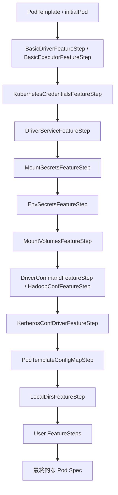

# 第26章 Kubernetes: Pod ライフサイクルとフィーチャーステップ

> 本章で読むソース
>
> - [`resource-managers/kubernetes/core/src/main/scala/org/apache/spark/deploy/k8s/features/KubernetesFeatureConfigStep.scala` L32-L84](https://github.com/apache/spark/blob/v4.1.2/resource-managers/kubernetes/core/src/main/scala/org/apache/spark/deploy/k8s/features/KubernetesFeatureConfigStep.scala#L32-L84)
> - [`resource-managers/kubernetes/core/src/main/scala/org/apache/spark/deploy/k8s/submit/KubernetesDriverBuilder.scala` L35-L110](https://github.com/apache/spark/blob/v4.1.2/resource-managers/kubernetes/core/src/main/scala/org/apache/spark/deploy/k8s/submit/KubernetesDriverBuilder.scala#L35-L110)
> - [`resource-managers/kubernetes/core/src/main/scala/org/apache/spark/scheduler/cluster/k8s/KubernetesExecutorBuilder.scala` L27-L95](https://github.com/apache/spark/blob/v4.1.2/resource-managers/kubernetes/core/src/main/scala/org/apache/spark/scheduler/cluster/k8s/KubernetesExecutorBuilder.scala#L27-L95)
> - [`resource-managers/kubernetes/core/src/main/scala/org/apache/spark/deploy/k8s/features/BasicDriverFeatureStep.scala` L32-L196](https://github.com/apache/spark/blob/v4.1.2/resource-managers/kubernetes/core/src/main/scala/org/apache/spark/deploy/k8s/features/BasicDriverFeatureStep.scala#L32-L196)
> - [`resource-managers/kubernetes/core/src/main/scala/org/apache/spark/deploy/k8s/features/BasicExecutorFeatureStep.scala` L35-L311](https://github.com/apache/spark/blob/v4.1.2/resource-managers/kubernetes/core/src/main/scala/org/apache/spark/deploy/k8s/features/BasicExecutorFeatureStep.scala#L35-L311)
> - [`resource-managers/kubernetes/core/src/main/scala/org/apache/spark/deploy/k8s/features/DriverKubernetesCredentialsFeatureStep.scala` L33-L211](https://github.com/apache/spark/blob/v4.1.2/resource-managers/kubernetes/core/src/main/scala/org/apache/spark/deploy/k8s/features/DriverKubernetesCredentialsFeatureStep.scala#L33-L211)
> - [`resource-managers/kubernetes/core/src/main/scala/org/apache/spark/deploy/k8s/features/KerberosConfDriverFeatureStep.scala` L51-L270](https://github.com/apache/spark/blob/v4.1.2/resource-managers/kubernetes/core/src/main/scala/org/apache/spark/deploy/k8s/features/KerberosConfDriverFeatureStep.scala#L51-L270)
> - [`resource-managers/kubernetes/core/src/main/scala/org/apache/spark/deploy/k8s/KubernetesConf.scala` L37-L335](https://github.com/apache/spark/blob/v4.1.2/resource-managers/kubernetes/core/src/main/scala/org/apache/spark/deploy/k8s/KubernetesConf.scala#L37-L335)
> - [`resource-managers/kubernetes/core/src/main/scala/org/apache/spark/scheduler/cluster/k8s/ExecutorPodsSnapshotsStoreImpl.scala` L62-L172](https://github.com/apache/spark/blob/v4.1.2/resource-managers/kubernetes/core/src/main/scala/org/apache/spark/scheduler/cluster/k8s/ExecutorPodsSnapshotsStoreImpl.scala#L62-L172)

## この章の狙い

Spark on Kubernetes のポッドは、複数のフィーチャーステップを合成して構築される。
本章では、`KubernetesFeatureConfigStep` トレイトを起点に、ビルダーがどのようにポッド仕様を組み立てるか、各ステップがどのような設定を追加するかを追う。
ポッドのライフサイクル管理を支える `ExecutorPodsSnapshotsStore` の内部構造も合わせて解説する。

## 前提

`KubernetesClientApplication` は `KubernetesDriverBuilder` を通じてドライバポッドを作成する（第25章）。
`ExecutorPodsAllocator` は `KubernetesExecutorBuilder` を通じてエグゼキュータポッドを作成する。
どちらのビルダーも `KubernetesFeatureConfigStep` のリストを順に適用する。
ポッドテンプレートファイルを指定すると、それを初期値としてフィーチャーステップが上書きしていく。

## 26.1 KubernetesFeatureConfigStep: 拡張ポイント

`KubernetesFeatureConfigStep` はポッド構築の拡張ポイントとなるトレイトである。

[`resource-managers/kubernetes/core/src/main/scala/org/apache/spark/deploy/k8s/features/KubernetesFeatureConfigStep.scala` L32-L84](https://github.com/apache/spark/blob/v4.1.2/resource-managers/kubernetes/core/src/main/scala/org/apache/spark/deploy/k8s/features/KubernetesFeatureConfigStep.scala#L32-L84)

```scala
@Unstable
@DeveloperApi
trait KubernetesFeatureConfigStep {

  def configurePod(pod: SparkPod): SparkPod

  def getAdditionalPodSystemProperties(): Map[String, String] = Map.empty

  def getAdditionalPreKubernetesResources(): Seq[HasMetadata] = Seq.empty

  def getAdditionalKubernetesResources(): Seq[HasMetadata] = Seq.empty
}
```

4つのメソッドを提供する。

- `configurePod`: ポッドとコンテナの仕様を変更する。必須メソッド。
- `getAdditionalPodSystemProperties`: JVM のシステムプロパティを追加する。
- `getAdditionalPreKubernetesResources`: ポッド作成前に作成するKubernetesリソース（Secret等）。
- `getAdditionalKubernetesResources`: ポッド作成後に作成するKubernetesリソース。

`configurePod` は `SparkPod`（ポッドとコンテナのペア）を受け取り、変更後の `SparkPod` を返す。
元の状態を保持したまま追加の変更を行うのが契約である。

## 26.2 ビルダー: フィーチャーステップの合成

### 26.2.1 KubernetesDriverBuilder

`KubernetesDriverBuilder` はドライバポッドの仕様を構築する。

[`resource-managers/kubernetes/core/src/main/scala/org/apache/spark/deploy/k8s/submit/KubernetesDriverBuilder.scala` L75-L108](https://github.com/apache/spark/blob/v4.1.2/resource-managers/kubernetes/core/src/main/scala/org/apache/spark/deploy/k8s/submit/KubernetesDriverBuilder.scala#L75-L108)

```scala
val allFeatures = Seq(
  new BasicDriverFeatureStep(conf),
  new DriverKubernetesCredentialsFeatureStep(conf),
  new DriverServiceFeatureStep(conf),
  new MountSecretsFeatureStep(conf),
  new EnvSecretsFeatureStep(conf),
  new MountVolumesFeatureStep(conf),
  new DriverCommandFeatureStep(conf),
  new HadoopConfDriverFeatureStep(conf),
  new KerberosConfDriverFeatureStep(conf),
  new PodTemplateConfigMapStep(conf),
  new LocalDirsFeatureStep(conf)) ++ userFeatures

val features = allFeatures.filterNot(f =>
  conf.get(Config.KUBERNETES_DRIVER_POD_EXCLUDED_FEATURE_STEPS).contains(f.getClass.getName))

val spec = KubernetesDriverSpec(
  initialPod,
  driverPreKubernetesResources = Seq.empty,
  driverKubernetesResources = Seq.empty,
  conf.sparkConf.getAll.toMap)

features.foldLeft(spec) { case (spec, feature) =>
  val configuredPod = feature.configurePod(spec.pod)
  val addedSystemProperties = feature.getAdditionalPodSystemProperties()
  val addedPreResources = feature.getAdditionalPreKubernetesResources()
  val addedResources = feature.getAdditionalKubernetesResources()
  KubernetesDriverSpec(
    configuredPod,
    spec.driverPreKubernetesResources ++ addedPreResources,
    spec.driverKubernetesResources ++ addedResources,
    spec.systemProperties ++ addedSystemProperties)
}
```

ビルダーは11個の組み込みフィーチャーステップと、ユーザー定義のステップを順に適用する。
`foldLeft` で初期ポッドから始めて、各ステップが返す `SparkPod` を次のステップに渡す。
`KUBERNETES_DRIVER_POD_EXCLUDED_FEATURE_STEPS` で特定のステップを除外できる。

### 26.2.2 KubernetesExecutorBuilder

`KubernetesExecutorBuilder` も同様のパターンでエグゼキュータポッドを構築する。

[`resource-managers/kubernetes/core/src/main/scala/org/apache/spark/scheduler/cluster/k8s/KubernetesExecutorBuilder.scala` L68-L93](https://github.com/apache/spark/blob/v4.1.2/resource-managers/kubernetes/core/src/main/scala/org/apache/spark/scheduler/cluster/k8s/KubernetesExecutorBuilder.scala#L68-L93)

```scala
val allFeatures = Seq(
  new BasicExecutorFeatureStep(conf, secMgr, resourceProfile),
  new ExecutorKubernetesCredentialsFeatureStep(conf),
  new MountSecretsFeatureStep(conf),
  new EnvSecretsFeatureStep(conf),
  new MountVolumesFeatureStep(conf),
  new HadoopConfExecutorFeatureStep(conf),
  new LocalDirsFeatureStep(conf)) ++ userFeatures

val features = allFeatures.filterNot(f =>
  conf.get(Config.KUBERNETES_EXECUTOR_POD_EXCLUDED_FEATURE_STEPS).contains(f.getClass.getName))

val spec = KubernetesExecutorSpec(
  initialPod,
  executorKubernetesResources = Seq.empty)

features.foldLeft(spec) { case (spec, feature) =>
  val configuredPod = feature.configurePod(spec.pod)
  val addedResources = feature.getAdditionalKubernetesResources()
  KubernetesExecutorSpec(
    configuredPod,
    spec.executorKubernetesResources ++ addedResources)
}
```

エグゼキュータは7個の組み込みステップを持つ。
ドライバと異なり、`DriverServiceFeatureStep` や `DriverCommandFeatureStep` は含まれない。



## 26.3 BasicDriverFeatureStep: ドライバポッドの基盤

`BasicDriverFeatureStep` はドライバポッドの基本的な設定を行う。

[`resource-managers/kubernetes/core/src/main/scala/org/apache/spark/deploy/k8s/features/BasicDriverFeatureStep.scala` L32-L80](https://github.com/apache/spark/blob/v4.1.2/resource-managers/kubernetes/core/src/main/scala/org/apache/spark/deploy/k8s/features/BasicDriverFeatureStep.scala#L32-L80)

```scala
private[spark] class BasicDriverFeatureStep(conf: KubernetesDriverConf)
  extends KubernetesFeatureConfigStep {

  private val driverPodName = conf
    .get(KUBERNETES_DRIVER_POD_NAME)
    .getOrElse(s"${conf.resourceNamePrefix}-driver")

  private val driverContainerImage = conf.image

  private val driverCpuCores = conf.get(DRIVER_CORES)
  private val driverCoresRequest = conf
    .get(KUBERNETES_DRIVER_REQUEST_CORES)
    .getOrElse(driverCpuCores.toString)
  private val driverLimitCores = conf.get(KUBERNETES_DRIVER_LIMIT_CORES)

  private val driverMemoryMiB = conf.get(DRIVER_MEMORY)

  private val defaultOverheadFactor =
    if (conf.mainAppResource.isInstanceOf[NonJVMResource]) {
      if (conf.contains(MEMORY_OVERHEAD_FACTOR)) {
        conf.get(MEMORY_OVERHEAD_FACTOR)
      } else {
        NON_JVM_MEMORY_OVERHEAD_FACTOR
      }
    } else {
      conf.get(MEMORY_OVERHEAD_FACTOR)
    }
```

ドライバのポッド名、コンテナイメージ、CPU/メモリ設定を初期化する。
メモリオーバーヘッドは `MEMORY_OVERHEAD_FACTOR`（デフォルト0.1）に基づいて計算される。

### 26.3.1 configurePod: コンテナとポッドの構築

[`resource-managers/kubernetes/core/src/main/scala/org/apache/spark/deploy/k8s/features/BasicDriverFeatureStep.scala` L81-L163](https://github.com/apache/spark/blob/v4.1.2/resource-managers/kubernetes/core/src/main/scala/org/apache/spark/deploy/k8s/features/BasicDriverFeatureStep.scala#L81-L163)

```scala
override def configurePod(pod: SparkPod): SparkPod = {
  val driverCustomEnvs = KubernetesUtils.buildEnvVars(
    Seq(ENV_APPLICATION_ID -> conf.appId) ++ conf.environment)
  val driverCpuQuantity = new Quantity(driverCoresRequest)
  val driverMemoryQuantity = new Quantity(s"${driverMemoryWithOverheadMiB}Mi")

  val driverContainer = new ContainerBuilder(pod.container)
    .withName(Option(pod.container.getName).getOrElse(DEFAULT_DRIVER_CONTAINER_NAME))
    .withImage(driverContainerImage)
    .withImagePullPolicy(conf.imagePullPolicy)
    .addNewPort()
      .withName(DRIVER_PORT_NAME)
      .withContainerPort(driverPort)
      .withProtocol("TCP")
      .endPort()
    // ... (BlockManager, UI, Spark Connect のポート)
    .editOrNewResources()
      .addToRequests("cpu", driverCpuQuantity)
      .addToLimits(maybeCpuLimitQuantity.toMap.asJava)
      .addToRequests("memory", driverMemoryQuantity)
      .addToLimits("memory", driverMemoryQuantity)
      .addToLimits(driverResourceQuantities.asJava)
      .endResources()
    .build()

  val driverPod = new PodBuilder(pod.pod)
    .editOrNewMetadata()
      .withName(driverPodName)
      .addToLabels(conf.labels.asJava)
      .addToAnnotations(conf.annotations.asJava)
      .endMetadata()
    .editOrNewSpec()
      .withRestartPolicy("Never")
      .addToNodeSelector(conf.nodeSelector.asJava)
      .addToNodeSelector(conf.driverNodeSelector.asJava)
      .addToImagePullSecrets(conf.imagePullSecrets: _*)
      .endSpec()
    .build()

  conf.schedulerName
    .foreach(driverPod.getSpec.setSchedulerName)

  SparkPod(driverPod, driverContainer)
}
```

ドライバコンテナには以下のポートが定義される。

- `driver`: RPC通信ポート（デフォルト7078）
- `blockmanager`: BlockManager用ポート
- `ui`: SparkUI ポート
- `spark-connect`: Spark Connect サーバポート

`restartPolicy` は `Never` に設定される。
ドライバが失敗した場合、Kubernetes が再起動するのではなく、Spark 自身がアプリケーション全体を失敗させる。

### 26.3.2 getAdditionalPodSystemProperties

[`resource-managers/kubernetes/core/src/main/scala/org/apache/spark/deploy/k8s/features/BasicDriverFeatureStep.scala` L165-L196](https://github.com/apache/spark/blob/v4.1.2/resource-managers/kubernetes/core/src/main/scala/org/apache/spark/deploy/k8s/features/BasicDriverFeatureStep.scala#L165-L196)

```scala
override def getAdditionalPodSystemProperties(): Map[String, String] = {
  val additionalProps = mutable.Map(
    KUBERNETES_DRIVER_POD_NAME.key -> driverPodName,
    "spark.app.id" -> conf.appId,
    KUBERNETES_DRIVER_SUBMIT_CHECK.key -> "true",
    MEMORY_OVERHEAD_FACTOR.key -> defaultOverheadFactor.toString)
  Seq(JARS, FILES, ARCHIVES, SUBMIT_PYTHON_FILES).foreach { key =>
    val (localUris, remoteUris) =
      conf.get(key).partition(uri => KubernetesUtils.isLocalAndResolvable(uri))
    val resolved = KubernetesUtils.uploadAndTransformFileUris(value, Some(conf.sparkConf))
    if (resolved.nonEmpty) {
      additionalProps.put(key.key, (resolvedValue ++ remoteUris).mkString(","))
    }
  }
  additionalProps.toMap
}
```

ローカルファイルは Hadoop 互換ファイルシステムにアップロードされ、そのURIがシステムプロパティに設定される。
これにより、ドライバポッド内から依存ファイルにアクセスできる。

## 26.4 BasicExecutorFeatureStep: エグゼキュータポッドの基盤

`BasicExecutorFeatureStep` はエグゼキュータポッドの基本的な設定を行う。

[`resource-managers/kubernetes/core/src/main/scala/org/apache/spark/deploy/k8s/features/BasicExecutorFeatureStep.scala` L35-L107](https://github.com/apache/spark/blob/v4.1.2/resource-managers/kubernetes/core/src/main/scala/org/apache/spark/deploy/k8s/features/BasicExecutorFeatureStep.scala#L35-L107)

```scala
private[spark] class BasicExecutorFeatureStep(
    kubernetesConf: KubernetesExecutorConf,
    secMgr: SecurityManager,
    resourceProfile: ResourceProfile)
  extends KubernetesFeatureConfigStep with Logging {

  private val executorContainerImage = kubernetesConf.image
  private val blockManagerPort = kubernetesConf
    .sparkConf
    .getInt(BLOCK_MANAGER_PORT.key, DEFAULT_BLOCKMANAGER_PORT)

  private val executorPodNamePrefix = kubernetesConf.resourceNamePrefix

  private val driverAddress = if (kubernetesConf.get(KUBERNETES_EXECUTOR_USE_DRIVER_POD_IP)) {
    kubernetesConf.get(DRIVER_BIND_ADDRESS)
  } else {
    kubernetesConf.get(DRIVER_HOST_ADDRESS)
  }
  private val driverUrl = RpcEndpointAddress(
    driverAddress,
    kubernetesConf.sparkConf.getInt(DRIVER_PORT.key, DEFAULT_DRIVER_PORT),
    CoarseGrainedSchedulerBackend.ENDPOINT_NAME).toString

  val execResources = ResourceProfile.getResourcesForClusterManager(
    resourceProfile.id,
    resourceProfile.executorResources,
    minimumMemoryOverhead,
    memoryOverheadFactor,
    kubernetesConf.sparkConf,
    isPythonApp,
    Map.empty)
```

エグゼキュータのポッド名は `{prefix}-exec-{executorId}` の形式で生成される。
ドライバURLは `KUBERNETES_EXECUTOR_USE_DRIVER_POD_IP` が有効な場合、ドライバポッドのIPを直接使用する。

### 26.4.1 configurePod: エグゼキュータコンテナの構築

[`resource-managers/kubernetes/core/src/main/scala/org/apache/spark/deploy/k8s/features/BasicExecutorFeatureStep.scala` L107-L311](https://github.com/apache/spark/blob/v4.1.2/resource-managers/kubernetes/core/src/main/scala/org/apache/spark/deploy/k8s/features/BasicExecutorFeatureStep.scala#L107-L311)

```scala
override def configurePod(pod: SparkPod): SparkPod = {
  val name = s"$executorPodNamePrefix-exec-${kubernetesConf.executorId}"
  // ... (hostname の生成)
  val hostname = name.substring(Math.max(0, name.length - KUBERNETES_DNS_LABEL_NAME_MAX_LENGTH))
    .replaceAll("^[^\\w]+", "")
    .replaceAll("[^\\w-]+", "_")

  val executorMemoryQuantity = new Quantity(s"${execResources.totalMemMiB}Mi")
  val executorCpuQuantity = new Quantity(executorCoresRequest)

  val executorContainer = new ContainerBuilder(pod.container)
    .withName(Option(pod.container.getName).getOrElse(DEFAULT_EXECUTOR_CONTAINER_NAME))
    .withImage(executorContainerImage)
    .withImagePullPolicy(kubernetesConf.imagePullPolicy)
    .editOrNewResources()
      .addToRequests("memory", executorMemoryQuantity)
      .addToLimits("memory", executorMemoryQuantity)
      .addToRequests("cpu", executorCpuQuantity)
      .addToLimits(executorResourceQuantities.asJava)
      .endResources()
    .addAllToEnv(executorEnv.asJava)
    .addToArgs("executor")
    .build()
  // ... (ConfigMap volume, lifecycle, ownerReference の設定)

  val executorPod = new PodBuilder(pod.pod)
    .editOrNewMetadata()
      .withName(name)
      .addToLabels(kubernetesConf.labels.asJava)
      .addToAnnotations(kubernetesConf.annotations.asJava)
      .addToOwnerReferences(ownerReference.toSeq: _*)
      .endMetadata()
    .editOrNewSpec()
      .withHostname(hostname)
      .withRestartPolicy(policy)
      .withTerminationGracePeriodSeconds(
        kubernetesConf.get(KUBERNETES_EXECUTOR_TERMINATION_GRACE_PERIOD_SECONDS))
      .addToNodeSelector(kubernetesConf.nodeSelector.asJava)
      .addToNodeSelector(kubernetesConf.executorNodeSelector.asJava)
    .endSpec()
    .build()
  kubernetesConf.schedulerName
    .foreach(executorPod.getSpec.setSchedulerName)

  SparkPod(executorPod, containerWithLifecycle)
}
```

エグゼキュータポッドの重要な設定は以下の通りである。

- `hostname`: ポッド名から生成（DNS ラベル規則に従い63文字以下）。
- `restartPolicy`: `direct` アロケータでは `Never`、`statefulset` では `Always`。
- `terminationGracePeriodSeconds`: グレースフルシャットダウンの待機時間（デフォルト30秒）。
- `ownerReferences`: ドライバポッドをオーナーとして設定し、ガベージコレクションを有効化。
- `schedulerName`: カスタムスケジューラ名（YuniKorn 等で利用）。

### 26.4.2 Decommission ライフサイクル

エグゼキュータの decommission が有効な場合、`preStop` フックにスクリプトを設定する。

```scala
val containerWithLifecycle =
  if (!kubernetesConf.workerDecommissioning) {
    containerWithLimitCores
  } else {
    new ContainerBuilder(containerWithLimitCores).withNewLifecycle()
      .withNewPreStop()
        .withNewExec()
          .addToCommand(kubernetesConf.get(DECOMMISSION_SCRIPT))
        .endExec()
      .endPreStop()
      .endLifecycle()
      .build()
  }
```

ポッド削除時に Kubernetes が `preStop` フックを呼び出し、グレースフルシャットダウンを行う。
スクリプトのパスは `spark.kubernetes.decommission.script`（デフォルト `/opt/decom.sh`）で設定可能である。

## 26.5 DriverKubernetesCredentialsFeatureStep

`DriverKubernetesCredentialsFeatureStep` はドライバポッドが Kubernetes API にアクセスするための認証情報を設定する。

[`resource-managers/kubernetes/core/src/main/scala/org/apache/spark/deploy/k8s/features/DriverKubernetesCredentialsFeatureStep.scala` L33-L96](https://github.com/apache/spark/blob/v4.1.2/resource-managers/kubernetes/core/src/main/scala/org/apache/spark/deploy/k8s/features/DriverKubernetesCredentialsFeatureStep.scala#L33-L96)

```scala
private[spark] class DriverKubernetesCredentialsFeatureStep(kubernetesConf: KubernetesConf)
  extends KubernetesFeatureConfigStep {

  private val oauthTokenBase64 = kubernetesConf
    .getOption(s"$KUBERNETES_AUTH_DRIVER_CONF_PREFIX.$OAUTH_TOKEN_CONF_SUFFIX")
    .map { token =>
      Base64.getEncoder().encodeToString(token.getBytes(StandardCharsets.UTF_8))
    }

  private val shouldMountSecret = oauthTokenBase64.isDefined ||
    caCertDataBase64.isDefined ||
    clientKeyDataBase64.isDefined ||
    clientCertDataBase64.isDefined

  override def configurePod(pod: SparkPod): SparkPod = {
    if (!shouldMountSecret) {
      pod.copy(pod = buildPodWithServiceAccount(driverServiceAccount, pod).getOrElse(pod.pod))
    } else {
      val driverPodWithMountedKubernetesCredentials =
        new PodBuilder(pod.pod)
          .editOrNewSpec()
            .addNewVolume()
              .withName(DRIVER_CREDENTIALS_SECRET_VOLUME_NAME)
              .withNewSecret().withSecretName(driverCredentialsSecretName).endSecret()
              .endVolume()
            .endSpec()
          .build()
      // ... (コンテナへのボリュームマウント)
      SparkPod(driverPodWithMountedKubernetesCredentials, driverContainerWithMountedSecretVolume)
    }
  }
```

認証情報の設定方法は2通りある。

1. **Service Account**: Secret 不要な場合、Service Account をポッドに設定する。
2. **Secret マウント**: OAuth トークン、CA 証明書、クライアント証明書/鍵を Secret として作成し、ポッドにマウントする。

Secret は `getAdditionalPreKubernetesResources` でポッド作成前に作成される。

## 26.6 KerberosConfDriverFeatureStep

`KerberosConfDriverFeatureStep` は Kerberos 認証の設定を行う。

[`resource-managers/kubernetes/core/src/main/scala/org/apache/spark/deploy/k8s/features/KerberosConfDriverFeatureStep.scala` L51-L84](https://github.com/apache/spark/blob/v4.1.2/resource-managers/kubernetes/core/src/main/scala/org/apache/spark/deploy/k8s/features/KerberosConfDriverFeatureStep.scala#L51-L84)

```scala
private[spark] class KerberosConfDriverFeatureStep(kubernetesConf: KubernetesDriverConf)
  extends KubernetesFeatureConfigStep with Logging {

  private val principal = kubernetesConf.get(org.apache.spark.internal.config.PRINCIPAL)
  private val keytab = kubernetesConf.get(org.apache.spark.internal.config.KEYTAB)
  private val existingSecretName = kubernetesConf.get(KUBERNETES_KERBEROS_DT_SECRET_NAME)
  private val existingSecretItemKey = kubernetesConf.get(KUBERNETES_KERBEROS_DT_SECRET_ITEM_KEY)
  private val krb5File = kubernetesConf.get(KUBERNETES_KERBEROS_KRB5_FILE)
  private val krb5CMap = kubernetesConf.get(KUBERNETES_KERBEROS_KRB5_CONFIG_MAP)
```

3つのユースケースをサポートする。

1. **Keytab**: ローカルのキーテーブルを Secret としてアップロードし、ドライバにマウントする。
2. **Existing tokens**: 既存の委任トークンが含まれる Secret をマウントする。
3. **TGT only**: ローカルのTGTから委任トークンを生成し、Secret としてマウントする。

`krb5.conf` は ConfigMap 経由でポッドにマウントされる。

## 26.7 KubernetesConf: ポッド構築のためのメタデータ

`KubernetesConf` はポッド構築に必要なメタデータを集約する抽象クラスである。

[`resource-managers/kubernetes/core/src/main/scala/org/apache/spark/deploy/k8s/KubernetesConf.scala` L37-L79](https://github.com/apache/spark/blob/v4.1.2/resource-managers/kubernetes/core/src/main/scala/org/apache/spark/deploy/k8s/KubernetesConf.scala#L37-L79)

```scala
private[spark] abstract class KubernetesConf(val sparkConf: SparkConf) {
  val resourceNamePrefix: String
  def labels: Map[String, String]
  def environment: Map[String, String]
  def annotations: Map[String, String]
  def secretEnvNamesToKeyRefs: Map[String, String]
  def secretNamesToMountPaths: Map[String, String]
  def volumes: Seq[KubernetesVolumeSpec]
  def schedulerName: Option[String]
  def appId: String
  def image: String
  def namespace: String = get(KUBERNETES_NAMESPACE)
  def imagePullPolicy: String = get(CONTAINER_IMAGE_PULL_POLICY)
  def workerDecommissioning: Boolean =
    sparkConf.get(org.apache.spark.internal.config.DECOMMISSION_ENABLED)
  def nodeSelector: Map[String, String] =
    KubernetesUtils.parsePrefixedKeyValuePairs(sparkConf, KUBERNETES_NODE_SELECTOR_PREFIX)
}
```

2つの具象クラスがある。

- `KubernetesDriverConf`: ドライバ固有の設定（サービス名、ノードセレクタ等）。
- `KubernetesExecutorConf`: エグゼキュータ固有の設定（エグゼキュータID、リソースプロファイルID等）。

### 26.7.1 ラベルとアノテーション

ラベルとアノテーションはプレフィックス付きの設定から生成される。

[`resource-managers/kubernetes/core/src/main/scala/org/apache/spark/deploy/k8s/KubernetesConf.scala` L200-L220](https://github.com/apache/spark/blob/v4.1.2/resource-managers/kubernetes/core/src/main/scala/org/apache/spark/deploy/k8s/KubernetesConf.scala#L200-L220)

```scala
override def labels: Map[String, String] = {
  val presetLabels = Map(
    SPARK_VERSION_LABEL -> SPARK_VERSION,
    SPARK_EXECUTOR_ID_LABEL -> executorId,
    SPARK_APP_ID_LABEL -> appId,
    SPARK_APP_NAME_LABEL -> KubernetesConf.getAppNameLabel(appName),
    SPARK_ROLE_LABEL -> SPARK_POD_EXECUTOR_ROLE,
    SPARK_RESOURCE_PROFILE_ID_LABEL -> resourceProfileId.toString)

  val executorCustomLabels =
    KubernetesUtils.parsePrefixedKeyValuePairs(sparkConf, KUBERNETES_EXECUTOR_LABEL_PREFIX)
      .map { case(k, v) => (k, Utils.substituteAppNExecIds(v, appId, executorId)) }

  presetLabels.keys.foreach { key =>
    require(
      !executorCustomLabels.contains(key),
      s"Custom executor labels cannot contain $key as it is reserved for Spark.")
  }

  executorCustomLabels ++ presetLabels
}
```

予約済みラベル（`spark-version`, `spark-app-selector`, `spark-executor-id` 等）をユーザーが上書きできないよう検証する。
`{{APP_ID}}` や `{{EXECUTOR_ID}}` のプレースホルダは実際の値に置換される。

## 26.8 ExecutorPodsSnapshotsStoreImpl: 状態伝播のハブ

`ExecutorPodsSnapshotsStoreImpl` はプロデューサとコンシューマを接続するハブである。

[`resource-managers/kubernetes/core/src/main/scala/org/apache/spark/scheduler/cluster/k8s/ExecutorPodsSnapshotsStoreImpl.scala` L62-L117](https://github.com/apache/spark/blob/v4.1.2/resource-managers/kubernetes/core/src/main/scala/org/apache/spark/scheduler/cluster/k8s/ExecutorPodsSnapshotsStoreImpl.scala#L62-L117)

```scala
private[spark] class ExecutorPodsSnapshotsStoreImpl(
    subscribersExecutor: ScheduledExecutorService,
    clock: Clock = new SystemClock,
    conf: SparkConf = SparkContext.getActive.get.conf)
  extends ExecutorPodsSnapshotsStore with Logging {

  private val SNAPSHOT_LOCK = new Object()
  private val subscribers = new CopyOnWriteArrayList[SnapshotsSubscriber]()

  @GuardedBy("SNAPSHOT_LOCK")
  private var currentSnapshot = ExecutorPodsSnapshot()

  override def updatePod(updatedPod: Pod): Unit = SNAPSHOT_LOCK.synchronized {
    currentSnapshot = currentSnapshot.withUpdate(updatedPod)
    addCurrentSnapshotToSubscribers()
  }

  override def replaceSnapshot(newSnapshot: Seq[Pod]): Unit = SNAPSHOT_LOCK.synchronized {
    currentSnapshot = ExecutorPodsSnapshot(newSnapshot, clock.getTimeMillis())
    addCurrentSnapshotToSubscribers()
  }
```

2つの更新方法がある。

- `updatePod`: 単一ポッドの増分更新。`currentSnapshot` にマージする。
- `replaceSnapshot`: 全ポッドの一括置換。ポーリング結果の同期に使う。

### 26.8.1 購読者の処理

各購読者は `LinkedBlockingQueue` でスナップショットのバッファを持つ。

[`resource-managers/kubernetes/core/src/main/scala/org/apache/spark/scheduler/cluster/k8s/ExecutorPodsSnapshotsStoreImpl.scala` L119-L172](https://github.com/apache/spark/blob/v4.1.2/resource-managers/kubernetes/core/src/main/scala/org/apache/spark/scheduler/cluster/k8s/ExecutorPodsSnapshotsStoreImpl.scala#L119-L172)

```scala
private class SnapshotsSubscriber(onNewSnapshots: Seq[ExecutorPodsSnapshot] => Unit) {

  private val snapshotsBuffer = new LinkedBlockingQueue[ExecutorPodsSnapshot]()
  private val lock = new ReentrantLock()
  private val notificationCount = new AtomicInteger()

  def addCurrentSnapshot(): Unit = {
    snapshotsBuffer.add(currentSnapshot)
  }

  def processSnapshots(): Unit = {
    notificationCount.incrementAndGet()
    processSnapshotsInternal()
  }

  private def processSnapshotsInternal(): Unit = {
    if (lock.tryLock()) {
      if (notificationCount.get() > 0) {
        try {
          val snapshots = new ArrayList[ExecutorPodsSnapshot]()
          snapshotsBuffer.drainTo(snapshots)
          onNewSnapshots(snapshots.asScala.toSeq)
        } catch {
          case e: IllegalArgumentException =>
            logError("Going to stop due to IllegalArgumentException", e)
            System.exit(1)
          case NonFatal(e) => logWarning("Exception when notifying snapshot subscriber.", e)
        } finally {
          lock.unlock()
        }
        if (notificationCount.decrementAndGet() > 0) {
          subscribersExecutor.submit(new Runnable() {
            override def run(): Unit = processSnapshotsInternal()
          })
        }
      } else {
        lock.unlock()
      }
    }
  }
}
```

`processBatchIntervalMillis` ごとに `processSnapshots` が呼ばれる。
`drainTo` でバッファ内の全スナップショットを一括取得し、コールバックに渡す。
`ReentrantLock` で並行処理を制御し、処理中の重複実行を防ぐ。
処理中に新しい通知が来た場合、処理完了後に再スケジュールする。

## 26.9 高速化の工夫: スナップショットのバッチ処理

`ExecutorPodsSnapshotsStoreImpl` の設計は、Kubernetes API イベントの高頻度更新を効率的に処理するために最適化されている。

`LinkedBlockingQueue` と `drainTo` により、複数の更新を1回のコールバックでまとめて処理する。
これにより、コールバック（`ExecutorPodsAllocator.onNewSnapshots` や `ExecutorPodsLifecycleManager.onNewSnapshots`）の呼び出し回数を削減する。

なぜ速いのか: Watch イベントが連続しても、購読者の処理間隔でバッチ化されるため、API サーバへの負荷とコールバックのオーバーヘッドを抑制できる。
`notificationCount` のアトミックカウンタで、処理漏れを防ぎつつロック競合を最小化する。

## まとめ

本章ではフィーチャーステップのパターンとポッド構築の流れを追った。

- `KubernetesFeatureConfigStep` はポッド構築の拡張ポイントである。
- ビルダーは11個（ドライバ）/7個（エグゼキュータ）の組み込みステップを順に適用する。
- `BasicDriverFeatureStep` はコンテナイメージ、リソース、ポートを設定する。
- `BasicExecutorFeatureStep` はポッド名、ホスト名、オーナーリファレンス、decommission ライフサイクルを設定する。
- `DriverKubernetesCredentialsFeatureStep` は認証情報の Secret マウントまたは Service Account を設定する。
- `KerberosConfDriverFeatureStep` は Kerberos 認証の3モードをサポートする。
- `KubernetesConf` はラベル、アノテーション、ノードセレクタ等のメタデータを集約する。
- `ExecutorPodsSnapshotsStoreImpl` はプロデューサとコンシューマをバッチ処理で接続する。

## 関連する章

- 第25章: Spark on K8s アーキテクチャ
- 第27章: YuniKorn 連携（カスタムスケジューラの設定）
- 第8章: スケジューラバックエンドとクラスタマネージャインタフェース
