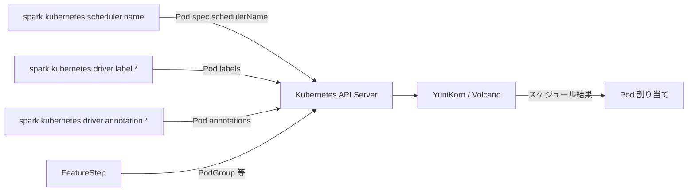

# 第27章 Kubernetes: YuniKorn 連携

> 本章で読むソース
>
> - [`resource-managers/kubernetes/core/src/main/scala/org/apache/spark/deploy/k8s/Config.scala` L325-L347](https://github.com/apache/spark/blob/v4.1.2/resource-managers/kubernetes/core/src/main/scala/org/apache/spark/deploy/k8s/Config.scala#L325-L347)
> - [`resource-managers/kubernetes/core/src/main/scala/org/apache/spark/deploy/k8s/KubernetesConf.scala` L173-L175](https://github.com/apache/spark/blob/v4.1.2/resource-managers/kubernetes/core/src/main/scala/org/apache/spark/deploy/k8s/KubernetesConf.scala#L173-L175)
> - [`resource-managers/kubernetes/core/src/main/scala/org/apache/spark/deploy/k8s/KubernetesConf.scala` L242-L244](https://github.com/apache/spark/blob/v4.1.2/resource-managers/kubernetes/core/src/main/scala/org/apache/spark/deploy/k8s/KubernetesConf.scala#L242-L244)
> - [`resource-managers/kubernetes/core/src/main/scala/org/apache/spark/deploy/k8s/features/BasicDriverFeatureStep.scala` L159-L160](https://github.com/apache/spark/blob/v4.1.2/resource-managers/kubernetes/core/src/main/scala/org/apache/spark/deploy/k8s/features/BasicDriverFeatureStep.scala#L159-L160)
> - [`resource-managers/kubernetes/core/src/main/scala/org/apache/spark/deploy/k8s/features/BasicExecutorFeatureStep.scala` L306-L307](https://github.com/apache/spark/blob/v4.1.2/resource-managers/kubernetes/core/src/main/scala/org/apache/spark/deploy/k8s/features/BasicExecutorFeatureStep.scala#L306-L307)
> - [`resource-managers/kubernetes/core/src/main/scala/org/apache/spark/deploy/k8s/features/KubernetesFeatureConfigStep.scala` L32-L84](https://github.com/apache/spark/blob/v4.1.2/resource-managers/kubernetes/core/src/main/scala/org/apache/spark/deploy/k8s/features/KubernetesFeatureConfigStep.scala#L32-L84)
> - [`resource-managers/kubernetes/core/src/main/scala/org/apache/spark/deploy/k8s/submit/KubernetesDriverBuilder.scala` L51-L86](https://github.com/apache/spark/blob/v4.1.2/resource-managers/kubernetes/core/src/main/scala/org/apache/spark/deploy/k8s/submit/KubernetesDriverBuilder.scala#L51-L86)
> - [`resource-managers/kubernetes/core/volcano/src/main/scala/org/apache/spark/deploy/k8s/features/VolcanoFeatureStep.scala` L26-L78](https://github.com/apache/spark/blob/v4.1.2/resource-managers/kubernetes/core/volcano/src/main/scala/org/apache/spark/deploy/k8s/features/VolcanoFeatureStep.scala#L26-L78)
> - [`resource-managers/kubernetes/integration-tests/src/test/scala/org/apache/spark/deploy/k8s/integrationtest/YuniKornSuite.scala` L20-L32](https://github.com/apache/spark/blob/v4.1.2/resource-managers/kubernetes/integration-tests/src/test/scala/org/apache/spark/deploy/k8s/integrationtest/YuniKornSuite.scala#L20-L32)

## この章の狙い

Apache Spark は Kubernetes 上で YuniKorn や Volcano といったサードパーティのバッチスケジューラと連携できる。
本章では Spark 側がこれらのスケジューラに対してどのような情報をポッドに埋め込むかに焦点を当てる。
YuniKorn 側の内部実装には立ち入らない。

## 前提

Kubernetes のデフォルトスケジューラはポッドを個別にスケジュールする。
Spark のようにドライバと複数のエグゼキュータを同時に確保したいワークロードでは、ギャングスケジューリング（全ポッドの同時割り当て）やキューベースのリソース管理が必要になる。
YuniKorn と Volcano はこの要件を満たすKubernetes向けバッチスケジューラである。

Spark はポッドの `schedulerName`、ラベル、アノテーションを通じてスケジューラに指示を出す。
フィーチャーステップの拡張機構（第26章）を使い、ユーザー独自のステップを追加することもできる。

## 27.1 schedulerName: スケジューラの指定

`KubernetesConf` は `schedulerName` を提供する。

[`resource-managers/kubernetes/core/src/main/scala/org/apache/spark/deploy/k8s/Config.scala` L325-L347](https://github.com/apache/spark/blob/v4.1.2/resource-managers/kubernetes/core/src/main/scala/org/apache/spark/deploy/k8s/Config.scala#L325-L347)

```scala
val KUBERNETES_EXECUTOR_SCHEDULER_NAME =
  ConfigBuilder("spark.kubernetes.executor.scheduler.name")
    .doc("Specify the scheduler name for each executor pod")
    .version("3.0.0")
    .stringConf
    .createOptional

val KUBERNETES_DRIVER_SCHEDULER_NAME =
  ConfigBuilder("spark.kubernetes.driver.scheduler.name")
    .doc("Specify the scheduler name for driver pod")
    .version("3.3.0")
    .stringConf
    .createOptional

val KUBERNETES_SCHEDULER_NAME =
  ConfigBuilder("spark.kubernetes.scheduler.name")
    .doc("Specify the scheduler name for driver and executor pods. If " +
      s"`${KUBERNETES_DRIVER_SCHEDULER_NAME.key}` or " +
      s"`${KUBERNETES_EXECUTOR_SCHEDULER_NAME.key}` is set, will override this.")
    .version("3.3.0")
    .stringConf
    .createOptional
```

3段階の設定優先度がある。

1. `spark.kubernetes.driver.scheduler.name` / `spark.kubernetes.executor.scheduler.name`: 個別指定。
2. `spark.kubernetes.scheduler.name`: 共通指定。
3. 未設定: デフォルトスケジューラを使用。

### 27.1.1 スケジューラ名のポッドへの埋め込み

`BasicDriverFeatureStep` と `BasicExecutorFeatureStep` は `schedulerName` をポッドに設定する。

[`resource-managers/kubernetes/core/src/main/scala/org/apache/spark/deploy/k8s/features/BasicDriverFeatureStep.scala` L159-L160](https://github.com/apache/spark/blob/v4.1.2/resource-managers/kubernetes/core/src/main/scala/org/apache/spark/deploy/k8s/features/BasicDriverFeatureStep.scala#L159-L160)

```scala
conf.schedulerName
  .foreach(driverPod.getSpec.setSchedulerName)
```

[`resource-managers/kubernetes/core/src/main/scala/org/apache/spark/deploy/k8s/features/BasicExecutorFeatureStep.scala` L306-L307](https://github.com/apache/spark/blob/v4.1.2/resource-managers/kubernetes/core/src/main/scala/org/apache/spark/deploy/k8s/features/BasicExecutorFeatureStep.scala#L306-L307)

```scala
kubernetesConf.schedulerName
  .foreach(executorPod.getSpec.setSchedulerName)
```

`schedulerName` が設定されると、Kubernetes はその名前で登録されたスケジューラがポッドをスケジュールする。
YuniKorn の場合、`yunikorn` を指定する。

`KubernetesDriverConf` と `KubernetesExecutorConf` の `schedulerName` メソッドは、個別設定を優先してフォールバックする。

[`resource-managers/kubernetes/core/src/main/scala/org/apache/spark/deploy/k8s/KubernetesConf.scala` L173-L175](https://github.com/apache/spark/blob/v4.1.2/resource-managers/kubernetes/core/src/main/scala/org/apache/spark/deploy/k8s/KubernetesConf.scala#L173-L175)

```scala
override def schedulerName: Option[String] = {
  Option(get(KUBERNETES_DRIVER_SCHEDULER_NAME).getOrElse(get(KUBERNETES_SCHEDULER_NAME).orNull))
}
```

[`resource-managers/kubernetes/core/src/main/scala/org/apache/spark/deploy/k8s/KubernetesConf.scala` L242-L244](https://github.com/apache/spark/blob/v4.1.2/resource-managers/kubernetes/core/src/main/scala/org/apache/spark/deploy/k8s/KubernetesConf.scala#L242-L244)

```scala
override def schedulerName: Option[String] = {
  Option(get(KUBERNETES_EXECUTOR_SCHEDULER_NAME).getOrElse(get(KUBERNETES_SCHEDULER_NAME).orNull))
}
```

## 27.2 ラベルとアノテーション: YuniKorn への指示

YuniKorn はポッドのラベルとアノテーションを通じて設定を受け取る。
Spark は `spark.kubernetes.{driver|executor}.label.` と `spark.kubernetes.{driver|executor}.annotation.` プレフィックスの設定をポッドに埋め込む（第26章）。

### 27.2.1 YuniKorn 統合テストの設定

`YuniKornSuite` の設定から、YuniKorn 連携に必要なラベルとアノテーションがわかる。

[`resource-managers/kubernetes/integration-tests/src/test/scala/org/apache/spark/deploy/k8s/integrationtest/YuniKornSuite.scala` L20-L32](https://github.com/apache/spark/blob/v4.1.2/resource-managers/kubernetes/integration-tests/src/test/scala/org/apache/spark/deploy/k8s/integrationtest/YuniKornSuite.scala#L20-L32)

```scala
@YuniKornTag
class YuniKornSuite extends KubernetesSuite {

  override protected def setUpTest(): Unit = {
    super.setUpTest()
    val namespace = sparkAppConf.get("spark.kubernetes.namespace")
    sparkAppConf
      .set("spark.kubernetes.scheduler.name", "yunikorn")
      .set("spark.kubernetes.driver.label.queue", "root." + namespace)
      .set("spark.kubernetes.executor.label.queue", "root." + namespace)
      .set("spark.kubernetes.driver.annotation.yunikorn.apache.org/app-id", "{{APP_ID}}")
      .set("spark.kubernetes.executor.annotation.yunikorn.apache.org/app-id", "{{APP_ID}}")
  }
}
```

YuniKorn 連携には以下の5つの設定が必要である。

| 設定 | 役割 |
|---|---|
| `spark.kubernetes.scheduler.name` = `yunikorn` | YuniKorn をスケジューラとして指定 |
| `spark.kubernetes.driver.label.queue` | ドライバのキュー（`root.{namespace}`） |
| `spark.kubernetes.executor.label.queue` | エグゼキュータのキュー |
| `spark.kubernetes.driver.annotation.yunikorn.apache.org/app-id` | アプリケーションID |
| `spark.kubernetes.executor.annotation.yunikorn.apache.org/app-id` | アプリケーションID |

`{{APP_ID}}` はプレースホルダであり、実行時に実際のアプリケーションIDに置換される。

### 27.2.2 プレースホルダの置換

`KubernetesConf` のラベルとアノテーションの生成では、`Utils.substituteAppNExecIds` が呼ばれる。

[`resource-managers/kubernetes/core/src/main/scala/org/apache/spark/deploy/k8s/KubernetesConf.scala` L225-L228](https://github.com/apache/spark/blob/v4.1.2/resource-managers/kubernetes/core/src/main/scala/org/apache/spark/deploy/k8s/KubernetesConf.scala#L225-L228)

```scala
override def annotations: Map[String, String] = {
  KubernetesUtils.parsePrefixedKeyValuePairs(sparkConf, KUBERNETES_EXECUTOR_ANNOTATION_PREFIX)
    .map { case(k, v) => (k, Utils.substituteAppNExecIds(v, appId, executorId)) }
}
```

`Utils.substituteAppNExecIds` は `{{APP_ID}}` を実際のアプリケーションIDに、`{{EXECUTOR_ID}}` をエグゼキュータIDに置換する。
これにより、同一の設定テンプレートを全エグゼキュータで共有しつつ、各ポッドに固有のIDを付与できる。

## 27.3 Volcano: PodGroup を使ったギャングスケジューリング

Volcano は Kubernetes 向けのバッチスケジューラであり、PodGroup リソースを使ってギャングスケジューリングを実現する。
Spark は `VolcanoFeatureStep` を通じて Volcano と連携する。

### 27.3.1 VolcanoFeatureStep の実装

[`resource-managers/kubernetes/core/volcano/src/main/scala/org/apache/spark/deploy/k8s/features/VolcanoFeatureStep.scala` L26-L78](https://github.com/apache/spark/blob/v4.1.2/resource-managers/kubernetes/core/volcano/src/main/scala/org/apache/spark/deploy/k8s/features/VolcanoFeatureStep.scala#L26-L78)

```scala
private[spark] class VolcanoFeatureStep extends KubernetesDriverCustomFeatureConfigStep
  with KubernetesExecutorCustomFeatureConfigStep with Logging {
  import VolcanoFeatureStep._

  private var kubernetesConf: KubernetesConf = _

  private lazy val podGroupName = s"${kubernetesConf.appId}-podgroup"
  private lazy val namespace = kubernetesConf.namespace

  override def init(config: KubernetesDriverConf): Unit = {
    kubernetesConf = config
  }

  override def init(config: KubernetesExecutorConf): Unit = {
    kubernetesConf = config
  }

  override def getAdditionalPreKubernetesResources(): Seq[HasMetadata] = {
    if (kubernetesConf.isInstanceOf[KubernetesExecutorConf]) {
      logWarning("VolcanoFeatureStep#getAdditionalPreKubernetesResources() is not supported " +
        "for executor.")
      return Seq.empty
    }
    lazy val client = new DefaultVolcanoClient
    val template = kubernetesConf.getOption(POD_GROUP_TEMPLATE_FILE_KEY)
    val pg = template.map(client.podGroups.load(_).item).getOrElse(new PodGroup())
    var metadata = pg.getMetadata
    if (metadata == null) metadata = new ObjectMeta
    metadata.setName(podGroupName)
    metadata.setNamespace(namespace)
    pg.setMetadata(metadata)

    var spec = pg.getSpec
    if (spec == null) spec = new PodGroupSpec
    pg.setSpec(spec)

    Seq(pg)
  }

  override def configurePod(pod: SparkPod): SparkPod = {
    val k8sPodBuilder = new PodBuilder(pod.pod)
      .editMetadata()
        .addToAnnotations(POD_GROUP_ANNOTATION, podGroupName)
      .endMetadata()
    val k8sPod = k8sPodBuilder.build()
    SparkPod(k8sPod, pod.container)
  }
}

private[spark] object VolcanoFeatureStep {
  val POD_GROUP_ANNOTATION = "scheduling.k8s.io/group-name"
  val POD_GROUP_TEMPLATE_FILE_KEY = "spark.kubernetes.scheduler.volcano.podGroupTemplateFile"
}
```

`VolcanoFeatureStep` は `KubernetesDriverCustomFeatureConfigStep` と `KubernetesExecutorCustomFeatureConfigStep` の両方を実装する。
これはドライバとエグゼキュータの両方で利用可能であることを意味する。

処理は2段階である。

1. **PodGroup の作成**: `getAdditionalPreKubernetesResources` で PodGroup リソースを生成する。ドライバポッド作成前に Kubernetes API に送信される。テンプレートファイル（`spark.kubernetes.scheduler.volcano.podGroupTemplateFile`）でカスタマイズ可能。
2. **アノテーションの付与**: `configurePod` で `scheduling.k8s.io/group-name` アノテーションをポッドに追加する。Volcano はこのアノテーションを見てポッドを PodGroup に所属させる。

### 27.3.2 Volcano の有効化

Volcano を使うには以下の設定が必要である。

```properties
spark.kubernetes.scheduler.name=volcano
spark.kubernetes.driver.pod.featureSteps=org.apache.spark.deploy.k8s.features.VolcanoFeatureStep
spark.kubernetes.executor.pod.featureSteps=org.apache.spark.deploy.k8s.features.VolcanoFeatureStep
```

フィーチャーステップのクラス名をカンマ区切りで指定する（第26章）。
`KubernetesDriverBuilder` と `KubernetesExecutorBuilder` はユーザー定義ステップをビルトインステップの後に適用する。

## 27.4 YuniKorn と Volcano の使い分け

YuniKorn と Volcano は、Spark 側から見た連携パターンが同じである。

| 項目 | YuniKorn | Volcano |
|---|---|---|
| 有効化方法 | `scheduler.name` とラベル/アノテーション | フィーチャーステップの指定 |
| Pod 側の設定 | `queue` ラベル、`app-id` アノテーション | `scheduling.k8s.io/group-name` アノテーション |
| PodGroup/リソース | YuniKorn が内部管理 | Spark が PodGroup を作成 |
| カスタマイズ | ラベル/アノテーションで柔軟に設定 | テンプレートファイルで PodGroup を定義 |

YuniKorn は Spark 側の変更を必要としない。
ラベルとアノテーションを設定するだけで、YuniKorn がキューの割り当てとギャングスケジューリングを担当する。

Volcano は PodGroup リソースを Spark が能動的に作成するため、より明示的な制御が可能である。

## 27.5 カスタムフィーチャーステップによる拡張

ユーザーが独自のスケジューラ連携を実装する場合、`KubernetesFeatureConfigStep` を実装する。

[`resource-managers/kubernetes/core/src/main/scala/org/apache/spark/deploy/k8s/features/KubernetesFeatureConfigStep.scala` L32-L84](https://github.com/apache/spark/blob/v4.1.2/resource-managers/kubernetes/core/src/main/scala/org/apache/spark/deploy/k8s/features/KubernetesFeatureConfigStep.scala#L32-L84)

```scala
@Unstable
@DeveloperApi
trait KubernetesFeatureConfigStep {

  def configurePod(pod: SparkPod): SparkPod

  def getAdditionalPodSystemProperties(): Map[String, String] = Map.empty

  def getAdditionalPreKubernetesResources(): Seq[HasMetadata] = Seq.empty

  def getAdditionalKubernetesResources(): Seq[HasMetadata] = Seq.empty
}
```

スケジューラ固有のカスタムステップを作成する場合、以下のいずれかのパターンを選ぶ。

- `KubernetesFeatureConfigStep`: 設定不要のシンプルなステップ。
- `KubernetesDriverCustomFeatureConfigStep`: ドライバ固有で `KubernetesDriverConf` にアクセス可能。
- `KubernetesExecutorCustomFeatureConfigStep`: エグゼキュータ固有で `KubernetesExecutorConf` にアクセス可能。



## 27.6 高速化の工夫: アノテーションによるスケジューリングヒント

YuniKorn と Volcano の連携パターンは、Spark 側がスケジューリングに必要な情報をポッドのメタデータに埋め込むだけである。
Spark はスケジューラの内部ロジックに依存せず、Kubernetes の標準的な拡張ポイント（`schedulerName`、ラベル、アノテーション）を使う。

なぜ速いのか: Spark がスケジューラ固有のAPIを直接呼び出す必要がないため、追加のネットワーク往復が発生しない。
ポッド作成時にメタデータが一緒に送信されるため、スケジューラはポッドのバインディング前にすべての情報を取得できる。

加えて、`{{APP_ID}}` プレースホルダの置換はクライアント側で完結するため、実行時のオーバーヘッドはゼロである。

## まとめ

本章では Spark の YuniKorn/Volcano 連携の Spark 側の実装を追った。

- `spark.kubernetes.scheduler.name` でカスタムスケジューラを指定する。
- ラベルとアノテーションでキューやアプリケーションIDをポッドに埋め込む。
- `{{APP_ID}}` プレースホルダは実行時に実際の値に置換される。
- `VolcanoFeatureStep` は PodGroup を作成し、アノテーションでポッドを紐付ける。
- YuniKorn は設定のみで連携可能、Volcano はフィーチャーステップで能動的にリソースを作成する。
- `KubernetesFeatureConfigStep` で独自のスケジューラ連携を実装できる。

## 関連する章

- 第25章: Spark on K8s アーキテクチャ
- 第26章: Pod ライフサイクルとフィーチャーステップ
- 第8章: スケジューラバックエンドとクラスタマネージャインタフェース
