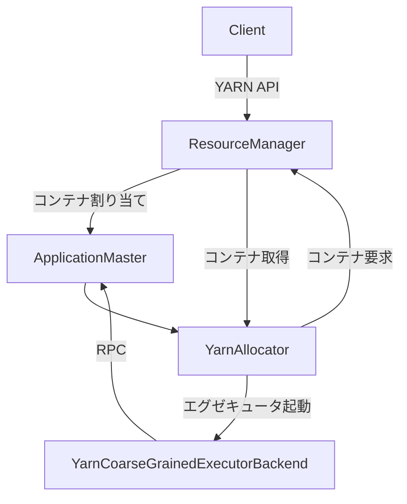

# 第28章 YARN 連携の概要

> 本章で読むソース
>
> - [`resource-managers/yarn/src/main/scala/org/apache/spark/deploy/yarn/Client.scala` L66-L76](https://github.com/apache/spark/blob/v4.1.2/resource-managers/yarn/src/main/scala/org/apache/spark/deploy/yarn/Client.scala#L66-L76)
> - [`resource-managers/yarn/src/main/scala/org/apache/spark/deploy/yarn/ApplicationMaster.scala` L58-L78](https://github.com/apache/spark/blob/v4.1.2/resource-managers/yarn/src/main/scala/org/apache/spark/deploy/yarn/ApplicationMaster.scala#L58-L78)
> - [`resource-managers/yarn/src/main/scala/org/apache/spark/scheduler/cluster/YarnSchedulerBackend.scala` L46-L68](https://github.com/apache/spark/blob/v4.1.2/resource-managers/yarn/src/main/scala/org/apache/spark/scheduler/cluster/YarnSchedulerBackend.scala#L46-L68)
> - [`resource-managers/yarn/src/main/scala/org/apache/spark/scheduler/cluster/YarnClusterSchedulerBackend.scala` L25-L50](https://github.com/apache/spark/blob/v4.1.2/resource-managers/yarn/src/main/scala/org/apache/spark/scheduler/cluster/YarnClusterSchedulerBackend.scala#L25-L50)
> - [`resource-managers/yarn/src/main/scala/org/apache/spark/deploy/yarn/YarnAllocator.scala` L67-L88](https://github.com/apache/spark/blob/v4.1.2/resource-managers/yarn/src/main/scala/org/apache/spark/deploy/yarn/YarnAllocator.scala#L67-L88)
> - [`resource-managers/yarn/src/main/scala/org/apache/spark/executor/YarnCoarseGrainedExecutorBackend.scala` L36-L88](https://github.com/apache/spark/blob/v4.1.2/resource-managers/yarn/src/main/scala/org/apache/spark/executor/YarnCoarseGrainedExecutorBackend.scala#L36-L88)

## この章の狙い

YARN は Hadoop エコシステムのリソースマネージャであり、Spark が最も長く連携してきたクラスタマネージャである。
本章では YARN 連携の全体像と、Kubernetes 連携との対応関係を概観する。

## 前提

Spark のスケジューラバックエンドは `ExternalClusterManager` で切り替わる（第8章）。
YARN の場合、ドライバは `ApplicationMaster` として YARN コンテナ内で動作し、`YarnAllocator` 経由でエグゼキュータコンテナを要求する。

## 28.1 コンポーネントの対応関係

| 役割 | Kubernetes | YARN |
|---|---|---|
| アプリケーション送信 | `KubernetesClientApplication` | `Client` |
| ドライバのホスト | ドライバポッド | `ApplicationMaster` |
| スケジューラバックエンド | `KubernetesClusterSchedulerBackend` | `YarnSchedulerBackend` |
| エグゼキュータ割り当て | `ExecutorPodsAllocator` | `YarnAllocator` |
| エグゼキュータプロセス | `KubernetesExecutorBackend` | `YarnCoarseGrainedExecutorBackend` |



## 28.2 主要コンポーネント

`Client` は YARN にアプリケーションを登録し、`ApplicationMaster` を起動するコンテナを要求する。

[`resource-managers/yarn/src/main/scala/org/apache/spark/deploy/yarn/Client.scala` L66-L76](https://github.com/apache/spark/blob/v4.1.2/resource-managers/yarn/src/main/scala/org/apache/spark/deploy/yarn/Client.scala#L66-L76)

```scala
private[spark] class Client(
    val args: ClientArguments,
    val sparkConf: SparkConf,
    val rpcEnv: RpcEnv)
  extends Logging {

  private val yarnClient = YarnClient.createYarnClient
  private val hadoopConf = new YarnConfiguration(SparkHadoopUtil.newConfiguration(sparkConf))
  private val isClusterMode = sparkConf.get(SUBMIT_DEPLOY_MODE) == "cluster"
```

`ApplicationMaster` は YARN コンテナ内で動作し、ドライバプロセスをホストする。

[`resource-managers/yarn/src/main/scala/org/apache/spark/deploy/yarn/ApplicationMaster.scala` L58-L78](https://github.com/apache/spark/blob/v4.1.2/resource-managers/yarn/src/main/scala/org/apache/spark/deploy/yarn/ApplicationMaster.scala#L58-L78)

```scala
private[spark] class ApplicationMaster(
    args: ApplicationMasterArguments,
    sparkConf: SparkConf,
    yarnConf: YarnConfiguration) extends Logging {

  private val appAttemptId =
    if (System.getenv(ApplicationConstants.Environment.CONTAINER_ID.name()) != null) {
      YarnSparkHadoopUtil.getContainerId.getApplicationAttemptId()
    } else {
      null
    }
  private val isClusterMode = args.userClass != null
```

`YarnSchedulerBackend` は `CoarseGrainedSchedulerBackend` を継承し、AM と RPC で通信する。

[`resource-managers/yarn/src/main/scala/org/apache/spark/scheduler/cluster/YarnSchedulerBackend.scala` L46-L68](https://github.com/apache/spark/blob/v4.1.2/resource-managers/yarn/src/main/scala/org/apache/spark/scheduler/cluster/YarnSchedulerBackend.scala#L46-L68)

```scala
private[spark] abstract class YarnSchedulerBackend(
    scheduler: TaskSchedulerImpl,
    sc: SparkContext)
  extends CoarseGrainedSchedulerBackend(scheduler, sc.env.rpcEnv) {

  protected var totalExpectedExecutors = 0
  protected val yarnSchedulerEndpoint = new YarnSchedulerEndpoint(rpcEnv)
  protected var amEndpoint: Option[RpcEndpointRef] = None
```

`YarnAllocator` は `AMRMClient` API でコンテナを要求し、割り当て結果を取得する。

[`resource-managers/yarn/src/main/scala/org/apache/spark/deploy/yarn/YarnAllocator.scala` L67-L88](https://github.com/apache/spark/blob/v4.1.2/resource-managers/yarn/src/main/scala/org/apache/spark/deploy/yarn/YarnAllocator.scala#L67-L88)

```scala
private[yarn] class YarnAllocator(
    driverUrl: String,
    driverRef: RpcEndpointRef,
    conf: YarnConfiguration,
    sparkConf: SparkConf,
    amClient: AMRMClient[ContainerRequest],
    appAttemptId: ApplicationAttemptId,
    securityMgr: SecurityManager,
    localResources: Map[String, LocalResource],
    resolver: SparkRackResolver,
    clock: Clock = new SystemClock)
  extends Logging {
```

`allocate` メソッドでコンテナ要求の送信と割り当て結果の取得を同時に行う（ハートビートも兼ねる）。

`YarnCoarseGrainedExecutorBackend` は YARN 固有のログURLと属性の抽出を行う。

[`resource-managers/yarn/src/main/scala/org/apache/spark/executor/YarnCoarseGrainedExecutorBackend.scala` L36-L71](https://github.com/apache/spark/blob/v4.1.2/resource-managers/yarn/src/main/scala/org/apache/spark/executor/YarnCoarseGrainedExecutorBackend.scala#L36-L71)

```scala
private[spark] class YarnCoarseGrainedExecutorBackend(
    rpcEnv: RpcEnv,
    driverUrl: String,
    executorId: String,
    bindAddress: String,
    hostname: String,
    cores: Int,
    env: SparkEnv,
    resourcesFile: Option[String],
    resourceProfile: ResourceProfile)
  extends CoarseGrainedExecutorBackend(
    rpcEnv,
    driverUrl,
    executorId,
    bindAddress,
    hostname,
    cores,
    env,
    resourcesFile,
    resourceProfile) with Logging {

  private lazy val hadoopConfiguration = SparkHadoopUtil.get.newConfiguration(env.conf)

  override def getUserClassPath: Seq[URL] =
    Client.getUserClasspathUrls(env.conf, useClusterPath = true).toImmutableArraySeq

  override def extractLogUrls: Map[String, String] = {
    YarnContainerInfoHelper.getLogUrls(hadoopConfiguration, container = None)
      .getOrElse(Map())
  }

  override def extractAttributes: Map[String, String] = {
    YarnContainerInfoHelper.getAttributes(hadoopConfiguration, container = None)
      .getOrElse(Map())
  }
}
```

## 28.3 高速化の工夫: ラックアウェアな割り当て

`YarnAllocator` は `SparkRackResolver` でノードのラック情報を取得し、HDFS のデータロケーションと照合する。
ネットワーク転送を最小化するコンテナ割り当てを行う。Kubernetes 連携にはこの機能はない。

## まとめ

- `Client` は YARN にアプリケーションを登録する。
- `ApplicationMaster` はドライバをホストし、`YarnAllocator` でエグゼキュータコンテナを要求する。
- YARN は AM を仲介するのに対し、Kubernetes はドライバが直接 API を叩く。

## 関連する章

- 第8章: スケジューラバックエンド
- 第9章: Executor
- 第25章: Spark on K8s アーキテクチャ
