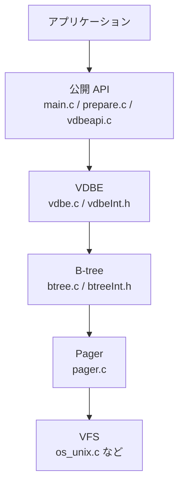

# 第1章 SQLite のアーキテクチャ全体像

> **本章で読むソース**
>
> - [src/main.c](https://github.com/sqlite/sqlite/blob/version-3.53.3/src/main.c)
> - [src/sqliteInt.h](https://github.com/sqlite/sqlite/blob/version-3.53.3/src/sqliteInt.h)
> - [main.mk](https://github.com/sqlite/sqlite/blob/version-3.53.3/main.mk)
> - [tool/mksqlite3c.tcl](https://github.com/sqlite/sqlite/blob/version-3.53.3/tool/mksqlite3c.tcl)

## この章の狙い

SQLite は単一の C ライブラリとして配布されるが、内部は層状に分割されている。
本章では、接続ハンドルからストレージまでの層構造を `sqliteInt.h` の型定義と `main.c` の接続オープン処理から把握する。
あわせて、SQL 文の処理が「コンパイル（`prepare`）」と「実行（`step`）」の二段に分かれることを、公開 API と内部構造の対応から示す。
最後に `main.mk` と `mksqlite3c.tcl` が担うアマルガメーションの役割を確認し、以降の章で個別ファイルを読むための地図を置く。

## 前提

読者は C 言語の構造体と関数呼び出しの基礎、リレーショナルデータベースにおける SQL 文とトランザクションの概念を知っているものとする。
**VDBE**、**B-tree**、**Pager**、**VFS** といった SQLite 固有の用語は本章で初出のたびに位置づけを示す。

## 接続ハンドルと層の入口

アプリケーションが最初に触れるのは `sqlite3` 型の接続ハンドルである。
`sqlite3_open` は薄いラッパーで、読み書き可能かつ存在しなければ作成するフラグを付けて `openDatabase` を呼ぶ。

[src/main.c L3722-L3728](https://github.com/sqlite/sqlite/blob/version-3.53.3/src/main.c#L3722-L3728)

```c
int sqlite3_open(
  const char *zFilename,
  sqlite3 **ppDb
){
  return openDatabase(zFilename, ppDb,
                      SQLITE_OPEN_READWRITE | SQLITE_OPEN_CREATE, 0);
}
```

`openDatabase` は `sqlite3` 構造体を確保し、VFS を選び、メインデータベース用の B-tree を開く。
ここで初めてストレージ層への接続が確立される。

[src/main.c L3611-L3613](https://github.com/sqlite/sqlite/blob/version-3.53.3/src/main.c#L3611-L3613)

```c
  /* Open the backend database driver */
  rc = sqlite3BtreeOpen(db->pVfs, zOpen, db, &db->aDb[0].pBt, 0,
                        flags | SQLITE_OPEN_MAIN_DB);
```

接続オブジェクト `sqlite3` の先頭付近には、各層へのハンドルが並ぶ。
`pVfs` が OS 抽象層、`aDb` がアタッチされた各データベースファイル、`pVdbe` が接続上で生きている VDBE（仮想マシン）のリストである。

[src/sqliteInt.h L1669-L1675](https://github.com/sqlite/sqlite/blob/version-3.53.3/src/sqliteInt.h#L1669-L1675)

```c
struct sqlite3 {
  sqlite3_vfs *pVfs;            /* OS Interface */
  struct Vdbe *pVdbe;           /* List of active virtual machines */
  CollSeq *pDfltColl;           /* BINARY collseq for the database encoding */
  sqlite3_mutex *mutex;         /* Connection mutex */
  Db *aDb;                      /* All backends */
  int nDb;                      /* Number of backends currently in use */
```

この配置が、以降の章で追う呼び出し経路の起点になる。

## 層構造：VDBE、B-tree、Pager、VFS

SQLite の実行モデルは、おおまかに次の四層に分けて読める。

1. **VDBE（仮想マシン）**：コンパイル済み SQL をバイトコードとして保持し、`step` で命令を逐次実行する。
2. **B-tree**：テーブルとインデックスをページ単位の木構造として扱い、カーソル操作の API を提供する。
3. **Pager**：データベースファイルのページ読み書き、ジャーナル、WAL、ロック状態を管理する。
4. **VFS**：ファイル入出力、ロック、メモリマップなど OS 依存処理を抽象化する。

VDBE の中核は `Vdbe` 構造体である。
プログラムカウンタ `pc`、命令列 `aOp` とその長さ `nOp`、レジスタ `aMem`、カーソル配列 `apCsr`、現在行 `pResultRow` が、実行時に参照される主要フィールドだ。
`aOp` と `nOp` がバイトコード本体、`pResultRow` は `SQLITE_ROW` 返却時に列値を載せる `Mem` 配列へのポインタである。

[src/vdbeInt.h L458-L486](https://github.com/sqlite/sqlite/blob/version-3.53.3/src/vdbeInt.h#L458-L486)

```c
struct Vdbe {
  sqlite3 *db;            /* The database connection that owns this statement */
  Vdbe **ppVPrev,*pVNext; /* Linked list of VDBEs with the same Vdbe.db */
  Parse *pParse;          /* Parsing context used to create this Vdbe */
  ynVar nVar;             /* Number of entries in aVar[] */
  int nMem;               /* Number of memory locations currently allocated */
  int nCursor;            /* Number of slots in apCsr[] */
  u32 cacheCtr;           /* VdbeCursor row cache generation counter */
  int pc;                 /* The program counter */
  int rc;                 /* Value to return */
  i64 nChange;            /* Number of db changes made since last reset */
  int iStatement;         /* Statement number (or 0 if has no opened stmt) */
  i64 iCurrentTime;       /* Value of julianday('now') for this statement */
  i64 nFkConstraint;      /* Number of imm. FK constraints this VM */
  i64 nStmtDefCons;       /* Number of def. constraints when stmt started */
  i64 nStmtDefImmCons;    /* Number of def. imm constraints when stmt started */
  Mem *aMem;              /* The memory locations */
  Mem **apArg;            /* Arguments xUpdate and xFilter vtab methods */
  VdbeCursor **apCsr;     /* One element of this array for each open cursor */
  Mem *aVar;              /* Values for the OP_Variable opcode. */

  /* When allocating a new Vdbe object, all of the fields below should be
  ** initialized to zero or NULL */

  Op *aOp;                /* Space to hold the virtual machine's program */
  int nOp;                /* Number of instructions in the program */
  int nOpAlloc;           /* Slots allocated for aOp[] */
  Mem *aColName;          /* Column names to return */
  Mem *pResultRow;        /* Current output row */
```

B-tree 層では、接続ごとの `Btree` が共有データ `BtShared` を指し、その中に `Pager` へのポインタが埋まる。
つまり B-tree のページ操作は、最終的に Pager 経由でディスク（またはメモリ DB）に到達する。

[src/btreeInt.h L425-L427](https://github.com/sqlite/sqlite/blob/version-3.53.3/src/btreeInt.h#L425-L427)

```c
struct BtShared {
  Pager *pPager;        /* The page cache */
  sqlite3 *db;          /* Database connection currently using this Btree */
```

Pager 自身も `sqlite3_vfs` を保持し、実ファイル記述子 `fd` とジャーナル `jfd` を束ねる。
`eState` と `eLock` がページャの動作状態と DB ファイルロック段階を表す。
ジャーナルモードやページサイズは、通常動作で変化する状態ブロック外の設定フィールドに属する。
`journalMode` は状態ブロックの直前、`pageSize` はコメントで示す状態ブロック終了後（L685）に置かれる。

[src/pager.c L619-L685](https://github.com/sqlite/sqlite/blob/version-3.53.3/src/pager.c#L619-L685)

```c
struct Pager {
  sqlite3_vfs *pVfs;          /* OS functions to use for IO */
  u8 exclusiveMode;           /* Boolean. True if locking_mode==EXCLUSIVE */
  u8 journalMode;             /* One of the PAGER_JOURNALMODE_* values */
  u8 useJournal;              /* Use a rollback journal on this file */
  u8 noSync;                  /* Do not sync the journal if true */
  u8 fullSync;                /* Do extra syncs of the journal for robustness */
  u8 extraSync;               /* sync directory after journal delete */
  u8 syncFlags;               /* SYNC_NORMAL or SYNC_FULL otherwise */
  u8 walSyncFlags;            /* See description above */
  u8 tempFile;                /* zFilename is a temporary or immutable file */
  u8 noLock;                  /* Do not lock (except in WAL mode) */
  u8 readOnly;                /* True for a read-only database */
  u8 memDb;                   /* True to inhibit all file I/O */
  u8 memVfs;                  /* VFS-implemented memory database */

  /**************************************************************************
  ** The following block contains those class members that change during
  ** routine operation.  Class members not in this block are either fixed
  ** when the pager is first created or else only change when there is a
  ** significant mode change (such as changing the page_size, locking_mode,
  ** or the journal_mode).  From another view, these class members describe
  ** the "state" of the pager, while other class members describe the
  ** "configuration" of the pager.
  */
  u8 eState;                  /* Pager state (OPEN, READER, WRITER_LOCKED..) */
  u8 eLock;                   /* Current lock held on database file */
  u8 changeCountDone;         /* Set after incrementing the change-counter */
  u8 setSuper;                /* Super-jrnl name is written into jrnl */
  u8 doNotSpill;              /* Do not spill the cache when non-zero */
  u8 subjInMemory;            /* True to use in-memory sub-journals */
  u8 bUseFetch;               /* True to use xFetch() */
  u8 hasHeldSharedLock;       /* True if a shared lock has ever been held */
  Pgno dbSize;                /* Number of pages in the database */
  Pgno dbOrigSize;            /* dbSize before the current transaction */
  Pgno dbFileSize;            /* Number of pages in the database file */
  Pgno dbHintSize;            /* Value passed to FCNTL_SIZE_HINT call */
  int errCode;                /* One of several kinds of errors */
  int nRec;                   /* Pages journalled since last j-header written */
  u32 cksumInit;              /* Quasi-random value added to every checksum */
  u32 nSubRec;                /* Number of records written to sub-journal */
  Bitvec *pInJournal;         /* One bit for each page in the database file */
  sqlite3_file *fd;           /* File descriptor for database */
  sqlite3_file *jfd;          /* File descriptor for main journal */
  // ... (中略) ...
  char dbFileVers[16];        /* Changes whenever database file changes */

  int nMmapOut;               /* Number of mmap pages currently outstanding */
  sqlite3_int64 szMmap;       /* Desired maximum mmap size */
  PgHdr *pMmapFreelist;       /* List of free mmap page headers (pDirty) */
  /*
  ** End of the routinely-changing class members
  ***************************************************************************/

  u16 nExtra;                 /* Add this many bytes to each in-memory page */
  i16 nReserve;               /* Number of unused bytes at end of each page */
  u32 vfsFlags;               /* Flags for sqlite3_vfs.xOpen() */
  u32 sectorSize;             /* Assumed sector size during rollback */
  Pgno mxPgno;                /* Maximum allowed size of the database */
  Pgno lckPgno;               /* Page number for the locking page */
  i64 pageSize;               /* Number of bytes in a page */
```



## コンパイルと実行の二段

SQLite における「準備」と「実行」は、ソース上も API 上も明確に分離されている。

**コンパイル段階**では、SQL 文字列がトークナイザとパーサを通り、コード生成器が VDBE バイトコードを組み立てる。
`sqlite3Prepare` の末尾付近でパーサ `sqlite3RunParser` が呼ばれ、成功すれば `sqlite3_stmt` として `Vdbe` が返る。

[src/prepare.c L777-L779](https://github.com/sqlite/sqlite/blob/version-3.53.3/src/prepare.c#L777-L779)

```c
    zSqlCopy = sqlite3DbStrNDup(db, zSql, nBytes);
    if( zSqlCopy ){
      sqlite3RunParser(&sParse, zSqlCopy);
```

**実行段階**では、公開 API `sqlite3_step` が内部の `sqlite3Step` を呼び、VDBE のプログラムカウンタを進める。
ここで初めて B-tree カーソルが動き、Pager がページを読み書きする。

[src/vdbeapi.c L919-L922](https://github.com/sqlite/sqlite/blob/version-3.53.3/src/vdbeapi.c#L919-L922)

```c
int sqlite3_step(sqlite3_stmt *pStmt){
  int rc = SQLITE_OK;      /* Result from sqlite3Step() */
  Vdbe *v = (Vdbe*)pStmt;  /* the prepared statement */
  int cnt = 0;             /* Counter to prevent infinite loop of reprepares */
```

同じ SQL 文を繰り返し実行する場合、コンパイルは一度で済み、`step` と `reset` のループだけが繰り返される。
この分離が、プリペアドステートメントの性能上の意味を持つ（詳細は第2章で API 単位に追う）。

## アマルガメーションとビルド構成

開発用のツリーは `src/*.c` に分散しているが、配布物の多くは `sqlite3.c` という単一翻訳単位にまとめられる。
`main.mk` では `USE_AMALGAMATION` が 1 のときライブラリオブジェクトは `sqlite3.o` のみになり、0 のときは `alter.o` から `window.o` まで個別にリンクする。

[main.mk L216-L221](https://github.com/sqlite/sqlite/blob/version-3.53.3/main.mk#L216-L221)

```makefile
# 1 if the amalgamation (sqlite3.c/h) should be built/used, otherwise
# the library is built from all of its original source files.
# Certain tools, like sqlite3$(T.exe), require the amalgamation and
# will ignore this preference.
#
USE_AMALGAMATION ?= 1
```

[main.mk L522-L523](https://github.com/sqlite/sqlite/blob/version-3.53.3/main.mk#L522-L523)

```makefile
LIBOBJS0 = alter.o analyze.o attach.o auth.o \
         backup.o bitvec.o btmutex.o btree.o build.o \
```

[main.mk L558](https://github.com/sqlite/sqlite/blob/version-3.53.3/main.mk#L558)

```makefile
LIBOBJ = $(LIBOBJS$(USE_AMALGAMATION))
```

`sqlite3.c` の生成規則は `tool/mksqlite3c.tcl` を `tclsh` で起動するだけである。
入力は `make target_source` で集めた `tsrc/` ディレクトリ内のソース群だ。

[main.mk L1130-L1132](https://github.com/sqlite/sqlite/blob/version-3.53.3/main.mk#L1130-L1132)

```makefile
sqlite3.c:	.target_source sqlite3.h $(TOP)/tool/mksqlite3c.tcl src-verify$(B.exe) \
		$(B.tclsh) $(EXTRA_SRC)
	$(B.tclsh) $(TOP)/tool/mksqlite3c.tcl $(AMALGAMATION_GEN_FLAGS) $(EXTRA_SRC)
```

`mksqlite3c.tcl` の冒頭コメントは、アマルガメーションの目的を率直に述べている。
コアライブラリの全ソースを一つの翻訳単位にまとめ、配布と組み込みを容易にする。

[tool/mksqlite3c.tcl L3-L5](https://github.com/sqlite/sqlite/blob/version-3.53.3/tool/mksqlite3c.tcl#L3-L5)

```tcl
# To build a single huge source file holding all of SQLite (or at
# least the core components - the test harness, shell, and TCL
# interface are omitted.) first do
```

ビルド時に生成される `parse.c` や `opcodes.c` は `tsrc/` に置かれたうえでアマルガメーションに吸収される。
本書の引用は生成物ではなく、生成元（`parse.y`、`tool/mkopcodeh.tcl` など）と、それを include して動く `src/*.c` から行う（WRITING_GUIDE 第2節）。

## 高速化と最適化の工夫

アマルガメーションは配布の簡便さだけでなく、コンパイラ最適化の対象を一つの翻訳単位に集約する効果を狙っている。
`mksqlite3c.tcl` のコメントは、単一翻訳単位にまとめたとき、全体で 5% 以上の性能向上が見られることが多いと記している。

[tool/mksqlite3c.tcl L100-L104](https://github.com/sqlite/sqlite/blob/version-3.53.3/tool/mksqlite3c.tcl#L100-L104)

```tcl
** of 5% or more are commonly seen when SQLite is compiled as a single
** translation unit.
**
** This file is all you need to compile SQLite.  To use SQLite in other
** programs, you need this file and the "sqlite3.h" header file that defines
```

関数呼び出しが翻訳単位内に閉じるため、インライン展開や定数伝播が効きやすくなる。
逆に `USE_AMALGAMATION=0` の開発ビルドではリンク時間の短縮と部分再コンパイルのしやすさを取る。
本リーディングではソース追跡のため分散ビルドのファイル境界を章ごとに辿り、性能面の話はアマルガメーションの設計意図としてここで押さえる。

## まとめ

SQLite は `sqlite3` 接続を頂点に、VDBE、B-tree、Pager、VFS へと責務が落ちる層構造をとる。
SQL 処理は `prepare` でバイトコードを生成するコンパイル段と、`step` で VDBE を駆動する実行段に分かれる。
配布ビルドは `mksqlite3c.tcl` が生成する `sqlite3.c` に集約され、コンパイラの全体最適化と組み込みの容易さを両立する。

## 関連する章

- 第2章では `open`、`prepare`、`step` など公開 API のライフサイクルを個別関数レベルで追う。
- 第13章以降で VDBE 命令ディスパッチ、第17章以降で B-tree と Pager のページ操作を層の内部に入る。
- 第22章で VFS とロックの OS 依存実装を読む。
