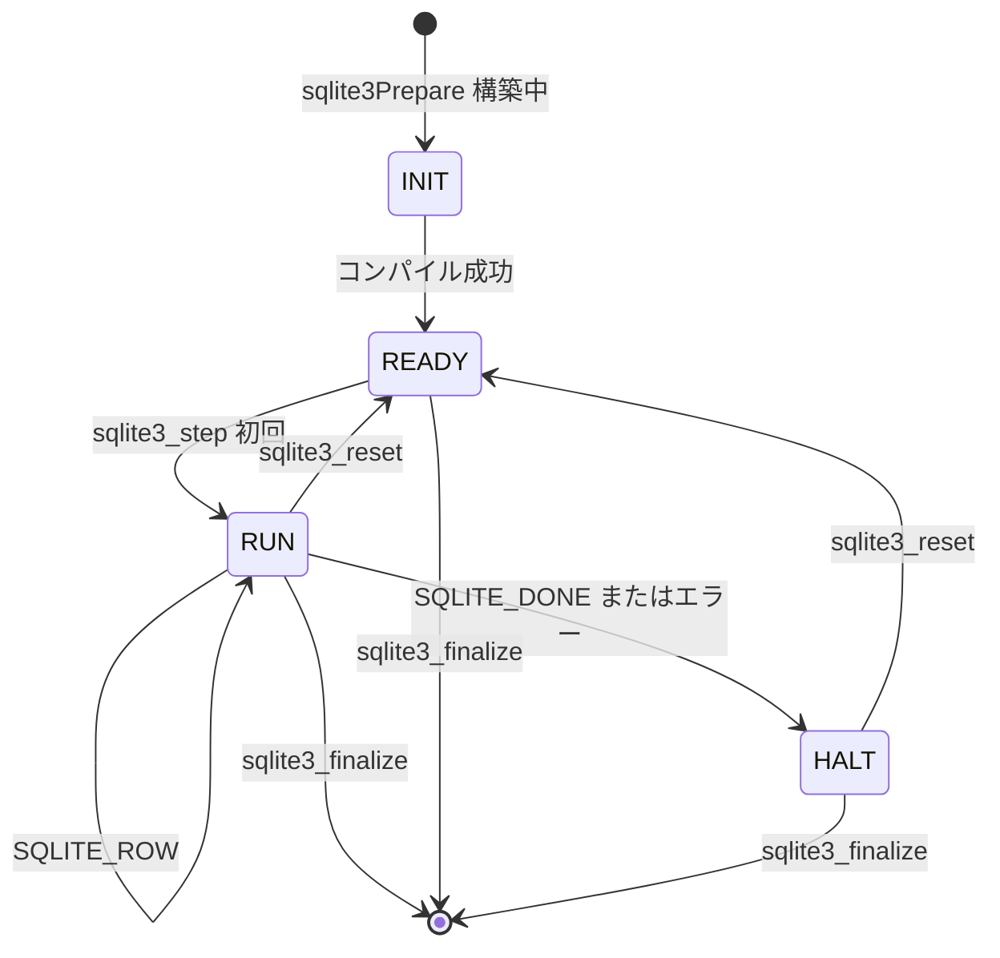
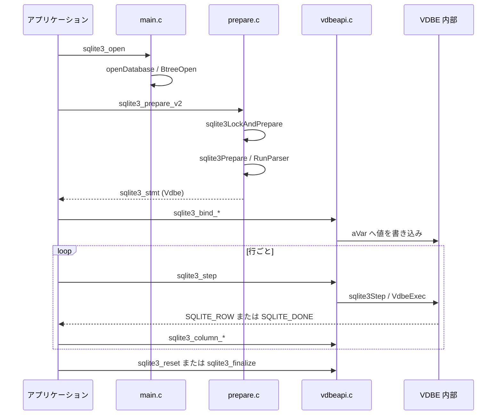

# 第2章 公開 API と文のライフサイクル

> **本章で読むソース**
>
> - [src/main.c](https://github.com/sqlite/sqlite/blob/version-3.53.3/src/main.c)
> - [src/prepare.c](https://github.com/sqlite/sqlite/blob/version-3.53.3/src/prepare.c)
> - [src/vdbeapi.c](https://github.com/sqlite/sqlite/blob/version-3.53.3/src/vdbeapi.c)
> - [src/legacy.c](https://github.com/sqlite/sqlite/blob/version-3.53.3/src/legacy.c)
> - [src/complete.c](https://github.com/sqlite/sqlite/blob/version-3.53.3/src/complete.c)

## この章の狙い

第1章で示した層構造と「コンパイル／実行」の二段を、公開 API の呼び出し順に落とし込む。
`sqlite3_open` から接続を開き、`sqlite3_prepare_v2` で文をコンパイルし、`sqlite3_bind_*` でパラメータを渡して `sqlite3_step` で実行する。
終了処理として `sqlite3_reset` と `sqlite3_finalize` の違いをソースで確認する。
列値の取得は `sqlite3_column_*`、一括実行は `sqlite3_exec`、対話入力の文末判定はパーサを使わない `sqlite3_complete` が担う点も押さえる。

## 前提

`sqlite3_stmt` は内部では `Vdbe` 構造体への不透明ポインタとして実装されている（第1章参照）。
本章では API 名と内部関数名の対応を示しつつ、VDBE の状態遷移（`eVdbeState`）がライフサイクル制約にどう効くかを読む。

## 接続のオープン

`sqlite3_open` は `openDatabase` に委譲し、そこで `sqlite3` 構造体の確保、mutex の初期化、VFS 選択、`sqlite3BtreeOpen` によるメイン DB のオープンが行われる（第1章の引用参照）。
以降の `prepare` と `step` はすべてこの接続の `db->mutex` の保護下で動く。

## コンパイル：`prepare` 系 API

アプリケーションが直接呼ぶのは `sqlite3_prepare_v2` である。
実体は `sqlite3LockAndPrepare` で、接続 mutex を取得したうえで `sqlite3BtreeEnterAll` により全 B-tree に入り、`sqlite3Prepare` を実行する。

[src/prepare.c L937-L953](https://github.com/sqlite/sqlite/blob/version-3.53.3/src/prepare.c#L937-L953)

```c
int sqlite3_prepare_v2(
  sqlite3 *db,              /* Database handle. */
  const char *zSql,         /* UTF-8 encoded SQL statement. */
  int nBytes,               /* Length of zSql in bytes. */
  sqlite3_stmt **ppStmt,    /* OUT: A pointer to the prepared statement */
  const char **pzTail       /* OUT: End of parsed string */
){
  int rc;
  /* EVIDENCE-OF: R-37923-12173 The sqlite3_prepare_v2() interface works
  ** exactly the same as sqlite3_prepare_v3() with a zero prepFlags
  ** parameter.
  **
  ** Proof in that the 5th parameter to sqlite3LockAndPrepare is 0 */
  rc = sqlite3LockAndPrepare(db,zSql,nBytes,SQLITE_PREPARE_SAVESQL,0,
                             ppStmt,pzTail);
  assert( rc==SQLITE_OK || ppStmt==0 || *ppStmt==0 );
  return rc;
}
```

[src/prepare.c L855-L861](https://github.com/sqlite/sqlite/blob/version-3.53.3/src/prepare.c#L855-L861)

```c
  sqlite3_mutex_enter(db->mutex);
  sqlite3BtreeEnterAll(db);
  do{
    /* Make multiple attempts to compile the SQL, until it either succeeds
    ** or encounters a permanent error.  A schema problem after one schema
    ** reset is considered a permanent error. */
    rc = sqlite3Prepare(db, zSql, nBytes, prepFlags, pOld, ppStmt, pzTail);
```

`sqlite3Prepare` 内では `Parse` コンテキストを初期化し、パーサを起動する。
成功時には `sParse.pVdbe` が `sqlite3_stmt` として呼び出し元に返る。

[src/prepare.c L695-L700](https://github.com/sqlite/sqlite/blob/version-3.53.3/src/prepare.c#L695-L700)

```c
  /* sqlite3ParseObjectInit(&sParse, db); // inlined for performance */
  memset(PARSE_HDR(&sParse), 0, PARSE_HDR_SZ);
  memset(PARSE_TAIL(&sParse), 0, PARSE_TAIL_SZ);
  sParse.pOuterParse = db->pParse;
  db->pParse = &sParse;
  sParse.db = db;
```

[src/prepare.c L816-L819](https://github.com/sqlite/sqlite/blob/version-3.53.3/src/prepare.c#L816-L819)

```c
  }else{
    assert( sParse.zErrMsg==0 );
    *ppStmt = (sqlite3_stmt*)sParse.pVdbe;
    rc = SQLITE_OK;
```

コンパイルが終わった直後の VDBE は `VDBE_READY_STATE` にあり、`step` を呼ぶまで実行は始まらない。

## 実行と終了：`step`、`reset`、`finalize`

`sqlite3_step` は接続 mutex を取ったうえで `sqlite3Step` を呼ぶ。
`SQLITE_SCHEMA` が返ると `sqlite3Reprepare` で文を組み直し、`sqlite3_reset` で VM を初期状態へ戻してから再実行する。

[src/vdbeapi.c L919-L954](https://github.com/sqlite/sqlite/blob/version-3.53.3/src/vdbeapi.c#L919-L954)

```c
int sqlite3_step(sqlite3_stmt *pStmt){
  int rc = SQLITE_OK;      /* Result from sqlite3Step() */
  Vdbe *v = (Vdbe*)pStmt;  /* the prepared statement */
  int cnt = 0;             /* Counter to prevent infinite loop of reprepares */
  sqlite3 *db;             /* The database connection */

  if( vdbeSafetyNotNull(v) ){
    return SQLITE_MISUSE_BKPT;
  }
  db = v->db;
  sqlite3_mutex_enter(db->mutex);
  while( (rc = sqlite3Step(v))==SQLITE_SCHEMA
         && cnt++ < SQLITE_MAX_SCHEMA_RETRY ){
    int savedPc = v->pc;
    rc = sqlite3Reprepare(v);
    if( rc!=SQLITE_OK ){
      // ... (中略) ...
      break;
    }
    sqlite3_reset(pStmt);
```

`sqlite3Step` は状態が `VDBE_READY_STATE` のときプログラムカウンタを 0 に戻し、`VDBE_RUN_STATE` へ遷移してから命令実行に入る。

[src/vdbeapi.c L783-L786](https://github.com/sqlite/sqlite/blob/version-3.53.3/src/vdbeapi.c#L783-L786)

```c
  if( p->eVdbeState!=VDBE_RUN_STATE ){
    restart_step:
    if( p->eVdbeState==VDBE_READY_STATE ){
      if( p->expired ){
```

[src/vdbeapi.c L821-L825](https://github.com/sqlite/sqlite/blob/version-3.53.3/src/vdbeapi.c#L821-L825)

```c
      db->nVdbeActive++;
      if( p->readOnly==0 ) db->nVdbeWrite++;
      if( p->bIsReader ) db->nVdbeRead++;
      p->pc = 0;
      p->eVdbeState = VDBE_RUN_STATE;
```

実行が終わると `VDBE_HALT_STATE` になる。
`sqlite3VdbeReset` は `VDBE_RUN_STATE` または `VDBE_HALT_STATE` から `VDBE_READY_STATE` へ戻す。
`sqlite3_reset` はこの reset を呼んで再利用可能にし、`sqlite3_finalize` は `eVdbeState>=VDBE_READY_STATE` の文を reset したうえで `sqlite3VdbeDelete` により破棄する。

[src/vdbeaux.c L3582-L3598](https://github.com/sqlite/sqlite/blob/version-3.53.3/src/vdbeaux.c#L3582-L3598)

```c
** To look at it another way, this routine resets the state of the
** virtual machine from VDBE_RUN_STATE or VDBE_HALT_STATE back to
** VDBE_READY_STATE.
*/
int sqlite3VdbeReset(Vdbe *p){
  // ... (中略) ...
  if( p->eVdbeState==VDBE_RUN_STATE ) sqlite3VdbeHalt(p);
```

[src/vdbeapi.c L134-L144](https://github.com/sqlite/sqlite/blob/version-3.53.3/src/vdbeapi.c#L134-L144)

```c
int sqlite3_reset(sqlite3_stmt *pStmt){
  int rc;
  if( pStmt==0 ){
    rc = SQLITE_OK;
  }else{
    Vdbe *v = (Vdbe*)pStmt;
    sqlite3 *db = v->db;
    sqlite3_mutex_enter(db->mutex);
    checkProfileCallback(db, v);
    rc = sqlite3VdbeReset(v);
    sqlite3VdbeRewind(v);
```

[src/vdbeapi.c L105-L119](https://github.com/sqlite/sqlite/blob/version-3.53.3/src/vdbeapi.c#L105-L119)

```c
int sqlite3_finalize(sqlite3_stmt *pStmt){
  int rc;
  if( pStmt==0 ){
    /* IMPLEMENTATION-OF: R-57228-12904 Invoking sqlite3_finalize() on a NULL
    ** pointer is a harmless no-op. */
    rc = SQLITE_OK;
  }else{
    Vdbe *v = (Vdbe*)pStmt;
    sqlite3 *db = v->db;
    if( vdbeSafety(v) ) return SQLITE_MISUSE_BKPT;
    sqlite3_mutex_enter(db->mutex);
    checkProfileCallback(db, v);
    assert( v->eVdbeState>=VDBE_READY_STATE );
    rc = sqlite3VdbeReset(v);
    sqlite3VdbeDelete(v);
```



## パラメータ束縛：`bind`

`sqlite3_bind_int64` などは、いずれも `vdbeUnbind` 経由で束縛する。
`vdbeUnbind` はまず `eVdbeState` が `VDBE_READY_STATE` かを確認し、実行中なら `SQLITE_MISUSE` を返す。
通過後は `sqlite3VdbeMemRelease` で既存の `aVar[i]` を解放してから新しい値を書き込む。
`expmask` に該当する変数では `expired` を立て、次の `sqlite3_step` で再コンパイルを促す（遅延再コンパイルは後述）。

[src/vdbeapi.c L1666-L1695](https://github.com/sqlite/sqlite/blob/version-3.53.3/src/vdbeapi.c#L1666-L1695)

```c
  if( p->eVdbeState!=VDBE_READY_STATE ){
    sqlite3Error(p->db, SQLITE_MISUSE_BKPT);
    sqlite3_mutex_leave(p->db->mutex);
    sqlite3_log(SQLITE_MISUSE,
        "bind on a busy prepared statement: [%s]", p->zSql);
    return SQLITE_MISUSE_BKPT;
  }
  if( i>=(unsigned int)p->nVar ){
    sqlite3Error(p->db, SQLITE_RANGE);
    sqlite3_mutex_leave(p->db->mutex);
    return SQLITE_RANGE;
  }
  pVar = &p->aVar[i];
  sqlite3VdbeMemRelease(pVar);
  pVar->flags = MEM_Null;
  p->db->errCode = SQLITE_OK;

  /* If the bit corresponding to this variable in Vdbe.expmask is set, then
  ** binding a new value to this variable invalidates the current query plan.
  **
  ** IMPLEMENTATION-OF: R-57496-20354 If the specific value bound to a host
  ** parameter in the WHERE clause might influence the choice of query plan
  ** for a statement, then the statement will be automatically recompiled,
  ** as if there had been a schema change, on the first sqlite3_step() call
  ** following any change to the bindings of that parameter.
  */
  assert( (p->prepFlags & SQLITE_PREPARE_SAVESQL)!=0 || p->expmask==0 );
  if( p->expmask!=0 && (p->expmask & (i>=31 ? 0x80000000 : (u32)1<<i))!=0 ){
    p->expired = 1;
  }
```

[src/vdbeapi.c L1791-L1798](https://github.com/sqlite/sqlite/blob/version-3.53.3/src/vdbeapi.c#L1791-L1798)

```c
int sqlite3_bind_int64(sqlite3_stmt *pStmt, int i, sqlite_int64 iValue){
  int rc;
  Vdbe *p = (Vdbe *)pStmt;
  rc = vdbeUnbind(p, (u32)(i-1));
  if( rc==SQLITE_OK ){
    assert( p!=0 && p->aVar!=0 && i>0 && i<=p->nVar ); /* tag-20240917-01 */
    sqlite3VdbeMemSetInt64(&p->aVar[i-1], iValue);
    sqlite3_mutex_leave(p->db->mutex);
```

## 結果列の取得：`column`

`sqlite3_column_count` は結果セットの列数を `Vdbe.nResColumn` から返すだけの薄いラッパーである。

[src/vdbeapi.c L1272-L1276](https://github.com/sqlite/sqlite/blob/version-3.53.3/src/vdbeapi.c#L1272-L1276)

```c
int sqlite3_column_count(sqlite3_stmt *pStmt){
  Vdbe *pVm = (Vdbe *)pStmt;
  if( pVm==0 ) return 0;
  return pVm->nResColumn;
}
```

`sqlite3_column_text` などは `columnMem` で現在行の `Mem` を取り出し、`sqlite3_value_*` 系に委譲する。
`columnMem` は `pResultRow` が非 NULL のときだけ `pResultRow[i]` を返す。
`sqlite3_step` が `SQLITE_ROW` を返した直後は VDBE が `pResultRow` を指し示しており、その間だけ列読み出しが有効である。

[src/vdbeapi.c L1332-L1346](https://github.com/sqlite/sqlite/blob/version-3.53.3/src/vdbeapi.c#L1332-L1346)

```c
static Mem *columnMem(sqlite3_stmt *pStmt, int i){
  Vdbe *pVm;
  Mem *pOut;

  pVm = (Vdbe *)pStmt;
  if( pVm==0 ) return (Mem*)columnNullValue();
  assert( pVm->db );
  sqlite3_mutex_enter(pVm->db->mutex);
  if( pVm->pResultRow!=0 && i<pVm->nResColumn && i>=0 ){
    pOut = &pVm->pResultRow[i];
  }else{
    sqlite3Error(pVm->db, SQLITE_RANGE);
    pOut = (Mem*)columnNullValue();
  }
  return pOut;
}
```

[src/vdbeapi.c L1422-L1426](https://github.com/sqlite/sqlite/blob/version-3.53.3/src/vdbeapi.c#L1422-L1426)

```c
const unsigned char *sqlite3_column_text(sqlite3_stmt *pStmt, int i){
  const unsigned char *val = sqlite3_value_text( columnMem(pStmt,i) );
  columnMallocFailure(pStmt);
  return val;
}
```

## 一括実行：`sqlite3_exec`

`sqlite3_exec` は `prepare`、`step`、`finalize` を接続 mutex の内側でループするレガシー API である。
複数文を `zLeftover` で切り出しながら順に処理する。
コールバックが非ゼロを返すと `SQLITE_ABORT` で打ち切り、`sqlite3VdbeFinalize` で文を解放する。
1文の処理が終わると `zSql` を `zLeftover` へ進め、先頭の空白を飛ばして次の文へ回る。

[src/legacy.c L48-L116](https://github.com/sqlite/sqlite/blob/version-3.53.3/src/legacy.c#L48-L116)

```c
  while( rc==SQLITE_OK && zSql[0] ){
    int nCol = 0;
    char **azVals = 0;

    pStmt = 0;
    rc = sqlite3_prepare_v2(db, zSql, -1, &pStmt, &zLeftover);
    assert( rc==SQLITE_OK || pStmt==0 );
    if( rc!=SQLITE_OK ){
      continue;
    }
    if( !pStmt ){
      /* this happens for a comment or white-space */
      zSql = zLeftover;
      continue;
    }
    callbackIsInit = 0;

    while( 1 ){
      int i;
      rc = sqlite3_step(pStmt);

      /* Invoke the callback function if required */
      // ... (中略) ...
        if( xCallback(pArg, nCol, azVals, azCols) ){
          /* EVIDENCE-OF: R-38229-40159 If the callback function to
          ** sqlite3_exec() returns non-zero, then sqlite3_exec() will
          ** return SQLITE_ABORT. */
          rc = SQLITE_ABORT;
          sqlite3VdbeFinalize((Vdbe *)pStmt);
          pStmt = 0;
          sqlite3Error(db, SQLITE_ABORT);
          goto exec_out;
        }
      }

      if( rc!=SQLITE_ROW ){
        rc = sqlite3VdbeFinalize((Vdbe *)pStmt);
        pStmt = 0;
        zSql = zLeftover;
        while( sqlite3Isspace(zSql[0]) ) zSql++;
        break;
      }
    }
```

## 文末判定：`sqlite3_complete`

`sqlite3_complete` は第3章のトークナイザ（`sqlite3GetToken`）を使わない。
`complete.c` 内の簡易な字句走査が入力を1文字ずつ `switch` で分類し、専用の遷移表 `trans` で状態を更新する。
セミコロン、空白、C 形式および SQL 形式のコメント、引用符で囲まれた文字列を識別し、`CREATE` と `TRIGGER` と `END` をキーワードとして拾う。
引用符で囲まれた文字列内のセミコロンは、L187-L195 の走査で文字列全体が `tkOTHER` として扱われ、文の区切りにはならない。
トリガー本体中には内部文を終えるセミコロンが現れるため、`TRIGGER` 状態で `END` に続く終端セミコロンまで追う。

[src/complete.c L112-L123](https://github.com/sqlite/sqlite/blob/version-3.53.3/src/complete.c#L112-L123)

```c
  static const u8 trans[8][8] = {
                     /* Token:                                                */
     /* State:       **  SEMI  WS  OTHER  EXPLAIN  CREATE  TEMP  TRIGGER  END */
     /* 0 INVALID: */ {    1,  0,     2,       3,      4,    2,       2,   2, },
     /* 1   START: */ {    1,  1,     2,       3,      4,    2,       2,   2, },
     /* 2  NORMAL: */ {    1,  2,     2,       2,      2,    2,       2,   2, },
     /* 3 EXPLAIN: */ {    1,  3,     3,       2,      4,    2,       2,   2, },
     /* 4  CREATE: */ {    1,  4,     2,       2,      2,    4,       5,   2, },
     /* 5 TRIGGER: */ {    6,  5,     5,       5,      5,    5,       5,   5, },
     /* 6    SEMI: */ {    6,  6,     5,       5,      5,    5,       5,   7, },
     /* 7     END: */ {    1,  7,     5,       5,      5,    5,       5,   5, },
  };
```

[src/complete.c L144-L258](https://github.com/sqlite/sqlite/blob/version-3.53.3/src/complete.c#L144-L258)

```c
  while( *zSql ){
    switch( *zSql ){
      case ';': {  /* A semicolon */
        token = tkSEMI;
        break;
      }
      case ' ':
      case '\r':
      case '\t':
      case '\n':
      case '\f': {  /* White space is ignored */
        token = tkWS;
        break;
      }
      case '/': {   /* C-style comments */
        if( zSql[1]!='*' ){
          token = tkOTHER;
          break;
        }
        zSql += 2;
        while( zSql[0] && (zSql[0]!='*' || zSql[1]!='/') ){ zSql++; }
        if( zSql[0]==0 ) return 0;
        zSql++;
        token = tkWS;
        break;
      }
      case '-': {   /* SQL-style comments from "--" to end of line */
        if( zSql[1]!='-' ){
          token = tkOTHER;
          break;
        }
        while( *zSql && *zSql!='\n' ){ zSql++; }
        if( *zSql==0 ) return state==1;
        token = tkWS;
        break;
      }
      case '[': {   /* Microsoft-style identifiers in [...] */
        zSql++;
        while( *zSql && *zSql!=']' ){ zSql++; }
        if( *zSql==0 ) return 0;
        token = tkOTHER;
        break;
      }
      case '`':     /* Grave-accent quoted symbols used by MySQL */
      case '"':     /* single- and double-quoted strings */
      case '\'': {
        int c = *zSql;
        zSql++;
        while( *zSql && *zSql!=c ){ zSql++; }
        if( *zSql==0 ) return 0;
        token = tkOTHER;
        break;
      }
      default: {
#ifdef SQLITE_EBCDIC
        unsigned char c;
#endif
        if( IdChar((u8)*zSql) ){
          /* Keywords and unquoted identifiers */
          int nId;
          for(nId=1; IdChar(zSql[nId]); nId++){}
#ifdef SQLITE_OMIT_TRIGGER
          token = tkOTHER;
#else
          switch( *zSql ){
            case 'c': case 'C': {
              if( nId==6 && sqlite3StrNICmp(zSql, "create", 6)==0 ){
                token = tkCREATE;
              }else{
                token = tkOTHER;
              }
              break;
            }
            case 't': case 'T': {
              if( nId==7 && sqlite3StrNICmp(zSql, "trigger", 7)==0 ){
                token = tkTRIGGER;
              }else if( nId==4 && sqlite3StrNICmp(zSql, "temp", 4)==0 ){
                token = tkTEMP;
              }else if( nId==9 && sqlite3StrNICmp(zSql, "temporary", 9)==0 ){
                token = tkTEMP;
              }else{
                token = tkOTHER;
              }
              break;
            }
            case 'e':  case 'E': {
              if( nId==3 && sqlite3StrNICmp(zSql, "end", 3)==0 ){
                token = tkEND;
              }else
#ifndef SQLITE_OMIT_EXPLAIN
              if( nId==7 && sqlite3StrNICmp(zSql, "explain", 7)==0 ){
                token = tkEXPLAIN;
              }else
#endif
              {
                token = tkOTHER;
              }
              break;
            }
            default: {
              token = tkOTHER;
              break;
            }
          }
#endif /* SQLITE_OMIT_TRIGGER */
          zSql += nId-1;
        }else{
          /* Operators and special symbols */
          token = tkOTHER;
        }
        break;
      }
    }
    state = trans[state][token];
    zSql++;
  }
  return state==1;
}
```

## 処理の流れ

典型的なプリペアドステートメント利用は、次の順序で API が呼ばれる。



`sqlite3_exec` を使う場合は、このシーケンスが `legacy.c` のループ内に折りたたまれている。

## 高速化と最適化の工夫

長寿命のプリペアドステートメント向けに `SQLITE_PREPARE_PERSISTENT` フラグがある。
`sqlite3Prepare` はこのフラグが立っているとき lookaside メモリを無効化し、接続専用の小さな割り当てプールへの占有を避ける。
繰り返し実行する文では、lookaside スロットを解放し続けるコストより、一般ヒープ上に直接確保するほうが得になるためだ。

[src/prepare.c L715-L721](https://github.com/sqlite/sqlite/blob/version-3.53.3/src/prepare.c#L715-L721)

```c
  /* For a long-term use prepared statement avoid the use of
  ** lookaside memory.
  */
  if( prepFlags & SQLITE_PREPARE_PERSISTENT ){
    sParse.disableLookaside++;
    DisableLookaside;
  }
```

パラメータ束縛にも遅延再コンパイルの仕組みがある（`vdbeUnbind` 節の引用参照）。
`expmask` のビットが立った変数に値が変わると `expired` フラグを立て、次の `sqlite3_step` でクエリプランの再生成を促す。
毎回の `bind` で即座に再コンパイルせず、実際に実行するときまで計画の更新を遅延させる。

## まとめ

接続は `openDatabase` で `sqlite3` と B-tree を構築し、文は `sqlite3_prepare_v2` が `sqlite3Prepare` 経由で VDBE を生成する。
`sqlite3_step` が実行を開始し、`reset` は VM を再利用可能に戻し、`finalize` は資源を解放する。
`bind` と `column` はそれぞれ `aVar` と `pResultRow` を介して VDBE のメモリセルに触れる。
`sqlite3_exec` と `sqlite3_complete` は同じ接続 API の上に載った補助経路であり、前者は便利な一括実行、後者は軽量な文末判定を提供する。

## 関連する章

- 第3章以降で `sqlite3RunParser` の内側、トークナイザとパーサの処理を追う。
- 第13章で `sqlite3Step` から呼ばれる `sqlite3VdbeExec` の命令ディスパッチを読む。
- 第1章の層構造図と合わせ、本章の API 呼び出しがどの層まで到達するかを対応づけて読み進める。
