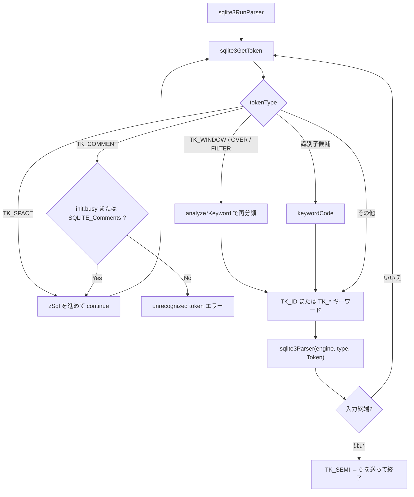

# 第3章 トークナイザ

> **本章で読むソース**
>
> - [src/tokenize.c](https://github.com/sqlite/sqlite/blob/version-3.53.3/src/tokenize.c)
> - [tool/mkkeywordhash.c](https://github.com/sqlite/sqlite/blob/version-3.53.3/tool/mkkeywordhash.c)
> - [main.mk](https://github.com/sqlite/sqlite/blob/version-3.53.3/main.mk)

## この章の狙い

SQL 文字列をパーサが扱える単位に切り出すのが**トークナイザ**である。
本章では `sqlite3GetToken` が1トークンずつ字句を切り出す仕組みと、`sqlite3RunParser` が Lemon 生成パーサへ渡すループを追う。
識別子と予約語の判別には、ビルド時に `tool/mkkeywordhash.c` が生成する衝突チェーン付きハッシュ表が使われる。
生成物 `keywordhash.h` 自体は引用せず、生成規則と `main.mk` の依存関係から読み解く。

## 前提

第2章で `sqlite3Prepare` が `sqlite3RunParser` を呼ぶ経路は確認済みである。
本章はその直前段、すなわち「文字列からトークン列へ」の処理に焦点を当てる。
パーサ本体（Lemon 文法と `parse.c`）は第4章で扱う。

## トークナイザの位置づけ

`tokenize.c` のファイルヘッダは、このモジュールの役割を明示している。
SQL 入力を個々のトークンに分割し、解析のためにパーサへ1つずつ送る。

[src/tokenize.c L11-L16](https://github.com/sqlite/sqlite/blob/version-3.53.3/src/tokenize.c#L11-L16)

```c
** An tokenizer for SQL
**
** This file contains C code that splits an SQL input string up into
** individual tokens and sends those tokens one-by-one over to the
** parser for analysis.
```

字句切り出しの中心は `sqlite3GetToken` である。
先頭文字のクラス `aiClass[*z]` に応じた `switch` で、空白、演算子、リテラル、識別子候補を分岐する。

[src/tokenize.c L273-L287](https://github.com/sqlite/sqlite/blob/version-3.53.3/src/tokenize.c#L273-L287)

```c
i64 sqlite3GetToken(const unsigned char *z, int *tokenType){
  i64 i;
  int c;
  switch( aiClass[*z] ){  /* Switch on the character-class of the first byte
                          ** of the token. See the comment on the CC_ defines
                          ** above. */
    case CC_SPACE: {
      testcase( z[0]==' ' );
      testcase( z[0]=='\t' );
      testcase( z[0]=='\n' );
      testcase( z[0]=='\f' );
      testcase( z[0]=='\r' );
      for(i=1; sqlite3Isspace(z[i]); i++){}
      *tokenType = TK_SPACE;
      return i;
```

戻り値は消費したバイト数、`*tokenType` は `TK_*` 定数である。
`TK_SPACE` は常にスキップする。
`TK_COMMENT` は `db->init.busy`（スキーマ再パース中）または `SQLITE_Comments` が有効なときだけスキップし、それ以外は未認識トークンとしてエラーになる。
意味のあるトークンだけが下流に流れる。

## キーワード認識と衝突チェーン付きハッシュ

英字で始まる識別子候補は `CC_KYWD0` 分岐で処理される。
キーワードとして成立する長さが確定したら `keywordCode` を呼び、一致すれば `TK_SELECT` などのコードに置き換わる。

[src/tokenize.c L539-L550](https://github.com/sqlite/sqlite/blob/version-3.53.3/src/tokenize.c#L539-L550)

```c
    case CC_KYWD0: {
      if( aiClass[z[1]]>CC_KYWD ){ i = 1;  break; }
      for(i=2; aiClass[z[i]]<=CC_KYWD; i++){}
      if( IdChar(z[i]) ){
        /* This token started out using characters that can appear in keywords,
        ** but z[i] is a character not allowed within keywords, so this must
        ** be an identifier instead */
        i++;
        break;
      }
      *tokenType = TK_ID;
      return keywordCode((char*)z, i, tokenType);
```

`keywordCode` の実装は `keywordhash.h` に含まれるが、このヘッダは手書きではない。
`tokenize.c` のコメントが生成元を `mkkeywordhash.c` と明記している。

[src/tokenize.c L137-L148](https://github.com/sqlite/sqlite/blob/version-3.53.3/src/tokenize.c#L137-L148)

```c
/*
** The sqlite3KeywordCode function looks up an identifier to determine if
** it is a keyword.  If it is a keyword, the token code of that keyword is 
** returned.  If the input is not a keyword, TK_ID is returned.
**
** The implementation of this routine was generated by a program,
** mkkeywordhash.c, located in the tool subdirectory of the distribution.
** The output of the mkkeywordhash.c program is written into a file
** named keywordhash.h and then included into this source file by
** the #include below.
*/
#include "keywordhash.h"
```

`main.mk` の生成規則は次のとおりである。
`mkkeywordhash` 実行ファイルをビルドし、標準出力を `keywordhash.h` にリダイレクトする。
`tokenize.o` はこのヘッダに依存する。

[main.mk L1470-L1473](https://github.com/sqlite/sqlite/blob/version-3.53.3/main.mk#L1470-L1473)

```makefile
mkkeywordhash$(B.exe): $(TOP)/tool/mkkeywordhash.c
	$(B.cc) -o $@ $(OPT_FEATURE_FLAGS) $(OPTS) $(TOP)/tool/mkkeywordhash.c
keywordhash.h:	mkkeywordhash$(B.exe)
	./mkkeywordhash$(B.exe) > $@
```

[main.mk L1343-L1344](https://github.com/sqlite/sqlite/blob/version-3.53.3/main.mk#L1343-L1344)

```makefile
tokenize.o:	$(TOP)/src/tokenize.c keywordhash.h $(DEPS_OBJ_COMMON)
	$(T.cc.sqlite) -c $(TOP)/src/tokenize.c
```

## mkkeywordhash.c が生成するハッシュ

`mkkeywordhash.c` はビルド時に単体実行され、C ソース断片を標準出力へ吐く。
生成コードの目的は、識別子が SQL キーワードかどうかを判定し、該当すればパーサ用トークンコードを返すことである。

[tool/mkkeywordhash.c L14-L26](https://github.com/sqlite/sqlite/blob/version-3.53.3/tool/mkkeywordhash.c#L14-L26)

```c
static const char zHdr[] = 
  "/***** This file contains automatically generated code ******\n"
  "**\n"
  "** The code in this file has been automatically generated by\n"
  "**\n"
  "**   sqlite/tool/mkkeywordhash.c\n"
  "**\n"
  "** The code in this file implements a function that determines whether\n"
  "** or not a given identifier is really an SQL keyword.  The same thing\n"
  "** might be implemented more directly using a hand-written hash table.\n"
  "** But by using this automatically generated code, the size of the code\n"
  "** is substantially reduced.  This is important for embedded applications\n"
  "** on platforms with limited memory.\n"
  "*/\n"
;
```

ハッシュ関数は先頭文字、末尾文字、長さの3要素からインデックスを計算する。
ビルド時に `bestSize` を探索し、衝突数が最小になるテーブルサイズを選ぶ。
同一バケットのキーワードは `iNext` で連結され、生成コードの `aKWNext` が衝突チェーンを形成する。

[tool/mkkeywordhash.c L517-L543](https://github.com/sqlite/sqlite/blob/version-3.53.3/tool/mkkeywordhash.c#L517-L543)

```c
  /* Figure out how big to make the hash table in order to minimize the
  ** number of collisions */
  bestSize = nKeyword;
  bestCount = nKeyword*nKeyword;
  for(i=nKeyword/2; i<=2*nKeyword; i++){
    if( i<=0 ) continue;
    for(j=0; j<i; j++) aKWHash[j] = 0;
    for(j=0; j<nKeyword; j++){
      h = aKeywordTable[j].hash % i;
      aKWHash[h] *= 2;
      aKWHash[h]++;
    }
    for(j=count=0; j<i; j++) count += aKWHash[j];
    if( count<bestCount ){
      bestCount = count;
      bestSize = i;
    }
  }

  /* Compute the hash */
  for(i=0; i<bestSize; i++) aKWHash[i] = 0;
  for(i=0; i<nKeyword; i++){
    h = aKeywordTable[i].hash % bestSize;
    aKeywordTable[i].iNext = aKWHash[h];
    aKWHash[h] = i+1;
    reorder(&aKWHash[h]);
  }
```

[tool/mkkeywordhash.c L602-L615](https://github.com/sqlite/sqlite/blob/version-3.53.3/tool/mkkeywordhash.c#L602-L615)

```c
  printf("/* aKWNext[] forms the hash collision chain.  If aKWHash[i]==0\n");
  printf("** then the i-th keyword has no more hash collisions.  Otherwise,\n");
  printf("** the next keyword with the same hash is aKWHash[i]-1. */\n");
  printf("static const unsigned char aKWNext[%d] = {0,\n", nKeyword+1);
  for(i=j=0; i<nKeyword; i++){
    if( j==0 ) printf("  ");
    printf(" %3d,", aKeywordTable[i].iNext);
    j++;
    if( j>12 ){
      printf("\n");
      j = 0;
    }
  }
```

生成される `keywordCode` はバケット `aKWHash[i]` から `aKWNext` でチェーンを辿り、長さと大文字小文字を無視した比較で一致を確認する。

[tool/mkkeywordhash.c L671-L678](https://github.com/sqlite/sqlite/blob/version-3.53.3/tool/mkkeywordhash.c#L671-L678)

```c
  printf("static i64 keywordCode(const char *z, i64 n, int *pType){\n");
  printf("  i64 i, j;\n");
  printf("  const char *zKW;\n");
  printf("  assert( n>=2 );\n");
  printf("  i = ((charMap(z[0])*%d) %c", HASH_C0, HASH_CC);
  printf(" (charMap(z[n-1])*%d) %c", HASH_C1, HASH_CC);
  printf(" n*%d) %% %d;\n", HASH_C2, bestSize);
  printf("  for(i=(int)aKWHash[i]; i>0; i=aKWNext[i]){\n");
```

`sqlite3KeywordCode` も同じ生成物に含まれるが、これは `sqliteInt.h` で宣言される内部関数であり、`build.c` などコンパイラ内部からキーワード判定に使われる。
公開 API は `sqlite3_keyword_name`、`sqlite3_keyword_count`、`sqlite3_keyword_check` である。

[tool/mkkeywordhash.c L709-L718](https://github.com/sqlite/sqlite/blob/version-3.53.3/tool/mkkeywordhash.c#L709-L718)

```c
  printf("int sqlite3_keyword_name(int i,const char **pzName,int *pnName){\n");
  printf("  if( i<0 || i>=SQLITE_N_KEYWORD ) return SQLITE_ERROR;\n");
  printf("  i++;\n");
  printf("  *pzName = zKWText + aKWOffset[i];\n");
  printf("  *pnName = aKWLen[i];\n");
  printf("  return SQLITE_OK;\n");
  printf("}\n");
  printf("int sqlite3_keyword_count(void){ return SQLITE_N_KEYWORD; }\n");
  printf("int sqlite3_keyword_check(const char *zName, int nName){\n");
  printf("  return TK_ID!=sqlite3KeywordCode((const u8*)zName, nName);\n");
  printf("}\n");
```

## sqlite3RunParser：トークン供給ループ

`sqlite3RunParser` は Lemon が生成した LALR(1) パーサエンジンを初期化し、入力末尾まで `sqlite3GetToken` を繰り返す。
得られた `(tokenType, Token)` の組を `sqlite3Parser` に渡して構文木構築を進める。

[src/tokenize.c L600-L607](https://github.com/sqlite/sqlite/blob/version-3.53.3/src/tokenize.c#L600-L607)

```c
int sqlite3RunParser(Parse *pParse, const char *zSql){
  int nErr = 0;                   /* Number of errors encountered */
  void *pEngine;                  /* The LEMON-generated LALR(1) parser */
  i64 n = 0;                      /* Length of the next token token */
  int tokenType;                  /* type of the next token */
  int lastTokenParsed = -1;       /* type of the previous token */
  sqlite3 *db = pParse->db;       /* The database connection */
  i64 mxSqlLen;                   /* Max length of an SQL string */
```

ループ本体では長さ上限 `SQLITE_LIMIT_SQL_LENGTH` を減算しつつトークンを切り出す。
`TK_SPACE` は continue する。
`TK_WINDOW`、`TK_OVER`、`TK_FILTER` は文脈依存の再分類関数で最終トークン型を決め直す。
`TK_COMMENT` は `db->init.busy` または `SQLITE_Comments` が有効なときだけ continue し、それ以外は未認識トークンとしてエラーにする。

[src/tokenize.c L645-L647](https://github.com/sqlite/sqlite/blob/version-3.53.3/src/tokenize.c#L645-L647)

```c
  while( 1 ){
    n = sqlite3GetToken((u8*)zSql, &tokenType);
    mxSqlLen -= n;
```

[src/tokenize.c L686-L708](https://github.com/sqlite/sqlite/blob/version-3.53.3/src/tokenize.c#L686-L708)

```c
      }else if( tokenType==TK_WINDOW ){
        assert( n==6 );
        tokenType = analyzeWindowKeyword((const u8*)&zSql[6]);
      }else if( tokenType==TK_OVER ){
        assert( n==4 );
        tokenType = analyzeOverKeyword((const u8*)&zSql[4], lastTokenParsed);
      }else if( tokenType==TK_FILTER ){
        assert( n==6 );
        tokenType = analyzeFilterKeyword((const u8*)&zSql[6], lastTokenParsed);
#endif /* SQLITE_OMIT_WINDOWFUNC */
      }else if( tokenType==TK_COMMENT
             && (db->init.busy || (db->flags & SQLITE_Comments)!=0)
      ){
        /* Ignore SQL comments if either (1) we are reparsing the schema or
        ** (2) SQLITE_DBCONFIG_ENABLE_COMMENTS is turned on (the default). */
        zSql += n;
        continue;
      }else if( tokenType!=TK_QNUMBER ){
        Token x;
        x.z = zSql;
        x.n = (u32)n;
        sqlite3ErrorMsg(pParse, "unrecognized token: \"%T\"", &x);
        break;
      }
```

[src/tokenize.c L711-L715](https://github.com/sqlite/sqlite/blob/version-3.53.3/src/tokenize.c#L711-L715)

```c
    pParse->sLastToken.z = zSql;
    pParse->sLastToken.n = (u32)n;
    sqlite3Parser(pEngine, tokenType, pParse->sLastToken);
    lastTokenParsed = tokenType;
    zSql += n;
```

入力終端では `TK_SEMI` と終端トークン `0` を人工的に2回送り、文の完結をパーサに通知する。

## 処理の流れ



## 高速化と最適化の工夫

字句解析の分岐には文字クラス配列 `aiClass` を使う。
`tokenize.c` のコメントは、先頭バイトに対する `switch(aiClass[c])` が直接 `switch(c)` するより速く、ルックアップ表を使うためにクラス番号を小さな整数に抑える設計だと述べている。

[src/tokenize.c L21-L27](https://github.com/sqlite/sqlite/blob/version-3.53.3/src/tokenize.c#L21-L27)

```c
/* Character classes for tokenizing
**
** In the sqlite3GetToken() function, a switch() on aiClass[c] is implemented
** using a lookup table, whereas a switch() directly on c uses a binary search.
** The lookup table is much faster.  To maximize speed, and to ensure that
** a lookup table is used, all of the classes need to be small integers and
** all of them need to be used within the switch.
```

キーワード判定は実行時に文字列比較の木を走査するのではなく、ビルド時に衝突数を最小化したハッシュ表と衝突チェーンへ畳み込む。
`mkkeywordhash.c` はキーワード文字列の重複部分を `substrId` で共有し、テーブル `zKWText` のサイズを削る。
組み込み向けにコードと定数領域の両方を小さく保つ意図がコメントに書かれている（上記 `zHdr` 引用参照）。

## まとめ

トークナイザは `sqlite3GetToken` で SQL を `TK_*` トークン列に分解し、`sqlite3RunParser` が Lemon パーサへ逐次供給する。
予約語判定は `keywordhash.h` に埋め込まれた `keywordCode` が担い、このヘッダは `mkkeywordhash.c` のビルド時生成物である。
生成物を直接読まなくても、`main.mk` の依存と `mkkeywordhash.c` の出力ロジックから、実行時のキーワード認識経路を追える。

## 関連する章

- 第4章で Lemon 文法 `parse.y` と構文木型（`Expr`、`Select` など）の構築アクションを読む。
- 第5章でスキーマ読込時に `db->init.busy` 下で同じパーサ経路が使われることを確認する。
- 第2章の `sqlite3Prepare` から `sqlite3RunParser` への呼び出しと本章を接続して読む。
