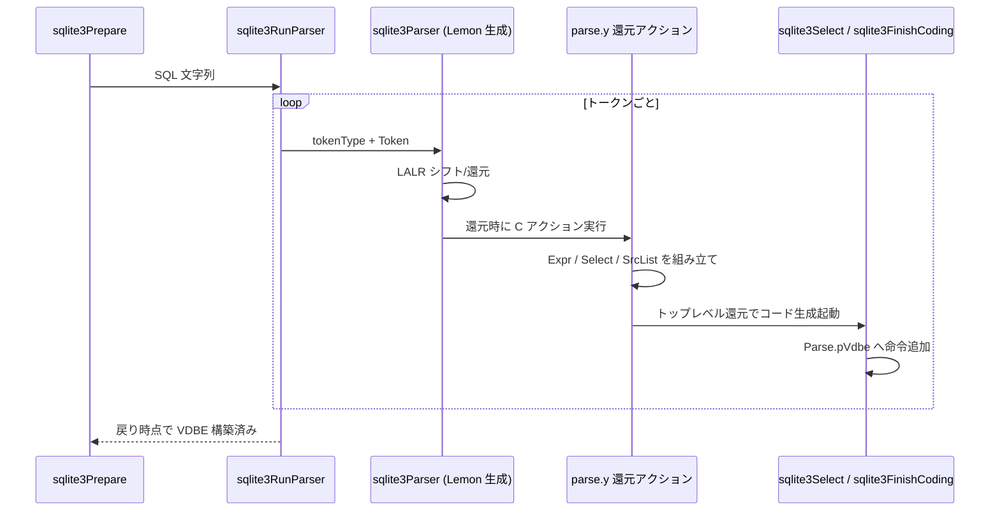

# 第4章 パーサ：Lemon と構文木

> **本章で読むソース**
>
> - [src/parse.y](https://github.com/sqlite/sqlite/blob/version-3.53.3/src/parse.y)
> - [tool/lemon.c](https://github.com/sqlite/sqlite/blob/version-3.53.3/tool/lemon.c)
> - [src/sqliteInt.h](https://github.com/sqlite/sqlite/blob/version-3.53.3/src/sqliteInt.h)
> - [main.mk](https://github.com/sqlite/sqlite/blob/version-3.53.3/main.mk)

## この章の狙い

第3章のトークナイザが送る `TK_*` トークン列を、文法に従って構文木へ組み立てるのがパーサである。
SQLite は yacc 系の **Lemon** 生成器を使い、文法ファイル `parse.y` から `parse.c` と `parse.h` をビルド時に生成する。
本章では Lemon の設定、`Select` や `Expr` を組み立てる文法アクション、そして `sqliteInt.h` の構文木型を対応づける。
生成物 `parse.c` と `parse.h` は引用せず、生成規則と文法ソースから読む。

## 前提

トークン型は `Token` 構造体であり、字句の先頭ポインタと長さを保持する（第3章）。
パーサのコンテキストは `Parse *pParse` で、接続 `sqlite3`、エラー状態、構築中の VDBE への参照をまとめる。

## Lemon によるコード生成

`tool/lemon.c` は SQLite に同梱された LALR(1) パーサ生成器である。
単一ファイルにまとめられており、`main.mk` からコンパイルして `parse.y` を処理する。

[tool/lemon.c L1-L5](https://github.com/sqlite/sqlite/blob/version-3.53.3/tool/lemon.c#L1-L5)

```c
/*
** This file contains all sources (including headers) to the LEMON
** LALR(1) parser generator.  The sources have been combined into a
** single file to make it easy to include LEMON in the source tree
** and Makefile of another program.
```

[main.mk L1116-L1117](https://github.com/sqlite/sqlite/blob/version-3.53.3/main.mk#L1116-L1117)

```makefile
lemon$(B.exe): $(MAKE_SANITY_CHECK) $(TOP)/tool/lemon.c $(TOP)/tool/lempar.c
	$(B.cc) -o $@ $(TOP)/tool/lemon.c
```

生成規則は `parse.y` をコピーし、`lemon` に渡して `parse.c` を出力する。

[main.mk L1457-L1459](https://github.com/sqlite/sqlite/blob/version-3.53.3/main.mk#L1457-L1459)

```makefile
parse.c:	$(TOP)/src/parse.y lemon$(B.exe)
	cp $(TOP)/src/parse.y .
	./lemon$(B.exe) $(OPT_FEATURE_FLAGS) $(OPTS) -S parse.y
```

`parse.y` 自身も、編集対象は Lemon 文法であり、生成された C コードは二次成果物だと警告している。

[src/parse.y L12-L20](https://github.com/sqlite/sqlite/blob/version-3.53.3/src/parse.y#L12-L20)

```c
** This file contains SQLite's SQL parser.
**
** The canonical source code to this file ("parse.y") is a Lemon grammar 
** file that specifies the input grammar and actions to take while parsing.
** That input file is processed by Lemon to generate a C-language 
** implementation of a parser for the given grammar.  You might be reading
** this comment as part of the translated C-code.  Edits should be made
** to the original parse.y sources.
```

## parse.y の Lemon 設定

トークンコードは `TK_` 接頭辞の整数定数である。
各トークンと多くの非終端記号のセマンティック値型は `Token` に統一され、デフォルトも `Token` になる。

[src/parse.y L30-L41](https://github.com/sqlite/sqlite/blob/version-3.53.3/src/parse.y#L30-L41)

```yacc
// All token codes are small integers with #defines that begin with "TK_"
%token_prefix TK_

// The type of the data attached to each token is Token.  This is also the
// default type for non-terminals.
//
%token_type {Token}
%default_type {Token}

// An extra argument to the constructor for the parser, which is available
// to all actions.
%extra_context {Parse *pParse}
```

構文エラー時は `parserSyntaxError` か汎用メッセージ `incomplete input` が `Parse` に記録される。
スタックは初期サイズ 50 で、上限は `parserStackSizeLimit` が返す値に従う。

[src/parse.y L24-L27](https://github.com/sqlite/sqlite/blob/version-3.53.3/src/parse.y#L24-L27)

```yacc
// Setup for the parser stack
%stack_size        50                        // Initial stack size
%stack_size_limit  parserStackSizeLimit      // Function returning max stack size
%realloc           parserStackRealloc        // realloc() for the stack
```

アマルガメーション時はパーサエンジンをヒープ確保せずスタック上に置く最適化が有効になる（第3章の `sqlite3Parser_ENGINEALWAYSONSTACK`）。

[src/parse.y L90-L99](https://github.com/sqlite/sqlite/blob/version-3.53.3/src/parse.y#L90-L99)

```c
** In the amalgamation, the parse.c file generated by lemon and the
** tokenize.c file are concatenated.  In that case, sqlite3RunParser()
** has access to the the size of the yyParser object and so the parser
** engine can be allocated from stack.  In that case, only the
** sqlite3ParserInit() and sqlite3ParserFinalize() routines are invoked
** and the sqlite3ParserAlloc() and sqlite3ParserFree() routines can be
** omitted.
*/
#ifdef SQLITE_AMALGAMATION
# define sqlite3Parser_ENGINEALWAYSONSTACK 1
```

## 構文木の型：Token、Expr、SrcList、Select

パーサアクションが組み立てる木のノード型は `sqliteInt.h` に定義される。

`Token` はヌル終端ではない文字列スライスである。

[src/sqliteInt.h L2887-L2890](https://github.com/sqlite/sqlite/blob/version-3.53.3/src/sqliteInt.h#L2887-L2890)

```c
struct Token {
  const char *z;     /* Text of the token.  Not NULL-terminated! */
  unsigned int n;    /* Number of characters in this token */
};
```

`Expr` は演算子 `op`、左右子 `pLeft`/`pRight`、リストやサブクエリを持つ `x` 共用体、カーソル番号 `iTable` などを持つ式ノードである。
`EP_TokenOnly` と `EP_Reduced` は、パーサが最初に割り当てる `Expr` のサイズを縮めるフラグではない。
通常の文法アクションが作る `Expr` は full-size で、`sqlite3ExprInt32` も `sizeof(Expr)` を確保する（後述）。
これらのフラグは主に `sqlite3ExprDup` の縮小複製経路で付与され、式木の複製時に不要フィールドを省く。

[src/sqliteInt.h L3039-L3044](https://github.com/sqlite/sqlite/blob/version-3.53.3/src/sqliteInt.h#L3039-L3044)

```c
struct Expr {
  u8 op;                 /* Operation performed by this node */
  char affExpr;          /* affinity, or RAISE type */
  u8 op2;                /* TK_REGISTER/TK_TRUTH: original value of Expr.op
                         ** TK_COLUMN: the value of p5 for OP_Column
                         ** TK_AGG_FUNCTION: nesting depth
                         ** TK_FUNCTION: NC_SelfRef flag if needs OP_PureFunc */
```

`SrcList` は FROM 句のテーブルとサブクエリの配列である。

[src/sqliteInt.h L3425-L3428](https://github.com/sqlite/sqlite/blob/version-3.53.3/src/sqliteInt.h#L3425-L3428)

```c
struct SrcList {
  int nSrc;             /* Number of tables or subqueries in the FROM clause */
  u32 nAlloc;           /* Number of entries allocated in a[] below */
  SrcItem a[FLEXARRAY]; /* One entry for each identifier on the list */
};
```

`Select` は結果列、FROM、WHERE、GROUP BY、ORDER BY、複合クエリの連鎖を1ノードにまとめる。

[src/sqliteInt.h L3597-L3605](https://github.com/sqlite/sqlite/blob/version-3.53.3/src/sqliteInt.h#L3597-L3605)

```c
struct Select {
  u8 op;                 /* One of: TK_UNION TK_ALL TK_INTERSECT TK_EXCEPT */
  LogEst nSelectRow;     /* Estimated number of result rows */
  u32 selFlags;          /* Various SF_* values */
  int iLimit, iOffset;   /* Memory registers holding LIMIT & OFFSET counters */
  u32 selId;             /* Unique identifier number for this SELECT */
  ExprList *pEList;      /* The fields of the result */
  SrcList *pSrc;         /* The FROM clause */
  Expr *pWhere;          /* The WHERE clause */
```

## 文法アクションによる木の構築

### SELECT 文

標準的な `SELECT ... FROM ... WHERE ...` は `oneselect` 規則で `sqlite3SelectNew` を呼び、各句を `Select` に格納する。

[src/parse.y L651-L655](https://github.com/sqlite/sqlite/blob/version-3.53.3/src/parse.y#L651-L655)

```yacc
oneselect(A) ::= SELECT distinct(D) selcollist(W) from(X) where_opt(Y)
                 groupby_opt(P) having_opt(Q) 
                 orderby_opt(Z) limit_opt(L). {
  A = sqlite3SelectNew(pParse,W,X,Y,P,Q,Z,D,L);
}
```

`VALUES` 句だけの SELECT は `SF_Values` フラグ付きで同じコンストラクタを使う。

[src/parse.y L675-L677](https://github.com/sqlite/sqlite/blob/version-3.53.3/src/parse.y#L675-L677)

```yacc
values(A) ::= VALUES LP nexprlist(X) RP. {
  A = sqlite3SelectNew(pParse,X,0,0,0,0,0,SF_Values,0);
}
```

### 結果列と Expr

`selcollist` は `sqlite3ExprListAppend` で `Expr` を積み上げる。
`SELECT *` は `TK_ASTERISK` の `Expr` として表現される。

[src/parse.y L712-L720](https://github.com/sqlite/sqlite/blob/version-3.53.3/src/parse.y#L712-L720)

```yacc
selcollist(A) ::= sclp(A) scanpt(B) expr(X) scanpt(Z) as(Y).     {
   A = sqlite3ExprListAppend(pParse, A, X);
   if( Y.n>0 ) sqlite3ExprListSetName(pParse, A, &Y, 1);
   sqlite3ExprListSetSpan(pParse,A,B,Z);
}
selcollist(A) ::= sclp(A) scanpt STAR(X). {
  Expr *p = sqlite3Expr(pParse->db, TK_ASTERISK, 0);
  sqlite3ExprSetErrorOffset(p, (int)(X.z - pParse->zTail));
  A = sqlite3ExprListAppend(pParse, A, p);
}
```

式の一般形は `expr` 規則が担う。
識別子は `tokenExpr` で `TK_ID` の `Expr` に変換され、ドット連結は `sqlite3PExpr` で `TK_DOT` ノードになる。

[src/parse.y L1177-L1181](https://github.com/sqlite/sqlite/blob/version-3.53.3/src/parse.y#L1177-L1181)

```yacc
expr(A) ::= idj(X).          {A=tokenExpr(pParse,TK_ID,X); /*A-overwrites-X*/}
expr(A) ::= nm(X) DOT nm(Y). {
  Expr *temp1 = tokenExpr(pParse,TK_ID,X);
  Expr *temp2 = tokenExpr(pParse,TK_ID,Y);
  A = sqlite3PExpr(pParse, TK_DOT, temp1, temp2);
}
```

整数リテラルは値が 32 ビットに収まれば `sqlite3ExprInt32` で即値ノードを割り当てる。
この経路は `u.iValue` に値を載せ、トークン文字列の複製を避ける最適化である（`EP_Reduced` とは別）。

[src/parse.y L1195-L1201](https://github.com/sqlite/sqlite/blob/version-3.53.3/src/parse.y#L1195-L1201)

```yacc
term(A) ::= INTEGER(X). {
  int iValue;
  if( sqlite3GetInt32(X.z, &iValue)==0 ){
    A = sqlite3ExprAlloc(pParse->db, TK_INTEGER, &X, 0);
  }else{
    A = sqlite3ExprInt32(pParse->db, iValue);
  }
}
```

[src/expr.c L981-L993](https://github.com/sqlite/sqlite/blob/version-3.53.3/src/expr.c#L981-L993)

```c
Expr *sqlite3ExprInt32(sqlite3 *db, int iVal){
  Expr *pNew = sqlite3DbMallocRawNN(db, sizeof(Expr));
  if( pNew ){
    memset(pNew, 0, sizeof(Expr));
    pNew->op = TK_INTEGER;
    pNew->iAgg = -1;
    pNew->flags = EP_IntValue|EP_Leaf|(iVal?EP_IsTrue:EP_IsFalse);
    pNew->u.iValue = iVal;
#if SQLITE_MAX_EXPR_DEPTH>0
    pNew->nHeight = 1;
#endif 
  }
  return pNew;
}
```

### FROM 句と SrcList

`from` は `seltablist` を受け取り、`sqlite3SrcListAppendFromTerm` でテーブル名、別名、JOIN 条件を `SrcList` に追加する。

[src/parse.y L750-L753](https://github.com/sqlite/sqlite/blob/version-3.53.3/src/parse.y#L750-L753)

```yacc
from(A) ::= FROM seltablist(X). {
  A = X;
  sqlite3SrcListShiftJoinType(pParse,A);
}
```

[src/parse.y L762-L764](https://github.com/sqlite/sqlite/blob/version-3.53.3/src/parse.y#L762-L764)

```yacc
seltablist(A) ::= stl_prefix(A) nm(Y) dbnm(D) as(Z) on_using(N). {
  A = sqlite3SrcListAppendFromTerm(pParse,A,&Y,&D,&Z,0,&N);
}
```

## 還元アクションとコード生成

SQLite はパース完了後に別フェーズで VDBE を組み立てるのではない。
Lemon が還元するたびに `parse.y` の C アクションが走り、トップレベル規則の還元時点で `sqlite3Select` や `sqlite3FinishCoding` が呼ばれてコード生成が起動する。
`Expr`、`Select`、`SrcList` は文法アクション間の中間木として組み立てられ、トップレベル還元で `build.c` や `select.c` へ渡される。

トップレベル `SELECT` は還元直後に `sqlite3Select` が呼ばれ、続けて `Select` 木が削除される。

[src/parse.y L520-L528](https://github.com/sqlite/sqlite/blob/version-3.53.3/src/parse.y#L520-L528)

```yacc
cmd ::= select(X).  {
  SelectDest dest = {SRT_Output, 0, 0, 0, 0, 0, 0};
  if( (pParse->db->mDbFlags & DBFLAG_EncodingFixed)!=0
   || sqlite3ReadSchema(pParse)==SQLITE_OK
  ){
    sqlite3Select(pParse, X, &dest);
  }
  sqlite3SelectDelete(pParse->db, X);
}
```

文全体の終端では `cmdx` 還元が `sqlite3FinishCoding` を呼ぶ。

[src/parse.y L176-L176](https://github.com/sqlite/sqlite/blob/version-3.53.3/src/parse.y#L176-L176)

```yacc
cmdx ::= cmd.           { sqlite3FinishCoding(pParse); }
```

`sqlite3Prepare` が `sqlite3RunParser` を呼び、パーサが戻った時点で `Parse.pVdbe` は構築済みである（`db->init.busy` のときは VDBE 生成を抑止する例外あり）。

[src/prepare.c L779-L779](https://github.com/sqlite/sqlite/blob/version-3.53.3/src/prepare.c#L779-L779)

```c
      sqlite3RunParser(&sParse, zSqlCopy);
```

## 処理の流れ



本章で追った構文木は、還元アクションの引数として組み立てられ、トップレベル還元と同時に VDBE 生成へ消費される。

## 高速化と最適化の工夫

アマルガメーション時は `sqlite3Parser_ENGINEALWAYSONSTACK` によりパーサオブジェクトをスタック確保し、`sqlite3ParserAlloc`/`Free` の malloc を省略できる（`parse.y` 引用参照）。

`EP_TokenOnly` と `EP_Reduced` は `sqlite3ExprDup` が縮小複製するときに付与される。
`dupedExprStructSize` は子を持つノードを `EP_Reduced`、葉に近いノードを `EP_TokenOnly` へ切り詰める。

[src/expr.c L1512-L1544](https://github.com/sqlite/sqlite/blob/version-3.53.3/src/expr.c#L1512-L1544)

```c
**      EXPR_TOKENONLYSIZE | EP_TokenOnly
**
** The size of the structure can be found by masking the return value
** of this routine with 0xfff.  The flags can be found by masking the
** return value with EP_Reduced|EP_TokenOnly.
**
** Note that with flags==EXPRDUP_REDUCE, this routines works on full-size
** (unreduced) Expr objects as they or originally constructed by the parser.
static int dupedExprStructSize(const Expr *p, int flags){
  int nSize;
  assert( flags==EXPRDUP_REDUCE || flags==0 ); /* Only one flag value allowed */
  assert( EXPR_FULLSIZE<=0xfff );
  assert( (0xfff & (EP_Reduced|EP_TokenOnly))==0 );
  if( 0==flags || ExprHasProperty(p, EP_FullSize) ){
    nSize = EXPR_FULLSIZE;
  }else{
    assert( !ExprHasProperty(p, EP_TokenOnly|EP_Reduced) );
    assert( !ExprHasProperty(p, EP_OuterON) );
    assert( !ExprHasVVAProperty(p, EP_NoReduce) );
    if( p->pLeft || p->x.pList ){
      nSize = EXPR_REDUCEDSIZE | EP_Reduced;
    }else{
      assert( p->pRight==0 );
      nSize = EXPR_TOKENONLYSIZE | EP_TokenOnly;
    }
  }
  return nSize;
}
```

整数リテラルは可能なら `sqlite3ExprInt32` で即値ノードにし、トークン文字列の複製を避ける（`INTEGER` 規則と `sqlite3ExprInt32` 引用参照）。

## まとめ

`parse.y` が SQL 文法とセマンティックアクションの真のソースであり、`lemon` が `parse.c` を生成する。
パーサは `Token` を受け取り、還元アクションで `Expr`、`SrcList`、`Select` を組み立てる。
トップレベル還元では `sqlite3Select` や `sqlite3FinishCoding` が同じパース中に VDBE 生成を起動し、`sqlite3RunParser` 戻り時点で `Parse.pVdbe` が揃う。
型定義は `sqliteInt.h` にあり、文法アクションの関数名（`sqlite3SelectNew`、`sqlite3PExpr` など）と対応づけて読む。

## 関連する章

- 第3章のトークナイザが供給する `TK_*` と、本章の `%token` 宣言が一致する。
- 第5章で `CREATE TABLE` 文が `sqlite3StartTable` 系へ落ちる経路と、スキーマ初期化時の `db->init.busy` 動作を読む。
- 第6章以降で還元アクションから起動した `Expr` の VDBE lowering を追う。
