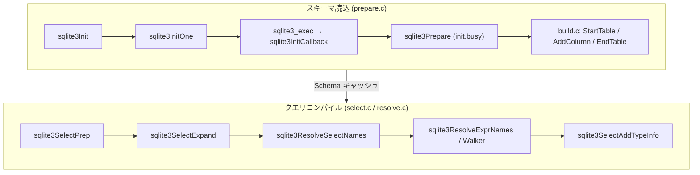

# 第5章 スキーマ構築と名前解決

> **本章で読むソース**
>
> - [src/prepare.c](https://github.com/sqlite/sqlite/blob/version-3.53.3/src/prepare.c)
> - [src/build.c](https://github.com/sqlite/sqlite/blob/version-3.53.3/src/build.c)
> - [src/select.c](https://github.com/sqlite/sqlite/blob/version-3.53.3/src/select.c)
> - [src/resolve.c](https://github.com/sqlite/sqlite/blob/version-3.53.3/src/resolve.c)

## この章の狙い

SQLite はディスク上の `sqlite_schema`（または `sqlite_temp_schema`）からメタデータを読み込み、メモリ上のスキーマキャッシュを構築する。
本章では `sqlite3Init` 系の読込経路と、`CREATE TABLE` 処理における `sqlite3StartTable` から `sqlite3EndTable` までのテーブル構築を追う。
クエリコンパイル時には `sqlite3SelectPrep` が名前解決へ委譲し、`sqlite3ResolveSelectNames` と `sqlite3ResolveExprNames` が識別子をカラム参照へ落とし込む。
`callback.c` は照合順序や組み込み関数登録の補助であり、スキーマ読込や SELECT 準備の主経路ではない。

## 前提

第4章までで、パーサの還元アクションが `Select` や `Expr` を組み立て、トップレベル還元でコード生成を起動することは確認済みである。
本章はその木を「スキーマに登録する」段階（DDL）と、「既存スキーマに照らして意味を確定する」段階（名前解決）に分けて読む。

## スキーマの読込：sqlite3Init 系

接続が初めてスキーマを必要とするとき、`sqlite3ReadSchema` が `sqlite3Init` を呼ぶ。
`sqlite3Init` はメイン DB（添字 0）を先に、続いて temp など他 DB を `sqlite3InitOne` で初期化する。

[src/prepare.c L438-L457](https://github.com/sqlite/sqlite/blob/version-3.53.3/src/prepare.c#L438-L457)

```c
int sqlite3Init(sqlite3 *db, char **pzErrMsg){
  int i, rc;
  int commit_internal = !(db->mDbFlags&DBFLAG_SchemaChange);
  
  assert( sqlite3_mutex_held(db->mutex) );
  assert( sqlite3BtreeHoldsMutex(db->aDb[0].pBt) );
  assert( db->init.busy==0 );
  ENC(db) = SCHEMA_ENC(db);
  assert( db->nDb>0 );
  /* Do the main schema first */
  if( !DbHasProperty(db, 0, DB_SchemaLoaded) ){
    rc = sqlite3InitOne(db, 0, pzErrMsg, 0);
    if( rc ) return rc;
  }
  /* All other schemas after the main schema. The "temp" schema must be last */
  for(i=db->nDb-1; i>0; i--){
    assert( i==1 || sqlite3BtreeHoldsMutex(db->aDb[i].pBt) );
    if( !DbHasProperty(db, i, DB_SchemaLoaded) ){
      rc = sqlite3InitOne(db, i, pzErrMsg, 0);
      if( rc ) return rc;
    }
  }
```

`sqlite3InitOne` はまずインメモリのスキーマ表そのもの（`sqlite_schema` 相当）をパーサで構築する。
その後、実テーブルから `SELECT * FROM ... ORDER BY rowid` を実行し、各行を `sqlite3InitCallback` に渡す。

[src/prepare.c L221-L240](https://github.com/sqlite/sqlite/blob/version-3.53.3/src/prepare.c#L221-L240)

```c
  /* Construct the in-memory representation schema tables (sqlite_schema or
  ** sqlite_temp_schema) by invoking the parser directly.  The appropriate
  ** table name will be inserted automatically by the parser so we can just
  ** use the abbreviation "x" here.  The parser will also automatically tag
  ** the schema table as read-only. */
  azArg[0] = "table";
  azArg[1] = zSchemaTabName = SCHEMA_TABLE(iDb);
  azArg[2] = azArg[1];
  azArg[3] = "1";
  azArg[4] = "CREATE TABLE x(type text,name text,tbl_name text,"
                            "rootpage int,sql text)";
  azArg[5] = 0;
  initData.db = db;
  initData.iDb = iDb;
  initData.rc = SQLITE_OK;
  initData.pzErrMsg = pzErrMsg;
  initData.mInitFlags = mFlags;
  initData.nInitRow = 0;
  initData.mxPage = 0;
  sqlite3InitCallback(&initData, 5, (char **)azArg, 0);
```

[src/prepare.c L364-L374](https://github.com/sqlite/sqlite/blob/version-3.53.3/src/prepare.c#L364-L374)

```c
    zSql = sqlite3MPrintf(db, 
        "SELECT*FROM\"%w\".%s ORDER BY rowid",
        db->aDb[iDb].zDbSName, zSchemaTabName);
#ifndef SQLITE_OMIT_AUTHORIZATION
    {
      sqlite3_xauth xAuth;
      xAuth = db->xAuth;
      db->xAuth = 0;
#endif
      rc = sqlite3_exec(db, zSql, sqlite3InitCallback, &initData, 0);
```

### sqlite3InitCallback：CREATE 文の再パース

コールバックは `sqlite_schema.sql` 列の DDL 文字列を受け取る。
`CREATE` で始まる行は `sqlite3Prepare` で再コンパイルされるが、`db->init.busy` が立っているため VDBE は生成されず、内部メタデータ構造だけが更新される。

[src/prepare.c L115-L148](https://github.com/sqlite/sqlite/blob/version-3.53.3/src/prepare.c#L115-L148)

```c
  }else if( argv[4]
         && 'c'==sqlite3UpperToLower[(unsigned char)argv[4][0]]
         && 'r'==sqlite3UpperToLower[(unsigned char)argv[4][1]] ){
    /* Call the parser to process a CREATE TABLE, INDEX or VIEW.
    ** But because db->init.busy is set to 1, no VDBE code is generated
    ** or executed.  All the parser does is build the internal data
    ** structures that describe the table, index, or view.
    **
    ** No other valid SQL statement, other than the variable CREATE statements,
    ** can begin with the letters "C" and "R".  Thus, it is not possible run
    ** any other kind of statement while parsing the schema, even a corrupt
    ** schema.
    */
    int rc;
    u8 saved_iDb = db->init.iDb;
    sqlite3_stmt *pStmt;
    TESTONLY(int rcp);            /* Return code from sqlite3_prepare() */

    assert( db->init.busy );
    db->init.iDb = iDb;
    if( sqlite3GetUInt32(argv[3], &db->init.newTnum)==0
     || (db->init.newTnum>pData->mxPage && pData->mxPage>0)
    ){
      if( sqlite3Config.bExtraSchemaChecks ){
        corruptSchema(pData, argv, "invalid rootpage");
      }
    }
    db->init.orphanTrigger = 0;
    db->init.azInit = (const char**)argv;
    pStmt = 0;
    TESTONLY(rcp = ) sqlite3Prepare(db, argv[4], -1, 0, 0, &pStmt, 0);
    rc = db->errCode;
    assert( (rc&0xFF)==(rcp&0xFF) );
    db->init.iDb = saved_iDb;
```

`db->init.iDb` に対象 DB を載せ、`argv[3]` から `db->init.newTnum`（ルートページ番号）を読み取ったうえで `sqlite3Prepare` が DDL を再パースする。
`sqlite3EndTable` は `db->init.busy` のとき `db->init.newTnum` を `Table.tnum` へ写し、ディスクへの再書き込みを避ける（後述の `build.c` 引用参照）。
この設計により、通常の `CREATE TABLE` パスと同じ `build.c` 関数がスキーマ再生でも使い回される。

## DDL によるテーブル構築：build.c

`CREATE TABLE` の解析中、パーサは `sqlite3StartTable` で `Table` オブジェクトを確保し、`pParse->pNewTable` に保持する。

[src/build.c L1206-L1214](https://github.com/sqlite/sqlite/blob/version-3.53.3/src/build.c#L1206-L1214)

```c
void sqlite3StartTable(
  Parse *pParse,   /* Parser context */
  Token *pName1,   /* First part of the name of the table or view */
  Token *pName2,   /* Second part of the name of the table or view */
  int isTemp,      /* True if this is a TEMP table */
  int isView,      /* True if this is a VIEW */
  int isVirtual,   /* True if this is a VIRTUAL table */
  int noErr        /* Do nothing if table already exists */
){
```

列定義ごとに `sqlite3AddColumn` が呼ばれ、`Column` 配列を拡張する。
標準型名（INT、TEXT など）は `Column.eType` に符号化し、型名文字列の保存を省略できる。

[src/build.c L1490-L1502](https://github.com/sqlite/sqlite/blob/version-3.53.3/src/build.c#L1490-L1502)

```c
void sqlite3AddColumn(Parse *pParse, Token sName, Token sType){
  Table *p;
  int i;
  char *z;
  char *zType;
  Column *pCol;
  sqlite3 *db = pParse->db;
  Column *aNew;
  u8 eType = COLTYPE_CUSTOM;
  u8 szEst = 1;
  char affinity = SQLITE_AFF_BLOB;

  if( (p = pParse->pNewTable)==0 ) return;
```

[src/build.c L1526-L1537](https://github.com/sqlite/sqlite/blob/version-3.53.3/src/build.c#L1526-L1537)

```c
  /* Check for standard typenames.  For standard typenames we will
  ** set the Column.eType field rather than storing the typename after
  ** the column name, in order to save space. */
  if( sType.n>=3 ){
    sqlite3DequoteToken(&sType);
    for(i=0; i<SQLITE_N_STDTYPE; i++){
       if( sType.n==sqlite3StdTypeLen[i]
        && sqlite3_strnicmp(sType.z, sqlite3StdType[i], sType.n)==0
       ){
         sType.n = 0;
         eType = i+1;
         affinity = sqlite3StdTypeAffinity[i];
```

`sqlite3EndTable` は制約処理、インデックス生成、`sqlite_master` への登録を完了する。
スキーマ読込中（`db->init.busy`）はルートページ番号を `db->init.newTnum` から取り、ディスクへの再書き込みを避ける。

[src/build.c L2659-L2674](https://github.com/sqlite/sqlite/blob/version-3.53.3/src/build.c#L2659-L2674)

```c
  /* If the db->init.busy is 1 it means we are reading the SQL off the
  ** "sqlite_schema" or "sqlite_temp_schema" table on the disk.
  ** So do not write to the disk again.  Extract the root page number
  ** for the table from the db->init.newTnum field.  (The page number
  ** should have been put there by the sqliteOpenCb routine.)
  **
  ** If the root page number is 1, that means this is the sqlite_schema
  ** table itself.  So mark it read-only.
  */
  if( db->init.busy ){
    if( pSelect || (!IsOrdinaryTable(p) && db->init.newTnum) ){
      sqlite3ErrorMsg(pParse, "");
      return;
    }
    p->tnum = db->init.newTnum;
    if( p->tnum==1 ) p->tabFlags |= TF_Readonly;
  }
```

## SELECT の準備と名前解決

クエリコンパイルでは `sqlite3SelectPrep` が SELECT 木の準備をまとめて行う。
まず `sqlite3SelectExpand` で `*` 展開などを行い、続けて `sqlite3ResolveSelectNames` で識別子を解決し、最後に型情報を付与する。

[src/select.c L6463-L6476](https://github.com/sqlite/sqlite/blob/version-3.53.3/src/select.c#L6463-L6476)

```c
void sqlite3SelectPrep(
  Parse *pParse,         /* The parser context */
  Select *p,             /* The SELECT statement being coded. */
  NameContext *pOuterNC  /* Name context for container */
){
  assert( p!=0 || pParse->db->mallocFailed );
  assert( pParse->db->pParse==pParse );
  if( pParse->db->mallocFailed ) return;
  if( p->selFlags & SF_HasTypeInfo ) return;
  sqlite3SelectExpand(pParse, p);
  if( pParse->nErr ) return;
  sqlite3ResolveSelectNames(pParse, p, pOuterNC);
  if( pParse->nErr ) return;
  sqlite3SelectAddTypeInfo(pParse, p);
}
```

`sqlite3ResolveSelectNames` は `Walker` を使い、SELECT 木全体を走査して `resolveExprStep` と `resolveSelectStep` を適用する。

[src/resolve.c L2265-L2278](https://github.com/sqlite/sqlite/blob/version-3.53.3/src/resolve.c#L2265-L2278)

```c
void sqlite3ResolveSelectNames(
  Parse *pParse,         /* The parser context */
  Select *p,             /* The SELECT statement being coded. */
  NameContext *pOuterNC  /* Name context for parent SELECT statement */
){
  Walker w;

  assert( p!=0 );
  w.xExprCallback = resolveExprStep;
  w.xSelectCallback = resolveSelectStep;
  w.xSelectCallback2 = 0;
  w.pParse = pParse;
  w.u.pNC = pOuterNC;
  sqlite3WalkSelect(&w, p);
}
```

式単体の解決は `sqlite3ResolveExprNames` が担う。
`NameContext` に外側のスコープ情報を載せ、`sqlite3WalkExprNN` で `Expr` 木を再帰的に訪問する。

[src/resolve.c L2166-L2188](https://github.com/sqlite/sqlite/blob/version-3.53.3/src/resolve.c#L2166-L2188)

```c
int sqlite3ResolveExprNames(
  NameContext *pNC,       /* Namespace to resolve expressions in. */
  Expr *pExpr             /* The expression to be analyzed. */
){
  int savedHasAgg;
  Walker w;

  if( pExpr==0 ) return SQLITE_OK;
  savedHasAgg = pNC->ncFlags & (NC_HasAgg|NC_MinMaxAgg|NC_HasWin|NC_OrderAgg);
  pNC->ncFlags &= ~(NC_HasAgg|NC_MinMaxAgg|NC_HasWin|NC_OrderAgg);
  w.pParse = pNC->pParse;
  w.xExprCallback = resolveExprStep;
  w.xSelectCallback = (pNC->ncFlags & NC_NoSelect) ? 0 : resolveSelectStep;
  w.xSelectCallback2 = 0;
  w.u.pNC = pNC;
#if SQLITE_MAX_EXPR_DEPTH>0
  w.pParse->nHeight += pExpr->nHeight;
  if( sqlite3ExprCheckHeight(w.pParse, w.pParse->nHeight) ){
    return SQLITE_ERROR;
  }
#endif
  assert( pExpr!=0 );
  sqlite3WalkExprNN(&w, pExpr);
```

名前解決が成功すると、未解決の `TK_ID` は `TK_COLUMN` へ置き換わり、`iTable` と `iColumn` にカーソル番号と列番号が入る。
`resolveExprStep` が `TK_ID` と `TK_DOT` を分解し、`lookupName` へ委譲する。

[src/resolve.c L1093-L1128](https://github.com/sqlite/sqlite/blob/version-3.53.3/src/resolve.c#L1093-L1128)

```c
    case TK_ID:
    case TK_DOT: {
      const char *zTable;
      const char *zDb;
      Expr *pRight;

      if( pExpr->op==TK_ID ){
        zDb = 0;
        zTable = 0;
        assert( !ExprHasProperty(pExpr, EP_IntValue) );
        pRight = pExpr;
      }else{
        Expr *pLeft = pExpr->pLeft;
        testcase( pNC->ncFlags & NC_IdxExpr );
        testcase( pNC->ncFlags & NC_GenCol );
        sqlite3ResolveNotValid(pParse, pNC, "the \".\" operator",
                               NC_IdxExpr|NC_GenCol, 0, pExpr);
        pRight = pExpr->pRight;
        if( pRight->op==TK_ID ){
          zDb = 0;
        }else{
          assert( pRight->op==TK_DOT );
          assert( !ExprHasProperty(pRight, EP_IntValue) );
          zDb = pLeft->u.zToken;
          pLeft = pRight->pLeft;
          pRight = pRight->pRight;
        }
        assert( ExprUseUToken(pLeft) && ExprUseUToken(pRight) );
        zTable = pLeft->u.zToken;
        assert( ExprUseYTab(pExpr) );
        if( IN_RENAME_OBJECT ){
          sqlite3RenameTokenRemap(pParse, (void*)pExpr, (void*)pRight);
          sqlite3RenameTokenRemap(pParse, (void*)&pExpr->y.pTab, (void*)pLeft);
        }
      }
      return lookupName(pParse, zDb, zTable, pRight, pNC, pExpr);
    }
```

`lookupName` は `NameContext` を内側から外側へ辿り、`SrcList` の各 `SrcItem` と列名を照合する。
一致候補が1件に定まれば `iTable`（カーソル番号）と `y.pTab` を設定し、列インデックスを `iColumn` へ書き込む。

[src/resolve.c L339-L347](https://github.com/sqlite/sqlite/blob/version-3.53.3/src/resolve.c#L339-L347)

```c
  /* Start at the inner-most context and move outward until a match is found */
  assert( pNC && cnt==0 );
  do{
    ExprList *pEList;
    SrcList *pSrcList = pNC->pSrcList;

    if( pSrcList ){
      for(i=0, pItem=pSrcList->a; i<pSrcList->nSrc; i++, pItem++){
        pTab = pItem->pSTab;
```

[src/resolve.c L437-L470](https://github.com/sqlite/sqlite/blob/version-3.53.3/src/resolve.c#L437-L470)

```c
        j = sqlite3ColumnIndex(pTab, zCol);
        if( j>=0 ){
          if( cnt>0 ){
            if( pItem->fg.isUsing==0
             || sqlite3IdListIndex(pItem->u3.pUsing, zCol)<0
            ){
              /* Two or more tables have the same column name which is
              ** not joined by USING.  This is an error.  Signal as much
              ** by clearing pFJMatch and letting cnt go above 1. */
              sqlite3ExprListDelete(db, pFJMatch);
              pFJMatch = 0;
            }else
            if( (pItem->fg.jointype & JT_RIGHT)==0 ){
              /* An INNER or LEFT JOIN.  Use the left-most table */
              continue;
            }else
            if( (pItem->fg.jointype & JT_LEFT)==0 ){
              /* A RIGHT JOIN.  Use the right-most table */
              cnt = 0;
              sqlite3ExprListDelete(db, pFJMatch);
              pFJMatch = 0;
            }else{
              /* For a FULL JOIN, we must construct a coalesce() func */
              extendFJMatch(pParse, &pFJMatch, pMatch, pExpr->iColumn);
            }
          }
          cnt++;
          pMatch = pItem;
          /* Substitute the rowid (column -1) for the INTEGER PRIMARY KEY */
          pExpr->iColumn = j==pTab->iPKey ? -1 : (i16)j;
          if( pItem->fg.isNestedFrom ){
            sqlite3SrcItemColumnUsed(pItem, j);
          }
        }
```

[src/resolve.c L505-L513](https://github.com/sqlite/sqlite/blob/version-3.53.3/src/resolve.c#L505-L513)

```c
      if( pMatch ){
        pExpr->iTable = pMatch->iCursor;
        assert( ExprUseYTab(pExpr) );
        pExpr->y.pTab = pMatch->pSTab;
        if( (pMatch->fg.jointype & (JT_LEFT|JT_LTORJ))!=0 ){
          ExprSetProperty(pExpr, EP_CanBeNull);
        }
        pSchema = pExpr->y.pTab->pSchema;
      }
```

候補が0件または複数件ならエラーを出し、成功時は `colUsed` を更新して `TK_COLUMN` へ置き換える。

[src/resolve.c L752-L854](https://github.com/sqlite/sqlite/blob/version-3.53.3/src/resolve.c#L752-L854)

```c
  /*
  ** cnt==0 means there was not match.
  ** cnt>1 means there were two or more matches.
  */
  assert( pFJMatch==0 || cnt>0 );
  assert( !ExprHasProperty(pExpr, EP_xIsSelect|EP_IntValue) );
  if( cnt!=1 ){
    const char *zErr;
    // ... (中略) ...
    zErr = cnt==0 ? "no such column" : "ambiguous column name";
    // ... (中略) ...
    sqlite3RecordErrorOffsetOfExpr(pParse->db, pExpr);
    pParse->checkSchema = 1;
    pTopNC->nNcErr++;
    eNewExprOp = TK_NULL;
  }
  // ... (中略) ...
  if( pMatch ){
    if( pExpr->iColumn>=0 ){
      pMatch->colUsed |= sqlite3ExprColUsed(pExpr);
    }else{
      pMatch->fg.rowidUsed = 1;
    }
  }

  pExpr->op = eNewExprOp;
lookupname_end:
  if( cnt==1 ){
    assert( pNC!=0 );
    // ... (中略) ...
    for(;;){
      assert( pTopNC!=0 );
      pTopNC->nRef++;
      if( pTopNC==pNC ) break;
      pTopNC = pTopNC->pNext;
    }
    return WRC_Prune;
  } else {
    return WRC_Abort;
  }
```

## 処理の流れ



## 高速化と最適化の工夫

スキーマ読込中は `db->init.busy` により VDBE バイトコード生成を省略し、パーサと `build.c` だけでメタデータを復元する。
ディスク上の `CREATE` 文をそのまま再実行するより、余分な命令割り当てと実行オーバーヘッドを避けられる（`sqlite3InitCallback` コメント引用参照）。

`sqlite3AddColumn` の標準型符号化は、スキーマキャッシュ内の列メタデータ占有を削る。
テーブル列数が多いデータベースでは、型名文字列を毎列保存しない効果が積み上がる（`build.c` 引用参照）。

`sqlite3SelectPrep` は `SF_HasTypeInfo` が既に立っている `Select` を即 return する。
同一 `Select` 木への重複した準備呼び出しで、展開と名前解決を二重に走らせないためのガードである（`select.c` 引用参照）。

## 補助モジュールについて

`callback.c` はアプリケーション定義関数や照合順序の登録に関わるが、`sqlite3Init` から `sqlite3InitCallback` へ至るスキーマ再生の主経路には乗らない。
本章で追ったのは `prepare.c` の init 系、`build.c` の DDL 構築、`select.c` と `resolve.c` の名前解決である。

## まとめ

起動時および初回アクセス時、SQLite は `sqlite_schema` の各行を `sqlite3InitCallback` 経由で再パースし、メモリ上の `Table` と `Index` を構築する。
通常の `CREATE TABLE` も同じ `sqlite3StartTable`、`sqlite3AddColumn`、`sqlite3EndTable` を通る。
クエリ側では `sqlite3SelectPrep` が展開と名前解決を順に呼び、解決済み `Expr` が後段のコード生成（第6章以降）へ渡る。

## 関連する章

- 第4章のパーサアクションが `build.c` 関数を呼ぶ接続を確認する。
- 第6章以降で名前解決済み `Expr` から VDBE 命令が生成される流れを読む。
- 第8章以降のクエリプランナは、解決済み `Select` と `SrcList` を入力とする。
