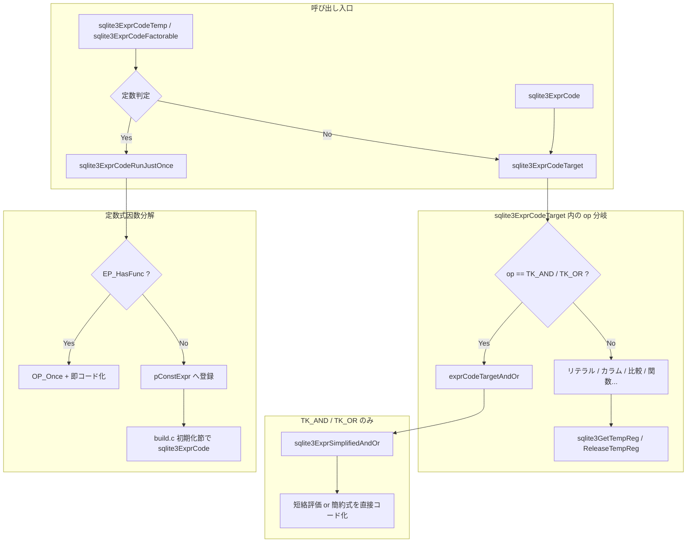

# 第6章 式のコード生成と定数式因数分解

> **本章で読むソース**
>
> - [src/expr.c](https://github.com/sqlite/sqlite/blob/version-3.53.3/src/expr.c)
> - [src/build.c](https://github.com/sqlite/sqlite/blob/version-3.53.3/src/build.c)

## この章の狙い

第5章までで名前解決済みの `Expr` 木が手元に揃った。
本章では `expr.c` がその木を VDBE 命令列へ落とす経路を追う。
入口は `sqlite3ExprCodeTarget` であり、子式を再帰的にコード化しながらレジスタへ値を載せる。
ここで行われるのはコンパイル時の式簡約と、実行開始時に一度だけ評価する定数式因数分解である。
コンパイル時にリテラルを畳み込んで木を書き換える最適化とは別物として区別する。

## 前提

パーサが構築した `Expr` は `op` フィールドで種別を表す（`TK_COLUMN`、`TK_INTEGER`、`TK_AND` など）。
`sqlite3ExprCode` は結果を指定レジスタへ必ず置く薄いラッパーで、実処理は `sqlite3ExprCodeTarget` が担う。
`Parse` 構造体の `nMem` は割り当て済みレジスタ数、`aTempReg` は解放済み一時レジスタの再利用プールである。
`pParse->pConstExpr` はループ外へ持ち出す定数式の待ち行列で、`build.c` の初期化節でまとめてコード化される。

## sqlite3ExprCodeTarget：再帰的ディスパッチ

`sqlite3ExprCodeTarget` は `pExpr->op` を `switch` で分岐し、葉（リテラル、カラム参照）から内部ノード（比較、論理演算、関数呼び出し）へ再帰する。
戻り値は結果が入ったレジスタ番号で、呼び出し元は `target` と一致しない場合に `OP_Copy` や `OP_SCopy` で移す。

[src/expr.c L4940-L4974](https://github.com/sqlite/sqlite/blob/version-3.53.3/src/expr.c#L4940-L4974)

```c
/*
** Generate code into the current Vdbe to evaluate the given
** expression.  Attempt to store the results in register "target".
** Return the register where results are stored.
**
** With this routine, there is no guarantee that results will
** be stored in target.  The result might be stored in some other
** register if it is convenient to do so.  The calling function
** must check the return code and move the results to the desired
** register.
*/
int sqlite3ExprCodeTarget(Parse *pParse, Expr *pExpr, int target){
  Vdbe *v = pParse->pVdbe;  /* The VM under construction */
  int op;                   /* The opcode being coded */
  int inReg = target;       /* Results stored in register inReg */
  int regFree1 = 0;         /* If non-zero free this temporary register */
  int regFree2 = 0;         /* If non-zero free this temporary register */
  int r1, r2;               /* Various register numbers */
  Expr tempX;               /* Temporary expression node */
  int p5 = 0;

  assert( target>0 && target<=pParse->nMem );
  assert( v!=0 );

expr_code_doover:
  if( pExpr==0 ){
    op = TK_NULL;
  }else if( pParse->pIdxEpr!=0
   && !ExprHasProperty(pExpr, EP_Leaf)
   && (r1 = sqlite3IndexedExprLookup(pParse, pExpr, target))>=0
  ){
    return r1;
  }else{
    assert( !ExprHasVVAProperty(pExpr,EP_Immutable) );
    op = pExpr->op;
  }
  assert( op!=TK_ORDER );
  switch( op ){
```

リテラルは専用 opcode へ直結する。
整数定数は `codeInteger`、文字列は `OP_String` 相当のロード命令である。

[src/expr.c L5109-L5127](https://github.com/sqlite/sqlite/blob/version-3.53.3/src/expr.c#L5109-L5127)

```c
    case TK_INTEGER: {
      codeInteger(pParse, pExpr, 0, target);
      return target;
    }
    case TK_TRUEFALSE: {
      sqlite3VdbeAddOp2(v, OP_Integer, sqlite3ExprTruthValue(pExpr), target);
      return target;
    }
#ifndef SQLITE_OMIT_FLOATING_POINT
    case TK_FLOAT: {
      assert( !ExprHasProperty(pExpr, EP_IntValue) );
      codeReal(v, pExpr->u.zToken, 0, target);
      return target;
    }
#endif
    case TK_STRING: {
      assert( !ExprHasProperty(pExpr, EP_IntValue) );
      sqlite3VdbeLoadString(v, target, pExpr->u.zToken);
      return target;
    }
```

比較や二項演算では左右を `sqlite3ExprCodeTemp` で別レジスタに載せ、演算 opcode を発行する。
`sqlite3ExprCodeTemp` は定数式なら因数分解経路へ入る（後述）。

[src/expr.c L5186-L5262](https://github.com/sqlite/sqlite/blob/version-3.53.3/src/expr.c#L5186-L5262)

```c
    case TK_LT:
    case TK_LE:
    case TK_GT:
    case TK_GE:
    case TK_NE:
    case TK_EQ: {
      Expr *pLeft = pExpr->pLeft;
      int addrIsNull = 0;
      if( sqlite3ExprIsVector(pLeft) ){
        codeVectorCompare(pParse, pExpr, target, op, p5);
      }else{
        if( ExprHasProperty(pExpr, EP_Subquery) && p5!=SQLITE_NULLEQ ){
          addrIsNull = exprComputeOperands(pParse, pExpr,
                                     &r1, &r2, &regFree1, &regFree2);
        }else{
          r1 = sqlite3ExprCodeTemp(pParse, pExpr->pLeft, &regFree1);
          r2 = sqlite3ExprCodeTemp(pParse, pExpr->pRight, &regFree2);
        }
        sqlite3VdbeAddOp2(v, OP_Integer, 1, inReg);
        codeCompare(pParse, pLeft, pExpr->pRight, op, r1, r2,
            sqlite3VdbeCurrentAddr(v)+2, p5,
            ExprHasProperty(pExpr,EP_Commuted));
        // ... (中略) ...
      }
      break;
    }
    case TK_AND:
    case TK_OR: {
      inReg = exprCodeTargetAndOr(pParse, pExpr, target, &regFree1);
      break;
    }
    case TK_PLUS:
    case TK_STAR:
    case TK_MINUS:
    case TK_REM:
    case TK_BITAND:
    case TK_BITOR:
    case TK_SLASH:
    case TK_LSHIFT:
    case TK_RSHIFT:
    case TK_CONCAT: {
      int addrIsNull;
      // ... (中略) ...
      if( ExprHasProperty(pExpr, EP_Subquery) ){
        addrIsNull = exprComputeOperands(pParse, pExpr,
                                   &r1, &r2, &regFree1, &regFree2);
      }else{
        r1 = sqlite3ExprCodeTemp(pParse, pExpr->pLeft, &regFree1);
        r2 = sqlite3ExprCodeTemp(pParse, pExpr->pRight, &regFree2);
        addrIsNull = 0;
      }
      sqlite3VdbeAddOp3(v, op, r2, r1, target);
      // ... (中略) ...
      break;
    }
```

`switch` の末尾では `sqlite3ReleaseTempReg` が `regFree1` と `regFree2` を解放し、深い再帰でも一時レジスタを回収する。
関数呼び出しは `TK_FUNCTION` 分岐で引数リストをコード化し、定数なら `sqlite3ExprCodeRunJustOnce` へ入る。

[src/expr.c L5346-L5462](https://github.com/sqlite/sqlite/blob/version-3.53.3/src/expr.c#L5346-L5462)

```c
    case TK_FUNCTION: {
      ExprList *pFarg;       /* List of function arguments */
      int nFarg;             /* Number of function arguments */
      FuncDef *pDef;         /* The function definition object */
      // ... (中略) ...
      if( ConstFactorOk(pParse)
       && sqlite3ExprIsConstantNotJoin(pParse,pExpr)
      ){
        return sqlite3ExprCodeRunJustOnce(pParse, pExpr, -1);
      }
      // ... (中略) ...
        sqlite3ExprCodeExprList(pParse, pFarg, r1, 0, SQLITE_ECEL_FACTOR);
      // ... (中略) ...
      sqlite3VdbeAddFunctionCall(pParse, constMask, r1, target, nFarg,
                                 pDef, pExpr->op2);
      if( nFarg ){
        if( constMask==0 ){
          sqlite3ReleaseTempRange(pParse, r1, nFarg);
        }else{
          sqlite3VdbeReleaseRegisters(pParse, r1, nFarg, constMask, 1);
        }
      }
      return target;
    }
```

## sqlite3ExprCode：target への確定配置

`sqlite3ExprCode` は `sqlite3ExprCodeTarget` の戻りレジスタが `target` と異なるときだけコピー命令を足す。
サブクエリ結果や `TK_REGISTER` には `OP_Copy`、それ以外は `OP_SCopy` を選ぶ。

[src/expr.c L5904-L5924](https://github.com/sqlite/sqlite/blob/version-3.53.3/src/expr.c#L5904-L5924)

```c
void sqlite3ExprCode(Parse *pParse, Expr *pExpr, int target){
  int inReg;

  assert( pExpr==0 || !ExprHasVVAProperty(pExpr,EP_Immutable) );
  assert( target>0 && target<=pParse->nMem );
  assert( pParse->pVdbe!=0 || pParse->db->mallocFailed );
  if( pParse->pVdbe==0 ) return;
  inReg = sqlite3ExprCodeTarget(pParse, pExpr, target);
  if( inReg!=target ){
    u8 op;
    Expr *pX = sqlite3ExprSkipCollateAndLikely(pExpr);
    testcase( pX!=pExpr );
    if( ALWAYS(pX)
     && (ExprHasProperty(pX,EP_Subquery) || pX->op==TK_REGISTER)
    ){
      op = OP_Copy;
    }else{
      op = OP_SCopy;
    }
    sqlite3VdbeAddOp2(pParse->pVdbe, op, inReg, target);
  }
}
```

## レジスタ割り当て

一時レジスタは `sqlite3GetTempReg` が `nMem` を増やすか、解放済みプール `aTempReg` から再利用する。
使い終わった番号は `sqlite3ReleaseTempReg` でプールへ戻し、深い式木でもレジスタ数の爆発を抑える。

[src/expr.c L7600-L7617](https://github.com/sqlite/sqlite/blob/version-3.53.3/src/expr.c#L7600-L7617)

```c
int sqlite3GetTempReg(Parse *pParse){
  if( pParse->nTempReg==0 ){
    return ++pParse->nMem;
  }
  return pParse->aTempReg[--pParse->nTempReg];
}

/*
** Deallocate a register, making available for reuse for some other
** purpose.
*/
void sqlite3ReleaseTempReg(Parse *pParse, int iReg){
  if( iReg ){
    sqlite3VdbeReleaseRegisters(pParse, iReg, 1, 0, 0);
    if( pParse->nTempReg<ArraySize(pParse->aTempReg) ){
      pParse->aTempReg[pParse->nTempReg++] = iReg;
    }
  }
}
```

`sqlite3ExprCodeTemp` は定数判定に通れば因数分解へ回し、そうでなければ一時レジスタを確保して `sqlite3ExprCodeTarget` を呼ぶ。
`*pReg` に非ゼロが入るのは呼び出し側が解放責任を負う一時レジスタのときだけである。

[src/expr.c L5876-L5896](https://github.com/sqlite/sqlite/blob/version-3.53.3/src/expr.c#L5876-L5896)

```c
int sqlite3ExprCodeTemp(Parse *pParse, Expr *pExpr, int *pReg){
  int r2;
  pExpr = sqlite3ExprSkipCollateAndLikely(pExpr);
  if( ConstFactorOk(pParse)
   && ALWAYS(pExpr!=0)
   && pExpr->op!=TK_REGISTER
   && sqlite3ExprIsConstantNotJoin(pParse, pExpr)
  ){
    *pReg  = 0;
    r2 = sqlite3ExprCodeRunJustOnce(pParse, pExpr, -1);
  }else{
    int r1 = sqlite3GetTempReg(pParse);
    r2 = sqlite3ExprCodeTarget(pParse, pExpr, r1);
    if( r2==r1 ){
      *pReg = r1;
    }else{
      sqlite3ReleaseTempReg(pParse, r1);
      *pReg = 0;
    }
  }
  return r2;
}
```

## 式簡約（定数畳み込みではない）

`sqlite3ExprSimplifiedAndOr` は `AND` と `OR` について、常真、常偽の子を除去する。
木の `op` 自体は変えず、不要な枝を選び直すだけなので、コンパイル時に `1+2` を `3` へ書き換える定数畳み込みとは別カテゴリである。

[src/expr.c L2373-L2384](https://github.com/sqlite/sqlite/blob/version-3.53.3/src/expr.c#L2373-L2384)

```c
Expr *sqlite3ExprSimplifiedAndOr(Expr *pExpr){
  assert( pExpr!=0 );
  if( pExpr->op==TK_AND || pExpr->op==TK_OR ){
    Expr *pRight = sqlite3ExprSimplifiedAndOr(pExpr->pRight);
    Expr *pLeft = sqlite3ExprSimplifiedAndOr(pExpr->pLeft);
    if( ExprAlwaysTrue(pLeft) || ExprAlwaysFalse(pRight) ){
      pExpr = pExpr->op==TK_AND ? pRight : pLeft;
    }else if( ExprAlwaysTrue(pRight) || ExprAlwaysFalse(pLeft) ){
      pExpr = pExpr->op==TK_AND ? pLeft : pRight;
    }
  }
  return pExpr;
}
```

`exprCodeTargetAndOr` はコード生成前に上記簡約を試み、簡約できた式は短絡評価を経ずに一度でコード化する。
簡約できない場合は `OP_If` や `OP_IfNot` で短絡評価し、サブクエリを含む辺は後から評価するよう順序を入れ替える。

[src/expr.c L4888-L4925](https://github.com/sqlite/sqlite/blob/version-3.53.3/src/expr.c#L4888-L4925)

```c
  assert( pExpr!=0 );
  op = pExpr->op;
  assert( op==TK_AND || op==TK_OR );
  assert( TK_AND==OP_And );            testcase( op==TK_AND );
  assert( TK_OR==OP_Or );              testcase( op==TK_OR );
  assert( pParse->pVdbe!=0 );
  v = pParse->pVdbe;
  pAlt = sqlite3ExprSimplifiedAndOr(pExpr);
  if( pAlt!=pExpr ){
    r1 = sqlite3ExprCodeTarget(pParse, pAlt, target);
    sqlite3VdbeAddOp3(v, OP_And, r1, r1, target);
    return target;
  }
  skipOp = op==TK_AND ? OP_IfNot : OP_If;
  if( exprEvalRhsFirst(pExpr) ){
    /* Compute the right operand first.  Skip the computation of the left
    ** operand if the right operand fully determines the result */
    r2 = regSS = sqlite3ExprCodeTarget(pParse, pExpr->pRight, target);
    addrSkip = sqlite3VdbeAddOp1(v, skipOp, r2);
    VdbeComment((v, "skip left operand"));
    VdbeCoverage(v); 
    r1 = sqlite3ExprCodeTemp(pParse, pExpr->pLeft, pTmpReg);
  }else{
    /* Compute the left operand first */
    r1 = sqlite3ExprCodeTarget(pParse, pExpr->pLeft, target);
    if( ExprHasProperty(pExpr->pRight, EP_Subquery) ){
      /* Skip over the computation of the right operand if the right
      ** operand is a subquery and the left operand completely determines
      ** the result */
      regSS = r1;
      addrSkip = sqlite3VdbeAddOp1(v, skipOp, r1);
      VdbeComment((v, "skip right operand"));
      VdbeCoverage(v);
    }else{
      addrSkip = regSS = 0;
    }
    r2 = sqlite3ExprCodeTemp(pParse, pExpr->pRight, pTmpReg);
  }
```

## 定数式因数分解と OP_Once

`sqlite3ExprIsConstantNotJoin` が真の式は、行ループのたびに再評価せず、プリペアド文の起動時に一度だけ評価できる候補である。
`sqlite3ExprCodeRunJustOnce` は `EP_HasFunc` の有無で分岐する。
関数を含む式は `pConstExpr` へ登録せず、現在位置へ `OP_Once` とともにコード化する（`okConstFactor=0`）。
関数を含まない式だけ `pConstExpr` へ append し、初期化節で一括評価する。

[src/expr.c L5817-L5839](https://github.com/sqlite/sqlite/blob/version-3.53.3/src/expr.c#L5817-L5839)

```c
  pExpr = sqlite3ExprDup(pParse->db, pExpr, 0);
  if( pExpr!=0 && ExprHasProperty(pExpr, EP_HasFunc) ){
    Vdbe *v = pParse->pVdbe;
    int addr;
    assert( v );
    addr = sqlite3VdbeAddOp0(v, OP_Once); VdbeCoverage(v);
    pParse->okConstFactor = 0;
    if( !pParse->db->mallocFailed ){
      if( regDest<0 ) regDest = ++pParse->nMem;
      sqlite3ExprCode(pParse, pExpr, regDest);
    }
    pParse->okConstFactor = 1;
    sqlite3ExprDelete(pParse->db, pExpr);
    sqlite3VdbeJumpHere(v, addr);
  }else{
    p = sqlite3ExprListAppend(pParse, p, pExpr);
    if( p ){
       struct ExprList_item *pItem = &p->a[p->nExpr-1];
       pItem->fg.reusable = regDest<0;
       if( regDest<0 ) regDest = ++pParse->nMem;
       pItem->u.iConstExprReg = regDest;
    }
    pParse->pConstExpr = p;
  }
  return regDest;
```

関数を含む定数式は現在位置へコード化し、`OP_Once` でガードする。
関数を含まない定数式はリストへ積み、`sqlite3FinishCoding`（`build.c`）の初期化節で一括コード化される。
ループ本体では登録済みレジスタを読むだけになり、行ごとの命令実行回数を削れる。

[src/build.c L241-L250](https://github.com/sqlite/sqlite/blob/version-3.53.3/src/build.c#L241-L250)

```c
    /* Code constant expressions that were factored out of inner loops. 
    */
    if( pParse->pConstExpr ){
      ExprList *pEL = pParse->pConstExpr;
      pParse->okConstFactor = 0;
      for(i=0; i<pEL->nExpr; i++){
        assert( pEL->a[i].u.iConstExprReg>0 );
        sqlite3ExprCode(pParse, pEL->a[i].pExpr, pEL->a[i].u.iConstExprReg);
      }
    }
```

`sqlite3ExprCodeFactorable` は呼び出し側が「このレジスタへ必ず置く」と宣言するときの入口で、定数なら `sqlite3ExprCodeRunJustOnce`、そうでなければ通常コード化する。
`SQLITE_ECEL_FACTOR` フラグ付きの `sqlite3ExprCodeExprList` は、関数引数リストのコード化（`expr.c` L5434）で使われる。
呼び出し側がフラグを渡したときだけ、リスト中の定数項を因数分解できる。

[src/expr.c L5945-L5950](https://github.com/sqlite/sqlite/blob/version-3.53.3/src/expr.c#L5945-L5950)

```c
void sqlite3ExprCodeFactorable(Parse *pParse, Expr *pExpr, int target){
  if( pParse->okConstFactor && sqlite3ExprIsConstantNotJoin(pParse,pExpr) ){
    sqlite3ExprCodeRunJustOnce(pParse, pExpr, target);
  }else{
    sqlite3ExprCodeCopy(pParse, pExpr, target);
  }
}
```

定数関数呼び出しは `TK_FUNCTION` 分岐でも同様に `sqlite3ExprCodeRunJustOnce` へ入る。
コメントが明示する通り、高コストな組み込み関数を行ループで繰り返さないための経路である。

[src/expr.c L5363-L5368](https://github.com/sqlite/sqlite/blob/version-3.53.3/src/expr.c#L5363-L5368)

```c
      if( ConstFactorOk(pParse)
       && sqlite3ExprIsConstantNotJoin(pParse,pExpr)
      ){
        /* SQL functions can be expensive. So try to avoid running them
        ** multiple times if we know they always give the same result */
        return sqlite3ExprCodeRunJustOnce(pParse, pExpr, -1);
      }
```

## 処理の流れ



## 高速化と最適化の工夫

定数式因数分解は、ループ内で毎行実行されるはずの式評価を一度だけに制限する。
関数を含まない式は `pConstExpr` 経由で初期化節へ移し、関数を含む式は元の到達位置に残して `OP_Once` でガードする。
`pConstExpr` に同一式が複数回現れたとき、`sqlite3ExprCompare` による再利用でレジスタと命令の重複も避ける（`regDest<0` かつ `fg.reusable` のとき）。
関数を含む式を元の到達位置に残すのは、例外を投げ得る関数の到達順序を保ちつつ1回だけ実行するためである（`expr.c` L5784-L5787 のコメント参照）。

式簡約と短絡評価は別層の最適化である。
`sqlite3ExprSimplifiedAndOr` は構文木の形を軽くし、`exprCodeTargetAndOr` の `OP_If` 系列は実行時に不要なサブ式評価を飛ばす。
サブクエリを含む辺を後回しにする `exprEvalRhsFirst` は、左辺だけで結果が決まるとき高コストな右辺を実行しないための順序制御である。

## まとめ

`sqlite3ExprCodeTarget` が `Expr` 木を opcode 列へ展開し、`sqlite3ExprCode` が結果レジスタを呼び出し側の指定へ揃える。
一時レジスタの再利用と `sqlite3ExprCodeTemp` の定数判定が、深い式でもレジスタ使用量を抑える。
コンパイル時簡約（`sqlite3ExprSimplifiedAndOr`）と実行時短絡は、定数式因数分解（`pConstExpr` と `OP_Once`）とは別の仕組みとして共存する。
関数を含まない因数分解式は `build.c` の初期化節で一度だけ評価され、行ループではレジスタ読み出しに置き換わる。
関数を含む式は元の到達位置に残り、`OP_Once` により1回だけの実行に制限される。

## 関連する章

- 第5章の名前解決済み `Expr` が本章の入力になる。
- 第7章の `selectInnerLoop` が `sqlite3ExprCodeExprList` 経由で本章の経路を呼ぶ。
- 第13章で `OP_Once` や `OP_And` などの実行時挙動を読む。
