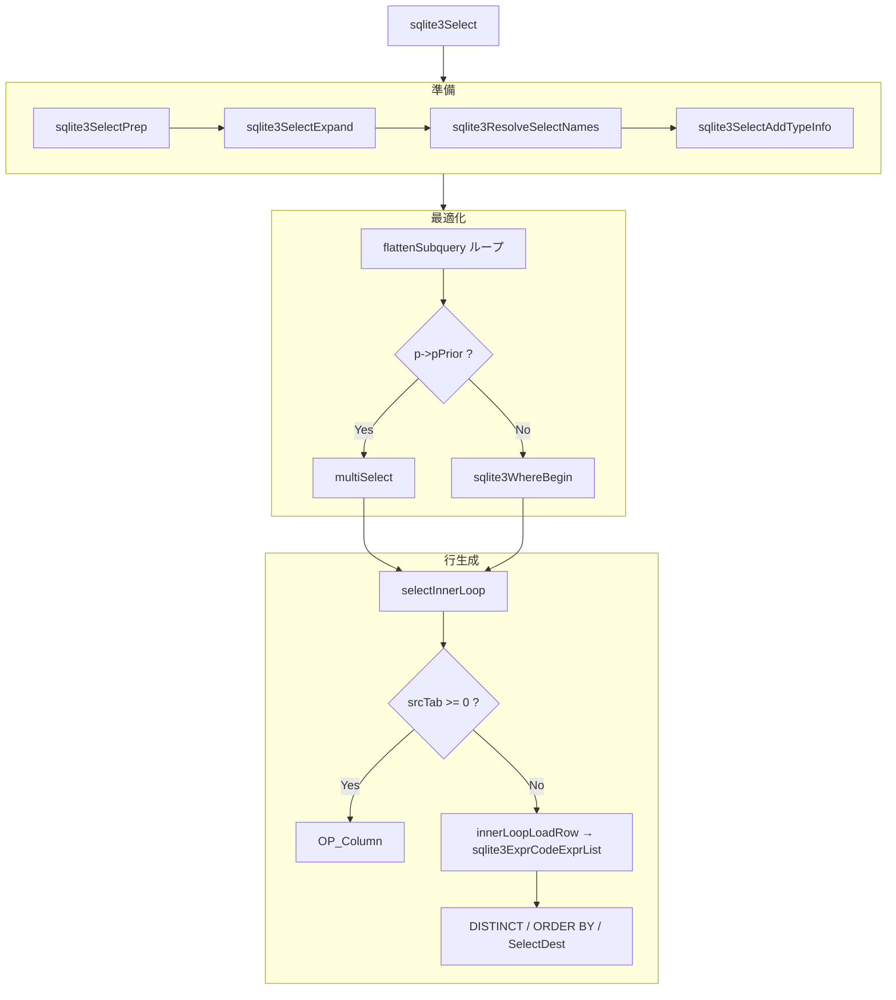

# 第7章 SELECT の処理

> **本章で読むソース**
>
> - [src/select.c](https://github.com/sqlite/sqlite/blob/version-3.53.3/src/select.c)

## この章の狙い

`sqlite3Select` は `SELECT` 文全体のコード生成の司令塔である。
本章では準備（`sqlite3SelectPrep`）、FROM 句のサブクエリ平坦化（`flattenSubquery`）、複合 `SELECT`（`multiSelect`）、行ごとの結果生成（`selectInnerLoop`）に絞って追う。
`GROUP BY`、集約関数、ウィンドウ関数の詳細は第12章へ譲る。

## 前提

第5章で `sqlite3SelectPrep` が展開と名前解決を担うことは確認済みである。
`sqlite3Select` はその直後から最適化と VDBE 生成に入る。
`SelectDest` は結果の行き先（クライアントへ返す、一時表へ書く、存在判定用など）を表す。
平坦化が成功するとサブクエリ用のエフェメラル表を経由せず、親クエリの `FROM` 句へ `JOIN` として吸収される。

## sqlite3Select の全体像

`sqlite3Select` は認可チェックのあと `sqlite3SelectPrep` を呼び、名前解決と型情報付与を済ませる。
ウィンドウ関数の書き換え（`sqlite3WindowRewrite`）を経て FROM 句の平坦化ループに入り、複合 `SELECT` なら `multiSelect` へ委譲する。
単純 `SELECT` は `sqlite3WhereBegin` で表走査ループを張り、ループ本体で `selectInnerLoop` を呼ぶ。

[src/select.c L7590-L7656](https://github.com/sqlite/sqlite/blob/version-3.53.3/src/select.c#L7590-L7656)

```c
int sqlite3Select(
  Parse *pParse,         /* The parser context */
  Select *p,             /* The SELECT statement being coded. */
  SelectDest *pDest      /* What to do with the query results */
){
  int i, j;              /* Loop counters */
  WhereInfo *pWInfo;     /* Return from sqlite3WhereBegin() */
  Vdbe *v;               /* The virtual machine under construction */
  int isAgg;             /* True for select lists like "count(*)" */
  ExprList *pEList = 0;  /* List of columns to extract. */
  SrcList *pTabList;     /* List of tables to select from */
  Expr *pWhere;          /* The WHERE clause.  May be NULL */
  ExprList *pGroupBy;    /* The GROUP BY clause.  May be NULL */
  Expr *pHaving;         /* The HAVING clause.  May be NULL */
  AggInfo *pAggInfo = 0; /* Aggregate information */
  int rc = 1;            /* Value to return from this function */
  DistinctCtx sDistinct; /* Info on how to code the DISTINCT keyword */
  SortCtx sSort;         /* Info on how to code the ORDER BY clause */
  int iEnd;              /* Address of the end of the query */
  sqlite3 *db;           /* The database connection */
  ExprList *pMinMaxOrderBy = 0;  /* Added ORDER BY for min/max queries */
  u8 minMaxFlag;                 /* Flag for min/max queries */

  db = pParse->db;
  assert( pParse==db->pParse );
  v = sqlite3GetVdbe(pParse);
  if( p==0 || pParse->nErr ){
    return 1;
  }
  assert( db->mallocFailed==0 );
  if( sqlite3AuthCheck(pParse, SQLITE_SELECT, 0, 0, 0) ) return 1;
  // ... (中略) ...
  sqlite3SelectPrep(pParse, p, 0);
  if( pParse->nErr ){
    goto select_end;
  }
  assert( db->mallocFailed==0 );
  assert( p->pEList!=0 );
```

集約ありの分岐（`tag-select-0800` 以降）やウィンドウ関数の `sqlite3WindowCodeStep` は第12章で扱う。

## ウィンドウ書き換えと FROM 句の平坦化ループ

`sqlite3SelectPrep` のあと、出力先が `SRT_Output` なら列名を生成する。
続けて `sqlite3WindowRewrite` がウィンドウ関数を書き換え、エラーがあればここで終了する。
その後 `pTabList` を走査し、`flattenSubquery` や結合簡約を FROM 句へ適用する。

[src/select.c L7694-L7720](https://github.com/sqlite/sqlite/blob/version-3.53.3/src/select.c#L7694-L7720)

```c
  if( pDest->eDest==SRT_Output ){
    sqlite3GenerateColumnNames(pParse, p);
  }

#ifndef SQLITE_OMIT_WINDOWFUNC
  if( sqlite3WindowRewrite(pParse, p) ){
    assert( pParse->nErr );
    goto select_end;
  }
#endif /* SQLITE_OMIT_WINDOWFUNC */
  pTabList = p->pSrc;
  isAgg = (p->selFlags & SF_Aggregate)!=0;
  memset(&sSort, 0, sizeof(sSort));
  sSort.pOrderBy = p->pOrderBy;

  /* Try to do various optimizations (flattening subqueries, and strength
  ** reduction of join operators) in the FROM clause up into the main query
  ** tag-select-0200
  */
#if !defined(SQLITE_OMIT_SUBQUERY) || !defined(SQLITE_OMIT_VIEW)
  for(i=0; !p->pPrior && i<pTabList->nSrc; i++){
    SrcItem *pItem = &pTabList->a[i];
    Select *pSub = pItem->fg.isSubquery ? pItem->u4.pSubq->pSelect : 0;
    Table *pTab = pItem->pSTab;
```

## sqlite3SelectPrep：準備の三段

`sqlite3SelectPrep` は `SF_HasTypeInfo` が未設定の `Select` に対し、展開、名前解決、型情報付与を順に実行する。
サブクエリを含む木へ再帰的に降りる。

[src/select.c L6451-L6477](https://github.com/sqlite/sqlite/blob/version-3.53.3/src/select.c#L6451-L6477)

```c
/*
** This routine sets up a SELECT statement for processing.  The
** following is accomplished:
**
**     *  VDBE Cursor numbers are assigned to all FROM-clause terms.
**     *  Ephemeral Table objects are created for all FROM-clause subqueries.
**     *  ON and USING clauses are shifted into WHERE statements
**     *  Wildcards "*" and "TABLE.*" in result sets are expanded.
**     *  Identifiers in expression are matched to tables.
**
** This routine acts recursively on all subqueries within the SELECT.
*/
void sqlite3SelectPrep(
  Parse *pParse,         /* The parser context */
  Select *p,             /* The SELECT statement being coded. */
  NameContext *pOuterNC  /* Name context for container */
){
  assert( p!=0 || pParse->db->mallocFailed );
  assert( pParse->db->pParse==pParse );
  if( pParse->db->mallocFailed ) return;
  if( p->selFlags & SF_HasTypeInfo ) return;
  sqlite3SelectExpand(pParse, p);
  if( pParse->nErr ) return;
  sqlite3ResolveSelectNames(pParse, p, pOuterNC);
  if( pParse->nErr ) return;
  sqlite3SelectAddTypeInfo(pParse, p);
}
```

## flattenSubquery：サブクエリ平坦化

`flattenSubquery` は親 `SELECT` の `FROM` 句にあるサブクエリを、条件を満たすとき親へインライン化する。
冒頭の連続する `return 0` が制約チェックであり、ウィンドウ関数、双方の `LIMIT`、`DISTINCT` の組み合わせなどで平坦化を拒否する。

[src/select.c L4290-L4344](https://github.com/sqlite/sqlite/blob/version-3.53.3/src/select.c#L4290-L4344)

```c
static int flattenSubquery(
  Parse *pParse,       /* Parsing context */
  Select *p,           /* The parent or outer SELECT statement */
  int iFrom,           /* Index in p->pSrc->a[] of the inner subquery */
  int isAgg            /* True if outer SELECT uses aggregate functions */
){
  const char *zSavedAuthContext = pParse->zAuthContext;
  Select *pParent;    /* Current UNION ALL term of the other query */
  Select *pSub;       /* The inner query or "subquery" */
  Select *pSub1;      /* Pointer to the rightmost select in sub-query */
  SrcList *pSrc;      /* The FROM clause of the outer query */
  SrcList *pSubSrc;   /* The FROM clause of the subquery */
  int iParent;        /* VDBE cursor number of the pSub result set temp table */
  int iNewParent = -1;/* Replacement table for iParent */
  int isOuterJoin = 0; /* True if pSub is the right side of a LEFT JOIN */   
  int i;              /* Loop counter */
  Expr *pWhere;                    /* The WHERE clause */
  SrcItem *pSubitem;               /* The subquery */
  sqlite3 *db = pParse->db;
  Walker w;                        /* Walker to persist agginfo data */
  int *aCsrMap = 0;

  /* Check to see if flattening is permitted.  Return 0 if not.
  */
  assert( p!=0 );
  assert( p->pPrior==0 );
  if( OptimizationDisabled(db, SQLITE_QueryFlattener) ) return 0;
  pSrc = p->pSrc;
  assert( pSrc && iFrom>=0 && iFrom<pSrc->nSrc );
  pSubitem = &pSrc->a[iFrom];
  iParent = pSubitem->iCursor;
  assert( pSubitem->fg.isSubquery );
  pSub = pSubitem->u4.pSubq->pSelect;
  assert( pSub!=0 );

#ifndef SQLITE_OMIT_WINDOWFUNC
  if( p->pWin || pSub->pWin ) return 0;                  /* Restriction (25) */
#endif

  pSubSrc = pSub->pSrc;
  assert( pSubSrc );
  if( pSub->pLimit && p->pLimit ) return 0;              /* Restriction (13) */
  if( pSub->pLimit && pSub->pLimit->pRight ) return 0;   /* Restriction (14) */
  if( (p->selFlags & SF_Compound)!=0 && pSub->pLimit ){
    return 0;                                            /* Restriction (15) */
  }
  if( pSubSrc->nSrc==0 ) return 0;                       /* Restriction (7)  */
  if( pSub->selFlags & SF_Distinct ) return 0;           /* Restriction (4)  */
  if( pSub->pLimit && (pSrc->nSrc>1 || isAgg) ){
     return 0;         /* Restrictions (8)(9) */
  }
```

平坦化に成功すると `sqlite3Select` の FROM 走査は `i = -1` からやり直し、吸収後の `p->pSrc` を再スキャンする。

[src/select.c L7878-L7884](https://github.com/sqlite/sqlite/blob/version-3.53.3/src/select.c#L7878-L7884)

```c
    if( flattenSubquery(pParse, p, i, isAgg) ){
      if( pParse->nErr ) goto select_end;
      /* This subquery can be absorbed into its parent. */
      i = -1;
    }
    pTabList = p->pSrc;
```

平坦化の効果は、サブクエリ結果をエフェメラル表へ書き出してから親が読む二段構成を、単一の結合探索へ縮めることにある。
クエリプランナ（第8章以降）が外側と内側をまとめて最適化できる余地が生まれる。

## multiSelect：複合 SELECT

`p->pPrior` が非 NULL のとき `sqlite3Select` は `multiSelect` へ入る。
`UNION ALL` かつ `ORDER BY` なしの場合は、左側を先に実行し、右側を続けて同じ宛先へ流す単純連結である。

[src/select.c L7892-L7905](https://github.com/sqlite/sqlite/blob/version-3.53.3/src/select.c#L7892-L7905)

```c
#ifndef SQLITE_OMIT_COMPOUND_SELECT
  /* Handle compound SELECT statements using the separate multiSelect()
  ** procedure.  tag-select-0300
  */
  if( p->pPrior ){
    rc = multiSelect(pParse, p, pDest);
    // ... (中略) ...
    if( p->pNext==0 ) ExplainQueryPlanPop(pParse);
    return rc;
  }
#endif
```

`multiSelect` 本体では、まず左右の列数一致を確認する。
`ORDER BY` がある場合、および `UNION ALL` 以外（`UNION`、`EXCEPT`、`INTERSECT`）の複合 `SELECT` は、いずれも `multiSelectByMerge` のマージ経路へ回す。
`UNION ALL` かつ `ORDER BY` なしの場合だけ、左 `sqlite3Select`、必要なら `LIMIT` 判定、`OP_OffsetLimit`、右 `sqlite3Select` の単純連結である。

[src/select.c L2989-L3003](https://github.com/sqlite/sqlite/blob/version-3.53.3/src/select.c#L2989-L3003)

```c
  }else if( p->pOrderBy ){
    /* If the compound has an ORDER BY clause, then always use the merge
    ** algorithm. */
    return multiSelectByMerge(pParse, p, pDest);
  }else if( p->op!=TK_ALL ){
    /* If the compound is EXCEPT, INTERSECT, or UNION (anything other than
    ** UNION ALL) then also always use the merge algorithm.  However, the
    ** multiSelectByMerge() routine requires that the compound have an
    ** ORDER BY clause, and it doesn't right now.  So invent one first. */
    Expr *pOne = sqlite3ExprInt32(db, 1);
    p->pOrderBy = sqlite3ExprListAppend(pParse, 0, pOne);
    if( pParse->nErr ) goto multi_select_end;
    assert( p->pOrderBy!=0 );
    p->pOrderBy->a[0].u.x.iOrderByCol = 1;
    return multiSelectByMerge(pParse, p, pDest);
  }else{
```

[src/select.c L2935-L3040](https://github.com/sqlite/sqlite/blob/version-3.53.3/src/select.c#L2935-L3040)

```c
static int multiSelect(
  Parse *pParse,        /* Parsing context */
  Select *p,            /* The right-most of SELECTs to be coded */
  SelectDest *pDest     /* What to do with query results */
){
  int rc = SQLITE_OK;   /* Success code from a subroutine */
  Select *pPrior;       /* Another SELECT immediately to our left */
  Vdbe *v;              /* Generate code to this VDBE */
  SelectDest dest;      /* Alternative data destination */
  Select *pDelete = 0;  /* Chain of simple selects to delete */
  sqlite3 *db;          /* Database connection */

  /* Make sure there is no ORDER BY or LIMIT clause on prior SELECTs.  Only
  ** the last (right-most) SELECT in the series may have an ORDER BY or LIMIT.
  */
  assert( p && p->pPrior );  /* Calling function guarantees this much */
  assert( (p->selFlags & SF_Recursive)==0 || p->op==TK_ALL || p->op==TK_UNION );
  assert( p->selFlags & SF_Compound );
  db = pParse->db;
  pPrior = p->pPrior;
  dest = *pDest;
  assert( pPrior->pOrderBy==0 );
  assert( pPrior->pLimit==0 );

  v = sqlite3GetVdbe(pParse);
  assert( v!=0 );  /* The VDBE already created by calling function */
  // ... (中略) ...
  }else{
    /* For a UNION ALL compound without ORDER BY, simply run the left
    ** query, then run the right query */
    int addr = 0;
    int nLimit = 0;  /* Initialize to suppress harmless compiler warning */

    assert( !pPrior->pLimit );
    pPrior->iLimit = p->iLimit;
    pPrior->iOffset = p->iOffset;
    pPrior->pLimit = sqlite3ExprDup(db, p->pLimit, 0);
    TREETRACE(0x200, pParse, p, ("multiSelect UNION ALL left...\n"));
    rc = sqlite3Select(pParse, pPrior, &dest);
    sqlite3ExprDelete(db, pPrior->pLimit);
    pPrior->pLimit = 0;
    if( rc ){
      goto multi_select_end;
    }
    p->pPrior = 0;
    p->iLimit = pPrior->iLimit;
    p->iOffset = pPrior->iOffset;
    if( p->iLimit ){
      addr = sqlite3VdbeAddOp1(v, OP_IfNot, p->iLimit); VdbeCoverage(v);
      VdbeComment((v, "Jump ahead if LIMIT reached"));
      if( p->iOffset ){
        sqlite3VdbeAddOp3(v, OP_OffsetLimit,
                          p->iLimit, p->iOffset+1, p->iOffset);
      }
    }
    ExplainQueryPlan((pParse, 1, "UNION ALL"));
    TREETRACE(0x200, pParse, p, ("multiSelect UNION ALL right...\n"));
    rc = sqlite3Select(pParse, p, &dest);
```

## selectInnerLoop：結果行の生成

`selectInnerLoop` は表走査ループの「1行ぶん」を処理する。
`srcTab` が非負なら `OP_Column` で既存カーソルから列を読み、負なら `p->pEList` の各式をコード化する。
結果レジスタ列は `pDest->iSdst` から `nResultCol` 個確保される。

[src/select.c L1139-L1201](https://github.com/sqlite/sqlite/blob/version-3.53.3/src/select.c#L1139-L1201)

```c
static void selectInnerLoop(
  Parse *pParse,          /* The parser context */
  Select *p,              /* The complete select statement being coded */
  int srcTab,             /* Pull data from this table if non-negative */
  SortCtx *pSort,         /* If not NULL, info on how to process ORDER BY */
  DistinctCtx *pDistinct, /* If not NULL, info on how to process DISTINCT */
  SelectDest *pDest,      /* How to dispose of the results */
  int iContinue,          /* Jump here to continue with next row */
  int iBreak              /* Jump here to break out of the inner loop */
){
  Vdbe *v = pParse->pVdbe;
  int i;
  int hasDistinct;            /* True if the DISTINCT keyword is present */
  int eDest = pDest->eDest;   /* How to dispose of results */
  int iParm = pDest->iSDParm; /* First argument to disposal method */
  int nResultCol;             /* Number of result columns */
  int nPrefixReg = 0;         /* Number of extra registers before regResult */
  RowLoadInfo sRowLoadInfo;   /* Info for deferred row loading */

  int regResult;              /* Start of memory holding current results */
  int regOrig;                /* Start of memory holding full result (or 0) */

  assert( v );
  assert( p->pEList!=0 );
  hasDistinct = pDistinct ? pDistinct->eTnctType : WHERE_DISTINCT_NOOP;
  if( pSort && pSort->pOrderBy==0 ) pSort = 0;
  if( pSort==0 && !hasDistinct ){
    assert( iContinue!=0 );
    codeOffset(v, p->iOffset, iContinue);
  }

  /* Pull the requested columns.
  */
  nResultCol = p->pEList->nExpr;

  if( pDest->iSdst==0 ){
    if( pSort ){
      nPrefixReg = pSort->pOrderBy->nExpr;
      if( !(pSort->sortFlags & SORTFLAG_UseSorter) ) nPrefixReg++;
      pParse->nMem += nPrefixReg;
    }
    pDest->iSdst = pParse->nMem+1;
    pParse->nMem += nResultCol;
  }else if( pDest->iSdst+nResultCol > pParse->nMem ){
    pParse->nMem += nResultCol;
  }
  pDest->nSdst = nResultCol;
  regOrig = regResult = pDest->iSdst;
  if( srcTab>=0 ){
    for(i=0; i<nResultCol; i++){
      sqlite3VdbeAddOp3(v, OP_Column, srcTab, i, regResult+i);
      VdbeComment((v, "%s", p->pEList->a[i].zEName));
    }
```

式から列を埋める経路は `innerLoopLoadRow` が担い、`sqlite3ExprCodeExprList` を呼ぶ。
`selectInnerLoop` が組み立てる `ecelFlags` には `SQLITE_ECEL_FACTOR` が含まれないため、結果列リストの入口では式全体を一括因数分解しない（`select.c` L1209-L1270）。
ただし `sqlite3ExprCodeExprList` は各式について最終的に `sqlite3ExprCodeTarget` を呼び、定数関数なら `sqlite3ExprCodeRunJustOnce` へ、比較の子式なら `sqlite3ExprCodeTemp` 経由で因数分解が起こり得る（第6章参照）。

[src/select.c L1209-L1270](https://github.com/sqlite/sqlite/blob/version-3.53.3/src/select.c#L1209-L1270)

```c
    u8 ecelFlags;    /* "ecel" is an abbreviation of "ExprCodeExprList" */
    ExprList *pEList;
    if( eDest==SRT_Mem || eDest==SRT_Output || eDest==SRT_Coroutine ){
      ecelFlags = SQLITE_ECEL_DUP;
    }else{
      ecelFlags = 0;
    }
    if( pSort && hasDistinct==0 && eDest!=SRT_EphemTab && eDest!=SRT_Table ){
      /* For each expression in p->pEList that is a copy of an expression in
      ** the ORDER BY clause (pSort->pOrderBy), set the associated
      ** iOrderByCol value to one more than the index of the ORDER BY
      ** expression within the sort-key that pushOntoSorter() will generate.
      ** This allows the p->pEList field to be omitted from the sorted record,
      ** saving space and CPU cycles.  */
      ecelFlags |= (SQLITE_ECEL_OMITREF|SQLITE_ECEL_REF);
      // ... (中略) ...
    }
    sRowLoadInfo.regResult = regResult;
    sRowLoadInfo.ecelFlags = ecelFlags;
```

[src/select.c L688-L694](https://github.com/sqlite/sqlite/blob/version-3.53.3/src/select.c#L688-L694)

```c
static void innerLoopLoadRow(
  Parse *pParse,             /* Statement under construction */
  Select *pSelect,           /* The query being coded */
  RowLoadInfo *pInfo         /* Info needed to complete the row load */
){
  sqlite3ExprCodeExprList(pParse, pSelect->pEList, pInfo->regResult,
                          0, pInfo->ecelFlags);
```

列の読み出しと式評価のあと、`switch( pDest->eDest )` が結果の出力先を切り替える。
`SRT_Output` は `OP_ResultRow`、`SRT_Coroutine` は `OP_Yield`、`SRT_Table` と `SRT_EphemTab` は `OP_MakeRecord` と `OP_Insert` で一時表へ書き込む。

[src/select.c L1304-L1453](https://github.com/sqlite/sqlite/blob/version-3.53.3/src/select.c#L1304-L1453)

```c
  switch( eDest ){
    case SRT_Fifo:
    case SRT_DistFifo:
    case SRT_Table:
    case SRT_EphemTab: {
      int r1 = sqlite3GetTempRange(pParse, nPrefixReg+1);
      // ... (中略) ...
      sqlite3VdbeAddOp3(v, OP_MakeRecord, regResult, nResultCol, r1+nPrefixReg);
      // ... (中略) ...
        sqlite3VdbeAddOp2(v, OP_NewRowid, iParm, r2);
        sqlite3VdbeAddOp3(v, OP_Insert, iParm, r1, r2);
      // ... (中略) ...
      break;
    }
    // ... (中略) ...
    case SRT_Coroutine:       /* Send data to a co-routine */
    case SRT_Output: {        /* Return the results */
      // ... (中略) ...
      }else if( eDest==SRT_Coroutine ){
        sqlite3VdbeAddOp1(v, OP_Yield, pDest->iSDParm);
      }else{
        sqlite3VdbeAddOp2(v, OP_ResultRow, regResult, nResultCol);
      }
      break;
    }
```

`sqlite3WhereBegin` が返したループでは、集約なしの単純 `SELECT` が `selectInnerLoop` を直接呼び、`sqlite3WhereEnd` で走査を閉じる。

[src/select.c L8345-L8354](https://github.com/sqlite/sqlite/blob/version-3.53.3/src/select.c#L8345-L8354)

```c
    {
      /* Use the standard inner loop. */
      selectInnerLoop(pParse, p, -1, &sSort, &sDistinct, pDest,
          sqlite3WhereContinueLabel(pWInfo),
          sqlite3WhereBreakLabel(pWInfo));

      /* End the database scan loop.
      */
      TREETRACE(0x2,pParse,p,("WhereEnd\n"));
      sqlite3WhereEnd(pWInfo);
    }
```

## 処理の流れ



## 高速化と最適化の工夫

サブクエリ平坦化は、エフェメラル表への書き込みと再読み出しを省略する。
制約チェックが多いのは、平坦化で意味が変わるケース（`LEFT JOIN` の右側がさらに `JOIN` する形など）をコンパイル時に除外するためである。

`selectInnerLoop` の `ORDER BY` 最適化は、ソートキーに既に含まれる結果列を `iOrderByCol` でマークし、`sqlite3ExprCodeExprList` から省略する。
`select.c` 側で `SQLITE_ECEL_OMITREF` と `SQLITE_ECEL_REF` を立て、ソート用レコードを短くする。
`expr.c` 側では `iOrderByCol>0` の列を `OP_SCopy` で既存レジスタから複製するか、フラグに応じて省略する。

[src/select.c L1216-L1258](https://github.com/sqlite/sqlite/blob/version-3.53.3/src/select.c#L1216-L1258)

```c
    if( pSort && hasDistinct==0 && eDest!=SRT_EphemTab && eDest!=SRT_Table ){
      /* For each expression in p->pEList that is a copy of an expression in
      ** the ORDER BY clause (pSort->pOrderBy), set the associated
      ** iOrderByCol value to one more than the index of the ORDER BY
      ** expression within the sort-key that pushOntoSorter() will generate.
      ** This allows the p->pEList field to be omitted from the sorted record,
      ** saving space and CPU cycles.  */
      ecelFlags |= (SQLITE_ECEL_OMITREF|SQLITE_ECEL_REF);

      for(i=pSort->nOBSat; i<pSort->pOrderBy->nExpr; i++){
        int j;
        if( (j = pSort->pOrderBy->a[i].u.x.iOrderByCol)>0 ){
          p->pEList->a[j-1].u.x.iOrderByCol = i+1-pSort->nOBSat;
        }
      }
      // ... (中略) ...
      for(i=0; i<pEList->nExpr; i++){
        if( pEList->a[i].u.x.iOrderByCol>0
        ){
          nResultCol--;
          regOrig = 0;
        }
      }
```

[src/expr.c L5953-L6025](https://github.com/sqlite/sqlite/blob/version-3.53.3/src/expr.c#L5953-L6025)

```c
int sqlite3ExprCodeExprList(
  Parse *pParse,     /* Parsing context */
  ExprList *pList,   /* The expression list to be coded */
  int target,        /* Where to write results */
  int srcReg,        /* Source registers if SQLITE_ECEL_REF */
  u8 flags           /* SQLITE_ECEL_* flags */
){
  // ... (中略) ...
    }else if( (flags & SQLITE_ECEL_REF)!=0 && (j = pItem->u.x.iOrderByCol)>0 ){
      if( flags & SQLITE_ECEL_OMITREF ){
        i--;
        n--;
      }else{
        sqlite3VdbeAddOp2(v, copyOp, j+srcReg-1, target+i);
      }
    }else if( (flags & SQLITE_ECEL_FACTOR)!=0
           && sqlite3ExprIsConstantNotJoin(pParse,pExpr)
    ){
      sqlite3ExprCodeRunJustOnce(pParse, pExpr, target+i);
    }else{
      int inReg = sqlite3ExprCodeTarget(pParse, pExpr, target+i);
      // ... (中略) ...
    }
  }
  return n;
}
```

`multiSelect` の `UNION ALL` 連結はマージソートを避け、左右を順に実行するだけである。
全体ソートが不要なとき、中間結果をマージ用一時構造へ載せ替えない。

## まとめ

`sqlite3Select` は準備、平坦化、複合処理、表走査、行生成を順に配線する。
`sqlite3SelectPrep` で意味が確定した `Select` が入力となり、平坦化で `FROM` 構造が書き換わることがある。
`multiSelect` は複合 `SELECT` を再帰的 `sqlite3Select` 呼び出しへ分解する。
`selectInnerLoop` が1行ぶんの結果レジスタを埋め、第6章の式コード生成を `innerLoopLoadRow` 経由で利用する。
集約とウィンドウは別経路であり、第12章で読む。

## 関連する章

- 第5章の `sqlite3SelectPrep` と名前解決が本章の前提になる。
- 第6章の `sqlite3ExprCodeExprList` が結果列の式評価を担う。
- 第8章以降の `sqlite3WhereBegin` が `selectInnerLoop` を包むループを生成する。
- 第12章で集約（`AggInfo`）とウィンドウ（`sqlite3WindowCodeStep`）を読む。
