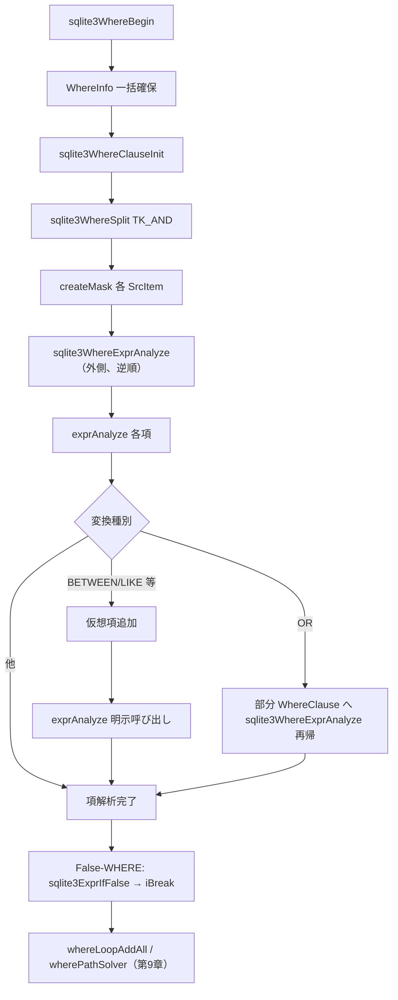

# 第8章 クエリプランナ（1）WHERE 解析

> **本章で読むソース**
>
> - [src/where.c](https://github.com/sqlite/sqlite/blob/version-3.53.3/src/where.c)
> - [src/whereexpr.c](https://github.com/sqlite/sqlite/blob/version-3.53.3/src/whereexpr.c)
> - [src/whereInt.h](https://github.com/sqlite/sqlite/blob/version-3.53.3/src/whereInt.h)

## この章の狙い

`sqlite3WhereBegin` はクエリプランナの入口である。
本章では `WhereInfo` の確保から `WhereClause` の構築、`sqlite3WhereExprAnalyze` による項の分類までを追う。
ループ候補の列挙、コスト比較、VDBE へのループ本体の生成は第9章へ譲る。

## 前提

第7章で `sqlite3Select` が `sqlite3WhereBegin` を呼び、表走査ループの外枠を張ることを確認済みである。
`sqlite3WhereBegin` の戻り値 `WhereInfo` は、ネストしたループの段数、選ばれた走査法、未コード化の `WhereTerm` 群を保持する。
本章の出力は「インデックスに使える制約か」「どの表に依存するか」が付いた `WhereTerm` の集合である。

## WhereInfo の一括確保

`sqlite3WhereBegin` は `FROM` 句の表数 `nTabList` に応じて `WhereInfo` を1回の `sqlite3DbMallocRawNN` で確保する。
同じブロックに `WhereLevel` 配列、`WhereClause`、`WhereMaskSet`、テンプレート `WhereLoop` が続く。
`WhereClause` は `Bitmask` を含むため `ROUND8` でアライメントを揃える。

[src/where.c L6891-L6941](https://github.com/sqlite/sqlite/blob/version-3.53.3/src/where.c#L6891-L6941)

```c
  /* Allocate and initialize the WhereInfo structure that will become the
  ** return value. A single allocation is used to store the WhereInfo
  ** struct, the contents of WhereInfo.a[], the WhereClause structure
  ** and the WhereMaskSet structure. Since WhereClause contains an 8-byte
  ** field (type Bitmask) it must be aligned on an 8-byte boundary on
  ** some architectures. Hence the ROUND8() below.
  */
  nByteWInfo = SZ_WHEREINFO(nTabList);
  pWInfo = sqlite3DbMallocRawNN(db, nByteWInfo + sizeof(WhereLoop));
  // ... (中略) ...
  pMaskSet = &pWInfo->sMaskSet;
  pMaskSet->n = 0;
  pMaskSet->ix[0] = -99; /* Initialize ix[0] to a value that can never be
                         ** a valid cursor number, to avoid an initial
                         ** test for pMaskSet->n==0 in sqlite3WhereGetMask() */
  sWLB.pWInfo = pWInfo;
  sWLB.pWC = &pWInfo->sWC;
  sWLB.pNew = (WhereLoop*)(((char*)pWInfo)+nByteWInfo);
  assert( EIGHT_BYTE_ALIGNMENT(sWLB.pNew) );
  whereLoopInit(sWLB.pNew);
```

`WHERE_OR_SUBCLAUSE` が立っているときは `nTabList` を1に切り詰め、OR 部分木用のサブプランだけを生成する。
`ORDER BY` の項数が `BMS` 以上なら最適化を諦め、`WHERE_KEEP_ALL_JOINS` を立てて結合省略を無効化する。
`BMS-1` は where.c L6868 の `testcase` 用であり、実際に無効化する条件は L6869 の `nExpr>=BMS` である。

[src/where.c L6867-L6873](https://github.com/sqlite/sqlite/blob/version-3.53.3/src/where.c#L6867-L6873)

```c
  /* An ORDER/GROUP BY clause of more than 63 terms cannot be optimized */
  testcase( pOrderBy && pOrderBy->nExpr==BMS-1 );
  if( pOrderBy && pOrderBy->nExpr>=BMS ){
    pOrderBy = 0;
    wctrlFlags &= ~WHERE_WANT_DISTINCT;
    wctrlFlags |= WHERE_KEEP_ALL_JOINS; /* Disable omit-noop-join opt */
  }
```

## WHERE 句の AND 分割

確保の直後、`sqlite3WhereClauseInit` で `pWInfo->sWC` を初期化し、`sqlite3WhereSplit` が `pWhere` を `TK_AND` で再帰分割する。
分割は構文木を辿り、最上位が `AND` でなければ1項として `whereClauseInsert` へ入れる。

[src/where.c L6937-L6941](https://github.com/sqlite/sqlite/blob/version-3.53.3/src/where.c#L6937-L6941)

```c
  /* Split the WHERE clause into separate subexpressions where each
  ** subexpression is separated by an AND operator.
  */
  sqlite3WhereClauseInit(&pWInfo->sWC, pWInfo);
  sqlite3WhereSplit(&pWInfo->sWC, pWhere, TK_AND);
```

[src/whereexpr.c L1599-L1610](https://github.com/sqlite/sqlite/blob/version-3.53.3/src/whereexpr.c#L1599-L1610)

```c
void sqlite3WhereSplit(WhereClause *pWC, Expr *pExpr, u8 op){
  Expr *pE2 = sqlite3ExprSkipCollateAndLikely(pExpr);
  pWC->op = op;
  assert( pE2!=0 || pExpr==0 );
  if( pE2==0 ) return;
  if( pE2->op!=op ){
    whereClauseInsert(pWC, pExpr, 0);
  }else{
    sqlite3WhereSplit(pWC, pE2->pLeft, op);
    sqlite3WhereSplit(pWC, pE2->pRight, op);
  }
}
```

`whereClauseInsert` は `aStatic[8]` から始まり、必要なら `sqlite3WhereMalloc` で倍々に拡張する。
`TERM_VIRTUAL` でない項が追加されるたび `nBase` を更新し、「元の WHERE から来た項」の境界を記録する。

[src/whereexpr.c L60-L92](https://github.com/sqlite/sqlite/blob/version-3.53.3/src/whereexpr.c#L60-L92)

```c
static int whereClauseInsert(WhereClause *pWC, Expr *p, u16 wtFlags){
  WhereTerm *pTerm;
  int idx;
  testcase( wtFlags & TERM_VIRTUAL );
  if( pWC->nTerm>=pWC->nSlot ){
    WhereTerm *pOld = pWC->a;
    sqlite3 *db = pWC->pWInfo->pParse->db;
    pWC->a = sqlite3WhereMalloc(pWC->pWInfo, sizeof(pWC->a[0])*pWC->nSlot*2 );
    // ... (中略) ...
    pWC->nSlot = pWC->nSlot*2;
  }
  pTerm = &pWC->a[idx = pWC->nTerm++];
  if( (wtFlags & TERM_VIRTUAL)==0 ) pWC->nBase = pWC->nTerm;
  // ... (中略) ...
  pTerm->pExpr = sqlite3ExprSkipCollateAndLikely(p);
  pTerm->wtFlags = wtFlags;
  pTerm->pWC = pWC;
  pTerm->iParent = -1;
  memset(&pTerm->eOperator, 0,
         sizeof(WhereTerm) - offsetof(WhereTerm,eOperator));
  return idx;
}
```

## WhereClause と WhereTerm

`WhereClause` は `WhereTerm` の配列コンテナである。
`op` は分割に使った演算子（`TK_AND` または `TK_OR`）、`hasOr` は OR 項の有無を後段のループ生成が参照する。
`pOuter` は入れ子の部分句が親を指すための逆リンクである。

[src/whereInt.h L353-L367](https://github.com/sqlite/sqlite/blob/version-3.53.3/src/whereInt.h#L353-L367)

```c
struct WhereClause {
  WhereInfo *pWInfo;       /* WHERE clause processing context */
  WhereClause *pOuter;     /* Outer conjunction */
  u8 op;                   /* Split operator.  TK_AND or TK_OR */
  u8 hasOr;                /* True if any a[].eOperator is WO_OR */
  int nTerm;               /* Number of terms */
  int nSlot;               /* Number of entries in a[] */
  int nBase;               /* Number of terms through the last non-Virtual */
  WhereTerm *a;            /* Each a[] describes a term of the WHERE clause */
#if defined(SQLITE_SMALL_STACK)
  WhereTerm aStatic[1];    /* Initial static space for a[] */
#else
  WhereTerm aStatic[8];    /* Initial static space for a[] */
#endif
};
```

各 `WhereTerm` は元の `Expr` に加え、インデックス探索用のメタデータを持つ。
`leftCursor` と `u.x.leftColumn` は `X <op> expr` 形の左辺列、`eOperator` は `WO_*` ビットマスクで比較種別を表す。
`prereqRight` と `prereqAll` は、その項の評価に先に位置づけが必要な表集合である。

[src/whereInt.h L274-L297](https://github.com/sqlite/sqlite/blob/version-3.53.3/src/whereInt.h#L274-L297)

```c
struct WhereTerm {
  Expr *pExpr;            /* Pointer to the subexpression that is this term */
  WhereClause *pWC;       /* The clause this term is part of */
  LogEst truthProb;       /* Probability of truth for this expression */
  u16 wtFlags;            /* TERM_xxx bit flags.  See below */
  u16 eOperator;          /* A WO_xx value describing <op> */
  u8 nChild;              /* Number of children that must disable us */
  u8 eMatchOp;            /* Op for vtab MATCH/LIKE/GLOB/REGEXP terms */
  int iParent;            /* Disable pWC->a[iParent] when this term disabled */
  int leftCursor;         /* Cursor number of X in "X <op> <expr>" */
  // ... (中略) ...
  union {
    struct {
      int leftColumn;         /* Column number of X in "X <op> <expr>" */
      int iField;             /* Field in (?,?,?) IN (SELECT...) vector */
    } x;
    WhereOrInfo *pOrInfo;   /* Extra information if (eOperator & WO_OR)!=0 */
    WhereAndInfo *pAndInfo; /* Extra information if (eOperator& WO_AND)!=0 */
  } u;
  Bitmask prereqRight;    /* Bitmask of tables used by pExpr->pRight */
  Bitmask prereqAll;      /* Bitmask of tables referenced by pExpr */
};
```

`WO_EQ` から `WO_GE` までの値は `TK_EQ` との距離でシフト生成され、演算子集合のマスク検索を1回の AND で済ませる。

[src/whereInt.h L615-L631](https://github.com/sqlite/sqlite/blob/version-3.53.3/src/whereInt.h#L615-L631)

```c
#define WO_IN     0x0001
#define WO_EQ     0x0002
#define WO_LT     (WO_EQ<<(TK_LT-TK_EQ))
#define WO_LE     (WO_EQ<<(TK_LE-TK_EQ))
#define WO_GT     (WO_EQ<<(TK_GT-TK_EQ))
#define WO_GE     (WO_EQ<<(TK_GE-TK_EQ))
#define WO_AUX    0x0040       /* Op useful to virtual tables only */
#define WO_IS     0x0080
#define WO_ISNULL 0x0100
#define WO_OR     0x0200       /* Two or more OR-connected terms */
#define WO_AND    0x0400       /* Two or more AND-connected terms */
#define WO_EQUIV  0x0800       /* Of the form A==B, both columns */
#define WO_NOOP   0x1000       /* This term does not restrict search space */
#define WO_ROWVAL 0x2000       /* A row-value term */

#define WO_ALL    0x3fff       /* Mask of all possible WO_* values */
#define WO_SINGLE 0x01ff       /* Mask of all non-compound WO_* values */
```

## WhereMaskSet と依存ビットマスク

VDBE のカーソル番号は `FROM` 句の並びで飛び番号になりうる。
`WhereMaskSet` は疎なカーソル番号を 0 始まりの連番ビットへ写し、`Bitmask` の有限幅（既定64表）を有効活用する。

[src/whereInt.h L412-L416](https://github.com/sqlite/sqlite/blob/version-3.53.3/src/whereInt.h#L412-L416)

```c
struct WhereMaskSet {
  int bVarSelect;               /* Used by sqlite3WhereExprUsage() */
  int n;                        /* Number of assigned cursor values */
  int ix[BMS];                  /* Cursor assigned to each bit */
};
```

`sqlite3WhereBegin` は `FROM` の各 `SrcItem` に対し `createMask` でカーソルを登録する。
`sqlite3WhereGetMask` は登録済みカーソルから `1<<n` 形式のビットを返す。

[src/where.c L6972-L6976](https://github.com/sqlite/sqlite/blob/version-3.53.3/src/where.c#L6972-L6976)

```c
    ii = 0;
    do{
      createMask(pMaskSet, pTabList->a[ii].iCursor);
      sqlite3WhereTabFuncArgs(pParse, &pTabList->a[ii], &pWInfo->sWC);
    }while( (++ii)<pTabList->nSrc );
```

[src/where.c L245-L259](https://github.com/sqlite/sqlite/blob/version-3.53.3/src/where.c#L245-L259)

```c
Bitmask sqlite3WhereGetMask(WhereMaskSet *pMaskSet, int iCursor){
  int i;
  assert( pMaskSet->n<=(int)sizeof(Bitmask)*8 );
  assert( pMaskSet->n>0 || pMaskSet->ix[0]<0 );
  assert( iCursor>=-1 );
  if( pMaskSet->ix[0]==iCursor ){
    return 1;
  }
  for(i=1; i<pMaskSet->n; i++){
    if( pMaskSet->ix[i]==iCursor ){
      return MASKBIT(i);
    }
  }
  return 0;
}
```

[src/where.c L293-L296](https://github.com/sqlite/sqlite/blob/version-3.53.3/src/where.c#L293-L296)

```c
static void createMask(WhereMaskSet *pMaskSet, int iCursor){
  assert( pMaskSet->n < ArraySize(pMaskSet->ix) );
  pMaskSet->ix[pMaskSet->n++] = iCursor;
}
```

`sqlite3WhereExprUsage` は式木を走査し、参照する表のビットマスクを合成する。
`exprAnalyze` は左右の部分式に対してこれを呼び、`prereqRight` と `prereqAll` を埋める。

[src/whereexpr.c L1862-L1864](https://github.com/sqlite/sqlite/blob/version-3.53.3/src/whereexpr.c#L1862-L1864)

```c
Bitmask sqlite3WhereExprUsage(WhereMaskSet *pMaskSet, Expr *p){
  return p ? sqlite3WhereExprUsageNN(pMaskSet,p) : 0;
}
```

[src/whereexpr.c L1155-L1197](https://github.com/sqlite/sqlite/blob/version-3.53.3/src/whereexpr.c#L1155-L1197)

```c
  prereqLeft = sqlite3WhereExprUsage(pMaskSet, pExpr->pLeft);
  op = pExpr->op;
  if( op==TK_IN ){
    // ... (中略) ...
    prereqAll = prereqLeft | pTerm->prereqRight;
  }else{
    pTerm->prereqRight = sqlite3WhereExprUsage(pMaskSet, pExpr->pRight);
    // ... (中略) ...
    prereqAll = prereqLeft | pTerm->prereqRight;
  }
  // ... (中略) ...
  if( ExprHasProperty(pExpr, EP_OuterON|EP_InnerON) ){
    Bitmask x = sqlite3WhereGetMask(pMaskSet, pExpr->w.iJoin);
    if( ExprHasProperty(pExpr, EP_OuterON) ){
      prereqAll |= x;
      extraRight = x-1;
    }else if( (prereqAll>>1)>=x ){
      ExprClearProperty(pExpr, EP_InnerON);
    }
  }
  pTerm->prereqAll = prereqAll;
```

`LEFT JOIN` の `ON` 句は右表側のインデックス利用を制限するため、`extraRight` で右辺の前提を広げる（チケット #3015）。

## sqlite3WhereExprAnalyze と exprAnalyze

マスク登録のあと `sqlite3WhereExprAnalyze` が全項を解析する。
呼び出しは末尾から逆順であり、`exprAnalyze` が追加する仮想項を二重処理しないためである。

[src/where.c L6989-L6994](https://github.com/sqlite/sqlite/blob/version-3.53.3/src/where.c#L6989-L6994)

```c
  /* Analyze all of the subexpressions. */
  sqlite3WhereExprAnalyze(pTabList, &pWInfo->sWC);
  if( pSelect && pSelect->pLimit ){
    sqlite3WhereAddLimit(&pWInfo->sWC, pSelect);
  }
  if( pParse->nErr ) goto whereBeginError;
```

[src/whereexpr.c L1885-L1893](https://github.com/sqlite/sqlite/blob/version-3.53.3/src/whereexpr.c#L1885-L1893)

```c
void sqlite3WhereExprAnalyze(
  SrcList *pTabList,       /* the FROM clause */
  WhereClause *pWC         /* the WHERE clause to be analyzed */
){
  int i;
  for(i=pWC->nTerm-1; i>=0; i--){
    exprAnalyze(pTabList, pWC, i);
  }
}
```

`exprAnalyze` の中核は、列と演算子がインデックス可能なら `leftCursor` と `eOperator` を設定することである。
`A = B` で両辺が列なら交換可能項（`TERM_VIRTUAL`）を追加し、`WO_EQUIV` で同値クラスを広げる。
`BETWEEN` は `>=` と `<=` の仮想項へ分解し、追加直後に `exprAnalyze` を明示呼び出す（L1308）。
`LIKE 'prefix%'` は範囲制約の仮想項を足し、同様に `exprAnalyze` を呼ぶ（L1447-L1448）。
`TK_OR` は `exprAnalyzeOrTerm` が `WhereOrInfo` 付きの部分 `WhereClause` を構築し、そこへ `sqlite3WhereExprAnalyze` を再帰適用する。
末尾へ追加された仮想項は、外側の `sqlite3WhereExprAnalyze` 逆順走査では再解析されない（whereexpr.c L1877-L1893 のコメント）。

[src/whereexpr.c L1214-L1259](https://github.com/sqlite/sqlite/blob/version-3.53.3/src/whereexpr.c#L1214-L1259)

```c
    if( exprMightBeIndexed(pSrc, aiCurCol, pLeft, op) ){
      pTerm->leftCursor = aiCurCol[0];
      assert( (pTerm->eOperator & (WO_OR|WO_AND))==0 );
      pTerm->u.x.leftColumn = aiCurCol[1];
      pTerm->eOperator = operatorMask(op) & opMask;
    }
    // ... (中略) ...
    if( pRight
     && exprMightBeIndexed(pSrc, aiCurCol, pRight, op)
     && !ExprHasProperty(pRight, EP_FixedCol)
    ){
      WhereTerm *pNew;
      // ... (中略) ...
        idxNew = whereClauseInsert(pWC, pDup, TERM_VIRTUAL|TERM_DYNAMIC);
        // ... (中略) ...
        pNew->leftCursor = aiCurCol[0];
        pNew->u.x.leftColumn = aiCurCol[1];
        pNew->prereqRight = prereqLeft | extraRight;
        pNew->prereqAll = prereqAll;
        pNew->eOperator = (operatorMask(pDup->op) + eExtraOp) & opMask;
```

OR 句では部分木ごとに再帰的に `sqlite3WhereSplit` と `sqlite3WhereExprAnalyze` を呼び、`indexable` ビットマスクを計算する。

[src/whereexpr.c L709-L724](https://github.com/sqlite/sqlite/blob/version-3.53.3/src/whereexpr.c#L709-L724)

```c
  assert( (pTerm->wtFlags & (TERM_DYNAMIC|TERM_ORINFO|TERM_ANDINFO))==0 );
  assert( pExpr->op==TK_OR );
  pTerm->u.pOrInfo = pOrInfo = sqlite3DbMallocZero(db, sizeof(*pOrInfo));
  if( pOrInfo==0 ) return;
  pTerm->wtFlags |= TERM_ORINFO;
  pOrWc = &pOrInfo->wc;
  memset(pOrWc->aStatic, 0, sizeof(pOrWc->aStatic));
  sqlite3WhereClauseInit(pOrWc, pWInfo);
  sqlite3WhereSplit(pOrWc, pExpr, TK_OR);
  sqlite3WhereExprAnalyze(pSrc, pOrWc);
  if( db->mallocFailed ) return;
  assert( pOrWc->nTerm>=2 );
```

## 解析直後の False-WHERE 分岐生成

解析後、`prereqAll==0` かつ決定論的な偽になりうる項に対し、`sqlite3ExprIfFalse` が `iBreak` へ飛ぶ VDBE 分岐を生成する。
`TERM_CODED` を立てるため、同じ項は第9章の `sqlite3WhereCodeOneLoopStart` では再度コード化されない。
この処理のあとも `whereLoopAddAll`（L7055 以降）と `wherePathSolver`（L7106）は通常どおり実行される。
省けるのは、実行時に生成済みループ本体を走らせる処理であり、ループ候補生成や経路探索そのものは省略しない。

[src/where.c L7022-L7037](https://github.com/sqlite/sqlite/blob/version-3.53.3/src/where.c#L7022-L7037)

```c
  for(ii=0; ii<sWLB.pWC->nBase; ii++){
    WhereTerm *pT = &sWLB.pWC->a[ii];  /* A term of the WHERE clause */
    Expr *pX;                          /* The expression of pT */
    if( pT->wtFlags & TERM_VIRTUAL ) continue;
    pX = pT->pExpr;
    // ... (中略) ...
    if( pT->prereqAll==0
     && (nTabList==0 || exprIsDeterministic(pX))
     && !(ExprHasProperty(pX, EP_InnerON)
          && (pTabList->a[0].fg.jointype & JT_LTORJ)!=0 )
    ){
      sqlite3ExprIfFalse(pParse, pX, pWInfo->iBreak, SQLITE_JUMPIFNULL);
      pT->wtFlags |= TERM_CODED;
    }
  }
```

[src/where.c L7055-L7106](https://github.com/sqlite/sqlite/blob/version-3.53.3/src/where.c#L7055-L7106)

```c
  /* Construct the WhereLoop objects */
  // ... (中略) ...
  if( nTabList!=1 || whereShortCut(&sWLB)==0 ){
    rc = whereLoopAddAll(&sWLB);
    if( rc ) goto whereBeginError;
    // ... (中略) ...
    wherePathSolver(pWInfo, 0);
    if( db->mallocFailed ) goto whereBeginError;
```

ここまでが本章の範囲である。
直後の `/* Construct the WhereLoop objects */` 以降は第9章で扱う。

## 処理の流れ



## 高速化と最適化の工夫

`sqlite3WhereExprAnalyze` の逆順走査は、`exprAnalyze` が末尾へ仮想項を追加してもそれらを再解析しない。
解析中に `BETWEEN` や `LIKE` の前方一致、`IS NOT NULL` を等価な範囲項へ展開すれば、第9章の `whereLoopAddBtreeIndex` が同じ `WhereScan` 経路で複数の制約候補を拾える。

`WhereMaskSet` によるビット圧縮は、結合順序探索で `prereq` を機械語レベルで AND できるようにする。
カーソル番号をそのまま使うより、`Bitmask` 1語で「左側の表はすべて走査済みか」を判定できる。

False-WHERE 分岐は、コンパイル時に `iBreak` へ飛ぶコードを挿入する実行時バイパスである。
`prereqAll==0` の項だけが対象なので、相関サブクエリ内の外側変数を含む条件は誤って省略しない。
ループ候補の列挙と経路探索はこのあとも続く。

## まとめ

`sqlite3WhereBegin` 前半は、WHERE を AND 項の配列へ落とし、各項にインデックス利用可否と表依存を付与する段階である。
`WhereClause` と `WhereTerm` が中間表現、`WhereMaskSet` が依存関係のビット写像を担う。
`sqlite3WhereExprAnalyze` は逆順に `exprAnalyze` を走らせ、仮想項と OR 部分木を構築する。
解析結果は `whereLoopAddAll` 以降のループ候補生成の入力となる。

## 関連する章

- 第7章の `sqlite3Select` が `sqlite3WhereBegin` を呼び出す入口である。
- 第9章で `whereLoopAddAll`、コスト見積り、`sqlite3WhereCodeOneLoopStart` を読む。
- 第25章で仮想テーブルの `xBestIndex` と `WO_AUX` 項の接続を読む。
