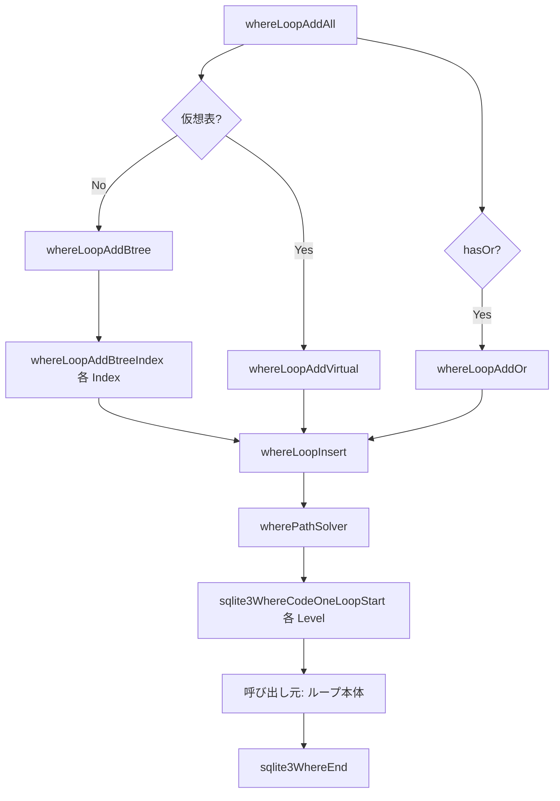

# 第9章 クエリプランナ（2）ループ候補とコード生成

> **本章で読むソース**
>
> - [src/where.c](https://github.com/sqlite/sqlite/blob/version-3.53.3/src/where.c)
> - [src/wherecode.c](https://github.com/sqlite/sqlite/blob/version-3.53.3/src/wherecode.c)
> - [src/whereInt.h](https://github.com/sqlite/sqlite/blob/version-3.53.3/src/whereInt.h)

## この章の狙い

第8章で分類された `WhereTerm` を入力に、クエリプランナは各 `FROM` 項について複数の走査候補（`WhereLoop`）を列挙し、最安経路を選んで VDBE ループを生成する。
本章では `whereLoopAddAll` による候補生成、コスト見積り、`sqlite3WhereCodeOneLoopStart` と `sqlite3WhereEnd` によるバイトコード出力に絞る。
WHERE 句の項分解と `exprAnalyze` は第8章の範囲である。

## 前提

`sqlite3WhereBegin` は第8章の解析のあと `whereLoopAddAll` を呼び、`wherePathSolver` で `WherePath` を決定する。
公開 API 名 `sqlite3WhereLoopAddBtree` は存在せず、B-tree 向け候補追加は `static` 関数 `whereLoopAddBtree` である。
`WhereLoop` はアルゴリズム、`WhereLevel` は選ばれたアルゴリズムの VDBE 実装という役割分担になっている（`whereInt.h` のコメント参照）。

## WhereLoop のデータ構造

`WhereLoop` は1つの `FROM` 項に対する走査法の候補である。
`prereq` はこのループの前に走査が必要な表のビットマスク、`maskSelf` は対象表自身、`rSetup` と `rRun` は対数コスト、`nOut` は推定出力行数である。
`aLTerm[]` はその走査が利用する `WhereTerm` へのポインタ配列である。

[src/whereInt.h L129-L173](https://github.com/sqlite/sqlite/blob/version-3.53.3/src/whereInt.h#L129-L173)

```c
struct WhereLoop {
  Bitmask prereq;       /* Bitmask of other loops that must run first */
  Bitmask maskSelf;     /* Bitmask identifying table iTab */
  // ... (中略) ...
  u8 iTab;              /* Position in FROM clause of table for this loop */
  u8 iSortIdx;          /* Sorting index number.  0==None */
  LogEst rSetup;        /* One-time setup cost (ex: create transient index) */
  LogEst rRun;          /* Cost of running each loop */
  LogEst nOut;          /* Estimated number of output rows */
  union {
    struct {               /* Information for internal btree tables */
      u16 nEq;               /* Number of equality constraints */
      u16 nBtm;              /* Size of BTM vector */
      u16 nTop;              /* Size of TOP vector */
      u16 nDistinctCol;      /* Index columns used to sort for DISTINCT */
      Index *pIndex;         /* Index used, or NULL */
      ExprList *pOrderBy;    /* ORDER BY clause if this is really a subquery */
    } btree;
    struct {               /* Information for virtual tables */
      int idxNum;
      // ... (中略) ...
    } vtab;
  } u;
  u32 wsFlags;          /* WHERE_* flags describing the plan */
  u16 nLTerm;           /* Number of entries in aLTerm[] */
  // ... (中略) ...
  WhereTerm **aLTerm;   /* WhereTerms used */
  WhereLoop *pNextLoop; /* Next WhereLoop object in the WhereClause */
  WhereTerm *aLTermSpace[3];  /* Initial aLTerm[] space */
};
```

## whereLoopAddAll：FROM 左から候補を積む

`whereLoopAddAll` は `FROM` 句を左から走査し、各表に `maskSelf` と結合順序制約 `mPrereq` を付けて候補生成へ委譲する。
仮想テーブルなら `whereLoopAddVirtual`、それ以外は `whereLoopAddBtree` を呼ぶ。
`hasOr` が立っていれば `whereLoopAddOr` も実行する。

[src/where.c L4938-L5022](https://github.com/sqlite/sqlite/blob/version-3.53.3/src/where.c#L4938-L5022)

```c
static int whereLoopAddAll(WhereLoopBuilder *pBuilder){
  WhereInfo *pWInfo = pBuilder->pWInfo;
  Bitmask mPrereq = 0;
  Bitmask mPrior = 0;
  // ... (中略) ...
  pBuilder->iPlanLimit = SQLITE_QUERY_PLANNER_LIMIT;
  for(iTab=0, pItem=pTabList->a; pItem<pEnd; iTab++, pItem++){
    Bitmask mUnusable = 0;
    pNew->iTab = iTab;
    pBuilder->iPlanLimit += SQLITE_QUERY_PLANNER_LIMIT_INCR;
    pNew->maskSelf = sqlite3WhereGetMask(&pWInfo->sMaskSet, pItem->iCursor);
    if( bFirstPastRJ
     || (pItem->fg.jointype & (JT_OUTER|JT_CROSS|JT_LTORJ))!=0
    ){
      // ... (中略) ...
      mPrereq |= mPrior;
      bFirstPastRJ = (pItem->fg.jointype & JT_RIGHT)!=0;
    }else if( pItem->fg.fromExists ){
      // ... (中略) ...
    }else if( !hasRightCrossJoin ){
      mPrereq = 0;
    }
#ifndef SQLITE_OMIT_VIRTUALTABLE
    if( IsVirtual(pItem->pSTab) ){
      // ... (中略) ...
      rc = whereLoopAddVirtual(pBuilder, mPrereq, mUnusable);
    }else
#endif
    {
      rc = whereLoopAddBtree(pBuilder, mPrereq);
    }
    if( rc==SQLITE_OK && pBuilder->pWC->hasOr ){
      rc = whereLoopAddOr(pBuilder, mPrereq, mUnusable);
    }
    mPrior |= pNew->maskSelf;
```

`OUTER JOIN` や `CROSS JOIN` を跨いだ `FROM` 項の入れ替えを防ぐため、`mPrereq` に左側の表ビットを累積する。
`iPlanLimit` が 0 になると探索を打ち切り、`SQLITE_DONE` を `SQLITE_OK` に正規化して警告ログを出す。

## whereLoopAddBtree：インデックス列挙の入口

`whereLoopAddBtree` は `INDEXED BY` の指定、行 ID 主キー用の偽 `Index`（`sPk`）、実インデックス列を `pProbe` チェーンとして走査する。
自動インデックス（`SQLITE_AutoIndex`）が有効なら、単一列制約から一時インデックス候補も `whereLoopInsert` へ送る。

[src/where.c L4004-L4062](https://github.com/sqlite/sqlite/blob/version-3.53.3/src/where.c#L4004-L4062)

```c
static int whereLoopAddBtree(
  WhereLoopBuilder *pBuilder,
  Bitmask mPrereq
){
  WhereInfo *pWInfo;
  Index *pProbe;
  Index sPk;
  // ... (中略) ...
  pNew = pBuilder->pNew;
  pWInfo = pBuilder->pWInfo;
  pTabList = pWInfo->pTabList;
  pSrc = pTabList->a + pNew->iTab;
  pTab = pSrc->pSTab;
  pWC = pBuilder->pWC;
  assert( !IsVirtual(pSrc->pSTab) );

  if( pSrc->fg.isIndexedBy ){
    pProbe = pSrc->u2.pIBIndex;
  }else if( !HasRowid(pTab) ){
    pProbe = pTab->pIndex;
  }else{
    memset(&sPk, 0, sizeof(Index));
    sPk.nKeyCol = 1;
    // ... (中略) ...
    sPk.idxType = SQLITE_IDXTYPE_IPK;
    aiRowEstPk[0] = pTab->nRowLogEst;
    pFirst = pSrc->pSTab->pIndex;
    if( pSrc->fg.notIndexed==0 ){
      sPk.pNext = pFirst;
    }
    pProbe = &sPk;
  }
  rSize = pTab->nRowLogEst;
```

各 `pProbe` に対し、フルスキャン候補（`WHERE_IPK`）を登録したうえで `whereLoopAddBtreeIndex` が等値、範囲、`IN` の組み合わせを深さ優先で試す。

## whereLoopAddBtreeIndex とコスト見積り

`whereLoopAddBtreeIndex` は `whereScanInit` でインデックス列と `WO_*` マスクに合う `WhereTerm` を列挙する。
項を1つ足すたび `prereq` を更新し、`nOut` と `rRun` を調整して `whereLoopInsert` へ渡す。

[src/where.c L3279-L3324](https://github.com/sqlite/sqlite/blob/version-3.53.3/src/where.c#L3279-L3324)

```c
  pTerm = whereScanInit(&scan, pBuilder->pWC, pSrc->iCursor, saved_nEq,
                        opMask, pProbe);
  pNew->rSetup = 0;
  rSize = pProbe->aiRowLogEst[0];
  rLogSize = estLog(rSize);
  for(; rc==SQLITE_OK && pTerm!=0; pTerm = whereScanNext(&scan)){
    u16 eOp = pTerm->eOperator;   /* Shorthand for pTerm->eOperator */
    LogEst rCostIdx;
    LogEst nOutUnadjusted;        /* nOut before IN() and WHERE adjustments */
    int nIn = 0;
#ifdef SQLITE_ENABLE_STAT4
    int nRecValid = pBuilder->nRecValid;
#endif
    if( (eOp==WO_ISNULL || (pTerm->wtFlags&TERM_VNULL)!=0)
     && indexColumnNotNull(pProbe, saved_nEq)
    ){
      continue; /* ignore IS [NOT] NULL constraints on NOT NULL columns */
    }
    if( pTerm->prereqRight & pNew->maskSelf ) continue;

    /* Do not allow the upper bound of a LIKE optimization range constraint
    ** to mix with a lower range bound from some other source */
    if( pTerm->wtFlags & TERM_LIKEOPT && pTerm->eOperator==WO_LT ) continue;

    if( (pSrc->fg.jointype & (JT_LEFT|JT_LTORJ|JT_RIGHT))!=0
     && !constraintCompatibleWithOuterJoin(pTerm,pSrc)
    ){
      continue;
    }
    if( IsUniqueIndex(pProbe) && saved_nEq==pProbe->nKeyCol-1 ){
      pBuilder->bldFlags1 |= SQLITE_BLDF1_UNIQUE;
    }else{
      pBuilder->bldFlags1 |= SQLITE_BLDF1_INDEXED;
    }
    pNew->wsFlags = saved_wsFlags;
    pNew->u.btree.nEq = saved_nEq;
    pNew->u.btree.nBtm = saved_nBtm;
    pNew->u.btree.nTop = saved_nTop;
    pNew->nLTerm = saved_nLTerm;
    if( pNew->nLTerm>=pNew->nLSlot
     && whereLoopResize(db, pNew, pNew->nLTerm+1)
    ){
       break; /* OOM while trying to enlarge the pNew->aLTerm array */
    }
    pNew->aLTerm[pNew->nLTerm++] = pTerm;
    pNew->prereq = (saved_prereq | pTerm->prereqRight) & ~pNew->maskSelf;
```

フルテーブルスキャン（整数主キー、制約なし）の実行コストは `rRun = rSize + 16`（`LogEst` 空間で表行数に定数加算）と見積もる。
インデックスより全表走査をわずかに不利にし、統計が外れたときの最悪ケースを抑えるチューニングである。

[src/where.c L4149-L4185](https://github.com/sqlite/sqlite/blob/version-3.53.3/src/where.c#L4149-L4185)

```c
    if( pProbe->idxType==SQLITE_IDXTYPE_IPK ){
      pNew->wsFlags = WHERE_IPK;

      pNew->iSortIdx = b ? iSortIdx : 0;
      /* TUNING: Cost of full table scan is 3.0*N.  The 3.0 factor is an
      ** extra cost designed to discourage the use of full table scans,
      ** since index lookups have better worst-case performance if our
      ** stat guesses are wrong.
      */
#ifdef SQLITE_ENABLE_STAT4
      pNew->rRun = rSize + 16 - 2*((pTab->tabFlags & TF_HasStat4)!=0);
#else
      pNew->rRun = rSize + 16;
#endif
      ApplyCostMultiplier(pNew->rRun, pTab->costMult);
      whereLoopOutputAdjust(pWC, pNew, rSize);
      // ... (中略) ...
      rc = whereLoopInsert(pBuilder, pNew);
```

`whereLoopInsert` は同一 `iTab` かつ同一 `iSortIdx` の候補同士で、`prereq`、`rSetup`、`rRun`、`nOut` の優越関係により間引く。
異なる `pIndex` でも `iTab` と `iSortIdx` が一致すれば比較対象になる。
`whereLoopFindLesser` がこの判定を担う。

[src/where.c L2744-L2803](https://github.com/sqlite/sqlite/blob/version-3.53.3/src/where.c#L2744-L2803)

```c
static WhereLoop **whereLoopFindLesser(
  WhereLoop **ppPrev,
  const WhereLoop *pTemplate
){
  WhereLoop *p;
  for(p=(*ppPrev); p; ppPrev=&p->pNextLoop, p=*ppPrev){
    if( p->iTab!=pTemplate->iTab || p->iSortIdx!=pTemplate->iSortIdx ){
      /* If either the iTab or iSortIdx values for two WhereLoop are different
      ** then those WhereLoops need to be considered separately.  Neither is
      ** a candidate to replace the other. */
      continue;
    }
    // ... (中略) ...
    if( (p->prereq & pTemplate->prereq)==pTemplate->prereq   /* (1)  */
     && p->rRun>=pTemplate->rRun                             /* (2a) */
     && p->nOut>=pTemplate->nOut                             /* (2b) */
    ){
      assert( p->rSetup>=pTemplate->rSetup ); /* SETUP-INVARIANT above */
      break;   /* Cause p to be overwritten by pTemplate */
    }
  }
  return ppPrev;
}
```

さらに `iPlanLimit` をデクリメントし、組合せ爆発を上限で止める。

[src/where.c L2832-L2846](https://github.com/sqlite/sqlite/blob/version-3.53.3/src/where.c#L2832-L2846)

```c
static int whereLoopInsert(WhereLoopBuilder *pBuilder, WhereLoop *pTemplate){
  WhereLoop **ppPrev, *p;
  WhereInfo *pWInfo = pBuilder->pWInfo;
  sqlite3 *db = pWInfo->pParse->db;
  int rc;

  if( pBuilder->iPlanLimit==0 ){
    WHERETRACE(0xffffffff,("=== query planner search limit reached ===\n"));
    if( pBuilder->pOrSet ) pBuilder->pOrSet->n = 0;
    return SQLITE_DONE;
  }
  pBuilder->iPlanLimit--;

  whereLoopAdjustCost(pWInfo->pLoops, pTemplate);
```

## whereLoopAddVirtual：xBestIndex への制約渡し

仮想テーブルでは `allocateIndexInfo` が `WhereTerm` を `sqlite3_index_info` の制約配列へ写し、`whereLoopAddVirtualOne` 経由でモジュールの `xBestIndex` を複数回呼ぶ。
全制約利用、IN 無効、前提表ごとの部分集合など、呼び分けて安いプランを集める。

[src/where.c L4682-L4730](https://github.com/sqlite/sqlite/blob/version-3.53.3/src/where.c#L4682-L4730)

```c
static int whereLoopAddVirtual(
  WhereLoopBuilder *pBuilder,
  Bitmask mPrereq,
  Bitmask mUnusable
){
  // ... (中略) ...
  p = allocateIndexInfo(pWInfo, pWC, mUnusable, pSrc, &mNoOmit);
  if( p==0 ) return SQLITE_NOMEM_BKPT;
  pNew->rSetup = 0;
  pNew->wsFlags = WHERE_VIRTUALTABLE;
  pNew->nLTerm = 0;
  pNew->u.vtab.needFree = 0;
  nConstraint = p->nConstraint;
  // ... (中略) ...
  rc = whereLoopAddVirtualOne(
      pBuilder, mPrereq, ALLBITS, 0, p, mNoOmit, &bIn, &bRetry
  );
  if( bRetry ){
    assert( rc==SQLITE_OK );
    rc = whereLoopAddVirtualOne(
        pBuilder, mPrereq, ALLBITS, 0, p, mNoOmit, &bIn, 0
    );
  }
```

## whereLoopAddOr：OR 枝ごとの部分プラン合成

`WO_OR` 項で `indexable` に含まれる表に対し、OR の各枝を一時 `WhereClause` として `whereLoopAddBtree` または `whereLoopAddVirtual` を再帰実行する。
枝ごとの最良 `WhereOrCost` を `whereOrInsert` で最大 `N_OR_COST`（3）件に抑え、合算コストで `WHERE_MULTI_OR` 候補を作る。

[src/where.c L4837-L4928](https://github.com/sqlite/sqlite/blob/version-3.53.3/src/where.c#L4837-L4928)

```c
  for(pTerm=pWC->a; pTerm<pWCEnd && rc==SQLITE_OK; pTerm++){
    if( (pTerm->eOperator & WO_OR)!=0
     && (pTerm->u.pOrInfo->indexable & pNew->maskSelf)!=0
    ){
      WhereClause * const pOrWC = &pTerm->u.pOrInfo->wc;
      // ... (中略) ...
        {
          rc = whereLoopAddBtree(&sSubBuild, mPrereq);
        }
        if( rc==SQLITE_OK ){
          rc = whereLoopAddOr(&sSubBuild, mPrereq, mUnusable);
        }
      // ... (中略) ...
      pNew->wsFlags = WHERE_MULTI_OR;
      pNew->rSetup = 0;
      // ... (中略) ...
      for(i=0; rc==SQLITE_OK && i<sSum.n; i++){
        pNew->rRun = sSum.a[i].rRun + 1;
        pNew->nOut = sSum.a[i].nOut;
        pNew->prereq = sSum.a[i].prereq;
        rc = whereLoopInsert(pBuilder, pNew);
      }
```

`wherePathSolver` が全 `FROM` 項ぶんの `WhereLoop` 列を選び終えると、`sqlite3WhereBegin` はカーソル `OP_OpenRead` と各レベルの `sqlite3WhereCodeOneLoopStart` へ進む（本体は `where.c` 後半）。

## sqlite3WhereCodeOneLoopStart：1段のループ先頭

`sqlite3WhereCodeOneLoopStart` は `pWInfo->a[iLevel]` に対応する走査の入口バイトコードを生成する。
`notReady` から自表のビットを外したものが `pLevel->notReady` となり、内側ループでまだ開いていない表を表す。

[src/wherecode.c L1490-L1528](https://github.com/sqlite/sqlite/blob/version-3.53.3/src/wherecode.c#L1490-L1528)

```c
  pWC = &pWInfo->sWC;
  db = pParse->db;
  pLoop = pLevel->pWLoop;
  pTabItem = &pWInfo->pTabList->a[pLevel->iFrom];
  iCur = pTabItem->iCursor;
  pLevel->notReady = notReady & ~sqlite3WhereGetMask(&pWInfo->sMaskSet, iCur);
  bRev = (pWInfo->revMask>>iLevel)&1;
  VdbeModuleComment((v, "Begin WHERE-loop%d: %s",
                     iLevel, pTabItem->pSTab->zName));
#if WHERETRACE_ENABLED /* 0x4001 */
  if( sqlite3WhereTrace & 0x1 ){
    sqlite3DebugPrintf("Coding level %d of %d:  notReady=%llx  iFrom=%d\n",
       iLevel, pWInfo->nLevel, (u64)notReady, pLevel->iFrom);
    if( sqlite3WhereTrace & 0x1000 ){
      sqlite3WhereLoopPrint(pLoop, pWC);
    }
  }
  if( (sqlite3WhereTrace & 0x4001)==0x4001 ){
    if( iLevel==0 ){
      sqlite3DebugPrintf("WHERE clause being coded:\n");
      sqlite3TreeViewExpr(0, pWInfo->pWhere, 0);
    }
    sqlite3DebugPrintf("All WHERE-clause terms before coding:\n");
    sqlite3WhereClausePrint(pWC);
  }
#endif

  /* Create labels for the "break" and "continue" instructions
  ** for the current loop.  Jump to addrBrk to break out of a loop.
  ** Jump to cont to go immediately to the next iteration of the
  ** loop.
  **
  ** When there is an IN operator, we also have a "addrNxt" label that
  ** means to continue with the next IN value combination.  When
  ** there are no IN operators in the constraints, the "addrNxt" label
  ** is the same as "addrBrk".
  */
  addrBrk = pLevel->addrNxt = pLevel->addrBrk;
  addrCont = pLevel->addrCont = sqlite3VdbeMakeLabel(pParse);
```

仮想テーブルは `OP_VFilter` と `OP_VNext`、行 ID 等値は `OP_SeekRowid`、二次インデックスは `OP_SeekGT` などのシークと `OP_Next`/`OP_Prev` の組み合わせに分岐する。

[src/wherecode.c L1558-L1612](https://github.com/sqlite/sqlite/blob/version-3.53.3/src/wherecode.c#L1558-L1612)

```c
  if(  (pLoop->wsFlags & WHERE_VIRTUALTABLE)!=0 ){
    int iReg;
    int addrNotFound;
    int nConstraint = pLoop->nLTerm;
    iReg = sqlite3GetTempRange(pParse, nConstraint+2);
    addrNotFound = pLevel->addrBrk;
    for(j=0; j<nConstraint; j++){
      pTerm = pLoop->aLTerm[j];
      // ... (中略) ...
    }
    sqlite3VdbeAddOp2(v, OP_Integer, pLoop->u.vtab.idxNum, iReg);
    sqlite3VdbeAddOp2(v, OP_Integer, nConstraint, iReg+1);
    sqlite3VdbeAddOp4(v, OP_VFilter, iCur, addrNotFound, iReg,
                      pLoop->u.vtab.idxStr,
                      pLoop->u.vtab.needFree ? P4_DYNAMIC : P4_STATIC);
    // ... (中略) ...
    pLevel->op = pWInfo->eOnePass ? OP_Noop : OP_VNext;
    pLevel->p2 = sqlite3VdbeCurrentAddr(v);
```

[src/wherecode.c L1684-L1711](https://github.com/sqlite/sqlite/blob/version-3.53.3/src/wherecode.c#L1684-L1711)

```c
  if( (pLoop->wsFlags & WHERE_IPK)!=0
   && (pLoop->wsFlags & (WHERE_COLUMN_IN|WHERE_COLUMN_EQ))!=0
  ){
    pTerm = pLoop->aLTerm[0];
    // ... (中略) ...
    iRowidReg = codeEqualityTerm(pParse, pTerm, pLevel, 0, bRev, iReleaseReg);
    // ... (中略) ...
    sqlite3VdbeAddOp3(v, OP_SeekRowid, iCur, addrNxt, iRowidReg);
    VdbeCoverage(v);
    pLevel->op = OP_Noop;
```

インデックス走査（`WHERE_INDEXED`）では、左端の等値列数 `nEq` と続く範囲項に応じて `OP_SeekGE` や `OP_Rewind` を選び、ループ終端 opcode を `pLevel->op` に記録する。

[src/wherecode.c L1820-L1861](https://github.com/sqlite/sqlite/blob/version-3.53.3/src/wherecode.c#L1820-L1861)

```c
  }else if( pLoop->wsFlags & WHERE_INDEXED ){
    /* Case 4: Search using an index.
    **
    ** The WHERE clause may contain zero or more equality
    ** terms ("==" or "IN" or "IS" operators) that refer to the N
    ** left-most columns of the index. It may also contain
    ** inequality constraints (>, <, >= or <=) on the indexed
    ** column that immediately follows the N equalities. Only
    ** the right-most column can be an inequality - the rest must
    ** use the "==", "IN", or "IS" operators. For example, if the
    ** index is on (x,y,z), then the following clauses are all
    ** optimized:
    **
    **    x=5
    **    x=5 AND y=10
    **    x=5 AND y<10
    **    x=5 AND y>5 AND y<10
    **    x=5 AND y=5 AND z<=10
    **
    ** The z<10 term of the following cannot be used, only
    ** the x=5 term:
    **
    **    x=5 AND z<10
    **
    ** N may be zero if there are inequality constraints.
    ** If there are no inequality constraints, then N is at
    ** least one.
    **
    ** This case is also used when there are no WHERE clause
    ** constraints but an index is selected anyway, in order
    ** to force the output order to conform to an ORDER BY.
    */
    static const u8 aStartOp[] = {
      0,
      0,
      OP_Rewind,           /* 2: (!start_constraints && startEq &&  !bRev) */
      OP_Last,             /* 3: (!start_constraints && startEq &&   bRev) */
      OP_SeekGT,           /* 4: (start_constraints  && !startEq && !bRev) */
      OP_SeekLT,           /* 5: (start_constraints  && !startEq &&  bRev) */
      OP_SeekGE,           /* 6: (start_constraints  &&  startEq && !bRev) */
      OP_SeekLE            /* 7: (start_constraints  &&  startEq &&  bRev) */
    };
```

戻り値は更新後の `notReady` で、外側のループが内側へ制約を渡すときに使う。

未使用の `WhereTerm` をループ内で検査するコードは、同関数内のループ先頭付近で生成される。
通常項や遅延項（外側結合の `ON` 句など）は `sqlite3ExprIfFalse` で `addrCont` へ飛ばし、`TERM_CODED` を立てる。

[src/wherecode.c L2617-L2685](https://github.com/sqlite/sqlite/blob/version-3.53.3/src/wherecode.c#L2617-L2685)

```c
    for(pTerm=pWC->a, j=pWC->nTerm; j>0; j--, pTerm++){
      // ... (中略) ...
      if( pTerm->wtFlags & (TERM_VIRTUAL|TERM_CODED) ) continue;
      if( (pTerm->prereqAll & pLevel->notReady)!=0 ){
        pWInfo->untestedTerms = 1;
        continue;
      }
      // ... (中略) ...
      sqlite3ExprIfFalse(pParse, pE, addrCont, SQLITE_JUMPIFNULL);
      // ... (中略) ...
      pTerm->wtFlags |= TERM_CODED;
    }
```

外側結合の制約は、行消去のあと `code_outer_join_constraints` ラベルへ進み、別ループで同様に検査する。

[src/wherecode.c L2803-L2821](https://github.com/sqlite/sqlite/blob/version-3.53.3/src/wherecode.c#L2803-L2821)

```c
  code_outer_join_constraints:
    for(pTerm=pWC->a, j=0; j<pWC->nBase; j++, pTerm++){
      if( pTerm->wtFlags & (TERM_VIRTUAL|TERM_CODED) ) continue;
      if( (pTerm->prereqAll & pLevel->notReady)!=0 ){
        assert( pWInfo->untestedTerms );
        continue;
      }
      if( pTabItem->fg.jointype & JT_LTORJ ) continue;
      assert( pTerm->pExpr );
      sqlite3ExprIfFalse(pParse, pTerm->pExpr, addrCont, SQLITE_JUMPIFNULL);
      pTerm->wtFlags |= TERM_CODED;
    }
```

## sqlite3WhereEnd：ループ終端と後処理

呼び出し元（`sqlite3Select` など）がループ本体のバイトコードを挟んだあと、`sqlite3WhereEnd` が各レベルの継続、脱出ラベルを解決する。
内側から外側へ `pLevel->op`（`OP_Next`、`OP_Prev`、`OP_VNext` 等）を発行し、`IN` ネストがあれば `addrNxt` を張る。

[src/where.c L7520-L7601](https://github.com/sqlite/sqlite/blob/version-3.53.3/src/where.c#L7520-L7601)

```c
void sqlite3WhereEnd(WhereInfo *pWInfo){
  Parse *pParse = pWInfo->pParse;
  Vdbe *v = pParse->pVdbe;
  // ... (中略) ...
  VdbeModuleComment((v, "End WHERE-core"));
  for(i=pWInfo->nLevel-1; i>=0; i--){
    int addr;
    pLevel = &pWInfo->a[i];
    // ... (中略) ...
    sqlite3VdbeResolveLabel(v, pLevel->addrCont);
    if( pLevel->op!=OP_Noop ){
      sqlite3VdbeAddOp3(v, pLevel->op, pLevel->p1, pLevel->p2, pLevel->p3);
      sqlite3VdbeChangeP5(v, pLevel->p5);
      VdbeCoverage(v);
      // ... (中略) ...
    }
    if( (pLoop->wsFlags & WHERE_IN_ABLE)!=0 && pLevel->u.in.nIn>0 ){
      struct InLoop *pIn;
      int j;
      sqlite3VdbeResolveLabel(v, pLevel->addrNxt);
      for(j=pLevel->u.in.nIn, pIn=&pLevel->u.in.aInLoop[j-1]; j>0; j--, pIn--){
        // ... (中略) ...
      }
```

`LEFT JOIN` でマッチしなかった行には `OP_NullRow` を載せる。
`sqlite3WhereEnd` の主な責務は各レベルの継続、脱出ラベル解決と、この外側結合の NULL 行生成である。
未使用 `WhereTerm` の検査は `sqlite3WhereCodeOneLoopStart` 側で済ませる。

[src/where.c L7677-L7710](https://github.com/sqlite/sqlite/blob/version-3.53.3/src/where.c#L7677-L7710)

```c
    if( pLevel->iLeftJoin ){
      int ws = pLoop->wsFlags;
      addr = sqlite3VdbeAddOp1(v, OP_IfPos, pLevel->iLeftJoin); VdbeCoverage(v);
      // ... (中略) ...
        sqlite3VdbeAddOp1(v, OP_NullRow, pLevel->iTabCur);
      // ... (中略) ...
        sqlite3VdbeAddOp1(v, OP_NullRow, pLevel->iIdxCur);
      // ... (中略) ...
      sqlite3VdbeJumpHere(v, addr);
    }
```

## 処理の流れ



## 高速化と最適化の工夫

`whereLoopInsert` は同種の候補をコスト順に間引き、探索木の枝刈りを行う。
`iPlanLimit` は病的なクエリで `sqlite3WhereBegin` が無限に近い組合せ探索に入るのを防ぐ（whereInt.h L442-L447）。

フルスキャンへの `rSize+16` ペナルティは、統計誤差時でもインデックス経路の最悪ケースを全表走査より選びやすくする。
`STAT4` があるときはペナルティをわずかに緩め、二値分布で本当に全表が安い場合を取りこぼさない。

OR 最適化は各枝の部分プランを独立に見積もり、上位3案（`N_OR_COST`）だけを保持する。
枝数が増えてもメモリと時間を線形超過させない。

`sqlite3WhereCodeOneLoopStart` で `disableTerm` 済みの制約はインデックスシークに織り込まれ、ループ内の再評価を省く。
プラン段階で使い切った項は実行時の式評価コストから落ちる。

## まとめ

第9章の中心は、`WhereTerm` から `WhereLoop` 候補を機械的に列挙し、対数コスト `LogEst` で比較してから VDBE ループを組み立てる流れである。
`whereLoopAddAll` が表種別に `whereLoopAddBtree` / `whereLoopAddVirtual` / `whereLoopAddOr` を振り分ける。
B-tree 走査の実体は公開名ではなく `static` の `whereLoopAddBtree` である。
`sqlite3WhereCodeOneLoopStart` が各ネスト段の先頭 opcode を、`sqlite3WhereEnd` が反復終端と後処理を担う。

## 関連する章

- 第8章の `WhereTerm` 分類が本章の `whereScanInit` の入力になる。
- 第7章の `selectInnerLoop` は `sqlite3WhereCodeOneLoopStart` と `sqlite3WhereEnd` のあいだに配置される。
- 第13章で `OP_Next`、`OP_SeekGE` などループ終端 opcode の実行を読む。
- 第25章で仮想テーブルの `OP_VFilter` と `xBestIndex` の接続を読む。
