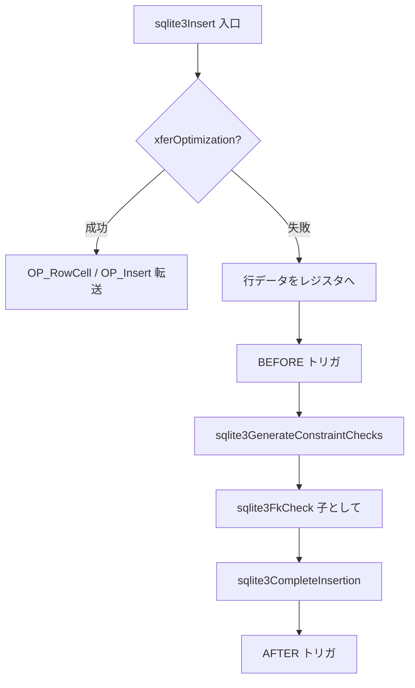

# 第10章 INSERT / DELETE / UPDATE / UPSERT

> **本章で読むソース**
>
> - [src/insert.c](https://github.com/sqlite/sqlite/blob/version-3.53.3/src/insert.c)
> - [src/delete.c](https://github.com/sqlite/sqlite/blob/version-3.53.3/src/delete.c)
> - [src/update.c](https://github.com/sqlite/sqlite/blob/version-3.53.3/src/update.c)
> - [src/upsert.c](https://github.com/sqlite/sqlite/blob/version-3.53.3/src/upsert.c)

## この章の狙い

第6章から第9章までで SELECT の式生成と WHERE ループは追った。
本章では変更文（DML）のコンパイル経路に移り、`sqlite3Insert`、`sqlite3DeleteFrom`、`sqlite3Update` が VDBE の `OP_Insert`、`OP_Delete`、`OP_IdxInsert` へどう落ちるかを読む。
制約違反の検査と外部キー検査が、トリガの前後のどの位置で呼ばれるかもここで固定する。
UPSERT は `insert.c` から `upsert.c` へ委譲され、衝突時に `sqlite3Update` を再利用する。

## 前提

パーサは DML をそれぞれの `sqlite3*` 関数へ直接渡す。
`sqlite3GetVdbe` で VDBE を確保し、`sqlite3BeginWriteOperation` で書き込みトランザクション開始を記録する。
行データはレジスタブロック（`regIns`、`regNewRowid` など）に集め、インデックス用レジスタ配列 `aRegIdx` とセットで `sqlite3CompleteInsertion` へ渡す。
制約検査の本体は `sqlite3GenerateConstraintChecks`（`insert.c`）にあり、UNIQUE 違反や CHECK 式の評価は INSERT と UPDATE の両方から共有される。

## sqlite3Insert：入口と xfer 最適化

`sqlite3Insert` は対象表の解決、トリガ有無の判定、VDBE 確保のあと、条件を満たす `INSERT INTO ... SELECT * FROM ...` なら `xferOptimization` を試す。
xfer が成功すれば通常の行ループを丸ごと省略し `insert_end` へ飛ぶ。

[src/insert.c L894-L1038](https://github.com/sqlite/sqlite/blob/version-3.53.3/src/insert.c#L894-L1038)

```c
void sqlite3Insert(
  Parse *pParse,        /* Parser context */
  SrcList *pTabList,    /* Name of table into which we are inserting */
  Select *pSelect,      /* A SELECT statement to use as the data source */
  IdList *pColumn,      /* Column names corresponding to IDLIST, or NULL. */
  int onError,          /* How to handle constraint errors */
  Upsert *pUpsert       /* ON CONFLICT clauses for upsert, or NULL */
){
  // ... (中略) ...
  v = sqlite3GetVdbe(pParse);
  if( v==0 ) goto insert_cleanup;
  if( pParse->nested==0 ) sqlite3VdbeCountChanges(v);
  sqlite3BeginWriteOperation(pParse, pSelect || pTrigger, iDb);

#ifndef SQLITE_OMIT_XFER_OPT
  if( pColumn==0
   && pSelect!=0
   && pTrigger==0
   && xferOptimization(pParse, pTab, pSelect, onError, iDb)
  ){
    assert( !pTrigger );
    assert( pList==0 );
    goto insert_end;
  }
#endif /* SQLITE_OMIT_XFER_OPT */
  // ... (中略) ...
```

`xferOptimization` は構文とスキーマの両方を厳しく照合する。
`SELECT` 側に WHERE、GROUP BY、LIMIT、複合クエリがあれば即座に諦める。
列数、INTEGER PRIMARY KEY の位置、各列のアフィニティと照合順序、対応インデックスの互換性まで一致したときだけ、ソース表カーソルからレコードをそのまま転送する。

[src/insert.c L3052-L3077](https://github.com/sqlite/sqlite/blob/version-3.53.3/src/insert.c#L3052-L3077)

```c
  if( pSelect->pSrc->nSrc!=1 ){
    return 0;   /* FROM clause must have exactly one term */
  }
  if( pSelect->pSrc->a[0].fg.isSubquery ){
    return 0;   /* FROM clause cannot contain a subquery */
  }
  if( pSelect->pWhere ){
    return 0;   /* SELECT may not have a WHERE clause */
  }
  if( pSelect->pOrderBy ){
    return 0;   /* SELECT may not have an ORDER BY clause */
  }
  // ... (中略) ...
  if( pSelect->selFlags & SF_Distinct ){
    return 0;   /* SELECT may not be DISTINCT */
  }
  pEList = pSelect->pEList;
  assert( pEList!=0 );
  if( pEList->nExpr!=1 ){
    return 0;   /* The result set must have exactly one column */
  }
  assert( pEList->a[0].pExpr );
  if( pEList->a[0].pExpr->op!=TK_ASTERISK ){
    return 0;   /* The result set must be the special operator "*" */
  }
```

転送本体では `OP_RowCell` でセルを転送し、`OP_Insert` と `OP_IdxInsert` に `OPFLAG_APPEND` を付けて B-tree への追記を前提にコストを下げる。
`OP_RowCell` 自体には P5 は設定されない。
VACUUM 経路ではインデックス列がすべて BINARY 照合のとき `OP_SeekEnd` で挿入位置探索を省略する（後述の最適化節）。

[src/insert.c L3307-L3314](https://github.com/sqlite/sqlite/blob/version-3.53.3/src/insert.c#L3307-L3314)

```c
    {
      sqlite3VdbeAddOp3(v, OP_RowCell, iDest, iSrc, regRowid);
    }
    sqlite3VdbeAddOp3(v, OP_Insert, iDest, regData, regRowid);
    if( (db->mDbFlags & DBFLAG_Vacuum)==0 ){
      sqlite3VdbeChangeP4(v, -1, (char*)pDest, P4_TABLE);
    }
    sqlite3VdbeChangeP5(v, insFlags);
```

[src/insert.c L3373-L3374](https://github.com/sqlite/sqlite/blob/version-3.53.3/src/insert.c#L3373-L3374)

```c
    sqlite3VdbeAddOp2(v, OP_IdxInsert, iDest, regData);
    sqlite3VdbeChangeP5(v, idxInsFlags|OPFLAG_APPEND);
```

## INSERT ループ内の制約検査と外部キー

xfer を使わない経路では、各行について生成列の計算、アフィニティ適用、BEFORE トリガのあと、制約検査と FK 検査、実挿入の順になる。
`sqlite3GenerateConstraintChecks` が UNIQUE や CHECK を処理し、その直後に子表としての FK を `sqlite3FkCheck` で検証する。
最後に `sqlite3CompleteInsertion` が各インデックスへ `OP_IdxInsert`、本体へ `OP_Insert` を並べる。

[src/insert.c L1567-L1587](https://github.com/sqlite/sqlite/blob/version-3.53.3/src/insert.c#L1567-L1587)

```c
      int isReplace = 0;/* Set to true if constraints may cause a replace */
      int bUseSeek;     /* True to use OPFLAG_SEEKRESULT */
      sqlite3GenerateConstraintChecks(pParse, pTab, aRegIdx, iDataCur, iIdxCur,
          regIns, 0, ipkColumn>=0, onError, endOfLoop, &isReplace, 0, pUpsert
      );
      if( db->flags & SQLITE_ForeignKeys ){
        sqlite3FkCheck(pParse, pTab, 0, regIns, 0, 0);
      }
      // ... (中略) ...
      bUseSeek = (isReplace==0 || !sqlite3VdbeHasSubProgram(v));
      sqlite3CompleteInsertion(pParse, pTab, iDataCur, iIdxCur,
          regIns, aRegIdx, 0, appendFlag, bUseSeek
      );
```

`sqlite3CompleteInsertion` はインデックスを先に更新し、rowid 表なら最後にデータ B-tree へ `OP_Insert` を発行する。
`appendBias` が真なら `OPFLAG_APPEND` を付け、単調増加 rowid への追記をヒントする。

[src/insert.c L2806-L2846](https://github.com/sqlite/sqlite/blob/version-3.53.3/src/insert.c#L2806-L2846)

```c
  for(i=0, pIdx=pTab->pIndex; pIdx; pIdx=pIdx->pNext, i++){
    // ... (中略) ...
    if( aRegIdx[i]==0 ) continue;
    // ... (中略) ...
    sqlite3VdbeAddOp4Int(v, OP_IdxInsert, iIdxCur+i, aRegIdx[i],
                         aRegIdx[i]+1,
                         pIdx->uniqNotNull ? pIdx->nKeyCol: pIdx->nColumn);
    sqlite3VdbeChangeP5(v, pik_flags);
  }
  if( !HasRowid(pTab) ) return;
  // ... (中略) ...
  if( appendBias ){
    pik_flags |= OPFLAG_APPEND;
  }
  // ... (中略) ...
  sqlite3VdbeAddOp3(v, OP_Insert, iDataCur, aRegIdx[i], regNewData);
  // ... (中略) ...
  sqlite3VdbeChangeP5(v, pik_flags);
```

AFTER トリガは挿入完了後に `sqlite3CodeRowTrigger` で別サブプログラムとして差し込まれる（第11章）。

## sqlite3DeleteFrom：WHERE ループと一括消去

`sqlite3DeleteFrom` は `sqlite3WhereBegin` で対象行を走査し、行ごとに OLD レジスタを埋めてから削除する。
`bComplex` はトリガまたは FK 処理が必要なとき真になり、単純な全行削除最適化の対象外になる。
WHERE 句がなく、仮想表でもビューでもなく、トリガも FK も無いときは `OP_Clear` で表全体を一括消去する。

[src/delete.c L358-L373](https://github.com/sqlite/sqlite/blob/version-3.53.3/src/delete.c#L358-L373)

```c
  bComplex = pTrigger || sqlite3FkRequired(pParse, pTab, 0, 0);
  // ... (中略) ...
```

[src/delete.c L471-L483](https://github.com/sqlite/sqlite/blob/version-3.53.3/src/delete.c#L471-L483)

```c
  if( rcauth==SQLITE_OK
   && pWhere==0
   && !bComplex
   && !IsVirtual(pTab)
  ){
    assert( !isView );
    sqlite3TableLock(pParse, iDb, pTab->tnum, 1, pTab->zName);
    if( HasRowid(pTab) ){
      sqlite3VdbeAddOp4(v, OP_Clear, pTab->tnum, iDb, memCnt ? memCnt : -1,
                        pTab->zName, P4_STATIC);
    }
```

通常経路の1行削除では、BEFORE トリガのあと `sqlite3FkCheck` が親側参照整合を検査し、インデックス削除と `OP_Delete`、FK アクション、AFTER トリガの順で進む。

[src/delete.c L807-L832](https://github.com/sqlite/sqlite/blob/version-3.53.3/src/delete.c#L807-L832)

```c
    sqlite3CodeRowTrigger(pParse, pTrigger,
        TK_DELETE, 0, TRIGGER_BEFORE, pTab, iOld, onconf, iLabel
    );
    // ... (中略) ...
    sqlite3FkCheck(pParse, pTab, iOld, 0, 0, 0);
```

## sqlite3Update：変更列マップと再挿入

`sqlite3Update` は `aXRef[]` に「どの表列が SET 句で更新されるか」を記録する。
`sqlite3FkRequired` と主キー変更フラグ `chngKey` から、開くカーソルと FK 検査の要否を決める。
ループ本体では制約検査、旧行に対する FK 検査、インデックス削除、新行に対する FK 検査、`sqlite3CompleteInsertion`（`OPFLAG_ISUPDATE` 付き）という流れになる。

[src/update.c L560-L561](https://github.com/sqlite/sqlite/blob/version-3.53.3/src/update.c#L560-L561)

```c
  hasFK = sqlite3FkRequired(pParse, pTab, aXRef, chngKey);
```

[src/update.c L1031-L1101](https://github.com/sqlite/sqlite/blob/version-3.53.3/src/update.c#L1031-L1101)

```c
    sqlite3GenerateConstraintChecks(pParse, pTab, aRegIdx, iDataCur, iIdxCur,
        regNewRowid, regOldRowid, chngKey, onError, labelContinue, &bReplace,
        aXRef, 0);
    // ... (中略) ...
    if( hasFK ){
      sqlite3FkCheck(pParse, pTab, regOldRowid, 0, aXRef, chngKey);
    }
    sqlite3GenerateRowIndexDelete(pParse, pTab, iDataCur, iIdxCur, aRegIdx, -1);
    // ... (中略) ...
    if( hasFK ){
      sqlite3FkCheck(pParse, pTab, 0, regNewRowid, aXRef, chngKey);
    }
    sqlite3CompleteInsertion(
        pParse, pTab, iDataCur, iIdxCur, regNewRowid, aRegIdx,
        OPFLAG_ISUPDATE | (eOnePass==ONEPASS_MULTI ? OPFLAG_SAVEPOSITION : 0),
        0, 0
    );
    if( hasFK ){
      sqlite3FkActions(pParse, pTab, pChanges, regOldRowid, aXRef, chngKey);
    }
```

UPDATE でも BEFORE トリガは制約検査より前、AFTER トリガは書き込み完了後に走る。
ONEPASS 最適化（第9章）が効くときは `ONEPASS_SINGLE`（単一行）または `ONEPASS_MULTI`（複数行）があり、追加カーソルを省けるのは主に `ONEPASS_SINGLE` である。

[src/update.c L732-L757](https://github.com/sqlite/sqlite/blob/version-3.53.3/src/update.c#L732-L757)

```c
      flags = WHERE_ONEPASS_DESIRED;
      if( !pParse->nested
       && !pTrigger
       && !hasFK
       && !chngKey
       && !bReplace
       && (pWhere==0 || !ExprHasProperty(pWhere, EP_Subquery))
      ){
        flags |= WHERE_ONEPASS_MULTIROW;
      }
      pWInfo = sqlite3WhereBegin(pParse, pTabList, pWhere,0,0,0,flags,iIdxCur);
      // ... (中略) ...
      eOnePass = sqlite3WhereOkOnePass(pWInfo, aiCurOnePass);
      bFinishSeek = sqlite3WhereUsesDeferredSeek(pWInfo);
      if( eOnePass!=ONEPASS_SINGLE ){
        sqlite3MultiWrite(pParse);
        if( eOnePass==ONEPASS_MULTI ){
          int iCur = aiCurOnePass[1];
          if( iCur>=0 && iCur!=iDataCur && aToOpen[iCur-iBaseCur] ){
            eOnePass = ONEPASS_OFF;
          }
          assert( iCur!=iDataCur || !HasRowid(pTab) );
        }
      }
```

[src/update.c L1125-L1129](https://github.com/sqlite/sqlite/blob/version-3.53.3/src/update.c#L1125-L1129)

```c
  if( eOnePass==ONEPASS_SINGLE ){
    /* Nothing to do at end-of-loop for a single-pass */
  }else if( eOnePass==ONEPASS_MULTI ){
    sqlite3VdbeResolveLabel(v, labelContinue);
    sqlite3WhereEnd(pWInfo);
```

## UPSERT：`sqlite3UpsertDoUpdate` と INSERT への接続

`sqlite3UpsertAnalyzeTarget` は ON CONFLICT 対象列を UNIQUE インデックスへ結び付ける。
衝突検出は `sqlite3GenerateConstraintChecks` 内で行われ、DO UPDATE 節があれば `sqlite3UpsertDoUpdate` が `sqlite3Update` を再帰的に呼ぶ。
`excluded.*` 列は INSERT 用レジスタ `regData` 上に既に載っており、REAL アフィニティ列は `OP_RealAffinity` で正規化してから UPDATE へ渡す。

[src/upsert.c L90-L133](https://github.com/sqlite/sqlite/blob/version-3.53.3/src/upsert.c#L90-L133)

```c
int sqlite3UpsertAnalyzeTarget(
  Parse *pParse,     /* The parsing context */
  SrcList *pTabList, /* Table into which we are inserting */
  Upsert *pUpsert,   /* The ON CONFLICT clauses */
  Upsert *pAll       /* Complete list of all ON CONFLICT clauses */
){
  // ... (中略) ...
  for(; pUpsert && pUpsert->pUpsertTarget;
        pUpsert=pUpsert->pNextUpsert, nClause++){
    rc = sqlite3ResolveExprListNames(&sNC, pUpsert->pUpsertTarget);
    if( rc ) return rc;
    // ... (中略) ...
    if( HasRowid(pTab) 
     && pTarget->nExpr==1
     && (pTerm = pTarget->a[0].pExpr)->op==TK_COLUMN
     && pTerm->iColumn==XN_ROWID
    ){
      assert( pUpsert->pUpsertIdx==0 );
      continue;
    }
```

[src/upsert.c L267-L327](https://github.com/sqlite/sqlite/blob/version-3.53.3/src/upsert.c#L267-L327)

```c
void sqlite3UpsertDoUpdate(
  Parse *pParse,        /* The parsing and code-generating context */
  Upsert *pUpsert,      /* The ON CONFLICT clause for the upsert */
  Table *pTab,          /* The table being updated */
  Index *pIdx,          /* The UNIQUE constraint that failed */
  int iCur              /* Cursor for pIdx (or pTab if pIdx==NULL) */
){
  // ... (中略) ...
  pSrc = sqlite3SrcListDup(db, pTop->pUpsertSrc, 0);
  for(i=0; i<pTab->nCol; i++){
    if( pTab->aCol[i].affinity==SQLITE_AFF_REAL ){
      int iStorage = pTop->regData + sqlite3TableColumnToStorage(pTab, i);
      sqlite3VdbeAddOp1(v, OP_RealAffinity, iStorage);
    }
  }
  sqlite3Update(pParse, pSrc, sqlite3ExprListDup(db,pUpsert->pUpsertSet,0),
      sqlite3ExprDup(db,pUpsert->pUpsertWhere,0), OE_Abort, 0, 0, pUpsert);
```

## DML 1行処理の流れ

INSERT（xfer 以外）の典型経路をまとめる。
DELETE と UPDATE も制約検査の前後でトリガと FK の位置が同型である。



UPDATE は E のあと旧行 FK、インデックス削除、新行 FK、`sqlite3CompleteInsertion`、最後に `sqlite3FkActions` が続く。
DELETE は C に相当する OLD 組み立てのあと FK、インデックス削除、`OP_Delete`、FK アクションの順になる。

## 高速化と最適化の工夫

**xfer 最適化**は、SELECT 結果を一度レジスタに展開せず B-tree セル単位で複製する。
レコード組み立てと式評価を省けるため、VACUUM や大規模 `INSERT INTO t2 SELECT * FROM t1` で効く。
条件不一致時は静かに通常 INSERT へフォールバックし、正しさは通常経路と同じになる。

**`OP_Clear` による全行削除**は、ページ単位の消去で行ごとの `OP_Delete` ループを避ける。
トリガや FK が絡むと `bComplex` が立ち、この経路には入らない。

**`OPFLAG_APPEND` と `OPFLAG_USESEEKRESULT`**は、単調増加挿入や直前の制約検査でカーソル位置が既知なとき、B-tree 内の再探索を省略する。
`sqlite3CompleteInsertion` と xfer の双方で付与条件がコメントされている。

**IDLIST 順序判定 `bIdListInOrder`**は、INSERT の列リストが表定義の格納順ならレジスタの並べ替えを省略する。
`TF_OOOHidden` または `TF_HasStored` が立つ表では偽陽性を避けるため保守的に偽にする（`insert.c` L1071-L1076）。
列リストで生成列（`COLFLAG_STORED` や `COLFLAG_VIRTUAL`）へ直接 INSERT しようとした場合は別途エラーになる（L1088-L1094）。

[src/insert.c L1071-L1094](https://github.com/sqlite/sqlite/blob/version-3.53.3/src/insert.c#L1071-L1094)

```c
  bIdListInOrder = (pTab->tabFlags & (TF_OOOHidden|TF_HasStored))==0;
  if( pColumn ){
    aTabColMap = sqlite3DbMallocZero(db, pTab->nCol*sizeof(int));
    if( aTabColMap==0 ) goto insert_cleanup;
    for(i=0; i<pColumn->nId; i++){
      j = sqlite3ColumnIndex(pTab, pColumn->a[i].zName);
      if( j>=0 ){
        if( aTabColMap[j]==0 ) aTabColMap[j] = i+1;
        if( i!=j ) bIdListInOrder = 0;
        if( j==pTab->iPKey ){
          ipkColumn = i;  assert( !withoutRowid );
        }
#ifndef SQLITE_OMIT_GENERATED_COLUMNS
        if( pTab->aCol[j].colFlags & (COLFLAG_STORED|COLFLAG_VIRTUAL) ){
          sqlite3ErrorMsg(pParse,
             "cannot INSERT into generated column \"%s\"",
             pTab->aCol[j].zCnName);
          goto insert_cleanup;
        }
#endif
```

## まとめ

DML コンパイラは SELECT と同じ VDBE 命令セットを使い、行レジスタを軸に制約検査、FK 検査、B-tree 更新を順序固定で挿入する。
INSERT は xfer で一括転送を試み、DELETE は条件付きで `OP_Clear`、UPDATE と UPSERT は `sqlite3CompleteInsertion` を UPDATE モードで再利用する。
制約検査は `sqlite3GenerateConstraintChecks` に集約され、FK は `sqlite3FkCheck` が子表と親表の両方向を担当する（第11章）。

## 関連する章

- [第6章 式のコード生成と定数式因数分解](06-expr-codegen.md)
- [第9章 クエリプランナ（2）ループ候補とコード生成](09-planner-loops-codegen.md)
- [第11章 トリガと外部キー制約](11-trigger-fkey.md)
- [第19章 B-tree（3）挿入、削除、バランス](../part04-storage/19-btree-balance.md)
