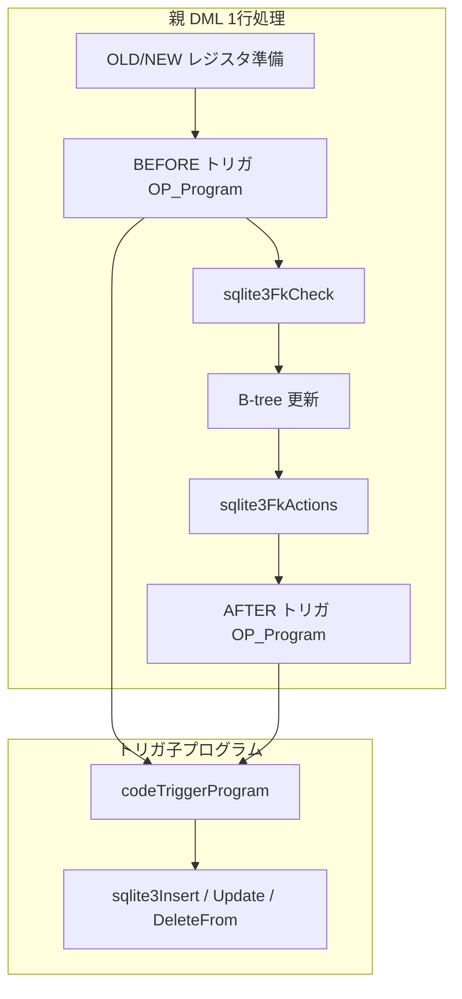

# 第11章 トリガと外部キー制約

> **本章で読むソース**
>
> - [src/trigger.c](https://github.com/sqlite/sqlite/blob/version-3.53.3/src/trigger.c)
> - [src/fkey.c](https://github.com/sqlite/sqlite/blob/version-3.53.3/src/fkey.c)

## この章の狙い

第10章で DML が VDBE へ落ちる順序は追った。
本章では、その途中に割り込む行トリガと外部キー（FK）強制のコード生成を読む。
`sqlite3CodeRowTrigger` がいつサブプログラムを親 VDBE へ差し込むか、`sqlite3FkCheck` と `fkScanChildren` が参照整合をどう検査するかを、INSERT や DELETE からの呼び出し位置と合わせて固定する。

## 前提

トリガ本体は `TriggerStep` の連鎖として保持され、発火時に `codeTriggerProgram` が各ステップを再び `sqlite3Insert` などへ振り分ける。
行トリガ用の OLD と NEW は連続レジスタに載せ、親プログラムから `OP_Program` で子 VDBE を呼ぶ。
FK 強制は `PRAGMA foreign_keys=ON` のときだけ動き、`sqlite3FkCheck` が子側参照（親行の存在）と親側参照（子行の残存）の両方を処理する。
即時 FK の最終判定は VDBE 停止時の `sqlite3VdbeCheckFkImmediate` が担い、結果出力前には `OP_FkCheck` が早期検査を行う。
遅延 FK は `OP_FkCounter` でカウンタを更新し、トランザクション COMMIT 時に `sqlite3VdbeCheckFkDeferred` が未解消を検査する（`fkey.c` L23-L38, L31-L38）。

[src/fkey.c L23-L38](https://github.com/sqlite/sqlite/blob/version-3.53.3/src/fkey.c#L23-L38)

```c
** Foreign keys in SQLite come in two flavours: deferred and immediate.
** If an immediate foreign key constraint is violated,
** SQLITE_CONSTRAINT_FOREIGNKEY is returned and the current
** statement transaction rolled back. If a 
** deferred foreign key constraint is violated, no action is taken 
** immediately. However if the application attempts to commit the 
** transaction before fixing the constraint violation, the attempt fails.
**
** Deferred constraints are implemented using a simple counter associated
** with the database handle. The counter is set to zero each time a 
** database transaction is opened. Each time a statement is executed 
** that causes a foreign key violation, the counter is incremented. Each
** time a statement is executed that removes an existing violation from
** the database, the counter is decremented. When the transaction is
** committed, the commit fails if the current value of the counter is
** greater than zero.
```

[src/fkey.c L87-L96](https://github.com/sqlite/sqlite/blob/version-3.53.3/src/fkey.c#L87-L96)

```c
** Immediate constraints are usually handled similarly. The only difference 
** is that the counter used is stored as part of each individual statement
** object (struct Vdbe). If, after the statement has run, its immediate
** constraint counter is greater than zero,
** it returns SQLITE_CONSTRAINT_FOREIGNKEY
** and the statement transaction is rolled back. An exception is an INSERT
** statement that inserts a single row only (no triggers). In this case,
** instead of using a counter, an exception is thrown immediately if the
** INSERT violates a foreign key constraint. This is necessary as such
** an INSERT does not open a statement transaction.
```

## sqlite3CodeRowTrigger：いつどのトリガをコードするか

`sqlite3CodeRowTrigger` は表にぶら下がる `Trigger` リストを走査し、操作種別（INSERT、UPDATE、DELETE）、タイミング（BEFORE、AFTER）、UPDATE OF 列の重なりを `checkColumnOverlap` で確認する。
一致したトリガだけ `sqlite3CodeRowTriggerDirect` または RETURNING 用の `codeReturningTrigger` へ進む。

[src/trigger.c L1468-L1510](https://github.com/sqlite/sqlite/blob/version-3.53.3/src/trigger.c#L1468-L1510)

```c
void sqlite3CodeRowTrigger(
  Parse *pParse,       /* Parse context */
  Trigger *pTrigger,   /* List of triggers on table pTab */
  int op,              /* One of TK_UPDATE, TK_INSERT, TK_DELETE */
  ExprList *pChanges,  /* Changes list for any UPDATE OF triggers */
  int tr_tm,           /* One of TRIGGER_BEFORE, TRIGGER_AFTER */
  Table *pTab,         /* The table to code triggers from */
  int reg,             /* The first in an array of registers (see above) */
  int orconf,          /* How to handle constraint errors */
  int ignoreJump       /* Instruction to jump to for RAISE(IGNORE) */
){
  Trigger *p;          /* Used to iterate through pTrigger list */

  assert( op==TK_UPDATE || op==TK_INSERT || op==TK_DELETE );
  assert( tr_tm==TRIGGER_BEFORE || tr_tm==TRIGGER_AFTER );
  assert( (op==TK_UPDATE)==(pChanges!=0) );

  for(p=pTrigger; p; p=p->pNext){
    // ... (中略) ...
    if( (p->op==op || (p->bReturning && p->op==TK_INSERT && op==TK_UPDATE))
     && p->tr_tm==tr_tm 
     && checkColumnOverlap(p->pColumns, pChanges)
    ){
      if( !p->bReturning ){
        sqlite3CodeRowTriggerDirect(pParse, p, pTab, reg, orconf, ignoreJump);
      }else if( sqlite3IsToplevel(pParse) ){
        codeReturningTrigger(pParse, p, pTab, reg);
      }
    }
  }
}
```

`sqlite3CodeRowTriggerDirect` は `getRowTrigger` でトップレベル `Parse` 内の `TriggerPrg` キャッシュを探し、見つからなければ `codeRowTrigger` で子 VDBE を生成する。
呼び出しのたびに親 VDBE へ新しい `OP_Program` を追加し、その P4 が同じ `pPrg->pProgram` を指す（既存命令の P4 差し替えではない）。

[src/trigger.c L1361-L1387](https://github.com/sqlite/sqlite/blob/version-3.53.3/src/trigger.c#L1361-L1387)

```c
static TriggerPrg *getRowTrigger(
  Parse *pParse,       /* Current parse context */
  Trigger *pTrigger,   /* Trigger to code */
  Table *pTab,         /* The table trigger pTrigger is attached to */
  int orconf           /* ON CONFLICT algorithm. */
){
  Parse *pRoot = sqlite3ParseToplevel(pParse);
  TriggerPrg *pPrg;

  assert( pTrigger->zName==0 || pTab==tableOfTrigger(pTrigger) );

  /* It may be that this trigger has already been coded (or is in the
  ** process of being coded). If this is the case, then an entry with
  ** a matching TriggerPrg.pTrigger field will be present somewhere
  ** in the Parse.pTriggerPrg list. Search for such an entry.  */
  for(pPrg=pRoot->pTriggerPrg; 
      pPrg && (pPrg->pTrigger!=pTrigger || pPrg->orconf!=orconf); 
      pPrg=pPrg->pNext
  );

  /* If an existing TriggerPrg could not be located, create a new one. */
  if( !pPrg ){
    pPrg = codeRowTrigger(pParse, pTrigger, pTab, orconf);
    pParse->db->errByteOffset = -1;
  }

  return pPrg;
}
```

[src/trigger.c L1396-L1425](https://github.com/sqlite/sqlite/blob/version-3.53.3/src/trigger.c#L1396-L1425)

```c
void sqlite3CodeRowTriggerDirect(
  Parse *pParse,       /* Parse context */
  Trigger *p,          /* Trigger to code */
  Table *pTab,         /* The table to code triggers from */
  int reg,             /* Reg array containing OLD.* and NEW.* values */
  int orconf,          /* ON CONFLICT policy */
  int ignoreJump       /* Instruction to jump to for RAISE(IGNORE) */
){
  Vdbe *v = sqlite3GetVdbe(pParse); /* Main VM */
  TriggerPrg *pPrg;
  pPrg = getRowTrigger(pParse, p, pTab, orconf);
  assert( pPrg || pParse->nErr );

  if( pPrg ){
    int bRecursive = (p->zName && 0==(pParse->db->flags&SQLITE_RecTriggers));

    sqlite3VdbeAddOp4(v, OP_Program, reg, ignoreJump, ++pParse->nMem,
                      (const char *)pPrg->pProgram, P4_SUBPROGRAM);
    // ... (中略) ...
    sqlite3VdbeChangeP5(v, (u16)bRecursive);
  }
}
```

DML 側の呼び出し位置は第10章のとおり、INSERT では制約検査の直前に BEFORE、挿入完了後に AFTER が走る。

## codeTriggerProgram：トリガ本体の再帰的コンパイル

`codeTriggerProgram` はトリガ内の各 `TriggerStep` を、外側 DML と同じコンパイラ関数へ渡す。
親文の `ON CONFLICT` 方針は `pParse->eOrconf` として子ステップへ継承される。
各ステップのあと `OP_ResetCount` で変更行カウンタをリセットし、ネストした DML の副作用を隔離する。

[src/trigger.c L1111-L1176](https://github.com/sqlite/sqlite/blob/version-3.53.3/src/trigger.c#L1111-L1176)

```c
static int codeTriggerProgram(
  Parse *pParse,            /* The parser context */
  TriggerStep *pStepList,   /* List of statements inside the trigger body */
  int orconf                /* Conflict algorithm. (OE_Abort, etc) */  
){
  TriggerStep *pStep;
  Vdbe *v = pParse->pVdbe;
  sqlite3 *db = pParse->db;

  assert( pParse->pTriggerTab && pParse->pToplevel );
  assert( pStepList );
  assert( v!=0 );
  for(pStep=pStepList; pStep; pStep=pStep->pNext){
    pParse->eOrconf = (orconf==OE_Default)?pStep->orconf:(u8)orconf;
    assert( pParse->okConstFactor==0 );
    // ... (中略) ...
    switch( pStep->op ){
      case TK_UPDATE: {
        sqlite3Update(pParse, 
          sqlite3SrcListDup(db, pStep->pSrc, 0),
          sqlite3ExprListDup(db, pStep->pExprList, 0), 
          sqlite3ExprDup(db, pStep->pWhere, 0), 
          pParse->eOrconf, 0, 0, 0
        );
        sqlite3VdbeAddOp0(v, OP_ResetCount);
        break;
      }
      case TK_INSERT: {
        sqlite3Insert(pParse, 
          sqlite3SrcListDup(db, pStep->pSrc, 0),
          sqlite3SelectDup(db, pStep->pSelect, 0), 
          sqlite3IdListDup(db, pStep->pIdList), 
          pParse->eOrconf,
          sqlite3UpsertDup(db, pStep->pUpsert)
        );
        sqlite3VdbeAddOp0(v, OP_ResetCount);
        break;
      }
      case TK_DELETE: {
        sqlite3DeleteFrom(pParse, 
          sqlite3SrcListDup(db, pStep->pSrc, 0),
          sqlite3ExprDup(db, pStep->pWhere, 0), 0, 0
        );
        sqlite3VdbeAddOp0(v, OP_ResetCount);
        break;
      }
```

トリガが再入可能かは `SQLITE_RecTriggers` フラグと `OP_Program` の P5 で制御される。
BEFORE トリガがカーソル位置を動かした場合、DML 側は `OP_NotExists` や `OP_FinishSeek` で行を再定位する（`delete.c` の `GenRowDel` 参照）。

## sqlite3FkCheck：子参照と親参照の二段走査

`sqlite3FkCheck` は `regOld` と `regNew` のどちらか一方だけが非ゼロであることを前提に、操作方向を判定する。
最初のループは「この表が子」の FK について、親表へ `fkLookupParent` で参照先行の存在を調べる。
2番目のループは「この表が親」の FK について、子表を `fkScanChildren` で走査しカウンタを更新する。

[src/fkey.c L889-L1012](https://github.com/sqlite/sqlite/blob/version-3.53.3/src/fkey.c#L889-L1012)

```c
void sqlite3FkCheck(
  Parse *pParse,                  /* Parse context */
  Table *pTab,                    /* Row is being deleted from this table */ 
  int regOld,                     /* Previous row data is stored here */
  int regNew,                     /* New row data is stored here */
  int *aChange,                   /* Array indicating UPDATEd columns (or 0) */
  int bChngRowid                  /* True if rowid is UPDATEd */
){
  sqlite3 *db = pParse->db;       /* Database handle */
  FKey *pFKey;                    /* Used to iterate through FKs */
  // ... (中略) ...

  assert( (regOld==0)!=(regNew==0) );

  if( (db->flags&SQLITE_ForeignKeys)==0 ) return;
  if( !IsOrdinaryTable(pTab) ) return;

  for(pFKey=pTab->u.tab.pFKey; pFKey; pFKey=pFKey->pNextFrom){
    // ... (中略) ...
    if( regOld!=0 ){
      fkLookupParent(pParse, iDb, pTo, pIdx, pFKey, aiCol, regOld, -1, bIgnore);
    }
    if( regNew!=0 && !isSetNullAction(pParse, pFKey) ){
      fkLookupParent(pParse, iDb, pTo, pIdx, pFKey, aiCol, regNew, +1, bIgnore);
    }
    // ... (中略) ...
  }
```

UPDATE では第10章のとおり、旧行に対する検査（親削除相当）と新行に対する検査（親挿入相当）の両方が走る。
親表への単一行 INSERT で即時 FK が成立しないケースは、2番目のループ先頭で `continue` され、不要な子表走査を省く。

[src/fkey.c L1028-L1035](https://github.com/sqlite/sqlite/blob/version-3.53.3/src/fkey.c#L1028-L1035)

```c
    if( !pFKey->isDeferred && !(db->flags & SQLITE_DeferFKs) 
     && !pParse->pToplevel && !pParse->isMultiWrite 
    ){
      assert( regOld==0 && regNew!=0 );
      continue;
    }
```

## fkScanChildren：WHERE 句の合成と VDBE 生成

親行の変更や削除で子行が残ると FK 違反になる。
`fkScanChildren` は親キー列と子キー列の等値を `AND` でつないだ WHERE 式を組み立て、第9章と同じ `sqlite3WhereBegin` で子表を走査する。
見つかった行ごとに `OP_FkCounter` で遅延または即時カウンタを増減する。

[src/fkey.c L575-L652](https://github.com/sqlite/sqlite/blob/version-3.53.3/src/fkey.c#L575-L652)

```c
  for(i=0; i<pFKey->nCol; i++){
    Expr *pLeft;                  /* Value from parent table row */
    Expr *pRight;                 /* Column ref to child table */
    Expr *pEq;                    /* Expression (pLeft = pRight) */
    // ... (中略) ...
    pLeft = exprTableRegister(pParse, pTab, regData, iCol);
    iCol = aiCol ? aiCol[i] : pFKey->aCol[0].iFrom;
    assert( iCol>=0 );
    zCol = pFKey->pFrom->aCol[iCol].zCnName;
    pRight = sqlite3Expr(db, TK_ID, zCol);
    pEq = sqlite3PExpr(pParse, TK_EQ, pLeft, pRight);
    pWhere = sqlite3ExprAnd(pParse, pWhere, pEq);
  }
  // ... (中略) ...
  if( pParse->nErr==0 ){
    pWInfo = sqlite3WhereBegin(pParse, pSrc, pWhere, 0, 0, 0, 0, 0);
    sqlite3VdbeAddOp2(v, OP_FkCounter, pFKey->isDeferred, nIncr);
    if( pWInfo ){
      sqlite3WhereEnd(pWInfo);
    }
  }
```

自己参照 FK では、現在処理中の親行自身を誤って数えないよう、rowid または主キー不等式を WHERE に追加する。
CASCADE や SET NULL アクションが後続で違反を解消する場合、`sqlite3MayAbort` を省略し、カウンタだけ更新する（`fkey.c` のコメント参照）。

## DML との接続：DELETE 1行の例

`delete.c` の `GenRowDel` は、OLD レジスタを埋めたあと BEFORE トリガ、FK 検査、物理削除、FK アクション、AFTER トリガの順がコードされる。
BEFORE トリガが何かを生成したときだけカーソルを再シークする。

[src/delete.c L807-L865](https://github.com/sqlite/sqlite/blob/version-3.53.3/src/delete.c#L807-L865)

```c
    sqlite3CodeRowTrigger(pParse, pTrigger,
        TK_DELETE, 0, TRIGGER_BEFORE, pTab, iOld, onconf, iLabel
    );
    // ... (中略) ...
    sqlite3FkCheck(pParse, pTab, iOld, 0, 0, 0);
  }
  // ... (中略) ...
  if( !IsView(pTab) ){
    sqlite3GenerateRowIndexDelete(pParse, pTab, iDataCur, iIdxCur,0,iIdxNoSeek);
    sqlite3VdbeAddOp2(v, OP_Delete, iDataCur, (count?OPFLAG_NCHANGE:0));
    // ... (中略) ...
  }
  sqlite3FkActions(pParse, pTab, 0, iOld, 0, 0);
  if( pTrigger ){
    sqlite3CodeRowTrigger(pParse, pTrigger,
        TK_DELETE, 0, TRIGGER_AFTER, pTab, iOld, onconf, iLabel
    );
  }
```

FK アクション（CASCADE など）自体もトリガと同様に `OP_Program` 付きのサブ VDBE として生成される。
`sqlite3CodeRowTriggerDirect` のコメントでは FK アクションを `p->zName` が NULL のトリガ扱いとしている。

## トリガと FK の処理フロー



INSERT は FK 検査が書き込み直前、DELETE は物理削除前に `sqlite3FkCheck` が子側の親参照検索と親側の `fkScanChildren` 走査の両方を生成し、削除後に `sqlite3FkActions` が続く。

## 高速化と最適化の工夫

**`sqlite3TriggerColmask`** は、トリガが参照する `old.*` や `new.*` 列だけをビットマスクで返す。
UPDATE や DELETE はマスク外の列をレジスタへ読み込まず、I/O とレジスタ圧力を下げる。

**親 INSERT 時の `fkScanChildren` 省略**は、即時 FK が単一行追加では親側違反を起こせないという不変条件に基づく。
トップレベル単一行 INSERT で子表の全走査を避ける。

**`TriggerPrg` キャッシュ**（`getRowTrigger`）は、同一トリガ定義と `orconf` の組に対する子 VDBE をトップレベル `Parse.pTriggerPrg` に保持する。
行ごとにパースし直さず、呼び出しごとに新しい `OP_Program` を発行して同じ `pProgram` を P4 で参照する。

**遅延 FK** は走査のたびに `OP_FkCounter` で DB 接続のカウンタを更新し、COMMIT 時に `sqlite3VdbeCheckFkDeferred` で一括判定する。
即時 FK は VDBE 単位のカウンタを、VDBE 停止時の `sqlite3VdbeCheckFkImmediate` で検査する（`OP_FkIfZero` はカウンタが 0 のとき走査を省く分岐であり、遅延 FK とは検査時点が異なる）。

## まとめ

行トリガは `sqlite3CodeRowTrigger` がフィルタし、`OP_Program` で子 VDBE を親へ差し込む。
トリガ本体は `codeTriggerProgram` が通常の DML コンパイラを再帰呼び出しする。
FK は `sqlite3FkCheck` が親参照と子走査を分け、`fkScanChildren` が WHERE プランナを再利用して `OP_FkCounter` を発行する。
DML 章で見た制約検査の直前後にこれらが固定位置で呼ばれることが、実行時の整合順序を決める。

## 関連する章

- [第10章 INSERT / DELETE / UPDATE / UPSERT](10-insert-delete-update.md)
- [第9章 クエリプランナ（2）ループ候補とコード生成](09-planner-loops-codegen.md)
- [第13章 VDBE バイトコードエンジン](../part03-vdbe/13-vdbe-engine.md)
