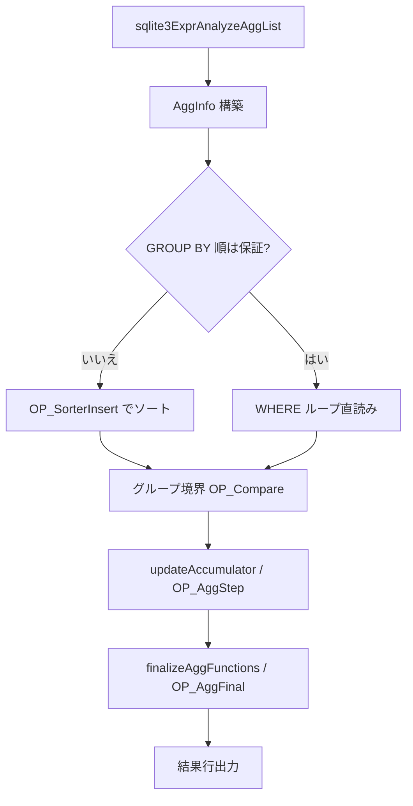

# 第12章 集約とウィンドウ関数

> **本章で読むソース**
>
> - [src/select.c](https://github.com/sqlite/sqlite/blob/version-3.53.3/src/select.c)
> - [src/window.c](https://github.com/sqlite/sqlite/blob/version-3.53.3/src/window.c)
> - [src/func.c](https://github.com/sqlite/sqlite/blob/version-3.53.3/src/func.c)
> - [src/sqliteInt.h](https://github.com/sqlite/sqlite/blob/version-3.53.3/src/sqliteInt.h)

## この章の狙い

第7章の `sqlite3Select` は集約を意図的に浅く扱い、本章で `AggInfo` を中心に GROUP BY のコード生成を読む。
集約関数の実体は VDBE の `OP_AggStep` と `OP_AggFinal` が `func.c` の `xStep` と `xFinal` を呼び出す。
ウィンドウ関数は `sqlite3WindowCodeStep` がフレーム境界ごとに同じ集約 API を再利用する。
SELECT コンパイラと実行エンジンの境界を、この2系統で押さえる。

## 前提

集約式は名前解決では `TK_AGG_FUNCTION` として識別されるだけで、`pAggInfo` と `iAgg` は `sqlite3ExprAnalyzeAggregates` が `AggInfo` を構築するときに付与される。
`sqlite3ExprAnalyzeAggregates` は名前解決後にのみ呼ぶ前提である（`expr.c` コメント参照）。
`AggInfo` は集約入力列（`aCol`）と集約関数（`aFunc`）のレジスタ割り当てをまとめ、`assignAggregateRegisters` 後に `AggInfoColumnReg` と `AggInfoFuncReg` マクロで位置を引ける。
ウィンドウ関数は `Expr` に `EP_WinFunc` が立ち、`updateAccumulator` からは除外され、別経路の `window.c` が担当する。

## AggInfo：集約処理のハブ

`AggInfo` は GROUP BY 式、ソート用インデックス番号、累積レジスタブロックの先頭 `iFirstReg` を保持する。
`directMode` はソート済み擬似表から列を読むモード、`useSortingIdx` は GROUP BY ソート後の二次走査を示す。

[src/sqliteInt.h L2905-L2957](https://github.com/sqlite/sqlite/blob/version-3.53.3/src/sqliteInt.h#L2905-L2957)

```c
struct AggInfo {
  u8 directMode;          /* Direct rendering mode means take data directly
                          ** from source tables rather than from accumulators */
  u8 useSortingIdx;       /* In direct mode, reference the sorting index rather
                          ** than the source table */
  u32 nSortingColumn;     /* Number of columns in the sorting index */
  int sortingIdx;         /* Cursor number of the sorting index */
  int sortingIdxPTab;     /* Cursor number of pseudo-table */
  int iFirstReg;          /* First register in range for aCol[] and aFunc[] */
  ExprList *pGroupBy;     /* The group by clause */
  struct AggInfo_col {    /* For each column used in source tables */
    Table *pTab;             /* Source table */
    Expr *pCExpr;            /* The original expression */
    int iTable;              /* Cursor number of the source table */
    int iColumn;             /* Column number within the source table */
    int iSorterColumn;       /* Column number in the sorting index */
  } *aCol;
  int nColumn;            /* Number of used entries in aCol[] */
  int nAccumulator;       /* Number of columns that show through to the output.
                          ** Additional columns are used only as parameters to
                          ** aggregate functions */
  struct AggInfo_func {   /* For each aggregate function */
    Expr *pFExpr;            /* Expression encoding the function */
    FuncDef *pFunc;          /* The aggregate function implementation */
    int iDistinct;           /* Ephemeral table used to enforce DISTINCT */
    // ... (中略) ...
  } *aFunc;
  int nFunc;              /* Number of entries in aFunc[] */
  u32 selId;              /* Select to which this AggInfo belongs */
```

## sqlite3Select 内の集約解析

`sqlite3Select` は WHERE ループに入る前に `sqlite3ExprAnalyzeAggList` で `AggInfo` を構築する。
このとき `analyzeAggregate` が各集約式へ `pAggInfo` と `iAgg` を設定する。

[src/expr.c L7544-L7568](https://github.com/sqlite/sqlite/blob/version-3.53.3/src/expr.c#L7544-L7568)

```c
        /* Make pExpr point to the appropriate pAggInfo->aFunc[] entry
        */
        assert( !ExprHasProperty(pExpr, EP_TokenOnly|EP_Reduced) );
        ExprSetVVAProperty(pExpr, EP_NoReduce);
        assert( i <= SMXV(pExpr->iAgg) );
        pExpr->iAgg = (i16)i;
        pExpr->pAggInfo = pAggInfo;
        return WRC_Prune;
      }else{
        return WRC_Continue;
      }
    }
  }
  return WRC_Continue;
}

/*
** Analyze the pExpr expression looking for aggregate functions and
** for variables that need to be added to AggInfo object that pNC->pAggInfo
** points to.  Additional entries are made on the AggInfo object as
** necessary.
**
** This routine should only be called after the expression has been
** analyzed by sqlite3ResolveExprNames().
*/
```

[src/select.c L8409-L8450](https://github.com/sqlite/sqlite/blob/version-3.53.3/src/select.c#L8409-L8450)

```c
    pAggInfo = sqlite3DbMallocZero(db, sizeof(*pAggInfo) );
    if( pAggInfo ){
      sqlite3ParserAddCleanup(pParse, agginfoFree, pAggInfo);
      testcase( pParse->earlyCleanup );
    }
    // ... (中略) ...
    pAggInfo->selId = p->selId;
    // ... (中略) ...
    pAggInfo->nSortingColumn = pGroupBy ? pGroupBy->nExpr : 0;
    pAggInfo->pGroupBy = pGroupBy;
    sqlite3ExprAnalyzeAggList(&sNC, pEList);
    sqlite3ExprAnalyzeAggList(&sNC, sSort.pOrderBy);
    if( pHaving ){
      if( pGroupBy ){
        // ... (中略) ...
        havingToWhere(pParse, p);
        pWhere = p->pWhere;
      }
      sqlite3ExprAnalyzeAggregates(&sNC, pHaving);
    }
    pAggInfo->nAccumulator = pAggInfo->nColumn;
    if( p->pGroupBy==0 && p->pHaving==0 && pAggInfo->nFunc==1 ){
      minMaxFlag = minMaxQuery(db, pAggInfo->aFunc[0].pFExpr, &pMinMaxOrderBy);
    }else{
      minMaxFlag = WHERE_ORDERBY_NORMAL;
    }
    analyzeAggFuncArgs(pAggInfo, &sNC);
```

HAVING があるときは GROUP BY と同様に `sqlite3ExprAnalyzeAggregates` の対象になる。
単一集約関数だけのクエリでは `minMaxQuery` が MIN や MAX 専用の順序付き走査へ切り替わる候補を探す。

## GROUP BY 付きクエリのコード生成

GROUP BY がある場合、プランナが GROUP BY 順を保証できなければ `OP_SorterOpen` で一時ソート表を作る。
`sqlite3WhereBegin` の入力ループで各行をソートキーとして `OP_SorterInsert` へ送り、ソート後にグループ境界を `OP_Compare` で検出する。
境界が変わったら出力サブルーチンへ `OP_Gosub` し、累積レジスタを `resetAccumulator` でクリアする。

[src/select.c L8495-L8534](https://github.com/sqlite/sqlite/blob/version-3.53.3/src/select.c#L8495-L8534)

```c
      pAggInfo->sortingIdx = pParse->nTab++;
      pKeyInfo = sqlite3KeyInfoFromExprList(pParse, pGroupBy,
                                            0, pAggInfo->nColumn);
      addrSortingIdx = sqlite3VdbeAddOp4(v, OP_SorterOpen,
          pAggInfo->sortingIdx, pAggInfo->nSortingColumn,
          0, (char*)pKeyInfo, P4_KEYINFO);
      // ... (中略) ...
      pWInfo = sqlite3WhereBegin(pParse, pTabList, pWhere, pGroupBy, pDistinct,
          p, (sDistinct.isTnct==2 ? WHERE_DISTINCTBY : WHERE_GROUPBY)
          |  (orderByGrp ? WHERE_SORTBYGROUP : 0) | distFlag, 0
      );
      // ... (中略) ...
      assignAggregateRegisters(pParse, pAggInfo);
```

グループ境界検出と累積更新の中核は次のブロックにある。
前グループの `iAMem` と現行の `iBMem` を比較し、変化があれば出力とリセットへ分岐する。
同一グループ内では `updateAccumulator` が `OP_AggStep` を発行する。

[src/select.c L8648-L8704](https://github.com/sqlite/sqlite/blob/version-3.53.3/src/select.c#L8648-L8704)

```c
      addrTopOfLoop = sqlite3VdbeCurrentAddr(v);
      if( groupBySort ){
        sqlite3VdbeAddOp3(v, OP_SorterData, pAggInfo->sortingIdx,
                          sortOut, sortPTab);
      }
      for(j=0; j<pGroupBy->nExpr; j++){
        // ... (中略) ...
        if( groupBySort ){
          sqlite3VdbeAddOp3(v, OP_Column, sortPTab, j, iBMem+j);
        }else{
          pAggInfo->directMode = 1;
          sqlite3ExprCode(pParse, pGroupBy->a[j].pExpr, iBMem+j);
        }
      }
      sqlite3VdbeAddOp4(v, OP_Compare, iAMem, iBMem, pGroupBy->nExpr,
                          (char*)sqlite3KeyInfoRef(pKeyInfo), P4_KEYINFO);
      addr1 = sqlite3VdbeCurrentAddr(v);
      sqlite3VdbeAddOp3(v, OP_Jump, addr1+1, 0, addr1+1); VdbeCoverage(v);
      sqlite3VdbeAddOp2(v, OP_Gosub, regOutputRow, addrOutputRow);
      sqlite3ExprCodeMove(pParse, iBMem, iAMem, pGroupBy->nExpr);
      sqlite3VdbeAddOp2(v, OP_Gosub, regReset, addrReset);
      sqlite3VdbeJumpHere(v, addr1);
      updateAccumulator(pParse, iUseFlag, pAggInfo, eDist);
```

## updateAccumulator と finalizeAggFunctions

`updateAccumulator` は各 `AggInfo_func` について引数式をレジスタへ載せ、`OP_AggStep` を生成する。
`P4_FUNCDEF` に `FuncDef` ポインタが載り、実行時に `xStep` が呼ばれる。
DISTINCT 集約は `codeDistinct` で重複を弾いてから `OP_AggStep` へ進む。

[src/select.c L6926-L6944](https://github.com/sqlite/sqlite/blob/version-3.53.3/src/select.c#L6926-L6944)

```c
      sqlite3VdbeAddOp3(v, OP_AggStep, 0, regAgg, AggInfoFuncReg(pAggInfo,i));
      sqlite3VdbeAppendP4(v, pF->pFunc, P4_FUNCDEF);
      sqlite3VdbeChangeP5(v, (u16)nArg);
      sqlite3ReleaseTempRange(pParse, regAgg, nArg);
```

グループ出力時は `finalizeAggFunctions` が `OP_AggFinal` を並べ、`xFinal` で累積レジスタをスカラー値へ畳み込む。
`group_concat(x ORDER BY y)` のように集約関数内 ORDER BY が意味を持つ式では、先に `OP_OpenEphemeral` 表へ引数を溜め、最終段で順に `OP_AggStep` を再生する。
`min()` と `max()` は `SQLITE_FUNC_NEEDCOLL` が立つため、集約内 ORDER BY 用の経路から外れて無視される。

[src/expr.c L7509-L7514](https://github.com/sqlite/sqlite/blob/version-3.53.3/src/expr.c#L7509-L7514)

```c
            if( pExpr->pLeft
             && (pItem->pFunc->funcFlags & SQLITE_FUNC_NEEDCOLL)==0
            ){
              /* The NEEDCOLL test above causes any ORDER BY clause on
              ** aggregate min() or max() to be ignored. */
              ExprList *pOBList;
```

[src/select.c L6733-L6788](https://github.com/sqlite/sqlite/blob/version-3.53.3/src/select.c#L6733-L6788)

```c
static void finalizeAggFunctions(Parse *pParse, AggInfo *pAggInfo){
  Vdbe *v = pParse->pVdbe;
  int i;
  struct AggInfo_func *pF;
  for(i=0, pF=pAggInfo->aFunc; i<pAggInfo->nFunc; i++, pF++){
    // ... (中略) ...
      sqlite3VdbeAddOp3(v, OP_AggStep, 0, regAgg, AggInfoFuncReg(pAggInfo,i));
      sqlite3VdbeAppendP4(v, pF->pFunc, P4_FUNCDEF);
      sqlite3VdbeChangeP5(v, (u16)nArg);
      // ... (中略) ...
    sqlite3VdbeAddOp2(v, OP_AggFinal, AggInfoFuncReg(pAggInfo,i),
                      pList ? pList->nExpr : 0);
    sqlite3VdbeAppendP4(v, pF->pFunc, P4_FUNCDEF);
  }
}
```

## func.c：xStep と xFinal の実装例

`count(*)`（`argc==0`）は全行を数え、`count(X)` は `X` が非 NULL の行だけを数える。
`countStep` は `argc==0` または第1引数が非 NULL のときカウンタを増やす。

[src/func.c L2064-L2069](https://github.com/sqlite/sqlite/blob/version-3.53.3/src/func.c#L2064-L2069)

```c
static void countStep(sqlite3_context *context, int argc, sqlite3_value **argv){
  CountCtx *p;
  p = sqlite3_aggregate_context(context, sizeof(*p));
  if( (argc==0 || SQLITE_NULL!=sqlite3_value_type(argv[0])) && p ){
    p->n++;
  }
```

[src/func.c L2080-L2084](https://github.com/sqlite/sqlite/blob/version-3.53.3/src/func.c#L2080-L2084)

```c
static void countFinalize(sqlite3_context *context){
  CountCtx *p;
  p = sqlite3_aggregate_context(context, 0);
  sqlite3_result_int64(context, p ? p->n : 0);
}
```

ウィンドウ関数向けには `countInverse` が定義され、フレームから行が外れるときに減算する（`SQLITE_OMIT_WINDOWFUNC` で無効化可能）。

`min()` と `max()` は共通の `minmaxStep` が `sqlite3_user_data` の符号で比較方向を切り替える。
`WAGGREGATE` マクロ登録時に `xStep` と `xFinal` が `FuncDef` へ束ねられる（同ファイル末尾のビルトイン登録表）。

## sqlite3WindowCodeStep：フレーム単位の集約

ウィンドウ付き SELECT は内部でサブクエリへ書き換えられ、行は ephemeral 表へ蓄積される。
`sqlite3WindowCodeStep` はサブ SELECT のカーソルから1行読み、`OP_MakeRecord` でウィンドウ用テーブルへ挿入する。
パーティション境界では `OP_Compare` と `OP_Gosub` で flush サブルーチンを呼び、フレーム種別（ROWS、RANGE）に応じて `regStart` と `regEnd` を評価する。

[src/window.c L2784-L2932](https://github.com/sqlite/sqlite/blob/version-3.53.3/src/window.c#L2784-L2932)

```c
void sqlite3WindowCodeStep(
  Parse *pParse,                  /* Parse context */
  Select *p,                      /* Rewritten SELECT statement */
  WhereInfo *pWInfo,              /* Context returned by sqlite3WhereBegin() */
  int regGosub,                   /* Register for OP_Gosub */
  int addrGosub                   /* OP_Gosub here to return each row */
){
  Window *pMWin = p->pWin;
  // ... (中略) ...
  regNew = pParse->nMem+1;
  pParse->nMem += nInput;
  regRecord = ++pParse->nMem;
  s.regRowid = ++pParse->nMem;
  // ... (中略) ...
  for(iInput=0; iInput<nInput; iInput++){
    sqlite3VdbeAddOp3(v, OP_Column, csrInput, iInput, regNew+iInput);
  }
  sqlite3VdbeAddOp3(v, OP_MakeRecord, regNew, nInput, regRecord);
  // ... (中略) ...
  if( pMWin->pPartition ){
    // ... (中略) ...
    addrGosubFlush = sqlite3VdbeAddOp1(v, OP_Gosub, regFlushPart);
    VdbeComment((v, "call flush_partition"));
    sqlite3VdbeAddOp3(v, OP_Copy, regNewPart, pMWin->regPart, nPart-1);
  }
  sqlite3VdbeAddOp2(v, OP_NewRowid, csrWrite, s.regRowid);
  sqlite3VdbeAddOp3(v, OP_Insert, csrWrite, regRecord, s.regRowid);
```

`windowInitAccum` は各ウィンドウ関数の累積レジスタ（`regAccum`）を `OP_Null` で初期化する。
`windowAggStep` はフレーム移動に合わせて `bInverse` が真なら `OP_AggInverse`、偽なら `OP_AggStep` を発行して `xInverse` または `xStep` を呼ぶ。
`windowAggFinal` は行返却時に `OP_AggValue` または `OP_AggFinal` で `xValue` や `xFinalize` を呼ぶ。

[src/window.c L1637-L1649](https://github.com/sqlite/sqlite/blob/version-3.53.3/src/window.c#L1637-L1649)

```c
/*
** Generate VM code to invoke either xStep() (if bInverse is 0) or
** xInverse (if bInverse is non-zero) for each window function in the
** linked list starting at pMWin. Or, for built-in window functions
** that do not use the standard function API, generate the required
** inline VM code.
**
** If argument csr is greater than or equal to 0, then argument reg is
** the first register in an array of registers guaranteed to be large
** enough to hold the array of arguments for each function. In this case
** the arguments are extracted from the current row of csr into the
** array of registers before invoking OP_AggStep or OP_AggInverse
```

[src/window.c L1749-L1752](https://github.com/sqlite/sqlite/blob/version-3.53.3/src/window.c#L1749-L1752)

```c
      sqlite3VdbeAddOp3(v, bInverse? OP_AggInverse : OP_AggStep,
                        bInverse, regArg, pWin->regAccum);
      sqlite3VdbeAppendP4(v, pFunc, P4_FUNCDEF);
      sqlite3VdbeChangeP5(v, (u16)nArg);
```

[src/window.c L1997-L2006](https://github.com/sqlite/sqlite/blob/version-3.53.3/src/window.c#L1997-L2006)

```c
static int windowInitAccum(Parse *pParse, Window *pMWin){
  Vdbe *v = sqlite3GetVdbe(pParse);
  int regArg;
  int nArg = 0;
  Window *pWin;
  for(pWin=pMWin; pWin; pWin=pWin->pNextWin){
    FuncDef *pFunc = pWin->pWFunc;
    assert( pWin->regAccum );
    sqlite3VdbeAddOp2(v, OP_Null, 0, pWin->regAccum);
```

[src/window.c L1775-L1803](https://github.com/sqlite/sqlite/blob/version-3.53.3/src/window.c#L1775-L1803)

```c
static void windowAggFinal(WindowCodeArg *p, int bFin){
  // ... (中略) ...
      if( bFin ){
        sqlite3VdbeAddOp2(v, OP_AggFinal, pWin->regAccum, nArg);
        sqlite3VdbeAppendP4(v, pWin->pWFunc, P4_FUNCDEF);
        sqlite3VdbeAddOp2(v, OP_Copy, pWin->regAccum, pWin->regResult);
        sqlite3VdbeAddOp2(v, OP_Null, 0, pWin->regAccum);
      }else{
        sqlite3VdbeAddOp3(v, OP_AggValue,pWin->regAccum,nArg,pWin->regResult);
        sqlite3VdbeAppendP4(v, pWin->pWFunc, P4_FUNCDEF);
      }
```

`windowCacheFrame` は `regStartRowid` を使うフレーム、または `nth_value`/`first_value`/`lead`/`lag` があるとき ephemeral 表への行保持を要求する。

[src/window.c L2025-L2042](https://github.com/sqlite/sqlite/blob/version-3.53.3/src/window.c#L2025-L2042)

```c
/*
** Return true if the current frame should be cached in the ephemeral table,
** even if there are no xInverse() calls required.
*/
static int windowCacheFrame(Window *pMWin){
  Window *pWin;
  if( pMWin->regStartRowid ) return 1;
  for(pWin=pMWin; pWin; pWin=pWin->pNextWin){
    FuncDef *pFunc = pWin->pWFunc;
    if( (pFunc->zName==nth_valueName)
     || (pFunc->zName==first_valueName)
     || (pFunc->zName==leadName)
     || (pFunc->zName==lagName)
    ){
      return 1;
    }
  }
  return 0;
}
```

## 集約処理の流れ（GROUP BY あり）



ウィンドウ関数は、入力行ごとに ephemeral 表へ挿入したあと、フレームカーソル（start、current、end）を動かしながら `OP_AggStep` と `OP_AggInverse` を使い分ける。

## 高速化と最適化の工夫

**インデックス順 GROUP BY**（`sqlite3WhereIsOrdered==pGroupBy->nExpr`）は、ソート表への二段読みを省略する。
`groupBySort` が偽のとき `OP_SorterOpen` は後から `OP_Noop` へ変換されることがある。

**`SQLITE_GroupByOrder` 最適化**は、GROUP BY ソート順が ORDER BY と両立するとき、重複ソート用 ephemeral 表の open をキャンセルする。
`sqlite3VdbeChangeToNoop` で既に生成した命令を無効化する。

**MIN や MAX 単独集約**は `minMaxQuery` が専用の順序付きインデックス走査へ切り替え、全表集約ループを避ける。
GROUP BY や HAVING があるとこの経路には入らない。

**ウィンドウの行キャッシュ**は、`windowCacheFrame` が真のとき ephemeral 表に入力行を保持する。
`eDelete` は行を削除してよいタイミングを示し、`WINDOW_RETURN_ROW`（呼び出し元へ返したあと）、`WINDOW_AGGINVERSE`（`xInverse` 呼び出し後）、`WINDOW_AGGSTEP`（`xStep` 呼び出し後）のいずれかである。

[src/window.c L1557-L1573](https://github.com/sqlite/sqlite/blob/version-3.53.3/src/window.c#L1557-L1573)

```c
** eDelete:
**   The window functions implementation sometimes caches the input rows
**   that it processes in a temporary table. If it is not zero, this
**   variable indicates when rows may be removed from the temp table (in
**   order to reduce memory requirements - it would always be safe just
**   to leave them there). Possible values for eDelete are:
**
**      WINDOW_RETURN_ROW:
**        An input row can be discarded after it is returned to the caller.
**
**      WINDOW_AGGINVERSE:
**        An input row can be discarded after the window functions xInverse()
**        callbacks have been invoked in it.
**
**      WINDOW_AGGSTEP:
**        An input row can be discarded after the window functions xStep()
**        callbacks have been invoked in it.
```

## まとめ

集約は `AggInfo` が式ツリーとレジスタ割り当てを束ね、GROUP BY ではソートとグループ境界検出の後に `OP_AggStep` で累積する。
`OP_AggFinal` が `func.c` の `xFinal` を呼び、スカラー結果が SELECT 出力へ載る。
ウィンドウ関数は `sqlite3WindowCodeStep` が行ストリームをフレーム管理し、`windowAggStep` が `OP_AggInverse` と `OP_AggStep` で `xInverse` と `xStep` を呼び分ける。
第7章の SELECT 骨格の上に、この章の2系統が載る形になる。

## 関連する章

- [第7章 SELECT の処理](07-select.md)
- [第6章 式のコード生成と定数式因数分解](06-expr-codegen.md)
- [第13章 VDBE バイトコードエンジン](../part03-vdbe/13-vdbe-engine.md)
- [第16章 外部マージソート](../part03-vdbe/16-external-sort.md)
