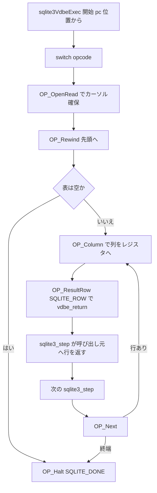

# 第13章 VDBE バイトコードエンジン

> **本章で読むソース**
>
> - [src/vdbe.c](https://github.com/sqlite/sqlite/blob/version-3.53.3/src/vdbe.c)
> - [src/vdbe.h](https://github.com/sqlite/sqlite/blob/version-3.53.3/src/vdbe.h)
> - [src/vdbeInt.h](https://github.com/sqlite/sqlite/blob/version-3.53.3/src/vdbeInt.h)
> - [main.mk](https://github.com/sqlite/sqlite/blob/version-3.53.3/main.mk)
> - [tool/mkopcodeh.tcl](https://github.com/sqlite/sqlite/blob/version-3.53.3/tool/mkopcodeh.tcl)

## この章の狙い

第2章で `sqlite3_step` が VDBE を起動する入口であることは触れた。
本章ではその内側、すなわち `sqlite3VdbeExec` が `aOp[]` をどう解釈するかを読む。
コンパイラが積んだ `OP_*` 命令がレジスタ `aMem[]` とカーソル `apCsr[]` を更新し、行返却や完了へ至るまでの実行経路を追う。

## 前提

**VDBE**（Virtual DataBase Engine）は SQLite の仮想マシンである。
1命令は `VdbeOp`（別名 `Op`）で、opcode 番号とオペランド `p1` から `p5`、`p4` 共用体を持つ。
実行中の文脈は `Vdbe` 構造体に集約され、プログラムカウンタ `pc`、レジスタ配列 `aMem`、カーソル配列 `apCsr`、戻り値 `rc` が中心になる。
`eVdbeState` は `VDBE_INIT_STATE`（構築中）、`VDBE_READY_STATE`、`VDBE_RUN_STATE`、`VDBE_HALT_STATE` の4段階を表す。

[src/vdbe.h L55-L94](https://github.com/sqlite/sqlite/blob/version-3.53.3/src/vdbe.h#L55-L94)

```c
struct VdbeOp {
  u8 opcode;          /* What operation to perform */
  signed char p4type; /* One of the P4_xxx constants for p4 */
  u16 p5;             /* Fifth parameter is an unsigned 16-bit integer */
  int p1;             /* First operand */
  int p2;             /* Second parameter (often the jump destination) */
  int p3;             /* The third parameter */
  union p4union {     /* fourth parameter */
    int i;                 /* Integer value if p4type==P4_INT32 */
    void *p;               /* Generic pointer */
    char *z;               /* Pointer to data for string (char array) types */
    i64 *pI64;             /* Used when p4type is P4_INT64 */
    double *pReal;         /* Used when p4type is P4_REAL */
    FuncDef *pFunc;        /* Used when p4type is P4_FUNCDEF */
    sqlite3_context *pCtx; /* Used when p4type is P4_FUNCCTX */
    CollSeq *pColl;        /* Used when p4type is P4_COLLSEQ */
    Mem *pMem;             /* Used when p4type is P4_MEM */
    VTable *pVtab;         /* Used when p4type is P4_VTAB */
    KeyInfo *pKeyInfo;     /* Used when p4type is P4_KEYINFO */
    u32 *ai;               /* Used when p4type is P4_INTARRAY */
    SubProgram *pProgram;  /* Used when p4type is P4_SUBPROGRAM */
    Table *pTab;           /* Used when p4type is P4_TABLE */
    SubrtnSig *pSubrtnSig; /* Used when p4type is P4_SUBRTNSIG */
    Index *pIdx;           /* Used when p4type is P4_INDEX */
#ifdef SQLITE_ENABLE_CURSOR_HINTS
    Expr *pExpr;           /* Used when p4type is P4_EXPR */
#endif
  } p4;
#ifdef SQLITE_ENABLE_EXPLAIN_COMMENTS
  char *zComment;          /* Comment to improve readability */
#endif
#ifdef SQLITE_VDBE_COVERAGE
  u32 iSrcLine;            /* Source-code line that generated this opcode
                           ** with flags in the upper 8 bits */
#endif
#if defined(SQLITE_ENABLE_STMT_SCANSTATUS) || defined(VDBE_PROFILE)
  u64 nExec;
  u64 nCycle;
#endif
};
```

[src/vdbeInt.h L458-L537](https://github.com/sqlite/sqlite/blob/version-3.53.3/src/vdbeInt.h#L458-L537)

```c
struct Vdbe {
  sqlite3 *db;            /* The database connection that owns this statement */
  Vdbe **ppVPrev,*pVNext; /* Linked list of VDBEs with the same Vdbe.db */
  Parse *pParse;          /* Parsing context used to create this Vdbe */
  ynVar nVar;             /* Number of entries in aVar[] */
  int nMem;               /* Number of memory locations currently allocated */
  int nCursor;            /* Number of slots in apCsr[] */
  u32 cacheCtr;           /* VdbeCursor row cache generation counter */
  int pc;                 /* The program counter */
  int rc;                 /* Value to return */
  // ... (中略) ...
  Op *aOp;                /* Space to hold the virtual machine's program */
  int nOp;                /* Number of instructions in the program */
  int nOpAlloc;           /* Slots allocated for aOp[] */
  Mem *aColName;          /* Column names to return */
  Mem *pResultRow;        /* Current output row */
  char *zErrMsg;          /* Error message written here */
  VList *pVList;          /* Name of variables */
  // ... (中略) ...
  u16 nResColumn;         /* Number of columns in one row of the result set */
  u8 eVdbeState;          /* On of the VDBE_*_STATE values */
  // ... (中略) ...
};
```

opcode の整数値はビルド時に `vdbe.c` の `case OP_*` 行を走査して生成される。
生成物 `opcodes.h` はリポジトリに含まれないため、本章では生成規則だけを示す。

[main.mk L1444-L1451](https://github.com/sqlite/sqlite/blob/version-3.53.3/main.mk#L1444-L1451)

```makefile
# Rules to build opcodes.c and opcodes.h
#
opcodes.c:	opcodes.h $(TOP)/tool/mkopcodec.tcl $(B.tclsh)
	$(B.tclsh) $(TOP)/tool/mkopcodec.tcl opcodes.h >opcodes.c

opcodes.h:	parse.h $(TOP)/src/vdbe.c \
		$(TOP)/tool/mkopcodeh.tcl $(B.tclsh)
	cat parse.h $(TOP)/src/vdbe.c | $(B.tclsh) $(TOP)/tool/mkopcodeh.tcl >opcodes.h
```

`mkopcodeh.tcl` は `case OP_aaaa:` 行を読み、コメント `/* same as TK_bbbbb */` があればパーサの `TK_` 定数と同じ番号を割り当てる。
`TK_ADD` と `OP_Add` を一致させることで、式コード生成時の変換を省く。

[tool/mkopcodeh.tcl L1-L23](https://github.com/sqlite/sqlite/blob/version-3.53.3/tool/mkopcodeh.tcl#L1-L23)

```tcl
# Generate the file opcodes.h.
#
# This TCL script scans a concatenation of the parse.h output file from the
# parser and the vdbe.c source file in order to generate the opcodes numbers
# for all opcodes.  
#
# The lines of the vdbe.c that we are interested in are of the form:
#
#       case OP_aaaa:      /* same as TK_bbbbb */
#
# The TK_ comment is optional.  If it is present, then the value assigned to
# the OP_ is the same as the TK_ value.  If missing, the OP_ value is assigned
# a small integer that is different from every other OP_ value.
#
# We go to the trouble of making some OP_ values the same as TK_ values
# as an optimization.  During parsing, things like expression operators
# are coded with TK_ values such as TK_ADD, TK_DIVIDE, and so forth.  Later
# during code generation, we need to generate corresponding opcodes like
# OP_Add and OP_Divide.  By making TK_ADD==OP_Add and TK_DIVIDE==OP_Divide,
# code to translate from one to the other is avoided.  This makes the
# code generator smaller and faster.
```

## sqlite3VdbeExec：ディスパッチループ

`sqlite3VdbeExec` は `sqlite3_step` から呼ばれ、準備済みプログラムを先頭または `pc` 位置から実行する。
入口では `aOp` と `aMem` をローカル変数にコピーし、`for(pOp=&aOp[p->pc]; 1; pOp++)` で命令を順に（またはジャンプで）処理する。
`switch(pOp->opcode)` の各 `case` が1 opcode の実装本体である。

[src/vdbe.c L846-L931](https://github.com/sqlite/sqlite/blob/version-3.53.3/src/vdbe.c#L846-L931)

```c
int sqlite3VdbeExec(
  Vdbe *p                    /* The VDBE */
){
  Op *aOp = p->aOp;          /* Copy of p->aOp */
  Op *pOp = aOp;             /* Current operation */
  // ... (中略) ...
  int rc = SQLITE_OK;        /* Value to return */
  sqlite3 *db = p->db;       /* The database */
  // ... (中略) ...
  Mem *aMem = p->aMem;       /* Copy of p->aMem */
  Mem *pIn1 = 0;             /* 1st input operand */
  Mem *pIn2 = 0;             /* 2nd input operand */
  Mem *pIn3 = 0;             /* 3rd input operand */
  Mem *pOut = 0;             /* Output operand */
  u32 colCacheCtr = 0;       /* Column cache counter */
  // ... (中略) ...
  assert( p->eVdbeState==VDBE_RUN_STATE );  /* sqlite3_step() verifies this */
  // ... (中略) ...
  for(pOp=&aOp[p->pc]; 1; pOp++){
    /* Errors are detected by individual opcodes, with an immediate
    ** jumps to abort_due_to_error. */
    assert( rc==SQLITE_OK );

    assert( pOp>=aOp && pOp<&aOp[p->nOp]);
    nVmStep++;
    // ... (中略) ...
    switch( pOp->opcode ){
```

ループ末尾では `pOp++` が暗黙に進み、ジャンプ命令は `pOp` を書き換えて次の命令を指す。
`default` 節は `OP_Noop` と `OP_Explain` を受け、通常命令は `break` で次命令へ進む。

## 制御転送と完了

**OP_Goto** は無条件ジャンプで、`pOp = &aOp[pOp->p2 - 1]` のあと `check_for_interrupt` ラベルへ飛ぶ。
ループ底辺（`OP_Next` など）も同じラベルへ集約され、割り込み確認と progress コールバックをまとめて実行する。

[src/vdbe.c L1063-L1111](https://github.com/sqlite/sqlite/blob/version-3.53.3/src/vdbe.c#L1063-L1111)

```c
case OP_Goto: {             /* jump */

#ifdef SQLITE_DEBUG
  // ... (中略) ...
#endif

jump_to_p2_and_check_for_interrupt:
  pOp = &aOp[pOp->p2 - 1];

  /* Opcodes that are used as the bottom of a loop (OP_Next, OP_Prev,
  ** OP_VNext, or OP_SorterNext) all jump here upon
  ** completion.  Check to see if sqlite3_interrupt() has been called
  ** or if the progress callback needs to be invoked.
  **
  ** This code uses unstructured "goto" statements and does not look clean.
  ** But that is not due to sloppy coding habits. The code is written this
  ** way for performance, to avoid having to run the interrupt and progress
  ** checks on every opcode.  This helps sqlite3_step() to run about 1.5%
  ** faster according to "valgrind --tool=cachegrind" */
check_for_interrupt:
  if( AtomicLoad(&db->u1.isInterrupted) ) goto abort_due_to_interrupt;
#ifndef SQLITE_OMIT_PROGRESS_CALLBACK
  // ... (中略) ...
#endif
 
  break;
}
```

**OP_Halt** はプログラム終了を表し、`sqlite3VdbeHalt` を経て `vdbe_return` へ進む。
戻り値は `SQLITE_DONE`（正常完了）または `SQLITE_ERROR`（制約違反など）に変換される。

[src/vdbe.c L1293-L1363](https://github.com/sqlite/sqlite/blob/version-3.53.3/src/vdbe.c#L1293-L1363)

```c
case OP_Halt: {
  VdbeFrame *pFrame;
  int pcx;
  // ... (中略) ...
  p->rc = pOp->p1;
  p->errorAction = (u8)pOp->p2;
  // ... (中略) ...
  rc = sqlite3VdbeHalt(p);
  assert( rc==SQLITE_BUSY || rc==SQLITE_OK || rc==SQLITE_ERROR );
  if( rc==SQLITE_BUSY ){
    p->rc = SQLITE_BUSY;
  }else{
    assert( rc==SQLITE_OK || (p->rc&0xff)==SQLITE_CONSTRAINT );
    assert( rc==SQLITE_OK || db->nDeferredCons>0 || db->nDeferredImmCons>0 );
    rc = p->rc ? SQLITE_ERROR : SQLITE_DONE;
  }
  goto vdbe_return;
}
```

`vdbe_return` は唯一の出口で、B-tree ロック解放、仮想マシンステップカウンタ更新、`rc` 返却を行う。

[src/vdbe.c L9326-L9356](https://github.com/sqlite/sqlite/blob/version-3.53.3/src/vdbe.c#L9326-L9356)

```c
vdbe_return:
  // ... (中略) ...
  p->aCounter[SQLITE_STMTSTATUS_VM_STEP] += (int)nVmStep;
  if( DbMaskNonZero(p->lockMask) ){
    sqlite3VdbeLeave(p);
  }
  assert( rc!=SQLITE_OK || nExtraDelete==0
       || sqlite3_strlike("DELETE%",p->zSql,0)!=0
  );
  return rc;
```

## レジスタ操作と行の返却

定数ロードは **OP_Integer** のように `out2Prerelease` で出力レジスタを確保し、`pOp->p1` を `Mem` に書き込む。

[src/vdbe.c L1371-L1374](https://github.com/sqlite/sqlite/blob/version-3.53.3/src/vdbe.c#L1371-L1374)

```c
case OP_Integer: {         /* out2 */
  pOut = out2Prerelease(p, pOp);
  pOut->u.i = pOp->p1;
  break;
}
```

SELECT の結果行は **OP_ResultRow** で公開される。
`p->pResultRow` にレジスタブロックを指し、`rc = SQLITE_ROW` のまま `vdbe_return` へ抜ける。
第2章の `sqlite3_column_*` はこの `pResultRow` を読む。

[src/vdbe.c L1746-L1776](https://github.com/sqlite/sqlite/blob/version-3.53.3/src/vdbe.c#L1746-L1776)

```c
case OP_ResultRow: {
  assert( p->nResColumn==pOp->p2 );
  assert( pOp->p1>0 || CORRUPT_DB );
  assert( pOp->p1+pOp->p2<=(p->nMem+1 - p->nCursor)+1 );

  p->cacheCtr = (p->cacheCtr + 2)|1;
  p->pResultRow = &aMem[pOp->p1];
  // ... (中略) ...
  if( db->mallocFailed ) goto no_mem;
  if( db->mTrace & SQLITE_TRACE_ROW ){
    db->trace.xV2(SQLITE_TRACE_ROW, db->pTraceArg, p, 0);
  }
  p->pc = (int)(pOp - aOp) + 1;
  rc = SQLITE_ROW;
  goto vdbe_return;
}
```

## カーソルとテーブル走査

**OP_OpenRead** は B-tree カーソルを開き、`allocateCursor` で `VdbeCursor` を確保する。
`p2` はルートページ、`p3` はデータベース番号、`p4` は `KeyInfo` または列数を渡す。

[src/vdbe.c L4386-L4454](https://github.com/sqlite/sqlite/blob/version-3.53.3/src/vdbe.c#L4386-L4454)

```c
case OP_OpenRead:            /* ncycle */
case OP_OpenWrite:

  assert( pOp->opcode==OP_OpenWrite || pOp->p5==0 || pOp->p5==OPFLAG_SEEKEQ );
  assert( p->bIsReader );
  // ... (中略) ...
  if( pOp->p4type==P4_KEYINFO ){
    pKeyInfo = pOp->p4.pKeyInfo;
    assert( pKeyInfo->enc==ENC(db) );
    assert( pKeyInfo->db==db );
    nField = pKeyInfo->nAllField;
  }else if( pOp->p4type==P4_INT32 ){
    nField = pOp->p4.i;
  }
  assert( pOp->p1>=0 );
  assert( nField>=0 );
  testcase( nField==0 );  /* Table with INTEGER PRIMARY KEY and nothing else */
  pCur = allocateCursor(p, pOp->p1, nField, CURTYPE_BTREE);
  if( pCur==0 ) goto no_mem;
  pCur->iDb = iDb;
  pCur->nullRow = 1;
  pCur->isOrdered = 1;
  pCur->pgnoRoot = p2;
  // ... (中略) ...
  rc = sqlite3BtreeCursor(pX, p2, wrFlag, pKeyInfo, pCur->uc.pCursor);
  pCur->pKeyInfo = pKeyInfo;
  pCur->isTable = pOp->p4type!=P4_KEYINFO;
```

`allocateCursor` はカーソル番号 `iCur` に対応する `Mem` セルから `VdbeCursor` を確保する。
カーソル0は `aMem[0]`、それ以外はレジスタ領域の末尾から逆順に割り当てる。

[src/vdbe.c L253-L320](https://github.com/sqlite/sqlite/blob/version-3.53.3/src/vdbe.c#L253-L320)

```c
static VdbeCursor *allocateCursor(
  Vdbe *p,              /* The virtual machine */
  int iCur,             /* Index of the new VdbeCursor */
  int nField,           /* Number of fields in the table or index */
  u8 eCurType           /* Type of the new cursor */
){
  /* Find the memory cell that will be used to store the blob of memory
  ** required for this VdbeCursor structure. It is convenient to use a
  ** vdbe memory cell to manage the memory allocation required for a
  ** VdbeCursor structure for the following reasons:
  **
  **   * Sometimes cursor numbers are used for a couple of different
  **     purposes in a vdbe program. The different uses might require
  **     different sized allocations. Memory cells provide growable
  **     allocations.
  // ... (中略) ...
  ** The memory cell for cursor 0 is aMem[0]. The rest are allocated from
  ** the top of the register space.  Cursor 1 is at Mem[p->nMem-1].
  ** Cursor 2 is at Mem[p->nMem-2]. And so forth.
  */
  Mem *pMem = iCur>0 ? &p->aMem[p->nMem-iCur] : p->aMem;
  // ... (中略) ...
  p->apCsr[iCur] = pCx = (VdbeCursor*)pMem->zMalloc;
  memset(pCx, 0, offsetof(VdbeCursor,pAltCursor));
  pCx->eCurType = eCurType;
  pCx->nField = nField;
  pCx->aOffset = &pCx->aType[nField];
  if( eCurType==CURTYPE_BTREE ){
    assert( ROUND8(SZ_VDBECURSOR(nField))==SZ_VDBECURSOR(nField) );
    pCx->uc.pCursor = (BtCursor*)&pMem->z[SZ_VDBECURSOR(nField)];
    sqlite3BtreeCursorZero(pCx->uc.pCursor);
  }
  return pCx;
}
```

**OP_Rewind** はカーソルを先頭へ移し、表が空なら `p2` へジャンプする。
**OP_Next** は次行へ進み、成功時は `p2` へループバックする。

[src/vdbe.c L6372-L6404](https://github.com/sqlite/sqlite/blob/version-3.53.3/src/vdbe.c#L6372-L6404)

```c
case OP_Rewind: {        /* jump0, ncycle */
  VdbeCursor *pC;
  BtCursor *pCrsr;
  int res;
  // ... (中略) ...
  pC = p->apCsr[pOp->p1];
  assert( pC!=0 );
  // ... (中略) ...
    pCrsr = pC->uc.pCursor;
    assert( pCrsr );
    rc = sqlite3BtreeFirst(pCrsr, &res);
    pC->deferredMoveto = 0;
    pC->cacheStatus = CACHE_STALE;
  if( rc ) goto abort_due_to_error;
  pC->nullRow = (u8)res;
  if( pOp->p2>0 ){
    VdbeBranchTaken(res!=0,2);
    if( res ) goto jump_to_p2;
  }
  break;
}
```

[src/vdbe.c L6510-L6539](https://github.com/sqlite/sqlite/blob/version-3.53.3/src/vdbe.c#L6510-L6539)

```c
case OP_Next:          /* jump, ncycle */
  // ... (中略) ...
  pC = p->apCsr[pOp->p1];
  assert( pC!=0 );
  assert( pC->deferredMoveto==0 );
  assert( pC->eCurType==CURTYPE_BTREE );
  // ... (中略) ...
  rc = sqlite3BtreeNext(pC->uc.pCursor, pOp->p3);

next_tail:
  pC->cacheStatus = CACHE_STALE;
  VdbeBranchTaken(rc==SQLITE_OK,2);
  if( rc==SQLITE_OK ){
    pC->nullRow = 0;
    p->aCounter[pOp->p5]++;
    goto jump_to_p2_and_check_for_interrupt;
  }
  if( rc!=SQLITE_DONE ) goto abort_due_to_error;
  rc = SQLITE_OK;
  pC->nullRow = 1;
  goto check_for_interrupt;
}
```

**OP_Column** は現在行から列 `p2` をデコードし、レジスタ `p3` へ載せる。
`pC->cacheStatus != p->cacheCtr` のときだけ `sqlite3BtreePayloadSize`/`PayloadFetch`、カーソル移動確認、レコードヘッダと列オフセットの解析を行う。
同一行の後続 `OP_Column` では、ローカル payload ポインタと既解析のヘッダ情報を再利用して初期取得とヘッダ再解析を省く。
列値がローカルページに収まらない場合は、列ごとの overflow payload 読み出しは残る。

[src/vdbe.c L2975-L3047](https://github.com/sqlite/sqlite/blob/version-3.53.3/src/vdbe.c#L2975-L3047)

```c
case OP_Column: {            /* ncycle */
  u32 p2;            /* column number to retrieve */
  VdbeCursor *pC;    /* The VDBE cursor */
  BtCursor *pCrsr;   /* The B-Tree cursor corresponding to pC */
  // ... (中略) ...
  pC = p->apCsr[pOp->p1];
  p2 = (u32)pOp->p2;

op_column_restart:
  assert( pC!=0 );
  // ... (中略) ...
  if( pC->cacheStatus!=p->cacheCtr ){                /*OPTIMIZATION-IF-FALSE*/
    if( pC->nullRow ){
      // ... (中略) ...
    }else{
      pCrsr = pC->uc.pCursor;
      // ... (中略) ...
      pC->payloadSize = sqlite3BtreePayloadSize(pCrsr);
      pC->aRow = sqlite3BtreePayloadFetch(pCrsr, &pC->szRow);
      assert( pC->szRow<=pC->payloadSize );
      assert( pC->szRow<=65536 );  /* Maximum page size is 64KiB */
    }
    pC->cacheStatus = p->cacheCtr;
    if( (aOffset[0] = pC->aRow[0])<0x80 ){
      pC->iHdrOffset = 1;
    }else{
      pC->iHdrOffset = sqlite3GetVarint32(pC->aRow, aOffset);
    }
    pC->nHdrParsed = 0;
    // ... (中略) ...
  }
```

## 処理の流れ

典型的な `SELECT * FROM t` の実行は、カーソルオープン、先頭化、列読み出し、行返却、次行ループの連鎖になる。



## 高速化と最適化の工夫

ループ底辺への `goto check_for_interrupt` 集約は、全 opcode ごとの割り込み確認を避け、`sqlite3_step` のオーバーヘッドを下げる。
`OP_Column` の `cacheStatus` と `cacheCtr` は、ローカル payload ポインタとヘッダ解析結果をカーソルに保持し、同一行の後続列読み出しで初期取得と既解析ヘッダ処理を省く。
`TK_*` と `OP_*` の番号共有はコンパイラ側の変換テーブルを不要にし、生成コードの密度を上げる。

## まとめ

VDBE 実行の中心は `sqlite3VdbeExec` の `switch` である。
`OP_Goto` と `OP_Next` が制御フローを形作り、`OP_ResultRow` と `OP_Halt` が `sqlite3_step` の戻り値を決める。
カーソルは `allocateCursor` で `Mem` セルに同居し、B-tree 操作は `VdbeCursor` 経由で行われる。
opcode 番号は `vdbe.c` の `case` 行から機械生成され、実行時挙動の正本は常に `vdbe.c` 側にある。

## 関連する章

- [第2章 公開 API と文のライフサイクル](../part01-frontend/02-api-lifecycle.md)（`sqlite3_step` と `VDBE_RUN_STATE`）
- [第6章 式のコード生成と定数式因数分解](../part02-compiler/06-expr-codegen.md)（`OP_Add` などの生成側）
- [第14章 VDBE プログラムの構築](14-vdbe-build.md)（`sqlite3VdbeAddOp*` と `sqlite3VdbeMakeReady`）
- [第15章 Mem 値の表現と型アフィニティ](15-mem-affinity.md)（`Mem` の型変換と `OP_Affinity`）
